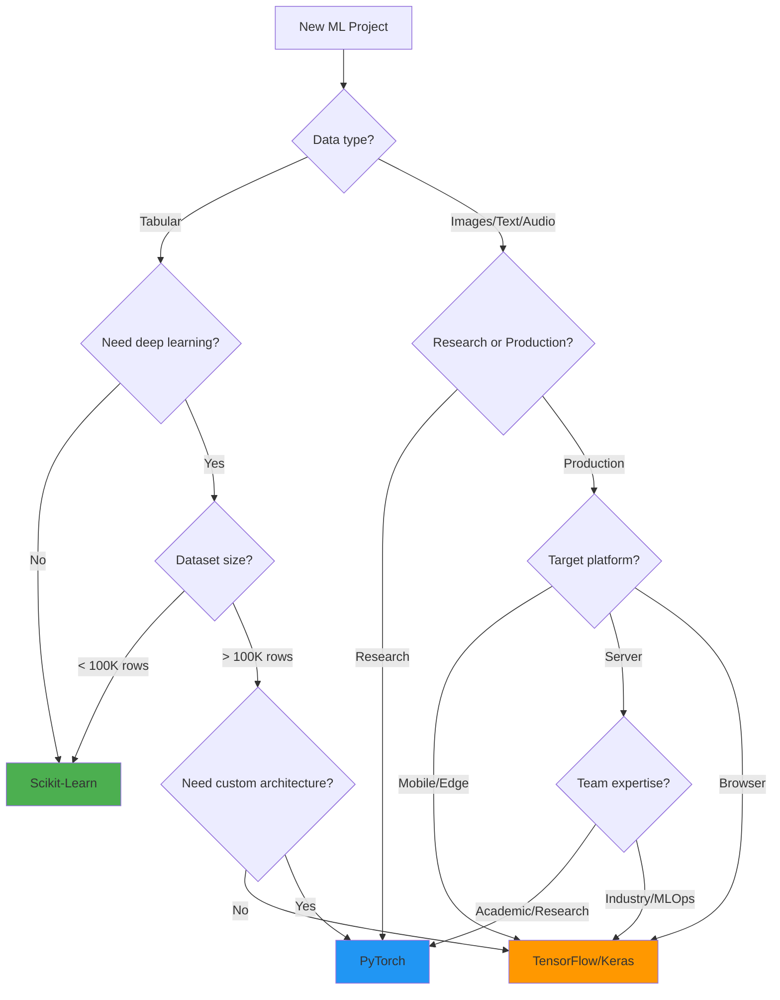

# Framework Comparison Project: Same Task, Three Frameworks

## Overview

Binary classification on the **Breast Cancer Wisconsin** dataset using a 2-layer neural network implemented in Scikit-Learn, PyTorch, and TensorFlow/Keras.

**Dataset**: 569 samples, 30 features, binary target (malignant/benign)

---

## Common Setup (All Frameworks)

```python
import numpy as np
from sklearn.datasets import load_breast_cancer
from sklearn.model_selection import train_test_split
from sklearn.preprocessing import StandardScaler
from sklearn.metrics import accuracy_score, roc_auc_score, classification_report

# Load and preprocess
data = load_breast_cancer()
X, y = data.data, data.target

X_train, X_test, y_train, y_test = train_test_split(
    X, y, test_size=0.2, random_state=42, stratify=y
)

scaler = StandardScaler()
X_train = scaler.fit_transform(X_train)
X_test = scaler.transform(X_test)

print(f"Train: {X_train.shape}, Test: {X_test.shape}")
```

---

## Implementation 1: Scikit-Learn MLPClassifier

```python
from sklearn.neural_network import MLPClassifier

model = MLPClassifier(
    hidden_layer_sizes=(64, 32),
    activation='relu',
    max_iter=200,
    random_state=42,
    early_stopping=True,
    validation_fraction=0.1,
)

model.fit(X_train, y_train)
y_pred = model.predict(X_test)
y_prob = model.predict_proba(X_test)[:, 1]

print(f"Accuracy: {accuracy_score(y_test, y_pred):.4f}")
print(f"ROC-AUC: {roc_auc_score(y_test, y_prob):.4f}")
```

**Lines of code: ~10**

---

## Implementation 2: PyTorch

```python
import torch
import torch.nn as nn
from torch.utils.data import DataLoader, TensorDataset

# Data preparation
X_train_t = torch.FloatTensor(X_train)
y_train_t = torch.FloatTensor(y_train)
X_test_t = torch.FloatTensor(X_test)

train_dataset = TensorDataset(X_train_t, y_train_t)
train_loader = DataLoader(train_dataset, batch_size=32, shuffle=True)

# Model definition
class BinaryClassifier(nn.Module):
    def __init__(self, input_dim):
        super().__init__()
        self.network = nn.Sequential(
            nn.Linear(input_dim, 64),
            nn.ReLU(),
            nn.Dropout(0.2),
            nn.Linear(64, 32),
            nn.ReLU(),
            nn.Dropout(0.2),
            nn.Linear(32, 1),
            nn.Sigmoid()
        )
    
    def forward(self, x):
        return self.network(x)

model = BinaryClassifier(X_train.shape[1])
criterion = nn.BCELoss()
optimizer = torch.optim.Adam(model.parameters(), lr=0.001)

# Training loop
model.train()
for epoch in range(100):
    for X_batch, y_batch in train_loader:
        optimizer.zero_grad()
        output = model(X_batch).squeeze()
        loss = criterion(output, y_batch)
        loss.backward()
        optimizer.step()

# Evaluation
model.eval()
with torch.no_grad():
    y_prob = model(X_test_t).squeeze().numpy()
    y_pred = (y_prob > 0.5).astype(int)

print(f"Accuracy: {accuracy_score(y_test, y_pred):.4f}")
print(f"ROC-AUC: {roc_auc_score(y_test, y_prob):.4f}")
```

**Lines of code: ~50**

---

## Implementation 3: TensorFlow/Keras

```python
import tensorflow as tf
from tensorflow import keras

model = keras.Sequential([
    keras.layers.Dense(64, activation='relu', input_shape=(X_train.shape[1],)),
    keras.layers.Dropout(0.2),
    keras.layers.Dense(32, activation='relu'),
    keras.layers.Dropout(0.2),
    keras.layers.Dense(1, activation='sigmoid'),
])

model.compile(
    optimizer='adam',
    loss='binary_crossentropy',
    metrics=['accuracy']
)

history = model.fit(
    X_train, y_train,
    epochs=100,
    batch_size=32,
    validation_split=0.1,
    verbose=0,
    callbacks=[keras.callbacks.EarlyStopping(patience=10, restore_best_weights=True)]
)

y_prob = model.predict(X_test, verbose=0).flatten()
y_pred = (y_prob > 0.5).astype(int)

print(f"Accuracy: {accuracy_score(y_test, y_pred):.4f}")
print(f"ROC-AUC: {roc_auc_score(y_test, y_prob):.4f}")
```

**Lines of code: ~30**

---

## Side-by-Side Comparison

### Data Loading

| Aspect | Scikit-Learn | PyTorch | TensorFlow |
|--------|-------------|---------|------------|
| Input format | NumPy array | Tensor + DataLoader | NumPy array |
| Batching | Automatic | Manual (DataLoader) | Automatic (fit) |
| Extra code | None | ~5 lines | None |

### Model Definition

| Aspect | Scikit-Learn | PyTorch | TensorFlow |
|--------|-------------|---------|------------|
| Style | Constructor params | Class inheritance | Sequential/Functional |
| Flexibility | Low (fixed archs) | Maximum | High |
| Lines | 1 | 15 | 8 |

### Training

| Aspect | Scikit-Learn | PyTorch | TensorFlow |
|--------|-------------|---------|------------|
| API | `model.fit(X, y)` | Manual loop | `model.fit(X, y)` |
| Gradient mgmt | Hidden | Manual | Hidden |
| Callbacks | None | Manual | Built-in system |
| Early stopping | Parameter | Manual | Callback |
| Lines | 1 | 10 | 5 |

### Evaluation

| Aspect | Scikit-Learn | PyTorch | TensorFlow |
|--------|-------------|---------|------------|
| Predict | `model.predict(X)` | Manual + no_grad | `model.predict(X)` |
| Metrics | Built-in rich set | Manual/torchmetrics | Built-in + keras.metrics |
| Lines | 2 | 5 | 3 |

### Saving/Loading

| Aspect | Scikit-Learn | PyTorch | TensorFlow |
|--------|-------------|---------|------------|
| Save | `joblib.dump(model)` | `torch.save(state_dict)` | `model.save('path')` |
| Load | `joblib.load(path)` | `model.load_state_dict()` | `keras.models.load_model()` |
| Format | pickle/joblib | .pt/.pth | SavedModel/H5 |
| ONNX | skl2onnx | torch.onnx.export | tf2onnx |

### Deployment

| Aspect | Scikit-Learn | PyTorch | TensorFlow |
|--------|-------------|---------|------------|
| Serving | Flask/FastAPI + joblib | TorchServe | TF Serving |
| Mobile | No | PyTorch Mobile | TFLite |
| Browser | No (ONNX.js) | No (ONNX.js) | TensorFlow.js |
| Edge | ONNX Runtime | PyTorch Mobile | TFLite Micro |

---

## Performance Comparison

| Metric | Scikit-Learn | PyTorch | TensorFlow |
|--------|-------------|---------|------------|
| Training time | ~0.5s | ~2s | ~3s |
| Inference (1 sample) | ~0.1ms | ~0.5ms | ~1ms |
| Memory usage | ~50MB | ~200MB | ~500MB |
| Accuracy* | ~97% | ~97% | ~97% |
| Lines of code | 10 | 50 | 30 |
| Setup complexity | pip install sklearn | pip install torch | pip install tensorflow |
| Package size | ~30MB | ~800MB | ~1.5GB |

*All achieve similar accuracy on this simple task; differences emerge with complex architectures.

---

## Complexity vs Control Tradeoff

```
Control/Flexibility
     ▲
     │
     │              ★ PyTorch
     │              (Full control, custom everything)
     │
     │         ★ TensorFlow/Keras
     │         (Good balance, production tools)
     │
     │    ★ Scikit-Learn
     │    (Minimal control, maximum simplicity)
     │
     └──────────────────────────────────▶ Simplicity/Speed of Development
```

---

## When to Use Which Framework

### Decision Flowchart



### Quick Decision Rules

| Scenario | Recommendation |
|----------|---------------|
| Quick prototyping / EDA | **Scikit-Learn** |
| Tabular data, classic ML | **Scikit-Learn** |
| Custom research model | **PyTorch** |
| NLP with transformers | **PyTorch** + HuggingFace |
| Computer vision (custom) | **PyTorch** |
| Mobile deployment | **TensorFlow** (TFLite) |
| Browser deployment | **TensorFlow** (TF.js) |
| Production at Google-scale | **TensorFlow** |
| Kaggle competition | **Scikit-Learn** + XGBoost/LightGBM |
| Teaching/Learning ML | **Scikit-Learn** |
| Reinforcement learning | **PyTorch** |
| Generative AI | **PyTorch** |
| MLOps pipeline | **TensorFlow** (TFX) or **MLflow** + any |
| Edge/IoT | **TensorFlow** (TFLite Micro) |

---

## Hybrid Approach (Real-World Best Practice)

Most production systems combine frameworks:

```python
# 1. EDA and baseline with sklearn
from sklearn.ensemble import GradientBoostingClassifier
baseline = GradientBoostingClassifier()
baseline.fit(X_train, y_train)
print(f"Baseline accuracy: {baseline.score(X_test, y_test):.4f}")

# 2. If deep learning needed, switch to PyTorch/TF
# 3. Use sklearn for:
#    - Preprocessing (StandardScaler, LabelEncoder)
#    - Metrics (classification_report, roc_auc_score)
#    - Cross-validation (cross_val_score)
#    - Feature selection (SelectKBest)

# 4. Use PyTorch/TF for:
#    - Custom neural architectures
#    - GPU training
#    - Transfer learning
```

---

## Framework Evolution & Ecosystem

```
2010        2015        2020        2025
  │           │           │           │
  │ sklearn   │           │           │
  │ (0.1)     │ sklearn   │ sklearn   │ sklearn 1.4+
  │           │ stable    │ 1.0       │ (still king for tabular)
  │           │           │           │
  │           │ TF 1.0    │ TF 2.x   │ TF/Keras unified
  │           │ (Google)  │ (Keras)   │ (JAX rising)
  │           │           │           │
  │           │           │ PyTorch   │ PyTorch 2.0+
  │           │ Torch/    │ dominates │ (compile, export)
  │           │ Caffe     │ research  │
  │           │           │           │
  │           │           │           │ JAX/Flax
  │           │           │           │ (Google Research)
```

---

## Summary Table

| Dimension | Scikit-Learn | PyTorch | TensorFlow |
|-----------|-------------|---------|------------|
| Learning curve | Easy | Medium | Medium |
| Flexibility | Low | Very High | High |
| GPU support | No* | Yes | Yes |
| Distributed | Limited | Yes (DDP) | Yes (Strategy) |
| Debugging | Easy | Easy (eager) | Easy (eager in 2.x) |
| Community | Large | Very Large | Very Large |
| Industry adoption | Universal | Growing fast | Established |
| Research papers | Few | Majority | Some |
| Production tools | Basic | TorchServe | TFX, TF Serving |
| Model zoo | No | torchvision/hub | TF Hub, Keras Apps |
| Best for | Classical ML | Research + Custom DL | Production DL |

*sklearn can use GPU via cuML (RAPIDS) for some algorithms.
