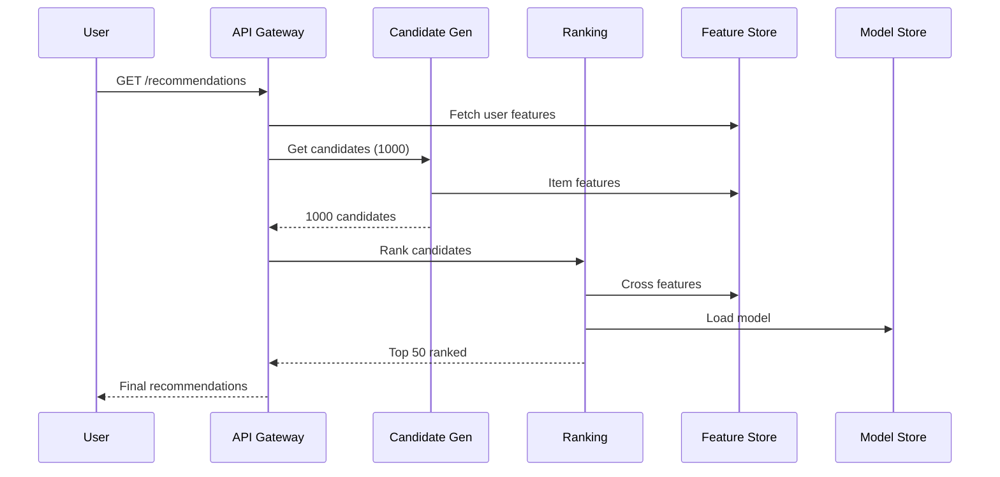
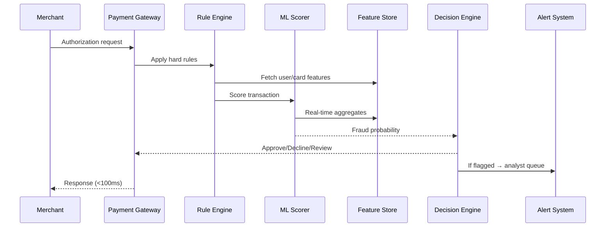
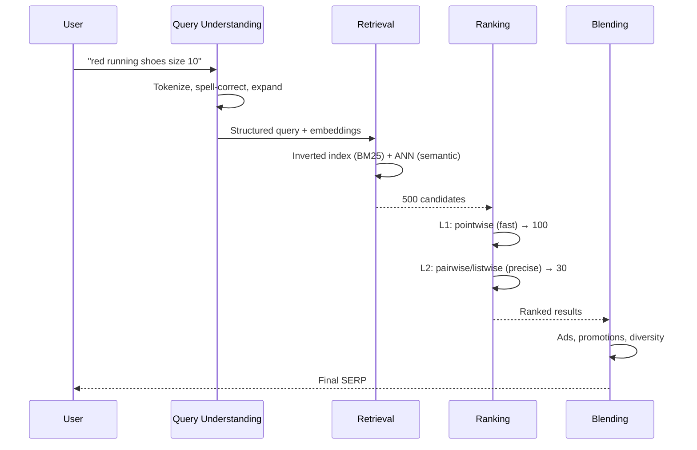

# ML System Design Interview Guide — Staff Architect Level

## 1. Framework: How to Approach ML System Design Interviews

### The 7-Step Framework (45-minute interview)

| Step | Time | Focus |
|------|------|-------|
| 1. Clarify Requirements | 5 min | Scope, constraints, scale |
| 2. Define Metrics | 3 min | Business + ML metrics |
| 3. High-Level Architecture | 5 min | Components, data flow |
| 4. Data Pipeline | 7 min | Collection, processing, storage |
| 5. Model Design | 10 min | Features, architecture, training |
| 6. Serving & Inference | 8 min | Latency, throughput, scaling |
| 7. Evaluation & Monitoring | 7 min | Offline/online, drift, alerts |

### Key Principles

1. **Start with the business problem**, not the model
2. **Quantify scale early** — drives every architectural decision
3. **Discuss trade-offs explicitly** — there are no perfect solutions
4. **Show depth in 2-3 areas** rather than surface coverage of all
5. **Connect ML metrics to business metrics** — precision/recall → revenue impact

### Questions to Ask First

- What is the primary business objective? (engagement? revenue? safety?)
- What scale are we designing for? (users, requests/sec, data volume)
- What latency requirements? (real-time <100ms? near-real-time <1s? batch?)
- What's the team size and ML maturity? (affects build vs. buy decisions)
- Cold start problem? (new users/items with no history)
- Regulatory/compliance constraints? (GDPR, fairness, explainability)

---

## 2. Worked Example: Recommendation System (Netflix/YouTube Scale)

### 2.1 Requirements Gathering

**Functional:**
- Recommend videos/movies to users on home page
- Personalized per user based on history, preferences, context
- Support multiple surfaces: home feed, "because you watched X", search results

**Non-Functional:**
- 500M monthly active users
- Home page loads in <200ms (recommendation latency <50ms)
- Catalog: 100M items
- Update recommendations as user watches/rates content
- Handle cold-start (new users, new content)

**Scale Estimation:**
- 500M MAU × 5 sessions/day = 2.5B requests/day ≈ 30K QPS
- Peak: 3× average = 90K QPS
- Training data: billions of interaction events/day
- Feature store: 500M user profiles × 1KB = 500GB user features

### 2.2 High-Level Architecture



### 2.3 Multi-Stage Architecture

```
Stage 1: Candidate Generation (recall-focused)
├── Collaborative filtering (matrix factorization, ALS)
├── Content-based (item similarity via embeddings)
├── Popular/trending (cold-start fallback)
├── "Because you watched X" (item-to-item)
└── Output: ~1000 candidates per user (from 100M catalog)

Stage 2: Ranking (precision-focused)
├── Deep neural network (Wide & Deep, DCN, or DIN)
├── Features: user profile + item features + context + cross features
├── Output: score per candidate, select top 50
└── Latency budget: <30ms

Stage 3: Re-ranking (business rules + diversity)
├── Remove already-watched
├── Enforce diversity (genre, content type)
├── Apply business rules (promote originals, content deals)
└── Output: final ordered list for display
```

### 2.4 Data Pipeline Design

**Event Collection:**
- Client-side: impressions, clicks, scroll depth, dwell time
- Server-side: plays, completion %, skip patterns, ratings
- Kafka for real-time event streaming (partitioned by user_id)
- Events → Flink/Spark Streaming → Feature Store (real-time features)
- Events → S3/Data Lake → Spark batch → Training datasets

**Training Data Generation:**
- Positive signals: watched >70%, explicit rating ≥4, added to list
- Negative signals: impressed but not clicked, clicked but abandoned <10%
- Implicit feedback weighting: watch_time / video_length
- Sampling: negative sampling (4:1 ratio) for efficient training

### 2.5 Feature Engineering at Scale

| Feature Category | Examples | Update Frequency |
|-----------------|----------|-----------------|
| User static | age, country, language, subscription_tier | Daily |
| User behavioral | genres_watched_30d, avg_session_length, time_of_day_pref | Hourly |
| User real-time | last_3_watched, current_session_items, time_since_last | Real-time |
| Item static | genre, director, cast, release_year, duration | On change |
| Item popularity | views_7d, completion_rate, trending_score | Hourly |
| Cross features | user_genre_affinity × item_genre, collaborative_score | Daily |
| Context | time_of_day, day_of_week, device_type | Request-time |

**Feature Store Architecture:**
- Online store: Redis Cluster (p99 <5ms reads)
- Offline store: Delta Lake / Hive (batch feature computation)
- Streaming features: Flink → Redis (real-time aggregations)
- Feature registry: schema, ownership, lineage, freshness SLA

### 2.6 Model Training Infrastructure

- **Training framework:** TensorFlow/PyTorch on GPU cluster (8× A100 per job)
- **Data:** Petabytes in S3, loaded via tf.data / WebDataset
- **Schedule:** Full retrain weekly, incremental daily
- **Hyperparameter tuning:** Ray Tune / Optuna (Bayesian optimization)
- **Experiment tracking:** MLflow with model registry
- **Validation:** Hold-out set (last day), replay evaluation

### 2.7 Serving Architecture

**Real-time path (ranking):**
- Model served via TensorFlow Serving / Triton Inference Server
- GPU inference for ranking model (batched)
- Horizontal scaling: K8s HPA based on QPS + latency

**Batch path (candidate generation):**
- Precompute user embeddings + approximate nearest neighbors (ANN)
- ANN index: FAISS / ScaNN with 100M item embeddings
- Refresh embeddings every 6 hours

**Caching:**
- User recommendation cache (Redis, TTL=30min)
- Cache invalidation on significant user action
- Fallback: popular items if cache miss + model timeout

### 2.8 Evaluation Framework

**Offline Metrics:**
- NDCG@K, MAP@K, Recall@K (ranking quality)
- Coverage (% of catalog recommended)
- Diversity (intra-list diversity)
- AUC for click prediction model

**Online Metrics (A/B test):**
- Primary: hours_watched_per_user (engagement)
- Secondary: session_length, retention_d7, subscription_conversion
- Guardrail: content_diversity (avoid filter bubbles)

**A/B Testing:**
- Traffic split: 5% test, 95% control
- Duration: 2 weeks minimum (weekly seasonality)
- Statistical significance: p<0.05 with Bonferroni correction
- Interleaving for faster signal on ranking changes

### 2.9 Scaling Considerations

- **Sharding:** User features sharded by user_id hash, item features replicated
- **Geographic:** Deploy model replicas in each region (latency)
- **Graceful degradation:** If ranking service slow → serve cached / popular items
- **Cost optimization:** Use CPU for candidate gen, GPU only for ranking
- **Model compression:** Quantization (INT8), distillation for serving model

### 2.10 Monitoring & Observability

- Model metrics: prediction distribution shift, feature drift (KL divergence)
- System metrics: p50/p95/p99 latency, QPS, error rate, cache hit ratio
- Business metrics: real-time dashboard of engagement KPIs
- Alerts: feature staleness >2h, prediction NaN rate >0.1%, latency >100ms

---

## 3. Worked Example: Real-Time Fraud Detection System

### 3.1 Requirements

- Process credit card transactions in real-time (<100ms decision)
- 10,000 transactions per second (peak: 50K TPS)
- False positive rate <1% (blocking legitimate transactions is costly)
- Fraud detection rate >95% (miss rate <5%)
- Must handle adversarial concept drift (fraudsters adapt)
- Regulatory: explainability required for declined transactions

### 3.2 Architecture



### 3.3 Multi-Layer Defense

```
Layer 1: Hard Rules (deterministic, <5ms)
├── Velocity checks: >5 transactions in 1 minute
├── Blocklists: known fraudulent cards/merchants/IPs
├── Geo-impossible: transaction in NYC, then London in 30 min
└── Action: Instant block (no ML needed)

Layer 2: ML Scoring (<50ms)
├── Gradient Boosted Trees (XGBoost/LightGBM) — primary
├── Deep learning (LSTM on transaction sequences) — secondary
├── Ensemble: weighted combination
└── Output: fraud_probability [0, 1]

Layer 3: Decision Engine
├── probability > 0.9 → Decline
├── 0.5 < probability < 0.9 → Step-up auth (OTP/3DS)
├── probability < 0.5 → Approve
└── Thresholds tuned per merchant risk tolerance

Layer 4: Post-Transaction (async)
├── Graph-based analysis (fraud rings)
├── Human review queue for borderline cases
└── Feedback loop → model retraining
```

### 3.4 Feature Engineering

**Real-time features (computed on the fly):**
- Transaction amount vs. user's avg (z-score)
- Time since last transaction
- Count of transactions in last 1min/5min/1hr
- Distance from last transaction location
- New merchant flag

**Batch features (precomputed):**
- User spending pattern (by day-of-week, category)
- Merchant risk score (historical fraud rate)
- Card age, user tenure
- Device fingerprint history

**Graph features:**
- Shared device/IP with known fraud accounts
- Merchant-to-merchant transition patterns
- Account creation patterns (synthetic identities)

### 3.5 Model Training

- **Extreme class imbalance:** Fraud is ~0.1% of transactions
- **Handling:** SMOTE for training, focal loss, cost-sensitive learning
- **Training:** Retrain weekly, but hard rules update daily
- **Champion/Challenger:** Shadow mode for new models (score but don't decide)
- **Concept drift:** Monitor model performance daily, trigger retrain if AUC drops >2%

### 3.6 Serving Architecture

- **Feature Store:** Redis Cluster with <2ms p99 reads
- **Model:** XGBoost served via custom C++ server (low-latency)
- **Fallback:** If ML service down → rule-engine-only mode (higher false positives)
- **Throughput:** Horizontally scaled, stateless scoring pods
- **Consistency:** Eventually consistent features acceptable (1-2 second lag OK)

### 3.7 Monitoring

- **Real-time:** Fraud rate, decline rate, false positive rate (per hour)
- **Drift detection:** PSI (Population Stability Index) on features weekly
- **Alert:** If decline rate spikes >2× → possible model issue or attack
- **Feedback latency:** Chargebacks arrive 30-90 days later → delayed labels problem
- **Solution:** Use early fraud signals (customer disputes within 48h) for faster feedback

---

## 4. Worked Example: Search Ranking System

### 4.1 Requirements

- E-commerce search (like Amazon/Google Shopping)
- 100M products, 50M daily active users
- Query volume: 10K QPS average, 50K QPS peak
- Latency: <200ms end-to-end (ranking <50ms)
- Relevance + personalization + freshness

### 4.2 Architecture



### 4.3 Query Understanding

```
Input: "red running shoes size 10"

Pipeline:
1. Spell correction: "runnign" → "running"
2. Tokenization: ["red", "running", "shoes", "size", "10"]
3. Intent classification: product_search (vs. navigation, info)
4. Entity extraction: color=red, category=running_shoes, size=10
5. Query expansion: synonyms ("sneakers", "trainers")
6. Query embedding: dense vector for semantic retrieval
```

### 4.4 Retrieval (Recall Stage)

**Dual approach:**
1. **Lexical (BM25):** Inverted index on product titles/descriptions
   - Fast, interpretable, handles exact matches well
   - Weak on semantic similarity ("laptop" ≠ "notebook computer")

2. **Semantic (Dense Retrieval):**
   - Two-tower model: encode query and document independently
   - ANN search (HNSW/FAISS) on document embeddings
   - Catches semantic matches BM25 misses
   - Pre-compute all document embeddings, index with ScaNN

**Merge:** Union of both sets, deduplicated → ~500 candidates

### 4.5 Ranking Model

**Architecture: Cross-encoder (BERT-based) for L2 ranking**

Features:
- Query-document relevance (cross-attention score)
- User personalization (purchase history affinity)
- Item quality (ratings, reviews, return rate)
- Freshness (listing age, last updated)
- Popularity (clicks, purchases in last 7 days)
- Business features (profit margin, inventory level)

**Training:**
- Data: click-through logs with position bias correction
- Labels: click (weak), add-to-cart (medium), purchase (strong)
- Loss: LambdaMART or listwise softmax cross-entropy
- Position bias: use inverse propensity weighting or position feature

### 4.6 Capacity Estimation

```
Retrieval:
- 100M documents × 768-dim embeddings × 4 bytes = 300GB embedding index
- Sharded across 10 machines (30GB each, fits in memory)
- BM25 inverted index: ~50GB compressed

Ranking:
- 500 candidates × ranking model inference
- BERT-base: ~5ms per document on GPU (batched)
- 500 docs / batch of 64 = 8 batches × 5ms = 40ms ✓

Feature Store:
- 50M users × 2KB = 100GB user features
- 100M products × 1KB = 100GB product features
- Redis Cluster: 200GB across 20 nodes
```

### 4.7 Trade-Off Discussions

| Decision | Option A | Option B | Recommendation |
|----------|----------|----------|----------------|
| Retrieval | BM25 only | BM25 + Dense | Both (complementary strengths) |
| Ranking model | GBT (fast) | BERT (accurate) | GBT for L1, BERT for L2 |
| Personalization | In ranking | Separate re-rank | In ranking (fewer stages) |
| Embedding update | Real-time | Daily batch | Daily + incremental for new items |
| Position bias | IPW | Position feature | Position feature (simpler, effective) |

---

## 5. Capacity Estimation Template

```
Given:
- DAU: X million
- Avg requests/user/day: Y
- Peak multiplier: 3×

Compute:
- Avg QPS = (X × 10⁶ × Y) / 86400
- Peak QPS = Avg × 3
- Storage = users × feature_size + items × feature_size
- Bandwidth = QPS × avg_response_size
- GPU needs = QPS × inference_time_per_request / batch_efficiency

Example (Recommendation System):
- 500M MAU, 5 req/day → avg 29K QPS, peak 87K QPS
- Feature store: 500GB (users) + 100GB (items) = 600GB → Redis cluster
- GPU: 87K QPS × 5ms / 1000 = 435 GPU-seconds/sec → ~450 GPUs
  (with batching efficiency 8×: ~60 GPUs)
```

---

## 6. Common Trade-Offs to Discuss

### Accuracy vs. Latency
- More model complexity = better accuracy but higher latency
- Solution: Multi-stage (cheap filter → expensive ranker)

### Freshness vs. Quality
- Real-time features improve relevance but add infrastructure complexity
- Solution: Tiered freshness (some features real-time, some batch)

### Exploration vs. Exploitation
- Always showing top-predicted items → filter bubble
- Solution: ε-greedy, Thompson sampling, or diversity constraints

### Build vs. Buy
- Custom model: full control, optimized for your distribution
- Managed service: faster time-to-market, less operational burden
- Staff-level answer: start with managed, migrate to custom when ROI is clear

### Online vs. Offline Evaluation
- Offline: fast iteration, but subject to selection bias
- Online (A/B test): ground truth, but slow and costly
- Solution: Use offline for candidate selection, online for final validation

---

## 7. Key Anti-Patterns to Call Out

1. **Training-serving skew:** Features computed differently in training vs. serving
2. **Label leakage:** Using future information in training features
3. **Ignoring feedback loops:** Recommendations influence user behavior → biased training data
4. **Single-metric optimization:** Optimizing clicks may reduce long-term engagement
5. **No fallback:** If ML service fails, entire product breaks
6. **Batch-only in real-time context:** Using stale features when freshness matters
7. **Ignoring cold-start:** No strategy for new users/items
8. **Over-engineering:** Using deep learning when logistic regression suffices
