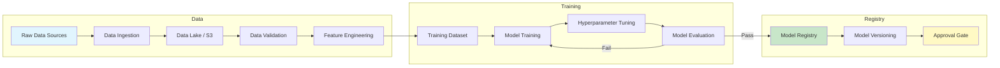
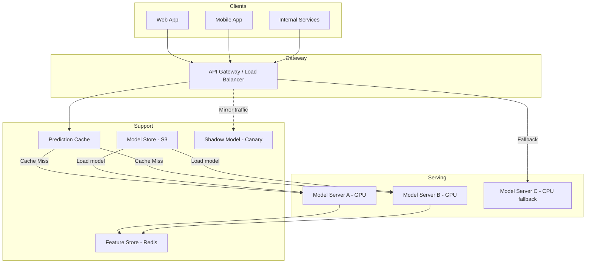
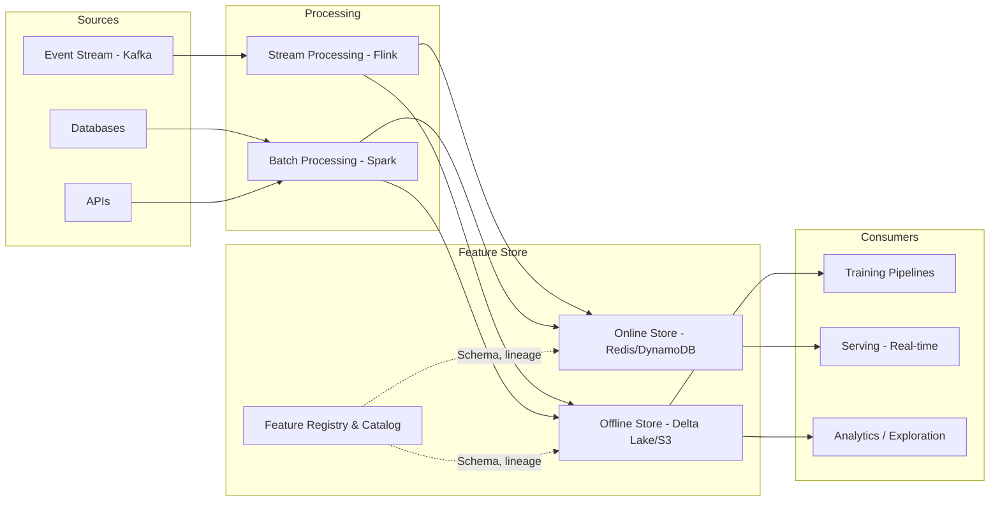
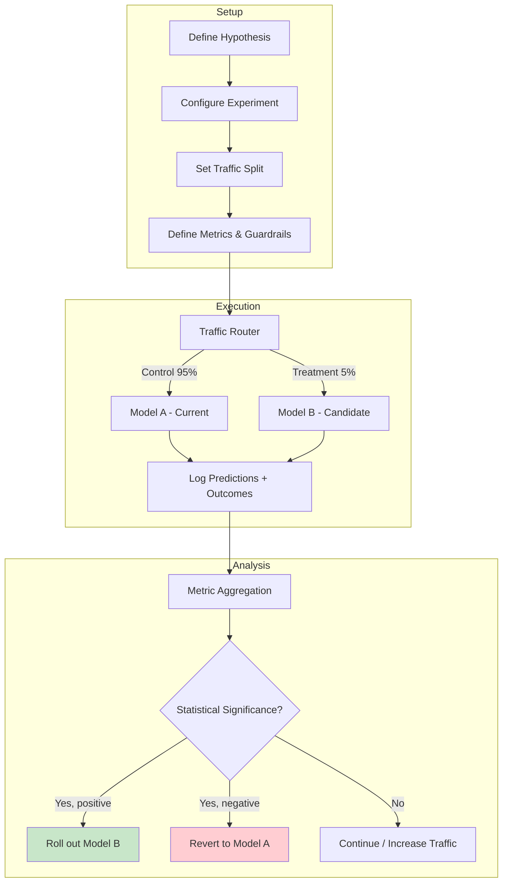
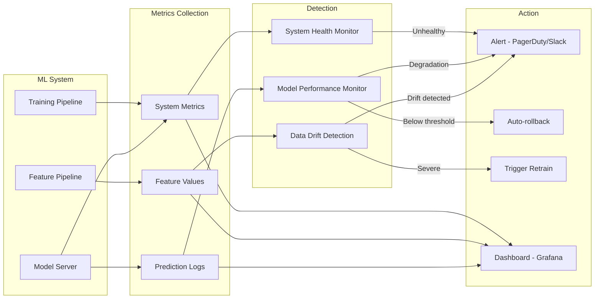
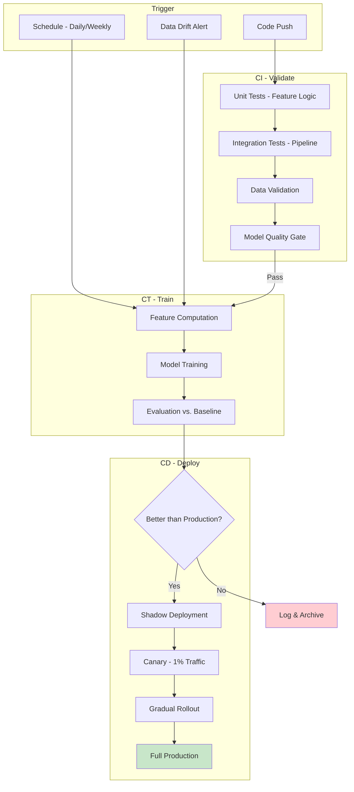
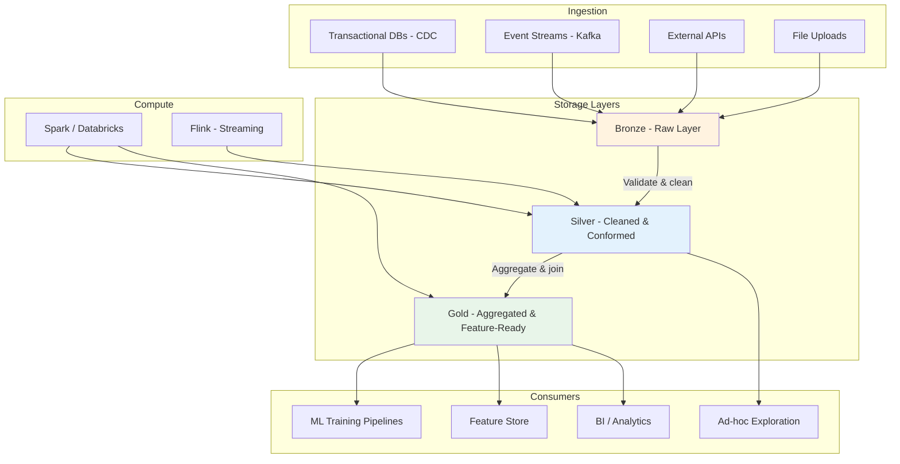

# ML Production Architecture Diagrams

Visual references for ML system architectures using Mermaid diagrams.

---

## 1. ML Training Pipeline

End-to-end flow from raw data to a validated model in the model registry.

**Key points:**
- Data validation (Great Expectations, Deequ) catches schema drift and data quality issues before they corrupt training
- Hyperparameter tuning (Optuna, Ray Tune) runs in parallel across GPU cluster
- Model registry (MLflow, Weights & Biases) stores artifacts, metrics, lineage
- Approval gate can be automated (metric thresholds) or manual (for high-risk models)

---

## 2. Model Serving Architecture (Inference)

Real-time and batch serving with graceful fallback.

**Key points:**
- Prediction cache (Redis, TTL-based) reduces GPU compute for repeated/similar queries
- Shadow model receives mirrored traffic for evaluation without impacting users
- CPU fallback ensures availability if GPU servers are overloaded
- Model servers use Triton, TF Serving, or TorchServe with dynamic batching

---

## 3. Feature Store Architecture

Unified feature management for training and serving consistency.

**Key points:**
- **Online store:** Low-latency reads (<5ms p99) for serving; keyed by entity ID
- **Offline store:** Point-in-time correct joins for training; prevents label leakage
- **Feature registry:** Centralized catalog with ownership, schema, freshness SLA, documentation
- **Training-serving consistency:** Same transformation code generates both online and offline features (avoids skew)
- Tools: Feast, Tecton, Databricks Feature Store, Vertex AI Feature Store

---

## 4. A/B Testing Flow

From experiment creation to statistical decision.

**Key points:**
- Traffic split by user_id hash (consistent assignment across sessions)
- Guardrail metrics (latency, error rate, revenue) must not regress even if primary metric improves
- Minimum 1-2 weeks to capture weekly seasonality
- Use sequential testing (always-valid p-values) for early stopping
- Beware: novelty effects, interference between variants, Simpson's paradox in segments

---

## 5. Monitoring and Alerting Flow

Comprehensive observability for ML systems in production.

**What to monitor:**

| Category | Metrics | Alert Threshold |
|----------|---------|-----------------|
| Data quality | Null rate, schema violations, volume | >5% nulls, schema change |
| Feature drift | PSI, KL divergence, Jensen-Shannon | PSI > 0.2 |
| Prediction drift | Output distribution shift, confidence calibration | KS test p<0.01 |
| Model performance | Accuracy, AUC (when labels available) | Drop >2% from baseline |
| System | Latency p99, error rate, throughput | p99 >200ms, errors >1% |
| Business | CTR, conversion, revenue per session | Drop >5% WoW |

---

## 6. CI/CD for ML (MLOps Pipeline)

Continuous integration, training, and deployment for ML.

**Key differences from traditional CI/CD:**
- **CT (Continuous Training):** Models retrain automatically on new data
- **Data validation is a first-class gate** — bad data is the #1 cause of ML failures
- **Model quality gate:** Compare against baseline on held-out set AND production metrics
- **Shadow deployment:** New model serves alongside production, predictions logged but not used
- **Canary:** Small traffic slice; automated rollback if metrics degrade
- **Immutable artifacts:** Model + features + config versioned together for reproducibility

---

## 7. Data Lake Architecture for ML

Layered data architecture supporting both analytics and ML workloads.

**Layer descriptions:**

| Layer | Purpose | Format | Retention |
|-------|---------|--------|-----------|
| Bronze | Raw, immutable ingestion | Parquet/JSON, partitioned by date | Forever |
| Silver | Cleaned, deduplicated, schema-enforced | Delta Lake / Iceberg | 2+ years |
| Gold | Business-level aggregations, ML-ready features | Delta Lake, optimized | As needed |

**Key principles:**
- **Immutability:** Bronze layer never modified — enables reprocessing and auditing
- **Schema evolution:** Delta Lake / Iceberg handle schema changes gracefully
- **Time travel:** Query data as-of any point in time (critical for reproducible training)
- **Partitioning:** By date + entity for efficient ML data loading (avoid full scans)
- **Governance:** Data catalog (Unity Catalog, Glue) with lineage, access control, PII tagging
