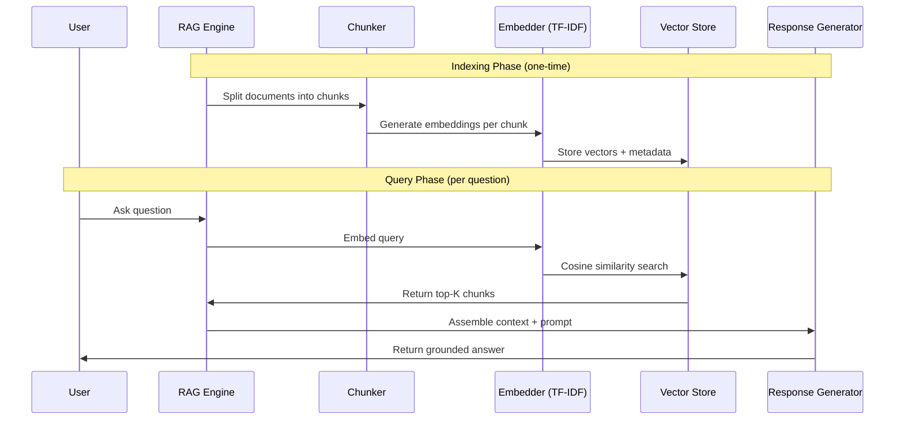

# Project 7: RAG (Retrieval-Augmented Generation) Chatbot

## Architecture

```
┌─────────────────────────────────────────────────────────────────┐
│                        RAG Pipeline                              │
├─────────────────────────────────────────────────────────────────┤
│                                                                  │
│  ┌──────────┐    ┌──────────────┐    ┌───────────────────┐      │
│  │  Documents│───▶│  Chunking    │───▶│  Embedding Gen    │      │
│  │  (corpus) │    │  (overlap)   │    │  (TF-IDF vectors) │      │
│  └──────────┘    └──────────────┘    └────────┬──────────┘      │
│                                               │                  │
│                                               ▼                  │
│                                    ┌──────────────────┐          │
│                                    │  Vector Store     │          │
│                                    │  (numpy in-memory)│          │
│                                    └────────┬─────────┘          │
│                                             │                    │
│  ┌──────────┐    ┌──────────────┐           │                    │
│  │  User     │───▶│  Query       │───────────┘                    │
│  │  Question │    │  Embedding   │                               │
│  └──────────┘    └──────┬───────┘                               │
│                          │                                       │
│                          ▼                                       │
│               ┌──────────────────┐    ┌───────────────────┐      │
│               │ Cosine Similarity│───▶│  Top-K Retrieval  │      │
│               │ Search           │    │  (ranked chunks)  │      │
│               └──────────────────┘    └────────┬──────────┘      │
│                                                │                 │
│                                                ▼                 │
│                                     ┌──────────────────┐         │
│                                     │  Context Assembly │         │
│                                     │  + LLM Prompt     │         │
│                                     └────────┬─────────┘         │
│                                              │                   │
│                                              ▼                   │
│                                     ┌──────────────────┐         │
│                                     │  Response Gen     │         │
│                                     │  (template/LLM)   │         │
│                                     └──────────────────┘         │
└─────────────────────────────────────────────────────────────────┘
```

## Sequence Diagram



## What You'll Learn

1. **Document chunking** - Splitting text with overlap to preserve context
2. **TF-IDF vectorization** - Converting text to numerical vectors without deep learning
3. **Vector similarity search** - Finding relevant content via cosine similarity
4. **Prompt engineering** - Assembling retrieved context into an LLM-ready prompt
5. **RAG pipeline orchestration** - End-to-end retrieval-augmented generation flow

## How to Run

```bash
pip install -r requirements.txt
python rag_chatbot.py
```

No API keys or internet connection needed after install.

## Expected Output

```
============================================================
           RAG CHATBOT - Retrieval Augmented Generation
============================================================

[INDEXING] Loading 5 documents...
[INDEXING] Chunking documents (chunk_size=200, overlap=50)...
[INDEXING] Created 23 chunks from 5 documents
[INDEXING] Generating TF-IDF embeddings...
[INDEXING] Vector store ready: 23 vectors of dimension 847

============================================================
QUERY: "How does photosynthesis work?"
============================================================

[RETRIEVAL] Embedding query...
[RETRIEVAL] Searching vector store (top_k=3)...
[RETRIEVAL] Results:
  1. [Score: 0.847] Source: biology.txt, Chunk 2
     "Photosynthesis is the process by which plants convert sunlight..."
  2. [Score: 0.623] Source: biology.txt, Chunk 3
     "The light reactions occur in the thylakoid membranes..."
  3. [Score: 0.412] Source: chemistry.txt, Chunk 1
     "Chemical energy is stored in the bonds of molecules..."

[GENERATION] Assembled prompt with 3 context chunks (487 tokens)
[GENERATION] Prompt sent to LLM:
  ---
  Context: {retrieved passages}
  Question: How does photosynthesis work?
  Answer based only on the context above.
  ---

[RESPONSE] Based on the retrieved context, photosynthesis is...
```

## Extension Ideas

- **Add a real LLM**: Replace template response with OpenAI/Anthropic API call
- **Use sentence-transformers**: Replace TF-IDF with `all-MiniLM-L6-v2` for semantic embeddings
- **Persistent vector store**: Use ChromaDB, Pinecone, or FAISS instead of numpy
- **PDF ingestion**: Add PyPDF2 to load real documents
- **Hybrid search**: Combine TF-IDF (keyword) with semantic search
- **Re-ranking**: Add a cross-encoder re-ranker after initial retrieval
- **Streaming**: Stream LLM responses token by token
