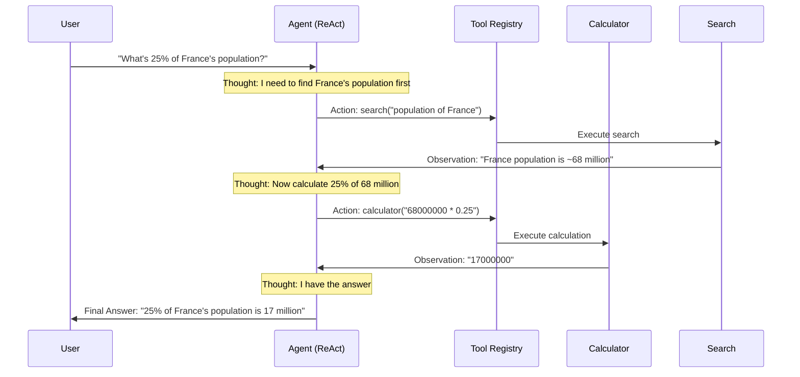

# Project 8: LLM Agent with Tools (ReAct Pattern)

## Architecture

```
┌─────────────────────────────────────────────────────────────────┐
│                    ReAct Agent Loop                              │
├─────────────────────────────────────────────────────────────────┤
│                                                                  │
│  ┌──────────┐                                                    │
│  │  User     │──── "What's 25% of the population of France?"     │
│  │  Query    │                                                    │
│  └─────┬────┘                                                    │
│        │                                                         │
│        ▼                                                         │
│  ┌─────────────────────────────────────────────────┐             │
│  │              AGENT LOOP (max N steps)            │             │
│  │                                                  │             │
│  │   ┌──────────┐    ┌──────────┐    ┌──────────┐  │             │
│  │   │ THOUGHT  │───▶│  ACTION  │───▶│OBSERVATION│  │             │
│  │   │ (reason) │    │ (tool)   │    │ (result)  │  │             │
│  │   └──────────┘    └──────────┘    └─────┬────┘  │             │
│  │        ▲                                 │       │             │
│  │        └─────────────────────────────────┘       │             │
│  │                                                  │             │
│  └──────────────────────┬──────────────────────────┘             │
│                          │ (final answer)                         │
│                          ▼                                        │
│                  ┌──────────────┐                                 │
│                  │   RESPONSE   │                                 │
│                  └──────────────┘                                 │
│                                                                   │
│  Available Tools:                                                 │
│  ┌────────────┐ ┌────────────┐ ┌────────────┐ ┌────────────┐    │
│  │ Calculator │ │  Search    │ │  Weather   │ │  DateTime  │    │
│  │ math eval  │ │  (mock)    │ │  (mock)    │ │  real time │    │
│  └────────────┘ └────────────┘ └────────────┘ └────────────┘    │
└─────────────────────────────────────────────────────────────────┘
```

## Sequence Diagram



## What You'll Learn

1. **ReAct pattern** - How LLM agents interleave reasoning and action
2. **Tool abstraction** - Defining tools with descriptions for the agent
3. **Agent loop** - Iterative thought → action → observation cycle
4. **Prompt engineering** - Structuring prompts for tool-use agents
5. **Trace logging** - Inspecting the agent's full reasoning chain

## How to Run

```bash
pip install -r requirements.txt
python agent.py
```

No API keys needed - uses a rule-based reasoning engine to demonstrate the pattern.

## Expected Output

```
============================================================
         LLM AGENT WITH TOOLS - ReAct Pattern
============================================================

QUERY: "What is 15% of 380?"
──────────────────────────────────────────────────────────────

Step 1:
  Thought: I need to calculate 15% of 380. I'll use the calculator tool.
  Action: calculator("380 * 0.15")
  Observation: 57.0

Step 2:
  Thought: I have the result. 15% of 380 is 57.
  Action: finish("15% of 380 is 57.0")

FINAL ANSWER: 15% of 380 is 57.0
──────────────────────────────────────────────────────────────
```

## Extension Ideas

- **Add a real LLM**: Replace rule-based reasoning with OpenAI function calling
- **Add more tools**: Web scraper, database query, file reader, API caller
- **Memory**: Add conversation history and long-term memory
- **Planning**: Implement plan-then-execute instead of step-by-step
- **Error recovery**: Handle tool failures gracefully with retries
- **Multi-agent**: Chain multiple specialized agents together
