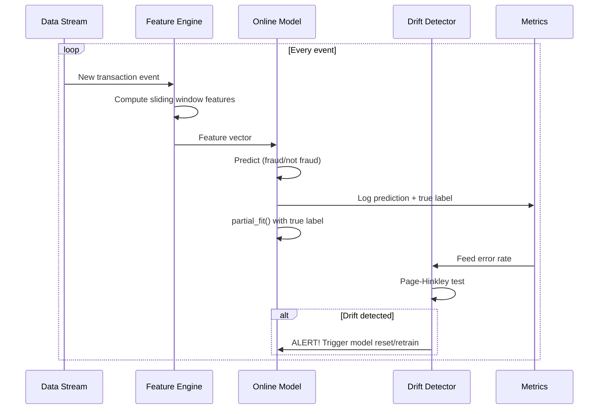

# Project 9: Real-Time Streaming ML Pipeline

## Architecture

```
┌─────────────────────────────────────────────────────────────────────┐
│                   Real-Time Streaming ML Pipeline                     │
├─────────────────────────────────────────────────────────────────────┤
│                                                                      │
│  ┌──────────────┐    ┌──────────────┐    ┌───────────────────┐      │
│  │ Data Stream   │───▶│ Feature Eng  │───▶│  Online Model     │      │
│  │ (generator)   │    │ (sliding     │    │  (SGDClassifier)  │      │
│  │               │    │  window)     │    │  partial_fit()    │      │
│  └──────────────┘    └──────────────┘    └────────┬──────────┘      │
│        │                                          │                  │
│        │                                          ▼                  │
│        │                               ┌──────────────────┐          │
│        │                               │  Prediction +     │          │
│        │                               │  Confidence       │          │
│        │                               └────────┬─────────┘          │
│        │                                        │                    │
│        ▼                                        ▼                    │
│  ┌──────────────┐                    ┌──────────────────┐            │
│  │ Drift        │                    │  Metrics Tracker  │            │
│  │ Detector     │                    │  (rolling accuracy,│            │
│  │ (Page-Hinkley│                    │   precision, etc.) │            │
│  │  / ADWIN)    │                    └──────────────────┘            │
│  └──────┬───────┘                                                    │
│         │                                                            │
│         ▼                                                            │
│  ┌──────────────┐                                                    │
│  │ ALERT:       │                                                    │
│  │ Drift        │──── "⚠ Concept drift detected at t=4500!"         │
│  │ Detected!    │                                                    │
│  └──────────────┘                                                    │
│                                                                      │
└─────────────────────────────────────────────────────────────────────┘
```

## Sequence Diagram



## What You'll Learn

1. **Online learning** - Incremental model updates with `partial_fit()`
2. **Concept drift detection** - Page-Hinkley test for distribution shifts
3. **Sliding window features** - Real-time feature computation over time windows
4. **Stream simulation** - Generating realistic event streams with distributional changes
5. **Anomaly detection** - Identifying fraud in real-time with evolving data

## How to Run

```bash
pip install -r requirements.txt
python streaming_ml.py
```

No API keys or internet needed - uses synthetic data that simulates credit card transactions.

## Expected Output

```
============================================================
     REAL-TIME STREAMING ML - Credit Card Fraud Detection
============================================================

[CONFIG] Stream: 10000 events | Drift injection at event 5000
[CONFIG] Model: SGDClassifier (online learning)
[CONFIG] Drift detector: Page-Hinkley (threshold=50)

[STREAM] Processing events...
──────────────────────────────────────────────────────────────
  t=100   | Acc: 0.940 | Prec: 0.82 | Recall: 0.71 | Fraud rate: 5.0%
  t=200   | Acc: 0.955 | Prec: 0.87 | Recall: 0.76 | Fraud rate: 4.5%
  ...
  t=5000  | Acc: 0.972 | Prec: 0.93 | Recall: 0.89 | Fraud rate: 5.2%

  ⚠ [DRIFT ALERT] Concept drift detected at t=5100!
    Error rate jumped from 0.03 to 0.15
    Resetting model and retraining on recent window...

  t=5200  | Acc: 0.891 | Prec: 0.72 | Recall: 0.65 | Fraud rate: 12.1%
  t=5500  | Acc: 0.934 | Prec: 0.84 | Recall: 0.78 | Fraud rate: 11.8%
  ...
  t=10000 | Acc: 0.961 | Prec: 0.91 | Recall: 0.86 | Fraud rate: 10.2%

[SUMMARY]
  Total events processed: 10000
  Drift events detected: 1
  Final accuracy: 0.961
  Model updates: 10000 (one per event)
```

## Extension Ideas

- **Real Kafka stream**: Replace generator with `kafka-python` consumer
- **Feature store**: Add Redis/Feast for real-time feature serving
- **Multiple models**: Ensemble of online learners with voting
- **ADWIN detector**: Implement Adaptive Windowing for drift detection
- **Dashboard**: Add a real-time Grafana/Streamlit dashboard
- **Model versioning**: Track model checkpoints with MLflow
- **A/B testing**: Compare old vs. new model during drift recovery
