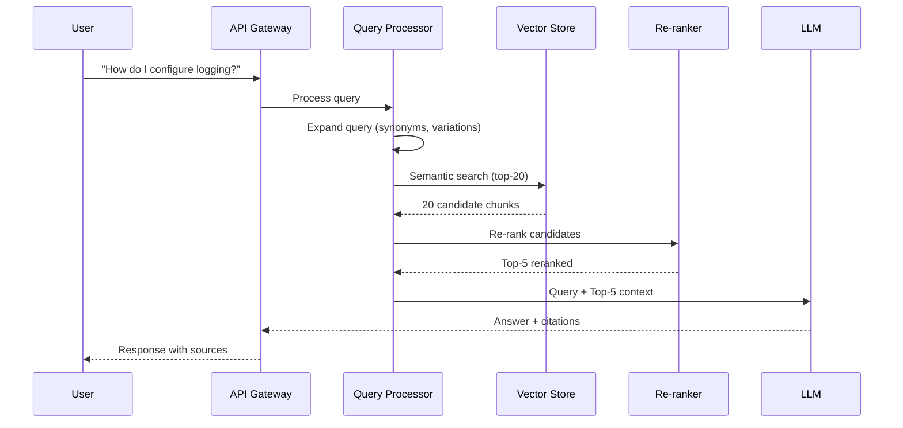

# RAG (Retrieval-Augmented Generation)

## Why RAG?

LLMs have fundamental limitations that RAG solves:

| LLM Limitation | RAG Solution |
|---|---|
| Knowledge cutoff (training data is stale) | Retrieve current information |
| Hallucination (makes things up confidently) | Ground responses in real documents |
| No access to private/proprietary data | Index your own data |
| Can't cite sources | Return source documents |
| Context window limits | Retrieve only relevant chunks |

**RAG = Give the LLM a search engine before it answers.**

## RAG Architecture Overview

```
┌─────────────────────────────────────────────────────────────────────┐
│                        RAG Pipeline                                   │
│                                                                      │
│  ┌──────────┐    ┌──────────┐    ┌──────────┐    ┌──────────────┐  │
│  │  Query   │ →  │ Retrieve │ →  │ Augment  │ →  │   Generate   │  │
│  │          │    │          │    │ (build   │    │   (LLM call) │  │
│  │"How do I │    │ Search   │    │ prompt   │    │              │  │
│  │ deploy?" │    │ vector DB│    │ with     │    │ "To deploy,  │  │
│  │          │    │          │    │ context) │    │  first..."   │  │
│  └──────────┘    └──────────┘    └──────────┘    └──────────────┘  │
│                                                                      │
└─────────────────────────────────────────────────────────────────────┘
```

## Document Ingestion Pipeline

```
┌─────────┐    ┌─────────┐    ┌─────────┐    ┌─────────┐    ┌─────────┐
│  Load   │ →  │  Clean  │ →  │  Chunk  │ →  │  Embed  │ →  │  Store  │
│Documents│    │& Parse  │    │         │    │         │    │(VectorDB)│
└─────────┘    └─────────┘    └─────────┘    └─────────┘    └─────────┘
  PDF, HTML      Extract        Split into     Convert to     Index for
  Markdown       text,          meaningful     dense vectors  similarity
  Docs, Code     metadata       segments       (768-3072d)    search
```

```python
from langchain.document_loaders import PyPDFLoader, TextLoader
from langchain.text_splitter import RecursiveCharacterTextSplitter
from langchain.embeddings import OpenAIEmbeddings
from langchain.vectorstores import Chroma

# 1. Load
loader = PyPDFLoader("technical_doc.pdf")
documents = loader.load()

# 2. Chunk
splitter = RecursiveCharacterTextSplitter(
    chunk_size=512,
    chunk_overlap=50,
    separators=["\n\n", "\n", ". ", " ", ""]
)
chunks = splitter.split_documents(documents)

# 3. Embed & Store
embeddings = OpenAIEmbeddings(model="text-embedding-3-small")
vectorstore = Chroma.from_documents(chunks, embeddings)
```

## Chunking Strategies

```
┌─────────────────────────────────────────────────────────────────────┐
│ Strategy           │ How it works          │ Best for               │
├────────────────────┼───────────────────────┼────────────────────────┤
│ Fixed-size         │ Split every N chars   │ Simple, predictable    │
│ Recursive          │ Split by hierarchy    │ General purpose ✓      │
│                    │ (\n\n → \n → . → " ") │                        │
│ Semantic           │ Split where embedding │ Preserving meaning     │
│                    │ similarity drops      │                        │
│ Document-based     │ Use document structure│ Structured docs (HTML, │
│                    │ (headings, sections)  │ Markdown, code)        │
│ Sentence-level     │ One sentence per chunk│ Q&A, precise retrieval │
│ Paragraph-level    │ Natural paragraphs    │ Long-form content      │
└────────────────────┴───────────────────────┴────────────────────────┘
```

**Chunk size tradeoffs:**
- Too small (100 tokens): Loses context, fragments ideas
- Too large (2000 tokens): Dilutes relevance, wastes context window
- Sweet spot: 256-512 tokens for most use cases

```python
# Semantic chunking
from sentence_transformers import SentenceTransformer
import numpy as np

def semantic_chunk(text, model, threshold=0.75):
    """Split text where semantic similarity between consecutive sentences drops."""
    sentences = text.split('. ')
    embeddings = model.encode(sentences)
    
    chunks = []
    current_chunk = [sentences[0]]
    
    for i in range(1, len(sentences)):
        similarity = np.dot(embeddings[i-1], embeddings[i]) / (
            np.linalg.norm(embeddings[i-1]) * np.linalg.norm(embeddings[i])
        )
        if similarity < threshold:
            chunks.append('. '.join(current_chunk))
            current_chunk = [sentences[i]]
        else:
            current_chunk.append(sentences[i])
    
    chunks.append('. '.join(current_chunk))
    return chunks
```

## Embedding Models

| Model | Dimensions | Max Tokens | Quality | Speed | Cost |
|---|---|---|---|---|---|
| text-embedding-3-small (OpenAI) | 1536 | 8191 | Good | Fast | $0.02/1M |
| text-embedding-3-large (OpenAI) | 3072 | 8191 | Best (OpenAI) | Medium | $0.13/1M |
| Cohere embed-v3 | 1024 | 512 | Excellent | Fast | $0.10/1M |
| BGE-large-en-v1.5 | 1024 | 512 | Good | Fast | Free (local) |
| sentence-transformers/all-MiniLM | 384 | 256 | Decent | Very fast | Free (local) |
| Voyage-2 | 1024 | 4000 | Excellent | Fast | $0.10/1M |
| jina-embeddings-v2 | 768 | 8192 | Good | Fast | Free (local) |

## Vector Databases

| Database | Type | Strengths | Best For |
|---|---|---|---|
| Pinecone | Managed | Zero-ops, fast, scalable | Production (no infra team) |
| Weaviate | Open/Managed | Hybrid search, GraphQL | Complex schemas |
| Milvus | Open source | High performance, scalable | Large scale |
| ChromaDB | Open source | Simple, embedded | Prototyping, small apps |
| pgvector | PostgreSQL ext | Use existing Postgres | Already using PostgreSQL |
| Qdrant | Open/Managed | Filtering, payload storage | Complex filtering needs |

## Similarity Search

```python
# Cosine similarity (most common for normalized embeddings)
def cosine_similarity(a, b):
    return np.dot(a, b) / (np.linalg.norm(a) * np.linalg.norm(b))

# For normalized vectors: cosine = dot product (faster)
# Most embedding models output normalized vectors
```

**Index types for fast search:**

```
Exact (brute force):  O(n) — accurate but slow for large datasets
IVF (Inverted File):  Cluster vectors, search only nearby clusters — O(√n)
HNSW (Hierarchical    Graph-based, connect similar vectors — O(log n)
 Navigable Small      Best quality/speed tradeoff for most cases
 World):
PQ (Product           Compress vectors, trade accuracy for memory
 Quantization):       Good for very large datasets
```

## Retrieval Quality Metrics

```
Recall@K: Of all relevant docs, what fraction did we retrieve in top-K?
Precision@K: Of top-K retrieved docs, what fraction are relevant?
MRR: Average of 1/rank_of_first_relevant_result
NDCG: Accounts for position (relevant docs earlier = better)

Example:
  Query: "How to deploy to Kubernetes?"
  Top-5 retrieved: [relevant, irrelevant, relevant, relevant, irrelevant]
  
  Recall@5 = 3/4 = 0.75 (assuming 4 total relevant docs)
  Precision@5 = 3/5 = 0.60
  MRR = 1/1 = 1.0 (first result is relevant)
```

## Advanced RAG Patterns

### Hybrid Search (Dense + Sparse)

```python
# Combine vector search (semantic) with BM25 (keyword)
def hybrid_search(query, vectorstore, bm25_index, alpha=0.7):
    """
    alpha: weight for dense search (1.0 = pure vector, 0.0 = pure BM25)
    """
    # Dense retrieval
    dense_results = vectorstore.similarity_search(query, k=20)
    
    # Sparse retrieval (BM25)
    sparse_results = bm25_index.search(query, k=20)
    
    # Reciprocal Rank Fusion (RRF)
    scores = {}
    k = 60  # RRF constant
    
    for rank, doc in enumerate(dense_results):
        scores[doc.id] = scores.get(doc.id, 0) + alpha / (k + rank + 1)
    
    for rank, doc in enumerate(sparse_results):
        scores[doc.id] = scores.get(doc.id, 0) + (1 - alpha) / (k + rank + 1)
    
    # Return top results by combined score
    return sorted(scores.items(), key=lambda x: -x[1])[:10]
```

### Re-ranking (Cross-Encoder)

```python
from sentence_transformers import CrossEncoder

# Stage 1: Fast retrieval (bi-encoder) — get top 20-50 candidates
candidates = vectorstore.similarity_search(query, k=50)

# Stage 2: Precise re-ranking (cross-encoder) — score each pair
reranker = CrossEncoder("cross-encoder/ms-marco-MiniLM-L-6-v2")
pairs = [(query, doc.page_content) for doc in candidates]
scores = reranker.predict(pairs)

# Return top-K after re-ranking
reranked = sorted(zip(candidates, scores), key=lambda x: -x[1])[:5]
```

**Why two stages?**
- Bi-encoder: Fast (embed query once, compare), but less accurate
- Cross-encoder: Slow (process each query-doc pair together), but much more accurate
- Retrieve broadly, then rerank precisely

### Query Transformation

```python
# HyDE (Hypothetical Document Embeddings)
# Generate a hypothetical answer, embed THAT instead of the question
def hyde_retrieval(query, llm, vectorstore):
    # Generate hypothetical document
    hypothetical_doc = llm.generate(
        f"Write a short passage that answers: {query}"
    )
    # Embed the hypothetical doc (closer to actual docs in embedding space)
    results = vectorstore.similarity_search(hypothetical_doc, k=5)
    return results

# Multi-query: Generate multiple query variations
def multi_query_retrieval(query, llm, vectorstore):
    variations = llm.generate(
        f"Generate 3 different phrasings of this question: {query}"
    )
    all_results = set()
    for variant in variations:
        results = vectorstore.similarity_search(variant, k=5)
        all_results.update(results)
    return list(all_results)

# Step-back prompting: Ask a more general question first
def step_back_retrieval(query, llm, vectorstore):
    general_query = llm.generate(
        f"What is a more general question that would help answer: {query}"
    )
    context = vectorstore.similarity_search(general_query, k=3)
    specific = vectorstore.similarity_search(query, k=3)
    return context + specific
```

### Parent-Child Document Retrieval

```
Idea: Embed small chunks (for precise matching) but retrieve 
      their parent documents (for complete context).

Document: [Full section - 2000 tokens]
  ├── Child chunk 1: [First paragraph - 200 tokens] ← match on this
  ├── Child chunk 2: [Second paragraph - 200 tokens]
  └── Child chunk 3: [Third paragraph - 200 tokens]

Search: Match against child chunks (precise)
Return: The full parent document (complete context)
```

```python
from langchain.retrievers import ParentDocumentRetriever
from langchain.storage import InMemoryStore

# Small chunks for embedding, large chunks for context
child_splitter = RecursiveCharacterTextSplitter(chunk_size=200)
parent_splitter = RecursiveCharacterTextSplitter(chunk_size=1000)

store = InMemoryStore()
retriever = ParentDocumentRetriever(
    vectorstore=vectorstore,
    docstore=store,
    child_splitter=child_splitter,
    parent_splitter=parent_splitter,
)
```

## RAG Evaluation

```
┌─────────────────────────────────────────────────────────────────────┐
│                    RAG Evaluation Dimensions                          │
├─────────────────────────────────────────────────────────────────────┤
│                                                                      │
│  1. Retrieval Quality         2. Generation Quality                  │
│  ├── Context Relevance        ├── Faithfulness (no hallucination)   │
│  ├── Context Recall           ├── Answer Relevance                  │
│  └── Context Precision        └── Answer Completeness               │
│                                                                      │
│  3. End-to-End                                                       │
│  ├── Answer Correctness                                             │
│  └── Latency / Cost                                                 │
│                                                                      │
└─────────────────────────────────────────────────────────────────────┘
```

```python
# Using RAGAS framework for evaluation
from ragas import evaluate
from ragas.metrics import (
    faithfulness,
    answer_relevancy,
    context_recall,
    context_precision,
)

results = evaluate(
    dataset=eval_dataset,  # questions + ground truth + retrieved contexts + answers
    metrics=[faithfulness, answer_relevancy, context_recall, context_precision],
)
print(results)
# {'faithfulness': 0.87, 'answer_relevancy': 0.91, 
#  'context_recall': 0.82, 'context_precision': 0.78}
```

## Production RAG Architecture

```
┌─────────────────────────────────────────────────────────────────────────┐
│                     Production RAG System                                 │
│                                                                          │
│  ┌─────────┐   ┌──────────────┐   ┌─────────────┐   ┌──────────────┐  │
│  │  User   │ → │   Gateway    │ → │   Query     │ → │  Retrieval   │  │
│  │  Query  │   │  (rate limit,│   │  Processing │   │  Pipeline    │  │
│  │         │   │   auth, log) │   │  (rewrite,  │   │              │  │
│  └─────────┘   └──────────────┘   │   expand)   │   │ ┌──────────┐│  │
│                                     └─────────────┘   │ │Vector DB ││  │
│                                                        │ ├──────────┤│  │
│                                                        │ │BM25 Index││  │
│                                                        │ ├──────────┤│  │
│                                                        │ │Re-ranker ││  │
│                                                        │ └──────────┘│  │
│  ┌─────────┐   ┌──────────────┐   ┌─────────────┐   └──────────────┘  │
│  │Response │ ← │  Generation  │ ← │   Context   │ ←─────────┘          │
│  │  + Cites│   │  (LLM call)  │   │  Assembly   │                      │
│  └─────────┘   └──────────────┘   │  (rank,trim,│                      │
│       │                             │   format)   │                      │
│       ▼                             └─────────────┘                      │
│  ┌──────────────────────────────────────────────────────────────────┐   │
│  │                    Observability Layer                             │   │
│  │  Logging │ Tracing │ Metrics │ Feedback │ Cost tracking           │   │
│  └──────────────────────────────────────────────────────────────────┘   │
│                                                                          │
│  ┌──────────────────────────────────────────────────────────────────┐   │
│  │                    Offline Pipeline                                │   │
│  │  Document ingestion │ Embedding │ Index refresh │ Evaluation      │   │
│  └──────────────────────────────────────────────────────────────────┘   │
└─────────────────────────────────────────────────────────────────────────┘
```

### Caching Strategy

```python
import hashlib

class RAGCache:
    def __init__(self, redis_client, ttl=3600):
        self.redis = redis_client
        self.ttl = ttl
    
    def get_or_retrieve(self, query, retriever):
        # Cache key based on query hash
        key = f"rag:{hashlib.md5(query.encode()).hexdigest()}"
        
        cached = self.redis.get(key)
        if cached:
            return json.loads(cached)
        
        results = retriever.retrieve(query)
        self.redis.setex(key, self.ttl, json.dumps(results))
        return results
```

## Multi-Modal RAG

```python
# Handle tables, images, and text from PDFs
from unstructured.partition.pdf import partition_pdf

elements = partition_pdf("document.pdf", strategy="hi_res")

# Separate by type
texts = [e for e in elements if e.category == "NarrativeText"]
tables = [e for e in elements if e.category == "Table"]
images = [e for e in elements if e.category == "Image"]

# For tables: summarize with LLM, embed the summary
table_summaries = [llm.summarize(str(t)) for t in tables]

# For images: use vision model to describe, embed the description
image_descriptions = [vision_model.describe(img) for img in images]

# Index everything together with metadata
for text in texts:
    vectorstore.add(text.text, metadata={"type": "text", "page": text.page})
for summary in table_summaries:
    vectorstore.add(summary, metadata={"type": "table"})
for desc in image_descriptions:
    vectorstore.add(desc, metadata={"type": "image"})
```

## RAG vs Fine-Tuning Decision Framework

```
┌─────────────────────────────────────────────────────────────┐
│                Use RAG when:             Use Fine-tuning when:│
├─────────────────────────────────────────────────────────────┤
│ • Data changes frequently              • Stable knowledge    │
│ • Need citations/sources               • Need specific style │
│ • Private data access                  • Task-specific behav.│
│ • Quick iteration needed               • Reduce latency      │
│ • Small amount of data                 • Lower inference cost│
│ • Need to explain reasoning            • Change model "persona│
│ • Compliance (audit trail)             • Specialized formats │
├─────────────────────────────────────────────────────────────┤
│           Use BOTH when:                                     │
│ • Fine-tune for style + RAG for knowledge                   │
│ • Fine-tune for tool use + RAG for tool documentation       │
└─────────────────────────────────────────────────────────────┘
```

## RAG Request Flow (Sequence Diagram)



## Complete RAG Implementation

```python
from openai import OpenAI
import chromadb

class ProductionRAG:
    def __init__(self):
        self.client = OpenAI()
        self.chroma = chromadb.PersistentClient(path="./chroma_db")
        self.collection = self.chroma.get_or_create_collection("docs")
    
    def ingest(self, documents: list[dict]):
        """Ingest documents into vector store."""
        for doc in documents:
            chunks = self._chunk(doc["content"])
            embeddings = self._embed([c["text"] for c in chunks])
            
            self.collection.add(
                documents=[c["text"] for c in chunks],
                embeddings=embeddings,
                metadatas=[{**doc["metadata"], "chunk_idx": i} for i, c in enumerate(chunks)],
                ids=[f"{doc['id']}_chunk_{i}" for i in range(len(chunks))]
            )
    
    def query(self, question: str, k: int = 5) -> dict:
        """Full RAG pipeline: retrieve + generate."""
        # Retrieve
        query_embedding = self._embed([question])[0]
        results = self.collection.query(query_embeddings=[query_embedding], n_results=k)
        
        # Build context
        context = "\n\n---\n\n".join(results["documents"][0])
        
        # Generate
        response = self.client.chat.completions.create(
            model="gpt-4",
            messages=[
                {"role": "system", "content": f"""Answer based ONLY on the provided context. 
                If the context doesn't contain the answer, say "I don't have enough information."
                Always cite which source you used.
                
                Context:
                {context}"""},
                {"role": "user", "content": question}
            ],
            temperature=0
        )
        
        return {
            "answer": response.choices[0].message.content,
            "sources": results["metadatas"][0],
            "context_used": results["documents"][0]
        }
    
    def _chunk(self, text, size=512, overlap=50):
        """Recursive character splitting."""
        chunks = []
        start = 0
        while start < len(text):
            end = start + size
            chunk_text = text[start:end]
            chunks.append({"text": chunk_text, "start": start, "end": end})
            start = end - overlap
        return chunks
    
    def _embed(self, texts):
        """Get embeddings from OpenAI."""
        response = self.client.embeddings.create(
            model="text-embedding-3-small",
            input=texts
        )
        return [e.embedding for e in response.data]
```

## Interview Questions

1. **What is RAG and why is it needed?**
   - Retrieval-Augmented Generation grounds LLM responses in external documents, solving hallucination, knowledge cutoff, and private data access.

2. **Explain the tradeoffs in chunk size selection.**
   - Small chunks: precise retrieval but fragmented context. Large chunks: complete context but diluted relevance. 256-512 tokens is typical.

3. **What is hybrid search and when would you use it?**
   - Combines dense (vector) and sparse (BM25/keyword) search. Use when queries mix semantic intent with specific keywords/names.

4. **How would you evaluate a RAG system?**
   - Retrieval: recall@K, precision@K, MRR. Generation: faithfulness, relevance. End-to-end: correctness, latency, cost.

5. **What's the difference between a bi-encoder and cross-encoder?**
   - Bi-encoder: encodes query and doc independently (fast). Cross-encoder: processes pair together (accurate, slow). Use together in retrieve-then-rerank.

6. **How do you handle hallucination in RAG?**
   - Instruct model to use ONLY provided context, add "I don't know" as valid response, validate answers against sources, use faithfulness metrics.

7. **When would you choose RAG over fine-tuning?**
   - Frequently changing data, need citations, quick iteration, compliance requirements, or when you need to explain where information came from.

8. **How does HyDE improve retrieval?**
   - Generates a hypothetical answer and embeds that instead of the question, since answers are more similar to documents than questions are.

## Exercises

### Exercise 1: Build a RAG System
Build a complete RAG system for a documentation site. Ingest markdown files, implement chunking, embedding, retrieval, and generation. Measure quality.

### Exercise 2: Chunking Strategy Comparison
Take the same document set and implement 4 different chunking strategies. Compare retrieval quality (recall@5) for a set of test questions.

### Exercise 3: Hybrid Search
Implement hybrid search combining vector similarity with BM25. Tune the alpha parameter and measure improvement over pure vector search.

### Exercise 4: RAG Evaluation Pipeline
Build an automated evaluation pipeline using RAGAS. Create a test set of 50 questions with ground truth answers and measure all key metrics.

## Common Pitfalls

1. **Not chunking properly** — Splitting mid-sentence or mid-thought destroys context
2. **Embedding query and documents with different models** — Must use the same embedding model
3. **Stuffing too much context** — More context isn't always better; irrelevant context confuses the LLM
4. **Not handling "no relevant results"** — Always have a threshold; return "I don't know" if similarity is too low
5. **Ignoring metadata filtering** — Use metadata (date, source, category) to narrow search before vector similarity
6. **No feedback loop** — Track which responses users find helpful/unhelpful to improve retrieval
7. **Stale embeddings** — When documents update, embeddings must be regenerated
