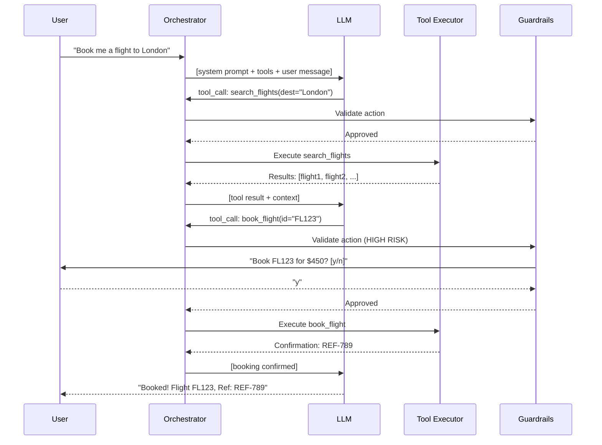

# AI Agents and Tool Use

## What Are AI Agents?

An AI agent is an LLM-driven system that can autonomously perceive, reason, plan, and take actions in an environment to achieve goals. Unlike simple chat, agents operate in loops and interact with external systems.

```
Simple LLM:    Input → LLM → Output  (one-shot)
AI Agent:      Goal → [Observe → Think → Act → Observe → ...]  (loop until done)
```

## Agent Architecture

```
┌─────────────────────────────────────────────────────────────────────┐
│                         AI Agent                                      │
│                                                                      │
│  ┌───────────────────────────────────────────────────────────────┐  │
│  │                        Memory                                  │  │
│  │  Short-term: conversation history, working context            │  │
│  │  Long-term: vector store, database, learned patterns          │  │
│  └───────────────────────────────────────────────────────────────┘  │
│                              │                                       │
│  ┌──────────┐    ┌──────────▼──────────┐    ┌───────────────────┐  │
│  │Perception│ →  │     Reasoning       │ →  │     Action        │  │
│  │          │    │     (LLM Core)      │    │                   │  │
│  │- User msg│    │- Analyze situation  │    │- Call tools       │  │
│  │- Tool    │    │- Plan next steps    │    │- Generate text    │  │
│  │  results │    │- Select action      │    │- Execute code     │  │
│  │- Env     │    │- Reflect on results │    │- Search/browse    │  │
│  │  state   │    │                     │    │- File operations  │  │
│  └──────────┘    └─────────────────────┘    └───────────────────┘  │
│                                                                      │
│  ┌───────────────────────────────────────────────────────────────┐  │
│  │                        Tools                                   │  │
│  │  [Search] [Code Exec] [File I/O] [API Call] [Browser] [DB]   │  │
│  └───────────────────────────────────────────────────────────────┘  │
└─────────────────────────────────────────────────────────────────────┘
```

## Tool Use / Function Calling

How LLMs interact with external systems. The LLM decides WHEN and HOW to call tools, but doesn't execute them directly.

```
┌──────────┐     ┌─────────┐     ┌──────────┐     ┌──────────┐
│   User   │ →   │   LLM   │ →   │   Tool   │ →   │   LLM    │
│  "What's │     │ Decides  │     │  Executes│     │ Generates│
│  the     │     │ to call  │     │  API call│     │ answer   │
│  weather │     │ get_     │     │  returns │     │ from     │
│  in NYC?"│     │ weather  │     │  data    │     │ results  │
└──────────┘     └─────────┘     └──────────┘     └──────────┘
```

### Function Calling Implementation

```python
import openai
import json

# Define tools
tools = [
    {
        "type": "function",
        "function": {
            "name": "search_database",
            "description": "Search the product database by query",
            "parameters": {
                "type": "object",
                "properties": {
                    "query": {"type": "string", "description": "Search query"},
                    "category": {"type": "string", "enum": ["electronics", "clothing", "food"]},
                    "max_results": {"type": "integer", "default": 5}
                },
                "required": ["query"]
            }
        }
    },
    {
        "type": "function",
        "function": {
            "name": "send_email",
            "description": "Send an email to a recipient",
            "parameters": {
                "type": "object",
                "properties": {
                    "to": {"type": "string"},
                    "subject": {"type": "string"},
                    "body": {"type": "string"}
                },
                "required": ["to", "subject", "body"]
            }
        }
    }
]

# Tool execution registry
TOOL_REGISTRY = {
    "search_database": lambda **kwargs: db.search(**kwargs),
    "send_email": lambda **kwargs: email_service.send(**kwargs),
}

# Agent loop
def agent_loop(user_message, tools, max_iterations=10):
    messages = [{"role": "user", "content": user_message}]
    
    for i in range(max_iterations):
        response = openai.chat.completions.create(
            model="gpt-4",
            messages=messages,
            tools=tools,
        )
        
        message = response.choices[0].message
        messages.append(message)
        
        # If no tool calls, we're done
        if not message.tool_calls:
            return message.content
        
        # Execute tool calls
        for tool_call in message.tool_calls:
            fn_name = tool_call.function.name
            fn_args = json.loads(tool_call.function.arguments)
            
            # Execute the tool
            result = TOOL_REGISTRY[fn_name](**fn_args)
            
            # Add result to messages
            messages.append({
                "role": "tool",
                "tool_call_id": tool_call.id,
                "content": json.dumps(result)
            })
    
    return "Max iterations reached"
```

## Planning Strategies

### ReAct (Reasoning + Acting)

```
Question: "Find the cheapest flight from NYC to London next week and book it"

Thought 1: I need to search for flights from NYC to London for next week.
Action 1: search_flights(from="NYC", to="London", date="2025-01-15", date_end="2025-01-22")
Observation 1: Found 15 flights. Cheapest: BA117, Jan 17, $450.

Thought 2: I found the cheapest flight. I should confirm with the user before booking.
Action 2: ask_user("The cheapest flight is BA117 on Jan 17 for $450. Shall I book it?")
Observation 2: User says "Yes, book it."

Thought 3: User confirmed. I'll proceed with booking.
Action 3: book_flight(flight_id="BA117", date="2025-01-17", passenger="user_123")
Observation 3: Booking confirmed. Reference: XYZ789.

Thought 4: Booking is complete. I'll inform the user.
Answer: Your flight BA117 from NYC to London on Jan 17 is booked! Reference: XYZ789. Total: $450.
```

### Plan-and-Execute

```
Step 1: Create a full plan upfront
Step 2: Execute each step, adjusting if needed

Plan:
1. Search for flights → get options
2. Filter by cheapest → select best
3. Confirm with user → get approval
4. Book the flight → get confirmation
5. Send confirmation email → notify user

Then execute steps sequentially, re-planning if a step fails.
```

### Reflexion

```
Attempt 1:
  Action: run_code("def sort(arr): return arr.sort()")
  Result: Test failed — sort() returns None
  
  Reflection: "I used .sort() which modifies in-place and returns None. 
               I should use sorted() which returns a new list."

Attempt 2:
  Action: run_code("def sort(arr): return sorted(arr)")
  Result: All tests pass ✓
```

## Memory Systems

```
┌─────────────────────────────────────────────────────────────────────┐
│                     Agent Memory Types                                │
├──────────────┬──────────────────────────────────────────────────────┤
│ Short-term   │ Current conversation, working context                 │
│              │ Implementation: message history (context window)      │
├──────────────┼──────────────────────────────────────────────────────┤
│ Long-term    │ Persistent knowledge across sessions                  │
│              │ Implementation: vector database, key-value store      │
├──────────────┼──────────────────────────────────────────────────────┤
│ Episodic     │ Past experiences and their outcomes                   │
│              │ Implementation: structured logs of past interactions  │
├──────────────┼──────────────────────────────────────────────────────┤
│ Semantic     │ Facts and general knowledge                           │
│              │ Implementation: knowledge graph, RAG                  │
├──────────────┼──────────────────────────────────────────────────────┤
│ Procedural   │ How to do things (skills, workflows)                  │
│              │ Implementation: tool definitions, few-shot examples   │
└──────────────┴──────────────────────────────────────────────────────┘
```

```python
class AgentMemory:
    def __init__(self, vectorstore, max_short_term=20):
        self.short_term = []  # Recent messages
        self.max_short_term = max_short_term
        self.vectorstore = vectorstore  # Long-term
    
    def add_interaction(self, query, response, metadata=None):
        """Store interaction in both short and long-term memory."""
        self.short_term.append({"query": query, "response": response})
        if len(self.short_term) > self.max_short_term:
            # Summarize and move to long-term
            summary = self._summarize(self.short_term[:5])
            self.vectorstore.add(summary, metadata=metadata)
            self.short_term = self.short_term[5:]
    
    def recall(self, query, k=5):
        """Retrieve relevant past interactions."""
        return self.vectorstore.similarity_search(query, k=k)
    
    def get_context(self, current_query):
        """Build context from short-term + relevant long-term memory."""
        relevant_past = self.recall(current_query)
        return {
            "recent": self.short_term[-10:],
            "relevant_past": relevant_past
        }
```

## Multi-Agent Systems

```
┌─────────────────────────────────────────────────────────────┐
│              Multi-Agent Patterns                             │
├─────────────────────────────────────────────────────────────┤
│                                                              │
│  Debate:         Agent A ←→ Agent B                         │
│                  Argue different perspectives                 │
│                  Best for: analysis, decision-making          │
│                                                              │
│  Collaboration:  Agent A → Agent B → Agent C                │
│                  Pipeline of specialized agents               │
│                  Best for: complex workflows                  │
│                                                              │
│  Hierarchy:      Manager Agent                               │
│                  ├── Worker Agent 1                          │
│                  ├── Worker Agent 2                          │
│                  └── Worker Agent 3                          │
│                  Best for: project management, delegation    │
│                                                              │
│  Voting:         Agent A ─┐                                 │
│                  Agent B ──┼→ Consensus                      │
│                  Agent C ─┘                                  │
│                  Best for: reliability, reduce errors         │
└─────────────────────────────────────────────────────────────┘
```

## Agent Frameworks Comparison

| Framework | Architecture | Strengths | Best For |
|---|---|---|---|
| LangGraph | Graph-based state machine | Controllable, debuggable | Complex production agents |
| CrewAI | Role-based multi-agent | Easy multi-agent setup | Team-based tasks |
| AutoGen (Microsoft) | Conversational agents | Multi-agent chat | Research, prototyping |
| OpenAI Assistants | Managed agent platform | Simple API, hosted | Quick integration |
| Semantic Kernel | Plugin architecture | Enterprise, .NET | Microsoft ecosystem |

### LangGraph Example

```python
from langgraph.graph import StateGraph, END
from typing import TypedDict, Annotated

class AgentState(TypedDict):
    messages: list
    next_action: str

def should_continue(state):
    """Decide if agent should continue or finish."""
    last_message = state["messages"][-1]
    if last_message.get("tool_calls"):
        return "execute_tools"
    return END

def call_model(state):
    """Call the LLM to decide next action."""
    response = llm.invoke(state["messages"])
    return {"messages": state["messages"] + [response]}

def execute_tools(state):
    """Execute tool calls and return results."""
    tool_calls = state["messages"][-1]["tool_calls"]
    results = []
    for call in tool_calls:
        result = tool_registry[call["name"]](**call["args"])
        results.append({"role": "tool", "content": str(result)})
    return {"messages": state["messages"] + results}

# Build graph
graph = StateGraph(AgentState)
graph.add_node("agent", call_model)
graph.add_node("tools", execute_tools)
graph.add_edge("tools", "agent")
graph.add_conditional_edges("agent", should_continue)
graph.set_entry_point("agent")

agent = graph.compile()
```

## Code Generation Agents

How tools like GitHub Copilot, Cursor, and OpenCode work:

```
┌─────────────────────────────────────────────────────────────────────┐
│                  Code Agent Architecture                              │
│                                                                      │
│  Context Gathering:                                                  │
│  ├── Current file content                                           │
│  ├── Open tabs / related files                                      │
│  ├── Repository structure                                           │
│  ├── Language server (types, definitions)                           │
│  ├── Git diff / recent changes                                      │
│  └── Error messages / terminal output                               │
│                                                                      │
│  Agent Loop:                                                         │
│  1. Understand intent (from user message + context)                 │
│  2. Plan changes (which files, what modifications)                  │
│  3. Generate code (with awareness of codebase patterns)             │
│  4. Apply changes (edit files, run commands)                        │
│  5. Verify (run tests, check types, lint)                           │
│  6. Iterate if verification fails                                    │
│                                                                      │
│  Tools available:                                                    │
│  [Read file] [Edit file] [Run command] [Search code] [Git]         │
└─────────────────────────────────────────────────────────────────────┘
```

## Evaluation of Agents

| Metric | What it measures | How to evaluate |
|---|---|---|
| Task completion | Did it achieve the goal? | Binary success on test tasks |
| Efficiency | Steps/tokens to complete | Count actions and tokens used |
| Accuracy | Were intermediate results correct? | Check tool call arguments |
| Safety | Did it avoid harmful actions? | Red-team with adversarial goals |
| Recovery | Can it handle errors? | Inject failures, measure recovery |
| Cost | Total API cost per task | Track token usage across all calls |

## Guardrails and Safety

```python
class AgentGuardrails:
    def __init__(self):
        self.allowed_actions = {"search", "read_file", "write_file", "run_test"}
        self.blocked_patterns = ["rm -rf", "DROP TABLE", "sudo", "curl | bash"]
        self.max_iterations = 20
        self.max_cost_per_task = 1.0  # dollars
    
    def validate_action(self, action, args):
        """Check if an action is allowed before execution."""
        if action not in self.allowed_actions:
            return False, f"Action '{action}' not in allowlist"
        
        # Check for dangerous patterns
        args_str = str(args)
        for pattern in self.blocked_patterns:
            if pattern in args_str:
                return False, f"Blocked pattern detected: {pattern}"
        
        return True, "OK"
    
    def check_budget(self, current_cost):
        """Stop if cost exceeds budget."""
        if current_cost > self.max_cost_per_task:
            raise BudgetExceededError(f"Cost ${current_cost:.2f} exceeds budget")
```

## Production Agent Architecture

```
┌─────────────────────────────────────────────────────────────────────┐
│                   Production Agent System                             │
│                                                                      │
│  ┌──────────┐   ┌────────────────────────────────────────────────┐  │
│  │  User    │ → │  Orchestrator                                   │  │
│  │  Input   │   │  ├── Input validation & sanitization            │  │
│  └──────────┘   │  ├── Intent classification                     │  │
│                  │  ├── Agent selection (route to right agent)     │  │
│                  │  ├── Execution with guardrails                  │  │
│                  │  ├── Retry logic (exponential backoff)          │  │
│                  │  ├── Fallback (simpler model if main fails)    │  │
│                  │  ├── Human-in-the-loop (for high-risk actions) │  │
│                  │  └── Response validation                       │  │
│                  └────────────────────────────────────────────────┘  │
│                         │              │                             │
│                  ┌──────▼───┐   ┌──────▼───────┐                    │
│                  │  Tools   │   │ Observability │                    │
│                  │  (APIs,  │   │ (traces,      │                    │
│                  │  DBs,    │   │  metrics,     │                    │
│                  │  code)   │   │  logs, cost)  │                    │
│                  └──────────┘   └──────────────┘                    │
└─────────────────────────────────────────────────────────────────────┘
```

### Human-in-the-Loop

```python
class HumanInTheLoop:
    HIGH_RISK_ACTIONS = {"send_email", "delete_record", "make_payment", "deploy"}
    
    async def maybe_confirm(self, action, args):
        """Ask for human approval on high-risk actions."""
        if action in self.HIGH_RISK_ACTIONS:
            approval = await self.request_approval(
                f"Agent wants to: {action}({args})\nApprove? [y/n]"
            )
            if not approval:
                return {"status": "denied", "reason": "Human rejected action"}
        
        return await self.execute(action, args)
```

## Tool-Calling Flow (Sequence Diagram)



## Interview Questions

1. **What is an AI agent and how does it differ from a simple LLM call?**
   - An agent operates in a loop: perceive→reason→act→observe. It can use tools, maintain state, and take multiple steps autonomously. A simple LLM call is one-shot input→output.

2. **Explain the ReAct pattern.**
   - Interleaves Thought (reasoning), Action (tool call), and Observation (tool result) steps. Enables grounded, multi-step problem solving with explicit reasoning traces.

3. **How does function calling work in modern LLMs?**
   - Tools are described in the prompt (name, description, parameters). The LLM outputs a structured tool call instead of text. The system executes it and feeds the result back.

4. **What are the key memory types for agents?**
   - Short-term (conversation), long-term (vector store), episodic (past experiences), semantic (facts), procedural (how-to-do things).

5. **How would you make an agent safe for production?**
   - Action allowlists, dangerous pattern detection, budget limits, human-in-the-loop for high-risk actions, output validation, rate limiting.

6. **Compare LangGraph vs CrewAI vs AutoGen.**
   - LangGraph: explicit state machine (production). CrewAI: role-based teams (multi-agent). AutoGen: conversational agents (research/prototyping).

7. **How do code generation agents (Copilot, Cursor) work?**
   - Gather context (files, types, errors), plan changes, generate code, apply edits, verify (run tests), iterate on failures.

8. **What is the biggest challenge with AI agents in production?**
   - Reliability: agents can get stuck in loops, make wrong tool calls, or accumulate errors across steps. Requires robust retry/fallback logic.

## Exercises

### Exercise 1: Build a Simple Agent
Implement a ReAct agent with 3 tools (calculator, web search, file reader). Test it on multi-step tasks.

### Exercise 2: Tool-Calling Agent
Build an agent with OpenAI function calling that can query a database, send emails, and create calendar events. Implement guardrails.

### Exercise 3: Multi-Agent Debate
Create two agents that debate a topic from opposing sides. A third agent judges and selects the winner. Evaluate if debates produce better answers than single agents.

### Exercise 4: Agent Evaluation
Build a test harness that evaluates an agent on 20 tasks. Measure: completion rate, average steps, cost per task, and error recovery rate.

## Common Pitfalls

1. **Infinite loops** — Agent keeps calling tools without progress. Always set max_iterations.
2. **Insufficient tool descriptions** — LLM can't choose the right tool if descriptions are vague. Be specific about when/how to use each tool.
3. **No error handling** — Tools fail; agents must handle failures gracefully (retry, alternative approach, ask user).
4. **Too much autonomy** — Dangerous actions without human approval. Always have guardrails for irreversible operations.
5. **Context window overflow** — Long agent loops accumulate messages. Implement summarization/pruning of older context.
6. **Expensive failures** — Each iteration costs money. Implement budget tracking and circuit breakers.
