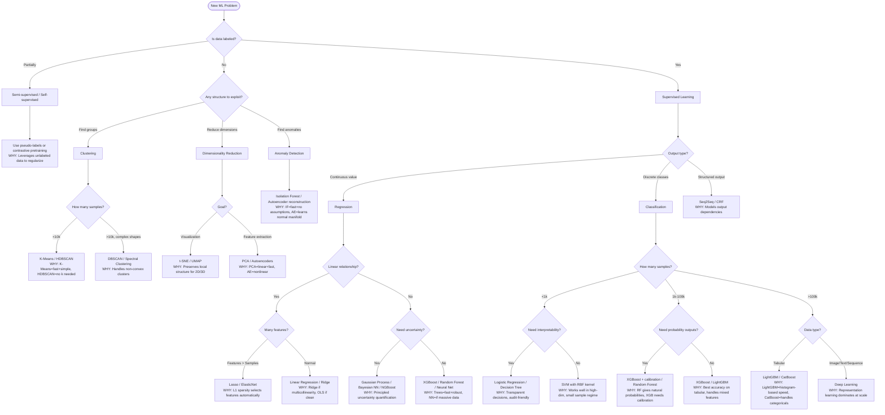
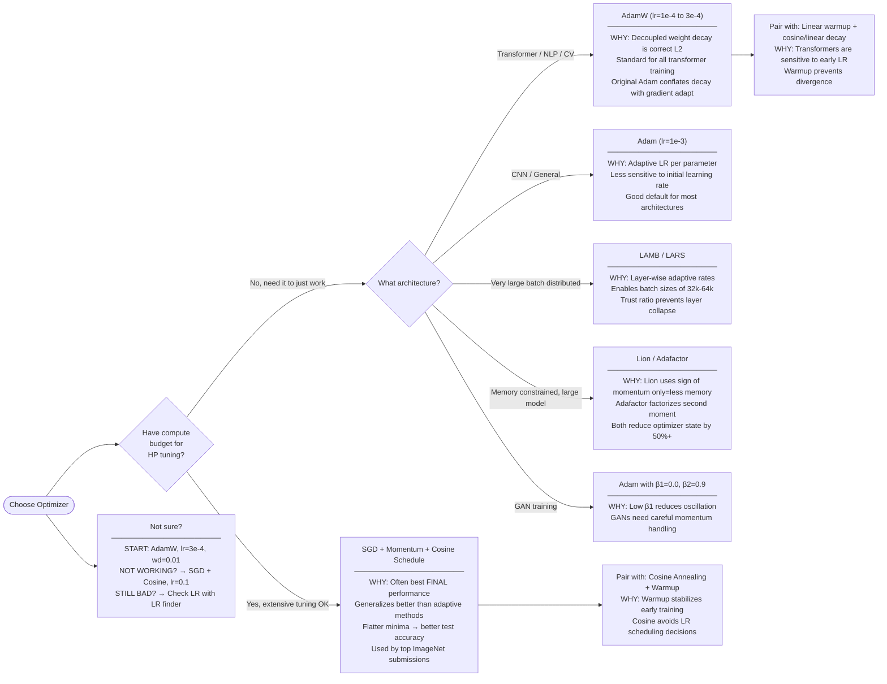
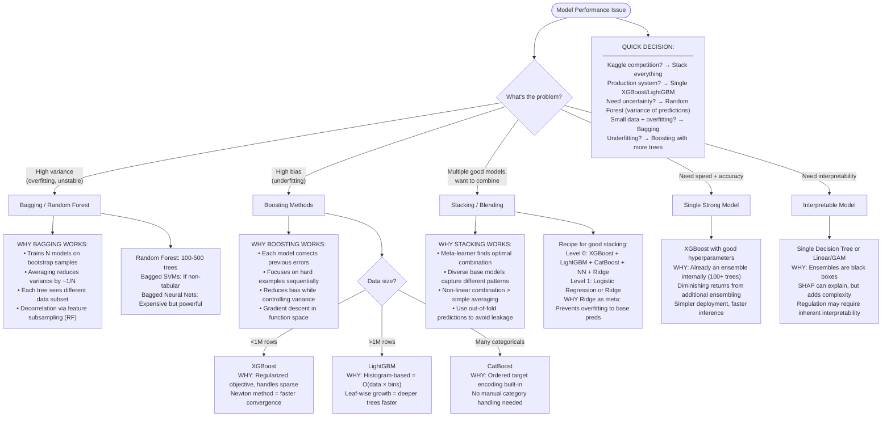
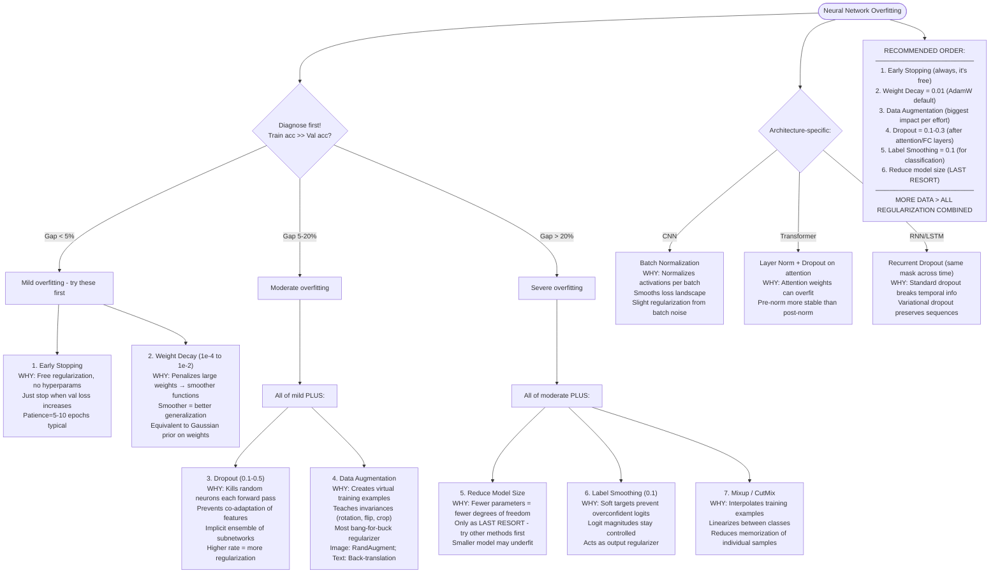
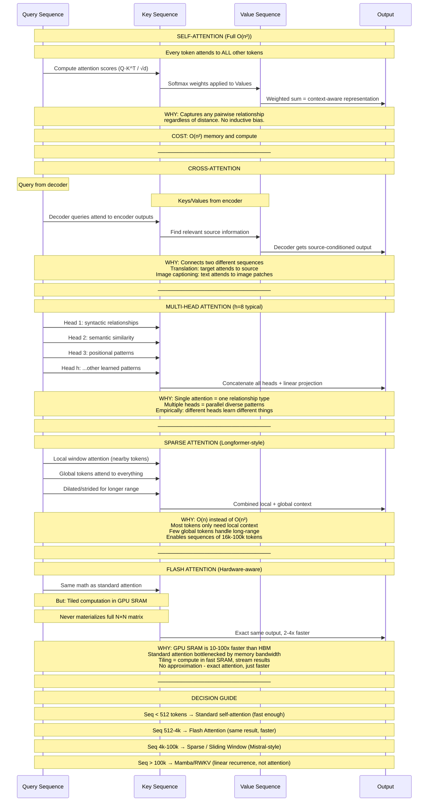
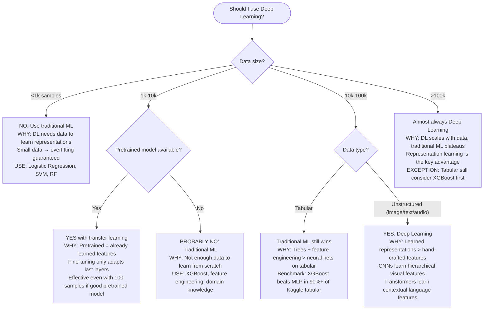

# Algorithm Selection Decision Workflows

> Staff ML Architect reference: Decision paths with reasoning for algorithm, architecture, optimizer, loss, ensemble, regularization, and attention mechanism selection.

---

## Diagram 1: Master Algorithm Selection

---

## Diagram 2: Deep Learning Architecture Selection

```mermaid
flowchart TD
    DLStart([What is your data modality?]) --> Modality{Data Type}

    Modality -->|Images| IMG[Image Data]
    Modality -->|Text / Sequential| SEQ[Sequential Data]
    Modality -->|Tabular| TAB[Tabular Data]
    Modality -->|Time Series| TS[Time Series]
    Modality -->|Graphs| GR[Graph Data]
    Modality -->|Multimodal| MM["Multimodal Fusion<br/>WHY: Different modalities need different encoders"]

    %% Image Branch
    IMG --> ImgSize{Dataset size?}
    ImgSize -->|"<10k samples"| PreTrained["Pretrained ResNet/EfficientNet + fine-tune<br/>WHY: Transfer learning dominates with limited data<br/>ImageNet features are universal edge/texture detectors"]
    ImgSize -->|"10k-1M, real-time needed"| MobileNet["MobileNet / EfficientNet-Lite<br/>WHY: Depthwise separable convs cut FLOPs 8-9x<br/>Latency constraint is the primary driver"]
    ImgSize -->|"Detection task"| Detection{Speed vs Accuracy?}
    Detection -->|Speed priority| YOLO["YOLOv8 / RT-DETR<br/>WHY: Single-shot detection, real-time on edge"]
    Detection -->|Accuracy priority| DETR["DETR / Mask R-CNN<br/>WHY: Set prediction removes NMS heuristics"]
    ImgSize -->|">1M samples"| ViT["Vision Transformer (ViT)<br/>WHY: Scales better with data than CNNs<br/>Global receptive field from layer 1"]

    %% Sequential Branch
    SEQ --> SeqTask{Task type?}
    SeqTask -->|Classification / NLU| BERT["BERT / RoBERTa / DeBERTa<br/>WHY: Bidirectional context captures meaning<br/>MLM pretraining learns deep representations"]
    SeqTask -->|Generation| GenSize{Model budget?}
    GenSize -->|"<1B params"| SmallGen["GPT-2 / Phi / Gemma<br/>WHY: Autoregressive fits generation naturally<br/>Smaller models for fine-tuning feasibility"]
    GenSize -->|">1B params"| LargeGen["Llama / Mistral / GPT-4<br/>WHY: Emergent capabilities at scale<br/>Use RLHF/DPO for alignment"]
    SeqTask -->|"Low latency needed"| Distil["DistilBERT / TinyBERT<br/>WHY: Knowledge distillation preserves 97% accuracy<br/>60% smaller, 2x faster inference"]
    SeqTask -->|"Very long sequences >4k"| LongSeq["Longformer / Mamba / RWKV<br/>WHY: O(n) or O(n log n) attention<br/>Full attention is O(n^2) = impractical for 100k+ tokens"]

    %% Tabular Branch
    TAB --> TabWhy["STILL USE GRADIENT BOOSTING!<br/>WHY: Trees handle missing values natively<br/>No normalization needed<br/>Fast training, great out-of-box<br/>Wins most Kaggle tabular competitions"]
    TabWhy --> TabException{Exception cases?}
    TabException -->|"Need embeddings for entities"| TabNet["TabNet / FT-Transformer<br/>WHY: Learns entity embeddings like DL<br/>Attention over features for interpretability"]
    TabException -->|"Multi-task learning"| TabNN["Neural Network with shared layers<br/>WHY: Shared representations across tasks<br/>Hard to do multi-task with trees"]
    TabException -->|"Streaming / online"| TabOnline["Vowpal Wabbit / River<br/>WHY: Online learning without full retraining"]

    %% Time Series Branch
    TS --> TSType{Complexity?}
    TSType -->|"Univariate, short horizon"| ARIMA["ARIMA / Prophet / ETS<br/>WHY: Simple, interpretable, well-understood<br/>Statistical guarantees, easy to explain"]
    TSType -->|"Multivariate, complex patterns"| LSTM["LSTM / Temporal CNN / N-BEATS<br/>WHY: Learns nonlinear temporal patterns<br/>TCN=parallelizable, LSTM=variable length"]
    TSType -->|"Long-range dependencies"| TSTransformer["Temporal Transformers / PatchTST / iTransformer<br/>WHY: Attention handles long-range dependencies<br/>Patching reduces sequence length"]
    TSType -->|"Forecasting at scale"| TSScale["TimesFM / Chronos<br/>WHY: Foundation models for zero-shot forecasting<br/>Pretrained on millions of time series"]

    %% Graph Branch
    GR --> GRTask{Task?}
    GRTask -->|Node classification| GCN["GCN / GAT / GraphSAGE<br/>WHY: Message passing aggregates neighborhood info<br/>GAT=learned attention weights on neighbors"]
    GRTask -->|Link prediction| GraphSAGE["GraphSAGE / SEAL<br/>WHY: Inductive - works on unseen nodes<br/>Samples neighborhood for scalability"]
    GRTask -->|Graph classification| GIN["GIN / Graph Transformers<br/>WHY: GIN is maximally expressive among MPNNs<br/>Isomorphism test power"]
```

---

## Diagram 3: Optimizer Selection

---

## Diagram 4: Loss Function Selection

```mermaid
flowchart TD
    Task([What is your task?]) --> TaskType{Task Category}

    TaskType -->|Binary Classification| BC[Binary Classification]
    TaskType -->|Multi-class| MC[Multi-class Classification]
    TaskType -->|Regression| REG[Regression]
    TaskType -->|Generation| GEN[Generation]
    TaskType -->|Contrastive / Metric| METRIC[Metric Learning]

    %% Binary Classification
    BC --> BCBalance{Class balance?}
    BCBalance -->|Balanced| BCE["BCEWithLogitsLoss<br/>WHY: Numerically stable (log-sum-exp trick)<br/>Sigmoid + BCE fused avoids overflow"]
    BCBalance -->|"Imbalanced (>10:1)"| Focal["Focal Loss (γ=2)<br/>WHY: Down-weights easy negatives automatically<br/>(1-p)^γ reduces loss for confident predictions<br/>Originally for object detection"]
    BCBalance -->|"Extreme imbalance + ranking"| Hinge["Hinge Loss / BPR Loss<br/>WHY: Learns relative ordering not absolute probs<br/>Better for retrieval/ranking tasks"]

    %% Multi-class Classification
    MC --> MCType{Label structure?}
    MCType -->|Mutually exclusive| CE["CrossEntropyLoss<br/>WHY: Softmax + NLL combined<br/>Maximum likelihood for categorical distribution<br/>The standard for classification"]
    MCType -->|Multi-label| MLBCE["BCEWithLogitsLoss per class<br/>WHY: Each class is independent Bernoulli<br/>Sigmoid per class, not softmax across classes"]
    MCType -->|"Need calibration"| LabelSmooth["CrossEntropy + label_smoothing=0.1<br/>WHY: Prevents overconfident predictions<br/>Soft targets act as regularization<br/>Better calibrated probabilities"]
    MCType -->|"Noisy labels"| Symmetric["Symmetric CE / GCE<br/>WHY: Robust to label noise<br/>Symmetric = CE + Reverse CE"]

    %% Regression
    REG --> RegDist{Error distribution?}
    RegDist -->|"Gaussian / normal"| MSE["MSELoss (L2)<br/>WHY: Maximum likelihood for Gaussian errors<br/>Penalizes large errors quadratically"]
    RegDist -->|"Outliers present"| Robust{How robust?}
    Robust -->|Moderate| Huber["HuberLoss (δ=1.0)<br/>WHY: L2 for small errors, L1 for large<br/>Best of both worlds, smooth"]
    Robust -->|Very robust| MAE["L1Loss (MAE)<br/>WHY: Median regression, constant gradient<br/>Outliers don't dominate the loss"]
    RegDist -->|"Scale matters"| MAPE["MAPE / SMAPE<br/>WHY: Scale-independent percentage errors<br/>Use SMAPE to avoid division by zero"]
    RegDist -->|"Need prediction intervals"| Quantile["Quantile Loss / Pinball Loss<br/>WHY: Predicts specific quantiles<br/>τ=0.5 gives median, τ=0.9 gives 90th percentile"]

    %% Generation
    GEN --> GenType{What are you generating?}
    GenType -->|Text / Tokens| TokenCE["CrossEntropy on vocabulary<br/>WHY: Next-token prediction = categorical over vocab<br/>Teacher forcing during training"]
    GenType -->|Images| ImgLoss["L1 + Perceptual + Adversarial<br/>WHY: L1=pixel structure<br/>Perceptual=high-level feature similarity<br/>Adversarial=sharpness/realism"]
    GenType -->|"VAE latent space"| ELBO["ELBO = Recon + β·KL<br/>WHY: Principled variational inference<br/>KL regularizes latent space to prior<br/>β controls disentanglement"]
    GenType -->|Diffusion| DiffLoss["Simple MSE on noise prediction<br/>WHY: Denoising score matching<br/>Predict noise ε added at timestep t"]

    %% Metric Learning
    METRIC --> MetricType{Training setup?}
    MetricType -->|Pairs available| ContrastiveLoss["Contrastive Loss (margin)<br/>WHY: Pull positives to distance=0<br/>Push negatives beyond margin"]
    MetricType -->|"Triplets (anchor, pos, neg)"| TripletLoss["Triplet Loss (margin=0.2)<br/>WHY: Learns relative distances<br/>d(a,p) + margin < d(a,n)<br/>Hard mining critical for convergence"]
    MetricType -->|"Large batches, self-supervised"| InfoNCE["InfoNCE / NT-Xent<br/>WHY: In-batch negatives = free negatives<br/>Scales with batch size<br/>Used by SimCLR, CLIP, etc."]
```

---

## Diagram 5: Ensemble Method Selection

---

## Diagram 6: Regularization Strategy Selection

---

## Diagram 7: Attention Mechanism Selection

---

## Quick Reference Table

| Problem | First Try | Why | If Not Working |
|---------|-----------|-----|----------------|
| Image classification | ResNet50 pretrained | Best accuracy/speed tradeoff, universal features | EfficientNet-B3 if smaller model needed |
| Object detection | YOLOv8 | Real-time, single-shot, great accuracy | DETR if accuracy > speed |
| Text classification | DistilBERT fine-tuned | 97% of BERT accuracy, 60% smaller, 2x faster | RoBERTa/DeBERTa if accuracy critical |
| Text generation | Llama 3 (8B) | Open-source, strong, fine-tunable | GPT-4 via API if budget allows |
| Tabular classification | XGBoost | Handles everything, fast, minimal preprocessing | LightGBM if >1M rows, CatBoost if many categoricals |
| Tabular regression | LightGBM | Fast histogram splits, good defaults | XGBoost + Optuna tuning if accuracy critical |
| Time series forecast | Prophet / ARIMA | Interpretable, fast, good baselines | N-BEATS / PatchTST if complex patterns |
| Anomaly detection | Isolation Forest | No assumptions, fast, works on any distribution | Autoencoder if high-dimensional |
| Recommendation | Matrix Factorization | Simple, scalable, well-understood | Two-tower neural model if rich features |
| Clustering | HDBSCAN | No k needed, finds arbitrary shapes | K-Means if need speed on >1M points |
| Semantic search | Sentence-BERT embeddings | Dense retrieval, captures meaning | ColBERT if need token-level matching |
| Speech recognition | Whisper (medium) | Multilingual, robust, pretrained | Whisper large-v3 if accuracy critical |
| Graph node classification | GCN / GAT | Simple, effective message passing | GraphSAGE if inductive (new nodes at inference) |
| Multi-label classification | Binary relevance + BCE | Independent per label, simple | Classifier chains if label correlations matter |

---

## Meta-Decision: When to Use Deep Learning vs Traditional ML

---

## Tradeoff Summary: The Axes That Matter

When selecting algorithms, these are the dimensions a staff architect weighs:

1. **Accuracy vs Latency** - Can you afford 100ms inference? Or need <10ms?
2. **Accuracy vs Interpretability** - Regulated domain? Need to explain decisions?
3. **Accuracy vs Data Efficiency** - How much labeled data do you have?
4. **Training Cost vs Inference Cost** - Train once, serve millions? Or retrain daily?
5. **Complexity vs Maintainability** - Who maintains this in 2 years?
6. **Generalization vs Specialization** - One model for all, or fine-tuned per segment?

The best algorithm is often the simplest one that meets your requirements.
