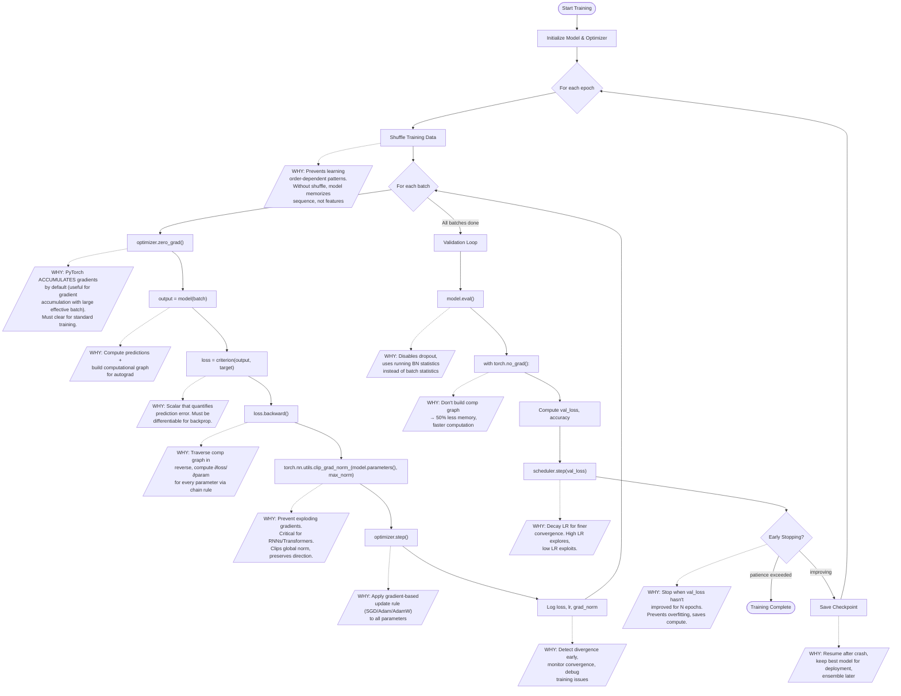
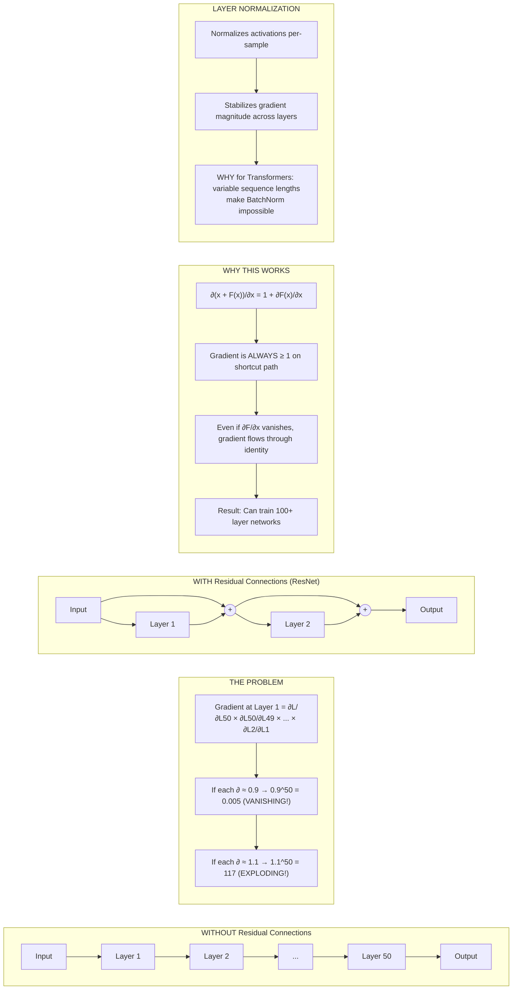
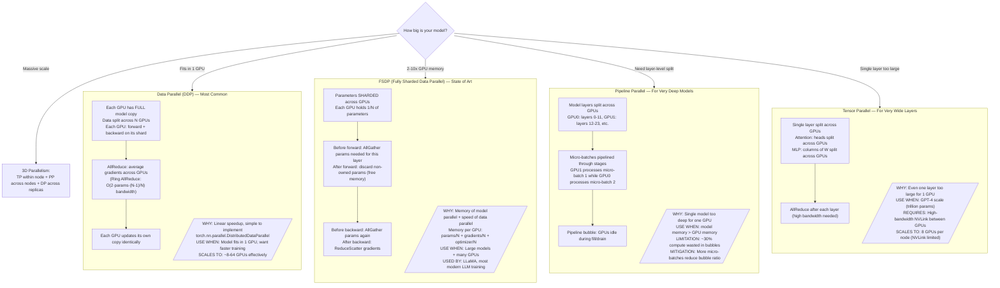
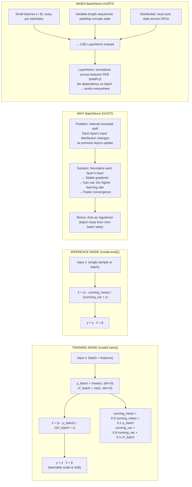

# Training Pipeline Internals - How ML/DL Training Actually Works

> Staff architect-level deep dive into what happens under the hood during model training.

---

## Diagram 1: Neural Network Forward-Backward Pass

The complete data flow through a network showing forward computation, loss calculation, gradient backpropagation via chain rule, and weight updates.

```mermaid
sequenceDiagram
    participant Input
    participant L1 as Layer1 (Linear+ReLU)
    participant L2 as Layer2 (Linear+ReLU)
    participant Out as Output Layer (Softmax)
    participant Loss as Loss Function
    participant Opt as Optimizer (Adam/SGD)

    Note over Input,Opt: ═══ FORWARD PASS (Compute Predictions) ═══
    Input->>L1: x (batch_size × features)
    L1->>L1: z1 = W1·x + b1
    L1->>L1: a1 = ReLU(z1) — store z1 for backward
    L1->>L2: a1 (batch_size × hidden1)
    L2->>L2: z2 = W2·a1 + b2
    L2->>L2: a2 = ReLU(z2) — store z2 for backward
    L2->>Out: a2 (batch_size × hidden2)
    Out->>Out: z3 = W3·a2 + b3
    Out->>Loss: ŷ = softmax(z3) (batch_size × classes)
    Loss->>Loss: L = -Σ yᵢ·log(ŷᵢ) [Cross-Entropy]

    Note over Input,Opt: ═══ BACKWARD PASS (Chain Rule: ∂L/∂W = ∂L/∂z · ∂z/∂W) ═══
    Loss->>Out: ∂L/∂z3 = ŷ - y (softmax+CE simplification)
    Out->>Out: ∂L/∂W3 = (ŷ - y) · a2ᵀ — STORE gradient
    Out->>L2: ∂L/∂a2 = W3ᵀ · (ŷ - y)
    L2->>L2: ∂L/∂z2 = ∂L/∂a2 ⊙ ReLU'(z2) — element-wise
    L2->>L2: ∂L/∂W2 = ∂L/∂z2 · a1ᵀ — STORE gradient
    L2->>L1: ∂L/∂a1 = W2ᵀ · ∂L/∂z2
    L1->>L1: ∂L/∂z1 = ∂L/∂a1 ⊙ ReLU'(z1)
    L1->>L1: ∂L/∂W1 = ∂L/∂z1 · xᵀ — STORE gradient

    Note over Input,Opt: ═══ OPTIMIZER STEP (Update Weights) ═══
    Note over Opt: SGD: W = W - lr·∂L/∂W
    Note over Opt: Adam: W = W - lr·m̂/(√v̂ + ε)
    Opt->>L1: W1 -= lr · f(∂L/∂W1), b1 -= lr · f(∂L/∂b1)
    Opt->>L2: W2 -= lr · f(∂L/∂W2), b2 -= lr · f(∂L/∂b2)
    Opt->>Out: W3 -= lr · f(∂L/∂W3), b3 -= lr · f(∂L/∂b3)

    Note over Input,Opt: Key insight: Forward stores activations, Backward uses them
    Note over Input,Opt: Memory cost = O(batch × layers × hidden) for activation storage
```

---

## Diagram 2: Training Loop Components

The complete training loop with annotations explaining WHY each step exists.



---

## Diagram 3: Gradient Flow Through Common Architectures

Why residual connections, layer norm, and skip connections exist -- solving vanishing/exploding gradients.



---

## Diagram 4: Data Loading Pipeline

CPU/GPU orchestration showing pipelined data loading to keep GPU 100% utilized.

```mermaid
sequenceDiagram
    participant Disk as Disk/SSD
    participant W0 as CPU Worker 0
    participant W1 as CPU Worker 1
    participant W2 as CPU Worker 2
    participant W3 as CPU Worker 3
    participant PM as Pin Memory Thread
    participant GPU as GPU (CUDA)
    participant Model as Model Forward/Backward

    Note over Disk,Model: ═══ Pipelined Data Loading (keep GPU never idle) ═══

    rect rgb(200, 230, 255)
    Note over W0,W3: Batch N: Workers decode + augment in parallel
    par Worker 0 - samples 0-31
        Disk->>W0: Read images from disk (I/O bound)
        W0->>W0: JPEG decode → tensor
        W0->>W0: RandomCrop, HFlip, ColorJitter
        W0->>W0: Normalize(mean, std)
    and Worker 1 - samples 32-63
        Disk->>W1: Read images from disk
        W1->>W1: Decode + Augment + Normalize
    and Worker 2 - samples 64-95
        Disk->>W2: Read images from disk
        W2->>W2: Decode + Augment + Normalize
    and Worker 3 - samples 96-127
        Disk->>W3: Read images from disk
        W3->>W3: Decode + Augment + Normalize
    end
    end

    W0->>PM: Collate into batch tensor
    W1->>PM: 
    W2->>PM: 
    W3->>PM: 
    PM->>PM: Copy to page-locked (pinned) memory

    rect rgb(255, 230, 200)
    Note over GPU,Model: Batch N: GPU computes while CPU loads next
    PM->>GPU: cudaMemcpyAsync (DMA, non-blocking)
    GPU->>Model: Forward pass
    Model->>Model: Backward pass
    Model->>Model: Optimizer step
    end

    rect rgb(200, 255, 200)
    Note over W0,W3: Batch N+1: Already loading (prefetch_factor=2)
    par Prefetching next batch
        Disk->>W0: Read next batch (overlaps GPU compute!)
        Disk->>W1: Read next batch
    end
    end

    Note over Disk,Model: ─── WHY Each Component ───
    Note over W0,W3: num_workers=4: Parallelize CPU-bound decode/augment
    Note over PM: pin_memory=True: Avoids extra copy; DMA can access directly
    Note over W0,W1: prefetch_factor=2: Always have next batch ready
    Note over GPU: non_blocking=True: CPU doesn't wait for transfer to finish
```

---

## Diagram 5: Distributed Training Patterns

When and why to use each distributed training strategy.



---

## Diagram 6: Mixed Precision Training Flow

Why FP16/BF16 works, and the loss scaling trick that makes it stable.

```mermaid
sequenceDiagram
    participant MW as Master Weights (FP32)
    participant FW as Model Weights (FP16)
    participant FP as Forward Pass (FP16)
    participant LS as Loss Scaler
    participant BP as Backward Pass (FP16)
    participant OPT as Optimizer (FP32)

    Note over MW,OPT: ═══ WHY Mixed Precision? ═══
    Note over MW,OPT: FP32: 4 bytes/param → 1B params = 4GB weights + 8GB optimizer (Adam)
    Note over MW,OPT: FP16: 2 bytes/param → 2x throughput on Tensor Cores, 50% memory
    Note over MW,OPT: BUT FP16 min positive = 6×10⁻⁸, many gradients are SMALLER → underflow!

    rect rgb(230, 245, 255)
    Note over MW,OPT: ═══ Training Step ═══

    MW->>FW: Cast FP32 → FP16 (model weights for forward)
    FW->>FP: Forward pass in FP16 (2x faster on Tensor Cores)
    FP->>FP: Compute loss (FP32 for numerical stability)
    FP->>LS: loss (FP32 scalar)

    LS->>LS: scaled_loss = loss × scale_factor (e.g., 1024)
    Note over LS: WHY: Shift gradient distribution into FP16 representable range

    LS->>BP: scaled_loss.backward() — gradients in FP16
    BP->>BP: All gradients are 1024× larger than normal

    BP->>OPT: FP16 gradients
    OPT->>OPT: Unscale: gradients /= scale_factor
    end

    alt No inf/nan in gradients
        OPT->>OPT: Check passed — gradients are valid
        OPT->>MW: optimizer.step() in FP32 (W -= lr × grad)
        Note over OPT,MW: WHY FP32 step: W=1.0, grad=1e-7<br/>FP16 can't represent 1.0 + 1e-7 ≠ 1.0<br/>FP32 CAN represent this difference
        LS->>LS: Increase scale_factor (try to use more FP16 range)
    else inf/nan detected (overflow)
        OPT->>OPT: SKIP optimizer step entirely
        LS->>LS: Decrease scale_factor by 2× (back off)
        Note over LS: WHY: Gradients overflowed FP16 max (65504)<br/>Reduce scale to keep gradients in range
    end

    Note over MW,OPT: ═══ Memory Comparison (1B params) ═══
    Note over MW,OPT: Pure FP32: 4GB weights + 4GB grads + 8GB Adam = 16GB
    Note over MW,OPT: Mixed: 4GB master + 2GB FP16 + 2GB grads + 8GB Adam = 16GB (but 2x speed!)
    Note over MW,OPT: With FSDP: sharded across GPUs → fits much larger models
```

---

## Diagram 7: Batch Normalization Internals

Training vs inference behavior and why the difference matters.



---

## Diagram 8: Learning Rate Schedule Comparison

Decision framework for choosing the right LR schedule.

```mermaid
flowchart TD
    subgraph Schedules["LEARNING RATE SCHEDULES"]
        direction TB

        Const["Constant LR ─────────────<br/>lr = 0.001 throughout<br/>WHY: Simplest baseline<br/>WHEN: Quick experiments only"]

        Step["Step Decay ──╲___╲___<br/>lr × 0.1 every 30 epochs<br/>WHY: Classic, easy to tune<br/>WHEN: ResNet-style CNN training"]

        Cosine["Cosine Annealing ──╲ (smooth curve to 0)<br/>lr = lr_max × 0.5(1 + cos(πt/T))<br/>WHY: Smooth decay, good final convergence<br/>WHEN: Safe default for most tasks"]

        Warmup["Warmup + Linear/Cosine Decay<br/>╱── then ──╲<br/>WHY: Transformers need warmup (Adam moments cold)<br/>WHEN: BERT, GPT, ViT training"]

        OneCycle["OneCycleLR ╱╲ then ╲<br/>Low → High → Very Low<br/>WHY: Super-convergence, explores then refines<br/>WHEN: CNNs, want fast training in few epochs"]

        Plateau["ReduceOnPlateau ───╲ (only when stuck)<br/>Reduce lr by 0.1 when val_loss stalls for N epochs<br/>WHY: Adaptive, no schedule tuning needed<br/>WHEN: Unsure about training dynamics"]
    end

    subgraph Decision["DECISION FLOWCHART"]
        direction TB
        Q1{What architecture?}
        Q1 -->|Transformer/LLM| A1["Warmup + Cosine Decay<br/>warmup_steps = 2000<br/>peak_lr = 1e-4 to 3e-4"]
        Q1 -->|CNN| Q2{Training budget?}
        Q2 -->|"Few epochs (< 50)"| A2["OneCycleLR<br/>max_lr = 10x base_lr"]
        Q2 -->|"Many epochs (100+)"| A3["Cosine Annealing<br/>T_max = total_epochs"]
        Q1 -->|RNN/LSTM| A4["ReduceOnPlateau<br/>patience=5, factor=0.5"]
        Q1 -->|Not sure| A5["Cosine Annealing<br/>(safe default, hard to go wrong)"]
    end

    subgraph Tips["PRACTICAL TIPS"]
        direction TB
        Tip1["LR Finder: sweep lr from 1e-7 to 10,<br/>pick lr where loss drops fastest"]
        Tip2["Warmup rationale: optimizer momentum/variance<br/>estimates are garbage at step 0"]
        Tip3["Weight decay + high LR = implicit regularization<br/>(AdamW decouples weight decay from LR)"]
        Tip4["Batch size ↑ → LR ↑ (linear scaling rule)<br/>Double batch → double LR"]
    end
```



---

## Summary: The Full Picture

```mermaid
flowchart LR
    Data["Data Pipeline<br/>(CPU workers,<br/>prefetch, pin_memory)"] --> Forward["Forward Pass<br/>(FP16, store activations)"]
    Forward --> Loss["Loss Computation<br/>(FP32 for stability)"]
    Loss --> Scale["Loss Scaling<br/>(×1024 for FP16)"]
    Scale --> Backward["Backward Pass<br/>(Chain rule, FP16 grads)"]
    Backward --> Unscale["Unscale + Clip<br/>(÷1024, clip norm)"]
    Unscale --> AllReduce["AllReduce<br/>(if distributed)"]
    AllReduce --> Optimizer["Optimizer Step<br/>(FP32 master weights)"]
    Optimizer --> Schedule["LR Scheduler"]
    Schedule --> Checkpoint["Checkpoint<br/>(if best val_loss)"]
    Checkpoint --> Data

    style Data fill:#e1f5fe
    style Forward fill:#fff3e0
    style Backward fill:#fff3e0
    style Optimizer fill:#e8f5e9
    style AllReduce fill:#f3e5f5
```



---

## Key Takeaways for System Design

| Component | WHY It Exists | What Breaks Without It |
|-----------|--------------|----------------------|
| Gradient clipping | Prevent exploding gradients | Training diverges (NaN loss) |
| Residual connections | Prevent vanishing gradients | Can't train deep networks (>20 layers) |
| Mixed precision | 2x speed, less memory | Slower training, can't fit large models |
| Loss scaling | FP16 gradient underflow prevention | Gradients become zero, no learning |
| BatchNorm/LayerNorm | Stabilize internal distributions | Need tiny LR, slow convergence |
| Data parallelism | Linear speedup with GPUs | Training takes N× longer |
| Pinned memory | Fast CPU→GPU transfer | GPU idles waiting for data |
| Gradient accumulation | Simulate large batch on small GPU | Limited by GPU memory for batch size |
| Warmup | Stabilize optimizer at start | Transformer training diverges immediately |
| Checkpointing | Resume after failure | Lose days of compute on crash |
