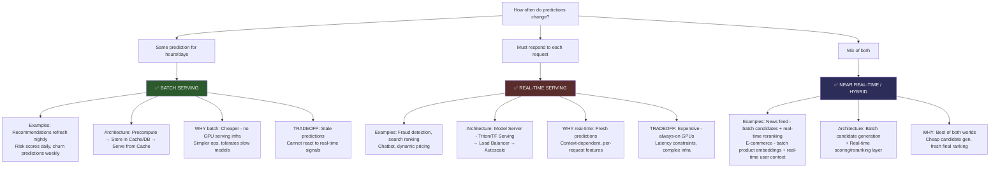
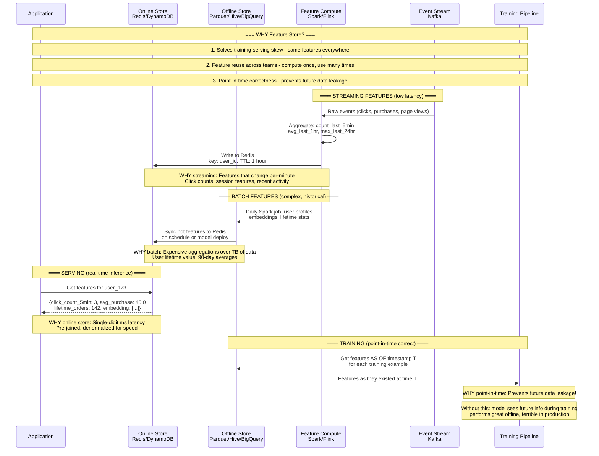
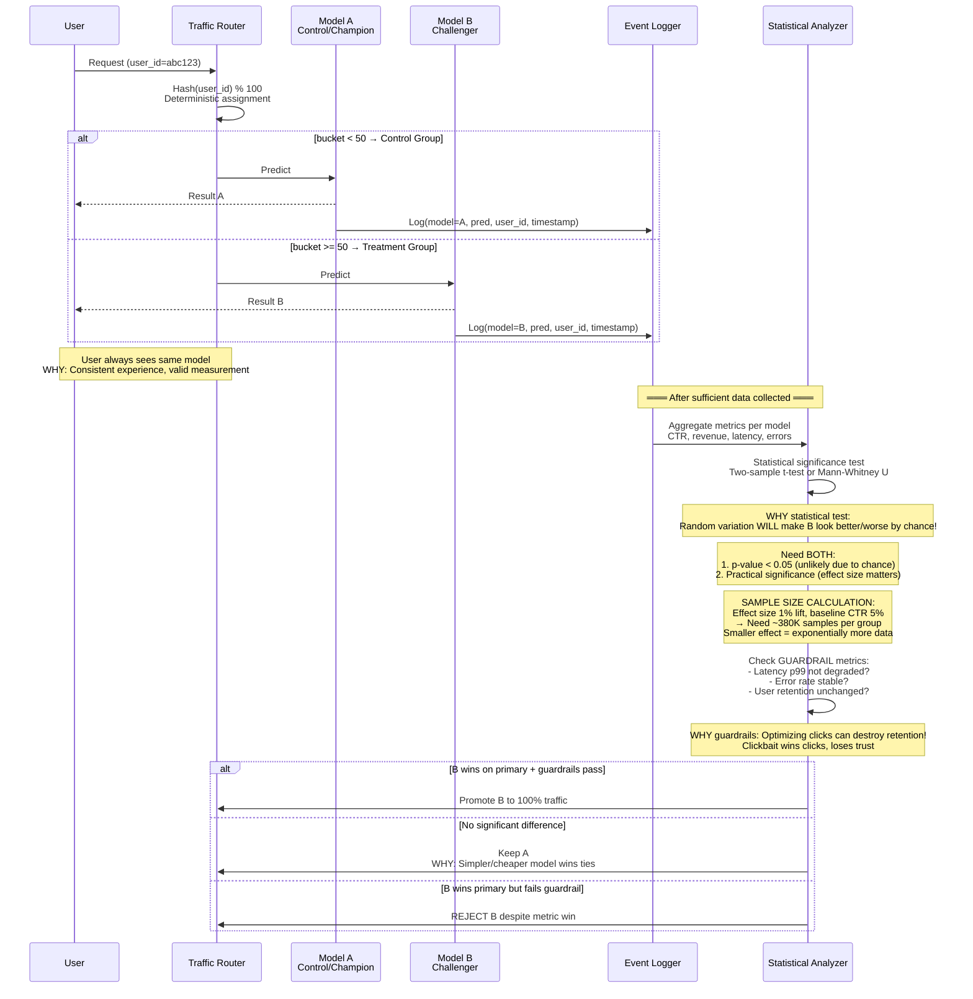
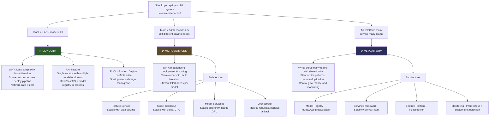
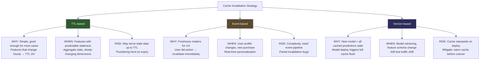
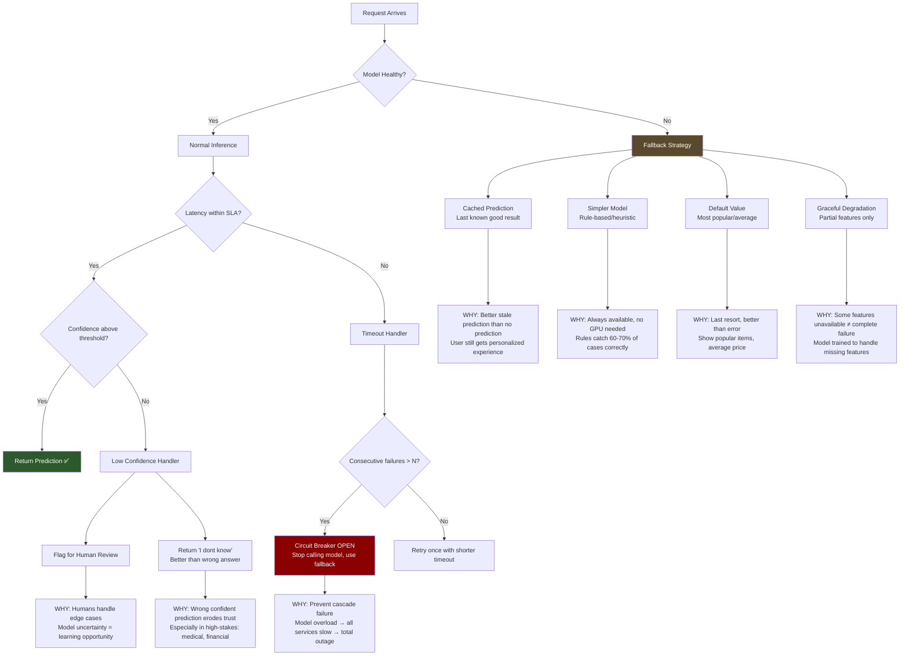
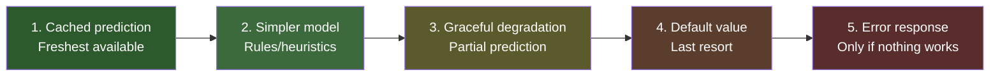

# System Architecture Decisions for Production ML Systems

> Decisions a staff architect makes when designing production ML systems — with reasoning for each choice.

---

## Diagram 1: Batch vs Real-Time Serving Decision

### Decision Heuristic

| Signal | Batch | Real-Time |
|--------|-------|-----------|
| Prediction changes | Hourly/daily | Per-request |
| Latency requirement | Seconds OK | < 100ms |
| Cost sensitivity | High | Lower (revenue justifies) |
| Model complexity | Can be huge | Must be fast |
| Data freshness need | Low | High |

---

## Diagram 2: Model Serving Patterns

```mermaid
flowchart TD
    Root[Model Serving Patterns] --> Sync[Synchronous<br/>REST/gRPC]
    Root --> Async[Asynchronous<br/>Queue-based]
    Root --> Stream[Streaming<br/>WebSocket/SSE]
    Root --> Edge[Embedded<br/>Edge/On-device]
    Root --> Sidecar[Sidecar<br/>Service Mesh]

    Sync --> SFlow[Client → Request → Model → Response]
    Sync --> SWhy[WHY: Simple, immediate response<br/>Easy to reason about]
    Sync --> SWhen[WHEN: Latency < 100ms required<br/>User-facing, simple models]
    Sync --> SRisk[RISK: Timeout if model slow<br/>Blocks caller, no backpressure]

    Async --> AFlow[Client → Queue → Worker → Result Store → Client polls]
    Async --> AWhy[WHY: Decouple caller from model<br/>Handle traffic spikes, backpressure]
    Async --> AWhen[WHEN: Can tolerate seconds delay<br/>Heavy models like LLMs, batch jobs]
    Async --> ARisk[RISK: Complexity, eventual consistency<br/>Harder debugging, queue management]

    Stream --> StFlow[Client → Stream connection → Tokens arrive progressively]
    Stream --> StWhy[WHY: Better UX for generative models<br/>User sees progress, faster perceived latency]
    Stream --> StWhen[WHEN: LLM responses, real-time transcription<br/>Live translation, progressive rendering]
    Stream --> StRisk[RISK: Connection management<br/>Partial failures, reconnection logic]

    Edge --> EFlow[Model runs on client device<br/>Mobile, IoT, browser WASM]
    Edge --> EWhy[WHY: No network latency, works offline<br/>Privacy - data never leaves device]
    Edge --> EWhen[WHEN: Mobile apps, IoT sensors<br/>Privacy-sensitive, low-connectivity]
    Edge --> ERisk[RISK: Model size limits 50-200MB<br/>Hard to update, device heterogeneity]

    Sidecar --> ScFlow[Model runs alongside app container<br/>Shared pod in Kubernetes]
    Sidecar --> ScWhy[WHY: Language-agnostic inference<br/>Separate scaling, clear boundaries]
    Sidecar --> ScWhen[WHEN: Microservices architecture<br/>Polyglot teams, multiple models per service]

    style Sync fill:#1a5276,color:#fff
    style Async fill:#1a5276,color:#fff
    style Stream fill:#1a5276,color:#fff
    style Edge fill:#1a5276,color:#fff
    style Sidecar fill:#1a5276,color:#fff
```

---

## Diagram 3: Scaling ML Systems Decision Tree

```mermaid
flowchart TD
    Problem[Your ML model is too slow/expensive] --> Latency[Latency too high<br/>p99 > 100ms]
    Problem --> Throughput[Throughput too low<br/>Cannot handle QPS]
    Problem --> Cost[Cost too high<br/>GPU bill exploding]

    Latency --> LModel[Model too large?]
    Latency --> LPrep[Preprocessing slow?]
    Latency --> LNet[Network overhead?]
    Latency --> LGPU[Single request too slow?]

    LModel --> LMFix[Quantization INT8/FP16<br/>Distillation, Pruning]
    LMFix --> LMWhy[WHY: 2-4x speedup with less than 1% accuracy loss<br/>INT8 halves memory, doubles throughput]

    LPrep --> LPFix[Precompute features<br/>Cache embeddings]
    LPFix --> LPWhy[WHY: Feature computation often 3-5x slower<br/>than model inference itself]

    LNet --> LNFix[Batch requests together<br/>gRPC instead of REST]
    LNFix --> LNWhy[WHY: gRPC is 5-10x faster for small payloads<br/>Batching amortizes network overhead]

    LGPU --> LGFix[GPU serving with TensorRT<br/>Operator fusion, kernel optimization]
    LGFix --> LGWhy[WHY: GPU parallel compute for matrix ops<br/>TensorRT can give 3-6x over naive PyTorch]

    Throughput --> TRep[Add replicas - horizontal scaling]
    Throughput --> TBatch[Dynamic batching]
    Throughput --> TShard[Model sharding - tensor parallelism]
    Throughput --> TQueue[Async processing + queue]

    TRep --> TRWhy[WHY: Linear scaling for stateless model servers<br/>K8s HPA makes this simple]
    TBatch --> TBWhy[WHY: GPU utilization jumps from 10% to 80%<br/>Wait a few ms, batch 8-32 requests together]
    TShard --> TSWhy[WHY: Single model across multiple GPUs<br/>For models too large for one GPU]
    TQueue --> TQWhy[WHY: Smooth out traffic spikes<br/>Degrade gracefully under load]

    Cost --> CDistill[Smaller model via distillation]
    Cost --> CSpot[Spot/preemptible instances]
    Cost --> CCascade[Cascade: cheap model first<br/>expensive only if uncertain]
    Cost --> CCache[Cache frequent predictions]

    CDistill --> CDWhy[WHY: 90% quality at 10% cost<br/>DistilBERT = 40% smaller, 60% faster]
    CSpot --> CSWhy[WHY: 60-70% savings<br/>Use for batch, stateless serving]
    CCascade --> CCWhy[WHY: 80% of requests handled by fast model<br/>Only 20% need expensive model]
    CCache --> CKWhy[WHY: Many requests are duplicates<br/>Search queries follow power law]

    style Latency fill:#8b0000,color:#fff
    style Throughput fill:#8b4500,color:#fff
    style Cost fill:#006400,color:#fff
```

---

## Diagram 4: Feature Store Architecture

### Feature Store Decision Matrix

| Feature Type | Compute | Store | Freshness | Example |
|-------------|---------|-------|-----------|---------|
| Streaming | Flink/Spark Streaming | Redis | Seconds | Click count last 5 min |
| Batch | Spark/SQL | Parquet + Redis | Hours | User lifetime value |
| On-demand | Real-time transform | None (computed) | Instant | Text length, IP geolocation |

---

## Diagram 5: A/B Testing for ML Models

### A/B Testing Key Decisions

**WHY you need statistical significance (not just "B has higher metric"):**
- With 1000 users, random chance alone creates ~3% metric swings
- A model that's actually identical can "win" 50% of the time without significance testing
- Type I error (false positive): Shipping a worse model thinking it's better

**Sample size calculation rule of thumb:**
- Minimum Detectable Effect (MDE) of 1% relative lift → ~400K samples per variant
- MDE of 5% → ~16K samples per variant
- Smaller effects need exponentially more data to detect

**Multi-Armed Bandit as alternative:**
- WHY: Faster convergence, less wasted traffic on losing variant
- HOW: Dynamically shift traffic toward winner (Thompson Sampling, UCB)
- TRADEOFF: Harder to get clean statistical significance, non-stationary
- WHEN: High cost of showing bad variant (revenue loss), many variants to test

---

## Diagram 6: Microservices vs Monolith for ML

### When to Split: Concrete Signals

| Signal | Stay Monolith | Split |
|--------|--------------|-------|
| Deploy frequency | Same cadence | Model A daily, Model B weekly |
| Resource needs | All similar | One needs GPU, others CPU |
| Team structure | Same team owns all | Different teams, different models |
| Failure blast radius | Acceptable | One model crash kills everything |
| Shared state | Heavy sharing | Minimal coupling |

---

## Diagram 7: Caching Strategies for ML Systems

```mermaid
flowchart LR
    subgraph Request Path
        Req[Request] --> FC[Feature Cache]
        FC --> EC[Embedding Cache]
        EC --> PC[Prediction Cache]
        PC --> Resp[Response]
    end

    subgraph FC_Detail[Feature Cache]
        FC1[WHY: Expensive feature computation<br/>Same user = same features for seconds]
        FC2[HIT RATE: 40-60% typical<br/>Users make multiple requests quickly]
        FC3[TTL: 5-60 seconds<br/>Features change slowly]
    end

    subgraph EC_Detail[Embedding Cache]
        EC1[WHY: Embedding lookup is expensive<br/>Embeddings change only on retrain]
        EC2[HIT RATE: 80-95%<br/>Popular items requested repeatedly]
        EC3[TTL: Hours to days<br/>Until model retrain]
    end

    subgraph PC_Detail[Prediction Cache]
        PC1[WHY: Same input = same output<br/>Many queries are repeated]
        PC2[HIT RATE: 20-70% depends on domain<br/>Search queries follow power law]
        PC3[TTL: Minutes to hours<br/>Balance freshness vs cost]
    end

    subgraph MW[Model Weight Cache]
        MW1[WHY: Loading from disk/S3 is slow<br/>Keep hot models in GPU memory]
        MW2[Strategy: LRU eviction<br/>Pin frequently-used models]
    end

    FC --> FC_Detail
    EC --> EC_Detail
    PC --> PC_Detail
```

### Cache Invalidation Strategies

### Caching Decision Quick Reference

| Cache Layer | Typical Store | TTL | Hit Rate | Savings |
|-------------|--------------|-----|----------|---------|
| Feature cache | Local/Redis | 5-60s | 40-60% | Skip feature DB call |
| Embedding cache | Redis/Memcached | Hours | 80-95% | Skip vector lookup |
| Prediction cache | Redis/CDN | Minutes | 20-70% | Skip entire inference |
| Model weights | GPU memory/RAM | Until eviction | 99%+ | Skip model load |

---

## Diagram 8: Error Handling & Fallback Patterns

### Fallback Priority Order

### Error Budget Philosophy

| Failure Mode | Acceptable Rate | Response | WHY |
|-------------|----------------|----------|-----|
| Model timeout | < 1% of requests | Serve cached | Users tolerate slightly stale |
| Low confidence | < 5% of predictions | Flag + default | Reduces error rate at cost of coverage |
| Complete outage | < 0.1% uptime loss | Full fallback stack | SLA commitment |
| Data pipeline delay | < 1 hour | Serve with stale features | Features change slowly enough |

---

## Summary: Architecture Decision Cheat Sheet

| Decision | Default Choice | Switch When |
|----------|---------------|-------------|
| Batch vs Real-time | Batch (cheaper) | Predictions must reflect last-second data |
| Sync vs Async serving | Sync (simpler) | Model > 1s latency, need backpressure |
| Monolith vs Micro | Monolith (start here) | Teams/models/scaling needs diverge |
| Cache strategy | TTL-based (simple) | Need sub-second freshness |
| Fallback pattern | Cached + rules | High-stakes = "I don't know" is better |
| A/B vs Bandit | A/B (cleaner stats) | Many variants, high cost of losing variant |
| Feature store | None (start simple) | Training-serving skew bugs appear |
| GPU vs CPU serving | CPU (cheaper) | Latency requirement forces GPU |
