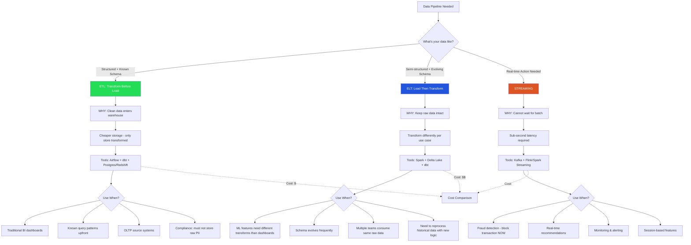
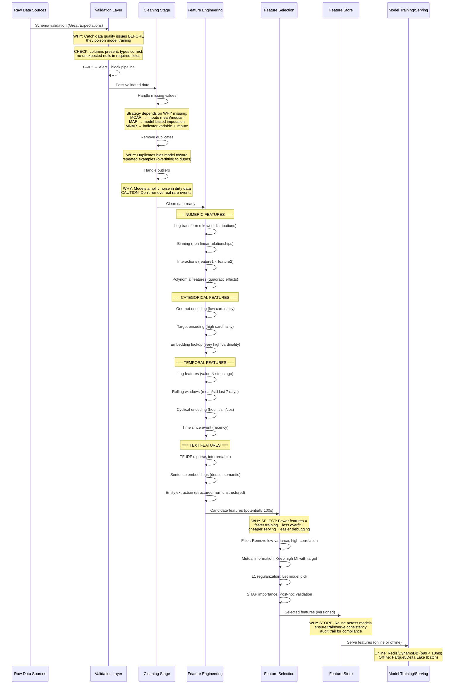
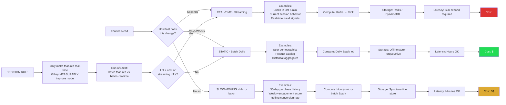
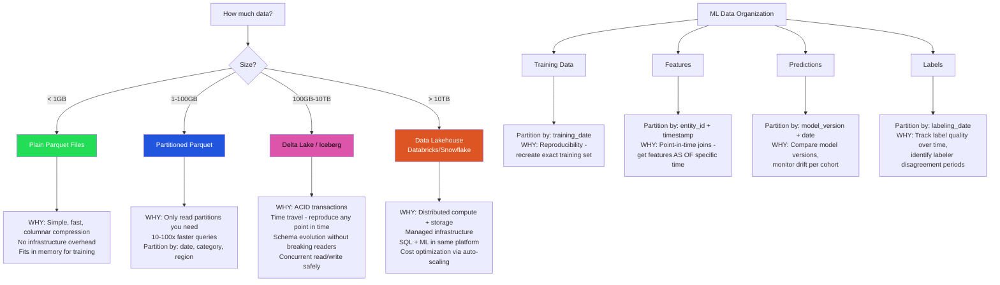

# Data Pipeline & Feature Engineering Decision Workflows

> Staff architect guide: How to choose data pipeline patterns, engineer features systematically, and ensure data quality for ML systems.

---

## Diagram 1: ETL vs ELT vs Streaming Decision



### Decision Rationale

| Factor | ETL | ELT | Streaming |
|--------|-----|-----|-----------|
| Latency tolerance | Hours | Minutes-Hours | Sub-second |
| Schema stability | Fixed | Evolving | Event-driven |
| Storage cost priority | High | Medium | Low (speed matters more) |
| Reprocessing need | Rare | Frequent | N/A |
| Team maturity needed | Low | Medium | High |
| Debugging difficulty | Easy | Medium | Hard |

---

## Diagram 2: Feature Engineering Pipeline



---

## Diagram 3: Data Quality Decision Framework

```mermaid
flowchart TD
    A[Data Arrives] --> B[Schema Check]
    A --> C[Volume Check]
    A --> D[Freshness Check]
    A --> E[Distribution Check]
    A --> F[Null Rate Check]
    A --> G[Cross-table Consistency]
    
    %% Schema
    B --> B1{Columns present?<br/>Types correct?}
    B1 -->|FAIL| B2[BLOCK pipeline + alert on-call]
    B1 -->|PASS| B3[Continue]
    B2 --> B2a[WHY: Wrong schema = model crashes<br/>or produces silent garbage predictions]
    
    %% Volume
    C --> C1{Row count in<br/>expected range?}
    C1 -->|TOO FEW| C2[Investigate: source down? filter bug?]
    C1 -->|TOO MANY| C3[Investigate: duplicate events? replay?]
    C1 -->|NORMAL| C4[Continue]
    C2 --> C2a[WHY: Empty dataset = stale model<br/>Tiny dataset = unreliable retraining]
    C3 --> C3a[WHY: Huge spike = duplicates<br/>bias model toward repeated events]
    
    %% Freshness
    D --> D1{Latest timestamp<br/>within SLA?}
    D1 -->|STALE| D2[Alert: source pipeline broken]
    D1 -->|FRESH| D3[Continue]
    D2 --> D2a[WHY: Stale features = model makes<br/>decisions on old information]
    
    %% Distribution
    E --> E1{Feature stats within<br/>3σ of historical?}
    E1 -->|DRIFT| E2[WARN: drift detected]
    E1 -->|STABLE| E3[Continue]
    E2 --> E2a[WHY: Input drift → predictions<br/>become unreliable over time]
    E2 --> E2b[Action: Log drift score,<br/>trigger retrain if sustained]
    
    %% Nulls
    F --> F1{Null % below<br/>threshold per column?}
    F1 -->|CRITICAL NULL| F2[BLOCK: core feature missing]
    F1 -->|OPTIONAL NULL| F3[WARN: impute and continue]
    F1 -->|OK| F4[Continue]
    F2 --> F2a[WHY: Model NEEDS this feature.<br/>Imputing critical features = garbage]
    
    %% Consistency
    G --> G1{FK relationships hold?<br/>Aggregates match?}
    G1 -->|INCONSISTENT| G2[BLOCK: data corruption detected]
    G1 -->|CONSISTENT| G3[Continue]
    G2 --> G2a[WHY: Inconsistent data =<br/>conflicting signals to model]

    style B2 fill:#d33,color:#fff
    style C2 fill:#d93,color:#fff
    style C3 fill:#d93,color:#fff
    style D2 fill:#d33,color:#fff
    style E2 fill:#da3,color:#000
    style F2 fill:#d33,color:#fff
    style G2 fill:#d33,color:#fff
```



### Quality Check Priority Matrix

| Check | Severity | Block Pipeline? | Automation |
|-------|----------|----------------|------------|
| Schema | Critical | Yes, always | Great Expectations / Pandera |
| Volume | High | Yes if zero rows | Custom threshold alerts |
| Freshness | High | Yes if > 2x SLA | Timestamp monitoring |
| Distribution | Medium | No, warn + log | PSI / KS test automated |
| Null rate | Depends | Critical cols only | Per-column thresholds |
| Consistency | Critical | Yes | Cross-table assertions |

---

## Diagram 4: Streaming vs Batch Features Decision



### Cost Reality Check

```
Real-time pipeline (Kafka + Flink + Redis):
  Infrastructure: ~$5,000-20,000/month
  Engineering: 2-3 engineers to maintain
  Debugging: Hard (distributed, async, exactly-once semantics)

Batch pipeline (Daily Spark):
  Infrastructure: ~$200-1,000/month
  Engineering: 0.5 engineer to maintain
  Debugging: Easy (rerun, inspect intermediate outputs)

RULE OF THUMB: Start batch. Add real-time only when you can prove
the latency improvement drives measurable business value.
```

---

## Diagram 5: Data Partitioning & Storage Strategy



### Storage Format Comparison for ML

| Format | Compression | Schema Evolution | Time Travel | Best For |
|--------|-------------|-----------------|-------------|----------|
| CSV | None | No | No | Never use for ML |
| Parquet | Excellent | Limited | No | Small-medium datasets |
| Delta Lake | Excellent | Yes | Yes | Production ML pipelines |
| Iceberg | Excellent | Yes | Yes | Multi-engine (Spark+Trino) |
| ORC | Good | Limited | No | Hive-heavy ecosystems |

### Point-in-Time Correctness (Critical for ML)

```
WRONG: Join features using latest values
  → Training uses "future" information → Data leakage → Overly optimistic metrics

RIGHT: Join features AS OF the label timestamp
  → Feature values reflect what model would have seen at prediction time
  
Example:
  Label: "User churned on March 15"
  Features must be: values as of March 14 (day before)
  NOT: current values (includes post-churn behavior)
```

---

## Summary: Data Pipeline Decision Checklist

1. **ETL vs ELT vs Streaming** → Based on latency needs and schema stability
2. **Feature engineering** → Systematic pipeline with validation at each stage
3. **Data quality** → Automated checks that block bad data before it reaches models
4. **Batch vs real-time features** → Start batch, prove value before going real-time
5. **Storage strategy** → Size-appropriate, with ML-specific partitioning for reproducibility
