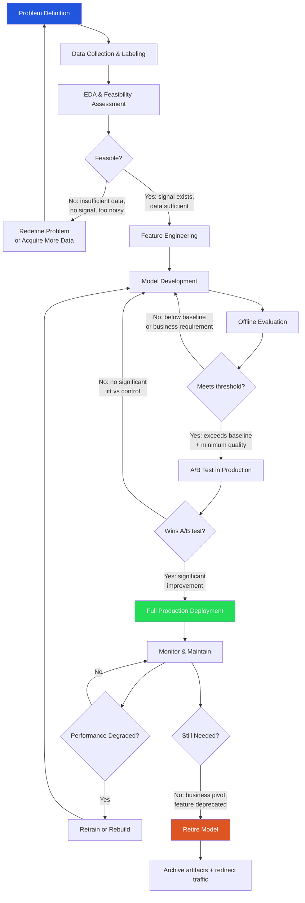
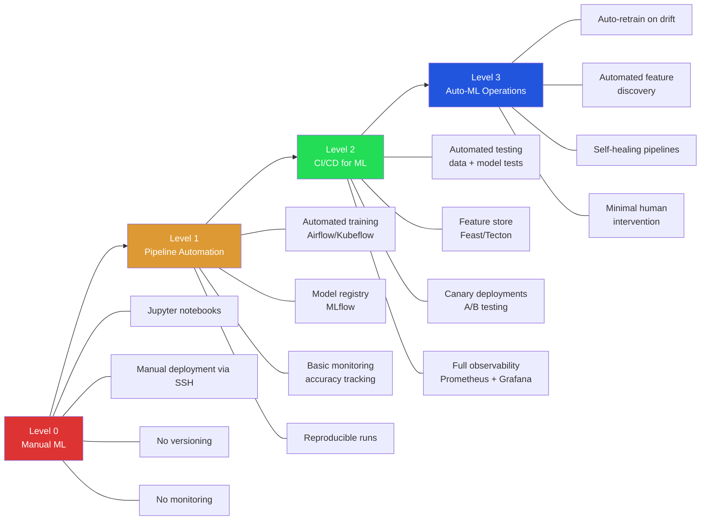
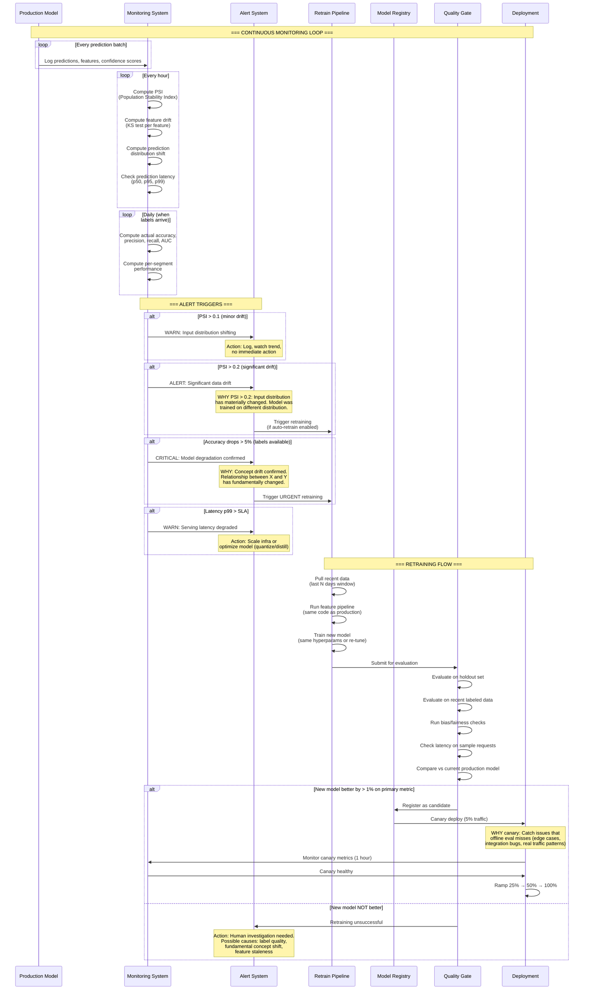
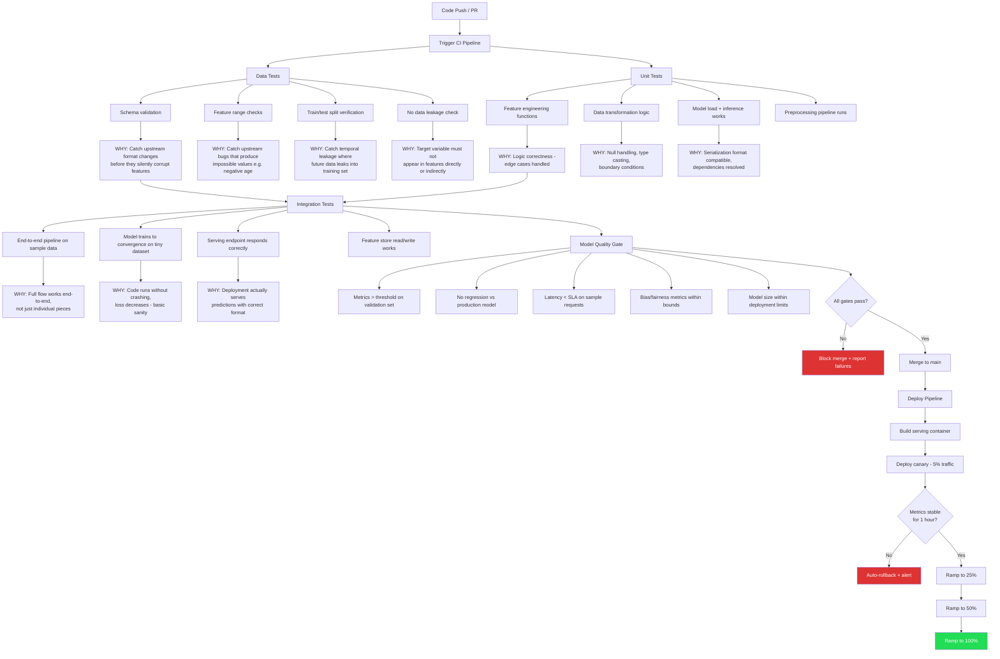
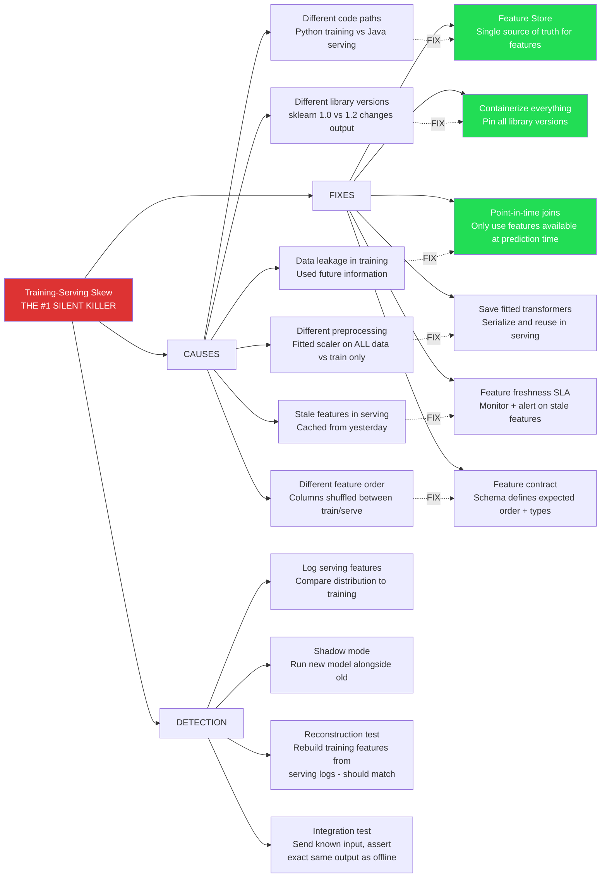
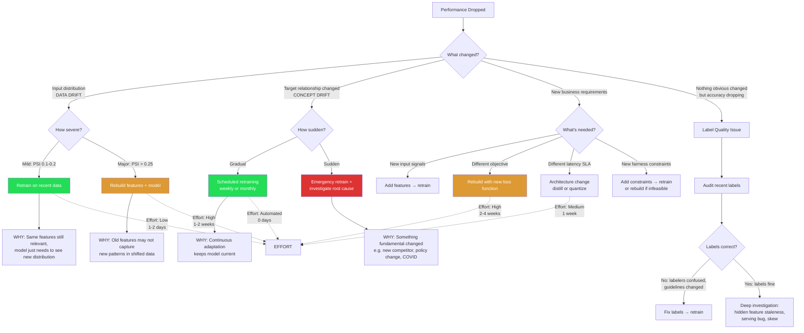

# Model Lifecycle & MLOps Decision Workflows

> Staff architect guide: End-to-end model lifecycle management, from problem definition through monitoring, retraining, and retirement.

---

## Diagram 1: Complete Model Lifecycle



### Why Each Step Exists (Skip at Your Peril)

| Step | WHY it exists | What goes wrong if skipped |
|------|--------------|--------------------------|
| **Problem Definition** | Ensures ML is the right solution | Build model for wrong problem, waste months |
| **Data Collection** | Garbage in = garbage out | Model learns noise, not signal |
| **EDA & Feasibility** | Validates signal exists in data | Spend weeks training on random noise |
| **Feature Engineering** | Raw data rarely useful directly | Weak model, miss obvious patterns |
| **Offline Evaluation** | Cheap to test before production | Deploy bad model, damage user trust |
| **A/B Test** | Offline metrics ≠ real-world impact | Model "works" offline but hurts business metrics |
| **Monitoring** | Models degrade silently over time | Serving stale/wrong predictions for months |
| **Retirement** | Dead models accumulate tech debt | Paying infra costs for unused models |

---

## Diagram 2: MLOps Maturity Levels



### Maturity Level Details

```
LEVEL 0: Manual ML
├── PROBLEMS:
│   ├── "It worked on my machine" - can't reproduce results
│   ├── No audit trail - which model is in production?
│   ├── Manual deployment takes days, error-prone
│   └── Nobody knows when model degrades
├── WHO: Individual data scientists, early startups
└── COST OF STAYING HERE: Models break silently, team can't scale

LEVEL 1: Pipeline Automation
├── IMPROVEMENTS:
│   ├── Reproducible: rerun same pipeline, get same model
│   ├── Versioned: know exactly which model is deployed
│   ├── Scheduled: retraining happens automatically
│   └── Tracked: experiments logged with metrics
├── STILL MISSING: CI/CD, feature stores, proper testing
└── WHO: Growing ML teams (3-5 data scientists)

LEVEL 2: CI/CD for ML
├── IMPROVEMENTS:
│   ├── Production-grade reliability (SLA guarantees)
│   ├── Automated quality gates (bad models can't deploy)
│   ├── Feature consistency (feature store)
│   ├── Safe deployments (canary, rollback)
│   └── Full observability (know exactly what's happening)
├── INVESTMENT: Dedicated ML platform team (2-4 engineers)
└── WHO: Companies where ML is core to product

LEVEL 3: Auto-ML Operations
├── IMPROVEMENTS:
│   ├── Self-healing: pipeline detects and fixes issues
│   ├── Auto-retrain: drift detected → new model deployed
│   ├── Auto-feature: discovers useful new features
│   └── Human role: set guardrails, handle edge cases
├── REALITY CHECK: Very few orgs actually achieve this fully
└── WHO: Google, Meta, Netflix (ML at massive scale)
```

---

## Diagram 3: Model Monitoring & Retraining Triggers



### Monitoring Metrics Cheat Sheet

| Metric | What it measures | Threshold | Action |
|--------|-----------------|-----------|--------|
| PSI | Input distribution shift | > 0.2 | Retrain |
| KS statistic | Per-feature drift | > 0.1 | Investigate feature |
| Accuracy/AUC | Model correctness | > 5% drop | Urgent retrain |
| Prediction entropy | Model confidence | Increasing trend | Model uncertain on new data |
| Latency p99 | Serving speed | > SLA | Scale or optimize |
| Null feature rate | Data quality | > baseline | Fix upstream pipeline |

---

## Diagram 4: CI/CD Pipeline for ML



### What to Test at Each Level

```
UNIT TESTS (fast, run on every commit):
├── Feature engineering: test_log_transform_handles_zero()
├── Preprocessing: test_null_imputation_strategy()
├── Encoding: test_category_encoding_unknown_values()
└── Runtime: < 30 seconds total

INTEGRATION TESTS (medium, run on PR):
├── Pipeline: full training pipeline on 100 rows
├── Serving: load model, send request, get response
├── Feature store: write features, read back correctly
└── Runtime: < 10 minutes

MODEL QUALITY (slow, run before deploy):
├── Full evaluation on validation set
├── Comparison vs production baseline
├── Stress test: 1000 concurrent requests
└── Runtime: < 1 hour
```

---

## Diagram 5: Training-Serving Skew Prevention



### Real-World Skew Examples

```
EXAMPLE 1: Feature computed differently
  Training: user_age = current_date - birth_date (computed at training time)
  Serving: user_age = cached value from user profile (updated monthly)
  RESULT: Model sees "stale" ages, predictions slightly off

EXAMPLE 2: Preprocessing difference
  Training: StandardScaler().fit_transform(all_data)  ← WRONG (uses test info)
  Serving: StandardScaler loaded, but fitted on different data
  RESULT: Features have different scale, model produces garbage

EXAMPLE 3: Data leakage
  Training: feature = "average purchase amount" (includes FUTURE purchases)
  Serving: feature = "average purchase amount" (only PAST purchases)
  RESULT: Model looks great offline (95% AUC), terrible online (60% AUC)

PREVENTION CHECKLIST:
□ Single feature computation code path (feature store)
□ All transformers serialized with model artifact
□ Point-in-time correctness validated
□ Integration test: same input → same output (train vs serve)
□ Feature distribution monitoring (train vs serve distributions)
```

---

## Diagram 6: When to Retrain vs Rebuild



### Decision Quick Reference

| Situation | Action | Effort | Timeline |
|-----------|--------|--------|----------|
| Mild data drift | Retrain same model | Low | 1-2 days |
| Major data drift | Rebuild features + model | High | 1-2 weeks |
| Gradual concept drift | Automate weekly retraining | Setup once | Ongoing |
| Sudden concept drift | Emergency retrain + RCA | Medium | 2-3 days |
| Need new features | Add features, retrain | Medium | 3-5 days |
| Need new objective | Redesign model | High | 2-4 weeks |
| Need lower latency | Distill/quantize | Medium | 1 week |
| Label quality degraded | Audit + fix + retrain | Medium | 1 week |

### Retraining Strategy Patterns

```
PATTERN 1: Sliding Window
  Train on last N days of data
  WHY: Recent data most relevant, old data may hurt
  WHEN: Fast-changing domains (ads, recommendations)

PATTERN 2: Growing Window  
  Train on ALL historical data
  WHY: More data = better generalization
  WHEN: Slow-changing domains (credit scoring, medical)

PATTERN 3: Weighted Window
  Train on all data, but weight recent data higher
  WHY: Best of both - history for rare events, recency for trends
  WHEN: Mixed domains (fraud - need rare historical fraud + recent patterns)

PATTERN 4: Trigger-based
  Retrain only when drift detected (not on schedule)
  WHY: Avoid unnecessary retraining costs
  WHEN: Stable domains where drift is rare but impactful
```

---

## Summary: MLOps Decision Framework

1. **Lifecycle** → Every step exists for a reason; skipping any creates silent failures
2. **Maturity** → Match investment to business criticality; not everyone needs Level 3
3. **Monitoring** → PSI for drift, accuracy for degradation, latency for SLA
4. **CI/CD** → Test data, code, and model quality; automate deployment with rollback
5. **Skew** → Use feature stores + containerization; the #1 cause of "works offline, fails online"
6. **Retrain vs Rebuild** → Severity of change determines response; automate the common case
