# LLM & GenAI Architecture Decisions

> Critical architecture decisions every staff+ engineer must understand when building LLM-powered systems.

---

## Diagram 1: RAG vs Fine-tuning vs Prompt Engineering Decision

The #1 architecture decision for any LLM application.

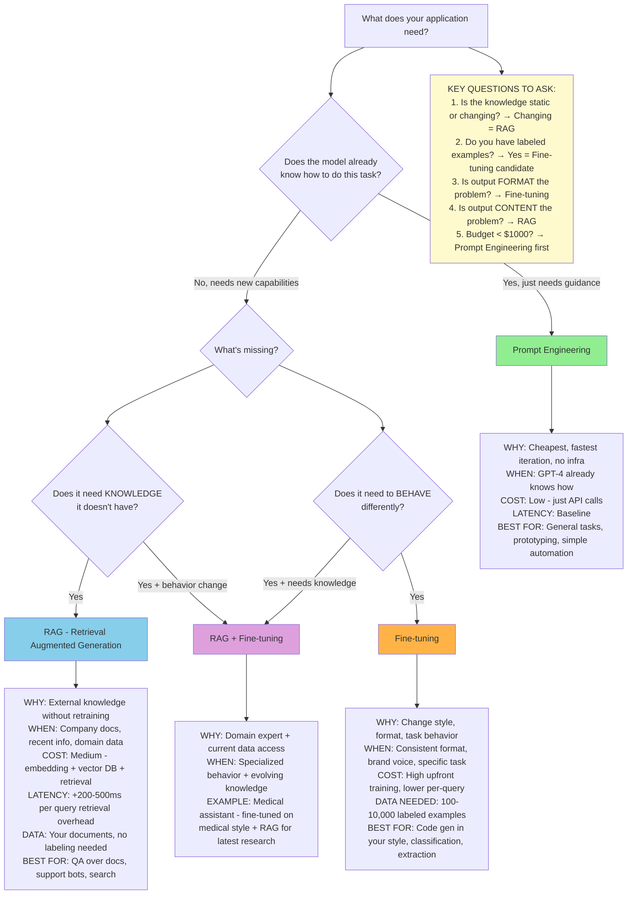

### Decision Checklist

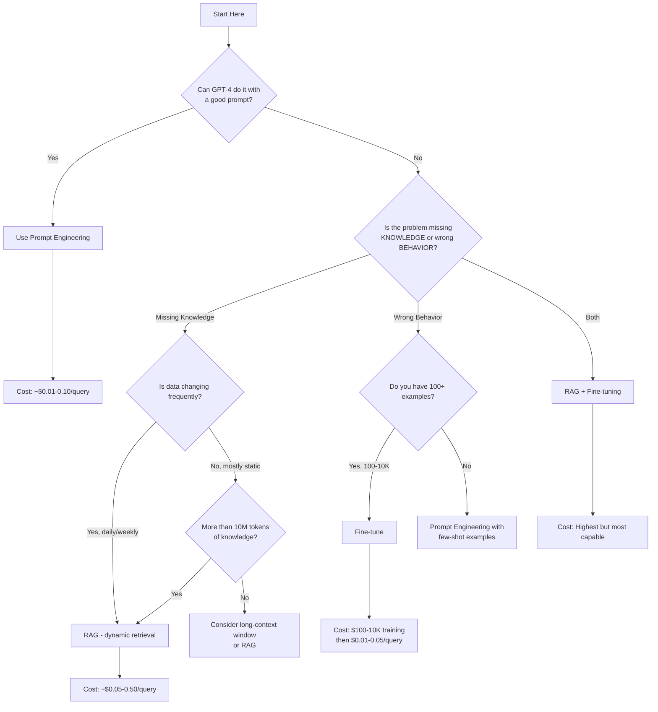

---

## Diagram 2: LLM Serving Architecture Patterns

Three fundamental patterns for serving LLM inference.

### Pattern A: Direct API (Simplest)

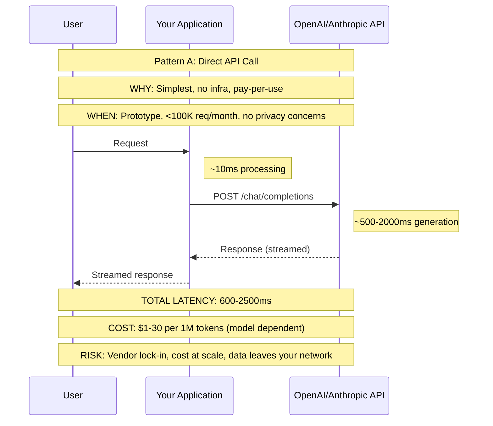

### Pattern B: Self-hosted (Full Control)

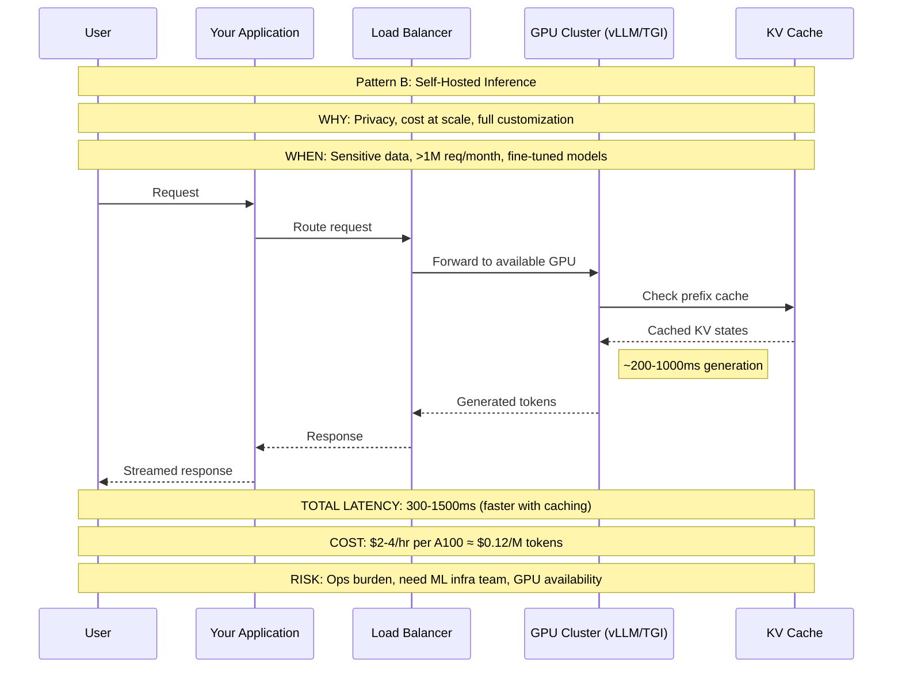

### Pattern C: Hybrid Router (Best of Both)

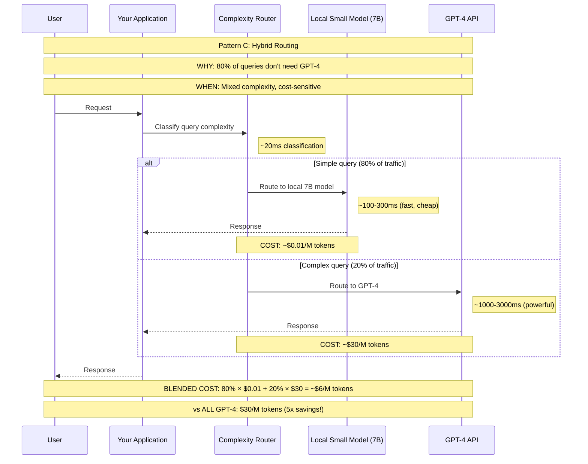

---

## Diagram 3: RAG Architecture Deep Dive

Complete RAG pipeline with decision points at every stage.

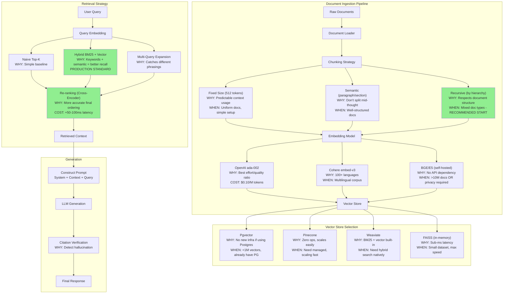

---

## Diagram 4: LLM Agent Architecture Patterns

Progressive complexity levels for LLM agents.

```mermaid
flowchart TD
    subgraph L1["Level 1: Single-Turn Tool Use"]
        L1_Flow["User Query → LLM picks tool → Execute → Return result"]
        L1_Why["WHY: Simplest, deterministic, easy to debug"]
        L1_Ex["EXAMPLE: 'Calculate 25% of 500' → calculator tool"]
        L1_When["WHEN: Single-step tasks, function calling"]
    end
    
    subgraph L2["Level 2: Multi-Turn ReAct Loop"]
        L2_Flow["Query → Think → Act → Observe → Think → ... → Answer"]
        L2_Why["WHY: Multi-step reasoning with tool use"]
        L2_Ex["EXAMPLE: Research needing multiple web searches"]
        L2_When["WHEN: 2-5 step tasks, exploration needed"]
        L2_Risk["RISK: Can loop indefinitely - add max_steps"]
    end
    
    subgraph L3["Level 3: Planning + Execution"]
        L3_Flow["Query → Planner LLM → Plan → Executor → Step-by-step → Verify"]
        L3_Why["WHY: Complex tasks need upfront planning"]
        L3_Ex["EXAMPLE: 'Book a trip' - flights + hotel + car"]
        L3_When["WHEN: 5+ steps, dependencies between steps"]
        L3_Arch["ARCHITECTURE: Separate planner & executor models"]
    end
    
    subgraph L4["Level 4: Multi-Agent Collaboration"]
        L4_Flow["Orchestrator → Specialist Agents → Merge Results"]
        L4_Why["WHY: Different expertise for subtasks"]
        L4_Ex["EXAMPLE: Coder + Reviewer + Tester agents"]
        L4_When["WHEN: Tasks needing diverse skills"]
        L4_Pattern["PATTERNS: Debate, delegation, pipeline"]
    end
    
    subgraph L5["Level 5: Autonomous Agents"]
        L5_Flow["Goal → Plan → Execute → Self-correct → Iterate"]
        L5_Why["WHY: Minimal human oversight"]
        L5_Risk["RISKS: Hallucination loops, cost explosion, safety"]
        L5_Guard["GUARDRAILS NEEDED:<br/>- Budget limits ($X max per task)<br/>- Action approval for destructive ops<br/>- Sandboxed execution<br/>- Human-in-the-loop checkpoints"]
    end
    
    L1 -->|Need multi-step| L2
    L2 -->|Need planning| L3
    L3 -->|Need specialization| L4
    L4 -->|Need autonomy| L5
    
    Decision["CHOOSE LOWEST LEVEL THAT WORKS<br/>WHY: Each level adds latency, cost, and failure modes"]
    
    style L1 fill:#90EE90
    style L5 fill:#FFB3B3
    style Decision fill:#FFFACD
```

---

## Diagram 5: LLM Cost Optimization Decision Tree

```mermaid
flowchart TD
    Start["Your LLM costs are too high"] --> A[Reduce Token Count]
    Start --> B[Use Smaller Models]
    Start --> C[Caching]
    Start --> D[Batching]
    Start --> E[Self-Hosting Economics]
    
    A --> A1["Shorter prompts<br/>WHY: Cost directly proportional to tokens<br/>Often prompts are 10x longer than needed"]
    A --> A2["Summarize RAG context before sending<br/>WHY: Retrieval often returns too much<br/>SAVINGS: 50-70% token reduction"]
    A --> A3["Cache/reuse system prompts<br/>WHY: Same prefix = wasted computation<br/>OpenAI prompt caching: 50% discount"]
    
    B --> B1["Classification → Fine-tuned small model<br/>WHY: GPT-4 is 30x price of GPT-3.5<br/>A fine-tuned 7B often matches GPT-4 on narrow tasks"]
    B --> B2["Extraction → Regex or small model<br/>WHY: Structured extraction doesn't need reasoning"]
    B --> B3["Router: Classify complexity → route accordingly<br/>WHY: 80% of queries need only a small model<br/>SAVINGS: 5x cost reduction typical"]
    
    C --> C1["Semantic cache<br/>WHY: Many users ask same thing differently<br/>Similar embeddings → cached answer<br/>HIT RATE: 20-40% typical"]
    C --> C2["Exact match cache<br/>WHY: Identical prompts = instant response<br/>LATENCY: <10ms vs 500-2000ms"]
    C --> C3["Prefix caching (KV cache reuse)<br/>WHY: Saves recomputing attention for static prefix<br/>SAVINGS: 30-50% on long system prompts"]
    
    D --> D1["Batch similar requests<br/>WHY: Higher throughput, lower per-request cost<br/>OpenAI Batch API: 50% discount"]
    D --> D2["Async for non-urgent tasks<br/>WHY: Can use off-peak, batch pricing"]
    
    E --> E1["< 1M tokens/day → Use API<br/>WHY: GPU costs exceed API costs at low volume"]
    E --> E2["1-100M tokens/day → Consider self-host with vLLM<br/>BREAK-EVEN: ~5M tokens/day for 7B model"]
    E --> E3["100M+ tokens/day → Definitely self-host<br/>WHY: 5-10x cheaper than API"]
    E --> E4["MATH: 1x A100 at $2/hr<br/>≈ 200 tok/sec ≈ 17M tokens/day<br/>= $0.12/M tokens<br/>vs GPT-4: $30/M input tokens<br/>= 250x cheaper for same throughput!"]
    
    style B3 fill:#90EE90
    style C1 fill:#90EE90
    style E4 fill:#FFFACD
```

---

## Diagram 6: LLM Safety & Guardrails Architecture

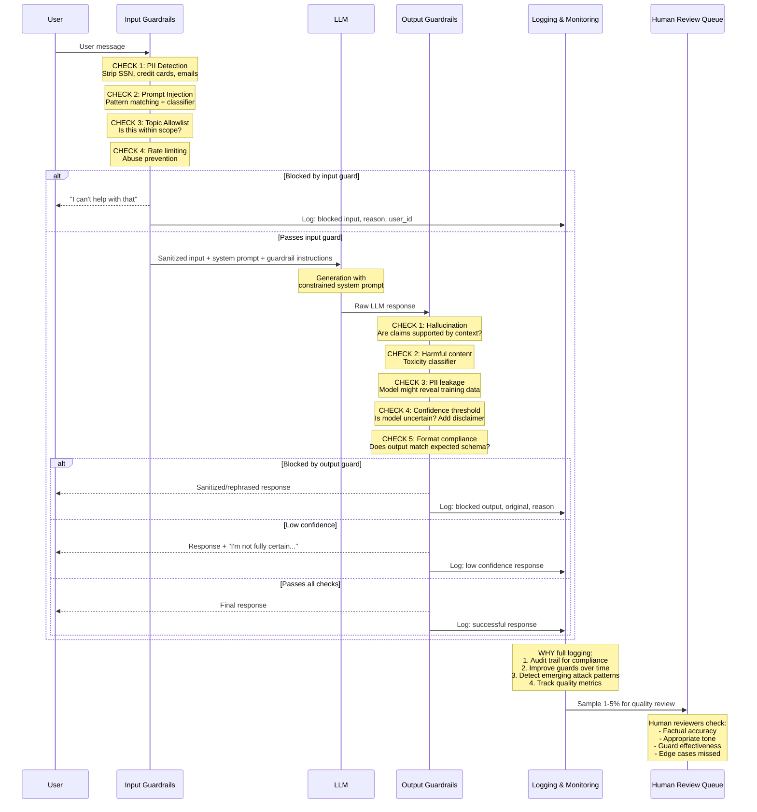

---

## Diagram 7: Embedding & Vector Search Architecture

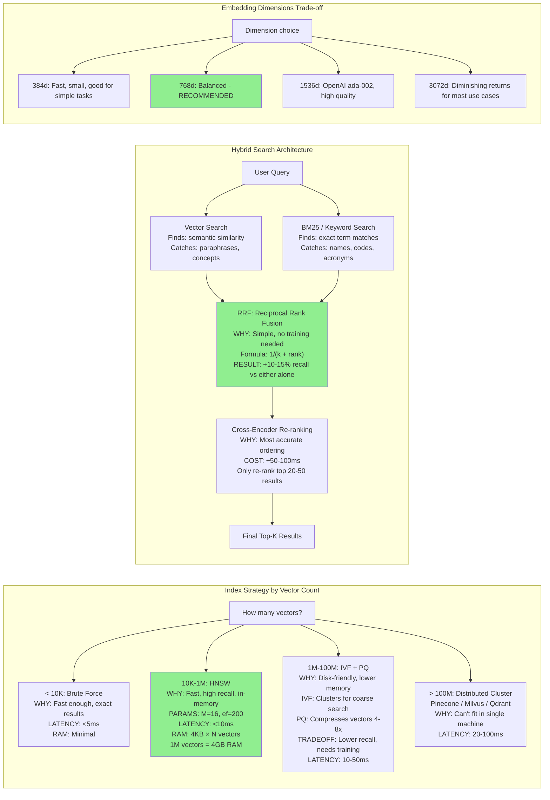

---

## Diagram 8: LLM Evaluation Framework

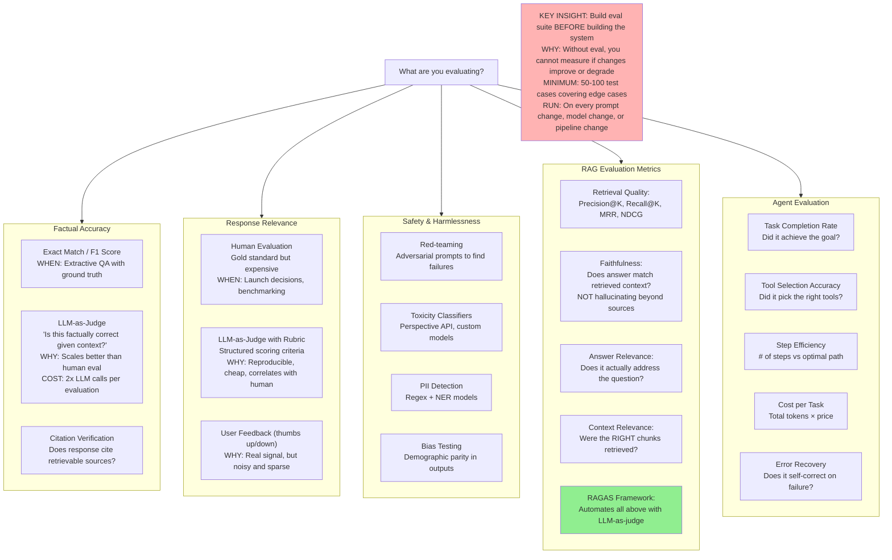

---

## Summary: Architecture Decision Quick Reference

| Decision | Default Choice | Switch When |
|----------|---------------|-------------|
| RAG vs Fine-tune | RAG first | Need behavior change, have labeled data |
| Serving | API (OpenAI) | >1M req/month or privacy requirements |
| Vector DB | Pgvector | >1M vectors → Pinecone/Weaviate |
| Chunking | Recursive | Benchmarks show fixed is better for your docs |
| Retrieval | Hybrid + Re-rank | Latency-critical → skip re-ranking |
| Agent level | Lowest that works | Proven need for more autonomy |
| Eval | LLM-as-Judge + RAGAS | High stakes → add human eval |
| Cost | Router + Cache | Predictable load → self-host |
