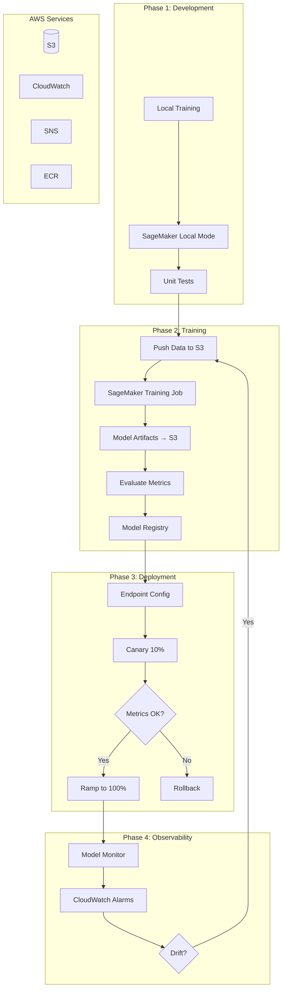

# Full Production Workflow: Laptop to Production

## End-to-End Architecture



---

## PHASE 1: Local Development

### train.py (SageMaker-compatible)

```python
"""Training script — runs locally AND on SageMaker."""
import argparse
import os
import json
import torch
import torch.nn as nn
from torch.utils.data import DataLoader
from transformers import AutoTokenizer, AutoModelForSequenceClassification

def parse_args():
    parser = argparse.ArgumentParser()
    # Hyperparameters
    parser.add_argument('--epochs', type=int, default=5)
    parser.add_argument('--lr', type=float, default=2e-5)
    parser.add_argument('--batch_size', type=int, default=32)
    parser.add_argument('--model_name', type=str, default='distilbert-base-uncased')
    # SageMaker environment variables (set automatically on SageMaker)
    parser.add_argument('--model_dir', type=str, default=os.environ.get('SM_MODEL_DIR', './model'))
    parser.add_argument('--train', type=str, default=os.environ.get('SM_CHANNEL_TRAIN', './data/train'))
    parser.add_argument('--val', type=str, default=os.environ.get('SM_CHANNEL_VAL', './data/val'))
    parser.add_argument('--num_gpus', type=int, default=int(os.environ.get('SM_NUM_GPUS', 1)))
    return parser.parse_args()

def train(args):
    device = torch.device('cuda' if torch.cuda.is_available() else 'cpu')
    
    # Load model
    tokenizer = AutoTokenizer.from_pretrained(args.model_name)
    model = AutoModelForSequenceClassification.from_pretrained(args.model_name, num_labels=2)
    model.to(device)
    
    # Load data
    train_dataset = load_dataset(args.train, tokenizer)
    val_dataset = load_dataset(args.val, tokenizer)
    train_loader = DataLoader(train_dataset, batch_size=args.batch_size, shuffle=True)
    val_loader = DataLoader(val_dataset, batch_size=args.batch_size)
    
    optimizer = torch.optim.AdamW(model.parameters(), lr=args.lr)
    
    best_accuracy = 0
    for epoch in range(args.epochs):
        model.train()
        total_loss = 0
        for batch in train_loader:
            batch = {k: v.to(device) for k, v in batch.items()}
            outputs = model(**batch)
            loss = outputs.loss
            loss.backward()
            optimizer.step()
            optimizer.zero_grad()
            total_loss += loss.item()
        
        # Evaluate
        model.eval()
        correct = 0
        total = 0
        with torch.no_grad():
            for batch in val_loader:
                batch = {k: v.to(device) for k, v in batch.items()}
                outputs = model(**batch)
                preds = outputs.logits.argmax(dim=-1)
                correct += (preds == batch['labels']).sum().item()
                total += len(batch['labels'])
        
        accuracy = correct / total
        avg_loss = total_loss / len(train_loader)
        
        # SageMaker parses these for metrics
        print(f'train_loss={avg_loss:.4f};')
        print(f'val_accuracy={accuracy:.4f};')
        
        if accuracy > best_accuracy:
            best_accuracy = accuracy
            # Save best model
            model.save_pretrained(args.model_dir)
            tokenizer.save_pretrained(args.model_dir)
    
    # Save training metadata
    with open(os.path.join(args.model_dir, 'metadata.json'), 'w') as f:
        json.dump({'best_accuracy': best_accuracy, 'epochs': args.epochs, 'lr': args.lr}, f)

if __name__ == '__main__':
    args = parse_args()
    train(args)
```

### Test Locally with SageMaker Local Mode

```python
from sagemaker.pytorch import PyTorch
from sagemaker.local import LocalSession

local_session = LocalSession()
local_session.config = {'local': {'local_code': True}}

estimator = PyTorch(
    entry_point='train.py',
    source_dir='src/',
    role='arn:aws:iam::123456:role/SageMakerRole',  # Ignored locally
    instance_count=1,
    instance_type='local_gpu',  # 'local' for CPU, 'local_gpu' for GPU
    framework_version='2.0',
    hyperparameters={'epochs': 1, 'lr': 2e-5, 'batch_size': 8},
    sagemaker_session=local_session,
)

estimator.fit({'train': 'file://./data/train', 'val': 'file://./data/val'})
```

---

## PHASE 2: Cloud Training

```python
import sagemaker
from sagemaker.pytorch import PyTorch

session = sagemaker.Session()
role = sagemaker.get_execution_role()
bucket = session.default_bucket()

# Upload data
s3_train = session.upload_data('data/train', key_prefix='text-clf/data/train')
s3_val = session.upload_data('data/val', key_prefix='text-clf/data/val')

# Launch training
estimator = PyTorch(
    entry_point='train.py',
    source_dir='src/',
    role=role,
    instance_count=1,
    instance_type='ml.p3.2xlarge',
    framework_version='2.0',
    py_version='py310',
    hyperparameters={'epochs': 10, 'lr': 2e-5, 'batch_size': 32, 'model_name': 'distilbert-base-uncased'},
    use_spot_instances=True,
    max_wait=7200,
    max_run=3600,
    checkpoint_s3_uri=f's3://{bucket}/text-clf/checkpoints/',
    metric_definitions=[
        {'Name': 'train_loss', 'Regex': 'train_loss=([0-9\\.]+)'},
        {'Name': 'val_accuracy', 'Regex': 'val_accuracy=([0-9\\.]+)'},
    ],
    tags=[{'Key': 'project', 'Value': 'text-classifier'}],
)

estimator.fit({'train': s3_train, 'val': s3_val}, wait=True)
print(f"Model artifact: {estimator.model_data}")

# Register in Model Registry
from sagemaker.model import Model

model = Model(
    image_uri=estimator.training_image_uri(),
    model_data=estimator.model_data,
    role=role,
    sagemaker_session=session,
)

model_package = model.register(
    model_package_group_name='text-classifier',
    content_types=['application/json'],
    response_types=['application/json'],
    inference_instances=['ml.g4dn.xlarge'],
    approval_status='PendingManualApproval',
    description=f'Accuracy: {estimator.training_job_analytics.dataframe()["val_accuracy"].max():.4f}',
)
```

---

## PHASE 3: Deployment

```python
import boto3
import time

sm = boto3.client('sagemaker')
sm_runtime = boto3.client('sagemaker-runtime')

endpoint_name = 'text-clf-prod'
model_name = 'text-clf-v2'
config_name = f'text-clf-config-{int(time.time())}'

# Create model from registry
sm.create_model(
    ModelName=model_name,
    PrimaryContainer={'ModelPackageName': model_package.model_package_arn},
    ExecutionRoleArn=role,
)

# Canary deployment: 10% to new model
sm.create_endpoint_config(
    EndpointConfigName=config_name,
    ProductionVariants=[
        {
            'VariantName': 'Stable',
            'ModelName': 'text-clf-v1',  # Current production model
            'InstanceType': 'ml.g4dn.xlarge',
            'InitialInstanceCount': 2,
            'InitialVariantWeight': 90,
        },
        {
            'VariantName': 'Canary',
            'ModelName': model_name,
            'InstanceType': 'ml.g4dn.xlarge',
            'InitialInstanceCount': 1,
            'InitialVariantWeight': 10,
        },
    ],
)

# Update endpoint (or create if first time)
try:
    sm.update_endpoint(EndpointName=endpoint_name, EndpointConfigName=config_name)
except sm.exceptions.ClientError:
    sm.create_endpoint(EndpointName=endpoint_name, EndpointConfigName=config_name)

# Wait for deployment
waiter = sm.get_waiter('endpoint_in_service')
waiter.wait(EndpointName=endpoint_name)

# Integration test
response = sm_runtime.invoke_endpoint(
    EndpointName=endpoint_name,
    Body=json.dumps({'text': 'This is a test sentence'}),
    ContentType='application/json',
    TargetVariant='Canary',
)
result = json.loads(response['Body'].read())
assert 'prediction' in result and 'confidence' in result
print(f"Canary test passed: {result}")

# Monitor for 1 hour, then ramp to 100%
print("Monitoring canary for 1 hour...")
time.sleep(3600)

# Check canary metrics
cw = boto3.client('cloudwatch')
metrics = cw.get_metric_statistics(
    Namespace='AWS/SageMaker',
    MetricName='Invocation5XXErrors',
    Dimensions=[
        {'Name': 'EndpointName', 'Value': endpoint_name},
        {'Name': 'VariantName', 'Value': 'Canary'},
    ],
    StartTime=time.time() - 3600,
    EndTime=time.time(),
    Period=3600,
    Statistics=['Sum'],
)

errors = sum(dp['Sum'] for dp in metrics['Datapoints'])
if errors == 0:
    # Ramp to 100%
    sm.update_endpoint_weights_and_capacities(
        EndpointName=endpoint_name,
        DesiredWeightsAndCapacities=[
            {'VariantName': 'Stable', 'DesiredWeight': 0},
            {'VariantName': 'Canary', 'DesiredWeight': 100},
        ],
    )
    print("Ramped canary to 100%!")
else:
    print(f"Canary has {errors} errors — rolling back!")
    # Rollback: remove canary variant
    sm.update_endpoint_weights_and_capacities(
        EndpointName=endpoint_name,
        DesiredWeightsAndCapacities=[
            {'VariantName': 'Stable', 'DesiredWeight': 100},
            {'VariantName': 'Canary', 'DesiredWeight': 0},
        ],
    )
```

### Setup Autoscaling

```python
aas = boto3.client('application-autoscaling')

aas.register_scalable_target(
    ServiceNamespace='sagemaker',
    ResourceId=f'endpoint/{endpoint_name}/variant/Canary',
    ScalableDimension='sagemaker:variant:DesiredInstanceCount',
    MinCapacity=2,
    MaxCapacity=10,
)

aas.put_scaling_policy(
    PolicyName='target-tracking',
    ServiceNamespace='sagemaker',
    ResourceId=f'endpoint/{endpoint_name}/variant/Canary',
    ScalableDimension='sagemaker:variant:DesiredInstanceCount',
    PolicyType='TargetTrackingScaling',
    TargetTrackingScalingPolicyConfiguration={
        'TargetValue': 750,
        'PredefinedMetricSpecification': {
            'PredefinedMetricType': 'SageMakerVariantInvocationsPerInstance'
        },
        'ScaleInCooldown': 300,
        'ScaleOutCooldown': 60,
    },
)
```

---

## PHASE 4: Observability

```python
from sagemaker.model_monitor import DefaultModelMonitor, CronExpressionGenerator
from sagemaker.model_monitor.dataset_format import DatasetFormat

# Data quality baseline
monitor = DefaultModelMonitor(role=role, instance_type='ml.m5.xlarge')
monitor.suggest_baseline(
    baseline_dataset=f's3://{bucket}/text-clf/baseline/train.csv',
    dataset_format=DatasetFormat.csv(header=True),
    output_s3_uri=f's3://{bucket}/text-clf/monitoring/baseline/',
)

# Schedule hourly monitoring
monitor.create_monitoring_schedule(
    monitor_schedule_name='text-clf-data-quality',
    endpoint_input=endpoint_name,
    output_s3_uri=f's3://{bucket}/text-clf/monitoring/reports/',
    statistics=monitor.baseline_statistics(),
    constraints=monitor.suggested_constraints(),
    schedule_cron_expression=CronExpressionGenerator.hourly(),
)

# Custom CloudWatch alarms
cw = boto3.client('cloudwatch')
sns_topic = 'arn:aws:sns:us-east-1:123456:ml-alerts'

# Alarm: High latency
cw.put_metric_alarm(
    AlarmName='text-clf-high-latency',
    Namespace='AWS/SageMaker',
    MetricName='ModelLatency',
    Dimensions=[{'Name': 'EndpointName', 'Value': endpoint_name}],
    Statistic='Average',
    Period=300,
    EvaluationPeriods=3,
    Threshold=500000,
    ComparisonOperator='GreaterThanThreshold',
    AlarmActions=[sns_topic],
)

# Alarm: Error rate
cw.put_metric_alarm(
    AlarmName='text-clf-errors',
    Namespace='AWS/SageMaker',
    MetricName='Invocation5XXErrors',
    Dimensions=[{'Name': 'EndpointName', 'Value': endpoint_name}],
    Statistic='Sum',
    Period=300,
    EvaluationPeriods=2,
    Threshold=5,
    ComparisonOperator='GreaterThanThreshold',
    AlarmActions=[sns_topic],
)
```

---

## PHASE 5: Maintenance

### Scheduled Retraining (EventBridge + Step Functions)

```python
# EventBridge rule: trigger retraining every Sunday at 2 AM
events = boto3.client('events')

events.put_rule(
    Name='weekly-retrain-text-clf',
    ScheduleExpression='cron(0 2 ? * SUN *)',
    State='ENABLED',
)

events.put_targets(
    Rule='weekly-retrain-text-clf',
    Targets=[{
        'Id': 'retrain-pipeline',
        'Arn': 'arn:aws:states:us-east-1:123456:stateMachine:text-clf-pipeline',
        'RoleArn': 'arn:aws:iam::123456:role/EventBridgeStepFunctionsRole',
    }],
)
```

### Champion/Challenger Testing

```python
def champion_challenger_test(champion_endpoint, challenger_model, test_data, threshold=0.02):
    """Deploy challenger, compare metrics, promote if better."""
    sm_runtime = boto3.client('sagemaker-runtime')
    
    champion_results = []
    challenger_results = []
    
    for sample in test_data:
        # Champion prediction
        resp = sm_runtime.invoke_endpoint(
            EndpointName=champion_endpoint,
            Body=json.dumps(sample['input']),
            ContentType='application/json',
        )
        champion_pred = json.loads(resp['Body'].read())
        champion_results.append(champion_pred['prediction'] == sample['label'])
        
        # Challenger prediction (shadow endpoint)
        resp = sm_runtime.invoke_endpoint(
            EndpointName=f'{champion_endpoint}-shadow',
            Body=json.dumps(sample['input']),
            ContentType='application/json',
        )
        challenger_pred = json.loads(resp['Body'].read())
        challenger_results.append(challenger_pred['prediction'] == sample['label'])
    
    champion_acc = sum(champion_results) / len(champion_results)
    challenger_acc = sum(challenger_results) / len(challenger_results)
    
    if challenger_acc > champion_acc + threshold:
        return 'promote_challenger'
    elif challenger_acc < champion_acc - threshold:
        return 'reject_challenger'
    else:
        return 'no_significant_difference'
```

---

## IAM Roles & Permissions

### SageMaker Execution Role (Least Privilege)

```json
{
  "Version": "2012-10-17",
  "Statement": [
    {
      "Effect": "Allow",
      "Action": [
        "s3:GetObject",
        "s3:PutObject",
        "s3:ListBucket"
      ],
      "Resource": [
        "arn:aws:s3:::ml-artifacts-prod",
        "arn:aws:s3:::ml-artifacts-prod/*"
      ]
    },
    {
      "Effect": "Allow",
      "Action": [
        "ecr:GetDownloadUrlForLayer",
        "ecr:BatchGetImage",
        "ecr:GetAuthorizationToken"
      ],
      "Resource": "*"
    },
    {
      "Effect": "Allow",
      "Action": [
        "cloudwatch:PutMetricData",
        "logs:CreateLogGroup",
        "logs:CreateLogStream",
        "logs:PutLogEvents"
      ],
      "Resource": "*"
    },
    {
      "Effect": "Allow",
      "Action": [
        "sagemaker:CreateModel",
        "sagemaker:CreateEndpointConfig",
        "sagemaker:CreateEndpoint",
        "sagemaker:UpdateEndpoint",
        "sagemaker:InvokeEndpoint"
      ],
      "Resource": "arn:aws:sagemaker:us-east-1:123456:*"
    }
  ]
}
```

### CI/CD Deployment Role

```json
{
  "Version": "2012-10-17",
  "Statement": [
    {
      "Effect": "Allow",
      "Action": [
        "sagemaker:CreateTrainingJob",
        "sagemaker:CreateModel",
        "sagemaker:CreateEndpointConfig",
        "sagemaker:UpdateEndpoint",
        "sagemaker:DescribeEndpoint",
        "sagemaker:ListModelPackages",
        "sagemaker:UpdateModelPackage"
      ],
      "Resource": "*",
      "Condition": {
        "StringEquals": {"aws:RequestTag/project": "text-classifier"}
      }
    },
    {
      "Effect": "Allow",
      "Action": "iam:PassRole",
      "Resource": "arn:aws:iam::123456:role/SageMakerExecutionRole"
    }
  ]
}
```

---

## Security

### VPC Configuration for SageMaker

```python
from sagemaker.network import NetworkConfig

network_config = NetworkConfig(
    enable_network_isolation=True,  # No internet access (most secure)
    security_group_ids=['sg-0123456789abcdef0'],
    subnets=['subnet-0123456789abcdef0', 'subnet-0123456789abcdef1'],
)

estimator = PyTorch(
    # ... other params ...
    network_config=network_config,
    encrypt_inter_container_traffic=True,  # Encrypt node-to-node (distributed training)
)
```

### Encryption

```python
# S3: Server-side encryption for model artifacts
import boto3
s3 = boto3.client('s3')
s3.put_bucket_encryption(
    Bucket='ml-artifacts-prod',
    ServerSideEncryptionConfiguration={
        'Rules': [{'ApplyServerSideEncryptionByDefault': {'SSEAlgorithm': 'aws:kms', 'KMSMasterKeyID': 'alias/ml-key'}}]
    },
)

# SageMaker: KMS encryption for training volumes and endpoints
estimator = PyTorch(
    # ...
    volume_kms_key='arn:aws:kms:us-east-1:123456:key/12345-abcde',
    output_kms_key='arn:aws:kms:us-east-1:123456:key/12345-abcde',
)
```

### Audit with CloudTrail

```python
# Query CloudTrail for all SageMaker API calls
cloudtrail = boto3.client('cloudtrail')

events = cloudtrail.lookup_events(
    LookupAttributes=[
        {'AttributeKey': 'EventSource', 'AttributeValue': 'sagemaker.amazonaws.com'},
    ],
    StartTime=datetime.now() - timedelta(days=7),
    MaxResults=50,
)

# Key events to monitor:
# - CreateEndpoint / UpdateEndpoint (deployment changes)
# - UpdateModelPackage (approval changes)  
# - InvokeEndpoint (usage patterns)
# - DeleteEndpoint (accidental deletion)
```
