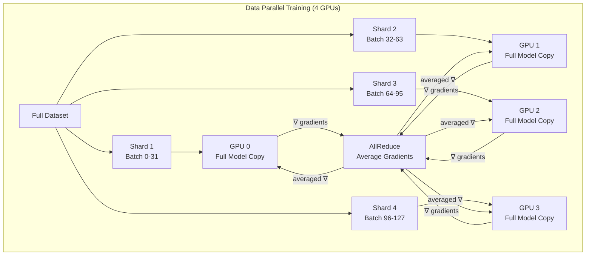
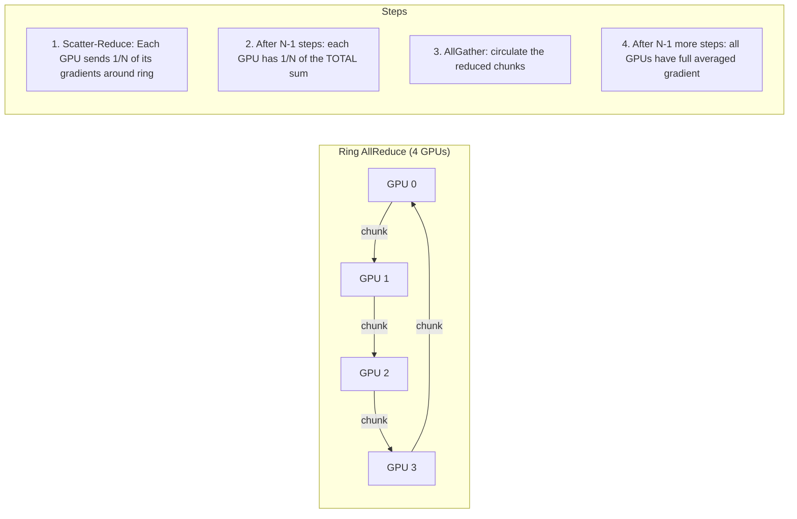
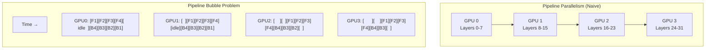
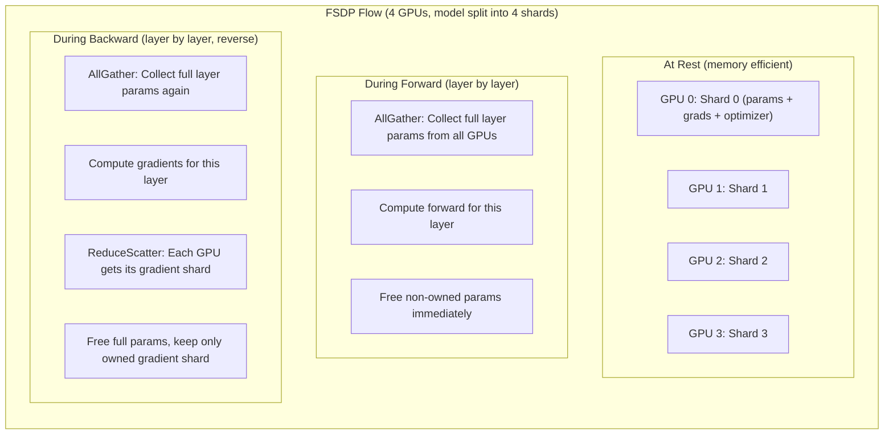
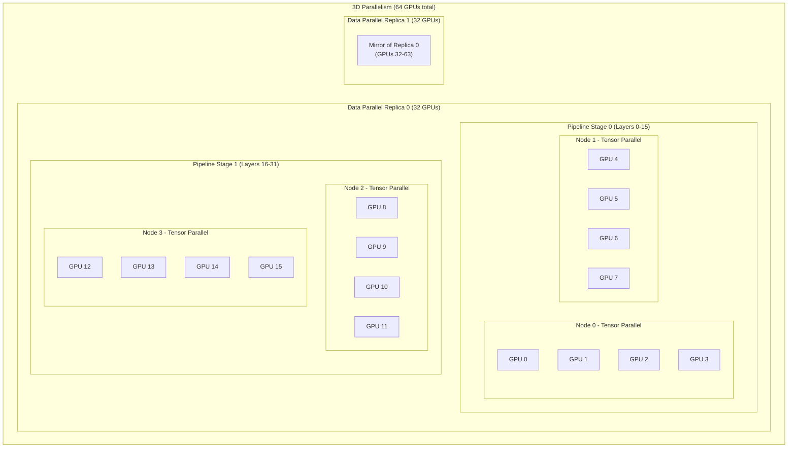

# Distributed Training — Complete Guide

> **Staff-level knowledge**: You cannot architect production ML systems without understanding how training scales across GPUs and nodes.

---

## 1. Why Distributed Training

### The Four Forces Driving Distribution

| Problem | Single GPU Reality | Distributed Solution |
|---------|-------------------|---------------------|
| Model too large | 7B params = 28GB weights (FP32). Won't fit on 24GB GPU | Split model across GPUs |
| Training too slow | ImageNet on 1 GPU: ~2 weeks | 8 GPUs: ~hours |
| Batch size limited | GPU memory caps your batch | Aggregate across GPUs |
| Cost inefficiency | 8x longer on 1 GPU costs more than 8 GPUs for same wall time | Parallelize |

### Real Numbers That Matter

```
GPT-3 175B parameters:
- FP32 weights alone: 175B × 4 bytes = 700 GB
- Single A100 memory: 80 GB
- Minimum GPUs just for weights: 9 (and that's BEFORE gradients/optimizer)
- Actual training: 1024 A100s for ~34 days

LLaMA 70B training:
- 2048 A100-80GB GPUs
- ~21 days
- ~$2M compute cost

ImageNet ResNet-50:
- 1 GPU (V100): ~29 hours
- 256 GPUs: ~6.6 minutes (with large batch training tricks)
```

---

## 2. GPU Memory Anatomy (CRITICAL for Planning)

This is the #1 thing you must understand before choosing a distributed strategy.

```
What fills GPU memory during training:
├── Model Parameters: params × bytes_per_param
│   └── 7B × 4 bytes = 28 GB (FP32)
│   └── 7B × 2 bytes = 14 GB (FP16/BF16)
│
├── Gradients: same size as parameters
│   └── 7B × 4 bytes = 28 GB (FP32)
│   └── 7B × 2 bytes = 14 GB (FP16)
│
├── Optimizer States: depends on optimizer
│   └── SGD: 0 extra (updates in-place)
│   └── Adam: 2× params (momentum + variance, both FP32)
│   └── 7B × 4 × 2 = 56 GB for Adam
│
├── Activations: batch_size × seq_len × hidden_dim × num_layers
│   └── For 7B model, batch=1, seq=2048: ~8-16 GB
│   └── Scales LINEARLY with batch size
│   └── Often the LARGEST consumer!
│
├── Temporary Buffers: gradient comm buffers, workspace
│   └── ~1-2 GB typically
│
└── TOTAL for 7B model (FP32 Adam, batch=1):
    28 (params) + 28 (grads) + 56 (optimizer) + 10 (activations) = ~122 GB
    ❌ Does NOT fit on 80GB A100!
```

### Memory Reduction Techniques

```
Technique               | Saves              | Tradeoff
─────────────────────────────────────────────────────────────
Mixed Precision (FP16)  | ~50% param+grad    | Need loss scaling
BF16                    | ~50% param+grad    | No loss scaling, A100+ only
Grad Checkpointing      | ~60-70% activations| ~33% more compute
ZeRO Stage 1           | Optimizer states    | Communication overhead
ZeRO Stage 2           | + Gradients         | More communication
ZeRO Stage 3 / FSDP    | + Parameters        | Most communication
CPU Offloading          | Optimizer to CPU    | CPU-GPU transfer bottleneck
LoRA/QLoRA             | Only train <1% params| Slight quality loss
```

### Quick Calculator

```python
def estimate_training_memory_gb(params_billion, precision="fp16", optimizer="adam", batch_size=1, seq_len=2048, hidden_dim=4096, num_layers=32):
    bytes_per_param = 2 if precision in ("fp16", "bf16") else 4
    
    param_memory = params_billion * bytes_per_param  # GB
    grad_memory = params_billion * bytes_per_param
    
    if optimizer == "adam":
        # Adam always keeps FP32 copies of momentum and variance
        opt_memory = params_billion * 4 * 2  # Always FP32
    elif optimizer == "sgd":
        opt_memory = 0
    
    # Rough activation estimate (varies hugely by architecture)
    activation_memory = (batch_size * seq_len * hidden_dim * num_layers * 2) / 1e9
    
    total = param_memory + grad_memory + opt_memory + activation_memory
    return total

# Examples:
# 7B FP16 Adam:  14 + 14 + 56 + ~10 = ~94 GB (still needs 2x A100-80GB or FSDP!)
# 7B FP16 Adam with ZeRO-3 on 8 GPUs: 94/8 = ~12 GB per GPU ✓
# 13B FP16 Adam: 26 + 26 + 104 + ~18 = ~174 GB
```

---

## 3. Data Parallelism (DDP)

The simplest and most common distributed strategy. Use this first.

### How It Works



### Step-by-Step Process

1. **Replicate**: Each GPU gets a full copy of the model
2. **Partition data**: DistributedSampler gives each GPU unique data subset
3. **Forward pass**: Each GPU runs forward on its own mini-batch (independent)
4. **Backward pass**: Each GPU computes gradients on its local data
5. **AllReduce**: Gradients averaged across all GPUs (synchronized)
6. **Update**: Each GPU applies identical update → models stay in sync

### Complete PyTorch DDP Code

```python
import os
import torch
import torch.nn as nn
import torch.distributed as dist
from torch.nn.parallel import DistributedDataParallel as DDP
from torch.utils.data import DataLoader
from torch.utils.data.distributed import DistributedSampler


def setup(rank, world_size):
    """Initialize the distributed environment."""
    os.environ['MASTER_ADDR'] = 'localhost'
    os.environ['MASTER_PORT'] = '12355'
    
    # NCCL: optimized for GPU-GPU communication
    dist.init_process_group(
        backend="nccl",
        rank=rank,
        world_size=world_size
    )
    torch.cuda.set_device(rank)


def cleanup():
    dist.destroy_process_group()


def train(rank, world_size, epochs=10):
    setup(rank, world_size)
    
    # Model — same initialization on all ranks (same random seed or broadcast)
    model = nn.TransformerEncoder(
        nn.TransformerEncoderLayer(d_model=512, nhead=8),
        num_layers=6
    ).to(rank)
    
    # Wrap with DDP — this handles gradient synchronization
    model = DDP(model, device_ids=[rank])
    
    # Optimizer operates on local model copy
    optimizer = torch.optim.AdamW(model.parameters(), lr=1e-4 * world_size)  # Linear scaling!
    
    # Dataset and sampler
    dataset = MyDataset()  # Your dataset here
    sampler = DistributedSampler(
        dataset,
        num_replicas=world_size,
        rank=rank,
        shuffle=True
    )
    dataloader = DataLoader(
        dataset,
        batch_size=32,  # Per-GPU batch size
        sampler=sampler,
        num_workers=4,
        pin_memory=True  # Faster CPU→GPU transfer
    )
    
    # Training loop
    for epoch in range(epochs):
        # CRITICAL: ensures different shuffling each epoch
        sampler.set_epoch(epoch)
        model.train()
        
        for batch_idx, (data, target) in enumerate(dataloader):
            data, target = data.to(rank), target.to(rank)
            
            optimizer.zero_grad()
            output = model(data)
            loss = nn.functional.cross_entropy(output, target)
            loss.backward()  # DDP hooks fire here — AllReduce gradients
            optimizer.step()
            
            if rank == 0 and batch_idx % 100 == 0:
                print(f"Epoch {epoch}, Batch {batch_idx}, Loss: {loss.item():.4f}")
        
        # Save checkpoint — ONLY on rank 0
        if rank == 0:
            torch.save({
                'epoch': epoch,
                'model_state_dict': model.module.state_dict(),  # .module to unwrap DDP
                'optimizer_state_dict': optimizer.state_dict(),
            }, f"checkpoint_epoch_{epoch}.pt")
        
        # Synchronize before next epoch
        dist.barrier()
    
    cleanup()


if __name__ == "__main__":
    # Launch with: torchrun --nproc_per_node=4 train.py
    # torchrun sets RANK, WORLD_SIZE, LOCAL_RANK automatically
    rank = int(os.environ["LOCAL_RANK"])
    world_size = int(os.environ["WORLD_SIZE"])
    train(rank, world_size)
```

### Key DDP Details

| Concept | Detail |
|---------|--------|
| Effective batch size | `per_gpu_batch × num_gpus` (32 × 4 = 128) |
| Learning rate | Scale linearly: `base_lr × num_gpus` |
| LR warmup | Critical with large effective batches (LARS/LAMB for very large) |
| Communication | AllReduce overlaps with backward computation (pipelined) |
| Memory | Full model on each GPU — NO memory savings for model |
| Scaling | Near-linear up to ~256 GPUs for large models |

### AllReduce Communication Pattern (Ring)



**Ring AllReduce bandwidth**: `2(N-1)/N × data_size` — nearly constant regardless of GPU count!

---

## 4. Model Parallelism

When the model itself doesn't fit on one GPU.

### 4.1 Pipeline Parallelism

Split model **vertically** — different layers on different GPUs.



**The Bubble Problem**: GPUs sit idle waiting for activations from previous stage.

**Solution: Micro-batching** (GPipe approach)

```
Split batch into micro-batches → pipeline them:

GPU 0: [F1][F2][F3][F4][B1][B2][B3][B4]
GPU 1:     [F1][F2][F3][F4][B1][B2][B3][B4]
GPU 2:         [F1][F2][F3][F4][B1][B2][B3][B4]
GPU 3:             [F1][F2][F3][F4][B1][B2][B3][B4]

Bubble fraction = (num_stages - 1) / (num_microbatches + num_stages - 1)
With 4 stages, 32 microbatches: bubble = 3/35 = 8.6% (acceptable)
```

### Pipeline Parallelism Code (PyTorch)

```python
from torch.distributed.pipelining import SplitPoint, pipeline, ScheduleGPipe

# Define split points in your model
split_spec = {
    "layers.8": SplitPoint.BEGINNING,   # GPU boundary after layer 7
    "layers.16": SplitPoint.BEGINNING,  # GPU boundary after layer 15
    "layers.24": SplitPoint.BEGINNING,  # GPU boundary after layer 23
}

# Create pipeline
pipe = pipeline(
    model,
    mb_args=(micro_batch,),
    split_spec=split_spec,
)

# Use GPipe schedule (1F1B is also available for less memory)
schedule = ScheduleGPipe(pipe, n_microbatches=8)

# Execute
if rank == 0:
    schedule.step(input_batch)
else:
    schedule.step()
```

### 4.2 Tensor Parallelism

Split individual **layers** across GPUs — each GPU holds a slice of the weight matrix.

```
Standard Linear Layer: Y = XW (X: [batch, in_features], W: [in_features, out_features])

Column Parallel (split W by columns):
┌─────────────────────────────────────────────┐
│  GPU 0: Y₀ = X @ W[:, :out/2]              │
│  GPU 1: Y₁ = X @ W[:, out/2:]              │
│  Result: Y = [Y₀, Y₁] (concat)            │
└─────────────────────────────────────────────┘

Row Parallel (split W by rows):
┌─────────────────────────────────────────────┐
│  GPU 0: Y₀ = X₀ @ W[:in/2, :]             │
│  GPU 1: Y₁ = X₁ @ W[in/2:, :]             │
│  Result: Y = Y₀ + Y₁ (AllReduce)           │
└─────────────────────────────────────────────┘
```

### Megatron-LM Transformer Parallelism

```
Transformer Block with Tensor Parallelism:
┌────────────────────────────────────────────────────────┐
│ Attention: Split heads across GPUs                      │
│   GPU 0: heads 0-15,  GPU 1: heads 16-31              │
│   → AllReduce after attention output projection         │
│                                                         │
│ MLP: Column-parallel first linear, Row-parallel second │
│   GPU 0: MLP_up[:, :hidden/2], MLP_down[:hidden/2, :] │
│   GPU 1: MLP_up[:, hidden/2:], MLP_down[hidden/2:, :] │
│   → AllReduce after second linear                       │
│                                                         │
│ Communication per layer: 2 AllReduce ops                │
└────────────────────────────────────────────────────────┘
```

```python
# Simplified Tensor Parallel Linear (Megatron-style)
class ColumnParallelLinear(nn.Module):
    def __init__(self, in_features, out_features, world_size, rank):
        super().__init__()
        assert out_features % world_size == 0
        self.local_out = out_features // world_size
        self.linear = nn.Linear(in_features, self.local_out, bias=False)
    
    def forward(self, x):
        # Each GPU computes its slice — no communication needed here
        return self.linear(x)


class RowParallelLinear(nn.Module):
    def __init__(self, in_features, out_features, world_size, rank):
        super().__init__()
        assert in_features % world_size == 0
        self.local_in = in_features // world_size
        self.linear = nn.Linear(self.local_in, out_features, bias=False)
    
    def forward(self, x):
        local_out = self.linear(x)
        # AllReduce to sum partial results across GPUs
        dist.all_reduce(local_out, op=dist.ReduceOp.SUM)
        return local_out
```

---

## 5. FSDP (Fully Sharded Data Parallel)

The state-of-the-art for training models that don't fit on a single GPU. Implements ZeRO Stage 3.

### How FSDP Works



### Memory Savings

```
7B model, 8 GPUs, Adam optimizer:

Without FSDP (DDP):
  Each GPU: 14 (params) + 14 (grads) + 56 (opt) = 84 GB per GPU ❌

With FSDP:
  Each GPU: 84 / 8 = 10.5 GB per GPU ✓
  Peak (during AllGather): 10.5 + 14 (full layer params) ≈ 25 GB ✓ (fits on 40GB A100!)
```

### Complete FSDP Code

```python
import os
import torch
import torch.distributed as dist
from torch.distributed.fsdp import (
    FullyShardedDataParallel as FSDP,
    MixedPrecision,
    ShardingStrategy,
    BackwardPrefetch,
    CPUOffload,
)
from torch.distributed.fsdp.wrap import (
    size_based_auto_wrap_policy,
    transformer_auto_wrap_policy,
)
from transformers import AutoModelForCausalLM, AutoTokenizer
import functools


def setup():
    dist.init_process_group("nccl")
    rank = int(os.environ["LOCAL_RANK"])
    torch.cuda.set_device(rank)
    return rank


def get_fsdp_config():
    """Production FSDP configuration."""
    
    # Mixed precision — BF16 for A100/H100
    mixed_precision_policy = MixedPrecision(
        param_dtype=torch.bfloat16,    # Parameters in BF16
        reduce_dtype=torch.bfloat16,   # Gradient reduction in BF16
        buffer_dtype=torch.bfloat16,   # Buffers in BF16
    )
    
    # Auto-wrap policy: wrap each Transformer layer as FSDP unit
    # This controls granularity of sharding
    auto_wrap_policy = functools.partial(
        transformer_auto_wrap_policy,
        transformer_layer_cls={
            # Specify your transformer layer class
            # e.g., LlamaDecoderLayer, GPT2Block, etc.
        }
    )
    
    # Or size-based: wrap any module with > 100M params
    size_wrap_policy = functools.partial(
        size_based_auto_wrap_policy,
        min_num_params=100_000_000
    )
    
    return mixed_precision_policy, auto_wrap_policy


def train():
    rank = setup()
    world_size = int(os.environ["WORLD_SIZE"])
    
    # Load model
    model = AutoModelForCausalLM.from_pretrained(
        "meta-llama/Llama-2-7b-hf",
        torch_dtype=torch.bfloat16,
    )
    
    mixed_precision_policy, wrap_policy = get_fsdp_config()
    
    # Wrap with FSDP
    model = FSDP(
        model,
        sharding_strategy=ShardingStrategy.FULL_SHARD,  # ZeRO-3
        mixed_precision=mixed_precision_policy,
        auto_wrap_policy=wrap_policy,
        backward_prefetch=BackwardPrefetch.BACKWARD_PRE,  # Overlap comm
        device_id=rank,
        limit_all_gathers=True,  # Prevent OOM from concurrent AllGathers
        # cpu_offload=CPUOffload(offload_params=True),  # Enable if needed
    )
    
    # Optimizer — after FSDP wrapping
    optimizer = torch.optim.AdamW(model.parameters(), lr=2e-5, weight_decay=0.01)
    
    # Training loop
    for epoch in range(num_epochs):
        for batch in dataloader:
            input_ids = batch["input_ids"].to(rank)
            labels = batch["labels"].to(rank)
            
            outputs = model(input_ids=input_ids, labels=labels)
            loss = outputs.loss
            loss.backward()
            
            # Gradient clipping with FSDP
            model.clip_grad_norm_(1.0)
            
            optimizer.step()
            optimizer.zero_grad()
    
    # Save checkpoint with FSDP
    # Option 1: Full state dict (rank 0 saves complete model)
    from torch.distributed.fsdp import FullStateDictConfig, StateDictType
    
    full_state_config = FullStateDictConfig(offload_to_cpu=True, rank0_only=True)
    with FSDP.state_dict_type(model, StateDictType.FULL_STATE_DICT, full_state_config):
        state_dict = model.state_dict()
        if rank == 0:
            torch.save(state_dict, "model.pt")
    
    dist.destroy_process_group()


if __name__ == "__main__":
    train()
```

### FSDP Sharding Strategies

| Strategy | What's Sharded | Memory | Communication |
|----------|---------------|--------|---------------|
| `FULL_SHARD` (ZeRO-3) | Params + Grads + Optimizer | Lowest | Highest |
| `SHARD_GRAD_OP` (ZeRO-2) | Grads + Optimizer | Medium | Medium |
| `NO_SHARD` (DDP) | Nothing | Highest | Lowest |
| `HYBRID_SHARD` | Full shard intra-node, replicate inter-node | Balanced | Balanced |

---

## 6. DeepSpeed

Microsoft's library for efficient distributed training. Alternative to FSDP.

### ZeRO Stages

```
┌──────────────────────────────────────────────────────────────────┐
│ ZeRO Stage 0: No sharding (standard DDP)                        │
│   Each GPU: Full params + Full grads + Full optimizer            │
│   Memory per GPU: Params + Grads + OptStates                     │
├──────────────────────────────────────────────────────────────────┤
│ ZeRO Stage 1: Shard optimizer states                             │
│   Each GPU: Full params + Full grads + 1/N optimizer             │
│   Memory savings: ~4x for Adam (optimizer is 2/3 of memory!)    │
├──────────────────────────────────────────────────────────────────┤
│ ZeRO Stage 2: Shard optimizer + gradients                        │
│   Each GPU: Full params + 1/N grads + 1/N optimizer              │
│   Communication: Reduce-scatter gradients (instead of AllReduce) │
├──────────────────────────────────────────────────────────────────┤
│ ZeRO Stage 3: Shard everything                                   │
│   Each GPU: 1/N params + 1/N grads + 1/N optimizer              │
│   Communication: AllGather params for forward/backward            │
│   Equivalent to FSDP FULL_SHARD                                  │
└──────────────────────────────────────────────────────────────────┘
```

### DeepSpeed Configuration

```json
{
    "train_batch_size": 256,
    "train_micro_batch_size_per_gpu": 8,
    "gradient_accumulation_steps": 4,
    
    "optimizer": {
        "type": "AdamW",
        "params": {
            "lr": 2e-5,
            "betas": [0.9, 0.999],
            "eps": 1e-8,
            "weight_decay": 0.01
        }
    },
    
    "scheduler": {
        "type": "WarmupDecayLR",
        "params": {
            "warmup_min_lr": 0,
            "warmup_max_lr": 2e-5,
            "warmup_num_steps": 1000,
            "total_num_steps": 100000
        }
    },
    
    "fp16": {
        "enabled": false
    },
    "bf16": {
        "enabled": true
    },
    
    "zero_optimization": {
        "stage": 3,
        "offload_optimizer": {
            "device": "cpu",
            "pin_memory": true
        },
        "offload_param": {
            "device": "none"
        },
        "overlap_comm": true,
        "contiguous_gradients": true,
        "sub_group_size": 1e9,
        "reduce_bucket_size": "auto",
        "stage3_prefetch_bucket_size": "auto",
        "stage3_param_persistence_threshold": "auto",
        "stage3_max_live_parameters": 1e9,
        "stage3_max_reuse_distance": 1e9,
        "stage3_gather_16bit_weights_on_model_save": true
    },
    
    "gradient_clipping": 1.0,
    "wall_clock_breakdown": false,
    
    "activation_checkpointing": {
        "partition_activations": true,
        "cpu_checkpointing": false,
        "contiguous_memory_optimization": true,
        "number_checkpoints": null,
        "synchronize_checkpoint_boundary": false
    }
}
```

### DeepSpeed Training Code

```python
import deepspeed
import torch
from transformers import AutoModelForCausalLM, AutoTokenizer

def train():
    model = AutoModelForCausalLM.from_pretrained("meta-llama/Llama-2-7b-hf")
    
    # DeepSpeed handles optimizer creation if specified in config
    model_engine, optimizer, _, scheduler = deepspeed.initialize(
        model=model,
        config="ds_config.json",
        model_parameters=model.parameters(),
    )
    
    for epoch in range(num_epochs):
        for batch in dataloader:
            input_ids = batch["input_ids"].to(model_engine.local_rank)
            labels = batch["labels"].to(model_engine.local_rank)
            
            outputs = model_engine(input_ids=input_ids, labels=labels)
            loss = outputs.loss
            
            model_engine.backward(loss)
            model_engine.step()
    
    # Save checkpoint
    model_engine.save_checkpoint("checkpoints/", tag="final")

# Launch: deepspeed --num_gpus=8 train.py --deepspeed_config ds_config.json
```

### HuggingFace Trainer Integration

```python
from transformers import Trainer, TrainingArguments

training_args = TrainingArguments(
    output_dir="./output",
    per_device_train_batch_size=8,
    gradient_accumulation_steps=4,
    learning_rate=2e-5,
    num_train_epochs=3,
    bf16=True,
    # DeepSpeed integration — just point to config!
    deepspeed="ds_config.json",
)

trainer = Trainer(
    model=model,
    args=training_args,
    train_dataset=train_dataset,
    tokenizer=tokenizer,
)

trainer.train()
```

### ZeRO-Offload and ZeRO-Infinity

```
ZeRO-Offload:
  - Offloads optimizer states + computation to CPU
  - GPU does forward + backward, CPU does optimizer step
  - Enables training 10x larger models on same hardware
  - Tradeoff: ~1.5x slower due to CPU-GPU data transfer

ZeRO-Infinity:
  - Extends offloading to NVMe SSDs
  - Can train models with TRILLIONS of parameters
  - Memory hierarchy: GPU → CPU → NVMe
  - Practical for research on limited hardware
```

---

## 7. Gradient Accumulation

Simulate larger batch sizes without more GPU memory.

```python
accumulation_steps = 4
optimizer.zero_grad()

for i, batch in enumerate(dataloader):
    # Forward + backward (accumulate gradients)
    outputs = model(batch)
    loss = outputs.loss / accumulation_steps  # Scale loss!
    loss.backward()
    
    # Only update every N steps
    if (i + 1) % accumulation_steps == 0:
        optimizer.step()
        optimizer.zero_grad()

# Effective batch = micro_batch × accumulation_steps × num_gpus
# Example: 8 × 4 × 8 = 256 effective batch size
```

### Gradient Accumulation with DDP (IMPORTANT)

```python
# Problem: DDP synchronizes gradients on EVERY backward() call
# This wastes bandwidth during accumulation steps

# Solution: no_sync() context manager
for i, batch in enumerate(dataloader):
    # Don't sync gradients during accumulation
    context = model.no_sync() if (i + 1) % accumulation_steps != 0 else nullcontext()
    
    with context:
        loss = model(batch).loss / accumulation_steps
        loss.backward()
    
    if (i + 1) % accumulation_steps == 0:
        # Gradients are synced on the final backward (outside no_sync)
        optimizer.step()
        optimizer.zero_grad()
```

---

## 8. Mixed Precision Training (AMP)

### Precision Formats

```
Format  | Bits | Range           | Precision     | Use Case
────────┼──────┼─────────────────┼───────────────┼──────────────────────────
FP32    | 32   | ±3.4 × 10³⁸    | 7 decimal     | Master weights, optimizer
FP16    | 16   | ±65504          | 3 decimal     | Forward/backward, grads
BF16    | 16   | ±3.4 × 10³⁸    | 2 decimal     | Same range as FP32, less precise
FP8     | 8    | Limited         | 1-2 decimal   | H100 only, inference/training
```

### Why BF16 > FP16

```
FP16 problem: range only ±65504
  - Gradients can overflow (loss scaling needed)
  - Small gradients underflow to 0

BF16 advantage: same range as FP32 (±3.4 × 10³⁸)
  - No overflow → no loss scaling needed!
  - Slightly less precise but rarely matters
  - Available on A100, H100, TPUs
```

### Complete AMP Training Code

```python
import torch
from torch.cuda.amp import GradScaler, autocast

# FP16 with loss scaling (pre-A100 GPUs)
scaler = GradScaler()

for batch in dataloader:
    optimizer.zero_grad()
    
    # Forward pass in FP16
    with autocast(device_type='cuda', dtype=torch.float16):
        output = model(batch)
        loss = criterion(output, targets)
    
    # Backward pass — scaler handles FP16 → FP32 gradient conversion
    scaler.scale(loss).backward()
    
    # Unscale gradients for clipping
    scaler.unscale_(optimizer)
    torch.nn.utils.clip_grad_norm_(model.parameters(), max_norm=1.0)
    
    # Step — skips if gradients contain inf/nan
    scaler.step(optimizer)
    scaler.update()


# BF16 on A100/H100 — simpler, no scaler needed!
for batch in dataloader:
    optimizer.zero_grad()
    
    with autocast(device_type='cuda', dtype=torch.bfloat16):
        output = model(batch)
        loss = criterion(output, targets)
    
    loss.backward()
    optimizer.step()
```

### Memory Savings

```
Model: 7B parameters

FP32 everywhere:
  Params: 28 GB, Grads: 28 GB, Activations: ~20 GB = 76 GB

Mixed Precision (FP16 compute, FP32 master weights):
  Params (FP16): 14 GB
  Grads (FP16): 14 GB
  Master weights (FP32): 28 GB (kept by optimizer)
  Activations (FP16): ~10 GB
  Total: 66 GB (saves ~10 GB, activations halved)

Note: The big savings from mixed precision come from activations
and allowing larger batch sizes, not just parameter storage.
```

---

## 9. Communication Primitives

### Core Operations

```
┌─────────────────────────────────────────────────────────────────┐
│ AllReduce: Combine + distribute result to all                    │
│   Before: GPU0=[1], GPU1=[2], GPU2=[3], GPU3=[4]               │
│   After:  GPU0=[10], GPU1=[10], GPU2=[10], GPU3=[10]  (sum)    │
│   Used in: DDP gradient synchronization                          │
├─────────────────────────────────────────────────────────────────┤
│ AllGather: Collect all shards, distribute complete data to all   │
│   Before: GPU0=[A], GPU1=[B], GPU2=[C], GPU3=[D]               │
│   After:  GPU0=[ABCD], GPU1=[ABCD], GPU2=[ABCD], GPU3=[ABCD]  │
│   Used in: FSDP forward (gather full parameters)                 │
├─────────────────────────────────────────────────────────────────┤
│ ReduceScatter: Reduce + distribute different parts to each       │
│   Before: GPU0=[1,2,3,4], GPU1=[5,6,7,8], ...                  │
│   After:  GPU0=[sum_col0], GPU1=[sum_col1], ...                 │
│   Used in: FSDP backward (shard gradients)                       │
├─────────────────────────────────────────────────────────────────┤
│ Broadcast: One GPU sends to all                                  │
│   Used in: Distributing initial model weights                    │
├─────────────────────────────────────────────────────────────────┤
│ Reduce: Combine to one GPU only                                  │
│   Used in: Loss aggregation for logging                          │
└─────────────────────────────────────────────────────────────────┘
```

### Network Topology Impact

```
Interconnect        | Bandwidth    | Latency | Use Case
────────────────────┼──────────────┼─────────┼─────────────────────
NVLink (intra-node) | 600 GB/s     | ~µs     | Tensor parallelism
PCIe 4.0            | 32 GB/s      | ~µs     | Budget multi-GPU
InfiniBand HDR      | 200 Gbps     | ~1 µs   | Inter-node (clusters)
Ethernet 100GbE     | 100 Gbps     | ~10 µs  | Inter-node (cloud)
EFA (AWS)           | 400 Gbps     | Low     | AWS inter-node

Rule of thumb:
- Tensor parallelism: ONLY within NVLink domain (too communication-heavy for network)
- Pipeline parallelism: Within or across nodes (low communication)
- Data parallelism: Across nodes (communication overlaps with compute)
```

### NCCL vs Gloo

| Feature | NCCL | Gloo |
|---------|------|------|
| Target | GPU-GPU | CPU or GPU |
| Performance | Optimized for NVIDIA | General purpose |
| Multi-node | InfiniBand/RoCE aware | TCP |
| Use case | **Always use for GPU training** | Fallback, CPU operations |

---

## 10. Practical Recipes

### Decision Tree

```
START: How many parameters does your model have?

├── < 1B params (fits on 1 GPU with batch)
│   ├── Want faster training? → DDP
│   ├── Want larger batch? → DDP + gradient accumulation
│   └── Only 1 GPU? → Mixed precision + gradient accumulation
│
├── 1B - 15B params (might fit on 1 GPU, tight)
│   ├── Fine-tuning? → LoRA/QLoRA (avoid distributed entirely!)
│   ├── Full training, 8+ GPUs? → FSDP (FULL_SHARD) or DeepSpeed ZeRO-3
│   ├── Full training, 2-4 GPUs? → FSDP + CPU offload
│   └── 1 GPU only? → QLoRA + gradient checkpointing + 4-bit quantization
│
├── 15B - 70B params
│   ├── Fine-tuning? → QLoRA on single GPU or FSDP with LoRA
│   ├── Full training? → FSDP/ZeRO-3 + many GPUs (32-128)
│   └── Limited GPUs? → ZeRO-Offload (CPU) or ZeRO-Infinity (NVMe)
│
└── 70B+ params (GPT-3, PaLM scale)
    └── 3D Parallelism: Tensor + Pipeline + Data
        ├── Tensor: within node (8 GPUs via NVLink)
        ├── Pipeline: across nodes (4-8 pipeline stages)
        └── Data: replicate pipeline across node groups
        └── Requires: 100s-1000s of GPUs, custom infrastructure
```

### 3D Parallelism Layout



### Quick Config Templates

**Recipe: Fine-tune 7B model on 8 GPUs (FSDP)**
```bash
torchrun --nproc_per_node=8 train.py \
    --model_name meta-llama/Llama-2-7b-hf \
    --fsdp "full_shard auto_wrap" \
    --fsdp_config fsdp_config.json \
    --bf16 True \
    --per_device_train_batch_size 4 \
    --gradient_accumulation_steps 4 \
    --learning_rate 2e-5 \
    --gradient_checkpointing True
```

**Recipe: Fine-tune 7B model on 1 GPU (QLoRA)**
```bash
python train.py \
    --model_name meta-llama/Llama-2-7b-hf \
    --quantization_bit 4 \
    --lora_rank 64 \
    --lora_alpha 128 \
    --per_device_train_batch_size 4 \
    --gradient_accumulation_steps 8 \
    --bf16 True \
    --gradient_checkpointing True
# Memory: ~12GB — fits on consumer GPU!
```

---

## 11. Common Pitfalls

### 1. Forgetting DistributedSampler

```python
# ❌ WRONG: All GPUs see same data, training is 4x slower not faster
dataloader = DataLoader(dataset, shuffle=True, batch_size=32)

# ✓ CORRECT: Each GPU gets unique data partition
sampler = DistributedSampler(dataset, num_replicas=world_size, rank=rank)
dataloader = DataLoader(dataset, sampler=sampler, batch_size=32)
```

### 2. Not Scaling Learning Rate

```python
# ❌ Effective batch 4x larger but LR same → underfitting
optimizer = AdamW(model.parameters(), lr=1e-4)

# ✓ Linear scaling rule
optimizer = AdamW(model.parameters(), lr=1e-4 * world_size)
# Also add warmup! Large LR from step 0 can diverge
```

### 3. Gradient Accumulation Without no_sync

```python
# ❌ Syncs gradients every step (wasteful bandwidth)
for i, batch in enumerate(dataloader):
    loss = model(batch).loss / accum_steps
    loss.backward()  # AllReduce happens here unnecessarily!
    if (i+1) % accum_steps == 0:
        optimizer.step()

# ✓ Only sync on accumulation boundary
for i, batch in enumerate(dataloader):
    ctx = model.no_sync() if (i+1) % accum_steps != 0 else nullcontext()
    with ctx:
        loss = model(batch).loss / accum_steps
        loss.backward()
    if (i+1) % accum_steps == 0:
        optimizer.step()
        optimizer.zero_grad()
```

### 4. Deadlocks from Uneven Data

```python
# ❌ If dataset size not divisible by world_size, some GPUs finish early → deadlock!
sampler = DistributedSampler(dataset, drop_last=False)  # Default

# ✓ Either drop last or pad
sampler = DistributedSampler(dataset, drop_last=True)  # Safest
```

### 5. Checkpoint Saving/Loading

```python
# ❌ All ranks save → file corruption, wasted disk
torch.save(model.state_dict(), "model.pt")

# ✓ Only rank 0 saves
if dist.get_rank() == 0:
    torch.save(model.module.state_dict(), "model.pt")  # .module unwraps DDP!
dist.barrier()  # Wait for save to complete before any rank loads

# Loading: all ranks load, then wrap with DDP
model.load_state_dict(torch.load("model.pt", map_location=f"cuda:{rank}"))
model = DDP(model, device_ids=[rank])
```

### 6. OOM from Activations

```python
# ❌ Long sequences + large batch = massive activation memory
# 7B model, seq_len=4096, batch=8 → OOM!

# ✓ Gradient checkpointing: trade 33% compute for 60-70% activation memory savings
from torch.utils.checkpoint import checkpoint

class TransformerBlock(nn.Module):
    def forward(self, x):
        # Recompute this block during backward instead of storing activations
        return checkpoint(self._forward_impl, x, use_reentrant=False)
    
    def _forward_impl(self, x):
        x = self.attention(x)
        x = self.mlp(x)
        return x

# Or with HuggingFace:
model.gradient_checkpointing_enable()
```

### 7. Mismatched Operations Across Ranks

```python
# ❌ Conditional code that only runs on some ranks → deadlock
if some_condition_that_varies_by_rank:
    output = model(input)  # Some ranks skip this → AllReduce deadlock!

# ✓ All ranks must execute the same forward/backward calls
output = model(input)  # Always runs on all ranks
```

---

## 12. Multi-Node Training

### Environment Setup

```bash
# Required environment variables (set by launcher or manually)
export MASTER_ADDR="10.0.0.1"      # IP of rank 0 node
export MASTER_PORT="29500"          # Free port on master
export WORLD_SIZE=16                # Total GPUs across all nodes
export RANK=0                       # Global rank of this process
export LOCAL_RANK=0                 # GPU index on this node
```

### Multi-Node Launch Script

```bash
#!/bin/bash
# launch.sh — run on each node

MASTER_ADDR="10.0.0.1"
MASTER_PORT=29500
NNODES=2
NODE_RANK=$1  # Pass 0 for master, 1 for worker
GPUS_PER_NODE=8

torchrun \
    --nnodes=$NNODES \
    --node_rank=$NODE_RANK \
    --nproc_per_node=$GPUS_PER_NODE \
    --master_addr=$MASTER_ADDR \
    --master_port=$MASTER_PORT \
    train.py

# Node 0: bash launch.sh 0
# Node 1: bash launch.sh 1
```

### SSH-Based Multi-Node (pdsh/torch.distributed.launch)

```bash
# Prerequisites:
# 1. Passwordless SSH between all nodes
# 2. Same code/environment on all nodes
# 3. Shared filesystem for data and checkpoints (NFS, EFS, Lustre)

# Using torchrun with rdzv (rendezvous) — more robust
torchrun \
    --nnodes=2 \
    --nproc_per_node=8 \
    --rdzv_id=job_123 \
    --rdzv_backend=c10d \
    --rdzv_endpoint="10.0.0.1:29500" \
    train.py
```

### SLURM Cluster Launch

```bash
#!/bin/bash
#SBATCH --job-name=distributed_training
#SBATCH --nodes=4
#SBATCH --ntasks-per-node=1
#SBATCH --gpus-per-node=8
#SBATCH --cpus-per-task=96
#SBATCH --time=48:00:00
#SBATCH --partition=gpu

# Get master address from first node
export MASTER_ADDR=$(scontrol show hostnames $SLURM_JOB_NODELIST | head -n1)
export MASTER_PORT=29500

srun torchrun \
    --nnodes=$SLURM_NNODES \
    --nproc_per_node=8 \
    --rdzv_id=$SLURM_JOB_ID \
    --rdzv_backend=c10d \
    --rdzv_endpoint=$MASTER_ADDR:$MASTER_PORT \
    train.py --config config.yaml
```

### AWS Setup

```bash
# Option 1: SageMaker Distributed Training
# Handles all infra — just provide training script
from sagemaker.pytorch import PyTorch

estimator = PyTorch(
    entry_point="train.py",
    role=role,
    instance_count=4,
    instance_type="ml.p4d.24xlarge",  # 8x A100 per instance
    framework_version="2.0",
    distribution={
        "torch_distributed": {"enabled": True}  # or "smdistributed"
    },
)
estimator.fit({"train": s3_train_data})

# Option 2: AWS ParallelCluster
# - Deploys SLURM cluster on EC2
# - EFA networking for low-latency GPU communication
# - FSx for Lustre shared filesystem
# - Use pcluster CLI to create/manage
```

### Network Optimization for Multi-Node

```
Checklist for fast multi-node training:
├── Use EFA (AWS) or InfiniBand for inter-node communication
├── Enable NCCL environment optimizations:
│   export NCCL_DEBUG=INFO
│   export NCCL_SOCKET_IFNAME=eth0
│   export NCCL_IB_DISABLE=0
│   export NCCL_NET_GDR_LEVEL=2  # GPU Direct RDMA
├── Use HYBRID_SHARD with FSDP (full shard intra-node, replicate inter-node)
├── Place tensor parallelism WITHIN nodes only (NVLink)
├── Use pipeline or data parallelism ACROSS nodes
└── Overlap communication with computation (backward_prefetch in FSDP)
```

---

## Summary: The Mental Model

```
┌─────────────────────────────────────────────────────────────────────────┐
│                     DISTRIBUTED TRAINING STACK                           │
├─────────────────────────────────────────────────────────────────────────┤
│ Level 4: Frameworks    │ HuggingFace Trainer, Lightning, Determined AI  │
│ Level 3: Libraries     │ FSDP, DeepSpeed, Megatron-LM, FairScale       │
│ Level 2: Primitives    │ AllReduce, AllGather, ReduceScatter            │
│ Level 1: Communication │ NCCL, Gloo, MPI                               │
│ Level 0: Hardware      │ NVLink, PCIe, InfiniBand, EFA                  │
└─────────────────────────────────────────────────────────────────────────┘

Key insight: The right strategy depends on YOUR constraints:
- How big is the model vs your GPU memory?
- How many GPUs do you have?
- Are they on one node or multiple?
- Are you training from scratch or fine-tuning?
- What's your network bandwidth?

Start simple (DDP), add complexity only when needed.
```

---

## References

- [PyTorch Distributed Overview](https://pytorch.org/tutorials/beginner/dist_overview.html)
- [PyTorch FSDP Tutorial](https://pytorch.org/tutorials/intermediate/FSDP_tutorial.html)
- [DeepSpeed Documentation](https://www.deepspeed.ai/)
- [ZeRO Paper](https://arxiv.org/abs/1910.02054)
- [Megatron-LM Paper](https://arxiv.org/abs/1909.08053)
- [GPipe Paper](https://arxiv.org/abs/1811.06965)
- [Large Batch Training (LARS)](https://arxiv.org/abs/1708.03888)
