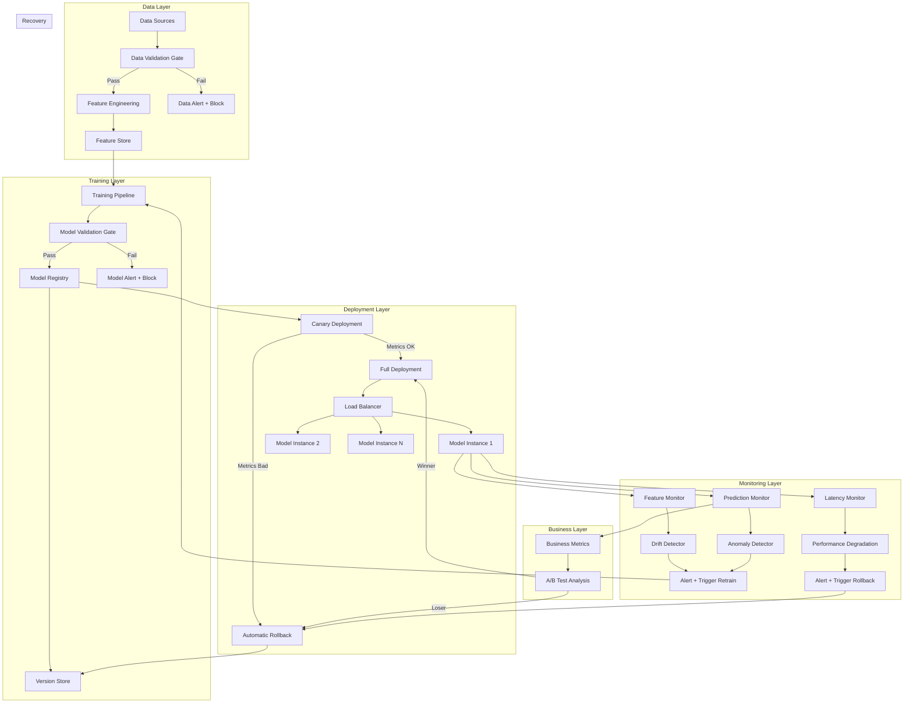

# Failure Modes Playbook for ML Systems

> The unified "Things That Will Kill Your ML Project" guide.
> Every failure mode here has happened in production. Multiple times.
> Learn from others' pain.

---

## 1. Data Failures (Most Common!)

### 1.1 Label Leakage

**What:** Training data contains information that won't be available at prediction time.

**Examples:**
- Using future data to predict past (time series look-ahead)
- Including target-derived features (e.g., "approved" field when predicting approval)
- Preprocessing (scaling/encoding) fit on ALL data before train/test split
- Aggregated features computed across train+test (e.g., "average target by category")
- Joining with tables that contain post-event information

**Detection:**
- Suspiciously high training/validation accuracy (>99% on a hard problem)
- Massive performance drop in production vs offline metrics
- Feature importance shows "obvious" feature dominating

**Prevention:**
- Strict temporal splits for time-series data
- Pipeline ordering: split FIRST, then preprocess
- Feature audit: "Would I have this feature at prediction time?"
- Remove any feature derived from or correlated with the target by construction

**REAL WAR STORY:**
> Team got 99.5% AUC predicting customer churn. Feature "last_support_ticket_type" 
> contained a "cancellation" category — which IS the churn event. The model learned 
> "if ticket_type == cancellation, predict churn." Useless in production because by 
> the time you see that ticket type, the customer has already churned.

---

### 1.2 Training-Serving Skew

**What:** Features computed differently in training vs serving.

**Examples:**
- Different code paths (Python for training, Java/Go for serving)
- Fitted scaler on training data, but serving uses different normalization
- Feature computed from entire batch in training, single record in real-time
- Training uses daily aggregates, serving computes hourly
- String encoding differences (Unicode handling, case sensitivity)
- Missing value handling differs (training drops nulls, serving imputes)

**Detection:**
```
DETECTION CHECKLIST:
□ Compare feature distributions between training data and serving logs
□ Log raw features at serving time, recompute offline, compare
□ Statistical tests (KS test, PSI) between training and serving features
□ Shadow mode: run training pipeline on same inputs as serving, diff results
```

**Prevention:**
- **Feature store** (single source of truth for feature computation)
- Integration tests comparing training and serving feature outputs
- Same code for feature computation in both paths (shared library)
- Log and monitor feature distributions in production

---

### 1.3 Distribution Shift

**What:** Production data looks different from training data.

**Types:**
```
┌──────────────────────────────────────────────────────────────┐
│ Type              │ What Changes        │ Example            │
├───────────────────┼─────────────────────┼────────────────────┤
│ Covariate shift   │ P(X) changes        │ New user segment   │
│                   │ P(Y|X) stays same   │ enters platform    │
├───────────────────┼─────────────────────┼────────────────────┤
│ Concept drift     │ P(Y|X) changes      │ What "spam" looks  │
│                   │ P(X) may stay same   │ like evolves       │
├───────────────────┼─────────────────────┼────────────────────┤
│ Label shift       │ P(Y) changes        │ Fraud rate spikes  │
│                   │ P(X|Y) stays same   │ during holidays    │
├───────────────────┼─────────────────────┼────────────────────┤
│ Domain shift      │ Everything changes   │ Model trained on   │
│                   │                     │ US, deployed in EU │
└──────────────────────────────────────────────────────────────┘
```

**Detection:**
- PSI (Population Stability Index): PSI > 0.2 = significant shift
- KS test on individual features
- Monitor prediction distribution (if predictions shift, inputs shifted)
- Track model confidence over time (decreasing = possible drift)

**Prevention:**
- Regular retraining schedule (weekly/monthly)
- Drift detection triggers automatic retraining
- Train on diverse, representative data
- Windowed training (only recent data) for fast-changing domains

---

### 1.4 Feedback Loops

**What:** Model predictions influence future training data.

**Examples:**
- Recommendation model shows popular items → more clicks → model thinks they're better → shows them more (popularity bias / rich-get-richer)
- Fraud model blocks transaction → never see outcome → model never learns it was wrong
- Content moderation model removes posts → fewer examples of borderline content → model becomes more aggressive

**Detection:**
- Monitor diversity metrics over time (decreasing = feedback loop)
- Check if model becomes more confident over time without improvement
- Compare model performance on randomly-exposed vs model-selected data
- Track coverage (what % of item catalog gets recommended?)

**Prevention:**
- Exploration/exploitation balance (epsilon-greedy, Thompson sampling)
- Randomized exposure for some fraction of traffic
- Counterfactual evaluation (IPS weighting)
- Regularly inject random/diverse examples into training
- Log model decisions with context for offline analysis

---

### 1.5 Data Quality Degradation

**What:** Upstream data sources silently break or degrade.

**Examples:**
- Schema change in upstream database (column renamed/removed)
- Third-party API changes response format
- ETL job fails silently, fills with nulls/defaults
- Sensor malfunction sends constant values
- New category appears that model has never seen

**Detection:**
```
DATA QUALITY CHECKS (run before every training + continuously in serving):
□ Schema validation (columns exist, types correct)
□ Null rate per feature (alert if > threshold)
□ Value range checks (min/max/mean within bounds)
□ Cardinality checks (number of unique values stable)
□ Freshness check (data not stale)
□ Volume check (expected number of records)
□ Distribution check (statistical tests vs reference)
```

**Prevention:**
- Great Expectations or similar data validation framework
- Circuit breaker: if data quality check fails, use last known good data
- Schema contracts with upstream teams
- Data versioning (DVC, lakeFS)

---

## 2. Model Failures

### 2.1 Overfitting to Training Period

**What:** Model memorized patterns specific to training time window, not generalizable.

**Examples:**
- Model trained during COVID performs terribly post-COVID
- Seasonal model tested only on same season as training
- Model learned spurious correlations present only in training period

**Detection:**
- Performance degrades on new data faster than expected
- Large gap between time-adjacent and time-distant test performance
- Model relies heavily on time-specific features

**Prevention:**
- Temporal train/validation/test splits (not random!)
- Test on multiple time periods
- Regularly evaluate on most recent data
- Prefer simpler models that generalize better
- Use domain knowledge to identify spurious features

---

### 2.2 Catastrophic Forgetting

**What:** Fine-tuned model "forgets" general knowledge from pretraining.

**Common with:** LLMs, BERT, any transfer learning scenario.

**Examples:**
- Fine-tuned BERT for sentiment loses language understanding
- LLM fine-tuned for code loses conversational ability
- Image model fine-tuned on medical images fails on general images

**Prevention:**
```
ANTI-FORGETTING STRATEGIES:
1. Lower learning rate for pretrained layers (1e-5 vs 1e-3)
2. Gradual unfreezing (train head first, then unfreeze layers)
3. Regularization:
   - EWC (Elastic Weight Consolidation)
   - L2 penalty toward pretrained weights
4. Mix original task data with fine-tuning data (5-10%)
5. LoRA/adapters (don't modify original weights at all)
6. Evaluate on original task during fine-tuning
```

---

### 2.3 Model Decay / Staleness

**What:** Performance degrades over time even without code changes.

**Why it happens:**
- The world changes (user behavior, market conditions, language)
- Adversarial adaptation (fraudsters learn to evade the model)
- Seasonal effects not captured in training
- New entities/products the model has never seen

**Detection:**
- Continuous monitoring of key metrics (accuracy, precision, recall)
- Sliding window evaluation (compare last week vs last month)
- Business metric degradation (revenue, engagement drops)

**Prevention:**
```
RETRAINING STRATEGIES:
─────────────────────────────────────────────────────
Domain Volatility │ Retraining Frequency
─────────────────┼───────────────────────────────────
Very stable       │ Quarterly (e.g., OCR, image classification)
Stable            │ Monthly (e.g., recommendation)
Moderate          │ Weekly (e.g., demand forecasting)
High              │ Daily (e.g., ad click prediction)
Very high         │ Online learning (e.g., fraud detection)
─────────────────────────────────────────────────────
```

---

### 2.4 Underspecification

**What:** Many models fit training data equally well but behave differently in deployment.

**Example:** 
- 5 random seeds → 5 models with same validation accuracy → wildly different production performance
- Model uses shortcut features (background color predicts animal species in training data)

**Prevention:**
- Stress test with multiple seeds, pick most stable
- Test on diverse subgroups/slices
- Causal reasoning about features
- Adversarial testing (change irrelevant features, check if prediction changes)

---

## 3. Infrastructure Failures

### 3.1 Silent GPU Failures

**What:** GPU computes wrong results without raising errors (bit flips, thermal issues).

**Detection:**
- Checksum validation on model outputs
- Periodic sanity check predictions (known input → expected output)
- NaN/Inf detection in outputs
- Compare results across replicas (divergence = hardware issue)

**Prevention:**
- Use ECC memory GPUs (A100, V100 have ECC)
- Health check endpoints that run inference on reference inputs
- Monitoring for sudden accuracy drops
- Redundant inference with voting (critical applications)

---

### 3.2 Memory Leaks in Serving

**What:** Model server gradually consumes more memory until OOM kill.

**Common causes:**
- PyTorch accumulating computation graphs (missing `torch.no_grad()`)
- Growing caches without eviction
- Request context not properly cleaned up
- Tokenizer/preprocessor accumulating state
- Python garbage collector not freeing circular references

**Prevention:**
```python
# MUST-HAVE for PyTorch inference
@torch.no_grad()
def predict(input):
    # Also explicitly delete intermediate tensors
    output = model(input)
    result = output.cpu().numpy()
    del output
    return result

# Additional safeguards:
# - Set max cache sizes with LRU eviction
# - Periodic memory profiling in production
# - Restart pods on memory threshold (Kubernetes memory limit)
# - Use gc.collect() periodically for long-running processes
```

**Detection:**
- Monitor RSS memory over time (should be flat, not growing)
- Alert if memory usage crosses 80% of limit
- Track memory per request (should be constant)

---

### 3.3 Cold Start Problems

**What:** Model takes 30-60+ seconds to load on new instance.

**Impact:**
- Traffic spike → autoscaler adds instance → cold instance → requests timeout → users see errors
- Serverless: every request after idle period gets cold start

**Prevention:**
```
COLD START MITIGATION:
1. Keep minimum instances always warm (don't scale to 0 in prod)
2. Model warmup: send dummy requests before marking healthy
3. Smaller model formats:
   - ONNX (faster load than PyTorch)
   - TensorRT (compiled for specific GPU)
   - Quantized models (smaller file = faster load)
4. Pre-download model to instance (bake into AMI/container)
5. Model caching on local SSD (not download from S3 each time)
6. Predictive autoscaling (scale before traffic arrives)
7. Health check includes model readiness (not just HTTP 200)
```

---

### 3.4 Cascading Failures

**What:** One component failure triggers failures in dependent services.

**Example:**
- Feature store goes down → model can't get features → returns errors → 
  upstream service retries aggressively → overloads everything → full outage

**Prevention:**
- Circuit breakers (stop calling failed service)
- Fallback predictions (default/cached/simple model)
- Timeouts on all external calls
- Bulkhead pattern (isolate failure domains)
- Graceful degradation (serve cached predictions if real-time fails)

```
FALLBACK HIERARCHY:
1. Real-time model prediction (normal)
2. Cached prediction for this user/item (if model is slow)
3. Simpler/faster model (if primary model is down)
4. Business rules / heuristics (if all models fail)
5. Global default (if everything is broken)
Never return an error to the user if you can return a reasonable default.
```

---

### 3.5 Thundering Herd

**What:** Many instances simultaneously try to load model or refresh cache.

**Example:**
- Model update deployed → all instances download new model from S3 simultaneously → S3 throttled → all instances fail health check → restart loop

**Prevention:**
- Staggered rollouts (rolling deployment, not all at once)
- Jittered retry/refresh intervals
- Model pre-staging (download before switching)
- Blue/green deployment for model updates
- CDN or local cache for model artifacts

---

## 4. Team/Process Failures

### 4.1 Metric Gaming / Goodhart's Law

**What:** "When a measure becomes a target, it ceases to be a good measure."

**Examples:**
- Optimize CTR → model shows clickbait → users click but immediately bounce
- Optimize engagement time → model shows outrage content → users "engage" but are unhappy
- Optimize conversion rate → model targets easy customers → no incremental value

**Prevention:**
- Multiple metrics: primary + guardrail metrics
- Guardrails: metrics that must NOT degrade (e.g., user satisfaction, retention)
- Business metric alignment: regularly check if ML metric correlates with revenue/NPS
- Qualitative review of model behavior (look at actual predictions)
- Counter-metrics (for every metric you optimize, track the opposite)

---

### 4.2 Not A/B Testing

**What:** Deploying model based on offline metrics alone.

**Why offline metrics lie:**
- Don't capture user behavior changes
- Don't capture system effects (latency, cold starts)
- Selection bias in evaluation data
- Proxy metrics don't always align with business metrics

**Prevention:**
```
A/B TESTING CHECKLIST:
□ Define primary metric BEFORE the test
□ Calculate required sample size (power analysis)
□ Run for full business cycle (at least 1-2 weeks)
□ Check for novelty effects (is lift sustained?)
□ Segment analysis (does it help all users or just some?)
□ Check guardrail metrics (nothing degraded?)
□ Statistical significance (p < 0.05, or use Bayesian)
□ Practical significance (is the effect size meaningful?)
```

---

### 4.3 Scope Creep in ML Projects

**What:** "Let's just add one more feature" syndrome.

**Why it's worse for ML:**
- Each feature adds: data pipeline, monitoring, potential failure mode
- More features = more maintenance, not always better accuracy
- ML already has high uncertainty; complexity amplifies it
- Diminishing returns: first 5 features give 90% of value

**Prevention:**
- MVP first: simplest model that provides value
- Measure incremental impact of each addition
- Cost-benefit analysis: does +0.5% accuracy justify 2 weeks of work?
- Feature retirement: remove features that don't help
- "One model, one job" principle

---

### 4.4 No Rollback Plan

**What:** Deploying new model with no way to quickly revert.

**Consequences:**
- Bad model in production for hours/days while team scrambles
- Revenue loss, user trust erosion, compliance issues

**Prevention:**
```
DEPLOYMENT CHECKLIST:
□ Previous model version tagged and instantly deployable
□ Rollback procedure documented and tested
□ Canary deployment (5% traffic first)
□ Automated rollback triggers defined:
  - Error rate > 5%
  - Latency p99 > 2× baseline
  - Business metric drops > 10%
□ Kill switch: can disable model and serve defaults in < 1 minute
□ Shadow mode testing completed before any live traffic
```

---

## 5. Quick Diagnosis Checklist

```
┌─────────────────────────────────────────────────────────────────┐
│ MODEL PERFORMING BADLY IN PRODUCTION?                            │
│ Follow this checklist IN ORDER:                                  │
├─────────────────────────────────────────────────────────────────┤
│                                                                  │
│ □ 1. Is the model even being called?                            │
│      Check: request/response logs, invocation count              │
│      Common: routing misconfigured, feature flag off             │
│                                                                  │
│ □ 2. Is input data in correct format?                           │
│      Check: schema validation errors, type mismatches            │
│      Common: API change, encoding issue, null fields             │
│                                                                  │
│ □ 3. Are features computed correctly?                           │
│      Check: compare serving features vs training distribution    │
│      Common: training-serving skew, stale features               │
│                                                                  │
│ □ 4. Are there operational issues?                              │
│      Check: latency, OOM errors, timeout rates, GPU errors       │
│      Common: memory leak, cold starts, resource exhaustion       │
│                                                                  │
│ □ 5. Has data distribution shifted?                             │
│      Check: PSI, KS test, prediction distribution               │
│      Common: new user segment, seasonal change, upstream change  │
│                                                                  │
│ □ 6. When did it start degrading?                               │
│      Check: correlate with code deploys, data changes, events    │
│      Common: upstream schema change, new data source, holiday    │
│                                                                  │
│ □ 7. Is it bad for all users or specific segments?              │
│      Check: slice metrics by user type, region, device           │
│      Common: model biased against underrepresented groups        │
│                                                                  │
│ □ 8. Is the model itself degraded (vs infrastructure)?          │
│      Check: run same inputs through model offline, compare       │
│      Common: model weights corrupted, wrong version deployed     │
│                                                                  │
└─────────────────────────────────────────────────────────────────┘
```

---

## 6. Prevention Architecture



### Monitoring Thresholds

```
RECOMMENDED ALERT THRESHOLDS:
──────────────────────────────────────────────────────────────
Signal                  │ Warning    │ Critical   │ Action
────────────────────────┼────────────┼────────────┼──────────
Feature PSI             │ > 0.1      │ > 0.25     │ Retrain
Prediction drift        │ > 10%      │ > 25%      │ Investigate
Null rate increase      │ > 2×       │ > 5×       │ Block data
Error rate              │ > 1%       │ > 5%       │ Rollback
p99 latency increase    │ > 50%      │ > 100%     │ Scale/rollback
Business metric drop    │ > 5%       │ > 10%      │ Rollback
Model confidence drop   │ > 10%      │ > 20%      │ Investigate
Data freshness          │ > 1 hour   │ > 4 hours  │ Alert team
──────────────────────────────────────────────────────────────
```

---

## 7. Failure Mode Quick Reference Card

```
┌──────────────────────────────────────────────────────────────────┐
│ FAILURE MODE          │ FREQUENCY │ SEVERITY │ TIME TO DETECT     │
├───────────────────────┼───────────┼──────────┼────────────────────┤
│ Training-serving skew │ Very High │ High     │ Days-Weeks         │
│ Distribution shift    │ High      │ High     │ Days-Months        │
│ Label leakage         │ Medium    │ Critical │ Weeks-Never        │
│ Data quality issues   │ Very High │ Medium   │ Hours-Days         │
│ Feedback loops        │ Medium    │ High     │ Weeks-Months       │
│ Cold start            │ High      │ Medium   │ Minutes            │
│ Memory leaks          │ Medium    │ High     │ Hours-Days         │
│ Model decay           │ High      │ Medium   │ Weeks              │
│ Catastrophic forget   │ Low       │ High     │ Immediately        │
│ Silent GPU failure    │ Low       │ Critical │ Hours              │
│ Cascading failure     │ Low       │ Critical │ Minutes            │
│ Metric gaming         │ Medium    │ High     │ Months             │
│ No rollback plan      │ High      │ Critical │ When it's too late │
└──────────────────────────────────────────────────────────────────┘
```

---

## 8. Post-Incident Template

```
┌─────────────────────────────────────────────────────────────────┐
│ ML INCIDENT POST-MORTEM                                          │
├─────────────────────────────────────────────────────────────────┤
│ Date: ___________  Duration: ___________                         │
│ Severity: P1 / P2 / P3 / P4                                    │
│ Model/Service: _________________________________                │
│                                                                  │
│ WHAT HAPPENED:                                                   │
│ ____________________________________________________________    │
│                                                                  │
│ IMPACT:                                                          │
│ - Users affected: _________                                     │
│ - Revenue impact: $_________                                    │
│ - Duration of bad predictions: _________                        │
│                                                                  │
│ ROOT CAUSE:                                                      │
│ □ Data quality    □ Distribution shift    □ Code bug            │
│ □ Infra failure   □ Model decay          □ Config error         │
│ □ Feedback loop   □ Label leakage        □ Other: _____        │
│                                                                  │
│ TIMELINE:                                                        │
│ - Issue started: ___________                                    │
│ - Detected: ___________  (detection gap: _________)             │
│ - Mitigated: ___________                                        │
│ - Resolved: ___________                                         │
│                                                                  │
│ WHY WASN'T IT CAUGHT EARLIER?                                   │
│ ____________________________________________________________    │
│                                                                  │
│ ACTION ITEMS:                                                    │
│ 1. _________________________________ Owner: ____ Due: ____      │
│ 2. _________________________________ Owner: ____ Due: ____      │
│ 3. _________________________________ Owner: ____ Due: ____      │
│                                                                  │
│ MONITORING GAPS TO FILL:                                         │
│ ____________________________________________________________    │
│                                                                  │
└─────────────────────────────────────────────────────────────────┘
```

---

## 9. The "Day One" Checklist

Things to set up BEFORE your model goes to production:

```
□ Monitoring
  □ Feature distribution monitoring (PSI)
  □ Prediction distribution monitoring
  □ Latency and error rate dashboards
  □ Business metric tracking
  □ Alerting configured with escalation

□ Data Quality
  □ Input validation (schema, ranges, nulls)
  □ Feature store or shared feature computation
  □ Data freshness checks
  □ Upstream dependency monitoring

□ Deployment Safety
  □ Canary/shadow deployment configured
  □ Rollback procedure documented and tested
  □ Previous model version retained and deployable
  □ Kill switch / feature flag
  □ A/B testing framework ready

□ Operational Readiness
  □ Runbook for common failures
  □ On-call rotation established
  □ Incident response procedure defined
  □ SLA/SLO defined and measured
  □ Cost monitoring and budget alerts

□ Model Lifecycle
  □ Retraining trigger defined (schedule or drift-based)
  □ Model validation gate (automated checks before deploy)
  □ Experiment tracking (MLflow, W&B, etc.)
  □ Model lineage (which data/code produced which model)
```
