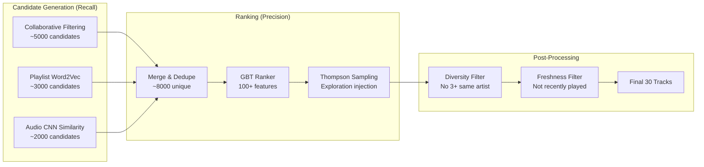
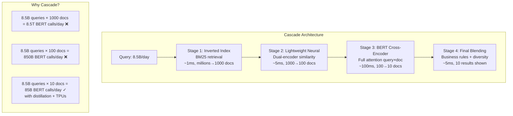

# Real-World ML System Case Studies

> How top companies actually built their ML systems — what failed, what worked, and why.

---

## Table of Contents

1. [Spotify - Discover Weekly](#case-study-1-spotify---discover-weekly)
2. [Uber - ETA Prediction](#case-study-2-uber---eta-prediction)
3. [Netflix - Recommendations + Artwork Personalization](#case-study-3-netflix---recommendations--artwork-personalization)
4. [Google - BERT for Search](#case-study-4-google---bert-for-search)
5. [Stripe - Fraud Detection (Radar)](#case-study-5-stripe---fraud-detection-radar)
6. [Tesla - Autopilot Computer Vision](#case-study-6-tesla---autopilot-computer-vision)
7. [Summary Table + Common Patterns](#summary-table--common-patterns)

---

## Case Study 1: Spotify — Discover Weekly

### The Problem

Personalize a 30-song playlist every Monday for **500M+ users** across 100M+ tracks. Users expect freshness, diversity, and serendipity — not just their favorite genre on repeat.

### Scale & Constraints

| Dimension | Value |
|-----------|-------|
| Users | 500M+ |
| Tracks | 100M+ |
| Playlists generated | 500M every Monday |
| Latency budget | Batch (overnight), but ranking must be fast |
| Key metric | Discovery rate (songs user saves/adds to library) |

### Architecture Evolution

```
v1: Collaborative Filtering Only (2014)
    - Matrix factorization on user-track interactions
    - "Users who listened to X also listened to Y"
    - Problem: Popularity bias, no cold-start handling

v2: + Audio CNN Features (2015)
    - CNN on mel-spectrograms for every track
    - Learned audio embeddings capture timbre, tempo, mood
    - Cold-start tracks now have representations

v3: + Playlist Word2Vec (2016)
    - Treat playlists as "sentences", tracks as "words"
    - Skip-gram model learns track co-occurrence embeddings
    - Captures cultural/contextual similarity (workout playlists, chill vibes)

v4: + GBT Ranking + Thompson Sampling (2017+)
    - Candidate generation (1000s) → Ranking (30 selected)
    - Gradient Boosted Trees combine all signals
    - Thompson sampling for explore/exploit balance
```



### What Failed

#### Failure 1: Pure Collaborative Filtering = Popularity Bias
- Top 1% of tracks appeared in 80% of recommendations
- New artists never surfaced (no interaction data = invisible)
- Users in niche genres got generic pop recommendations
- **Root cause**: CF amplifies what's already popular

#### Failure 2: Deep Learning Ranking Was Too Slow
- Attempted neural ranking model (transformer on user history)
- 200ms per user × 500M users = couldn't finish overnight batch
- Had to fall back to GBT which was 10x faster at inference
- **Lesson**: Batch doesn't mean latency doesn't matter at scale

#### Failure 3: Optimizing Pure Accuracy Killed Serendipity
- A/B test showed: most "accurate" model had worst retention
- Users got bored — recommendations were too predictable
- Needed explicit diversity injection and exploration

### What Worked

1. **Two-stage architecture**: Cheap recall (CF, embeddings) → expensive precision (GBT with 100+ features)
2. **Audio features for cold start**: New tracks with zero listens still get recommended via audio similarity
3. **Diversity > pure accuracy**: Explicit constraints (no 3+ songs from same artist, genre diversity score)
4. **Playlist-as-context**: Word2Vec on playlists captured "vibes" that metadata couldn't
5. **Thompson sampling**: Controlled exploration — 10-15% of slots for discovery

### Key Features Used in GBT Ranker

```
User features:
  - Listening history (genres, artists, audio features)
  - Time-of-day patterns
  - Skip rate history
  - Discover Weekly engagement history

Track features:
  - Audio embeddings (CNN)
  - Playlist co-occurrence embeddings
  - Popularity (log-scaled)
  - Release recency
  - Artist familiarity score

Cross features:
  - User-genre affinity × track genre
  - User audio preference × track audio features
  - Social proof (friends listened)
```

### Key Lessons

| Lesson | Detail |
|--------|--------|
| Two-stage always | Can't run expensive model on 100M tracks per user |
| Diversity > accuracy | Users want surprise, not perfection |
| Audio = cold start solution | New tracks are discoverable from day 1 |
| Right metric matters | Optimized "saves" not "plays" — saves = genuine discovery |
| Exploration is a feature | Thompson sampling turns uncertainty into opportunity |

---

## Case Study 2: Uber — ETA Prediction

### The Problem

Predict accurate estimated time of arrival for **15M+ trips/day** across 10,000+ cities. ETA affects pricing, driver matching, rider expectations, and route planning. Even 1 minute of error at scale = millions of dollars in misallocated resources.

### Scale & Constraints

| Dimension | Value |
|-----------|-------|
| Trips/day | 15M+ |
| Cities | 10,000+ |
| Latency requirement | <100ms (real-time for ride request) |
| Accuracy target | <15% MAPE |
| Key challenge | Traffic is non-stationary, events, weather |

### Architecture Evolution

```
v1: Segment Speed Model (2015)
    - Road network divided into segments
    - Historical average speed per segment per time-of-day
    - ETA = sum of (segment_length / segment_speed)
    - Problem: Doesn't adapt to real-time conditions

v2: Gradient Boosted Trees + Features (2017)
    - 100+ handcrafted features
    - Real-time traffic from driver GPS pings
    - City-specific models
    - XGBoost regression on (features → ETA residual)

v3: DeepETA - Transformer on Route Graph (2020+)
    - Route as sequence of road segments
    - Transformer encoder over segment embeddings
    - Attention captures segment interactions
    - Real-time features injected at each segment
    - Single global model with city embeddings
```

### What Failed

#### Failure 1: Average Speed Fails During Events
- Concert ends: 50,000 people flood 3 blocks simultaneously
- Historical average = 30mph, actual = 3mph
- **Fix**: Real-time speed from live GPS pings (5-minute rolling window)

#### Failure 2: Single Global Model (First Attempt)
- Trained one model for all cities
- NYC patterns ≠ Mumbai patterns ≠ São Paulo patterns
- **Fix v2**: City-specific models (expensive, 10,000 models)
- **Fix v3**: Single model with learned city embeddings (scalable)

#### Failure 3: Not Accounting for Pickup Time
- ETA = driving time only, but riders wait 2-5 min for pickup
- Total experience time was systematically underestimated
- **Fix**: Separate pickup time model (driver parking, building access, rider readiness)

#### Failure 4: Post-Request Route Changes
- Predicted ETA for initial route, but driver takes different path
- Or rider adds a stop mid-trip
- **Fix**: Continuous ETA updates during trip (streaming predictions)

### DeepETA Architecture Detail

```
Input: Route = [segment_1, segment_2, ..., segment_N]

Per-segment features:
  - Segment length, road type, speed limit
  - Real-time speed (from GPS fleet)
  - Historical speed (same day-of-week, time)
  - Number of traffic signals
  - Current weather
  - Active events nearby

Global features:
  - City embedding
  - Day-of-week, time-of-day
  - Is holiday/event
  - Supply/demand ratio in area

Architecture:
  Segment embeddings → Transformer encoder (6 layers)
  → [CLS] token + global features → MLP → ETA prediction
```

### What Worked

1. **Real-time GPS data**: Fleet of millions of drivers = real-time traffic sensor network
2. **Residual prediction**: Don't predict ETA directly, predict (actual - naive_estimate). More stable.
3. **Post-hoc calibration**: Isotonic regression on top of model output, per city
4. **Asymmetric loss**: Underestimation penalized more than overestimation (riders hate late)
5. **Segment-level attention**: Model learns "this highway segment matters more than side streets"

### Key Features (ranked by importance in v2 XGBoost)

```
Top features by SHAP importance:
1. Real-time segment speeds (from GPS)       ← dominates
2. Historical segment speeds (same time/day)
3. Route distance
4. Number of turns
5. Number of traffic signals
6. Current hour + day of week
7. Weather conditions
8. Supply/demand ratio
9. Pickup location type (airport, downtown)
10. Driver's current speed/heading
```

### Key Lessons

| Lesson | Detail |
|--------|--------|
| Features > model | XGBoost + great features beat deep learning + bad features |
| Real-time data essential | Historical averages are baseline, live signals are the edge |
| City clusters | Neither global nor per-city — learned city embeddings balance both |
| Asymmetric costs | Underestimate is worse than overestimate for user trust |
| Residual learning | Predict correction to simple estimate, not raw value |

---

## Case Study 3: Netflix — Recommendations + Artwork Personalization

### The Problem

Two interlinked problems:
1. **What to recommend**: Which of 15,000+ titles should each of 200M subscribers see?
2. **How to present it**: Which thumbnail/artwork for each title maximizes engagement?

### Scale & Constraints

| Dimension | Value |
|-----------|-------|
| Subscribers | 200M+ |
| Titles | 15,000+ |
| Artwork variants per title | 10-50 |
| Homepage rows | ~40 rows × ~40 titles per row |
| Key metric | Member retention (not clicks, not views) |

### Architecture: Recommendations

```
Stage 1: Candidate Generation (multiple algorithms in parallel)
  - Collaborative filtering (user-user, item-item)
  - Content-based (genre, actors, director similarity)
  - Trending/popular (recency-weighted)
  - "Because you watched X" (session-based)
  - Each generates 100-500 candidates

Stage 2: DNN Ranking
  - Deep neural network scores each (user, title) pair
  - Features: watch history, time-of-day, device, recency
  - Output: P(watch > 2 min | shown)

Stage 3: Row Generation
  - Titles assigned to rows ("Top Picks", "Trending", "Because you watched...")
  - Row ordering optimized for diversity + engagement
  - "Page-level" optimization, not just per-item

Stage 4: Artwork Personalization (Contextual Bandits)
  - For each (user, title) pair, select best artwork
  - Multi-armed bandit with user context
  - Different users see different thumbnails for same title
```

### What Failed

#### Failure 1: Optimizing Clicks → Users Clicked But Didn't Finish
- Early models optimized P(click)
- Result: Clickbait thumbnails, users clicked but abandoned after 5 min
- Churn actually INCREASED despite higher CTR
- **Fix**: Optimize P(quality_watch) = watch > X% of content

#### Failure 2: Too Much Personalization → Filter Bubble
- Users only saw content similar to what they already watched
- "Comfort zone" recommendations killed content discovery
- New titles couldn't break through
- **Fix**: Explicit exploration rows ("Surprising picks for you"), trending injection

#### Failure 3: Artwork A/B Testing at Title Level
- Initial approach: Pick single best artwork per title (global)
- Missed that different users respond to different visual cues
- Romance fan → show couple on artwork; Action fan → show explosion
- **Fix**: Per-user artwork selection via contextual bandits

### Artwork Personalization Deep Dive

```
For the movie "Good Will Hunting":
  - Artwork A: Matt Damon at chalkboard (appeals to: intellectual drama fans)
  - Artwork B: Matt Damon + Robin Williams talking (appeals to: comedy/drama fans)  
  - Artwork C: Romantic scene (appeals to: romance fans)

System selects artwork based on user's genre preferences,
past interactions with similar visual styles, and exploration needs.

Result: 20-30% improvement in title-level engagement
```

### How Contextual Bandits Work for Artwork

```
State: User context (genre preferences, watch history, time, device)
Action: Which artwork to show (from N variants)
Reward: Did user engage with title? (click + watch > threshold)

Algorithm: Thompson Sampling with neural reward model
  - Posterior over reward for each (context, artwork) pair
  - Sample from posterior, show artwork with highest sample
  - Update posterior with observed reward
  - Natural exploration via posterior uncertainty
```

### What Worked

1. **Right objective (completion > clicks)**: Dramatically reduced churn
2. **A/B test everything**: Every model change goes through rigorous online experiment
3. **Artwork personalization**: 20-30% engagement lift — same content, different visual framing
4. **Page-level optimization**: Rows interact; optimize the whole page, not items independently
5. **Multiple algorithms blend**: No single algo wins; ensemble of specialists per "intent"

### Key Lessons

| Lesson | Detail |
|--------|--------|
| Objective function is everything | Clicks ≠ satisfaction. Completion + retention = true signal |
| A/B test always | Offline metrics (NDCG, precision) often anti-correlated with business metrics |
| Presentation matters | 20-30% lift from artwork alone — HOW you show = as important as WHAT you show |
| Diversity is a feature | Filter bubbles reduce long-term engagement |
| Multi-objective | Balance engagement, diversity, freshness, content investment ROI |

---

## Case Study 4: Google — BERT for Search

### The Problem

Understand search **intent** rather than just matching keywords. 8.5B searches/day, where ~15% of queries are completely new (never seen before). A query like "can you get medicine for someone pharmacy" should understand the user wants to know about **picking up prescriptions for another person**.

### Scale & Constraints

| Dimension | Value |
|-----------|-------|
| Queries/day | 8.5B |
| Index size | Hundreds of billions of pages |
| Latency budget | <500ms total (retrieval + ranking) |
| BERT inference | ~100ms per query-document pair |
| Key challenge | Can't run BERT on every document |

### Architecture: Before vs After BERT

```
BEFORE BERT (Pre-2019):
  Query → Tokenize → TF-IDF/BM25 retrieval → Feature extraction → LambdaMART ranking
  
  Features: BM25 score, PageRank, click-through rate, 
            freshness, domain authority, keyword density
  
  Limitation: "bag of words" - no understanding of word relationships
  Example failure: "do estheticians stand a lot at work" 
                   → matched pages about "standing desks" (keyword "stand")

AFTER BERT (2019+):
  Query → Cheap retrieval (BM25/embeddings, top 1000) → BERT re-ranking (top 1000→100→10)
  
  BERT processes (query, document_snippet) pairs
  Cross-attention between query and document tokens
  Understands: negation, prepositions, context, intent
```



### The Core Challenge: BERT Is Too Slow

```
Naive approach:
  - Run BERT on every (query, document) pair in the index
  - 8.5B queries × 1000 candidate docs × 100ms = IMPOSSIBLE
  
Math:
  - Even at 1ms per pair (distilled model on TPU)
  - 8.5B × 1000 = 8.5 trillion inferences/day
  - = 98 million inferences/second
  - Requires ~100,000 TPUs just for search ranking
```

### Solution: Three-Pronged Approach

#### 1. Cascade Architecture (Most Important)
```
Don't run BERT on everything. Use cheap models to filter first:
  BM25 (free) → lightweight scorer → BERT (expensive, few docs)
  
Analogy: Don't use a microscope to find a city on a map.
         Use the map legend first, then zoom in.
```

#### 2. Model Distillation
```
Teacher: BERT-Large (340M params, too slow for serving)
Student: TinyBERT / MobileBERT (15-60M params, 4-10x faster)

Distillation process:
  - Teacher scores millions of (query, doc) pairs
  - Student trained to mimic teacher's scores
  - Student achieves 95% of teacher quality at 10% cost
```

#### 3. Hardware Co-Design (TPUs)
```
Custom TPU inference chips:
  - Optimized for transformer matrix multiplications
  - Batch multiple queries for throughput
  - Quantization (FP32 → INT8) for 2-4x speedup
  - Speculative execution for variable-length sequences
```

### What Made BERT Transformative for Search

```
Example queries where BERT helps:

1. "2019 brazil traveler to usa need a visa"
   Before: Matched "USA travelers to Brazil" (same keywords, wrong direction)
   After: Understands the DIRECTION of travel via attention

2. "do estheticians stand a lot at work"  
   Before: Results about standing desks
   After: Understands "stand" = physical standing in job context

3. "can you get medicine for someone pharmacy"
   Before: Generic pharmacy results
   After: Understands intent = picking up prescription for another person

4. "parking on a hill with no curb"
   Before: Results about "curb parking"
   After: Understands ABSENCE ("no curb") changes the answer
```

### Key Lessons

| Lesson | Detail |
|--------|--------|
| Understanding > keywords | Semantic understanding via BERT improved 10% of queries significantly |
| Cascade is mandatory | Can't afford expensive models on full corpus — filter first |
| Hardware co-design | Algorithm advances require hardware investment (TPUs for BERT) |
| Distillation works | Smaller models can capture 95% of large model quality |
| Pretraining + fine-tuning | BERT pretrained generally, then fine-tuned on search relevance |

---

## Case Study 5: Stripe — Fraud Detection (Radar)

### The Problem

Score every payment for fraud risk in **<100ms**, with a fraud rate of only **0.1%** (extreme class imbalance). Must balance: block fraud (save money) vs. allow legitimate transactions (don't lose revenue). A false positive (blocking legitimate payment) directly costs merchants money.

### Scale & Constraints

| Dimension | Value |
|-----------|-------|
| Transactions processed | Hundreds of millions/day |
| Latency budget | <100ms end-to-end |
| Fraud rate | ~0.1% (1 in 1000) |
| False positive cost | Lost sale + merchant frustration |
| False negative cost | Chargeback ($) + merchant trust |
| Adversarial | Fraudsters actively adapt to detection |

### Architecture: Multi-Layer Defense

```
Layer 1: Rule Engine (5ms)
  - Hard blocks: known fraud cards, impossible velocity
  - Allowlists: verified merchants, trusted payment methods
  - Fast, interpretable, zero ML

Layer 2: ML Scoring - XGBoost + LSTM (50ms)
  - XGBoost: 1000+ engineered features → fraud probability
  - LSTM: Sequential transaction patterns per card/user
  - Ensemble score: weighted combination

Layer 3: Decision Engine (5ms)
  - Score → decision based on merchant risk tolerance
  - High-risk merchants: block at score > 0.3
  - Low-risk merchants: block at score > 0.7
  - 3D Secure challenge at intermediate scores

Layer 4: Human Review Queue
  - Borderline cases (score 0.4-0.6) → human analysts
  - Analyst decisions become training data
  - Feedback loop: labeled fraud → retrain weekly
```

### Feature Engineering (1000+ Features)

```
Card Features:
  - Card BIN (bank, country, type)
  - Card age (newly issued = higher risk)
  - Previous chargebacks on this card
  - Cards seen on this device/IP

User/Account Features:
  - Account age
  - Email domain (disposable = risk signal)
  - Name-email consistency
  - Previous successful transactions

Transaction Features:
  - Amount (unusual for this merchant?)
  - Currency mismatch (card country ≠ merchant country)
  - Time of day (3am local time = risk signal)
  - Digital vs. physical goods

Device Features:
  - Device fingerprint (canvas, fonts, screen)
  - IP geolocation + proxy/VPN detection
  - Browser language vs. card country
  - Multiple accounts on same device

Velocity Features (MOST POWERFUL):
  - Cards tried on this device in last hour
  - Transactions on this card in last hour
  - Declined transactions preceding this one
  - Velocity across merchant category

Network/Graph Features (STRONGEST SIGNAL):
  - Cards sharing device with known fraud cards
  - Email clusters (similar emails, shared device)
  - Merchant-fraud correlation
  - Payment graph: shared addresses, phones, devices
```

### What Makes Fraud Detection Uniquely Hard

#### 1. Adversarial Drift
```
Fraudsters actively probe and adapt:
  Week 1: Model blocks transactions > $500 from new cards
  Week 2: Fraudsters split into $50 increments
  Week 3: Model catches velocity pattern
  Week 4: Fraudsters use more cards, lower velocity
  
→ Requires weekly retraining, not quarterly
→ Features must be hard to game (network features > transaction features)
```

#### 2. Extreme Class Imbalance (1000:1)
```
Naive accuracy: Predict "not fraud" always → 99.9% accurate, useless

Solutions used:
  - SMOTE for synthetic minority oversampling
  - Focal loss (down-weight easy negatives)
  - Stratified sampling in training
  - Precision-recall curves, not ROC
  - Cost-sensitive learning (FN costs 10x more than FP)
```

#### 3. Real-Time Requirement
```
Payment flow:
  User clicks "Pay" → Stripe receives → MUST DECIDE in 100ms → Accept/Decline

Can't do:
  - Large batch models
  - Complex graph traversals
  - Multiple sequential model calls

Must do:
  - Pre-compute expensive features (graph, velocity)
  - Simple model inference on pre-computed features
  - Feature store with <5ms reads
```

#### 4. Explainability Required
```
Merchants ask: "Why was this payment blocked?"

Can't say: "The model said so"
Must say: "Blocked because: card was used on 3 other devices in the last 
           hour, transaction amount is 5x the card's average, and the 
           device was previously associated with confirmed fraud"

→ SHAP values for per-transaction explanations
→ Rule engine provides human-readable reasons
```

### What Worked

1. **Feature engineering > model**: Network/graph features are 10x more predictive than transaction features
2. **Multi-layer defense**: Rules catch obvious fraud fast; ML catches sophisticated fraud
3. **Weekly retraining**: Adversarial drift means models degrade within days
4. **Network features are strongest**: Shared device/IP/address with known fraud = strongest signal
5. **Cost-sensitive thresholds**: Different merchants have different risk tolerance

### Key Lessons

| Lesson | Detail |
|--------|--------|
| Features > model | XGBoost + great features beats deep learning + basic features |
| Multi-layer defense | No single model catches everything; layers complement each other |
| Weekly retrain | Adversarial = model expires fast |
| Network/graph features | Connections to known fraud are strongest predictors |
| Explainability is required | Not optional — merchants demand reasons |
| Asymmetric costs | False negatives cost more, but false positives lose revenue |

---

## Case Study 6: Tesla — Autopilot Computer Vision

### The Problem

Perceive and understand the driving environment from **cameras only** — no LIDAR, no HD maps. Must work on 1M+ vehicles in production, handling billions of miles of diverse driving scenarios. Detect: lanes, vehicles, pedestrians, traffic signs, construction zones, and arbitrary road geometry.

### Scale & Constraints

| Dimension | Value |
|-----------|-------|
| Vehicles in fleet | 1M+ with Autopilot hardware |
| Cameras per car | 8 (surround view) |
| Inference latency | <50ms (real-time driving) |
| On-device compute | Custom FSD chip (72 TOPS) |
| Training data | Billions of miles of video from fleet |
| Key challenge | Long tail of edge cases |

### Why Camera-Only (No LIDAR)

```
LIDAR approach (Waymo, Cruise):
  - Hardware cost: $10,000-$75,000 per vehicle
  - Requires HD maps (expensive to maintain)
  - Limited fleet size (thousands of vehicles)
  - High accuracy in mapped areas only

Camera-only approach (Tesla):
  - Hardware cost: ~$50 per camera × 8 = $400
  - No HD maps (vision understands road)
  - Fleet of 1M+ vehicles = unlimited data
  - Works anywhere cameras can see
  
Trade-off: Harder problem, but unlimited scale for data collection
```

### Architecture Evolution

```
v1: Per-Camera 2D Detection (2016-2018)
  - Separate CNN per camera
  - 2D bounding boxes, lane lines
  - No fusion between cameras
  - Problem: No 3D understanding, seams between cameras

v2: Multi-Camera Fusion (2019-2020)
  - Shared backbone across cameras
  - Feature-level fusion in bird's eye view (BEV)
  - 3D object detection from fused features
  - Problem: Still frame-by-frame, no temporal reasoning

v3: Transformer + Temporal Fusion (2021+)
  - RegNet CNN backbone extracts features per camera
  - Transformer fuses across 8 cameras into unified BEV
  - Temporal module: attention across multiple frames (video, not images)
  - "Vector space" output: lanes, objects, signals in 3D
  - Neural planner: learned driving behavior from human demonstrations

v4: End-to-End (2023+)
  - Single neural network: cameras → driving commands
  - Trained on millions of human driving clips
  - "World model" predicts future states
```

### Architecture Detail (v3)

```
8 Cameras (1280×960 each)
    ↓
RegNet CNN Backbone (shared weights)
    ↓
8 × Feature Maps (multi-scale)
    ↓
Positional Encoding (camera intrinsics/extrinsics)
    ↓
Transformer Encoder (cross-attention across cameras)
    ↓
Bird's Eye View (BEV) Feature Map (unified 3D representation)
    ↓
Temporal Transformer (attention across last N frames)
    ↓
Multiple Output Heads:
  - Occupancy network (what's where in 3D)
  - Lane detection (vector polylines)
  - Object detection + tracking (3D boxes + velocity)
  - Traffic light/sign recognition
  - Driveable surface estimation
    ↓
Neural Planner (learned from human driving demonstrations)
    ↓
Driving Commands (steering, acceleration, braking)
```

### The Data Engine (Tesla's Key Advantage)

```
The Data Engine is a continuous improvement loop:

1. DEPLOY: Push model to 1M+ vehicles
    ↓
2. DETECT FAILURES: 
   - Shadow mode: model predicts, human drives, compare
   - Triggers: prediction ≠ human action (hard brake, swerve)
   - Fleet auto-uploads clips matching failure patterns
    ↓
3. AUTO-LABEL:
   - Use multiple runs through same location for ground truth
   - Future trajectories of objects = labels for current predictions
   - Offline models (larger, slower) label for online models
   - Human labelers for edge cases (1000+ person team)
    ↓
4. MINE HARD EXAMPLES:
   - Query fleet: "Find all clips with construction zone + rain"
   - Query fleet: "Find all left turns across oncoming traffic"
   - Targeted data collection for specific failure modes
    ↓
5. RETRAIN:
   - Fine-tune on mined hard examples
   - Curriculum learning: easy → hard
   - Automated regression testing on golden set
    ↓
6. VALIDATE → DEPLOY → Repeat
```

### What Makes Autonomous Driving Uniquely Hard

#### The Long Tail Problem
```
99% of driving is easy: straight road, clear weather, normal traffic
The remaining 1% contains MILLIONS of unique edge cases:
  - Construction worker waving you through with hand signals
  - Plastic bag blowing across road (vs. actual obstacle)
  - Emergency vehicle approaching from behind
  - Unusual vehicles (oversized load, horse-drawn carriage)
  - Temporary road markings contradicting permanent ones
  
Each edge case is rare individually but collectively they're common.
You encounter one every few minutes of driving.
```

#### Scale of Edge Cases
```
1M vehicles × 1 hour driving/day × 365 days = 365M hours/year
At 30fps = 39 TRILLION frames/year

Even 0.001% failure rate = 390 million failures/year
Need to push to 0.0001% or lower for safety
```

### What Worked

1. **Data Engine > algorithm**: Systematic data improvement beats architecture changes
2. **Fleet as data source**: 1M vehicles = world's largest data collection fleet
3. **Auto-labeling**: Multi-trip aggregation, future knowledge, offline models label for online
4. **Camera-only scales**: $400 sensor suite enables data from every vehicle
5. **Transformer fusion**: Attention naturally handles variable-size inputs across cameras

### What Failed / Challenges

1. **Early per-camera approach**: No 3D reasoning without fusion
2. **Frame-by-frame processing**: Can't understand occlusion/motion without temporal context
3. **Radar false positives**: Initially used radar but removed it — too many false brakes from overpasses/signs
4. **Rule-based planner**: Couldn't handle complex intersections; moved to neural planner

### Key Lessons

| Lesson | Detail |
|--------|--------|
| Data engine > algorithms | Systematic data improvement is the real moat |
| Edge cases drive development | 99% accuracy is easy; last 1% takes 99% of effort |
| Auto-labeling at scale | Human labeling can't scale to billions of frames; must automate |
| Camera-only = scale advantage | Cheap sensors on every car = unlimited data |
| Temporal reasoning | Video understanding (not just images) required for driving |
| Fleet learning | Production deployment IS the data collection strategy |

---

## Summary Table + Common Patterns

### Comparison Table

| Company | Problem | Scale | Architecture | Key Innovation |
|---------|---------|-------|-------------|----------------|
| Spotify | Music personalization | 500M users, 100M tracks | CF + Audio CNN + Word2Vec → GBT ranking | Diversity > accuracy, Thompson sampling |
| Uber | ETA prediction | 15M trips/day, real-time | Segment speeds → XGBoost → DeepETA transformer | Real-time GPS fleet as sensor network |
| Netflix | Recommendations + artwork | 200M subs, 15K titles | Multi-algo → DNN rank → contextual bandits | Artwork personalization (20-30% lift) |
| Google | Search understanding | 8.5B queries/day | BM25 → lightweight → BERT re-rank | Cascade architecture for expensive models |
| Stripe | Fraud detection | 100s of millions tx/day | Rules → XGBoost+LSTM → decision engine | Network/graph features, weekly retrain |
| Tesla | Autonomous driving | 1M+ vehicles, 8 cameras | CNN → Transformer fusion → Neural planner | Data Engine: deploy→find failures→retrain |

### Common Patterns Across ALL Six Companies

#### Pattern 1: Two-Stage Architecture (Cheap Candidates → Expensive Ranking)

```
Every single system uses this:
  Spotify: CF recall (cheap) → GBT ranking (expensive)
  Uber: Route segments (cheap) → Transformer (expensive)  
  Netflix: Multiple candidate algos → DNN ranking
  Google: BM25 retrieval → BERT re-ranking
  Stripe: Rule engine (fast) → ML scoring (slower)
  Tesla: Region proposals → Detailed classification

WHY: You can't run your best model on everything.
     Filter first with cheap models, then apply expensive precision.
```

#### Pattern 2: Features Matter More Than Model Choice

```
Stripe: XGBoost + 1000 features beats deep learning + 100 features
Uber: Good features in XGBoost performed comparably to DeepETA
Spotify: Audio + playlist + CF features > any single model architecture
Netflix: Feature engineering (time, device, recency) > model architecture

Rule of thumb: Spend 80% of effort on features, 20% on model architecture
```

#### Pattern 3: Right Objective Function Is Everything

```
Netflix: Clicks → completions (reduced churn)
Spotify: Plays → saves (measures genuine discovery)
Uber: Mean error → asymmetric loss (underestimate penalized more)
Google: Keyword match → semantic relevance
Stripe: Accuracy → cost-sensitive (different costs for FP vs FN)
Tesla: Detection accuracy → safety-critical recall

Getting the objective wrong = optimizing the wrong thing = worse outcomes
even with a "better" model
```

#### Pattern 4: Real-Time Signals Dramatically Improve Quality

```
Uber: Live GPS speeds > historical averages
Stripe: Current session velocity > past transaction history
Spotify: Recent listening session > all-time preferences
Tesla: Current frame context > map/prior knowledge
Netflix: Current session intent > long-term profile

Freshness of signal correlates with prediction quality
```

#### Pattern 5: A/B Test Everything, Offline Metrics Mislead

```
Netflix: Offline NDCG improved but online retention decreased
Spotify: "Most accurate" model had worst user retention
Google: BERT improved offline relevance but needed online validation
Stripe: Offline precision ≠ real-world fraud catch rate

ALWAYS validate with online A/B tests. Offline metrics are necessary
but NOT sufficient. They can be anti-correlated with business metrics.
```

#### Pattern 6: Continuous Retraining for Freshness

```
Stripe: Weekly (adversarial drift)
Uber: Daily (traffic patterns change)
Netflix: Daily (new content, trending)
Spotify: Weekly (new music releases)
Tesla: Continuous (data engine cycle)
Google: Periodic (but index updates constantly)

Static models degrade. The world changes. Retrain or die.
```

### The Meta-Lesson

```
What separates production ML systems from Kaggle competitions:

1. Scale forces architectural compromise (cascade, approximation)
2. The world is non-stationary (continuous retraining)
3. Users are adversarial or unpredictable (exploration, robustness)
4. Wrong objective = wrong system (business metrics, not loss functions)
5. Data quality > model sophistication (data engine, feature engineering)
6. Latency is a feature (users won't wait)
7. Explainability is required (users, regulators, debugging)
8. Diversity and exploration prevent stagnation (not just accuracy)
```

---

## Quick Reference: Architecture Decision Guide

```
When to use each pattern:

CANDIDATE GENERATION + RANKING:
  → When corpus is too large for expensive model
  → Almost always the right choice

REAL-TIME FEATURES:
  → When recent behavior is more predictive than history
  → When environment changes faster than retrain cycle

MULTI-LAYER DEFENSE:
  → When no single model covers all cases
  → When different failure modes need different solutions

CONTEXTUAL BANDITS:
  → When you need to explore while exploiting
  → When the action space is discrete and manageable

DATA ENGINE:
  → When edge cases dominate failure modes
  → When you have a production fleet generating data

CASCADE ARCHITECTURE:
  → When best model is too expensive for full corpus
  → When cheap models can eliminate 90%+ of candidates
```

---

## Further Reading

- [Spotify - How Discover Weekly Works](https://engineering.atspotify.com/)
- [Uber Engineering - DeepETA](https://www.uber.com/blog/deepeta-how-uber-predicts-arrival-times/)
- [Netflix Tech Blog - Artwork Personalization](https://netflixtechblog.com/)
- [Google AI Blog - BERT for Search](https://blog.google/products/search/)
- [Stripe Radar - ML for Fraud](https://stripe.com/radar)
- [Tesla AI Day Presentations](https://www.tesla.com/AI)
