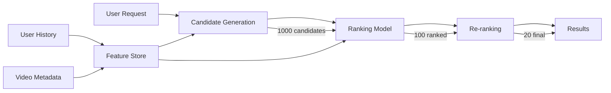
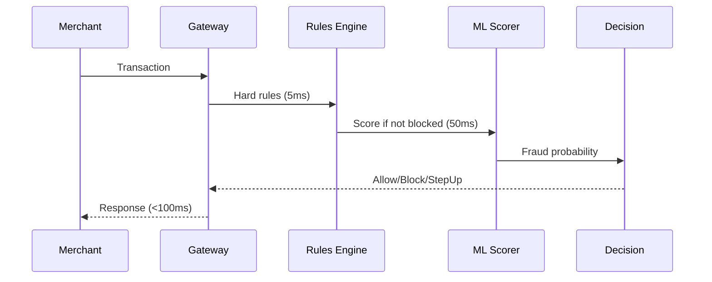

# 25 - ML Interview Question Bank

> **Your one-stop prep for ML Engineer, Data Scientist, and ML Architect interviews.**
> Covers theory, coding, system design, and behavioral — with model answers.

---

## How to Use This

```
4-WEEK PREP PLAN:
Week 1: Theory questions (Part 1) — 5 questions/day, explain aloud
Week 2: Coding challenges (Part 2) — 1 problem/day, time yourself
Week 3: System design (Part 3) — 2 designs, practice whiteboarding
Week 4: Mock interviews + behavioral (Parts 4-5)
```

---

## Part 1: ML Theory Questions (30 Questions + Answers)

### Fundamentals

**Q1: Explain the bias-variance tradeoff.**

The bias-variance tradeoff describes the tension between two sources of error:
- **Bias** = error from wrong assumptions (underfitting). Model too simple to capture patterns.
- **Variance** = error from sensitivity to training data (overfitting). Model memorizes noise.
- **Total Error** = Bias² + Variance + Irreducible Noise
- **Key insight**: As model complexity increases, bias decreases but variance increases. The sweet spot minimizes total error.
- **Practical example**: Linear regression on curved data = high bias. Degree-20 polynomial = high variance.
- **What to say in interview**: "I'd use cross-validation to find the complexity where validation error is minimized — that's the bias-variance sweet spot."

---

**Q2: What is regularization and why does it prevent overfitting?**

Regularization adds a penalty term to the loss function that discourages complex models:
- **L1 (Lasso)**: Adds |w| penalty → drives weights to exactly zero → feature selection
- **L2 (Ridge)**: Adds w² penalty → shrinks weights toward zero → smoother functions
- **Why it works**: Overfitting = model uses large weights to fit noise. Penalty makes large weights expensive, so model only uses them for real patterns.
- **Key insight**: Regularization encodes Occam's Razor — prefer simpler explanations.
- **Practical**: Always use regularization. Start with L2 (Ridge/weight_decay). Use L1 if you want automatic feature selection.

---

**Q3: Explain L1 vs L2 regularization. When would you use each?**

- **L1 (Lasso)**: |w₁| + |w₂| + ... → Diamond-shaped constraint → Weights hit zero at corners → **Sparse solutions** (automatic feature selection)
- **L2 (Ridge)**: w₁² + w₂² + ... → Circle-shaped constraint → Weights shrink uniformly → **Small but non-zero weights**
- **ElasticNet**: Both L1 + L2 (best of both worlds)
- **Use L1 when**: You suspect many features are irrelevant, want interpretability
- **Use L2 when**: All features are somewhat useful, want stability
- **Key insight**: L1 produces sparse models (built-in feature selection), L2 produces small-weight models (better for correlated features)

---

**Q4: What is the curse of dimensionality?**

As dimensions increase:
- Data becomes sparse (exponentially more volume to fill)
- Distance metrics lose meaning (all points become equidistant)
- KNN, clustering, density estimation all break down
- Need exponentially more data to cover the space
- **Key insight**: In 1000 dimensions, a "nearby" point might be very different in ways you can't visualize.
- **Solutions**: Dimensionality reduction (PCA, t-SNE), feature selection, regularization, domain knowledge to pick relevant features.

---

**Q5: Explain gradient descent variants (batch, mini-batch, stochastic).**

- **Batch GD**: Use ALL training data for each update. Accurate gradient but slow, memory-heavy.
- **Stochastic GD (SGD)**: Use 1 sample per update. Fast, noisy, can escape local minima but unstable.
- **Mini-batch GD**: Use 32-512 samples. Best of both: reasonably accurate, GPU-efficient, some noise helps generalization.
- **Key insight**: Mini-batch is what everyone actually uses. Batch size is a regularization knob — smaller batch = more noise = more regularization.
- **Variants**: Momentum (accumulate velocity), Adam (adaptive per-parameter LR), AdamW (decoupled weight decay).

---

### Algorithms

**Q6: How does Random Forest work? Why better than one tree?**

- **How**: Train N decision trees, each on a bootstrap sample (bagging) + random subset of features at each split.
- **Prediction**: Majority vote (classification) or average (regression).
- **Why better**: Single tree has high variance (overfits). Averaging many uncorrelated trees reduces variance without increasing bias (law of large numbers).
- **Feature randomization**: Forces trees to be different (decorrelated). Without it, all trees would split on the same best feature.
- **Key insight**: "Wisdom of crowds" — many diverse weak learners > one strong learner.

---

**Q7: Explain how XGBoost works. What makes it fast?**

- **Core idea**: Sequentially train trees where each new tree corrects errors of all previous trees (gradient boosting).
- **Math**: Each tree fits the negative gradient of the loss (residuals for MSE).
- **What makes XGBoost special**:
  1. Regularized objective (L1 + L2 on leaf weights)
  2. Histogram-based binning (discretize features → faster splits)
  3. Sparsity-aware splitting (handles missing values natively)
  4. Column block structure (parallelizes feature split finding)
  5. Cache-aware access patterns
- **Key insight**: It's not just "gradient boosting" — the engineering optimizations (histogram, sparsity, parallelism) make it 10-100x faster than naive implementation.

---

**Q8: How does SVM find the decision boundary? What is the kernel trick?**

- **SVM**: Find the hyperplane that maximizes margin (distance to nearest points from each class). Those nearest points = support vectors.
- **Kernel trick**: When data isn't linearly separable, map to higher dimensions where it IS separable. The trick: compute dot products in high-dim space without explicitly transforming (kernel function).
- **Common kernels**: Linear (no mapping), RBF (infinite dimensions, locality), Polynomial.
- **Key insight**: The kernel trick makes SVM computationally feasible in infinite-dimensional spaces. You never compute the actual transformation.

---

**Q9: Explain K-Means clustering. What are its limitations?**

- **Algorithm**: 1) Pick K random centroids, 2) Assign each point to nearest centroid, 3) Recompute centroids as cluster means, 4) Repeat until convergence.
- **Limitations**:
  - Must specify K (use elbow/silhouette to choose)
  - Assumes spherical, equally-sized clusters
  - Sensitive to initialization (use K-means++)
  - Sensitive to outliers
  - Can't handle non-convex clusters (use DBSCAN instead)
- **Key insight**: K-Means minimizes within-cluster variance. If your clusters aren't blob-shaped, use DBSCAN or GMM.

---

**Q10: How does PCA work? When would you NOT use it?**

- **How**: Find directions (principal components) of maximum variance in data. These are eigenvectors of the covariance matrix.
- **Steps**: Center data → Compute covariance → Eigendecomposition → Keep top-K eigenvectors → Project data.
- **When NOT to use**:
  - Non-linear relationships (use kernel PCA or t-SNE)
  - Categorical data (use MCA)
  - When you need interpretable features (PCA components are mixtures)
  - When variance ≠ importance (rare, high-variance feature might be noise)
- **Key insight**: PCA assumes variance = information. The first PC is the direction that captures most spread in the data.

---

### Deep Learning

**Q11: Explain backpropagation in simple terms.**

- **What**: Algorithm to compute gradients of the loss with respect to every weight in the network.
- **How**: Apply chain rule backwards through the computational graph. Start from loss, propagate gradient to each layer.
- **Steps**: Forward pass (compute output) → Compute loss → Backward pass (chain rule layer by layer) → Update weights.
- **Key insight**: Backprop is just the chain rule applied recursively. Each layer passes its "contribution to the error" backwards. Without it, we'd have to perturb each weight individually (impossible for millions of weights).

---

**Q12: Why do we need activation functions? What happens without them?**

- **Without**: Multiple linear layers collapse to a single linear layer (composition of linear functions is linear). Network can only learn linear relationships.
- **With**: Non-linear activations let the network approximate any function (universal approximation theorem).
- **Common choices**: ReLU (fast, sparse, but can "die"), GELU (smooth, used in transformers), sigmoid/tanh (output layers, but vanishing gradient in deep nets).
- **Key insight**: Activation functions give neural networks their power. Without them, a 100-layer network = a 1-layer network.

---

**Q13: What is the vanishing gradient problem? How do ResNets solve it?**

- **Problem**: In deep networks, gradients multiply through many layers. If each factor < 1, gradient shrinks exponentially → early layers don't learn.
- **ResNets solution**: Skip connections (residual connections): output = F(x) + x. Now gradient of the skip path = 1 (identity). Gradient always has a direct path back.
- **Result**: Can train 100+ layer networks (impossible before ResNets).
- **Key insight**: Skip connections don't just help gradients — they make it easy to learn identity function (if layer isn't useful, weights → 0, output = input). This makes deeper networks never worse than shallower ones.

---

**Q14: Explain the attention mechanism. Why better than RNNs for long sequences?**

- **Attention**: score(Q, K) → softmax → weighted sum of V. Each position directly "looks at" every other position.
- **Why better than RNNs**:
  1. Parallelizable (RNNs are sequential)
  2. Direct connections between any two positions (RNNs: info must pass through all intermediate steps)
  3. Constant path length regardless of sequence length
- **Tradeoff**: O(n²) memory/compute vs O(n) for RNNs. But hardware (GPUs) favors parallel operations.
- **Key insight**: Attention = learned, content-dependent routing. Each token decides who to pay attention to based on its content.

---

**Q15: What is batch normalization? Why does it help?**

- **What**: Normalize each feature across the batch: x_norm = (x - μ_batch) / σ_batch, then scale/shift: y = γ·x_norm + β.
- **Why it helps**:
  1. Stabilizes training (each layer's inputs have consistent distribution)
  2. Allows higher learning rates (smoother loss landscape)
  3. Slight regularization effect (batch noise)
- **Train vs Inference**: Training uses batch statistics. Inference uses running average (since single sample has no batch).
- **When NOT to use**: Small batches (noisy stats), variable-length sequences → use LayerNorm instead.

---

### NLP / Transformers

**Q16: How does BERT differ from GPT architecturally?**

| | BERT | GPT |
|---|---|---|
| Architecture | Encoder-only | Decoder-only |
| Attention | Bidirectional (sees full context) | Causal (sees only left context) |
| Pre-training | Masked Language Model (fill in blanks) | Next token prediction |
| Best for | Understanding (classification, NER, QA) | Generation (text, code, chat) |
| Key insight | BERT reads whole sentence at once, GPT reads left-to-right |

**Key insight**: BERT = understanding (bidirectional), GPT = generation (autoregressive). For classification, BERT. For generation, GPT.

---

**Q17: Difference between fine-tuning and feature extraction?**

- **Feature extraction**: Freeze pretrained model, only train new head. Fast, works with little data, preserves pretrained knowledge.
- **Fine-tuning**: Unfreeze all/some layers, train whole model. Better accuracy but needs more data, risk of catastrophic forgetting.
- **Practical**: Start with feature extraction. If not good enough, gradually unfreeze layers (discriminative learning rates: lower LR for earlier layers).
- **Key insight**: Fine-tuning is almost always better if you have >1000 examples. Feature extraction is for <100 examples or when compute is very limited.

---

**Q18: Explain tokenization (BPE). Why not just split on spaces?**

- **Problem with spaces**: Can't handle: unknown words, morphology (play/playing/played), languages without spaces (Chinese), subwords (un+break+able).
- **BPE (Byte Pair Encoding)**: Start with characters, iteratively merge most frequent pairs. Result: common words stay whole, rare words split into known subwords.
- **Example**: "unhappiness" → ["un", "happiness"] or ["un", "happ", "iness"]
- **Key insight**: BPE gives a fixed vocabulary that can represent ANY text (no OOV), while keeping common words as single tokens (efficient).

---

**Q19: What is positional encoding? Why is it needed?**

- **Problem**: Self-attention is permutation-invariant — it doesn't know word ORDER. "Dog bites man" = "Man bites dog" without positional info.
- **Solution**: Add position information to embeddings.
- **Types**: Sinusoidal (fixed, generalizes to unseen lengths), learned (trained, typically better), RoPE (rotary, modern standard).
- **Key insight**: Transformers have no inherent notion of sequence order. Positional encoding is how they know "this token is at position 5".

---

**Q20: How does LoRA work for efficient fine-tuning?**

- **Insight**: Weight updates during fine-tuning are low-rank (only need small adjustments to pretrained weights).
- **Method**: Instead of updating W (d×d), decompose update as W + ΔW where ΔW = A·B (d×r · r×d, with r << d).
- **Benefit**: 7B model → only ~4M trainable parameters (0.05%). Fits on single GPU.
- **r (rank)**: Typical 8-64. Higher = more capacity but more memory. 16 is good default.
- **Key insight**: LoRA achieves 97-99% of full fine-tuning quality with <1% of trainable parameters. It's the standard for fine-tuning large models.

---

### Production / MLOps

**Q21: What is training-serving skew? How do you prevent it?**

- **What**: Features computed differently in training vs serving, causing model to see different inputs in production.
- **Causes**: Different code paths, stale features, library version mismatch, preprocessing leakage.
- **Prevention**:
  1. Feature store (single source of truth for both)
  2. Same preprocessing code in training and serving (shared library)
  3. Monitor feature distributions in serving, compare to training
  4. Integration tests that compare training features vs serving features
- **Key insight**: This is the #1 silent killer of ML in production. Model looks fine offline, fails mysteriously online.

---

**Q22: Data drift vs concept drift. What's the difference?**

- **Data drift (covariate shift)**: Input distribution P(X) changes. Example: model trained on US users, deployed to India.
- **Concept drift**: Relationship P(Y|X) changes. Example: "good credit" definition changes during COVID.
- **Detection**: Data drift → KS test, PSI on features. Concept drift → monitor model accuracy over time (needs labels).
- **Key insight**: Data drift is detectable immediately (monitor inputs). Concept drift requires delayed labels and is much harder to catch early.

---

**Q23: How would you set up model monitoring in production?**

```
MONITOR:
├── Input data: feature distributions, null rates, schema (detect data drift)
├── Model outputs: prediction distribution, confidence, latency (detect model issues)
├── Business metrics: conversion, revenue, engagement (detect real-world impact)
└── Infrastructure: CPU/GPU, memory, error rates (detect system issues)

ALERT:
├── P1 (immediate): Model down, error rate > 5%
├── P2 (hours): Data drift detected, latency degraded
└── P3 (daily): Slow accuracy decline, prediction distribution shift

RESPOND:
├── Auto-rollback if metrics drop sharply
├── Alert on-call for investigation
└── Trigger retraining pipeline if drift confirmed
```

---

**Q24: What is a feature store? Why use one?**

- **What**: Centralized system for storing, serving, and discovering features for ML.
- **Components**: Offline store (training, batch), Online store (serving, low-latency), Feature registry (documentation).
- **Why**:
  1. Eliminates training-serving skew (same features everywhere)
  2. Feature reuse across models/teams
  3. Point-in-time correctness (no future data leakage)
  4. Feature discovery (what features exist? who uses them?)
- **Tools**: Feast (open source), Tecton (managed), Hopsworks.
- **Key insight**: Without a feature store, every model team recomputes the same features differently. Feature store = DRY principle for ML.

---

**Q25: How do you decide when to retrain a model?**

- **Scheduled**: Weekly/monthly (simple, works for stable domains)
- **Triggered**: When monitoring detects drift (PSI > threshold, accuracy drops)
- **Continuous**: Online learning, update with every new labeled example
- **Decision factors**: How fast does the domain change? Cost of retraining? Cost of being wrong?
- **Key insight**: Retrain when the cost of a stale model exceeds the cost of retraining. For fraud (adversarial, fast drift) → weekly. For demand forecasting (seasonal, slow) → monthly. For image classification (stable) → quarterly.

---

### Statistics

**Q26: Explain p-values. What's wrong with "p < 0.05 means it works"?**

- **P-value**: Probability of observing results at least this extreme IF the null hypothesis is true.
- **Problems with p < 0.05**:
  1. Doesn't measure effect SIZE (statistically significant ≠ practically meaningful)
  2. Multiple testing inflates false positives (test 20 things, 1 will be "significant" by chance)
  3. Sample size dependent (large N makes tiny differences "significant")
  4. P-value is NOT "probability the hypothesis is true"
- **Key insight**: Always report effect size + confidence interval alongside p-value. Statistical significance without practical significance is useless.

---

**Q27: How would you design an A/B test for a new recommendation model?**

```
1. Hypothesis: New model increases click-through rate by > 2%
2. Randomization: Hash(user_id) → control (50%) vs treatment (50%)
3. Sample size: Calculate needed N for 80% power to detect 2% effect
4. Duration: At least 1-2 weeks (capture day-of-week effects)
5. Guardrails: Monitor session length, revenue, complaints (don't win clicks but lose revenue)
6. Analysis: Compare CTR, run t-test, check for SRM (sample ratio mismatch)
7. Decision: If significantly better on primary metric AND no guardrail violations → ship
```
- **Key insight**: A/B test design is about WHAT you measure (right metric), HOW LONG you run (sufficient power), and what could go WRONG (guardrails prevent optimizing wrong thing).

---

**Q28: What is Simpson's paradox? Give an ML example.**

- **What**: A trend that appears in groups reverses when groups are combined.
- **ML example**: Model B has higher accuracy overall (80% vs 75%). But Model A is better for BOTH subgroups (males: A=85%, B=82%; females: A=70%, B=68%). How? B was tested on more easy samples (more males in B's test set).
- **Real case**: UC Berkeley admissions appeared biased against women overall, but within each department, women were admitted at equal/higher rates. Women just applied to more competitive departments.
- **Key insight**: Always segment your metrics. Aggregate metrics can be misleading when group sizes differ.

---

**Q29: Explain MLE intuitively.**

- **Maximum Likelihood Estimation**: Find the parameter values that make the observed data most probable.
- **Intuition**: "If I had to bet on which parameters generated this data, which parameters would give the highest probability of producing exactly what I see?"
- **Example**: See 7 heads in 10 flips. MLE says p(head) = 0.7 (maximizes likelihood of seeing 7/10).
- **Connection to ML**: Minimizing cross-entropy loss = maximizing likelihood. MSE loss = MLE under Gaussian noise assumption.
- **Key insight**: MLE is the principled answer to "what model parameters best explain my data?" Almost every loss function you use is secretly MLE.

---

**Q30: Bayesian vs Frequentist. What's the difference?**

| | Frequentist | Bayesian |
|---|---|---|
| Parameters | Fixed but unknown | Random variables with distributions |
| Data | Random (from repeated experiments) | Fixed (what we observed) |
| Answer | Point estimate + confidence interval | Full posterior distribution |
| Prior knowledge | Not incorporated | Explicitly encoded as prior |

- **When Bayesian wins**: Small data (prior helps), need uncertainty estimates, sequential decision making.
- **When Frequentist wins**: Large data (prior doesn't matter), simpler to compute, regulatory requirements (standard methods).
- **Key insight**: Bayesian gives you P(hypothesis|data), which is what you actually want. Frequentist gives you P(data|hypothesis), which you have to interpret carefully.

---

## Part 2: ML Coding Challenges (15 Problems)

### Easy (Implement from Scratch)

**Problem 1: Linear Regression with Gradient Descent**
```
TASK: Implement linear regression using gradient descent (NumPy only).
INPUT: X (100 samples, 1 feature), y (100 targets)
OUTPUT: Learned weights, loss curve, predictions
TIME: 30 minutes

APPROACH:
1. Initialize w, b randomly
2. For each iteration:
   y_pred = X @ w + b
   loss = mean((y_pred - y)²)
   dw = (2/n) * X.T @ (y_pred - y)
   db = (2/n) * sum(y_pred - y)
   w -= lr * dw
   b -= lr * db
3. Plot loss curve, verify decreasing

STRETCH: Add L2 regularization (dw += lambda * w)
```

**Problem 2: K-Means from Scratch**
```
TASK: Implement K-Means clustering (NumPy only).
INPUT: X (300 samples, 2 features), K=3
OUTPUT: Cluster assignments, centroids, iteration count

APPROACH:
1. Initialize K centroids (random from data)
2. Assign each point to nearest centroid (Euclidean distance)
3. Recompute centroids as mean of assigned points
4. Repeat until assignments don't change

STRETCH: Implement K-Means++ initialization
```

**Problem 3: KNN Classifier**
```
TASK: Implement K-Nearest Neighbors (NumPy only).
INPUT: Train X/y, test X, K=5
OUTPUT: Predictions for test set, accuracy

APPROACH:
1. For each test point, compute distance to all training points
2. Find K nearest neighbors
3. Majority vote on their labels
4. Return predicted label

STRETCH: Implement weighted KNN (closer neighbors count more)
```

**Problem 4: Decision Tree (ID3)**
```
TASK: Implement decision tree with information gain splitting.
INPUT: Categorical features + binary target
OUTPUT: Tree structure, predictions

APPROACH:
1. Compute entropy of current node
2. For each feature, compute information gain
3. Split on best feature
4. Recurse on children
5. Stop when: pure node, max depth, or min samples

STRETCH: Handle continuous features (find best threshold)
```

**Problem 5: Logistic Regression**
```
TASK: Implement logistic regression with sigmoid + BCE loss + GD.
INPUT: X (binary classification), y (0/1)
OUTPUT: Weights, loss curve, accuracy, decision boundary

APPROACH:
1. Sigmoid: σ(z) = 1 / (1 + exp(-z))
2. Prediction: p = σ(X @ w + b)
3. Loss: -mean(y*log(p) + (1-y)*log(1-p))
4. Gradients: dw = X.T @ (p - y) / n
5. Update and repeat

STRETCH: Multi-class with softmax
```

### Medium (Build a Pipeline)

**Problem 6: End-to-End Binary Classifier**
```
TASK: Given a CSV, build complete ML pipeline.
STEPS: Load → EDA → Preprocess → Feature select → Train → Evaluate → Report
OUTPUT: Classification report, ROC curve, best model + params
TIME: 60 minutes
DATASET: sklearn breast_cancer or load_diabetes
```

**Problem 7: Text Classifier**
```
TASK: Classify news articles into categories.
STEPS: Load 20newsgroups → TF-IDF → LogisticRegression → Evaluate per-class
OUTPUT: Macro F1, confusion matrix, top features per class
TIME: 30 minutes
```

**Problem 8: Anomaly Detection**
```
TASK: Find anomalies in synthetic data.
STEPS: Generate normal data + inject 5% outliers → Apply IsolationForest + LOF → Compare
OUTPUT: Precision/Recall for each method, visualization
TIME: 30 minutes
```

**Problem 9: Time Series Forecast**
```
TASK: Predict next 7 values in a time series.
STEPS: Create features (lags, rolling mean, day_of_week) → Train/test temporal split → Train model → Evaluate
OUTPUT: MAE, plot of predictions vs actual
TIME: 45 minutes
```

**Problem 10: CNN on Fashion-MNIST**
```
TASK: Build CNN achieving >88% accuracy.
STEPS: Load data → Define model (Conv-ReLU-Pool ×2 → FC) → Train → Evaluate
OUTPUT: Test accuracy, confusion matrix, sample predictions
TIME: 45 minutes (requires PyTorch)
```

### Hard (System-Level)

**Problem 11: Recommendation Engine**
```
TASK: Matrix factorization collaborative filtering on MovieLens.
APPROACH: Decompose user-item matrix into user_factors @ item_factors.T
Optimize with SGD on observed ratings.
OUTPUT: RMSE on test set, top-10 recommendations for a user
TIME: 60 minutes
```

**Problem 12: Production Training Loop**
```
TASK: PyTorch training loop with ALL production features.
INCLUDE: Mixed precision (autocast+GradScaler), gradient accumulation,
         LR scheduling (cosine), early stopping, checkpointing, metric logging
TIME: 60 minutes
```

**Problem 13: Simple Feature Store**
```
TASK: Build a minimal feature store with online + offline stores.
COMPONENTS: OfflineStore (parquet), OnlineStore (dict/Redis mock), 
           FeatureService (get features by entity_id)
TIME: 45 minutes
```

**Problem 14: A/B Test Analyzer**
```
TASK: Given logs from two models, determine statistical winner.
INPUT: control_conversions, treatment_conversions, sample_sizes
COMPUTE: Conversion rate, lift, p-value (chi-squared), confidence interval, 
         required sample size for power=0.80
TIME: 30 minutes
```

**Problem 15: RAG Pipeline**
```
TASK: Build retrieval-augmented generation with TF-IDF.
STEPS: Chunk documents → TF-IDF embed → Query → Retrieve top-3 → Format context
OUTPUT: Retrieved context + formatted prompt for any question
TIME: 45 minutes
```

---

## Part 3: ML System Design Questions (10 Problems)

### Framework for Every System Design Answer

```
1. CLARIFY (2 min): Requirements, scale, latency, constraints
2. HIGH-LEVEL (5 min): Draw architecture, data flow
3. DEEP DIVE (15 min): Pick 2-3 components, detail design decisions
4. TRADEOFFS (3 min): What alternatives exist, why this choice
5. MONITORING (2 min): What to track, failure modes
```

---

### SD-1: Design YouTube Recommendations

**Scale**: 2B users, 800M videos, 500M hours watched/day

**Architecture**:


**Key Decisions**:
- Two-stage (recall → precision) for computational feasibility
- Candidate gen: multiple sources (collaborative, content-based, trending)
- Ranking: DNN with hundreds of features (user × video × context)
- Optimize for WATCH TIME not clicks (clicks are gameable)

**What to monitor**: Watch time, diversity, click-through, user retention
**What could go wrong**: Filter bubble, clickbait optimization, stale recommendations

---

### SD-2: Design Fraud Detection System

**Scale**: 10M transactions/day, <100ms latency, 0.1% fraud rate

**Architecture**:


**Key Decisions**:
- Multi-layer: rules (fast, interpretable) + ML (accurate, complex)
- Features: velocity, device fingerprint, graph features (most powerful!)
- Threshold tuning per merchant risk tolerance
- Weekly retrain (adversarial concept drift)

**What to monitor**: FPR, detection rate, latency, new fraud patterns
**What could go wrong**: Adversarial adaptation, label delay (chargebacks take 60 days)

---

### SD-3: Design Search Autocomplete

**Scale**: 1B queries/day, <50ms response

**Key Decisions**:
- Trie for prefix matching (O(length) lookup)
- ML re-ranking: personalized + trending + context
- Cache hot prefixes (80% of queries from 20% of prefixes)
- Safety: filter offensive/dangerous completions

---

### SD-4: Design Uber ETA Prediction

**Scale**: 15M trips/day, real-time, 100+ cities

**Key Decisions**:
- Segment-level features (real-time traffic from active drivers)
- City clusters (Mumbai ≠ NYC, but Mumbai ≈ Delhi)
- Ensemble: graph-based + ML-based + rule-based for edge cases
- Output: ETA + confidence interval (not just point estimate)

---

### SD-5: Design Content Moderation

**Scale**: 500M posts/day, multi-modal (text + image + video)

**Key Decisions**:
- Cascade: hash matching (0.1ms) → cheap classifier (5ms) → expensive model (50ms) → human (minutes)
- Precision vs recall: over-remove = user frustration, under-remove = harm
- Appeal process (humans review contested decisions)
- Adversarial content (text-in-images, subtle modifications)

---

### SD-6: Design Ad Click Prediction

**Scale**: 100B predictions/day, <10ms per prediction

**Key Decisions**:
- Feature hashing for sparse features (user_id × ad_id = trillions of combinations)
- Embedding tables (learn dense representations for sparse IDs)
- Calibration (predicted probability must match actual click rate)
- Real-time feature updates (what did user just click?)

---

### SD-7: Design Medical Diagnosis Assistant

**Scale**: 1M consultations/day, HIGH STAKES

**Key Decisions**:
- Never miss critical conditions (optimize recall for dangerous diagnoses)
- Explainability required (show reasoning to doctors)
- Human-in-loop for all critical decisions (AI assists, doesn't decide)
- Uncertainty quantification (say "I'm not sure" when appropriate)

---

### SD-8: Design Real-time Translation

**Scale**: 1M translations/minute, 100+ languages

**Key Decisions**:
- Streaming translation (show partial results as user types)
- Encoder-decoder with shared multilingual vocabulary
- Low-resource languages: transfer from high-resource + back-translation
- Quality vs latency tradeoff (shorter beam search = faster but worse)

---

### SD-9: Design Autonomous Driving Perception

**Scale**: 8 cameras, 30fps, <50ms end-to-end

**Key Decisions**:
- Camera-only vs LIDAR (cost vs engineering difficulty)
- Multi-camera → BEV (bird's eye view) fusion
- Temporal consistency (track objects across frames)
- Safety: redundancy, fallback to safe stop, edge case handling

---

### SD-10: Design LLM Customer Support

**Scale**: 100K conversations/day, enterprise

**Key Decisions**:
- RAG for company-specific knowledge (not hallucination)
- Guardrails: input sanitization, output filtering, PII removal
- Escalation: detect when AI can't help → route to human
- Evaluation: CSAT, resolution rate, hallucination rate, escalation rate

---

## Part 4: Behavioral Questions (10 Questions)

### B1: "Tell me about a model that failed in production."

**What they're really asking**: Can you learn from failure? Do you understand production complexity?

**Structure your answer**:
1. Situation (what model, what it did)
2. What went wrong (specific technical cause)
3. How you detected it
4. How you fixed it
5. What you learned / what you changed to prevent it

**Key points to hit**: Show you have production experience, understand monitoring, and improve processes after failure.

---

### B2: "How do you decide between simple and complex models?"

**What they want**: Pragmatism, business awareness, not just "always deep learning"

**Answer framework**:
- Start simple (baseline), measure performance
- Justify complexity only if simple isn't good enough AND you have enough data
- Consider: interpretability needs, latency constraints, maintenance cost, team capability
- "I always ask: what's the simplest model that meets the business requirement?"

---

### B3: "When ML wasn't the right solution"

**What they want**: Judgment, not every problem needs ML

**Examples**: Rule-based system was enough, heuristic was simpler and 95% as good, data wasn't available, problem was better solved by product change.

---

### B4: "Disagreement on model choice"

**Key**: Show you use DATA to resolve disagreements, not authority. "Let's benchmark both approaches on the same validation set and compare."

---

### B5: "Data quality bottleneck"

**Key**: Show you understand data work is 80% of ML, and you have strategies: automated validation, data contracts with upstream teams, monitoring.

---

### B6: "Prioritizing model improvements"

**Framework**: Expected impact × confidence / effort. Always measure current baseline first. Pick the improvement most likely to move the business metric.

---

### B7: "Debugging underperforming model"

**Framework**: Systematic diagnosis. Check data first (is input correct?), then model (is it predicting at all?), then features (are they computed correctly?), then compare to baseline.

---

### B8: "Staying current with research"

**Show**: You have a system (arxiv digest, conference papers, blog posts). Mention 1-2 recent papers you found useful and explain WHY they're relevant to your work.

---

### B9: "Accuracy vs latency tradeoff"

**Key**: Quantify both. "We needed p99 < 50ms, but our best model was at 120ms. We distilled to a smaller model: lost 1.5% accuracy but got 30ms latency. Net business impact was positive because fewer timeouts."

---

### B10: "When is model 'good enough' to deploy?"

**Framework**:
1. Beats baseline / current system by meaningful margin
2. Meets latency/cost constraints
3. No fairness/bias concerns
4. A/B test shows positive business impact
5. Monitoring and rollback are in place

---

## Part 5: Interview Prep Strategy

### 4-Week Timeline

```
WEEK 1: FOUNDATIONS
├── Mon-Fri: 5 theory questions per day (explain aloud, 5 min each)
├── Weekend: Implement 2 algorithms from scratch
└── GOAL: Can explain any ML concept in 60 seconds

WEEK 2: CODING
├── Mon-Fri: 1 coding challenge per day (time yourself: 45 min)
├── Weekend: Build end-to-end pipeline from scratch
└── GOAL: Can implement any standard ML pipeline under time pressure

WEEK 3: SYSTEM DESIGN
├── Mon-Wed: Study 2 system designs per day (read + draw)
├── Thu-Fri: Practice explaining designs aloud (25 min each)
├── Weekend: Mock system design with a friend
└── GOAL: Can design any ML system from scratch in 30 minutes

WEEK 4: POLISH
├── Mon-Tue: Behavioral prep (write STAR stories)
├── Wed-Thu: Full mock interviews
├── Fri: Review weak areas
├── Weekend: Rest
└── GOAL: Confidence under interview pressure
```

### Top 10 Mistakes in ML Interviews

1. **Over-engineering**: Start with logistic regression, not a 50-layer neural net
2. **Not asking clarifying questions**: Always ask about scale, latency, data availability
3. **Memorizing without understanding**: Interviewers probe depth with "but why?"
4. **Ignoring production**: Everyone asks "how would you deploy this?"
5. **No metrics**: Say "95% F1" not "good accuracy"
6. **Skipping EDA**: Always mention you'd look at the data first
7. **Forgetting baselines**: Compare to simple approach, not just absolute numbers
8. **No monitoring answer**: Always explain what you'd monitor post-deployment
9. **Ignoring tradeoffs**: Every design choice has downsides — acknowledge them
10. **Talking too long**: Be concise. 2-minute answers, not 10-minute lectures.

### What Companies Look For by Level

| Level | What They Assess |
|-------|-----------------|
| **Junior MLE** | Can implement algorithms, write clean code, understands basics |
| **Senior MLE** | Designs training pipelines, production-ready code, mentors |
| **Staff MLE** | System design, cross-team influence, makes architectural decisions |
| **Junior DS** | EDA, basic modeling, communicates findings clearly |
| **Senior DS** | Complex analysis, causal inference, stakeholder management |
| **Staff DS** | Research direction, org-wide metric frameworks, executive communication |
| **ML Architect** | Full system design, cost/scale, reliability, technology selection |

### Salary Negotiation Tips (ML-Specific)
- ML roles command 20-30% premium over general SWE (supply/demand)
- Know your market: levels.fyi for ML-specific comp data
- Competing offers are your biggest lever
- Startup equity: heavily discount (80%+ fail)
