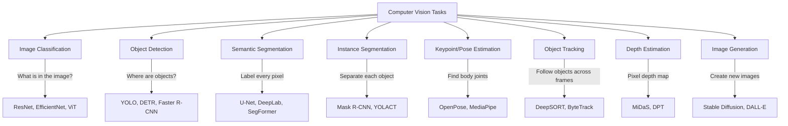
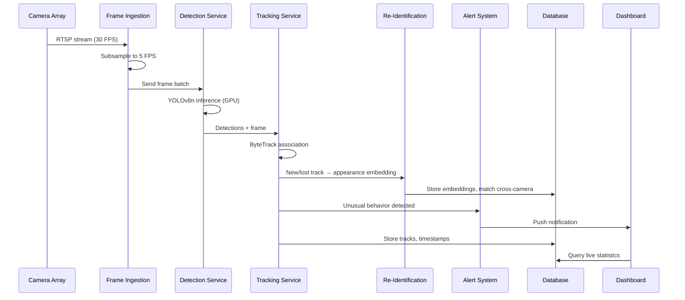

# Computer Vision Deep Dive

> Object Detection, Segmentation, Pose Estimation, Tracking, and Modern CV Architectures

---

## 1. Computer Vision Task Taxonomy



### Task Complexity Ladder

| Task | Output | Complexity | Example Use Case |
|------|--------|-----------|------------------|
| Classification | Single label | Low | "Is this a cat or dog?" |
| Detection | Bounding boxes + labels | Medium | "Find all cars in the frame" |
| Semantic Segmentation | Per-pixel class labels | Medium-High | "Label road vs sidewalk vs sky" |
| Instance Segmentation | Per-pixel + instance IDs | High | "Separate each person's outline" |
| Panoptic Segmentation | Semantic + Instance combined | Very High | "Full scene understanding" |
| Pose Estimation | Keypoint coordinates | High | "Where are the body joints?" |
| Tracking | IDs across frames | High | "Follow this person across video" |

---

## 2. Image Classification (Architecture Evolution)

### Timeline of Key Architectures

```
1998: LeNet-5 (60K params) — First CNN, MNIST digits
  WHY: Showed convolutions work for images
  KEY: Conv → Pool → Conv → Pool → FC
  
2012: AlexNet (60M params) — Won ImageNet by huge margin (15.3% → 10.8% error)
  WHY: ReLU + Dropout + GPU training = deep networks work!
  KEY: First to use GPU training, showed scale matters
  
2014: VGGNet (138M params) — Very deep (16-19 layers), 3×3 convolutions only
  WHY: Deeper = better, small filters stack to large receptive fields
  KEY: Two 3×3 convs = one 5×5 receptive field, fewer params
  
2014: GoogLeNet/Inception (5M params) — Multi-scale convolutions in parallel
  WHY: Different objects need different filter sizes
  KEY: Inception module (1×1, 3×3, 5×5 in parallel) + 1×1 bottleneck
  
2015: ResNet (25M params) — Skip connections, 152 layers!
  WHY: Solved vanishing gradient → enabled very deep networks
  KEY: y = F(x) + x (residual learning: learn the difference)
  
2017: SENet — Channel attention (which channels matter?)
  WHY: Not all feature channels are equally important
  KEY: Squeeze-and-Excitation block: Global pool → FC → Sigmoid → Scale
  
2019: EfficientNet — Compound scaling (depth × width × resolution)
  WHY: Systematic way to scale CNNs optimally
  KEY: φ controls all three dimensions simultaneously
  
2020: ViT (Vision Transformer) — Pure attention, no convolutions
  WHY: With enough data, attention > convolution for images
  KEY: Split image into 16×16 patches → treat as token sequence
  
2022: ConvNeXt — CNN modernized with transformer tricks
  WHY: CNNs can match ViT if you use modern training recipes!
  KEY: Large kernels (7×7), LayerNorm, GELU, fewer activations
```

### ResNet Architecture (Most Important to Understand)

```
Input (224×224×3)
  │
  ├── Conv 7×7, stride 2 → 112×112×64
  ├── MaxPool 3×3, stride 2 → 56×56×64
  │
  ├── Stage 1: 3 residual blocks → 56×56×256
  │     ┌─────────────────────┐
  │     │  1×1 conv (reduce)  │
  │     │  3×3 conv (process) │──── + ──→ out
  │     │  1×1 conv (expand)  │     ↑
  │     └─────────────────────┘     │
  │           input ────────────────┘  (skip connection)
  │
  ├── Stage 2: 4 residual blocks → 28×28×512
  ├── Stage 3: 6 residual blocks → 14×14×1024
  ├── Stage 4: 3 residual blocks → 7×7×2048
  │
  ├── Global Average Pooling → 2048
  └── FC → num_classes
```

**Why skip connections work:**
- Without: network must learn `H(x)` directly (hard for deep nets)
- With: network learns `F(x) = H(x) - x` (residual, easier to optimize)
- If identity is optimal, just learn `F(x) = 0` (easy!)

### Vision Transformer (ViT)

```
Input image (224×224×3)
  │
  ├── Split into patches (14×14 grid of 16×16 patches)
  ├── Linear projection: each patch → 768-dim embedding
  ├── Add positional embeddings (learned)
  ├── Prepend [CLS] token
  │
  ├── Transformer Encoder (×12 layers)
  │     ├── Layer Norm
  │     ├── Multi-Head Self-Attention (patches attend to each other)
  │     ├── Layer Norm
  │     └── MLP (FFN)
  │
  └── [CLS] token → Classification head
```

**ViT vs CNN tradeoffs:**
- ViT needs MORE data (pretrain on 300M+ images or use DeiT tricks)
- ViT has global receptive field from layer 1 (CNN builds gradually)
- ViT is better at capturing long-range dependencies
- CNN has inductive bias (locality, translation equivariance) = better with less data

### Loading Pretrained Models

```python
import torch
import torchvision.models as models
from transformers import ViTForImageClassification

# ResNet-50 (PyTorch)
resnet = models.resnet50(weights='IMAGENET1K_V2')
resnet.eval()

# EfficientNet-B0
effnet = models.efficientnet_b0(weights='IMAGENET1K_V1')

# Vision Transformer (HuggingFace)
vit = ViTForImageClassification.from_pretrained('google/vit-base-patch16-224')

# ConvNeXt
convnext = models.convnext_tiny(weights='IMAGENET1K_V1')
```

---

## 3. Object Detection (DEEP DIVE)

### Two-Stage Detectors

```
Faster R-CNN Architecture:
┌─────────────────────────────────────────────────────────────────┐
│ Input Image (800×600)                                           │
│      │                                                          │
│      ▼                                                          │
│ ┌─────────────────────┐                                        │
│ │  Backbone (ResNet)   │ → Feature map (50×38×256)             │
│ │  + FPN (multi-scale) │                                        │
│ └─────────────────────┘                                        │
│      │                                                          │
│      ▼                                                          │
│ ┌─────────────────────┐     ┌─────────────────────┐           │
│ │  RPN (Region         │     │  ~2000 proposals    │           │
│ │  Proposal Network)   │────▶│  with objectness    │           │
│ └─────────────────────┘     │  scores              │           │
│                              └─────────────────────┘           │
│      │                              │                           │
│      ▼                              ▼                           │
│ ┌─────────────────────────────────────────────┐                │
│ │  ROI Align: Crop & resize features per box  │                │
│ └─────────────────────────────────────────────┘                │
│      │                    │                                     │
│      ▼                    ▼                                     │
│ ┌──────────┐      ┌─────────────┐                             │
│ │ Classify │      │ Refine bbox │                             │
│ │ (what?)  │      │ (where?)    │                             │
│ └──────────┘      └─────────────┘                             │
└─────────────────────────────────────────────────────────────────┘

WHY two-stage: Higher accuracy (~+2-3 mAP), but slower (~5 FPS)
WHEN: Accuracy critical, offline processing (medical, satellite)
```

### Single-Stage Detectors: YOLO Family

```
YOLO Evolution:
├── YOLOv1 (2016): Grid-based, fast but inaccurate
├── YOLOv2 (2017): Batch norm, anchor boxes, multi-scale
├── YOLOv3 (2018): Feature pyramid, 3 detection scales
├── YOLOv4 (2020): Bag of tricks (CSP, Mish, mosaic aug)
├── YOLOv5 (2020): PyTorch, great engineering, easy to use
├── YOLOv7 (2022): E-ELAN, model reparameterization
├── YOLOv8 (2023): Anchor-free, decoupled head, state-of-art
└── YOLOv11 (2024): Latest Ultralytics release
```

```
YOLOv8 Architecture:
┌─────────────────────────────────────────────────────────────┐
│                                                             │
│  ┌───────────────┐   ┌───────────────┐   ┌─────────────┐ │
│  │   Backbone    │   │     Neck      │   │    Head     │ │
│  │  CSPDarknet   │──▶│    PANet/FPN  │──▶│  Decoupled  │ │
│  │               │   │  (multi-scale │   │  (separate  │ │
│  │  Extracts     │   │   feature     │   │   cls +     │ │
│  │  features at  │   │   fusion)     │   │   reg)      │ │
│  │  3 scales     │   │               │   │             │ │
│  └───────────────┘   └───────────────┘   └─────────────┘ │
│                                                             │
│  Detect at 3 scales: 80×80 (small), 40×40 (med), 20×20    │
│                                                             │
│  Anchor-free: predict center offset + width/height directly│
│  No NMS needed at training (task-aligned assigner)         │
│  NMS still used at inference                               │
└─────────────────────────────────────────────────────────────┘
```

### DETR (DEtection TRansformer)

```
DETR Architecture:
Input → CNN Backbone → Flatten → Transformer Encoder → Transformer Decoder → Predictions
                                                              ↑
                                                    Object Queries (100 learned)
                                                    
Key Insight:
- 100 object queries each "ask" about one potential object
- Bipartite matching (Hungarian algorithm) assigns GT to queries
- No anchors, no NMS, no hand-designed components!

Pros: Elegant, end-to-end, great for large objects
Cons: Slow to train (500 epochs), struggles with small objects
Fix: Deformable DETR (faster training, better small objects)
```

### YOLOv8 Practical Guide (Complete)

```python
from ultralytics import YOLO

# ═══════════════════════════════════════════════════════
# Model Variants (speed vs accuracy tradeoff)
# ═══════════════════════════════════════════════════════
# yolov8n.pt  - Nano   (3.2M params,  ~150 FPS on GPU)
# yolov8s.pt  - Small  (11.2M params, ~100 FPS)
# yolov8m.pt  - Medium (25.9M params, ~60 FPS)
# yolov8l.pt  - Large  (43.7M params, ~40 FPS)
# yolov8x.pt  - XLarge (68.2M params, ~30 FPS)

# ═══════════════════════════════════════════════════════
# Inference
# ═══════════════════════════════════════════════════════
model = YOLO('yolov8n.pt')

# Single image
results = model('image.jpg')

# Process results
for result in results:
    for box in result.boxes:
        x1, y1, x2, y2 = box.xyxy[0].tolist()
        confidence = box.conf[0].item()
        class_id = int(box.cls[0].item())
        class_name = model.names[class_id]
        print(f"{class_name}: {confidence:.2f} at [{x1:.0f},{y1:.0f},{x2:.0f},{y2:.0f}]")

# Video/webcam
results = model('video.mp4', stream=True)  # Generator for memory efficiency
for frame_result in results:
    annotated = frame_result.plot()  # Draw boxes on frame

# Batch inference
results = model(['img1.jpg', 'img2.jpg', 'img3.jpg'])

# ═══════════════════════════════════════════════════════
# Training on Custom Dataset
# ═══════════════════════════════════════════════════════
model = YOLO('yolov8n.pt')  # Start from pretrained
model.train(
    data='dataset.yaml',
    epochs=100,
    imgsz=640,
    batch=16,
    lr0=0.01,
    augment=True,
    patience=20,       # Early stopping
    device='0',        # GPU 0
)

# Validate
metrics = model.val()
print(f"mAP50: {metrics.box.map50:.3f}")
print(f"mAP50-95: {metrics.box.map:.3f}")

# ═══════════════════════════════════════════════════════
# Export for Deployment
# ═══════════════════════════════════════════════════════
model.export(format='onnx')       # Cross-platform
model.export(format='engine')     # TensorRT (NVIDIA GPU)
model.export(format='tflite')     # Mobile (Android)
model.export(format='coreml')     # iOS
model.export(format='openvino')   # Intel CPU
```

### Custom Object Detection Dataset

```yaml
# dataset.yaml
path: /path/to/dataset
train: images/train
val: images/val
test: images/test  # optional

names:
  0: car
  1: person
  2: bicycle
  3: traffic_light
```

```
Dataset structure:
dataset/
├── images/
│   ├── train/
│   │   ├── img001.jpg
│   │   └── img002.jpg
│   └── val/
│       ├── img100.jpg
│       └── img101.jpg
├── labels/
│   ├── train/
│   │   ├── img001.txt    ← YOLO format annotations
│   │   └── img002.txt
│   └── val/
│       ├── img100.txt
│       └── img101.txt
└── dataset.yaml
```

```
YOLO annotation format (one .txt per image):
<class_id> <x_center> <y_center> <width> <height>
All values normalized to [0, 1]

Example (img001.txt):
0 0.45 0.32 0.12 0.18    ← car at center (0.45, 0.32), size 12%×18%
1 0.72 0.65 0.08 0.25    ← person
```

**Annotation format comparison:**

| Format | Used By | Structure |
|--------|---------|-----------|
| YOLO txt | YOLOv5/v8 | `class cx cy w h` (normalized) |
| COCO JSON | Detectron2, many | `{"bbox": [x,y,w,h], "category_id": N}` |
| Pascal VOC XML | Older tools | `<bndbox><xmin>...</xmax>...` |

**Labeling tools:** LabelImg, Roboflow (cloud + augmentation), CVAT (enterprise), Label Studio

**How much data do you need?**
- Minimum viable: 100-300 images per class
- Good results: 500-1000 per class
- Great results: 2000-5000 per class
- Diminishing returns after: 10,000+ per class

### Evaluation Metrics for Detection

```
IoU (Intersection over Union):
┌──────────────┐
│  ┌────────┐  │        Area of Overlap
│  │OverLap │  │  IoU = ─────────────────
│  └────────┘  │        Area of Union
└──────────────┘

IoU = 1.0 → perfect overlap
IoU = 0.0 → no overlap
IoU > 0.5 → "correct" detection (standard threshold)
IoU > 0.75 → "strict" correct detection
```

```
Precision-Recall for Detection:
- True Positive: Detection with IoU > threshold that matches a GT box
- False Positive: Detection with IoU < threshold OR duplicate detection
- False Negative: Ground truth box with no matching detection

mAP Calculation:
1. Sort all detections by confidence (high → low)
2. For each detection: mark as TP or FP
3. Compute precision-recall curve
4. AP = Area under PR curve (per class)
5. mAP = mean AP across all classes

mAP@0.5: Standard metric (IoU threshold = 0.5)
mAP@0.5:0.95: COCO metric (average over IoU 0.5, 0.55, ..., 0.95)
```

### Non-Maximum Suppression (NMS)

```
Problem: Model outputs many overlapping boxes for same object

NMS Algorithm:
1. Sort all boxes by confidence score
2. Pick highest confidence box → keep it
3. Remove all boxes with IoU > 0.5 with kept box
4. Repeat from step 2 until no boxes remain

Variants:
- Soft-NMS: Don't remove, just reduce confidence based on IoU
- DIoU-NMS: Use center distance, not just IoU
- Matrix NMS: Parallel NMS (faster on GPU)
```

---

## 4. Image Segmentation

### Semantic Segmentation (Label Every Pixel)

```
U-Net Architecture:
                    Input (572×572)
                         │
    Encoder              │              Decoder
    ────────             │              ────────
    Conv 3×3 ×2 ───────────────────── Conv 3×3 ×2  → Output mask
    64 filters           │              64 filters
         │               │                   ↑
    MaxPool 2×2          │          UpConv 2×2 + Concat
         │               │                   ↑
    Conv 3×3 ×2 ───────────────────── Conv 3×3 ×2
    128 filters          │             128 filters
         │               │                   ↑
    MaxPool 2×2          │          UpConv 2×2 + Concat
         │               │                   ↑
    Conv 3×3 ×2 ───────────────────── Conv 3×3 ×2
    256 filters          │             256 filters
         │               │                   ↑
    MaxPool 2×2          │          UpConv 2×2 + Concat
         │               │                   ↑
    Conv 3×3 ×2 ───────────────────── Conv 3×3 ×2
    512 filters     Bottleneck         512 filters
         │          1024 filters             ↑
         └──────────────┴────────────────────┘
                  (skip connections)
                  
KEY INNOVATIONS:
- Symmetric encoder-decoder
- Skip connections preserve spatial detail lost during downsampling
- Works with very few training images (~30 for medical)
- Output is same resolution as input
```

```
DeepLabV3+:
┌───────────────────────────────────────────────────┐
│ Backbone (ResNet/Xception)                        │
│    │                                              │
│    ▼                                              │
│ Atrous Spatial Pyramid Pooling (ASPP):            │
│    ├── 1×1 conv (rate 1)                         │
│    ├── 3×3 conv (rate 6)   ← dilated convolution │
│    ├── 3×3 conv (rate 12)  ← larger receptive    │
│    ├── 3×3 conv (rate 18)  ← even larger         │
│    └── Global average pool                        │
│    All concatenated → 1×1 conv                    │
│    │                                              │
│    ▼                                              │
│ Decoder: Upsample + skip from backbone            │
│    → Per-pixel classification                     │
└───────────────────────────────────────────────────┘

WHY Atrous/Dilated Convolutions:
- Normal conv: 3×3 kernel sees 3×3 area
- Dilated (rate=2): 3×3 kernel sees 5×5 area (skip every other pixel)
- Dilated (rate=4): 3×3 kernel sees 9×9 area
- Benefit: Large receptive field WITHOUT downsampling = keep resolution!
```

```
SegFormer:
├── Hierarchical Transformer Encoder
│   ├── Stage 1: Patch size 4×4, output H/4 × W/4
│   ├── Stage 2: Merge 2×2, output H/8 × W/8
│   ├── Stage 3: Merge 2×2, output H/16 × W/16
│   └── Stage 4: Merge 2×2, output H/32 × W/32
│
├── Lightweight MLP Decoder
│   ├── Upsample all stages to H/4 × W/4
│   ├── Concatenate
│   └── MLP → per-pixel prediction
│
KEY: No positional encoding (uses overlapping patch embedding)
     Mix-FFN: 3×3 depth-wise conv in FFN for local info
     Efficient self-attention: reduce K,V resolution
```

### Instance Segmentation

```
Mask R-CNN = Faster R-CNN + Mask Branch:
┌─────────────────────────────────────────┐
│ Faster R-CNN pipeline (detect boxes)    │
│     │                                   │
│     ▼                                   │
│ For each detected box:                  │
│   ├── ROI Align (14×14 features)       │
│   ├── Classification: "What class?"    │
│   ├── Box regression: "Exact location" │
│   └── Mask head: 28×28 binary mask     │
│       (per-class pixel prediction)      │
└─────────────────────────────────────────┘

KEY: ROI Align (not ROI Pool) — bilinear interpolation avoids 
     quantization artifacts → better mask quality

Output: For each object → class + box + pixel-level mask
```

### Panoptic Segmentation

```
= Semantic Segmentation + Instance Segmentation

Every pixel gets:
├── A semantic class (what)
└── An instance ID (which one, for "things")

Categories:
├── "Things" (countable): car, person, dog → need instance IDs
└── "Stuff" (uncountable): sky, road, grass → just class label

Metric: Panoptic Quality (PQ) = SQ × RQ
├── SQ (Segmentation Quality): average IoU of matched segments
└── RQ (Recognition Quality): F1 of segment matching
```

### Segmentation Code Example

```python
# Semantic segmentation with SegFormer (HuggingFace)
from transformers import SegformerForSemanticSegmentation, SegformerFeatureExtractor
import torch

model = SegformerForSemanticSegmentation.from_pretrained(
    "nvidia/segformer-b2-finetuned-cityscapes-1024-1024"
)
extractor = SegformerFeatureExtractor.from_pretrained(
    "nvidia/segformer-b2-finetuned-cityscapes-1024-1024"
)

inputs = extractor(image, return_tensors="pt")
outputs = model(**inputs)
# Upsample to original size
pred = torch.nn.functional.interpolate(
    outputs.logits, size=image.size[::-1], mode='bilinear'
)
seg_map = pred.argmax(dim=1)[0]  # Per-pixel class predictions
```

### Segmentation Loss Functions

```
Cross-Entropy Loss: Standard per-pixel classification loss
Dice Loss: 1 - (2|A∩B|)/(|A|+|B|) — handles class imbalance
Focal Loss: Down-weights easy pixels, focuses on hard ones
Combined: 0.5 × CE + 0.5 × Dice (common best practice)
```

---

## 5. Pose Estimation & Keypoints

```
Approaches:
├── Top-Down: Detect person → estimate keypoints per person
│   Pros: More accurate per person
│   Cons: Slow for many people (runs pose model N times)
│   Models: HRNet, SimpleBaseline
│
└── Bottom-Up: Detect all keypoints → group into people
    Pros: Speed independent of number of people
    Cons: Grouping is hard, less accurate
    Models: OpenPose, HigherHRNet
```

```
OpenPose Pipeline:
Input image
    │
    ├── VGG backbone → feature maps
    │
    ├── Branch 1: Confidence Maps (where are joints?)
    │   Output: Heatmap per joint type (nose, left elbow, etc.)
    │
    ├── Branch 2: Part Affinity Fields (which joints connect?)
    │   Output: 2D vector field encoding limb direction
    │
    └── Assembly: Greedy matching using PAFs
        → Full skeletons for all people
        
Keypoints (COCO format, 17 points):
nose, left_eye, right_eye, left_ear, right_ear,
left_shoulder, right_shoulder, left_elbow, right_elbow,
left_wrist, right_wrist, left_hip, right_hip,
left_knee, right_knee, left_ankle, right_ankle
```

```
MediaPipe (Google):
├── Blazepose: 33 body keypoints, runs at 30+ FPS on mobile
├── Hand tracking: 21 keypoints per hand
├── Face mesh: 468 landmarks
├── Holistic: Body + hands + face combined
└── Platform: Python, JavaScript, Android, iOS

# Usage (Python)
import mediapipe as mp
mp_pose = mp.solutions.pose
pose = mp_pose.Pose(min_detection_confidence=0.5)
results = pose.process(rgb_image)
landmarks = results.pose_landmarks  # 33 keypoints with x, y, z, visibility
```

```
HRNet (High-Resolution Network):
├── Maintains high resolution throughout (no progressive downsampling)
├── Parallel multi-resolution streams with repeated fusion
├── Most accurate on COCO keypoint benchmark
├── Heavier than alternatives
└── WHEN: Sports analysis, motion capture, accuracy-critical applications
```

---

## 6. Object Tracking

```
Multi-Object Tracking (MOT) Pipeline:

Frame 1    Frame 2    Frame 3    Frame 4
┌──────┐  ┌──────┐  ┌──────┐  ┌──────┐
│ D1   │  │ D1'  │  │ D1'' │  │      │  ← Person ID=1 (disappears)
│ D2   │  │ D2'  │  │ D2'' │  │ D2'''│  ← Person ID=2 (tracked)
│      │  │ D3   │  │ D3'  │  │ D3'' │  ← Person ID=3 (appears in frame 2)
└──────┘  └──────┘  └──────┘  └──────┘

Challenge: Associate detections across frames
- Same object may move, change appearance, get occluded
- New objects appear, old objects disappear
```

```
DeepSORT Algorithm:
┌─────────────────────────────────────────────────────┐
│ For each frame:                                     │
│                                                     │
│ 1. DETECT objects (YOLO) → bounding boxes           │
│                                                     │
│ 2. PREDICT next position of existing tracks         │
│    (Kalman filter: linear motion model)             │
│                                                     │
│ 3. EXTRACT appearance features (deep CNN)           │
│    128-dim embedding per detection                  │
│                                                     │
│ 4. ASSOCIATE detections to tracks:                  │
│    Cost = λ × Mahalanobis_distance                 │
│          + (1-λ) × cosine_distance(appearance)     │
│    Solve with Hungarian algorithm                   │
│                                                     │
│ 5. MANAGE tracks:                                   │
│    - Matched: Update Kalman state                   │
│    - Unmatched detection: Create new track          │
│    - Unmatched track: Mark as lost (delete after N) │
└─────────────────────────────────────────────────────┘
```

```
ByteTrack Innovation:
Problem: Low-confidence detections are thrown away → lose occluded objects

Solution: Two-stage association
1. First match: High-confidence detections (conf > 0.6) ↔ existing tracks
2. Second match: LOW-confidence detections (0.1 < conf < 0.6) ↔ unmatched tracks
   → Recovers occluded objects that detectors see but aren't confident about!

Result: State-of-art MOT accuracy, simple to implement, no appearance model needed
```

### Tracking Metrics

| Metric | Description |
|--------|-------------|
| MOTA | Multi-Object Tracking Accuracy (accounts for FN, FP, ID switches) |
| IDF1 | How well IDs are preserved across time |
| HOTA | Higher Order Tracking Accuracy (balances detection + association) |
| ID Switches | How often an object's ID changes (lower = better) |

### Practical Tracking Code

```python
from ultralytics import YOLO

# YOLOv8 with built-in tracking
model = YOLO('yolov8n.pt')

# Track objects in video
results = model.track(
    source='video.mp4',
    tracker='bytetrack.yaml',  # or 'botsort.yaml'
    persist=True,              # Keep track IDs across frames
    stream=True,
)

for frame_result in results:
    boxes = frame_result.boxes
    if boxes.id is not None:
        track_ids = boxes.id.int().tolist()
        for box, track_id in zip(boxes, track_ids):
            print(f"Object {track_id}: {box.xyxy[0].tolist()}")
```

---

## 7. Data Augmentation for CV

```python
import albumentations as A
from albumentations.pytorch import ToTensorV2

# ═══════════════════════════════════════════════════════
# Classification augmentations
# ═══════════════════════════════════════════════════════
train_transform = A.Compose([
    A.RandomResizedCrop(224, 224, scale=(0.6, 1.0)),
    A.HorizontalFlip(p=0.5),
    A.ColorJitter(brightness=0.3, contrast=0.3, saturation=0.3, hue=0.1),
    A.GaussianBlur(blur_limit=(3, 7), p=0.2),
    A.CoarseDropout(max_holes=8, max_height=32, max_width=32, p=0.3),
    A.Normalize(mean=[0.485, 0.456, 0.406], std=[0.229, 0.224, 0.225]),
    ToTensorV2(),
])

# ═══════════════════════════════════════════════════════
# Detection augmentations (MUST transform boxes too!)
# ═══════════════════════════════════════════════════════
det_transform = A.Compose([
    A.RandomResizedCrop(640, 640, scale=(0.5, 1.0)),
    A.HorizontalFlip(p=0.5),
    A.RandomBrightnessContrast(p=0.3),
    A.HueSaturationValue(p=0.3),
    A.GaussianNoise(p=0.1),
    A.Normalize(mean=[0.485, 0.456, 0.406], std=[0.229, 0.224, 0.225]),
    ToTensorV2(),
], bbox_params=A.BboxParams(
    format='yolo',              # or 'coco', 'pascal_voc'
    label_fields=['class_labels'],
    min_visibility=0.3,         # Drop boxes that become too small
))

# ═══════════════════════════════════════════════════════
# Segmentation augmentations (transform mask identically)
# ═══════════════════════════════════════════════════════
seg_transform = A.Compose([
    A.RandomResizedCrop(512, 512),
    A.HorizontalFlip(p=0.5),
    A.ElasticTransform(p=0.3),      # Great for medical images
    A.GridDistortion(p=0.2),
    A.Normalize(mean=[0.485, 0.456, 0.406], std=[0.229, 0.224, 0.225]),
    ToTensorV2(),
])
# Usage: transformed = seg_transform(image=img, mask=mask)
# mask is automatically transformed with same spatial ops!
```

**YOLO-specific augmentations (built-in):**
- Mosaic: Combine 4 images into one (more objects per batch)
- MixUp: Blend two images + labels
- Copy-Paste: Copy objects from one image to another
- These are enabled by default in YOLOv8 training

**Why Albumentations > torchvision.transforms:**
- 2-5x faster (OpenCV/NumPy backend vs PIL)
- Supports bounding boxes and segmentation masks natively
- More augmentation options (elastic, grid distortion, CLAHE)
- Unified API for classification/detection/segmentation

---

## 8. Transfer Learning for CV (Practical)

```
Decision matrix based on data amount:

┌────────────────────┬──────────────────────────────────────────┐
│ Data Amount        │ Strategy                                 │
├────────────────────┼──────────────────────────────────────────┤
│ < 100 imgs/class   │ Feature extraction only                  │
│                    │ Freeze ALL backbone, train only new head │
│                    │ + Heavy augmentation                     │
├────────────────────┼──────────────────────────────────────────┤
│ 100-1000/class     │ Fine-tune top layers                     │
│                    │ Freeze early layers (generic features)   │
│                    │ Unfreeze last 1-2 stages                 │
├────────────────────┼──────────────────────────────────────────┤
│ 1000-10000/class   │ Fine-tune ALL with discriminative LR     │
│                    │ Lower LR for early layers (1e-5)         │
│                    │ Higher LR for later layers (1e-3)        │
├────────────────────┼──────────────────────────────────────────┤
│ > 10000/class      │ Can train from scratch                   │
│                    │ But pretrained still helps convergence!  │
└────────────────────┴──────────────────────────────────────────┘
```

```python
import torch
import torch.nn as nn
import torchvision.models as models

# ═══════════════════════════════════════════════════════
# Strategy 1: Feature Extraction (< 100 images)
# ═══════════════════════════════════════════════════════
model = models.resnet50(weights='IMAGENET1K_V2')

# Freeze everything
for param in model.parameters():
    param.requires_grad = False

# Replace classifier
model.fc = nn.Sequential(
    nn.Dropout(0.5),
    nn.Linear(2048, num_classes)
)
# Only model.fc params will be updated

# ═══════════════════════════════════════════════════════
# Strategy 2: Fine-tune top layers (100-1000 images)
# ═══════════════════════════════════════════════════════
model = models.resnet50(weights='IMAGENET1K_V2')
model.fc = nn.Linear(2048, num_classes)

# Freeze early layers
for name, param in model.named_parameters():
    if 'layer4' not in name and 'fc' not in name:
        param.requires_grad = False

# ═══════════════════════════════════════════════════════
# Strategy 3: Discriminative Learning Rates (1000+ images)
# ═══════════════════════════════════════════════════════
model = models.resnet50(weights='IMAGENET1K_V2')
model.fc = nn.Linear(2048, num_classes)

optimizer = torch.optim.AdamW([
    {'params': model.layer1.parameters(), 'lr': 1e-5},
    {'params': model.layer2.parameters(), 'lr': 5e-5},
    {'params': model.layer3.parameters(), 'lr': 1e-4},
    {'params': model.layer4.parameters(), 'lr': 5e-4},
    {'params': model.fc.parameters(),     'lr': 1e-3},
])
```

---

## 9. Deployment of CV Models

### Format Selection Guide

```
┌─────────────────────┬────────────────┬──────────────────────────┐
│ Target              │ Best Format    │ Why                      │
├─────────────────────┼────────────────┼──────────────────────────┤
│ Server (NVIDIA GPU) │ TensorRT       │ 2-5x faster, fused ops  │
│ Server (CPU)        │ ONNX Runtime   │ Cross-platform, fast     │
│ Server (AMD GPU)    │ ONNX + ROCm    │ AMD GPU support          │
│ Mobile (Android)    │ TFLite / NCNN  │ Small, optimized ARM     │
│ Mobile (iOS)        │ CoreML         │ Apple Neural Engine      │
│ Edge (Jetson)       │ TensorRT       │ NVIDIA GPU optimized     │
│ Edge (Raspberry Pi) │ TFLite/OpenVINO│ CPU optimized            │
│ Browser             │ ONNX.js / TFJS │ WebGL acceleration       │
└─────────────────────┴────────────────┴──────────────────────────┘
```

### Model Optimization Techniques

```
Quantization:
├── FP32 → FP16: 2x smaller, ~1.5x faster, negligible accuracy loss
├── FP32 → INT8: 4x smaller, 2-4x faster, <1% accuracy loss usually
├── Post-Training Quantization (PTQ): Just convert, no retraining
├── Quantization-Aware Training (QAT): Simulate quantization during training
└── WHEN: Almost always (INT8 is standard for deployment)

Pruning:
├── Structured: Remove entire channels/layers (no special hardware needed)
├── Unstructured: Zero individual weights (needs sparse hardware)
├── Magnitude: Remove smallest weights
└── Typical: 50-90% weights removed with <2% accuracy loss

Knowledge Distillation:
├── Teacher: Large accurate model (YOLOv8x)
├── Student: Small fast model (YOLOv8n)
├── Train student to mimic teacher's soft outputs
└── Result: Small model with accuracy closer to large model

Mobile-First Architectures:
├── MobileNetV3: Depthwise separable convolutions, squeeze-excitation
├── EfficientNet-Lite: EfficientNet without squeeze-excitation (mobile)
├── ShuffleNet: Channel shuffle for cross-group information
└── WHEN: Design for edge from the start (better than compressing big model)
```

### Export Example

```python
# PyTorch → ONNX → TensorRT pipeline
import torch

# Step 1: Export to ONNX
model.eval()
dummy = torch.randn(1, 3, 640, 640).cuda()
torch.onnx.export(
    model, dummy, "model.onnx",
    opset_version=17,
    input_names=['images'],
    output_names=['output'],
    dynamic_axes={'images': {0: 'batch'}, 'output': {0: 'batch'}}
)

# Step 2: ONNX → TensorRT (command line)
# trtexec --onnx=model.onnx --saveEngine=model.engine --fp16

# Step 3: Run with TensorRT
import tensorrt as trt
# ... (load engine and run inference)

# OR simply with Ultralytics:
from ultralytics import YOLO
model = YOLO('yolov8n.pt')
model.export(format='engine', half=True)  # FP16 TensorRT
```

---

## 10. CV System Design (End-to-End Example)

### Real-Time Security Camera System



### Architecture Decisions

```
System Design Considerations:

1. FRAME RATE SELECTION (5 FPS vs 30 FPS):
   - 30 FPS: Smooth tracking, but 6x compute cost
   - 5 FPS: Sufficient for walking speed, manageable load
   - Decision: 5 FPS detection, interpolate for display

2. MODEL SELECTION:
   - YOLOv8n: 3.2M params, 150 FPS on T4 GPU
   - One T4 GPU handles ~30 camera streams at 5 FPS
   - Batch inference: Process multiple frames together

3. TRACKING:
   - ByteTrack: No appearance model needed (fast)
   - Per-camera tracking, cross-camera uses ReID

4. RE-IDENTIFICATION:
   - OSNet (lightweight person ReID model)
   - 512-dim embedding per person
   - Match across cameras using cosine similarity

5. SCALING:
   - Horizontal: Add GPU nodes per ~30 cameras
   - Queue (Kafka/Redis): Buffer frames during load spikes
   - Edge option: Run YOLOv8n on Jetson per camera

6. STORAGE:
   - Metadata (tracks, alerts): PostgreSQL
   - Embeddings: Vector DB (Milvus/Qdrant)
   - Video clips: Object storage (S3) triggered by alerts
   
7. LATENCY BUDGET:
   - Frame capture → detection: ~20ms (YOLOv8n)
   - Tracking association: ~2ms
   - Alert decision: ~5ms
   - Total: <50ms (well under 200ms threshold for "real-time")
```

---

## 11. Common CV Interview Questions

### Q1: What is IoU and why is 0.5 the standard threshold?

**IoU (Intersection over Union)** measures overlap between predicted and ground truth boxes:
```
IoU = Area(Pred ∩ GT) / Area(Pred ∪ GT)
```
- 0.5 threshold = box overlaps at least 50% with ground truth
- Historically from Pascal VOC challenge
- COCO uses 0.5:0.95 (stricter, more informative)
- For small objects, even 0.5 is hard (few pixels of error = big IoU drop)

### Q2: How does Non-Maximum Suppression (NMS) work?

1. Sort detections by confidence score (descending)
2. Keep highest confidence detection
3. Compute IoU of all remaining boxes with the kept box
4. Remove boxes with IoU > threshold (typically 0.5)
5. Repeat until no boxes remain

**Soft-NMS improvement:** Instead of hard removal, decay confidence: `score *= exp(-IoU²/σ)`. Helps when objects actually overlap.

### Q3: Anchor-based vs anchor-free detection?

**Anchor-based (YOLOv5, Faster R-CNN):**
- Predefined box templates at each location (e.g., 9 anchors: 3 scales × 3 ratios)
- Network predicts offsets from anchors
- Pro: Easier to train historically
- Con: Hyperparameter sensitive (anchor sizes), slower

**Anchor-free (YOLOv8, FCOS, CenterNet):**
- Directly predict center point + width/height
- Or predict distances from point to 4 edges
- Pro: Simpler, fewer hyperparameters, faster
- Con: May struggle with very large objects
- **Current trend: Anchor-free is winning**

### Q4: How do you handle class imbalance in detection?

Problem: 99% of anchor/grid locations are background (negative), only 1% have objects.

**Focal Loss:** `FL = -α(1-p)^γ × log(p)`
- When prediction is confident (p near 1): `(1-p)^γ ≈ 0` → down-weighted
- When prediction is wrong (p near 0): `(1-p)^γ ≈ 1` → normal weight
- γ=2 is standard (focuses on hard examples)

Other strategies: Hard negative mining, OHEM (Online Hard Example Mining), balanced sampling.

### Q5: What's FPN (Feature Pyramid Network) and why does it help?

```
FPN creates multi-scale feature maps:

Backbone (top-down):          FPN (bottom-up + lateral):
C5 (small, semantic)    →     P5 (detect large objects)
C4                      →     P4 (detect medium objects)
C3                      →     P3 (detect small objects)
C2 (large, detailed)    →     P2 (detect very small objects)

Each Pn = Upsample(P_{n+1}) + 1×1_conv(Cn)
```
**Why:** Small objects need high-resolution features (early layers). Large objects need semantic features (deep layers). FPN gives both.

### Q6: Explain receptive field. Why does it matter for detection?

**Receptive field:** The region of input image that influences a single output neuron.

- Each 3×3 conv layer adds 2 pixels to receptive field
- After 5 layers of 3×3: receptive field = 11×11
- Pooling/stride doubles it

**For detection:** Receptive field must be larger than the object you're detecting. If an object is 200×200 pixels but your receptive field is 50×50, the network literally cannot "see" the whole object.

**Solutions:** Dilated convolutions, deeper networks, FPN, larger input resolution.

### Q7: How would you detect small objects?

1. **Higher input resolution:** 1280×1280 instead of 640×640
2. **FPN with P2 level:** Include highest-resolution feature map
3. **Tiling/SAHI:** Split image into overlapping tiles, detect per tile, merge
4. **Anchor tuning:** Smaller anchor sizes for small objects
5. **Data augmentation:** Random crop that forces zoom on small objects
6. **Architecture:** Use models designed for small objects (TPH-YOLOv5)

### Q8: YOLO vs Faster R-CNN — when to use each?

| Criterion | YOLO | Faster R-CNN |
|-----------|------|--------------|
| Speed | 30-150 FPS | 5-15 FPS |
| Accuracy (mAP) | Good (slightly lower) | Higher (+2-3 mAP) |
| Small objects | Weaker | Better (due to RPN) |
| Real-time | Yes | No (without optimization) |
| Use case | Video, robotics, edge | Medical, satellite, offline |
| Simplicity | One model, easy deploy | More complex pipeline |

**Rule of thumb:** Start with YOLO. Only use Faster R-CNN if accuracy gap matters for your use case.

### Q9: How do you evaluate a segmentation model?

**mIoU (mean Intersection over Union):**
```
Per-class IoU = TP / (TP + FP + FN)  — computed per pixel
mIoU = average IoU across all classes
```

Other metrics:
- **Pixel accuracy:** % of correctly classified pixels (misleading with imbalance)
- **Dice score:** 2×|P∩G|/(|P|+|G|) — equivalent to F1 per class
- **Boundary IoU:** IoU only near object boundaries (tests edge quality)

### Q10: Semantic vs Instance vs Panoptic segmentation?

```
Image with 2 cars and sky:

Semantic:   [car][car][sky]     — Both cars same color (same class)
Instance:   [car1][car2][sky]   — Each car different ID, sky unlabeled
Panoptic:   [car1][car2][sky]   — Everything labeled AND instances separated
```

- **Semantic:** Every pixel gets a class. No distinction between instances.
- **Instance:** Only "things" (countable objects) get masks + IDs. Background unlabeled.
- **Panoptic:** Both. "Things" get instance IDs, "stuff" gets class labels.

---

## Quick Reference: Model Selection Cheat Sheet

```
Task                    → First Try           → If need more accuracy
─────────────────────────────────────────────────────────────────────
Classification          → EfficientNet-B0     → ViT-Base or ConvNeXt
Detection (real-time)   → YOLOv8n/s           → YOLOv8m/l
Detection (accuracy)    → YOLOv8x             → Faster R-CNN + FPN
Semantic Segmentation   → SegFormer-B2        → DeepLabV3+ (ResNet101)
Instance Segmentation   → YOLOv8-seg          → Mask R-CNN
Pose Estimation         → MediaPipe           → HRNet-W48
Object Tracking         → YOLOv8 + ByteTrack  → Custom DeepSORT
Edge/Mobile             → YOLOv8n + TFLite    → MobileNetV3 + custom
```

---

## Further Reading

- Papers: YOLO series, DETR, ViT, Mask R-CNN, SegFormer
- Courses: CS231n (Stanford), Fast.ai Part 2
- Libraries: Ultralytics, Detectron2, MMDetection, HuggingFace
- Benchmarks: COCO, ImageNet, Cityscapes, ADE20K
