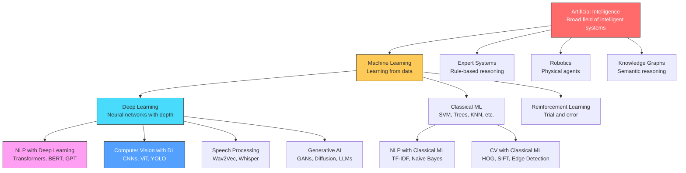
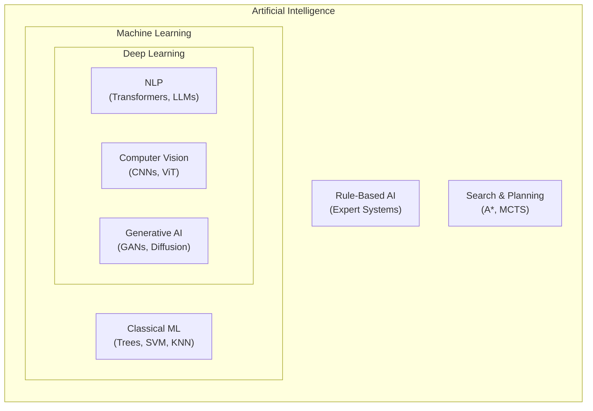

# AI vs Machine Learning vs Deep Learning vs NLP vs Computer Vision
## The Complete Hierarchy, Relationships & Decision Guide

```
╔══════════════════════════════════════════════════════════════════════════════════════╗
║          AI vs ML vs DL vs NLP vs CV — COMPLETE COMPARISON GUIDE                    ║
║              Understanding What Each Domain Solves & When To Use It                  ║
╚══════════════════════════════════════════════════════════════════════════════════════╝
```

---

## 1. THE HIERARCHY — How These Domains Relate

```
┌─────────────────────────────────────────────────────────────────────────────────────┐
│                                                                                      │
│                    ARTIFICIAL INTELLIGENCE (AI)                                       │
│          "Any system that exhibits intelligent behavior"                              │
│                                                                                      │
│    ┌─────────────────────────────────────────────────────────────────────────┐       │
│    │                                                                          │       │
│    │              MACHINE LEARNING (ML)                                        │       │
│    │      "Systems that learn from data without explicit programming"         │       │
│    │                                                                          │       │
│    │    ┌─────────────────────────────────────────────────────────────┐       │       │
│    │    │                                                              │       │       │
│    │    │            DEEP LEARNING (DL)                                │       │       │
│    │    │    "ML using multi-layered neural networks"                  │       │       │
│    │    │                                                              │       │       │
│    │    │    ┌──────────────────┐    ┌──────────────────┐             │       │       │
│    │    │    │       NLP        │    │  Computer Vision │             │       │       │
│    │    │    │  "Understanding  │    │  "Understanding  │             │       │       │
│    │    │    │   language"      │    │   images/video"  │             │       │       │
│    │    │    └──────────────────┘    └──────────────────┘             │       │       │
│    │    │                                                              │       │       │
│    │    └─────────────────────────────────────────────────────────────┘       │       │
│    │                                                                          │       │
│    └─────────────────────────────────────────────────────────────────────────┘       │
│                                                                                      │
│    ┌───────────────────────┐  ┌──────────────────┐  ┌──────────────────────┐        │
│    │ Expert Systems        │  │ Robotics          │  │ Knowledge Graphs     │        │
│    │ (Rule-based AI)       │  │ (Physical AI)     │  │ (Semantic AI)        │        │
│    └───────────────────────┘  └──────────────────┘  └──────────────────────┘        │
│                                                                                      │
└─────────────────────────────────────────────────────────────────────────────────────┘
```

### Key Insight: Containment vs Application
- **AI** contains **ML** contains **DL** (nested hierarchy)
- **NLP** and **Computer Vision** are APPLICATION DOMAINS that USE techniques from ML/DL
- NLP and CV can also use non-DL ML techniques (e.g., TF-IDF + SVM for text, HOG + SVM for images)

---

## 2. ONE-LINE DEFINITIONS

| Domain | What It Solves | Core Question |
|--------|---------------|---------------|
| **AI** | Making machines exhibit intelligent behavior | "Can a machine think/act rationally?" |
| **ML** | Learning patterns from data to make predictions | "Can a machine learn from experience?" |
| **DL** | Learning complex hierarchical representations | "Can a machine learn features automatically?" |
| **NLP** | Understanding and generating human language | "Can a machine understand what I say/write?" |
| **CV** | Understanding and interpreting visual information | "Can a machine see and understand images?" |

---

## 3. RELATIONSHIP DIAGRAM (Mermaid)



---

## 4. WHAT EACH DOMAIN IS SOLVING — AT A GLANCE

```
┌─────────────────────────────────────────────────────────────────────────────────────┐
│                        WHAT EACH DOMAIN IS SOLVING                                    │
├─────────────────────────────────────────────────────────────────────────────────────┤
│                                                                                      │
│  ┌─── AI ───────────────────────────────────────────────────────────────────────┐   │
│  │ PROBLEM: Make machines that can reason, plan, learn, perceive, and act        │   │
│  │ SCOPE:   Broadest — includes everything below                                 │   │
│  │ EXAMPLE: Self-driving car (perception + planning + control + learning)        │   │
│  └───────────────────────────────────────────────────────────────────────────────┘   │
│                                                                                      │
│  ┌─── ML ───────────────────────────────────────────────────────────────────────┐   │
│  │ PROBLEM: Find patterns in data and make predictions WITHOUT explicit rules    │   │
│  │ SCOPE:   Subset of AI — learning from data                                    │   │
│  │ EXAMPLE: Predict house prices from features (sq ft, bedrooms, location)       │   │
│  └───────────────────────────────────────────────────────────────────────────────┘   │
│                                                                                      │
│  ┌─── DL ───────────────────────────────────────────────────────────────────────┐   │
│  │ PROBLEM: Automatically learn hierarchical features from raw data              │   │
│  │ SCOPE:   Subset of ML — uses multi-layer neural networks                      │   │
│  │ EXAMPLE: Detect cancer from raw X-ray pixels (no manual feature engineering)  │   │
│  └───────────────────────────────────────────────────────────────────────────────┘   │
│                                                                                      │
│  ┌─── NLP ──────────────────────────────────────────────────────────────────────┐   │
│  │ PROBLEM: Enable machines to understand, interpret, and generate language      │   │
│  │ SCOPE:   Application domain — crosses ML and DL boundaries                    │   │
│  │ EXAMPLE: ChatGPT understanding your question and generating a coherent reply  │   │
│  └───────────────────────────────────────────────────────────────────────────────┘   │
│                                                                                      │
│  ┌─── CV ───────────────────────────────────────────────────────────────────────┐   │
│  │ PROBLEM: Enable machines to interpret and understand visual information        │   │
│  │ SCOPE:   Application domain — crosses ML and DL boundaries                    │   │
│  │ EXAMPLE: Tesla Autopilot detecting pedestrians, lanes, and traffic signs      │   │
│  └───────────────────────────────────────────────────────────────────────────────┘   │
│                                                                                      │
└─────────────────────────────────────────────────────────────────────────────────────┘
```

---

## 5. EVOLUTION TIMELINE

```
┌─────────────────────────────────────────────────────────────────────────────────────┐
│                            EVOLUTION TIMELINE                                         │
├─────────────────────────────────────────────────────────────────────────────────────┤
│                                                                                      │
│  1950s ────── AI Born (Turing Test, Dartmouth Conference)                            │
│     │                                                                                │
│  1960s ────── Expert Systems, Symbolic AI, ELIZA (early NLP)                        │
│     │                                                                                │
│  1970s ────── AI Winter #1, Knowledge-based systems                                 │
│     │                                                                                │
│  1980s ────── ML emerges (Decision Trees, Backpropagation invented)                 │
│     │         Early CV (Edge detection, Hough Transform)                             │
│     │                                                                                │
│  1990s ────── SVMs, Random Forests, Statistical NLP                                 │
│     │         LeNet (first practical CNN for digits)                                  │
│     │                                                                                │
│  2000s ────── Kernel methods, Ensemble methods dominate                             │
│     │         SIFT/SURF for CV, N-gram models for NLP                                │
│     │                                                                                │
│  2012 ─────── AlexNet wins ImageNet → DEEP LEARNING REVOLUTION                     │
│     │                                                                                │
│  2014-16 ──── GANs, ResNets, Word2Vec, Attention mechanism                         │
│     │                                                                                │
│  2017 ─────── "Attention Is All You Need" → TRANSFORMER REVOLUTION                 │
│     │                                                                                │
│  2018-20 ──── BERT, GPT-2, ViT (Vision Transformer)                                │
│     │                                                                                │
│  2022-23 ──── ChatGPT, GPT-4, Stable Diffusion, SAM                                │
│     │                                                                                │
│  2024-25 ──── Multimodal AI, AI Agents, GPT-4o, Gemini                             │
│     │         (NLP + CV + Audio converging)                                          │
│                                                                                      │
└─────────────────────────────────────────────────────────────────────────────────────┘
```

---

## 6. COMPARISON TABLE — ALL 5 DOMAINS

| Dimension | AI | ML | DL | NLP | CV |
|-----------|----|----|-----|-----|-----|
| **Scope** | Broadest umbrella | Subset of AI | Subset of ML | Application domain | Application domain |
| **Core Idea** | Simulate intelligence | Learn from data | Learn hierarchical features | Understand language | Understand images |
| **Data Needed** | Varies (can be rule-based) | Structured/tabular preferred | Massive unstructured data | Text corpora | Image/video datasets |
| **Feature Engineering** | Manual or automated | Often manual | Automatic | Mix (classical=manual, DL=auto) | Mix (classical=manual, DL=auto) |
| **Compute Required** | Low to extreme | Low to moderate | High to extreme (GPUs) | High (for transformers) | High (for CNNs/ViTs) |
| **Interpretability** | High (rule-based) to Low | Medium (trees=high, SVM=low) | Low (black box) | Low (transformers) | Low (deep nets) |
| **Key Algorithms** | Search, Planning, Logic | SVM, Trees, KNN, Regression | CNN, RNN, Transformer, GAN | Transformer, BERT, GPT | CNN, YOLO, ViT, U-Net |
| **Output Type** | Decisions, actions, plans | Predictions, classifications | Complex representations | Text, intent, entities | Labels, boxes, segments |
| **When It Fails** | Wrong rules/knowledge | Not enough data/features | Not enough data/compute | Ambiguity, sarcasm, context | Occlusion, novel objects |
| **Industry Maturity** | Decades old | Very mature | Rapidly evolving | Exploding (LLM era) | Very mature + evolving |

---

## 7. THE "SUPERSET" MENTAL MODEL



---

## 8. KEY DISTINCTIONS THAT CONFUSE PEOPLE

### Confusion 1: "Is NLP part of DL?"
**Answer**: NO. NLP is an APPLICATION DOMAIN. It uses:
- Classical ML: Naive Bayes, SVM + TF-IDF (still used today)
- Deep Learning: BERT, GPT, T5 (dominates today)
- Rule-based AI: Regex patterns, grammar rules (legacy but still in production)

### Confusion 2: "Is Computer Vision the same as Deep Learning?"
**Answer**: NO. Computer Vision existed BEFORE deep learning:
- Classical CV: Edge detection (Canny), Feature matching (SIFT/SURF), Template matching
- ML-based CV: HOG + SVM for pedestrian detection
- DL-based CV: CNNs, YOLO, Vision Transformers (dominates today)

### Confusion 3: "Is Deep Learning always better than ML?"
**Answer**: NO. Use DL when:
- You have MASSIVE data (>100K samples)
- Data is unstructured (images, text, audio)
- Feature engineering is difficult

Use Classical ML when:
- Data is small (<10K samples)
- Data is structured/tabular
- Interpretability matters
- Compute is limited

### Confusion 4: "AI = Machine Learning?"
**Answer**: NO. AI includes:
- Rule-based expert systems (no learning from data)
- Search algorithms (A*, minimax)
- Planning systems (STRIPS, PDDL)
- Knowledge graphs
- Robotics control

ML is just ONE approach to achieving AI.

---

## 9. THE INPUT-OUTPUT PARADIGM

```
┌─────────────────────────────────────────────────────────────────────────────────────┐
│                    INPUT → PROCESSING → OUTPUT by Domain                              │
├─────────────────────────────────────────────────────────────────────────────────────┤
│                                                                                      │
│  AI:   [Any Input] ──→ [Reasoning/Planning/Learning] ──→ [Intelligent Decision]     │
│                                                                                      │
│  ML:   [Structured Data] ──→ [Statistical Learning] ──→ [Prediction/Class]          │
│                                                                                      │
│  DL:   [Raw Unstructured] ──→ [Multi-layer Neural Net] ──→ [Complex Output]         │
│                                                                                      │
│  NLP:  [Text/Speech] ──→ [Language Understanding] ──→ [Text/Intent/Entities]        │
│                                                                                      │
│  CV:   [Image/Video] ──→ [Visual Understanding] ──→ [Labels/Boxes/Segments]         │
│                                                                                      │
└─────────────────────────────────────────────────────────────────────────────────────┘
```

---

## 10. FILE INDEX — DETAILED DEEP DIVES

| File | Content | Lines |
|------|---------|-------|
| `01-Artificial-Intelligence.md` | AI fundamentals, types, approaches, history | ~500 |
| `02-Machine-Learning.md` | ML algorithms, workflows, evaluation | ~600 |
| `03-Deep-Learning.md` | Neural networks, architectures, training | ~600 |
| `04-Natural-Language-Processing.md` | NLP pipeline, tasks, models | ~600 |
| `05-Computer-Vision.md` | CV tasks, architectures, applications | ~600 |
| `06-Decision-Workflow-When-To-Use-What.md` | Decision trees for choosing the right approach | ~500 |
| `07-Real-World-Use-Cases.md` | Industry use cases mapped to domains | ~500 |

---

## 11. QUICK DECISION MATRIX

```
"I have a problem. Which domain do I need?"

┌──────────────────────────────────────────────────────────────────────────┐
│                                                                           │
│  Is your data TEXT?                                                        │
│    YES → NLP (go to 04-NLP.md)                                           │
│                                                                           │
│  Is your data IMAGES or VIDEO?                                            │
│    YES → Computer Vision (go to 05-CV.md)                                │
│                                                                           │
│  Is your data STRUCTURED/TABULAR?                                         │
│    YES → Machine Learning (go to 02-ML.md)                               │
│    Small data (<10K)? → Classical ML                                      │
│    Large data + complex? → Deep Learning (go to 03-DL.md)                │
│                                                                           │
│  Do you need REASONING or PLANNING?                                       │
│    YES → AI techniques (search, planning) (go to 01-AI.md)              │
│                                                                           │
│  Is it MULTIMODAL (text + images + audio)?                                │
│    YES → Modern AI / Foundation Models (GPT-4o, Gemini)                  │
│                                                                           │
└──────────────────────────────────────────────────────────────────────────┘
```

---

*Continue to individual files for deep dives into each domain →*
