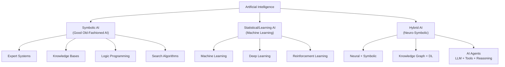
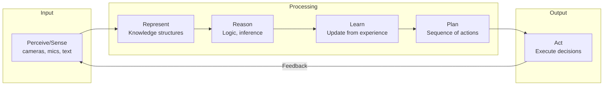
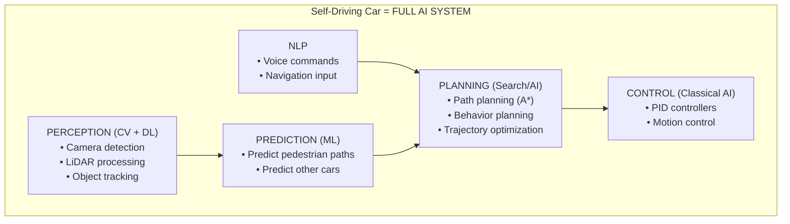

# Artificial Intelligence (AI) — Complete Deep Dive

```
╔══════════════════════════════════════════════════════════════════════════════════════╗
║                    ARTIFICIAL INTELLIGENCE — THE BROADEST UMBRELLA                    ║
║                  "Making machines that exhibit intelligent behavior"                   ║
╚══════════════════════════════════════════════════════════════════════════════════════╝
```

---

## 1. WHAT AI IS SOLVING

**Core Problem**: Can we create systems that perceive, reason, learn, plan, and act in ways that appear intelligent?

**Formal Definition**: AI is the science and engineering of making intelligent machines, especially intelligent computer programs. It is related to the similar task of using computers to understand human intelligence.
— John McCarthy (Father of AI, 1956)

---

## 2. TYPES OF AI — Classification by Capability

```
┌─────────────────────────────────────────────────────────────────────────────────────┐
│                         TYPES OF AI BY CAPABILITY                                     │
├─────────────────────────────────────────────────────────────────────────────────────┤
│                                                                                      │
│  ┌──────────────────────────────────────────────────────────────────────────────┐   │
│  │  TYPE 1: NARROW AI (ANI) — Artificial Narrow Intelligence                     │   │
│  │  ═══════════════════════════════════════════════════════════                   │   │
│  │  • What we have TODAY                                                          │   │
│  │  • Excels at ONE specific task                                                 │   │
│  │  • Cannot generalize to other tasks                                            │   │
│  │                                                                                │   │
│  │  Examples:                                                                     │   │
│  │  • Siri/Alexa (voice recognition only)                                        │   │
│  │  • Chess engines (play chess only)                                             │   │
│  │  • Spam filters (classify spam only)                                           │   │
│  │  • Self-driving cars (drive only)                                              │   │
│  │  • GPT-4 (language tasks only — despite appearing general)                    │   │
│  │                                                                                │   │
│  │  Status: ██████████████████████████████ ACHIEVED                              │   │
│  └──────────────────────────────────────────────────────────────────────────────┘   │
│                                                                                      │
│  ┌──────────────────────────────────────────────────────────────────────────────┐   │
│  │  TYPE 2: GENERAL AI (AGI) — Artificial General Intelligence                   │   │
│  │  ═══════════════════════════════════════════════════════════                   │   │
│  │  • Human-level intelligence across ALL domains                                 │   │
│  │  • Can transfer knowledge between tasks                                        │   │
│  │  • Can reason abstractly, plan, learn new skills                              │   │
│  │                                                                                │   │
│  │  Examples (hypothetical):                                                      │   │
│  │  • A machine that can learn to cook, write poetry, do physics, AND drive      │   │
│  │  • Like a human — good at many things without specific training               │   │
│  │                                                                                │   │
│  │  Status: ███░░░░░░░░░░░░░░░░░░░░░░░░░░ NOT YET (maybe 2030-2050?)           │   │
│  └──────────────────────────────────────────────────────────────────────────────┘   │
│                                                                                      │
│  ┌──────────────────────────────────────────────────────────────────────────────┐   │
│  │  TYPE 3: SUPER AI (ASI) — Artificial Super Intelligence                       │   │
│  │  ═══════════════════════════════════════════════════════════                   │   │
│  │  • Surpasses human intelligence in EVERY domain                                │   │
│  │  • Self-improving, self-aware                                                  │   │
│  │  • Can solve problems humans cannot even comprehend                            │   │
│  │                                                                                │   │
│  │  Status: ░░░░░░░░░░░░░░░░░░░░░░░░░░░░░ THEORETICAL                          │   │
│  └──────────────────────────────────────────────────────────────────────────────┘   │
│                                                                                      │
└─────────────────────────────────────────────────────────────────────────────────────┘
```

---

## 3. APPROACHES TO AI



---

## 4. THE SIX BRANCHES OF AI

```
┌─────────────────────────────────────────────────────────────────────────────────────┐
│                           SIX BRANCHES OF AI                                          │
├─────────────────────────────────────────────────────────────────────────────────────┤
│                                                                                      │
│  ┌─────────────────┐  ┌─────────────────┐  ┌─────────────────┐                     │
│  │ 1. PERCEPTION   │  │ 2. REASONING    │  │ 3. LEARNING     │                     │
│  │                  │  │                  │  │                  │                     │
│  │ • Computer Vision│  │ • Logic          │  │ • ML / DL        │                     │
│  │ • Speech Recog.  │  │ • Inference      │  │ • Transfer Learn.│                     │
│  │ • Sensor Fusion  │  │ • Deduction      │  │ • Few-shot       │                     │
│  │ • NLP (input)    │  │ • Abduction      │  │ • Self-supervised│                     │
│  └─────────────────┘  └─────────────────┘  └─────────────────┘                     │
│                                                                                      │
│  ┌─────────────────┐  ┌─────────────────┐  ┌─────────────────┐                     │
│  │ 4. PLANNING     │  │ 5. COMMUNICATION│  │ 6. ACTION       │                     │
│  │                  │  │                  │  │                  │                     │
│  │ • Path planning  │  │ • NLG            │  │ • Robotics       │                     │
│  │ • Task planning  │  │ • Dialogue       │  │ • Game playing   │                     │
│  │ • STRIPS/PDDL   │  │ • Translation    │  │ • Decision making│                     │
│  │ • MCTS           │  │ • Summarization  │  │ • Control systems│                     │
│  └─────────────────┘  └─────────────────┘  └─────────────────┘                     │
│                                                                                      │
└─────────────────────────────────────────────────────────────────────────────────────┘
```

---

## 5. AI WORKFLOW — How an AI System Works



---

## 6. AI TECHNIQUES — NOT Machine Learning

These are AI techniques that DON'T require learning from data:

### 6.1 Expert Systems
```
┌────────────────────────────────────────────────────────┐
│  EXPERT SYSTEM ARCHITECTURE                             │
├────────────────────────────────────────────────────────┤
│                                                         │
│  User Query → Inference Engine → Knowledge Base         │
│                     ↕                    ↕              │
│              Working Memory        Rule Base            │
│                                    (IF-THEN)           │
│                                                         │
│  Example: Medical Diagnosis Expert System               │
│  IF fever > 102°F AND cough AND fatigue                │
│  THEN suspect = "flu" WITH confidence 0.85             │
│                                                         │
│  Real Systems:                                          │
│  • MYCIN (bacterial infections, 1970s)                 │
│  • XCON (computer configuration, DEC)                   │
│  • Modern: Business rule engines (Drools)              │
└────────────────────────────────────────────────────────┘
```

### 6.2 Search Algorithms
```
┌────────────────────────────────────────────────────────┐
│  SEARCH-BASED AI                                        │
├────────────────────────────────────────────────────────┤
│                                                         │
│  • A* Algorithm — Pathfinding (Google Maps)            │
│  • Minimax — Game trees (Chess, Go)                    │
│  • Monte Carlo Tree Search — AlphaGo                   │
│  • Genetic Algorithms — Optimization                   │
│  • Simulated Annealing — Scheduling                    │
│                                                         │
│  Key Point: These DON'T learn from data.               │
│  They search through possible solutions intelligently. │
└────────────────────────────────────────────────────────┘
```

### 6.3 Knowledge Representation & Reasoning
```
┌────────────────────────────────────────────────────────┐
│  KNOWLEDGE-BASED AI                                     │
├────────────────────────────────────────────────────────┤
│                                                         │
│  • Ontologies (describing domain knowledge)            │
│  • Semantic Networks (concept relationships)           │
│  • First-Order Logic (formal reasoning)                │
│  • Knowledge Graphs (Google Knowledge Graph, Wikidata) │
│  • Bayesian Networks (probabilistic reasoning)         │
│                                                         │
│  Example: "Barack Obama" → born_in → "Hawaii"          │
│           "Hawaii" → part_of → "United States"         │
│           INFER: "Barack Obama" → born_in → "USA"      │
└────────────────────────────────────────────────────────┘
```

---

## 7. WHEN TO USE AI (vs just ML or DL)

```
┌─────────────────────────────────────────────────────────────────────────────────────┐
│                    WHEN YOU NEED "AI" (broader than just ML)                           │
├─────────────────────────────────────────────────────────────────────────────────────┤
│                                                                                      │
│  USE AI TECHNIQUES (rule-based, search, planning) WHEN:                              │
│                                                                                      │
│  ✓ Rules are KNOWN and EXPLICIT                                                      │
│    → Expert systems, business rules engines                                          │
│    → Example: Tax calculation, compliance checking                                   │
│                                                                                      │
│  ✓ Problem is SEARCH-based                                                           │
│    → Pathfinding, scheduling, optimization                                           │
│    → Example: Route planning, resource allocation                                    │
│                                                                                      │
│  ✓ Problem requires LOGICAL REASONING                                                │
│    → Theorem proving, constraint satisfaction                                        │
│    → Example: Scheduling with constraints, Sudoku solvers                            │
│                                                                                      │
│  ✓ Domain knowledge exists but DATA doesn't                                          │
│    → Expert codifies knowledge as rules                                              │
│    → Example: Rare disease diagnosis with <100 cases                                 │
│                                                                                      │
│  ✓ EXPLAINABILITY is critical                                                        │
│    → Rules can be traced and explained                                               │
│    → Example: Legal reasoning, medical decisions                                     │
│                                                                                      │
│  ✓ Problem needs MULTI-STEP PLANNING                                                 │
│    → Sequence of actions to reach a goal                                             │
│    → Example: Robot task planning, game playing                                      │
│                                                                                      │
│  DON'T USE rule-based AI when:                                                       │
│  ✗ Rules are too complex to specify (use ML instead)                                 │
│  ✗ Patterns are hidden in data (use ML instead)                                      │
│  ✗ Domain changes frequently (use ML to adapt)                                       │
│                                                                                      │
└─────────────────────────────────────────────────────────────────────────────────────┘
```

---

## 8. REAL-WORLD AI SYSTEMS (Using Multiple Approaches)



```
┌─────────────────────────────────────────────────────────────────────────────────────┐
│  REAL AI SYSTEMS — THEY USE EVERYTHING                                               │
├─────────────────────────────────────────────────────────────────────────────────────┤
│                                                                                      │
│  System              │ AI      │ ML    │ DL    │ NLP   │ CV                          │
│  ════════════════════│═════════│═══════│═══════│═══════│═══════                      │
│  Self-driving Car    │ ✓ Plan  │ ✓     │ ✓     │ ✓     │ ✓✓✓                        │
│  Virtual Assistant   │ ✓ Dialog│ ✓     │ ✓     │ ✓✓✓   │ ✗                          │
│  Recommendation Sys  │ ✗       │ ✓✓✓   │ ✓     │ ✓     │ ✗                          │
│  Medical Diagnosis   │ ✓ Rules │ ✓     │ ✓✓✓   │ ✓     │ ✓✓                         │
│  Game AI (Chess)     │ ✓✓✓    │ ✓     │ ✓     │ ✗     │ ✗                          │
│  Fraud Detection     │ ✓ Rules │ ✓✓✓   │ ✓     │ ✗     │ ✗                          │
│  AI Agent (GPT+Tools)│ ✓✓✓    │ ✓     │ ✓✓✓   │ ✓✓✓   │ ✓                          │
│                                                                                      │
└─────────────────────────────────────────────────────────────────────────────────────┘
```

---

## 9. MODERN AI — THE CONVERGENCE

```
┌─────────────────────────────────────────────────────────────────────────────────────┐
│                      MODERN AI (2023-2025)                                            │
│                    Everything is converging                                            │
├─────────────────────────────────────────────────────────────────────────────────────┤
│                                                                                      │
│  Foundation Models (GPT-4, Gemini, Claude):                                          │
│  • NLP ✓ (understand and generate text)                                              │
│  • CV ✓ (understand images)                                                          │
│  • Audio ✓ (understand speech)                                                       │
│  • Reasoning ✓ (chain-of-thought)                                                    │
│  • Planning ✓ (multi-step tool use)                                                  │
│  • Code ✓ (generate and execute code)                                                │
│                                                                                      │
│  AI Agents = LLM + Tools + Memory + Planning                                         │
│  ═══════════════════════════════════════════                                          │
│  • LLM provides reasoning (DL/NLP)                                                   │
│  • Tools provide actions (classical AI)                                               │
│  • Memory provides context (knowledge representation)                                 │
│  • Planning provides goal-directed behavior (search/planning)                         │
│                                                                                      │
│  THIS IS WHY "AI" IS THE CORRECT UMBRELLA TERM                                       │
│  Modern systems combine ALL sub-fields                                                │
│                                                                                      │
└─────────────────────────────────────────────────────────────────────────────────────┘
```

---

## 10. KEY TAKEAWAYS

1. **AI is NOT synonymous with ML/DL** — it includes rule-based systems, search, planning
2. **We only have Narrow AI today** — even GPT-4 is narrow (it can't drive a car)
3. **Modern AI systems combine multiple approaches** — ML + rules + search + planning
4. **The trend is convergence** — Foundation models are merging NLP, CV, reasoning into one
5. **AI Agents represent the latest evolution** — combining LLMs with tools and planning

---

*Next: [02-Machine-Learning.md](./02-Machine-Learning.md) — Deep dive into ML →*
