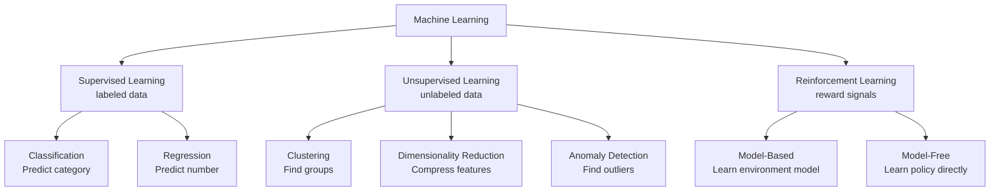
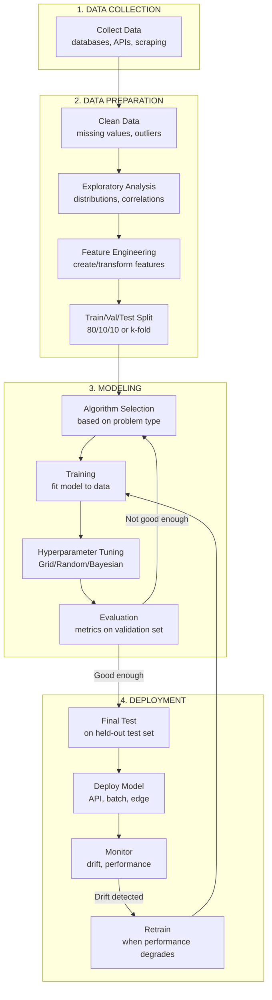

# Machine Learning (ML) — Complete Deep Dive

```
╔══════════════════════════════════════════════════════════════════════════════════════╗
║                    MACHINE LEARNING — LEARNING FROM DATA                              ║
║          "Systems that improve their performance with experience (data)"              ║
╚══════════════════════════════════════════════════════════════════════════════════════╝
```

---

## 1. WHAT ML IS SOLVING

**Core Problem**: Can a system automatically learn patterns from data and make predictions WITHOUT being explicitly programmed with rules?

**Formal Definition**: "A computer program is said to learn from experience E with respect to some class of tasks T and performance measure P, if its performance at tasks in T, as measured by P, improves with experience E."
— Tom Mitchell (1997)

```
Traditional Programming:    DATA + RULES  → ANSWERS
Machine Learning:           DATA + ANSWERS → RULES (model)
```

---

## 2. THE THREE PARADIGMS OF ML



---

## 3. SUPERVISED LEARNING — IN DEPTH

```
┌─────────────────────────────────────────────────────────────────────────────────────┐
│                    SUPERVISED LEARNING WORKFLOW                                        │
├─────────────────────────────────────────────────────────────────────────────────────┤
│                                                                                      │
│  Input: Labeled dataset {(x₁,y₁), (x₂,y₂), ..., (xₙ,yₙ)}                         │
│  Goal:  Learn mapping f: X → Y                                                      │
│                                                                                      │
│  ┌──────────┐    ┌──────────────┐    ┌────────────┐    ┌──────────────┐            │
│  │ Raw Data │───▶│   Feature    │───▶│   Model    │───▶│  Prediction  │            │
│  │ (X, Y)   │    │ Engineering  │    │  Training  │    │  on new data │            │
│  └──────────┘    └──────────────┘    └────────────┘    └──────────────┘            │
│                         │                    │                                        │
│                         ▼                    ▼                                        │
│               ┌────────────────┐   ┌────────────────┐                               │
│               │ Feature Vector │   │   Loss: How    │                               │
│               │ [age, income,  │   │   wrong are    │                               │
│               │  location...]  │   │   predictions? │                               │
│               └────────────────┘   └────────────────┘                               │
│                                                                                      │
│  CLASSIFICATION ALGORITHMS:          REGRESSION ALGORITHMS:                          │
│  • Logistic Regression               • Linear Regression                             │
│  • Decision Trees                    • Polynomial Regression                         │
│  • Random Forest                     • Ridge / Lasso                                 │
│  • SVM (Support Vector Machine)      • Elastic Net                                   │
│  • KNN (K-Nearest Neighbors)         • Gradient Boosted Regression                   │
│  • Naive Bayes                       • SVR (Support Vector Regression)               │
│  • Gradient Boosting (XGBoost)       • Random Forest Regressor                       │
│                                                                                      │
└─────────────────────────────────────────────────────────────────────────────────────┘
```

### Real Use Cases — Supervised Learning

| Task | Algorithm | Industry | Example |
|------|-----------|----------|---------|
| Spam Detection | Naive Bayes / LogReg | Email | Gmail classifying spam |
| Credit Scoring | XGBoost / Random Forest | Finance | Approve/deny loan |
| Disease Prediction | Random Forest / SVM | Healthcare | Predict diabetes risk |
| Price Prediction | Linear/Gradient Boosting | Real Estate | Zillow Zestimate |
| Churn Prediction | XGBoost / LogReg | Telecom | Predict customer leaving |
| Fraud Detection | Ensemble methods | Banking | Flag suspicious transactions |

---

## 4. UNSUPERVISED LEARNING — IN DEPTH

```
┌─────────────────────────────────────────────────────────────────────────────────────┐
│                    UNSUPERVISED LEARNING WORKFLOW                                      │
├─────────────────────────────────────────────────────────────────────────────────────┤
│                                                                                      │
│  Input: Unlabeled dataset {x₁, x₂, ..., xₙ} — NO labels!                          │
│  Goal:  Discover hidden structure in data                                            │
│                                                                                      │
│  ┌──────────┐    ┌──────────────┐    ┌────────────────────┐                         │
│  │ Raw Data │───▶│   Feature    │───▶│  Find Structure    │                         │
│  │ (X only) │    │ Engineering  │    │  (clusters, dims)  │                         │
│  └──────────┘    └──────────────┘    └────────────────────┘                         │
│                                              │                                        │
│                                              ▼                                        │
│                              ┌────────────────────────────┐                          │
│                              │  Discovered Patterns:       │                          │
│                              │  • Clusters (customer segs) │                          │
│                              │  • Reduced dimensions       │                          │
│                              │  • Anomalies                │                          │
│                              │  • Association rules        │                          │
│                              └────────────────────────────┘                          │
│                                                                                      │
│  CLUSTERING:                   DIMENSIONALITY REDUCTION:                              │
│  • K-Means                     • PCA (Principal Component Analysis)                  │
│  • DBSCAN                      • t-SNE                                               │
│  • Hierarchical                • UMAP                                                │
│  • Gaussian Mixture            • Autoencoders                                        │
│                                                                                      │
│  ANOMALY DETECTION:            ASSOCIATION RULES:                                     │
│  • Isolation Forest            • Apriori                                             │
│  • One-Class SVM               • FP-Growth                                           │
│  • Local Outlier Factor        • Market basket analysis                              │
│                                                                                      │
└─────────────────────────────────────────────────────────────────────────────────────┘
```

### Real Use Cases — Unsupervised Learning

| Task | Algorithm | Industry | Example |
|------|-----------|----------|---------|
| Customer Segmentation | K-Means | Marketing | Group customers by behavior |
| Anomaly Detection | Isolation Forest | Cybersecurity | Detect intrusions |
| Topic Discovery | LDA / NMF | Media | Find topics in news articles |
| Recommendation Pre-proc | PCA / Autoencoders | E-commerce | Reduce feature space |
| Gene Clustering | Hierarchical | Biotech | Group similar genes |
| Fraud (unsupervised) | DBSCAN | Insurance | Find unusual claim patterns |

---

## 5. REINFORCEMENT LEARNING — IN DEPTH

```
┌─────────────────────────────────────────────────────────────────────────────────────┐
│                    REINFORCEMENT LEARNING WORKFLOW                                     │
├─────────────────────────────────────────────────────────────────────────────────────┤
│                                                                                      │
│  Input: Environment + Reward signal (no labeled data!)                               │
│  Goal:  Learn optimal policy (actions) to maximize cumulative reward                 │
│                                                                                      │
│       ┌───────────────────────────────────────────────────────┐                     │
│       │                                                        │                     │
│       ▼                                                        │                     │
│  ┌─────────┐    Action    ┌──────────────┐    Reward          │                     │
│  │  AGENT  │─────────────▶│ ENVIRONMENT  │────────────────────┘                     │
│  │         │◀─────────────│              │                                           │
│  │ (Policy)│   New State  │  (World)     │                                           │
│  └─────────┘              └──────────────┘                                           │
│                                                                                      │
│  Key Concepts:                                                                       │
│  • State (s): Current situation                                                      │
│  • Action (a): What agent does                                                       │
│  • Reward (r): Feedback signal                                                       │
│  • Policy (π): Strategy — which action in which state                               │
│  • Value Function: Expected future reward                                            │
│                                                                                      │
│  ALGORITHMS:                                                                         │
│  • Q-Learning / DQN (Deep Q-Network)                                                │
│  • Policy Gradient (REINFORCE)                                                       │
│  • Actor-Critic (A2C, A3C)                                                           │
│  • PPO (Proximal Policy Optimization) ← used for RLHF in ChatGPT                   │
│  • SAC (Soft Actor-Critic)                                                           │
│                                                                                      │
└─────────────────────────────────────────────────────────────────────────────────────┘
```

### Real Use Cases — Reinforcement Learning

| Task | Algorithm | Industry | Example |
|------|-----------|----------|---------|
| Game Playing | DQN / AlphaZero | Gaming | AlphaGo, Atari games |
| Robotics Control | PPO / SAC | Manufacturing | Robot arm manipulation |
| LLM Alignment | PPO (RLHF) | AI | ChatGPT alignment |
| Trading | DQN variants | Finance | Algorithmic trading |
| Resource Management | Multi-agent RL | Cloud | Auto-scaling servers |
| Ad Placement | Contextual Bandits | Marketing | Which ad to show |

---

## 6. THE COMPLETE ML PIPELINE



---

## 7. ALGORITHM SELECTION GUIDE

```
┌─────────────────────────────────────────────────────────────────────────────────────┐
│                  WHICH ML ALGORITHM TO USE?                                            │
├─────────────────────────────────────────────────────────────────────────────────────┤
│                                                                                      │
│  START HERE: What's your problem type?                                               │
│                                                                                      │
│  ├── CLASSIFICATION (predict a category)?                                            │
│  │   ├── Binary (2 classes)?                                                         │
│  │   │   ├── Need interpretability? → Logistic Regression / Decision Tree           │
│  │   │   ├── High accuracy needed? → XGBoost / Random Forest                        │
│  │   │   ├── Small dataset (<1K)? → SVM / KNN                                       │
│  │   │   └── Text data? → Naive Bayes / Logistic Regression                         │
│  │   └── Multi-class (>2 classes)?                                                   │
│  │       ├── Need speed? → Naive Bayes / Logistic Regression (OvR)                  │
│  │       └── Need accuracy? → Random Forest / XGBoost                               │
│  │                                                                                   │
│  ├── REGRESSION (predict a number)?                                                  │
│  │   ├── Linear relationship? → Linear / Ridge / Lasso Regression                   │
│  │   ├── Non-linear? → Random Forest / XGBoost / SVR                                │
│  │   ├── Many features? → Lasso (L1) / Elastic Net                                  │
│  │   └── Need uncertainty? → Bayesian Regression / Gaussian Process                 │
│  │                                                                                   │
│  ├── CLUSTERING (find groups)?                                                       │
│  │   ├── Know # clusters? → K-Means                                                 │
│  │   ├── Unknown shape/noise? → DBSCAN                                              │
│  │   ├── Hierarchical groups? → Agglomerative Clustering                            │
│  │   └── Soft assignments? → Gaussian Mixture Models                                │
│  │                                                                                   │
│  └── ANOMALY DETECTION?                                                              │
│      ├── High-dimensional? → Isolation Forest                                        │
│      ├── Known normal data? → One-Class SVM                                          │
│      └── Local outliers? → LOF (Local Outlier Factor)                                │
│                                                                                      │
└─────────────────────────────────────────────────────────────────────────────────────┘
```

---

## 8. ML EVALUATION METRICS

```
┌─────────────────────────────────────────────────────────────────────────────────────┐
│                    EVALUATION METRICS BY TASK                                          │
├─────────────────────────────────────────────────────────────────────────────────────┤
│                                                                                      │
│  CLASSIFICATION:                                                                     │
│  ┌─────────────────────────────────────────────────────────────────┐                │
│  │ Metric      │ When to Use                     │ Formula          │                │
│  │─────────────│─────────────────────────────────│──────────────────│                │
│  │ Accuracy    │ Balanced classes                 │ (TP+TN)/Total   │                │
│  │ Precision   │ False positives costly (spam)   │ TP/(TP+FP)      │                │
│  │ Recall      │ False negatives costly (cancer) │ TP/(TP+FN)      │                │
│  │ F1-Score    │ Balance precision & recall       │ 2*P*R/(P+R)     │                │
│  │ AUC-ROC    │ Ranking quality                  │ Area under curve │                │
│  │ Log Loss    │ Probability calibration          │ -log(predicted) │                │
│  └─────────────────────────────────────────────────────────────────┘                │
│                                                                                      │
│  REGRESSION:                                                                         │
│  ┌─────────────────────────────────────────────────────────────────┐                │
│  │ Metric   │ When to Use                        │ Interpretation   │                │
│  │──────────│────────────────────────────────────│──────────────────│                │
│  │ MSE      │ Penalize large errors heavily      │ Lower = better   │                │
│  │ RMSE     │ Same scale as target               │ Lower = better   │                │
│  │ MAE      │ Robust to outliers                 │ Lower = better   │                │
│  │ R²       │ Proportion of variance explained   │ 1 = perfect      │                │
│  │ MAPE     │ Percentage error                   │ Lower = better   │                │
│  └─────────────────────────────────────────────────────────────────┘                │
│                                                                                      │
│  CLUSTERING:                                                                         │
│  • Silhouette Score (internal)                                                       │
│  • Adjusted Rand Index (external, if labels exist)                                   │
│  • Davies-Bouldin Index (lower = better)                                             │
│                                                                                      │
└─────────────────────────────────────────────────────────────────────────────────────┘
```

---

## 9. BIAS-VARIANCE TRADEOFF

```
┌─────────────────────────────────────────────────────────────────────────────────────┐
│                    BIAS-VARIANCE TRADEOFF                                              │
├─────────────────────────────────────────────────────────────────────────────────────┤
│                                                                                      │
│  Total Error = Bias² + Variance + Irreducible Noise                                  │
│                                                                                      │
│  HIGH BIAS (Underfitting)        │  HIGH VARIANCE (Overfitting)                     │
│  ─────────────────────────       │  ──────────────────────────                      │
│  • Model too simple              │  • Model too complex                              │
│  • Misses real patterns          │  • Learns noise in training data                  │
│  • Bad on BOTH train & test      │  • Great on train, BAD on test                    │
│  • Example: Linear model on      │  • Example: Deep tree on small data               │
│    non-linear data               │                                                   │
│                                   │                                                   │
│  Fix: More complex model         │  Fix: More data, regularization,                  │
│       More features              │       simpler model, dropout                       │
│       Less regularization        │       early stopping                               │
│                                                                                      │
│  Error                                                                               │
│  ▲                                                                                   │
│  │  \                    /  ← Test Error                                             │
│  │   \                  /                                                            │
│  │    \     ╭──────╮  /                                                              │
│  │     \   /        \/   ← Sweet spot                                                │
│  │      ╲/                                                                           │
│  │       \______________ ← Train Error                                               │
│  │                                                                                   │
│  └──────────────────────────▶ Model Complexity                                       │
│  Simple                            Complex                                            │
│                                                                                      │
└─────────────────────────────────────────────────────────────────────────────────────┘
```

---

## 10. WHEN TO USE ML (vs DL or Rule-Based AI)

```
┌─────────────────────────────────────────────────────────────────────────────────────┐
│                    USE CLASSICAL ML WHEN:                                              │
├─────────────────────────────────────────────────────────────────────────────────────┤
│                                                                                      │
│  ✓ Data is STRUCTURED/TABULAR                                                        │
│    → Excel-like data with rows and columns                                           │
│    → Example: Customer data, financial records, sensor logs                          │
│                                                                                      │
│  ✓ Dataset is SMALL to MEDIUM (100 - 100K samples)                                   │
│    → Not enough data for deep learning to shine                                      │
│    → XGBoost often wins on <100K tabular rows                                        │
│                                                                                      │
│  ✓ INTERPRETABILITY matters                                                          │
│    → Need to explain WHY a prediction was made                                       │
│    → Regulated industries (finance, healthcare)                                      │
│    → Decision trees, logistic regression are interpretable                           │
│                                                                                      │
│  ✓ COMPUTE is LIMITED                                                                │
│    → No GPUs available                                                               │
│    → Need fast training (minutes, not hours)                                         │
│    → Edge devices with limited power                                                 │
│                                                                                      │
│  ✓ Features are WELL-DEFINED                                                         │
│    → Domain experts can define what matters                                          │
│    → Feature engineering is feasible                                                 │
│                                                                                      │
│  ✓ LATENCY requirements are strict                                                   │
│    → Model must predict in <1ms                                                      │
│    → Simple models are faster                                                        │
│                                                                                      │
│  ════════════════════════════════════════════════                                     │
│  DON'T USE classical ML when:                                                        │
│  ✗ Data is unstructured (images, text, audio) → use DL                              │
│  ✗ You have millions of samples + GPU → DL may outperform                           │
│  ✗ Feature engineering is too complex → DL learns features                           │
│  ✗ You need to generate content → use DL (GANs, LLMs)                               │
│                                                                                      │
└─────────────────────────────────────────────────────────────────────────────────────┘
```

---

## 11. ML vs DL — THE DEFINITIVE COMPARISON

```
┌─────────────────────────────────────────────────────────────────────────────────────┐
│                    ML vs DL — WHEN TO USE WHICH                                       │
├─────────────────────────────────────────────────────────────────────────────────────┤
│                                                                                      │
│  Dimension           │ Classical ML              │ Deep Learning                     │
│  ════════════════════│═══════════════════════════│═══════════════════════════════    │
│  Data Size           │ Works with small data     │ Needs large data (>100K)          │
│  Data Type           │ Tabular/Structured        │ Images/Text/Audio/Video           │
│  Feature Engineering │ Manual (YOU design)       │ Automatic (model learns)          │
│  Compute             │ CPU sufficient            │ GPU/TPU required                  │
│  Training Time       │ Minutes to hours          │ Hours to weeks                    │
│  Interpretability    │ Often interpretable       │ Usually black-box                 │
│  Performance/Tabular │ Often BETTER (XGBoost)    │ Often worse on tabular            │
│  Performance/Images  │ Mediocre                  │ Dominates                         │
│  Performance/Text    │ Decent (TF-IDF+SVM)       │ Dominates (Transformers)          │
│  Cost                │ Low                       │ High (GPUs, cloud)                │
│  Deployment Size     │ Small (KB-MB)             │ Large (MB-GB)                     │
│                                                                                      │
│  ═══ PRACTICAL RULE OF THUMB ═══                                                     │
│  Tabular data? → START with XGBoost/Random Forest                                    │
│  Images/Video? → Use CNNs / Vision Transformers                                      │
│  Text/Language? → Use Transformers (BERT, GPT)                                       │
│  Small dataset? → Classical ML (or few-shot with LLMs)                               │
│                                                                                      │
└─────────────────────────────────────────────────────────────────────────────────────┘
```

---

## 12. KEY TAKEAWAYS

1. **ML = learning patterns from data** — the core idea that distinguishes it from rule-based AI
2. **Three paradigms**: Supervised (labels), Unsupervised (no labels), Reinforcement (rewards)
3. **XGBoost/Random Forest dominate tabular data** — DL is NOT always better
4. **Feature engineering is critical** in classical ML — this is where domain expertise matters
5. **Evaluation metrics must match the business problem** — accuracy alone is often misleading
6. **The ML pipeline is iterative** — you cycle through data prep → modeling → evaluation

---

*Next: [03-Deep-Learning.md](./03-Deep-Learning.md) — Deep dive into Deep Learning →*
