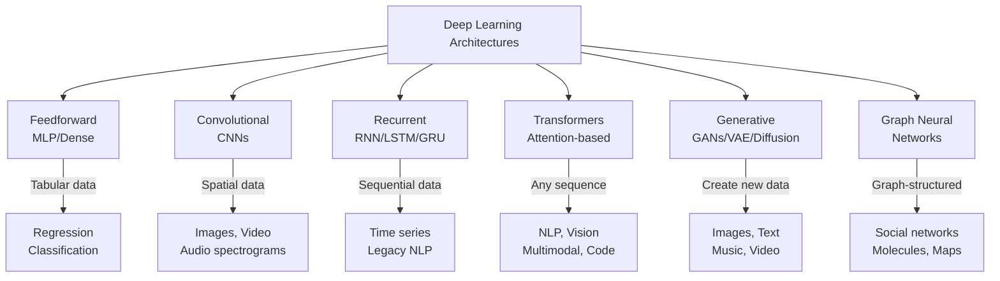
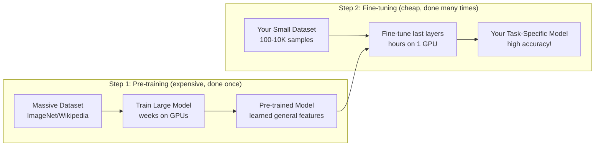

# Deep Learning (DL) — Complete Deep Dive

```
╔══════════════════════════════════════════════════════════════════════════════════════╗
║                    DEEP LEARNING — NEURAL NETWORKS WITH DEPTH                         ║
║        "Automatically learning hierarchical representations from raw data"            ║
╚══════════════════════════════════════════════════════════════════════════════════════╝
```

---

## 1. WHAT DL IS SOLVING

**Core Problem**: Can we eliminate manual feature engineering and let the model automatically discover the right representations from raw data?

**Key Insight**: Deep learning learns HIERARCHICAL features:
- Layer 1: Edges, textures (low-level)
- Layer 2: Shapes, parts (mid-level)  
- Layer 3: Objects, concepts (high-level)

```
Classical ML:  Raw Data → [MANUAL Feature Engineering] → Model → Prediction
Deep Learning: Raw Data → [AUTOMATIC Feature Learning via layers] → Prediction
```

---

## 2. WHY "DEEP"?

```
┌─────────────────────────────────────────────────────────────────────────────────────┐
│                    WHY IS IT CALLED "DEEP" LEARNING?                                   │
├─────────────────────────────────────────────────────────────────────────────────────┤
│                                                                                      │
│  "Deep" = Multiple hidden layers (depth of the network)                              │
│                                                                                      │
│  SHALLOW NETWORK (1-2 hidden layers):                                                │
│  Input ──▶ [Hidden] ──▶ Output                                                      │
│                                                                                      │
│  DEEP NETWORK (many hidden layers):                                                  │
│  Input ──▶ [H1] ──▶ [H2] ──▶ [H3] ──▶ ... ──▶ [Hn] ──▶ Output                    │
│                                                                                      │
│  Example — Image Classification:                                                     │
│  ┌────────┐  ┌────────┐  ┌────────┐  ┌────────┐  ┌────────┐  ┌────────┐           │
│  │ Pixels │─▶│ Edges  │─▶│Textures│─▶│ Parts  │─▶│Objects │─▶│ "Cat"  │           │
│  │(raw)   │  │(layer1)│  │(layer2)│  │(layer3)│  │(layer4)│  │(output)│           │
│  └────────┘  └────────┘  └────────┘  └────────┘  └────────┘  └────────┘           │
│                                                                                      │
│  Modern deep networks: 12 layers (BERT) to 1000+ layers (GPT-4)                    │
│                                                                                      │
└─────────────────────────────────────────────────────────────────────────────────────┘
```

---

## 3. THE BUILDING BLOCKS

### 3.1 Neuron (Perceptron)

```
┌─────────────────────────────────────────────────────────────────────────────────────┐
│                    SINGLE NEURON                                                       │
├─────────────────────────────────────────────────────────────────────────────────────┤
│                                                                                      │
│  x₁ ──w₁──┐                                                                        │
│             │                                                                        │
│  x₂ ──w₂──├──▶ [Σ weighted sum + bias] ──▶ [Activation f()] ──▶ output             │
│             │                                                                        │
│  x₃ ──w₃──┘                                                                        │
│                                                                                      │
│  output = f(w₁x₁ + w₂x₂ + w₃x₃ + b)                                              │
│                                                                                      │
│  Activation Functions:                                                               │
│  • ReLU: f(x) = max(0, x)        ← Most common (hidden layers)                     │
│  • Sigmoid: f(x) = 1/(1+e⁻ˣ)    ← Binary output (0-1)                             │
│  • Tanh: f(x) = (eˣ-e⁻ˣ)/(eˣ+e⁻ˣ)  ← Output (-1 to 1)                           │
│  • Softmax: f(xᵢ) = eˣⁱ/Σeˣʲ    ← Multi-class probabilities                      │
│  • GELU: x·Φ(x)                  ← Used in Transformers                            │
│                                                                                      │
└─────────────────────────────────────────────────────────────────────────────────────┘
```

### 3.2 Training Process

```mermaid
flowchart TB
    subgraph "FORWARD PASS"
        INPUT[Input Data X] --> LAYERS[Pass through layers<br/>compute predictions]
        LAYERS --> PRED[Predictions ŷ]
    end
    
    subgraph "LOSS COMPUTATION"
        PRED --> LOSS[Compare ŷ vs y<br/>Loss = L(ŷ, y)]
        TRUE[True Labels y] --> LOSS
    end
    
    subgraph "BACKWARD PASS (Backpropagation)"
        LOSS --> GRAD[Compute gradients<br/>∂L/∂w for each weight]
    end
    
    subgraph "UPDATE WEIGHTS"
        GRAD --> UPDATE[w = w - lr × ∂L/∂w<br/>Optimizer: SGD/Adam]
    end
    
    UPDATE -->|Next batch| INPUT
```

---

## 4. DEEP LEARNING ARCHITECTURES



---

## 5. ARCHITECTURE DEEP DIVES

### 5.1 Convolutional Neural Networks (CNNs)

```
┌─────────────────────────────────────────────────────────────────────────────────────┐
│                    CNN ARCHITECTURE                                                    │
├─────────────────────────────────────────────────────────────────────────────────────┤
│                                                                                      │
│  ┌───────┐   ┌──────────┐   ┌──────┐   ┌──────────┐   ┌──────┐   ┌───────────┐   │
│  │ Input │──▶│   Conv   │──▶│ Pool │──▶│   Conv   │──▶│ Pool │──▶│  Flatten  │   │
│  │ Image │   │  + ReLU  │   │(Max) │   │  + ReLU  │   │(Max) │   │  + Dense  │   │
│  │224×224│   │ Features │   │Reduce│   │ Features │   │Reduce│   │  + Softmax│   │
│  └───────┘   └──────────┘   └──────┘   └──────────┘   └──────┘   └───────────┘   │
│                                                                                      │
│  What each layer learns:                                                             │
│  Conv1: Edges, gradients, colors                                                     │
│  Conv2: Textures, simple shapes                                                      │
│  Conv3: Parts of objects (wheels, eyes)                                              │
│  Conv4: Whole objects (car, face)                                                    │
│  Dense: Final classification                                                         │
│                                                                                      │
│  KEY INNOVATIONS IN CNN HISTORY:                                                     │
│  ┌──────────────────────────────────────────────────────────────────┐               │
│  │ Year │ Model       │ Depth │ Key Innovation                      │               │
│  │──────│─────────────│───────│─────────────────────────────────────│               │
│  │ 1998 │ LeNet-5     │   5   │ First practical CNN                 │               │
│  │ 2012 │ AlexNet     │   8   │ GPU training, ReLU, Dropout         │               │
│  │ 2014 │ VGGNet      │  19   │ Small 3×3 filters, deeper           │               │
│  │ 2014 │ GoogLeNet   │  22   │ Inception modules                   │               │
│  │ 2015 │ ResNet      │ 152   │ Skip connections (residual)         │               │
│  │ 2017 │ DenseNet    │ 201   │ Dense connections                   │               │
│  │ 2019 │ EfficientNet│  var  │ Compound scaling                    │               │
│  │ 2020 │ ViT         │  12+  │ Transformers replace CNNs!          │               │
│  └──────────────────────────────────────────────────────────────────┘               │
│                                                                                      │
│  Use CNNs for: Image classification, object detection, segmentation                  │
│  Being replaced by: Vision Transformers (ViT) for large-scale tasks                  │
│                                                                                      │
└─────────────────────────────────────────────────────────────────────────────────────┘
```

### 5.2 Recurrent Neural Networks (RNNs/LSTMs)

```
┌─────────────────────────────────────────────────────────────────────────────────────┐
│                    RNN / LSTM ARCHITECTURE                                             │
├─────────────────────────────────────────────────────────────────────────────────────┤
│                                                                                      │
│  RNN — Processes SEQUENCES one element at a time:                                    │
│                                                                                      │
│  x₁        x₂        x₃        x₄                                                  │
│   │         │         │         │                                                    │
│   ▼         ▼         ▼         ▼                                                    │
│  [h₁] ──▶ [h₂] ──▶ [h₃] ──▶ [h₄] ──▶ output                                      │
│   │         │         │         │                                                    │
│   ▼         ▼         ▼         ▼                                                    │
│  y₁        y₂        y₃        y₄                                                   │
│                                                                                      │
│  Problem: VANISHING GRADIENTS — can't remember long sequences                       │
│                                                                                      │
│  Solution: LSTM (Long Short-Term Memory)                                             │
│  ┌────────────────────────────────────────────┐                                     │
│  │  LSTM Cell:                                 │                                     │
│  │  • Forget gate: What to throw away          │                                     │
│  │  • Input gate: What new info to store       │                                     │
│  │  • Output gate: What to output              │                                     │
│  │  • Cell state: Long-term memory highway     │                                     │
│  └────────────────────────────────────────────┘                                     │
│                                                                                      │
│  Status: LARGELY REPLACED by Transformers (2017+)                                    │
│  Still used for: Small sequence tasks, edge devices, time series                     │
│                                                                                      │
└─────────────────────────────────────────────────────────────────────────────────────┘
```

### 5.3 Transformers (The Dominant Architecture)

```
┌─────────────────────────────────────────────────────────────────────────────────────┐
│                    TRANSFORMER ARCHITECTURE                                            │
│                    "Attention Is All You Need" (2017)                                  │
├─────────────────────────────────────────────────────────────────────────────────────┤
│                                                                                      │
│  KEY INNOVATION: Self-Attention — every token attends to every other token           │
│  Advantage over RNN: Parallelizable, captures long-range dependencies                │
│                                                                                      │
│  ┌─────────────────────────────────────────────────────────────────┐                │
│  │                TRANSFORMER BLOCK (repeated N times)              │                │
│  │                                                                  │                │
│  │  Input ──▶ [Multi-Head Self-Attention] ──▶ [Add & Norm]         │                │
│  │                                               │                  │                │
│  │                                               ▼                  │                │
│  │            [Feed-Forward Network] ──▶ [Add & Norm] ──▶ Output   │                │
│  │                                                                  │                │
│  └─────────────────────────────────────────────────────────────────┘                │
│                                                                                      │
│  Self-Attention Mechanism:                                                           │
│  ═════════════════════════                                                           │
│  For each token, compute:                                                            │
│  • Q (Query): "What am I looking for?"                                              │
│  • K (Key): "What do I contain?"                                                    │
│  • V (Value): "What information do I provide?"                                      │
│                                                                                      │
│  Attention(Q,K,V) = softmax(QK^T / √d_k) × V                                      │
│                                                                                      │
│  TRANSFORMER VARIANTS:                                                               │
│  ┌───────────────────────────────────────────────────────────────┐                  │
│  │ Type          │ Architecture      │ Use Case                  │                  │
│  │───────────────│───────────────────│───────────────────────────│                  │
│  │ Encoder-only  │ BERT, RoBERTa     │ Understanding (classify)  │                  │
│  │ Decoder-only  │ GPT, LLaMA, Claude│ Generation (text gen)     │                  │
│  │ Encoder-Decoder│ T5, BART         │ Seq2Seq (translate, sum)  │                  │
│  │ Vision        │ ViT, DeiT, Swin   │ Image classification      │                  │
│  │ Multimodal    │ GPT-4V, Gemini    │ Text + Image + Audio      │                  │
│  └───────────────────────────────────────────────────────────────┘                  │
│                                                                                      │
└─────────────────────────────────────────────────────────────────────────────────────┘
```

### 5.4 Generative Models

```
┌─────────────────────────────────────────────────────────────────────────────────────┐
│                    GENERATIVE DEEP LEARNING                                           │
├─────────────────────────────────────────────────────────────────────────────────────┤
│                                                                                      │
│  ┌─── GANs (Generative Adversarial Networks) ────────────────────────────────────┐  │
│  │                                                                                │  │
│  │  Random Noise ──▶ [GENERATOR] ──▶ Fake Image                                  │  │
│  │                                       │                                        │  │
│  │                                       ▼                                        │  │
│  │  Real Images ──────────────────▶ [DISCRIMINATOR] ──▶ Real or Fake?            │  │
│  │                                                                                │  │
│  │  Use: Face generation, style transfer, super-resolution                        │  │
│  └────────────────────────────────────────────────────────────────────────────────┘  │
│                                                                                      │
│  ┌─── VAEs (Variational Autoencoders) ───────────────────────────────────────────┐  │
│  │                                                                                │  │
│  │  Input ──▶ [ENCODER] ──▶ Latent Space (z) ──▶ [DECODER] ──▶ Reconstruction   │  │
│  │                              │                                                 │  │
│  │                    Sample from distribution                                    │  │
│  │                                                                                │  │
│  │  Use: Image generation, anomaly detection, drug discovery                      │  │
│  └────────────────────────────────────────────────────────────────────────────────┘  │
│                                                                                      │
│  ┌─── Diffusion Models ──────────────────────────────────────────────────────────┐  │
│  │                                                                                │  │
│  │  Forward: Image ──▶ Add noise ──▶ ... ──▶ Pure noise                          │  │
│  │  Reverse: Noise ──▶ Denoise ──▶ ... ──▶ Clean image                           │  │
│  │                                                                                │  │
│  │  Use: Stable Diffusion, DALL-E, Midjourney (state-of-the-art image gen)       │  │
│  └────────────────────────────────────────────────────────────────────────────────┘  │
│                                                                                      │
│  ┌─── LLMs (Large Language Models) ──────────────────────────────────────────────┐  │
│  │                                                                                │  │
│  │  Prompt ──▶ [Transformer Decoder] ──▶ Next token ──▶ Next token ──▶ ...       │  │
│  │                                                                                │  │
│  │  Use: GPT-4, Claude, LLaMA — text generation, reasoning, code                 │  │
│  └────────────────────────────────────────────────────────────────────────────────┘  │
│                                                                                      │
└─────────────────────────────────────────────────────────────────────────────────────┘
```

---

## 6. TRAINING DEEP NETWORKS — CHALLENGES & SOLUTIONS

```
┌─────────────────────────────────────────────────────────────────────────────────────┐
│                    DL TRAINING CHALLENGES                                              │
├─────────────────────────────────────────────────────────────────────────────────────┤
│                                                                                      │
│  Challenge              │ Solution                        │ Example                  │
│  ══════════════════════ │ ═══════════════════════════════ │ ════════════════════     │
│  Vanishing Gradients    │ ReLU, Skip connections, LSTM   │ ResNet                   │
│  Exploding Gradients    │ Gradient clipping, BatchNorm   │ Gradient norm = 1.0      │
│  Overfitting            │ Dropout, Data augment, Regularization│ Dropout p=0.5       │
│  Slow Convergence       │ Adam optimizer, LR scheduling  │ Cosine annealing         │
│  Computational Cost     │ Mixed precision (FP16), Distillation│ DistilBERT           │
│  Data Hungry            │ Transfer learning, Data augment│ ImageNet pretrained       │
│  Catastrophic Forgetting│ Elastic Weight Consolidation   │ Continual learning       │
│                                                                                      │
│  REGULARIZATION TECHNIQUES:                                                          │
│  • Dropout: Randomly zero out neurons (prevents co-adaptation)                       │
│  • Weight Decay (L2): Penalize large weights                                        │
│  • Batch Normalization: Normalize layer inputs                                       │
│  • Data Augmentation: Artificially expand training data                              │
│  • Early Stopping: Stop when validation loss increases                               │
│  • Label Smoothing: Soft targets instead of hard 0/1                                │
│                                                                                      │
└─────────────────────────────────────────────────────────────────────────────────────┘
```

---

## 7. TRANSFER LEARNING — THE GAME CHANGER



```
┌─────────────────────────────────────────────────────────────────────────────────────┐
│  TRANSFER LEARNING IN PRACTICE                                                        │
├─────────────────────────────────────────────────────────────────────────────────────┤
│                                                                                      │
│  For VISION:                                                                         │
│  • Pre-train on ImageNet (14M images) → Fine-tune on your 1K images                │
│  • Models: ResNet, EfficientNet, ViT                                                 │
│  • Accuracy boost: 60% → 95% with transfer learning                                │
│                                                                                      │
│  For NLP:                                                                            │
│  • Pre-train on internet text (BERT/GPT) → Fine-tune on your task                  │
│  • Models: BERT, RoBERTa, GPT, T5                                                   │
│  • This is WHY modern NLP works so well with small labeled datasets                 │
│                                                                                      │
│  For AUDIO:                                                                          │
│  • Pre-train: Wav2Vec 2.0 on unlabeled audio → Fine-tune for ASR                   │
│                                                                                      │
│  KEY INSIGHT: You almost NEVER train from scratch anymore.                           │
│  Always start with a pre-trained model and fine-tune.                                │
│                                                                                      │
└─────────────────────────────────────────────────────────────────────────────────────┘
```

---

## 8. COMPUTE REQUIREMENTS

```
┌─────────────────────────────────────────────────────────────────────────────────────┐
│                    DL COMPUTE LANDSCAPE                                                │
├─────────────────────────────────────────────────────────────────────────────────────┤
│                                                                                      │
│  Model              │ Parameters  │ Training Cost  │ Training Time │ Hardware         │
│  ═══════════════════│═════════════│════════════════│══════════════ │═══════════════   │
│  Small CNN          │ 1-10M       │ $10-100        │ Hours         │ 1 GPU            │
│  ResNet-50          │ 25M         │ $100-1K        │ 1-2 days      │ 4-8 GPUs         │
│  BERT-base          │ 110M        │ $10K           │ 4 days        │ 16 TPUs          │
│  GPT-2              │ 1.5B        │ $50K           │ 1 week        │ 256 GPUs         │
│  GPT-3              │ 175B        │ $4.6M          │ Months        │ 10,000 GPUs      │
│  GPT-4              │ ~1.8T(est.) │ $100M+         │ Months        │ 25,000+ GPUs     │
│  LLaMA-70B          │ 70B         │ $2M+           │ Weeks         │ 2,048 A100s      │
│                                                                                      │
│  For YOU (individual developer):                                                     │
│  • Fine-tuning BERT: 1 GPU, 1-4 hours, ~$5 on cloud                                │
│  • Fine-tuning ViT: 1 GPU, 2-8 hours, ~$10 on cloud                                │
│  • Fine-tuning LLaMA-7B (LoRA): 1 GPU, 2-4 hours, ~$10                             │
│  • Training from scratch: Usually NOT necessary                                      │
│                                                                                      │
└─────────────────────────────────────────────────────────────────────────────────────┘
```

---

## 9. WHEN TO USE DEEP LEARNING

```
┌─────────────────────────────────────────────────────────────────────────────────────┐
│                    USE DEEP LEARNING WHEN:                                             │
├─────────────────────────────────────────────────────────────────────────────────────┤
│                                                                                      │
│  ✓ Data is UNSTRUCTURED (images, text, audio, video)                                 │
│    → CNNs for images, Transformers for text, Wav2Vec for audio                       │
│                                                                                      │
│  ✓ You have LARGE datasets (>100K samples)                                           │
│    → DL gets better with more data (unlike classical ML which plateaus)              │
│                                                                                      │
│  ✓ Feature engineering is HARD or IMPOSSIBLE                                         │
│    → How do you manually describe "what a cat looks like" in numbers?                │
│    → Let the network learn features automatically                                    │
│                                                                                      │
│  ✓ You need to GENERATE content                                                      │
│    → Text (LLMs), Images (Diffusion/GANs), Code, Music                              │
│                                                                                      │
│  ✓ Problem has SPATIAL or SEQUENTIAL structure                                        │
│    → Images have spatial structure → CNNs                                            │
│    → Language has sequential structure → Transformers                                 │
│                                                                                      │
│  ✓ State-of-the-art performance is required                                          │
│    → DL dominates leaderboards for NLP, CV, Speech, Games                            │
│                                                                                      │
│  ✓ Transfer learning is available                                                     │
│    → Pre-trained models exist for your domain                                        │
│    → Even small datasets work with fine-tuning                                       │
│                                                                                      │
│  ═══════════════════════════════════════════════                                      │
│  DON'T USE deep learning when:                                                       │
│  ✗ Data is tabular/structured → XGBoost wins                                        │
│  ✗ Dataset is tiny (<1K) and no pre-trained model exists                            │
│  ✗ Interpretability is non-negotiable                                                │
│  ✗ Latency budget is <1ms (DL models are slower)                                    │
│  ✗ No GPU available and training from scratch                                        │
│                                                                                      │
└─────────────────────────────────────────────────────────────────────────────────────┘
```

---

## 10. DL FRAMEWORKS & ECOSYSTEM

```
┌─────────────────────────────────────────────────────────────────────────────────────┐
│                    DL ECOSYSTEM                                                        │
├─────────────────────────────────────────────────────────────────────────────────────┤
│                                                                                      │
│  FRAMEWORKS:                                                                         │
│  ┌─────────────────────────────────────────────────────────────────┐                │
│  │ Framework  │ Company  │ Strength              │ Use Case         │                │
│  │────────────│──────────│───────────────────────│──────────────────│                │
│  │ PyTorch    │ Meta     │ Research, flexibility │ Most popular     │                │
│  │ TensorFlow │ Google   │ Production, TPUs      │ Enterprise       │                │
│  │ JAX        │ Google   │ High perf, functional │ Research         │                │
│  │ HuggingFace│ HF      │ Pre-trained models    │ NLP/CV/Audio     │                │
│  │ Keras      │ Google   │ Simple API            │ Beginners        │                │
│  └─────────────────────────────────────────────────────────────────┘                │
│                                                                                      │
│  HARDWARE:                                                                           │
│  • NVIDIA GPUs (A100, H100, RTX 4090) ← dominant                                   │
│  • Google TPUs (v4, v5) ← for TensorFlow/JAX                                       │
│  • AMD MI300 ← emerging competitor                                                   │
│  • Apple M-series ← for local inference                                              │
│                                                                                      │
│  CLOUD PLATFORMS:                                                                    │
│  • AWS SageMaker (most popular)                                                      │
│  • Google Vertex AI (GCP)                                                            │
│  • Azure ML                                                                          │
│  • Lambda Labs / RunPod / Vast.ai (GPU rental)                                      │
│                                                                                      │
└─────────────────────────────────────────────────────────────────────────────────────┘
```

---

## 11. KEY TAKEAWAYS

1. **Deep = many layers** — allows learning hierarchical representations automatically
2. **Transformers dominate everything** — NLP, Vision, Audio, Multimodal (2017-present)
3. **Transfer learning eliminated the data problem** — fine-tune pre-trained models with small data
4. **DL needs GPUs** — compute is a real constraint; budget for it
5. **Don't use DL for tabular data** — XGBoost/Random Forest still wins on structured data
6. **The trend is bigger models + more data** — scaling laws show predictable improvement
7. **CNNs for spatial, Transformers for everything** — ViT is replacing CNNs even for images

---

*Next: [04-Natural-Language-Processing.md](./04-Natural-Language-Processing.md) — Deep dive into NLP →*
