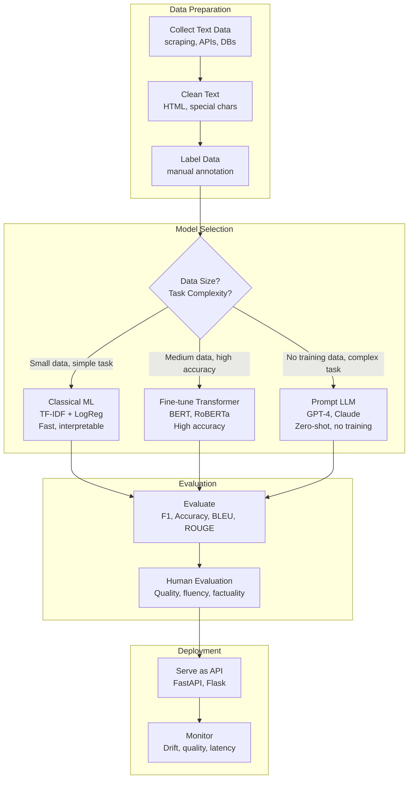

# Natural Language Processing (NLP) — Complete Deep Dive

```
╔══════════════════════════════════════════════════════════════════════════════════════╗
║                    NATURAL LANGUAGE PROCESSING (NLP)                                   ║
║        "Enabling machines to understand, interpret, and generate human language"       ║
╚══════════════════════════════════════════════════════════════════════════════════════╝
```

---

## 1. WHAT NLP IS SOLVING

**Core Problem**: Human language is ambiguous, contextual, evolving, and incredibly complex. Can machines:
- **Understand** what humans mean (not just what they say)?
- **Generate** human-like text?
- **Translate** between languages?
- **Extract** structured information from unstructured text?

**Why NLP is Hard**:
```
"I saw the man with the telescope"
  → I used a telescope to see a man?
  → I saw a man who had a telescope?

"Time flies like an arrow, fruit flies like a banana"
  → Completely different meanings of "flies" and "like"
```

---

## 2. NLP IS AN APPLICATION DOMAIN (Not a Technique Level)

```
┌─────────────────────────────────────────────────────────────────────────────────────┐
│                    NLP USES TECHNIQUES FROM MULTIPLE LEVELS                            │
├─────────────────────────────────────────────────────────────────────────────────────┤
│                                                                                      │
│  ┌─── Rule-Based NLP (AI level) ─────────────────────────────────────────────────┐  │
│  │ • Regular expressions for pattern matching                                     │  │
│  │ • Grammar rules (CFGs, dependency grammars)                                    │  │
│  │ • Dictionary/Lexicon lookups                                                   │  │
│  │ • Template-based generation                                                    │  │
│  │ Status: Still used in production (regex for phone numbers, emails)             │  │
│  └────────────────────────────────────────────────────────────────────────────────┘  │
│                                                                                      │
│  ┌─── Classical ML NLP (ML level) ───────────────────────────────────────────────┐  │
│  │ • TF-IDF + Logistic Regression / SVM (text classification)                    │  │
│  │ • Naive Bayes (spam detection, sentiment)                                      │  │
│  │ • HMMs (POS tagging, legacy)                                                  │  │
│  │ • CRFs (Named Entity Recognition, legacy)                                     │  │
│  │ Status: Fast, interpretable, works on small data — STILL VALID                │  │
│  └────────────────────────────────────────────────────────────────────────────────┘  │
│                                                                                      │
│  ┌─── Deep Learning NLP (DL level) ──────────────────────────────────────────────┐  │
│  │ • Word2Vec / GloVe (word embeddings)                                           │  │
│  │ • RNN / LSTM (sequence modeling, legacy)                                       │  │
│  │ • BERT (bidirectional understanding)                                           │  │
│  │ • GPT (autoregressive generation)                                              │  │
│  │ • T5 / BART (encoder-decoder, seq2seq)                                         │  │
│  │ • GPT-4, Claude, Gemini (LLMs — state of the art)                             │  │
│  │ Status: DOMINATES all NLP benchmarks (2018-present)                            │  │
│  └────────────────────────────────────────────────────────────────────────────────┘  │
│                                                                                      │
└─────────────────────────────────────────────────────────────────────────────────────┘
```

---

## 3. NLP TASKS TAXONOMY

```mermaid
graph TB
    NLP[NLP Tasks]
    
    NLP --> UNDERSTAND[Understanding<br/>Comprehension]
    NLP --> GENERATE[Generation<br/>Creating text]
    NLP --> TRANSFORM[Transformation<br/>Convert text]
    NLP --> EXTRACT[Extraction<br/>Pull info out]
    
    UNDERSTAND --> SENT[Sentiment Analysis]
    UNDERSTAND --> INTENT[Intent Detection]
    UNDERSTAND --> NLI[Natural Language Inference]
    UNDERSTAND --> QA[Question Answering]
    UNDERSTAND --> READ[Reading Comprehension]
    
    GENERATE --> SUMM[Summarization]
    GENERATE --> DIALOG[Dialogue/Chat]
    GENERATE --> STORY[Story/Content Gen]
    GENERATE --> CODE[Code Generation]
    
    TRANSFORM --> TRANS[Translation]
    TRANSFORM --> PARA[Paraphrasing]
    TRANSFORM --> SIMP[Simplification]
    TRANSFORM --> STYLE[Style Transfer]
    
    EXTRACT --> NER[Named Entity Recognition]
    EXTRACT --> REL[Relation Extraction]
    EXTRACT --> KEY[Keyword Extraction]
    EXTRACT --> POS[POS Tagging]
    EXTRACT --> COREF[Coreference Resolution]
```



---

## 4. THE NLP PIPELINE (Classical)

```
┌─────────────────────────────────────────────────────────────────────────────────────┐
│                    CLASSICAL NLP PIPELINE                                              │
├─────────────────────────────────────────────────────────────────────────────────────┤
│                                                                                      │
│  Raw Text                                                                            │
│  "Dr. Smith didn't think the 2 patients' test-results were negative."               │
│     │                                                                                │
│     ▼                                                                                │
│  ┌─────────────────────────────────────────────────────┐                            │
│  │ 1. TOKENIZATION                                      │                            │
│  │    Split into tokens: ["Dr.", "Smith", "didn't", ...] │                            │
│  └─────────────────────────────────────────────────────┘                            │
│     │                                                                                │
│     ▼                                                                                │
│  ┌─────────────────────────────────────────────────────┐                            │
│  │ 2. NORMALIZATION                                     │                            │
│  │    Lowercase, remove punctuation, handle contractions │                            │
│  │    "didn't" → "did" + "not"                          │                            │
│  └─────────────────────────────────────────────────────┘                            │
│     │                                                                                │
│     ▼                                                                                │
│  ┌─────────────────────────────────────────────────────┐                            │
│  │ 3. STOP WORD REMOVAL (optional)                      │                            │
│  │    Remove: "the", "were", "a", "an"                  │                            │
│  └─────────────────────────────────────────────────────┘                            │
│     │                                                                                │
│     ▼                                                                                │
│  ┌─────────────────────────────────────────────────────┐                            │
│  │ 4. STEMMING / LEMMATIZATION                          │                            │
│  │    "patients" → "patient", "results" → "result"     │                            │
│  └─────────────────────────────────────────────────────┘                            │
│     │                                                                                │
│     ▼                                                                                │
│  ┌─────────────────────────────────────────────────────┐                            │
│  │ 5. FEATURE EXTRACTION                                │                            │
│  │    • Bag of Words (BoW)                              │                            │
│  │    • TF-IDF (Term Frequency-Inverse Document Freq)   │                            │
│  │    • N-grams                                         │                            │
│  └─────────────────────────────────────────────────────┘                            │
│     │                                                                                │
│     ▼                                                                                │
│  ┌─────────────────────────────────────────────────────┐                            │
│  │ 6. MODEL (Classical ML)                              │                            │
│  │    • Logistic Regression / SVM / Naive Bayes         │                            │
│  │    • Output: Classification, Entities, etc.          │                            │
│  └─────────────────────────────────────────────────────┘                            │
│                                                                                      │
└─────────────────────────────────────────────────────────────────────────────────────┘
```

---

## 5. THE MODERN NLP PIPELINE (Deep Learning Era)

```mermaid
flowchart TB
    subgraph "Modern NLP (2018+)"
        RAW[Raw Text<br/>"The movie was absolutely terrible"]
        TOK[Tokenizer<br/>WordPiece/BPE/SentencePiece<br/>["The", "movie", "was", "abs", "##olutely", "terrible"]]
        EMB[Embeddings<br/>Token → Dense vector<br/>each token becomes 768-dim vector]
        TRANS[Pre-trained Transformer<br/>BERT / GPT / T5<br/>contextual representations]
        HEAD[Task-Specific Head<br/>Classification / Generation / QA]
        OUT[Output<br/>Sentiment: NEGATIVE (0.97)]
    end
    
    RAW --> TOK --> EMB --> TRANS --> HEAD --> OUT
```

```
┌─────────────────────────────────────────────────────────────────────────────────────┐
│  KEY DIFFERENCE: Classical vs Modern NLP                                              │
├─────────────────────────────────────────────────────────────────────────────────────┤
│                                                                                      │
│  Classical: Text → [Manual Pipeline] → [Sparse Features] → [Simple Model]           │
│  Modern:    Text → [Tokenizer] → [Pre-trained Transformer] → [Fine-tune for task]   │
│                                                                                      │
│  Classical pipeline = 6 steps of manual processing                                   │
│  Modern pipeline = tokenize + feed to pre-trained model                              │
│                                                                                      │
│  The Transformer learns ALL intermediate representations automatically.              │
│  No stop word removal, no stemming, no manual feature engineering needed.            │
│                                                                                      │
└─────────────────────────────────────────────────────────────────────────────────────┘
```

---

## 6. KEY NLP MODELS EVOLUTION

```
┌─────────────────────────────────────────────────────────────────────────────────────┐
│                    NLP MODEL EVOLUTION                                                 │
├─────────────────────────────────────────────────────────────────────────────────────┤
│                                                                                      │
│  ERA 1: STATISTICAL NLP (1990s-2012)                                                 │
│  ═══════════════════════════════════                                                  │
│  • N-gram language models                                                            │
│  • TF-IDF + SVM/Logistic Regression                                                 │
│  • Hidden Markov Models (HMMs)                                                       │
│  • Conditional Random Fields (CRFs)                                                  │
│  • Latent Dirichlet Allocation (LDA) — topic modeling                               │
│                                                                                      │
│  ERA 2: WORD EMBEDDINGS (2013-2017)                                                  │
│  ═════════════════════════════════════                                                │
│  • Word2Vec (2013) — words as dense vectors                                          │
│    "king" - "man" + "woman" ≈ "queen"                                               │
│  • GloVe (2014) — global vectors                                                    │
│  • FastText (2016) — subword embeddings                                              │
│  • Problem: ONE vector per word (no context!)                                        │
│    "bank" (financial) vs "bank" (river) = SAME vector                               │
│                                                                                      │
│  ERA 3: CONTEXTUAL EMBEDDINGS (2018-2019)                                            │
│  ═════════════════════════════════════════                                            │
│  • ELMo (2018) — bidirectional LSTM contextual                                      │
│  • BERT (2018) — bidirectional Transformer (Google)                                  │
│    → Same word gets DIFFERENT vectors based on context                               │
│    → Pre-train on masked language modeling + next sentence                           │
│  • GPT-2 (2019) — unidirectional generation (OpenAI)                                │
│                                                                                      │
│  ERA 4: LARGE LANGUAGE MODELS (2020-present)                                         │
│  ════════════════════════════════════════════                                         │
│  • GPT-3 (2020) — 175B params, few-shot learning                                   │
│  • ChatGPT (2022) — RLHF alignment, conversational                                  │
│  • GPT-4 (2023) — multimodal, reasoning                                             │
│  • Claude 3 (2024) — long context, reasoning                                        │
│  • Gemini (2024) — native multimodal                                                │
│  • Open: LLaMA, Mistral, Qwen                                                       │
│                                                                                      │
│  KEY SHIFT: From task-specific models → general-purpose LLMs                         │
│  One model handles ALL NLP tasks via prompting                                       │
│                                                                                      │
└─────────────────────────────────────────────────────────────────────────────────────┘
```

---

## 7. CORE NLP TASKS — DETAILED

### 7.1 Text Classification

```
┌────────────────────────────────────────────────────────────────────────────┐
│  TEXT CLASSIFICATION                                                         │
├────────────────────────────────────────────────────────────────────────────┤
│                                                                              │
│  Task: Assign a category to text                                            │
│                                                                              │
│  Examples:                                                                   │
│  • Sentiment Analysis: "Great movie!" → POSITIVE                            │
│  • Spam Detection: "Win $1000 now!" → SPAM                                 │
│  • Topic Classification: article → "Technology" / "Sports" / "Politics"    │
│  • Intent Detection: "Book a flight" → INTENT: book_flight                 │
│  • Toxicity Detection: comment → toxic/non-toxic                            │
│                                                                              │
│  Approaches:                                                                 │
│  Classical: TF-IDF + Logistic Regression (fast, interpretable)              │
│  Modern: BERT fine-tuned (highest accuracy)                                 │
│  Zero-shot: GPT-4 with prompt (no training needed!)                         │
│                                                                              │
│  Industry Use:                                                               │
│  • Gmail (spam)                                                              │
│  • Amazon (review sentiment)                                                 │
│  • Twitter/X (hate speech detection)                                         │
│  • Customer support (intent routing)                                         │
│                                                                              │
└────────────────────────────────────────────────────────────────────────────┘
```

### 7.2 Named Entity Recognition (NER)

```
┌────────────────────────────────────────────────────────────────────────────┐
│  NAMED ENTITY RECOGNITION                                                    │
├────────────────────────────────────────────────────────────────────────────┤
│                                                                              │
│  Task: Identify and classify named entities in text                         │
│                                                                              │
│  Input:  "Apple CEO Tim Cook announced in San Francisco on Tuesday"         │
│  Output: [Apple/ORG] CEO [Tim Cook/PERSON] announced in                    │
│          [San Francisco/LOCATION] on [Tuesday/DATE]                          │
│                                                                              │
│  Entity Types:                                                               │
│  • PERSON: Tim Cook, Elon Musk                                              │
│  • ORGANIZATION: Apple, Google, WHO                                          │
│  • LOCATION: San Francisco, India                                            │
│  • DATE/TIME: Tuesday, January 2024                                          │
│  • MONEY: $100, EUR 50                                                       │
│  • Custom: Disease names, Drug names, Gene names (biomedical NER)           │
│                                                                              │
│  Approaches:                                                                 │
│  Classical: CRF + hand-crafted features                                     │
│  Modern: BERT + token classification head                                    │
│  Tools: spaCy, HuggingFace, Flair                                           │
│                                                                              │
│  Industry Use:                                                               │
│  • Healthcare (extract drug names, symptoms from records)                   │
│  • Finance (extract company names, amounts from reports)                    │
│  • Legal (extract parties, dates, clauses)                                   │
│  • Search (knowledge graph construction)                                     │
│                                                                              │
└────────────────────────────────────────────────────────────────────────────┘
```

### 7.3 Machine Translation

```
┌────────────────────────────────────────────────────────────────────────────┐
│  MACHINE TRANSLATION                                                         │
├────────────────────────────────────────────────────────────────────────────┤
│                                                                              │
│  Task: Convert text from one language to another                            │
│                                                                              │
│  Evolution:                                                                  │
│  1960s: Rule-based (grammar rules per language pair)                        │
│  1990s: Statistical MT (phrase-based, alignment models)                     │
│  2016:  Neural MT (seq2seq + attention) ← Google Translate switched        │
│  2017+: Transformer MT (state of the art)                                   │
│                                                                              │
│  Architecture:                                                               │
│  [Source: "Je suis étudiant"] → [Encoder] → [Decoder] → ["I am a student"] │
│                                                                              │
│  Models: Google Translate (Transformer), DeepL, Meta NLLB                   │
│  Challenge: Low-resource languages, idioms, cultural context                │
│                                                                              │
└────────────────────────────────────────────────────────────────────────────┘
```

### 7.4 Question Answering

```
┌────────────────────────────────────────────────────────────────────────────┐
│  QUESTION ANSWERING                                                          │
├────────────────────────────────────────────────────────────────────────────┤
│                                                                              │
│  Types:                                                                      │
│  • Extractive QA: Answer is a SPAN in the document                          │
│    Context: "Paris is the capital of France"                                │
│    Q: "What is the capital of France?" → A: "Paris"                         │
│                                                                              │
│  • Abstractive QA: Generate answer (may not be in document)                 │
│    Requires reasoning and synthesis                                          │
│                                                                              │
│  • Open-domain QA: Answer from large knowledge base                         │
│    Google search, ChatGPT                                                    │
│                                                                              │
│  Modern Approach: RAG (Retrieval-Augmented Generation)                      │
│  1. Retrieve relevant documents (vector search)                             │
│  2. Feed to LLM as context                                                  │
│  3. LLM generates answer grounded in retrieved docs                         │
│                                                                              │
│  Industry Use:                                                               │
│  • Customer support chatbots                                                 │
│  • Enterprise search (find answers in internal docs)                        │
│  • Healthcare (clinical QA from medical literature)                          │
│                                                                              │
└────────────────────────────────────────────────────────────────────────────┘
```

---

## 8. NLP WORKFLOW — END TO END



---

## 9. WHEN TO USE WHICH NLP APPROACH

```
┌─────────────────────────────────────────────────────────────────────────────────────┐
│                    NLP APPROACH SELECTION                                              │
├─────────────────────────────────────────────────────────────────────────────────────┤
│                                                                                      │
│  USE RULE-BASED / REGEX WHEN:                                                        │
│  • Pattern is fixed and well-defined (email, phone, date extraction)                │
│  • Deterministic output needed (no probability)                                      │
│  • Speed is critical (<0.1ms per text)                                               │
│  • No training data available                                                        │
│                                                                                      │
│  USE CLASSICAL ML (TF-IDF + SVM/LogReg) WHEN:                                       │
│  • Labeled data is small (1K-10K samples)                                           │
│  • Interpretability matters (which words drive the prediction?)                      │
│  • Fast training + inference needed                                                  │
│  • Simple classification task (binary/multiclass)                                    │
│  • Latency budget <5ms                                                               │
│                                                                                      │
│  USE FINE-TUNED TRANSFORMER (BERT, RoBERTa) WHEN:                                   │
│  • Labeled data is medium (5K-100K samples)                                         │
│  • High accuracy is critical                                                         │
│  • Context matters (same word, different meaning)                                    │
│  • Tasks: NER, QA, semantic similarity, complex classification                      │
│  • Latency budget: 10-100ms                                                         │
│                                                                                      │
│  USE LLM PROMPTING (GPT-4, Claude) WHEN:                                            │
│  • NO training data (zero-shot / few-shot)                                          │
│  • Task requires reasoning, nuance, world knowledge                                 │
│  • Rapid prototyping (get a solution in minutes)                                    │
│  • Generation tasks (summaries, creative writing, code)                             │
│  • Multi-task (one model for many NLP tasks)                                        │
│  • Latency budget: 1-30 seconds (acceptable for async)                              │
│  • Cost per query: $0.01-$0.10 (acceptable)                                         │
│                                                                                      │
│  USE RAG (Retrieval-Augmented Generation) WHEN:                                      │
│  • Need factual answers from specific documents                                     │
│  • LLM alone hallucinates (needs grounding)                                         │
│  • Domain-specific knowledge (not in LLM training)                                  │
│  • Data changes frequently (can't keep retraining)                                  │
│                                                                                      │
└─────────────────────────────────────────────────────────────────────────────────────┘
```

---

## 10. NLP EVALUATION METRICS

```
┌─────────────────────────────────────────────────────────────────────────────────────┐
│                    NLP METRICS BY TASK                                                 │
├─────────────────────────────────────────────────────────────────────────────────────┤
│                                                                                      │
│  CLASSIFICATION (sentiment, intent, spam):                                           │
│  • Accuracy, Precision, Recall, F1-Score                                            │
│  • Macro/Micro/Weighted F1 for multi-class                                          │
│                                                                                      │
│  NER (entity extraction):                                                            │
│  • Entity-level F1 (exact match)                                                    │
│  • Partial match F1 (overlap counts)                                                │
│                                                                                      │
│  GENERATION (summarization, translation):                                            │
│  • BLEU (n-gram overlap — translation)                                              │
│  • ROUGE (recall-oriented — summarization)                                          │
│  • BERTScore (semantic similarity using BERT)                                       │
│  • Human evaluation (fluency, factuality, relevance)                                │
│                                                                                      │
│  QA (question answering):                                                            │
│  • Exact Match (EM)                                                                  │
│  • F1 (token overlap between predicted and gold answer)                             │
│                                                                                      │
│  LANGUAGE MODELING:                                                                   │
│  • Perplexity (lower = model is more confident/better)                              │
│                                                                                      │
│  LLM-SPECIFIC:                                                                       │
│  • LLM-as-judge (use GPT-4 to evaluate another LLM)                                │
│  • Human preference (A/B testing responses)                                         │
│  • Factual accuracy (hallucination rate)                                            │
│                                                                                      │
└─────────────────────────────────────────────────────────────────────────────────────┘
```

---

## 11. REAL-WORLD NLP USE CASES

| Use Case | Task | Approach | Company |
|----------|------|----------|---------|
| Chatbots / Assistants | Dialogue, Intent, NER | LLM + RAG | Every company |
| Email Spam Filter | Classification | TF-IDF + ML / BERT | Gmail |
| Search | Semantic search, QA | Embeddings + Re-ranking | Google, Bing |
| Content Moderation | Toxicity classification | BERT fine-tuned | Twitter/X, YouTube |
| Translation | Seq2Seq | Transformer | Google Translate |
| Document Summarization | Summarization | T5, GPT-4 | Legal, Finance |
| Voice Assistants | ASR + NLU + NLG | End-to-end DL | Alexa, Siri |
| Code Generation | Code completion | GPT-4, Codex | GitHub Copilot |
| Sentiment Monitoring | Sentiment + Entity | BERT / LLM | Brand monitoring |
| Medical NLP | NER + Classification | BioBERT, ClinicalBERT | Healthcare |

---

## 12. KEY TAKEAWAYS

1. **NLP is an APPLICATION domain** — it uses rule-based AI, classical ML, AND deep learning
2. **Transformers revolutionized NLP** — BERT (2018) and GPT (2018+) changed everything
3. **LLMs are general-purpose NLP machines** — one model handles many tasks via prompting
4. **Classical approaches still valid** — TF-IDF + LogReg for simple tasks, fast inference
5. **RAG is the bridge** — combines LLM generation with factual retrieval
6. **Evaluation is hard** — especially for generation; human eval often needed
7. **The trend: bigger LLMs + tool use + retrieval** — AI Agents doing NLP tasks autonomously

---

*Next: [05-Computer-Vision.md](./05-Computer-Vision.md) — Deep dive into Computer Vision →*
