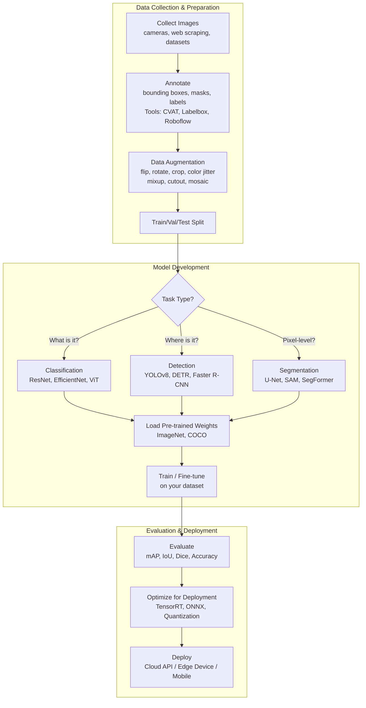
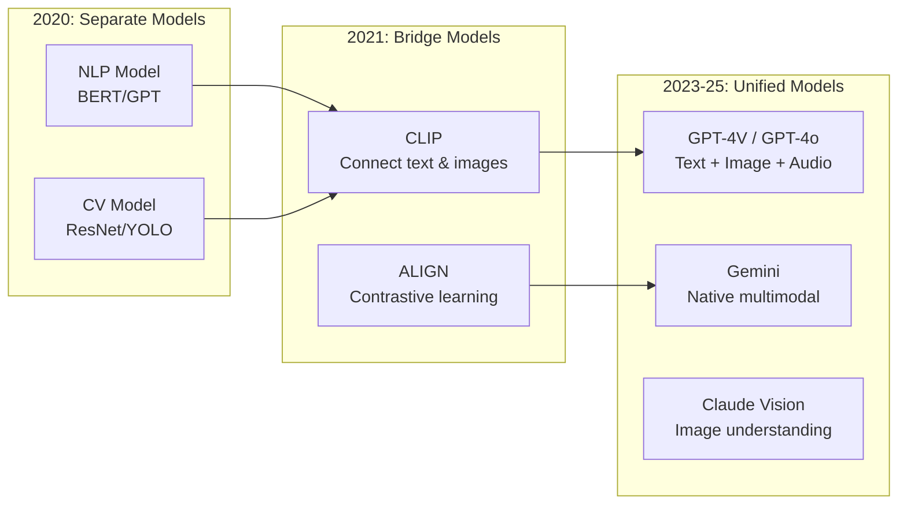

# Computer Vision (CV) — Complete Deep Dive

```
╔══════════════════════════════════════════════════════════════════════════════════════╗
║                    COMPUTER VISION (CV)                                                ║
║        "Enabling machines to interpret and understand visual information"              ║
╚══════════════════════════════════════════════════════════════════════════════════════╝
```

---

## 1. WHAT COMPUTER VISION IS SOLVING

**Core Problem**: Can machines "see" and understand images/videos the way humans do?

**What this means**:
- Detect objects in images (what's there?)
- Classify images (what category?)
- Segment images (which pixels belong to what?)
- Track objects in video (where are they moving?)
- Understand scenes (what's happening?)
- Generate images (create new visuals)

**Why CV is Hard**:
```
Challenges for machines that humans solve effortlessly:
• Viewpoint variation (same object from different angles)
• Scale variation (objects at different distances)
• Occlusion (objects partially hidden)
• Illumination (different lighting conditions)
• Background clutter (complex scenes)
• Deformation (objects can bend/change shape)
• Intra-class variation (all dogs look different)
```

---

## 2. CV IS AN APPLICATION DOMAIN

```
┌─────────────────────────────────────────────────────────────────────────────────────┐
│                    CV USES TECHNIQUES FROM MULTIPLE LEVELS                             │
├─────────────────────────────────────────────────────────────────────────────────────┤
│                                                                                      │
│  ┌─── Classical CV / Image Processing (Pre-ML) ──────────────────────────────────┐  │
│  │ • Edge detection (Canny, Sobel)                                                │  │
│  │ • Corner detection (Harris, FAST)                                              │  │
│  │ • Feature descriptors (SIFT, SURF, ORB)                                       │  │
│  │ • Template matching                                                            │  │
│  │ • Morphological operations                                                     │  │
│  │ • Hough Transform (line/circle detection)                                      │  │
│  │ • Color histograms, thresholding                                               │  │
│  │ Status: Still used for simple tasks, preprocessing, edge devices                │  │
│  └────────────────────────────────────────────────────────────────────────────────┘  │
│                                                                                      │
│  ┌─── ML-based CV ───────────────────────────────────────────────────────────────┐  │
│  │ • HOG + SVM (pedestrian detection — Dalal & Triggs 2005)                       │  │
│  │ • Haar Cascades + AdaBoost (face detection — Viola-Jones 2001)                │  │
│  │ • Bag of Visual Words + SVM                                                    │  │
│  │ • Deformable Parts Models (DPM)                                                │  │
│  │ Status: Legacy, but Haar cascades still used in OpenCV for fast face detect   │  │
│  └────────────────────────────────────────────────────────────────────────────────┘  │
│                                                                                      │
│  ┌─── Deep Learning CV (Dominates since 2012) ───────────────────────────────────┐  │
│  │ • CNNs (AlexNet, VGG, ResNet, EfficientNet)                                   │  │
│  │ • Object Detection (YOLO, SSD, Faster R-CNN, DETR)                            │  │
│  │ • Segmentation (U-Net, Mask R-CNN, SAM)                                       │  │
│  │ • Vision Transformers (ViT, Swin, DeiT)                                       │  │
│  │ • Generative (GANs, Diffusion Models — Stable Diffusion, DALL-E)              │  │
│  │ • Multimodal (CLIP, GPT-4V, Gemini Vision)                                    │  │
│  │ Status: STATE OF THE ART for all CV tasks                                      │  │
│  └────────────────────────────────────────────────────────────────────────────────┘  │
│                                                                                      │
└─────────────────────────────────────────────────────────────────────────────────────┘
```

---

## 3. CV TASKS TAXONOMY

```mermaid
graph TB
    CV[Computer Vision Tasks]
    
    CV --> RECOG[Recognition]
    CV --> DETECT[Detection]
    CV --> SEG[Segmentation]
    CV --> GEN_CV[Generation]
    CV --> VIDEO[Video Understanding]
    CV --> _3D[3D Vision]
    
    RECOG --> IMGCLS[Image Classification<br/>What is this?]
    RECOG --> FACE[Face Recognition<br/>Who is this?]
    RECOG --> OCR[OCR<br/>Read text in images]
    RECOG --> SCENE[Scene Recognition<br/>Where is this?]
    
    DETECT --> OBJ[Object Detection<br/>Where are objects?]
    DETECT --> POSE[Pose Estimation<br/>Body keypoints]
    DETECT --> ANOM_CV[Anomaly Detection<br/>Defects, unusual]
    
    SEG --> SEM[Semantic Segmentation<br/>Label every pixel]
    SEG --> INST[Instance Segmentation<br/>Separate objects]
    SEG --> PAN[Panoptic Segmentation<br/>Stuff + things]
    
    GEN_CV --> SYNTH[Image Synthesis<br/>GANs, Diffusion]
    GEN_CV --> SR[Super Resolution<br/>Enhance quality]
    GEN_CV --> STYLE_CV[Style Transfer<br/>Apply art styles]
    
    VIDEO --> ACTION[Action Recognition<br/>What are they doing?]
    VIDEO --> TRACK[Object Tracking<br/>Follow across frames]
    VIDEO --> FLOW[Optical Flow<br/>Motion estimation]
```



---

## 4. CV TASKS EXPLAINED VISUALLY

```
┌─────────────────────────────────────────────────────────────────────────────────────┐
│                    CORE CV TASKS — VISUAL EXPLANATION                                  │
├─────────────────────────────────────────────────────────────────────────────────────┤
│                                                                                      │
│  IMAGE CLASSIFICATION                                                                │
│  ═══════════════════                                                                 │
│  Input:  [Image of a dog]                                                            │
│  Output: "dog" (single label)                                                        │
│  Models: ResNet, EfficientNet, ViT                                                   │
│  Use: Product categorization, content moderation                                     │
│                                                                                      │
│  OBJECT DETECTION                                                                    │
│  ════════════════                                                                    │
│  Input:  [Image with multiple objects]                                               │
│  Output: Bounding boxes + labels                                                     │
│          ┌────────┐   ┌─────┐                                                       │
│          │  dog   │   │ cat │                                                        │
│          │ (0.95) │   │(0.89)│                                                       │
│          └────────┘   └─────┘                                                        │
│  Models: YOLOv8, DETR, Faster R-CNN                                                  │
│  Use: Self-driving, surveillance, retail analytics                                   │
│                                                                                      │
│  SEMANTIC SEGMENTATION                                                               │
│  ═════════════════════                                                               │
│  Input:  [Street scene image]                                                        │
│  Output: Every pixel labeled (road=green, car=blue, sky=purple)                      │
│  Models: U-Net, DeepLab, SegFormer                                                   │
│  Use: Medical imaging, autonomous driving, satellite imagery                         │
│                                                                                      │
│  INSTANCE SEGMENTATION                                                               │
│  ═════════════════════                                                               │
│  Input:  [Image with 3 people]                                                       │
│  Output: Pixel-level mask for EACH person separately                                 │
│  Models: Mask R-CNN, SAM (Segment Anything)                                          │
│  Use: Photo editing, AR/VR, robotics                                                 │
│                                                                                      │
│  POSE ESTIMATION                                                                     │
│  ════════════════                                                                    │
│  Input:  [Image of person]                                                           │
│  Output: Skeleton keypoints (joints, limbs)                                          │
│  Models: OpenPose, MediaPipe, HRNet                                                  │
│  Use: Fitness apps, sports analytics, animation                                      │
│                                                                                      │
│  OPTICAL CHARACTER RECOGNITION (OCR)                                                 │
│  ═══════════════════════════════════                                                  │
│  Input:  [Image with text]                                                           │
│  Output: Extracted text string                                                       │
│  Models: Tesseract, PaddleOCR, TrOCR                                                │
│  Use: Document digitization, receipt scanning, license plates                        │
│                                                                                      │
└─────────────────────────────────────────────────────────────────────────────────────┘
```

---

## 5. OBJECT DETECTION — DEEP DIVE

```
┌─────────────────────────────────────────────────────────────────────────────────────┐
│                    OBJECT DETECTION EVOLUTION                                          │
├─────────────────────────────────────────────────────────────────────────────────────┤
│                                                                                      │
│  TWO-STAGE DETECTORS (Accurate but slower):                                          │
│  ┌────────────────────────────────────────────────────────────────────┐             │
│  │                                                                     │             │
│  │  Image → [Region Proposal Network] → Candidate Boxes                │             │
│  │                                          │                          │             │
│  │                                          ▼                          │             │
│  │                              [Classify + Refine each box]           │             │
│  │                                          │                          │             │
│  │                                          ▼                          │             │
│  │                              Final Detections                       │             │
│  │                                                                     │             │
│  │  Models: R-CNN → Fast R-CNN → Faster R-CNN → Cascade R-CNN         │             │
│  │  Speed: ~5-15 FPS                                                   │             │
│  └────────────────────────────────────────────────────────────────────┘             │
│                                                                                      │
│  ONE-STAGE DETECTORS (Fast, good for real-time):                                     │
│  ┌────────────────────────────────────────────────────────────────────┐             │
│  │                                                                     │             │
│  │  Image → [Single Neural Network] → All boxes + classes at once     │             │
│  │                                                                     │             │
│  │  Models: YOLO (v1→v8), SSD, RetinaNet                              │             │
│  │  Speed: 30-160+ FPS (real-time!)                                    │             │
│  │                                                                     │             │
│  │  YOLOv8 (2023): Best speed/accuracy trade-off                      │             │
│  │  • Detection, Segmentation, Pose, Classification                   │             │
│  │  • Can run on edge devices (phones, Jetson)                         │             │
│  └────────────────────────────────────────────────────────────────────┘             │
│                                                                                      │
│  TRANSFORMER-BASED DETECTORS (Emerging):                                             │
│  ┌────────────────────────────────────────────────────────────────────┐             │
│  │  • DETR (Detection Transformer) — end-to-end, no hand-crafted components        │             │
│  │  • No anchor boxes, no NMS needed                                  │             │
│  │  • Simpler architecture, competitive accuracy                      │             │
│  └────────────────────────────────────────────────────────────────────┘             │
│                                                                                      │
└─────────────────────────────────────────────────────────────────────────────────────┘
```

---

## 6. CV WORKFLOW — END TO END



---

## 7. CV MODEL SELECTION GUIDE

```
┌─────────────────────────────────────────────────────────────────────────────────────┐
│                    WHICH CV MODEL TO USE?                                              │
├─────────────────────────────────────────────────────────────────────────────────────┤
│                                                                                      │
│  TASK: IMAGE CLASSIFICATION                                                          │
│  ├── Small dataset (<5K images)?                                                     │
│  │   ├── Transfer learning from ImageNet: EfficientNet-B0/B1                        │
│  │   └── Or: Use CLIP zero-shot (no training needed!)                               │
│  ├── Medium dataset (5K-100K)?                                                       │
│  │   └── Fine-tune: EfficientNet, ResNet-50, ViT-B                                 │
│  └── Large dataset (>100K)?                                                          │
│      └── Train: ViT-L, Swin Transformer, ConvNeXt                                   │
│                                                                                      │
│  TASK: OBJECT DETECTION                                                              │
│  ├── Need REAL-TIME (>30 FPS)?                                                       │
│  │   └── YOLOv8-nano/small, SSD MobileNet                                           │
│  ├── Need HIGH ACCURACY?                                                             │
│  │   └── YOLOv8-large, DETR, Co-DETR                                               │
│  ├── Edge deployment (phone/Jetson)?                                                 │
│  │   └── YOLOv8-nano, MobileNet-SSD, EfficientDet-lite                             │
│  └── Research / no hand-crafted components?                                          │
│      └── DETR, DINO                                                                  │
│                                                                                      │
│  TASK: SEGMENTATION                                                                  │
│  ├── Medical images (few classes)?                                                   │
│  │   └── U-Net, nnU-Net (gold standard for medical)                                │
│  ├── General scene parsing?                                                          │
│  │   └── SegFormer, Mask2Former                                                     │
│  ├── Interactive / promptable?                                                       │
│  │   └── SAM (Segment Anything Model) — Meta                                        │
│  └── Instance-level separation?                                                      │
│      └── Mask R-CNN, YOLO-Seg                                                       │
│                                                                                      │
│  TASK: IMAGE GENERATION                                                              │
│  ├── Photorealistic from text?                                                       │
│  │   └── Stable Diffusion, DALL-E 3, Midjourney                                    │
│  ├── Face synthesis/editing?                                                         │
│  │   └── StyleGAN3                                                                   │
│  └── Image-to-image (super-res, inpainting)?                                        │
│      └── Stable Diffusion + ControlNet                                               │
│                                                                                      │
└─────────────────────────────────────────────────────────────────────────────────────┘
```

---

## 8. CV EVALUATION METRICS

```
┌─────────────────────────────────────────────────────────────────────────────────────┐
│                    CV EVALUATION METRICS                                               │
├─────────────────────────────────────────────────────────────────────────────────────┤
│                                                                                      │
│  CLASSIFICATION:                                                                     │
│  • Top-1 Accuracy: Correct class is the top prediction                              │
│  • Top-5 Accuracy: Correct class in top 5 predictions                               │
│                                                                                      │
│  DETECTION:                                                                          │
│  • IoU (Intersection over Union): Overlap of predicted vs ground truth box          │
│    IoU = Area(Predicted ∩ Ground Truth) / Area(Predicted ∪ Ground Truth)            │
│    Typically IoU > 0.5 counts as correct detection                                  │
│                                                                                      │
│  • mAP (Mean Average Precision): Primary metric                                     │
│    mAP@0.5: Using IoU threshold of 0.5                                              │
│    mAP@0.5:0.95: Averaged over IoU thresholds (COCO standard)                       │
│                                                                                      │
│  • FPS (Frames Per Second): Speed metric                                            │
│                                                                                      │
│  SEGMENTATION:                                                                       │
│  • Pixel Accuracy: % of correctly classified pixels                                  │
│  • Mean IoU (mIoU): Average IoU across all classes                                  │
│  • Dice Coefficient: 2|A∩B|/(|A|+|B|) — popular in medical                        │
│                                                                                      │
│  GENERATION:                                                                         │
│  • FID (Frechet Inception Distance): Quality of generated images                    │
│  • IS (Inception Score): Diversity + quality                                        │
│  • CLIP Score: Text-image alignment                                                  │
│  • Human evaluation: Most reliable                                                   │
│                                                                                      │
└─────────────────────────────────────────────────────────────────────────────────────┘
```

---

## 9. CLASSICAL CV vs DEEP LEARNING CV

```
┌─────────────────────────────────────────────────────────────────────────────────────┐
│                    WHEN TO USE CLASSICAL CV vs DL                                      │
├─────────────────────────────────────────────────────────────────────────────────────┤
│                                                                                      │
│  USE CLASSICAL CV (OpenCV) WHEN:                                                     │
│  ═══════════════════════════════                                                     │
│  ✓ Simple geometric detection (lines, circles, contours)                            │
│  ✓ Color-based segmentation (threshold a specific color)                            │
│  ✓ Template matching (find exact pattern)                                           │
│  ✓ Edge device with NO GPU (raspberry pi, microcontrollers)                         │
│  ✓ Preprocessing for DL pipeline (resize, normalize, crop)                          │
│  ✓ Augmented reality markers (ArUco, QR codes)                                     │
│  ✓ Camera calibration, stereo vision                                                │
│  ✓ Real-time constraints with no neural network budget                              │
│                                                                                      │
│  Examples:                                                                           │
│  • Barcode/QR scanning                                                               │
│  • Document edge detection (for scanning apps)                                      │
│  • Simple color tracking (follow a red ball)                                        │
│  • Industrial measurement (measure part dimensions)                                  │
│                                                                                      │
│  ─────────────────────────────────────────────────────                               │
│                                                                                      │
│  USE DEEP LEARNING CV WHEN:                                                          │
│  ════════════════════════════                                                        │
│  ✓ Complex recognition (faces, objects, scenes)                                     │
│  ✓ Variable conditions (lighting, angle, occlusion)                                 │
│  ✓ Need to understand SEMANTIC content                                              │
│  ✓ Detection/segmentation at scale                                                   │
│  ✓ Generation (create new images)                                                    │
│  ✓ GPU available                                                                     │
│  ✓ Training data available (or pre-trained model exists)                            │
│                                                                                      │
│  HYBRID APPROACH (Common in production):                                             │
│  Classical CV for preprocessing → DL for understanding                              │
│  Example: Crop document region (Hough lines) → OCR with DL (TrOCR)                │
│                                                                                      │
└─────────────────────────────────────────────────────────────────────────────────────┘
```

---

## 10. REAL-WORLD CV USE CASES

```
┌─────────────────────────────────────────────────────────────────────────────────────┐
│                    CV IN INDUSTRY                                                      │
├─────────────────────────────────────────────────────────────────────────────────────┤
│                                                                                      │
│  AUTONOMOUS DRIVING:                                                                 │
│  • Object detection (cars, pedestrians, cyclists)                                   │
│  • Lane detection (semantic segmentation)                                           │
│  • Traffic sign recognition (classification)                                        │
│  • Depth estimation (monocular/stereo)                                              │
│  • Companies: Tesla, Waymo, Cruise                                                   │
│                                                                                      │
│  HEALTHCARE / MEDICAL:                                                               │
│  • X-ray analysis (detect pneumonia, fractures)                                     │
│  • Pathology slides (detect cancer cells)                                           │
│  • Retinal scanning (diabetic retinopathy)                                          │
│  • MRI/CT segmentation (tumor boundaries)                                           │
│  • Surgical assistance (real-time organ detection)                                  │
│                                                                                      │
│  MANUFACTURING / QUALITY:                                                            │
│  • Defect detection on assembly lines                                               │
│  • Product counting and sorting                                                      │
│  • Safety compliance (PPE detection)                                                 │
│  • Robotic picking (bin picking)                                                     │
│                                                                                      │
│  RETAIL / E-COMMERCE:                                                                │
│  • Visual search ("find similar products")                                           │
│  • Shelf monitoring (out-of-stock detection)                                        │
│  • Virtual try-on (clothes, glasses, makeup)                                        │
│  • Checkout-free stores (Amazon Go)                                                  │
│                                                                                      │
│  SECURITY / SURVEILLANCE:                                                            │
│  • Face recognition (access control)                                                 │
│  • Crowd analysis (density estimation)                                              │
│  • Anomaly detection (unusual behavior)                                             │
│  • License plate recognition (ALPR)                                                  │
│                                                                                      │
│  AGRICULTURE:                                                                        │
│  • Crop disease detection (from drone images)                                       │
│  • Yield estimation (counting fruits)                                               │
│  • Weed detection (precision spraying)                                              │
│  • Livestock monitoring                                                              │
│                                                                                      │
│  CONTENT & MEDIA:                                                                    │
│  • Content moderation (detect NSFW, violence)                                       │
│  • Image/video generation (Stable Diffusion, Sora)                                  │
│  • Deepfake detection                                                                │
│  • Photo enhancement (computational photography)                                     │
│                                                                                      │
└─────────────────────────────────────────────────────────────────────────────────────┘
```

---

## 11. THE MULTIMODAL FUTURE (CV + NLP Convergence)



```
┌─────────────────────────────────────────────────────────────────────────────────────┐
│  THE FUTURE: CV IS MERGING WITH NLP                                                   │
├─────────────────────────────────────────────────────────────────────────────────────┤
│                                                                                      │
│  Before (separate):                                                                  │
│  • "What's in this image?" → CNN classifier → "dog"                                │
│  • Need separate model for each task                                                 │
│                                                                                      │
│  Now (unified):                                                                      │
│  • "What's in this image?" → GPT-4V → "A golden retriever playing fetch            │
│    in a park on a sunny day. The dog appears happy and is mid-jump                  │
│    catching a red frisbee."                                                          │
│                                                                                      │
│  • "Count the people in this security camera feed" → Gemini → "I can see           │
│    7 people, 3 are standing near the entrance..."                                   │
│                                                                                      │
│  Implications:                                                                       │
│  • Specialized CV models still needed for: real-time detection, edge, medical       │
│  • But LLMs are replacing many CV tasks for general understanding                   │
│  • CLIP enables zero-shot classification (no training needed!)                      │
│                                                                                      │
└─────────────────────────────────────────────────────────────────────────────────────┘
```

---

## 12. KEY TAKEAWAYS

1. **CV is an APPLICATION domain** — uses classical image processing, ML, AND deep learning
2. **Deep learning dominates CV** since AlexNet (2012) — CNNs and now Vision Transformers
3. **YOLO is the go-to for real-time detection** — YOLOv8 for production
4. **SAM (Segment Anything) is a game-changer** — promptable segmentation for any object
5. **Classical CV is NOT dead** — preprocessing, edge devices, geometric tasks still need it
6. **Transfer learning is essential** — always start from ImageNet/COCO pre-trained weights
7. **CV is converging with NLP** — multimodal models (GPT-4V, Gemini) can "see and talk"
8. **Data annotation is the bottleneck** — labeling images is expensive; semi-supervised helps

---

*Next: [06-Decision-Workflow-When-To-Use-What.md](./06-Decision-Workflow-When-To-Use-What.md) — Decision workflows →*
