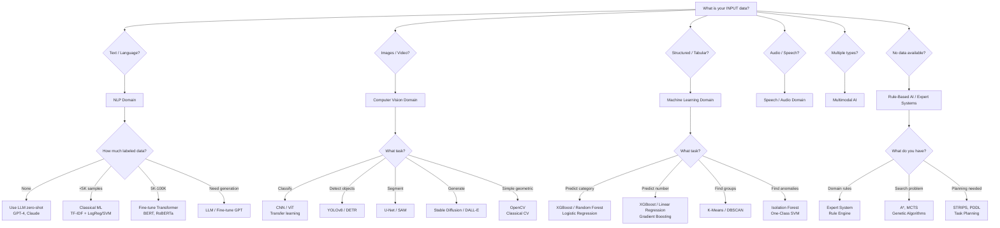
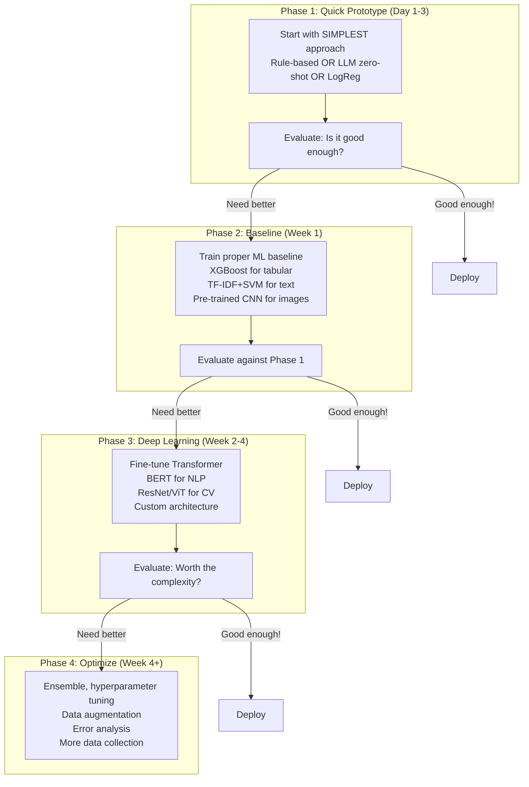

# Decision Workflow — When To Use What & Why

```
╔══════════════════════════════════════════════════════════════════════════════════════╗
║                    DECISION WORKFLOWS & SELECTION GUIDES                               ║
║              "Given my problem, which domain/approach should I use?"                   ║
╚══════════════════════════════════════════════════════════════════════════════════════╝
```

---

## 1. THE MASTER DECISION TREE



---

## 2. THE "DATA TYPE → APPROACH" MATRIX

```
┌─────────────────────────────────────────────────────────────────────────────────────┐
│                    DATA TYPE → RECOMMENDED APPROACH                                    │
├─────────────────────────────────────────────────────────────────────────────────────┤
│                                                                                      │
│  Data Type        │ Best Domain │ Best Approach          │ Example Tool/Model        │
│  ═════════════════│═════════════│════════════════════════│══════════════════════════ │
│  Tabular/CSV      │ ML          │ Gradient Boosting      │ XGBoost, LightGBM        │
│  Text (classify)  │ NLP         │ Fine-tuned Transformer │ BERT, RoBERTa            │
│  Text (generate)  │ NLP         │ Large Language Model   │ GPT-4, Claude, LLaMA     │
│  Images (classify)│ CV          │ CNN / ViT              │ EfficientNet, ViT        │
│  Images (detect)  │ CV          │ Object Detector        │ YOLOv8, DETR             │
│  Images (segment) │ CV          │ Segmentation Network   │ U-Net, SAM              │
│  Audio/Speech     │ Speech      │ Wav2Vec / Whisper      │ OpenAI Whisper           │
│  Time Series      │ ML/DL       │ LSTM / Transformer     │ Prophet, Temporal Fusion │
│  Graph/Network    │ DL          │ Graph Neural Network   │ GNN, GraphSAGE           │
│  No data (rules)  │ AI          │ Expert System          │ Drools, CLIPS            │
│  Multimodal       │ AI          │ Foundation Model       │ GPT-4o, Gemini           │
│                                                                                      │
└─────────────────────────────────────────────────────────────────────────────────────┘
```

---

## 3. THE "DATASET SIZE" DECISION WORKFLOW

```mermaid
flowchart TB
    SIZE[How much DATA do you have?]
    
    SIZE --> ZERO[NO labeled data<br/>0 samples]
    SIZE --> TINY[Tiny<br/>10-100 samples]
    SIZE --> SMALL[Small<br/>100-1K samples]
    SIZE --> MEDIUM[Medium<br/>1K-100K samples]
    SIZE --> LARGE[Large<br/>100K-1M samples]
    SIZE --> MASSIVE[Massive<br/>>1M samples]
    
    ZERO --> ZERO_OPT[Options:<br/>1. LLM zero-shot prompting<br/>2. Rule-based system<br/>3. CLIP zero-shot (images)<br/>4. Collect more data]
    
    TINY --> TINY_OPT[Options:<br/>1. LLM few-shot prompting<br/>2. Transfer learning + fine-tune<br/>3. Data augmentation<br/>4. Active learning]
    
    SMALL --> SMALL_OPT[Options:<br/>1. Classical ML (SVM, RF)<br/>2. Fine-tune pre-trained model<br/>3. Few-shot learning<br/>4. Semi-supervised learning]
    
    MEDIUM --> MED_OPT[Options:<br/>1. Fine-tune BERT/ResNet<br/>2. XGBoost for tabular<br/>3. Train small custom model<br/>4. Ensemble methods]
    
    LARGE --> LARGE_OPT[Options:<br/>1. Train custom DL model<br/>2. Fine-tune large model<br/>3. DL will outperform ML<br/>4. Consider distributed training]
    
    MASSIVE --> MASS_OPT[Options:<br/>1. Train from scratch<br/>2. Pre-train foundation model<br/>3. Distributed training<br/>4. Self-supervised pre-training]
```

---

## 4. THE "BUSINESS REQUIREMENTS" DECISION FRAMEWORK

```
┌─────────────────────────────────────────────────────────────────────────────────────┐
│                    BUSINESS REQUIREMENTS → TECHNICAL CHOICE                            │
├─────────────────────────────────────────────────────────────────────────────────────┤
│                                                                                      │
│  REQUIREMENT: INTERPRETABILITY / EXPLAINABILITY                                      │
│  ═══════════════════════════════════════════════                                      │
│  "We need to explain WHY the model made this decision"                               │
│                                                                                      │
│  • Highly interpretable: Decision Trees, Logistic Regression, Rule-based            │
│  • Moderately interpretable: Random Forest (feature importance), SHAP              │
│  • Low interpretability: Deep Learning (black box — use LIME/SHAP post-hoc)        │
│                                                                                      │
│  Industries requiring this: Healthcare, Finance, Legal, Insurance                    │
│                                                                                      │
│  ─────────────────────────────────────────────────────────────────                   │
│                                                                                      │
│  REQUIREMENT: REAL-TIME / LOW LATENCY                                                │
│  ═════════════════════════════════════════                                            │
│  "Model must respond in <10ms per prediction"                                        │
│                                                                                      │
│  • <1ms: Logistic Regression, Decision Tree, simple rule                            │
│  • <10ms: Small CNN, XGBoost, SVM                                                   │
│  • <50ms: ResNet-18, YOLOv8-nano, DistilBERT                                       │
│  • <200ms: BERT-base, YOLOv8-large                                                  │
│  • 1-5s: GPT-3.5, Claude Haiku                                                      │
│  • 5-30s: GPT-4, Claude Opus                                                        │
│                                                                                      │
│  Strategies: Model distillation, quantization (INT8), pruning, ONNX                │
│                                                                                      │
│  ─────────────────────────────────────────────────────────────────                   │
│                                                                                      │
│  REQUIREMENT: MINIMAL TRAINING DATA                                                  │
│  ══════════════════════════════════════                                               │
│  "We only have 50-100 labeled examples"                                              │
│                                                                                      │
│  • Zero-shot: LLMs (GPT-4), CLIP (images)                                          │
│  • Few-shot: LLM in-context learning, Siamese networks                             │
│  • Transfer learning: Pre-trained model + fine-tune last layers                     │
│  • Data augmentation: Increase effective dataset size                                │
│  • Active learning: Smart labeling of most informative samples                      │
│                                                                                      │
│  ─────────────────────────────────────────────────────────────────                   │
│                                                                                      │
│  REQUIREMENT: EDGE DEPLOYMENT (No Cloud)                                             │
│  ═══════════════════════════════════════════                                          │
│  "Must run on phone / Raspberry Pi / IoT device"                                     │
│                                                                                      │
│  • Mobile: MobileNet, EfficientNet-Lite, TFLite, CoreML                            │
│  • Embedded: TinyML, TensorFlow Micro, Edge Impulse                                 │
│  • Optimization: Quantization (INT8/INT4), Pruning, Knowledge Distillation         │
│  • For NLP: DistilBERT, TinyBERT, ONNX Runtime                                    │
│                                                                                      │
│  ─────────────────────────────────────────────────────────────────                   │
│                                                                                      │
│  REQUIREMENT: HIGHEST POSSIBLE ACCURACY (Cost no object)                             │
│  ════════════════════════════════════════════════════════                              │
│  "We need the absolute best model regardless of cost"                                │
│                                                                                      │
│  • Ensemble of models (blend multiple approaches)                                   │
│  • Largest available model (GPT-4, Gemini Ultra)                                    │
│  • Custom training with massive compute                                              │
│  • Test-time augmentation (TTA)                                                      │
│  • Neural Architecture Search (NAS)                                                  │
│                                                                                      │
└─────────────────────────────────────────────────────────────────────────────────────┘
```

---

## 5. THE "PROBLEM TYPE" DECISION WORKFLOW

```mermaid
flowchart TB
    PROB[What PROBLEM are you solving?]
    
    PROB --> PRED[Prediction<br/>Given input, predict output]
    PROB --> GEN[Generation<br/>Create new content]
    PROB --> UNDERSTAND[Understanding<br/>Comprehend meaning]
    PROB --> DECIDE[Decision Making<br/>Choose best action]
    PROB --> DISCOVER[Discovery<br/>Find hidden patterns]
    
    PRED --> PRED_TYPE{Input type?}
    PRED_TYPE -->|Numbers/Tabular| ML_PRED[ML: XGBoost, RF]
    PRED_TYPE -->|Text → Category| NLP_PRED[NLP: BERT fine-tune]
    PRED_TYPE -->|Image → Label| CV_PRED[CV: ResNet/ViT]
    PRED_TYPE -->|Sequence → Next| DL_PRED[DL: Transformer/LSTM]
    
    GEN --> GEN_TYPE{Generate what?}
    GEN_TYPE -->|Text| GEN_TEXT[NLP: GPT-4, LLaMA]
    GEN_TYPE -->|Images| GEN_IMG[CV: Stable Diffusion]
    GEN_TYPE -->|Code| GEN_CODE[NLP: Codex, GPT-4]
    GEN_TYPE -->|Music/Audio| GEN_AUDIO[DL: MusicGen, AudioLM]
    
    UNDERSTAND --> UND_TYPE{Understand what?}
    UND_TYPE -->|Text meaning| UND_TEXT[NLP: BERT, LLM]
    UND_TYPE -->|Image content| UND_IMG[CV: CLIP, GPT-4V]
    UND_TYPE -->|Speech| UND_SPEECH[Speech: Whisper]
    
    DECIDE --> DEC_TYPE{Decision context?}
    DEC_TYPE -->|Known rules| DEC_RULE[AI: Expert System]
    DEC_TYPE -->|Learn from outcomes| DEC_RL[RL: PPO, DQN]
    DEC_TYPE -->|Sequential decisions| DEC_PLAN[AI: Planning/Search]
    
    DISCOVER --> DISC_TYPE{Discover what?}
    DISC_TYPE -->|Groups in data| DISC_CLUSTER[ML: K-Means, DBSCAN]
    DISC_TYPE -->|Outliers| DISC_ANOM[ML: Isolation Forest]
    DISC_TYPE -->|Relationships| DISC_GRAPH[DL: GNN]
```



---

## 6. COST vs ACCURACY TRADEOFF

```
┌─────────────────────────────────────────────────────────────────────────────────────┐
│                    COST vs ACCURACY TRADEOFF                                          │
├─────────────────────────────────────────────────────────────────────────────────────┤
│                                                                                      │
│  Accuracy                                                                            │
│  ▲                                                                                   │
│  │                                                        ★ GPT-4 (fine-tuned)      │
│  │                                              ★ GPT-4 (prompted)                   │
│  │                                    ★ BERT (fine-tuned)                            │
│  │                          ★ XGBoost                                                │
│  │                ★ Random Forest                                                    │
│  │        ★ Logistic Regression                                                      │
│  │  ★ Rule-based                                                                     │
│  │                                                                                   │
│  └─────────────────────────────────────────────────────────────────▶ Cost            │
│  $0         $10        $100       $1K        $10K       $100K                        │
│                                                                                      │
│  RECOMMENDATION BY BUDGET:                                                           │
│  ┌───────────────────────────────────────────────────────────────────┐              │
│  │ Budget     │ Best Approach                                        │              │
│  │────────────│──────────────────────────────────────────────────────│              │
│  │ $0         │ Rule-based, LLM zero-shot (per-query cost)          │              │
│  │ $10-100    │ Classical ML (train on laptop)                       │              │
│  │ $100-1K    │ Fine-tune small Transformer (1 GPU for hours)       │              │
│  │ $1K-10K    │ Fine-tune large model (multiple GPUs)               │              │
│  │ $10K+      │ Custom training, distributed, large models          │              │
│  └───────────────────────────────────────────────────────────────────┘              │
│                                                                                      │
│  PER-QUERY COST (Inference):                                                         │
│  • Rule-based: $0.000001 (microseconds of CPU)                                      │
│  • XGBoost: $0.00001 (milliseconds of CPU)                                          │
│  • BERT: $0.0001 (ms on GPU)                                                        │
│  • GPT-3.5: $0.002 per 1K tokens                                                    │
│  • GPT-4: $0.03-0.06 per 1K tokens                                                  │
│  • Claude Opus: $0.015-0.075 per 1K tokens                                          │
│                                                                                      │
└─────────────────────────────────────────────────────────────────────────────────────┘
```

---

## 7. THE ITERATION STRATEGY



```
┌─────────────────────────────────────────────────────────────────────────────────────┐
│  GOLDEN RULE: Start simple, add complexity only when justified by evaluation         │
│                                                                                      │
│  ANTI-PATTERN: Jumping straight to GPT-4 / Large Transformer                        │
│  WHY IT'S WRONG: You can't improve what you can't measure. Simple baseline first.   │
│                                                                                      │
│  "If your ML system can be replaced by a few if-else statements                     │
│   and achieves the same performance, you're over-engineering."                       │
└─────────────────────────────────────────────────────────────────────────────────────┘
```

---

## 8. DOMAIN OVERLAP SCENARIOS

```
┌─────────────────────────────────────────────────────────────────────────────────────┐
│                    WHEN DOMAINS OVERLAP                                                │
├─────────────────────────────────────────────────────────────────────────────────────┤
│                                                                                      │
│  SCENARIO: Document Understanding (NLP + CV)                                         │
│  ══════════════════════════════════════════                                           │
│  • Scan document (CV: detect layout, text regions)                                  │
│  • OCR (CV → Text extraction)                                                       │
│  • Understand content (NLP: classify, extract entities)                              │
│  • Model: LayoutLM, Donut (unified document AI)                                    │
│                                                                                      │
│  SCENARIO: Video Understanding (CV + NLP + Audio)                                    │
│  ═══════════════════════════════════════════════                                      │
│  • Visual: Detect objects, scenes, actions (CV)                                     │
│  • Audio: Transcribe speech (Speech/NLP)                                            │
│  • Text: Understand transcription (NLP)                                              │
│  • Combine: Generate description/summary                                             │
│  • Model: GPT-4o, Gemini (native multimodal)                                       │
│                                                                                      │
│  SCENARIO: Autonomous Driving (AI + CV + ML + Planning)                              │
│  ═════════════════════════════════════════════════════                                │
│  • Perception: Object detection + lane detection (CV/DL)                            │
│  • Prediction: Predict trajectories (ML)                                             │
│  • Planning: Route + behavior planning (AI/Search)                                  │
│  • Control: Execute maneuvers (Classical control)                                    │
│                                                                                      │
│  SCENARIO: Customer Support Bot (NLP + ML + AI)                                      │
│  ═══════════════════════════════════════════════                                      │
│  • Understand query: Intent detection (NLP)                                          │
│  • Route to agent: Classification (ML)                                               │
│  • Generate response: LLM + RAG (NLP/DL)                                           │
│  • Escalation rules: Business logic (Rule-based AI)                                 │
│                                                                                      │
│  SCENARIO: Medical Diagnosis (CV + NLP + ML)                                         │
│  ═════════════════════════════════════════════                                        │
│  • Read X-ray: Image classification (CV/DL)                                        │
│  • Read patient notes: NER + classification (NLP)                                   │
│  • Risk scoring: Tabular patient data (ML/XGBoost)                                  │
│  • Final diagnosis: Combine all signals + clinical rules                            │
│                                                                                      │
└─────────────────────────────────────────────────────────────────────────────────────┘
```

---

## 9. QUICK REFERENCE CHEAT SHEET

```
┌─────────────────────────────────────────────────────────────────────────────────────┐
│                    QUICK REFERENCE — "I need to..."                                    │
├─────────────────────────────────────────────────────────────────────────────────────┤
│                                                                                      │
│  "Predict if a customer will churn" → ML (XGBoost on customer features)             │
│  "Detect spam emails" → NLP (TF-IDF + LogReg or BERT)                               │
│  "Find faces in photos" → CV (MTCNN / RetinaFace / MediaPipe)                       │
│  "Translate English to French" → NLP (Transformer / Google Translate API)            │
│  "Detect defects on assembly line" → CV (YOLOv8 fine-tuned)                         │
│  "Summarize a long document" → NLP (GPT-4 / T5)                                    │
│  "Predict stock prices" → ML (time series: LSTM / XGBoost)                          │
│  "Generate marketing copy" → NLP (LLM: GPT-4, Claude)                               │
│  "Segment tumors in MRI" → CV (U-Net / nnU-Net)                                    │
│  "Cluster customers by behavior" → ML (K-Means / DBSCAN)                            │
│  "Route optimization" → AI (A* / OR algorithms)                                     │
│  "Play chess/Go" → AI (MCTS / AlphaZero)                                            │
│  "Build a chatbot" → NLP (LLM + RAG + intent detection)                            │
│  "Detect fraud" → ML (Isolation Forest / XGBoost ensemble)                          │
│  "Generate realistic faces" → CV (StyleGAN / Diffusion)                             │
│  "Recommend products" → ML (Collaborative filtering / embeddings)                   │
│  "Self-driving car" → AI + CV + ML + Planning (full stack AI)                       │
│  "Read handwriting" → CV (CNN/Transformer OCR)                                       │
│  "Detect sarcasm in text" → NLP (fine-tuned BERT / LLM)                            │
│  "Count people in video" → CV (object detection + tracking)                         │
│                                                                                      │
└─────────────────────────────────────────────────────────────────────────────────────┘
```

---

## 10. DECISION ANTI-PATTERNS (What NOT to do)

```
┌─────────────────────────────────────────────────────────────────────────────────────┐
│                    ANTI-PATTERNS — AVOID THESE                                         │
├─────────────────────────────────────────────────────────────────────────────────────┤
│                                                                                      │
│  ✗ "Let's use Deep Learning for everything"                                         │
│    → DL on 500-row tabular data = overfitting. Use XGBoost.                        │
│                                                                                      │
│  ✗ "Let's use GPT-4 for simple classification"                                      │
│    → $0.03/query × 1M queries = $30K/month. Fine-tuned BERT = $0.                  │
│                                                                                      │
│  ✗ "We need the most complex model"                                                  │
│    → Simple LogReg with 95% accuracy beats BERT with 96% if                        │
│      LogReg is 100x faster and fully interpretable.                                  │
│                                                                                      │
│  ✗ "Skip the baseline, go straight to DL"                                            │
│    → Without a baseline, you don't know if DL is actually helping.                  │
│                                                                                      │
│  ✗ "AI will solve it" (no data, no clear problem definition)                         │
│    → Define the problem precisely first. What's the input? Output? Metric?          │
│                                                                                      │
│  ✗ "Collect all possible features, let the model figure it out"                      │
│    → Garbage in = garbage out. Feature quality > feature quantity.                   │
│                                                                                      │
│  ✗ "Our model is 99% accurate, ship it!"                                            │
│    → Is your data 99% one class? Check precision/recall/F1.                         │
│    → Did you test on truly unseen data? Check for data leakage.                     │
│                                                                                      │
│  ✗ "Fine-tune a model once and forget about it"                                      │
│    → Data distribution changes (drift). Monitor and retrain.                        │
│                                                                                      │
└─────────────────────────────────────────────────────────────────────────────────────┘
```

---

## 11. THE 2024-2025 PRACTICAL GUIDE

```
┌─────────────────────────────────────────────────────────────────────────────────────┐
│                    WHAT TO USE IN 2024-2025                                            │
├─────────────────────────────────────────────────────────────────────────────────────┤
│                                                                                      │
│  FOR MOST NLP TASKS:                                                                 │
│  1st choice: LLM API (GPT-4, Claude) — if cost/latency acceptable                  │
│  2nd choice: Fine-tune smaller model (BERT, DistilBERT) — for production           │
│  3rd choice: Classical ML (TF-IDF+LogReg) — for extreme speed                      │
│                                                                                      │
│  FOR MOST CV TASKS:                                                                  │
│  1st choice: YOLOv8 (detection) or EfficientNet/ViT (classification)               │
│  2nd choice: GPT-4V / Gemini Vision — for understanding (not real-time)            │
│  3rd choice: Classical CV (OpenCV) — for geometric/preprocessing                    │
│                                                                                      │
│  FOR TABULAR DATA:                                                                   │
│  1st choice: XGBoost / LightGBM / CatBoost (still king!)                           │
│  2nd choice: Random Forest / Gradient Boosting                                       │
│  3rd choice: TabNet / FT-Transformer (DL for tabular — niche)                       │
│                                                                                      │
│  FOR GENERATION:                                                                     │
│  Text: GPT-4, Claude, LLaMA (via API or self-hosted)                                │
│  Images: Stable Diffusion, DALL-E 3, Midjourney                                     │
│  Code: GPT-4, Claude, GitHub Copilot                                                │
│  Video: Sora, Runway, Pika                                                           │
│                                                                                      │
│  FOR AGENTS & AUTOMATION:                                                            │
│  LLM + Tools + Memory + Planning                                                    │
│  Frameworks: LangChain, AutoGen, CrewAI                                             │
│                                                                                      │
└─────────────────────────────────────────────────────────────────────────────────────┘
```

---

## 12. KEY TAKEAWAYS

1. **Start with the data type** — that determines the domain (NLP, CV, ML)
2. **Start simple, iterate up** — Rule-based → Classical ML → DL → LLM
3. **XGBoost still dominates tabular data** — don't use DL for spreadsheets
4. **LLMs are the default for NLP now** — unless cost/latency is a constraint
5. **Transfer learning first** — almost never train from scratch
6. **The problem defines the approach** — not the hype cycle
7. **Measure everything** — can't improve without baselines and metrics
8. **Real systems combine domains** — self-driving car uses ALL of AI/ML/DL/NLP/CV

---

*Next: [07-Real-World-Use-Cases.md](./07-Real-World-Use-Cases.md) — Detailed industry use cases →*
