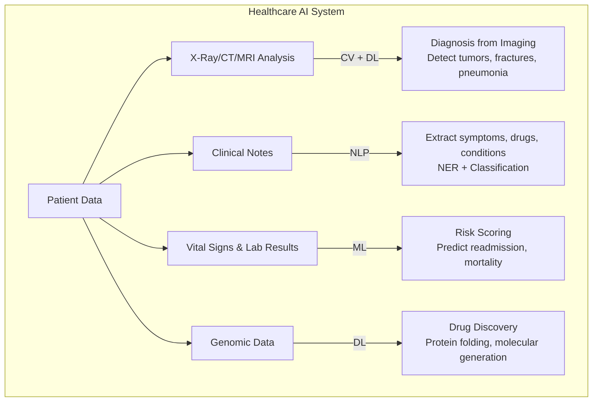
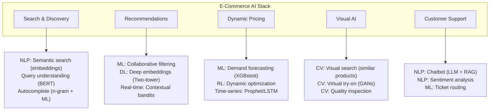
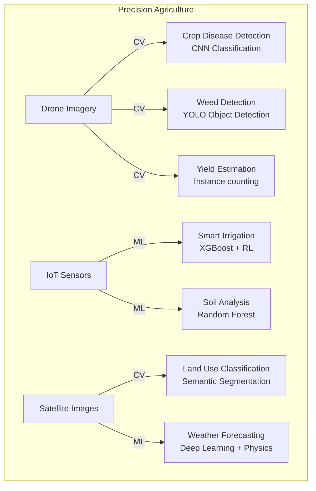
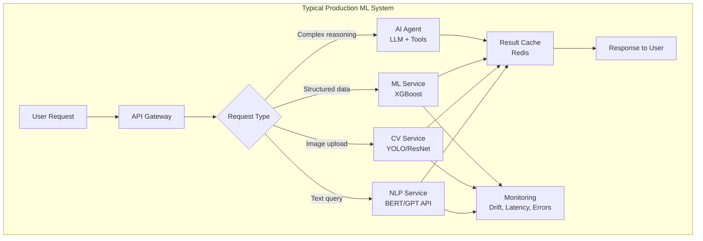

# Real-World Use Cases — When To Use Which Domain & Why

```
╔══════════════════════════════════════════════════════════════════════════════════════╗
║                    REAL-WORLD USE CASES BY INDUSTRY                                    ║
║              Mapping problems → domains → solutions → companies                       ║
╚══════════════════════════════════════════════════════════════════════════════════════╝
```

---

## 1. HEALTHCARE & MEDICAL



| Use Case | Domain(s) | Approach | Real Company | Why This Approach |
|----------|-----------|----------|--------------|-------------------|
| Detect diabetic retinopathy | CV | CNN (EfficientNet) | Google Health | Images require spatial feature learning; DL beats manual grading |
| Predict sepsis 6hrs early | ML | XGBoost on vitals | Epic Systems | Tabular time-series data; XGBoost handles feature interactions well |
| Extract info from clinical notes | NLP | BioBERT + NER | Amazon Comprehend Medical | Unstructured text needs context-aware entity extraction |
| Pathology slide analysis | CV | ViT + attention | PathAI | Gigapixel images; attention helps focus on tumor regions |
| Drug interaction prediction | ML + DL | GNN | BenevolentAI | Drug-drug interactions form graphs; GNNs learn molecular relationships |
| Protein structure prediction | DL | AlphaFold (custom) | DeepMind | 3D structure from sequence; deep learning captures folding patterns |
| Medical chatbot | NLP | LLM + RAG | Ada Health | Needs medical knowledge + conversation; RAG grounds answers |

**Why These Choices**:
- **CV for imaging**: Medical images have spatial patterns (tumors look different from normal tissue)
- **ML for vitals**: Structured sensor data → XGBoost excels on tabular with <100K rows
- **NLP for notes**: Clinical text is messy, abbreviated, specialized → needs domain-specific transformers
- **DL for genomics**: Sequences are long, patterns are hierarchical → deep networks find them

---

## 2. FINANCE & BANKING

```
┌─────────────────────────────────────────────────────────────────────────────────────┐
│                    FINANCE USE CASES                                                    │
├─────────────────────────────────────────────────────────────────────────────────────┤
│                                                                                      │
│  Use Case            │ Domain │ Approach              │ Why                           │
│  ════════════════════│════════│═══════════════════════│═══════════════════════════    │
│  Fraud Detection     │ ML     │ XGBoost + Rules       │ Tabular transaction data;     │
│                      │        │ Isolation Forest      │ need interpretability for      │
│                      │        │                       │ compliance; ensemble catches   │
│                      │        │                       │ both known & novel fraud       │
│                      │        │                       │                               │
│  Credit Scoring      │ ML     │ Logistic Regression   │ Regulatory requirement for    │
│                      │        │ + XGBoost ensemble    │ explainability; LR provides    │
│                      │        │                       │ baseline, XGB boosts accuracy  │
│                      │        │                       │                               │
│  Algo Trading        │ ML+RL  │ LSTM + RL agents      │ Time-series prediction +      │
│                      │        │                       │ sequential decision making     │
│                      │        │                       │                               │
│  Document Processing │ NLP+CV │ LayoutLM / GPT-4V     │ Documents have BOTH visual    │
│  (invoices, forms)   │        │                       │ layout AND text content        │
│                      │        │                       │                               │
│  Sentiment for       │ NLP    │ FinBERT (fine-tuned)  │ Financial text has unique      │
│  Market Analysis     │        │                       │ jargon; domain-specific BERT   │
│                      │        │                       │                               │
│  KYC / ID Verify     │ CV     │ Face Recognition +    │ Need to match face to ID;     │
│                      │        │ Liveness detection    │ CNN embeddings for matching    │
│                      │        │                       │                               │
│  Check Deposit OCR   │ CV+NLP │ CNN/Transformer OCR   │ Extract amount from check     │
│                      │        │                       │ image (visual text)            │
│                      │        │                       │                               │
│  Customer Service    │ NLP    │ LLM + RAG + Intent    │ Understand query, retrieve     │
│  Automation          │        │                       │ policy docs, generate response │
│                      │        │                       │                               │
└─────────────────────────────────────────────────────────────────────────────────────┘
```

**Key Insight for Finance**: Explainability is often a REGULATORY REQUIREMENT. This is why:
- Credit scoring often uses Logistic Regression (interpretable) even if XGBoost is more accurate
- Fraud detection uses rules + ML hybrid (rules catch known patterns, ML catches unknown)
- SHAP values are used post-hoc to explain DL model decisions

---

## 3. E-COMMERCE & RETAIL



| Use Case | Domain | Approach | Company | Why |
|----------|--------|----------|---------|-----|
| Product Recommendations | ML + DL | Two-tower neural net + collaborative filtering | Amazon, Netflix | User-item interactions form massive sparse matrices; DL embeddings capture latent preferences |
| Visual Search | CV | CNN embeddings + nearest neighbor | Pinterest, ASOS | "Find similar looking products" requires understanding visual features |
| Review Sentiment | NLP | BERT fine-tuned | Amazon | Context-dependent sentiment in product reviews; "long battery life" = positive, "long delivery" = negative |
| Demand Forecasting | ML | XGBoost + Prophet | Walmart | Time-series with many external features (weather, holidays); XGBoost handles feature interactions |
| Chatbot Support | NLP | LLM + RAG over product catalog | Shopify, Zendesk | Need product knowledge + conversation; RAG retrieves specific product info |
| Size Recommendation | ML | Bayesian models + returns data | Stitch Fix | Tabular user measurements + purchase history; probabilistic models handle uncertainty |
| Fake Review Detection | NLP + ML | BERT + behavioral features | Amazon, Yelp | Needs both text analysis AND user behavior patterns |

---

## 4. AUTONOMOUS VEHICLES

```
┌─────────────────────────────────────────────────────────────────────────────────────┐
│                    SELF-DRIVING CAR — THE COMPLETE AI SYSTEM                           │
├─────────────────────────────────────────────────────────────────────────────────────┤
│                                                                                      │
│  This is the ULTIMATE example of using ALL domains together:                         │
│                                                                                      │
│  ┌─── PERCEPTION (CV + DL) ─────────────────────────────────────────────────────┐   │
│  │ • Camera: Object detection (YOLOv8 / custom CNN)                              │   │
│  │ • LiDAR: 3D point cloud processing (PointNet++)                              │   │
│  │ • Radar: Distance + velocity fusion                                           │   │
│  │ • Sensor Fusion: Combine all sensors (DL)                                     │   │
│  │ • Lane Detection: Semantic segmentation                                        │   │
│  │ • Traffic Sign/Light: Classification                                           │   │
│  └───────────────────────────────────────────────────────────────────────────────┘   │
│                        │                                                             │
│                        ▼                                                             │
│  ┌─── PREDICTION (ML + DL) ─────────────────────────────────────────────────────┐   │
│  │ • Predict where pedestrians will walk (trajectory prediction)                 │   │
│  │ • Predict what other cars will do (behavior prediction)                       │   │
│  │ • Models: Graph Neural Networks, Transformers                                 │   │
│  └───────────────────────────────────────────────────────────────────────────────┘   │
│                        │                                                             │
│                        ▼                                                             │
│  ┌─── PLANNING (AI — Search & Optimization) ────────────────────────────────────┐   │
│  │ • Route planning: A* / Dijkstra (global)                                     │   │
│  │ • Behavior planning: State machines + ML                                      │   │
│  │ • Trajectory planning: Optimization (quadratic programming)                   │   │
│  │ • Decision: When to brake, accelerate, turn                                   │   │
│  └───────────────────────────────────────────────────────────────────────────────┘   │
│                        │                                                             │
│                        ▼                                                             │
│  ┌─── CONTROL (Classical AI + Control Theory) ──────────────────────────────────┐   │
│  │ • PID controllers (steering, throttle, brake)                                 │   │
│  │ • Model Predictive Control (MPC)                                              │   │
│  │ • Execute planned trajectory physically                                        │   │
│  └───────────────────────────────────────────────────────────────────────────────┘   │
│                        │                                                             │
│                        ▼                                                             │
│  ┌─── NLP (Secondary) ─────────────────────────────────────────────────────────┐    │
│  │ • Voice commands from passengers                                              │    │
│  │ • Navigation input understanding                                              │    │
│  │ • V2X communication                                                           │    │
│  └───────────────────────────────────────────────────────────────────────────────┘   │
│                                                                                      │
│  Companies: Tesla, Waymo, Cruise, Mobileye, Zoox                                    │
│                                                                                      │
└─────────────────────────────────────────────────────────────────────────────────────┘
```

---

## 5. MANUFACTURING & INDUSTRIAL

| Use Case | Domain | Approach | Why This Approach |
|----------|--------|----------|-------------------|
| Visual Quality Inspection | CV | YOLOv8 / Anomaly detection CNN | Detect defects in products on assembly line; cameras + DL faster & more consistent than humans |
| Predictive Maintenance | ML | XGBoost on sensor time-series | Predict equipment failure from vibration, temperature, pressure data; tabular → ML wins |
| Robotic Pick & Place | CV + AI | Object detection + path planning | Detect object position (CV), plan arm trajectory (AI/planning), execute (control) |
| Process Optimization | ML + RL | XGBoost for prediction, RL for control | Optimize chemical processes; ML predicts outcomes, RL finds optimal settings |
| Worker Safety (PPE) | CV | Object detection (YOLO) | Detect if workers are wearing helmets, vests, goggles from CCTV |
| Digital Twin | AI + ML | Physics simulation + ML surrogate | Model physical system; ML accelerates simulation |
| Supply Chain Forecast | ML | XGBoost + Prophet | Demand forecasting from historical sales + external factors |

---

## 6. CONTENT & MEDIA

```
┌─────────────────────────────────────────────────────────────────────────────────────┐
│                    MEDIA & CONTENT USE CASES                                           │
├─────────────────────────────────────────────────────────────────────────────────────┤
│                                                                                      │
│  CONTENT MODERATION (Meta, YouTube, TikTok):                                        │
│  ─────────────────────────────────────────────                                       │
│  • Images: CV (NSFW detection, violence detection) — CNN classifier                 │
│  • Text: NLP (hate speech, bullying) — BERT fine-tuned                              │
│  • Video: CV + NLP (harmful content) — multiframe CNN + audio analysis              │
│  • Scale: Billions of posts/day → need FAST models (distilled)                      │
│                                                                                      │
│  RECOMMENDATION ENGINES (Netflix, Spotify, YouTube):                                 │
│  ──────────────────────────────────────────────────                                  │
│  • Collaborative filtering (users who liked X also liked Y) — ML                    │
│  • Content-based (analyze movie features) — ML + NLP/CV embeddings                  │
│  • Deep learning: Two-tower models, sequence models                                 │
│  • Bandits: Explore/exploit for cold-start — RL                                     │
│                                                                                      │
│  CONTENT GENERATION:                                                                 │
│  ───────────────────                                                                 │
│  • Text: Blog posts, marketing copy — NLP (GPT-4, Claude)                          │
│  • Images: Marketing visuals — CV (Stable Diffusion, Midjourney)                    │
│  • Video: Short clips — CV (Sora, Runway)                                           │
│  • Music: Background music — DL (MusicGen, Suno)                                   │
│  • Code: Development — NLP (GitHub Copilot, Cursor)                                 │
│                                                                                      │
│  SEARCH (Google, Bing):                                                              │
│  ─────────────────────                                                               │
│  • Query understanding: NLP (BERT, intent detection)                                │
│  • Ranking: ML (Learning to Rank — LambdaMART, neural)                              │
│  • Snippets/Answers: NLP (extractive QA, LLM generation)                            │
│  • Image search: CV (CLIP embeddings, visual similarity)                            │
│  • Knowledge panel: Knowledge graph + NLP (entity linking)                          │
│                                                                                      │
└─────────────────────────────────────────────────────────────────────────────────────┘
```

---

## 7. CYBERSECURITY

| Use Case | Domain | Approach | Why |
|----------|--------|----------|-----|
| Intrusion Detection | ML | Isolation Forest + XGBoost | Network logs are tabular; need anomaly detection for unknown attacks + classification for known ones |
| Malware Classification | ML + DL | Random Forest on features + CNN on binary visualization | Static features (ML) + visual patterns in byte sequences (CV) |
| Phishing Detection | NLP + ML | BERT (email text) + URL features (ML) | Email body needs NLP understanding; URL structure is tabular feature |
| Threat Intelligence | NLP | NER + Relation Extraction | Extract IOCs (IPs, hashes, CVEs) from security reports |
| Log Anomaly Detection | ML + DL | LSTM on log sequences | Logs are sequential; LSTM detects unusual patterns |
| Deepfake Detection | CV | EfficientNet fine-tuned | Need to detect visual artifacts in fake videos |
| Password Cracking | AI | Rule-based + Markov chains | Pattern-based generation; no DL needed |

---

## 8. AGRICULTURE & ENVIRONMENT



---

## 9. EDUCATION & HR

| Use Case | Domain | Approach | Why |
|----------|--------|----------|-----|
| Resume Screening | NLP | BERT + classification | Extract skills, experience from unstructured text; classify fit |
| Cheating Detection | NLP + ML | LLM detection + behavioral ML | Writing style analysis (NLP) + browser behavior (ML) |
| Personalized Learning | ML + RL | Knowledge tracing (DL) + bandits | Adapt difficulty based on learner performance |
| Essay Grading | NLP | Fine-tuned BERT + rubric | Evaluate coherence, grammar, content automatically |
| Interview Analysis | NLP + CV | Sentiment (NLP) + facial analysis (CV) | Multimodal understanding of candidate responses |
| Skill Gap Analysis | NLP + ML | NER for skills + clustering | Extract skills from JDs, cluster competencies |

---

## 10. THE SUMMARY MATRIX — ALL INDUSTRIES

```
┌─────────────────────────────────────────────────────────────────────────────────────┐
│                    INDUSTRY → PRIMARY DOMAIN MAPPING                                   │
├─────────────────────────────────────────────────────────────────────────────────────┤
│                                                                                      │
│  Industry          │ Primary Domain │ Secondary    │ Key Constraint                   │
│  ══════════════════│════════════════│═════════════ │══════════════════════════════    │
│  Healthcare        │ CV + NLP       │ ML           │ Accuracy (life-critical)         │
│  Finance           │ ML             │ NLP          │ Explainability (regulatory)      │
│  E-commerce        │ ML + NLP       │ CV           │ Scale (billions of items)        │
│  Autonomous Driving│ CV             │ AI + ML      │ Real-time (safety)               │
│  Manufacturing     │ CV             │ ML           │ Speed (production line)          │
│  Media/Content     │ NLP + CV       │ ML           │ Scale (billions of posts)        │
│  Cybersecurity     │ ML             │ NLP          │ Real-time + low false positive   │
│  Agriculture       │ CV             │ ML           │ Edge deployment (no cloud)       │
│  Legal             │ NLP            │ ML           │ Accuracy + explainability        │
│  Gaming            │ AI (RL)        │ CV + NLP     │ Real-time + behavior quality     │
│  Education         │ NLP            │ ML           │ Personalization                  │
│  Logistics         │ ML + AI        │ CV           │ Optimization + real-time         │
│                                                                                      │
└─────────────────────────────────────────────────────────────────────────────────────┘
```

---

## 11. THE "WHY" BEHIND EACH CHOICE

```
┌─────────────────────────────────────────────────────────────────────────────────────┐
│                    WHY each approach wins in its domain                                │
├─────────────────────────────────────────────────────────────────────────────────────┤
│                                                                                      │
│  WHY ML (XGBoost) for tabular:                                                       │
│  • Gradient boosting handles feature interactions without manual engineering         │
│  • Works with missing values natively                                                │
│  • Fast training (minutes) and inference (<1ms)                                     │
│  • Interpretable (feature importance, SHAP)                                          │
│  • Doesn't need GPU or massive data                                                  │
│  • STILL beats DL on most tabular benchmarks                                        │
│                                                                                      │
│  WHY DL (Transformers) for NLP:                                                      │
│  • Language requires understanding CONTEXT (same word = different meanings)          │
│  • Self-attention captures long-range dependencies                                   │
│  • Pre-training on massive text gives world knowledge                               │
│  • Fine-tuning adapts to any NLP task with small data                               │
│  • Generation ability (GPT) enables creative applications                           │
│                                                                                      │
│  WHY DL (CNNs/ViT) for CV:                                                          │
│  • Images are high-dimensional (224x224x3 = 150K features)                          │
│  • Spatial patterns (edges, textures, objects) are hierarchical                     │
│  • Translation invariance (cat in corner = cat in center)                           │
│  • Pre-training on ImageNet provides universal visual features                      │
│  • Manual feature engineering for images is near-impossible at scale                 │
│                                                                                      │
│  WHY Rule-Based AI still exists:                                                      │
│  • 100% deterministic (same input = same output always)                             │
│  • Fully explainable (trace the rule that fired)                                    │
│  • No training data needed                                                           │
│  • Zero computational cost at inference                                              │
│  • Legal/compliance requirements demand it                                           │
│  • Catches known patterns with 100% recall                                          │
│                                                                                      │
│  WHY RL for decisions/games:                                                          │
│  • Sequential decision-making (action now affects future)                            │
│  • No labeled "correct action" exists (learn by trial-and-error)                    │
│  • Can discover super-human strategies                                               │
│  • Natural fit for control problems (robotics, trading, games)                      │
│                                                                                      │
└─────────────────────────────────────────────────────────────────────────────────────┘
```

---

## 12. PRODUCTION ARCHITECTURE PATTERNS



---

## 13. KEY TAKEAWAYS

1. **No single domain solves everything** — real systems combine ML + DL + NLP + CV + AI
2. **Industry constraints drive choice** — not just accuracy (explainability, speed, cost matter)
3. **Start with the PROBLEM, not the technology** — what's the input, output, and constraint?
4. **XGBoost for tabular, Transformers for text/images** — this covers 80% of real use cases
5. **LLMs are replacing many specialized models** — but not all (real-time, edge, regulated)
6. **The best systems are HYBRID** — rules + ML + DL working together
7. **Production is harder than prototyping** — monitoring, scaling, and data drift are real problems

---

*End of series. Go back to [00-Overview-and-Comparison.md](./00-Overview-and-Comparison.md) for the master reference.*
