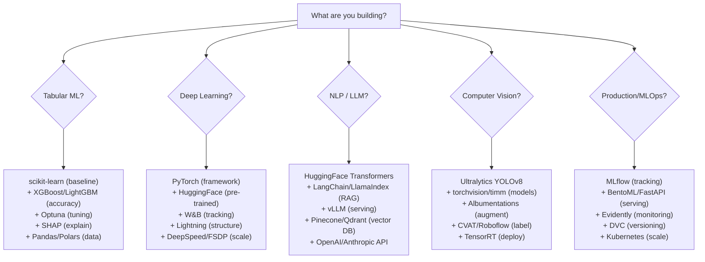

# Frameworks & Tools — Complete Ecosystem Guide

```
╔══════════════════════════════════════════════════════════════════════════════════════╗
║              EVERY FRAMEWORK & TOOL — WHEN, WHY, AND HOW TO USE                      ║
║         ML Frameworks • DL Frameworks • MLOps • Deployment • Data Tools              ║
╚══════════════════════════════════════════════════════════════════════════════════════╝
```

---

## 1. ML FRAMEWORKS

```
┌─────────────────────────────────────────────────────────────────────────────────────┐
│                    MACHINE LEARNING FRAMEWORKS                                         │
├─────────────────────────────────────────────────────────────────────────────────────┤
│                                                                                      │
│  ┌─── scikit-learn ──────────────────────────────────────────────────────────────┐  │
│  │  THE standard ML library. Start here for classical ML.                         │  │
│  │                                                                                │  │
│  │  What: Classification, Regression, Clustering, Dim Reduction, Pipelines       │  │
│  │  Language: Python                                                              │  │
│  │  When to use: Tabular data, prototyping, education, small-medium data         │  │
│  │  When NOT: Deep learning, GPU training, >1M rows (slow)                       │  │
│  │                                                                                │  │
│  │  Key APIs:                                                                     │  │
│  │  • fit(X, y) → train the model                                               │  │
│  │  • predict(X) → make predictions                                              │  │
│  │  • score(X, y) → evaluate model                                               │  │
│  │  • Pipeline → chain preprocessing + model                                     │  │
│  │  • GridSearchCV → hyperparameter tuning                                       │  │
│  │  • cross_val_score → cross-validation                                         │  │
│  └────────────────────────────────────────────────────────────────────────────────┘  │
│                                                                                      │
│  ┌─── XGBoost / LightGBM / CatBoost ────────────────────────────────────────────┐  │
│  │  Gradient boosting libraries — BEST for tabular data                           │  │
│  │                                                                                │  │
│  │  XGBoost:    Most popular, best documentation, GPU support                     │  │
│  │  LightGBM:   Fastest training, leaf-wise, best for large data                 │  │
│  │  CatBoost:   Best for categorical features, robust defaults                   │  │
│  │                                                                                │  │
│  │  When to use: ANY tabular prediction task. This is your default.              │  │
│  │  Integration: All have scikit-learn API compatibility                          │  │
│  │                                                                                │  │
│  │  Production pattern:                                                           │  │
│  │  data → [feature engineering] → [XGBoost/LGBM] → [SHAP explanation]          │  │
│  └────────────────────────────────────────────────────────────────────────────────┘  │
│                                                                                      │
│  ┌─── Pandas / Polars ───────────────────────────────────────────────────────────┐  │
│  │  Data manipulation and analysis                                                │  │
│  │                                                                                │  │
│  │  Pandas: Standard, huge ecosystem, slower on large data                        │  │
│  │  Polars: 10-100x faster, Rust-based, modern API, lazy evaluation              │  │
│  │                                                                                │  │
│  │  Recommendation: Polars for new projects with >1M rows                        │  │
│  │                   Pandas for existing projects, small data, tutorials          │  │
│  └────────────────────────────────────────────────────────────────────────────────┘  │
│                                                                                      │
│  ┌─── NumPy / SciPy ────────────────────────────────────────────────────────────┐  │
│  │  Numerical computing foundation                                                │  │
│  │  NumPy: Arrays, linear algebra, random — foundation of all Python ML          │  │
│  │  SciPy: Optimization, statistics, signal processing, sparse matrices          │  │
│  └────────────────────────────────────────────────────────────────────────────────┘  │
│                                                                                      │
│  ┌─── AutoML Tools ─────────────────────────────────────────────────────────────┐  │
│  │  Auto-sklearn: Automated model + hyperparameter selection                      │  │
│  │  FLAML:        Fast, lightweight AutoML (Microsoft)                            │  │
│  │  H2O AutoML:   Enterprise-grade, Java-based                                   │  │
│  │  AutoGluon:    AWS, tabular/text/image, very easy                             │  │
│  │  PyCaret:      Low-code ML, great for prototyping                             │  │
│  │                                                                                │  │
│  │  When: Rapid prototyping, baseline comparison, non-ML-expert users            │  │
│  └────────────────────────────────────────────────────────────────────────────────┘  │
│                                                                                      │
└─────────────────────────────────────────────────────────────────────────────────────┘
```

---

## 2. DEEP LEARNING FRAMEWORKS

```
┌─────────────────────────────────────────────────────────────────────────────────────┐
│                    DEEP LEARNING FRAMEWORKS                                            │
├─────────────────────────────────────────────────────────────────────────────────────┤
│                                                                                      │
│  ┌─── PyTorch ───────────────────────────────────────────────────────────────────┐  │
│  │  THE dominant DL framework (2024). Used by ~80% of research papers.           │  │
│  │                                                                                │  │
│  │  Strengths:                                                                    │  │
│  │  • Dynamic computation graph (define-by-run) — easy debugging                 │  │
│  │  • Pythonic, intuitive API                                                    │  │
│  │  • Massive ecosystem (torchvision, torchaudio, torchtext)                    │  │
│  │  • HuggingFace models use PyTorch                                            │  │
│  │  • Great for research AND production now                                      │  │
│  │                                                                                │  │
│  │  Key components:                                                               │  │
│  │  • torch.nn: Neural network modules                                           │  │
│  │  • torch.optim: Optimizers (Adam, SGD, etc.)                                 │  │
│  │  • torch.utils.data: DataLoader, Dataset                                     │  │
│  │  • torch.distributed: Multi-GPU training                                     │  │
│  │  • torch.compile: JIT compilation (2.0+) — free 20-30% speedup              │  │
│  │  • FSDP: Fully Sharded Data Parallel                                         │  │
│  │                                                                                │  │
│  │  When to use: Default choice for any DL project                               │  │
│  └────────────────────────────────────────────────────────────────────────────────┘  │
│                                                                                      │
│  ┌─── TensorFlow / Keras ────────────────────────────────────────────────────────┐  │
│  │  Google's framework. Still used in production, declining in research.          │  │
│  │                                                                                │  │
│  │  Strengths:                                                                    │  │
│  │  • Keras: Simple high-level API (great for beginners)                         │  │
│  │  • TF Serving: Production serving is mature                                   │  │
│  │  • TFLite: Best mobile/edge deployment                                        │  │
│  │  • TPU support (Google Cloud)                                                 │  │
│  │  • TensorBoard: Excellent visualization                                       │  │
│  │                                                                                │  │
│  │  When to use: Edge/mobile deployment, Google Cloud/TPUs, legacy projects      │  │
│  │  When NOT: New research projects (community moved to PyTorch)                 │  │
│  └────────────────────────────────────────────────────────────────────────────────┘  │
│                                                                                      │
│  ┌─── JAX ───────────────────────────────────────────────────────────────────────┐  │
│  │  Google's functional DL framework. Loved by researchers.                       │  │
│  │                                                                                │  │
│  │  Strengths:                                                                    │  │
│  │  • Functional paradigm (pure functions, no side effects)                      │  │
│  │  • XLA compilation (extremely fast)                                           │  │
│  │  • Easy parallelism (pmap, vmap)                                              │  │
│  │  • Best TPU support                                                           │  │
│  │  • Used by: DeepMind (AlphaFold, Gemini)                                     │  │
│  │                                                                                │  │
│  │  Ecosystem: Flax (nn), Optax (optimizers), Haiku (DeepMind)                   │  │
│  │  When: High-performance research, TPU training, custom architectures          │  │
│  │  When NOT: Beginners (steep learning curve), small projects                   │  │
│  └────────────────────────────────────────────────────────────────────────────────┘  │
│                                                                                      │
│  ┌─── HuggingFace Transformers ──────────────────────────────────────────────────┐  │
│  │  THE library for pre-trained models. Hub has 500K+ models.                    │  │
│  │                                                                                │  │
│  │  What it provides:                                                             │  │
│  │  • Pre-trained models: BERT, GPT-2, LLaMA, Whisper, ViT, YOLO...            │  │
│  │  • Tokenizers: Fast BPE/WordPiece tokenization                                │  │
│  │  • Trainer: Training loop with logging, eval, checkpointing                   │  │
│  │  • Pipeline: One-line inference for common tasks                              │  │
│  │  • Datasets: Load any ML dataset                                              │  │
│  │  • PEFT: LoRA, QLoRA adapters                                                │  │
│  │  • TRL: RLHF/DPO training                                                    │  │
│  │                                                                                │  │
│  │  When: ANY task involving pre-trained models. Always start here.              │  │
│  └────────────────────────────────────────────────────────────────────────────────┘  │
│                                                                                      │
│  ┌─── PyTorch Lightning ─────────────────────────────────────────────────────────┐  │
│  │  High-level wrapper that removes boilerplate from PyTorch training.            │  │
│  │                                                                                │  │
│  │  Provides: Training loop, logging, checkpointing, multi-GPU, mixed precision │  │
│  │  When: Structured DL projects, team collaboration, reproducibility            │  │
│  │  Alternative: HuggingFace Trainer (for Transformer models specifically)       │  │
│  └────────────────────────────────────────────────────────────────────────────────┘  │
│                                                                                      │
└─────────────────────────────────────────────────────────────────────────────────────┘
```

---

## 3. NLP-SPECIFIC TOOLS

```
┌─────────────────────────────────────────────────────────────────────────────────────┐
│                    NLP FRAMEWORKS & TOOLS                                              │
├─────────────────────────────────────────────────────────────────────────────────────┤
│                                                                                      │
│  TOKENIZATION & TEXT PROCESSING:                                                     │
│  • spaCy: Production NLP (NER, POS, parsing, fast)                                  │
│  • NLTK: Academic NLP (older, comprehensive, educational)                            │
│  • Stanza (Stanford): Multi-language processing                                     │
│  • HuggingFace Tokenizers: Fast BPE/WordPiece (Rust backend)                       │
│                                                                                      │
│  EMBEDDINGS & SIMILARITY:                                                            │
│  • Sentence-Transformers: Sentence/document embeddings                              │
│  • Gensim: Word2Vec, Doc2Vec, topic models (LDA)                                   │
│  • OpenAI Embeddings API: text-embedding-3-small/large                              │
│                                                                                      │
│  LLM FRAMEWORKS:                                                                     │
│  • LangChain: Chains, agents, tools, RAG orchestration                              │
│  • LlamaIndex: Data connectors, indexing, retrieval for RAG                        │
│  • Haystack (deepset): End-to-end NLP pipelines                                    │
│  • Semantic Kernel (Microsoft): AI orchestration                                    │
│                                                                                      │
│  LLM SERVING:                                                                        │
│  • vLLM: High-throughput LLM serving (PagedAttention)                               │
│  • text-generation-inference (HF): Production LLM serving                           │
│  • Ollama: Run LLMs locally (simple)                                                │
│  • llama.cpp: Run quantized LLMs on CPU                                             │
│  • TensorRT-LLM (NVIDIA): Optimized inference                                      │
│                                                                                      │
│  VECTOR DATABASES (for RAG):                                                         │
│  ┌───────────────────────────────────────────────────────────────────┐              │
│  │ Database      │ Type           │ Best For                         │              │
│  │───────────────│────────────────│──────────────────────────────────│              │
│  │ Pinecone      │ Managed cloud  │ Production RAG, zero ops         │              │
│  │ Weaviate      │ Open-source    │ Hybrid search (vector + keyword)│              │
│  │ ChromaDB      │ Embedded       │ Prototyping, local development  │              │
│  │ Qdrant        │ Open-source    │ High performance, Rust-based    │              │
│  │ Milvus        │ Open-source    │ Large-scale, distributed        │              │
│  │ pgvector      │ PostgreSQL ext │ Existing Postgres infrastructure│              │
│  │ FAISS         │ Library        │ Research, billion-scale          │              │
│  └───────────────────────────────────────────────────────────────────┘              │
│                                                                                      │
│  LLM APIs:                                                                           │
│  • OpenAI: GPT-4, GPT-3.5 (most popular)                                           │
│  • Anthropic: Claude 3/3.5 (long context, safety)                                   │
│  • Google: Gemini (multimodal)                                                       │
│  • AWS Bedrock: Multiple models, enterprise                                          │
│  • Azure OpenAI: OpenAI models with enterprise compliance                           │
│  • Together AI / Groq / Fireworks: Fast open-source model hosting                   │
│                                                                                      │
└─────────────────────────────────────────────────────────────────────────────────────┘
```

---

## 4. COMPUTER VISION TOOLS

```
┌─────────────────────────────────────────────────────────────────────────────────────┐
│                    COMPUTER VISION FRAMEWORKS & TOOLS                                  │
├─────────────────────────────────────────────────────────────────────────────────────┤
│                                                                                      │
│  IMAGE PROCESSING:                                                                   │
│  • OpenCV: Classical CV operations, video processing, camera interface              │
│  • Pillow (PIL): Basic image operations in Python                                   │
│  • scikit-image: Advanced image processing algorithms                               │
│  • Kornia: Differentiable CV operations (PyTorch)                                  │
│                                                                                      │
│  MODEL LIBRARIES:                                                                    │
│  • torchvision: PyTorch vision models, transforms, datasets                        │
│  • timm (PyTorch Image Models): 800+ pre-trained models                            │
│  • Ultralytics: YOLOv8 (detection, segmentation, pose, classification)             │
│  • Detectron2 (Meta): Object detection & segmentation                              │
│  • MMDetection/MMSeg (OpenMMLab): Comprehensive CV model zoo                       │
│  • Segment Anything (SAM): Promptable segmentation                                 │
│                                                                                      │
│  DATA AUGMENTATION:                                                                  │
│  • Albumentations: Fast augmentations (best for CV)                                 │
│  • torchvision.transforms: Built-in PyTorch transforms                             │
│  • imgaug: Flexible augmentation pipelines                                          │
│  • RandAugment / AutoAugment: Automated augmentation policy                        │
│                                                                                      │
│  ANNOTATION & LABELING:                                                              │
│  • CVAT: Open-source annotation tool (Intel)                                        │
│  • Label Studio: Multi-modal annotation                                              │
│  • Labelbox: Enterprise labeling platform                                            │
│  • Roboflow: End-to-end CV platform (annotate→train→deploy)                        │
│  • V7 (Darwin): AI-assisted labeling                                                │
│                                                                                      │
│  DEPLOYMENT:                                                                         │
│  • TensorRT (NVIDIA): Optimized GPU inference (2-6x speedup)                       │
│  • ONNX Runtime: Cross-platform inference                                           │
│  • OpenVINO (Intel): Optimized for Intel hardware                                   │
│  • Core ML (Apple): iOS/macOS deployment                                            │
│  • TFLite: Android/embedded deployment                                              │
│  • NVIDIA DeepStream: Video analytics pipeline                                      │
│  • Triton Inference Server: Production model serving                                │
│                                                                                      │
│  SPECIFIC TOOLS:                                                                     │
│  • MediaPipe (Google): Real-time face/hand/pose detection                           │
│  • Tesseract + PaddleOCR: OCR engines                                               │
│  • Supervision (Roboflow): Post-processing, tracking, counting                     │
│                                                                                      │
└─────────────────────────────────────────────────────────────────────────────────────┘
```

---

## 5. MLOps & EXPERIMENT TRACKING

```
┌─────────────────────────────────────────────────────────────────────────────────────┐
│                    MLOps TOOLS                                                         │
├─────────────────────────────────────────────────────────────────────────────────────┤
│                                                                                      │
│  EXPERIMENT TRACKING:                                                                │
│  ┌───────────────────────────────────────────────────────────────────┐              │
│  │ Tool              │ Key Feature                │ Best For          │              │
│  │───────────────────│────────────────────────────│───────────────────│              │
│  │ Weights & Biases  │ Best UI, sweeps, artifacts│ Teams, research   │              │
│  │ MLflow            │ Open-source, model registry│ Enterprise, OSS  │              │
│  │ Neptune           │ Metadata management        │ Large experiments │              │
│  │ Comet ML          │ Reproducibility focus      │ Research teams    │              │
│  │ TensorBoard       │ Free, built-in             │ Quick viz, DL    │              │
│  │ DVC               │ Data versioning + ML      │ Git-based workflow │              │
│  └───────────────────────────────────────────────────────────────────┘              │
│                                                                                      │
│  HYPERPARAMETER TUNING:                                                              │
│  • Optuna: Bayesian optimization, pruning, distributed                              │
│  • Ray Tune: Distributed tuning, many algorithms                                   │
│  • Hyperopt: Tree of Parzen Estimators                                              │
│  • Keras Tuner: For TensorFlow/Keras models                                         │
│                                                                                      │
│  FEATURE STORES:                                                                     │
│  • Feast: Open-source feature store                                                  │
│  • Tecton: Managed feature platform                                                  │
│  • Hopsworks: End-to-end ML platform with feature store                            │
│  • SageMaker Feature Store: AWS-native                                              │
│                                                                                      │
│  MODEL SERVING:                                                                      │
│  • BentoML: Easy model packaging and serving                                        │
│  • Seldon Core: Kubernetes-native ML serving                                        │
│  • KServe: Kubernetes serving (serverless)                                          │
│  • Triton: NVIDIA multi-model serving                                               │
│  • TorchServe: PyTorch official serving                                             │
│  • FastAPI + Uvicorn: Custom REST API (simplest)                                    │
│                                                                                      │
│  ORCHESTRATION & PIPELINES:                                                          │
│  • Kubeflow: Kubernetes-native ML pipelines                                         │
│  • Apache Airflow: General workflow orchestration                                   │
│  • Prefect: Modern Python workflows                                                  │
│  • Metaflow (Netflix): Human-centric ML framework                                  │
│  • ZenML: ML pipeline framework (simple)                                            │
│                                                                                      │
│  CLOUD ML PLATFORMS:                                                                 │
│  ┌───────────────────────────────────────────────────────────────────┐              │
│  │ Platform          │ Cloud  │ Best For                             │              │
│  │───────────────────│────────│──────────────────────────────────────│              │
│  │ AWS SageMaker     │ AWS    │ End-to-end ML, enterprise scale      │              │
│  │ Google Vertex AI  │ GCP    │ AutoML, TPU training, Gemini API    │              │
│  │ Azure ML          │ Azure  │ Enterprise, .NET integration        │              │
│  │ Databricks ML     │ Multi  │ Big data + ML, Spark integration    │              │
│  └───────────────────────────────────────────────────────────────────┘              │
│                                                                                      │
│  GPU COMPUTE:                                                                        │
│  • Lambda Labs: On-demand GPUs (A100, H100)                                         │
│  • RunPod: Cheap GPU instances                                                       │
│  • Vast.ai: GPU marketplace                                                         │
│  • Google Colab Pro: Jupyter with GPU                                                │
│  • Modal: Serverless GPU compute                                                    │
│                                                                                      │
└─────────────────────────────────────────────────────────────────────────────────────┘
```

---

## 6. DATA TOOLS & PIPELINES

```
┌─────────────────────────────────────────────────────────────────────────────────────┐
│                    DATA ENGINEERING FOR ML                                             │
├─────────────────────────────────────────────────────────────────────────────────────┤
│                                                                                      │
│  DATA PROCESSING:                                                                    │
│  • Apache Spark (PySpark): Distributed data processing                              │
│  • Dask: Parallel computing in Python (Pandas-like API)                             │
│  • Ray: Distributed computing framework                                             │
│  • RAPIDS (NVIDIA): GPU-accelerated data science                                    │
│                                                                                      │
│  DATA QUALITY:                                                                       │
│  • Great Expectations: Data validation & testing                                    │
│  • Pandera: DataFrame schema validation                                              │
│  • Evidently AI: ML monitoring & data drift detection                               │
│  • Deepchecks: ML testing & validation suite                                        │
│                                                                                      │
│  DATA VERSIONING:                                                                    │
│  • DVC (Data Version Control): Git for data & models                                │
│  • LakeFS: Git-like for data lakes                                                  │
│  • Delta Lake: ACID transactions on data lakes                                      │
│                                                                                      │
│  DATASETS:                                                                           │
│  • HuggingFace Datasets: 60K+ datasets with streaming                              │
│  • TensorFlow Datasets: Curated datasets for TF                                    │
│  • Kaggle: Competition datasets                                                      │
│  • Papers With Code: Benchmark datasets by task                                     │
│                                                                                      │
└─────────────────────────────────────────────────────────────────────────────────────┘
```

---

## 7. EXPLAINABILITY (XAI) TOOLS

```
┌─────────────────────────────────────────────────────────────────────────────────────┐
│                    EXPLAINABILITY TOOLS                                                │
├─────────────────────────────────────────────────────────────────────────────────────┤
│                                                                                      │
│  ┌───────────────────────────────────────────────────────────────────┐              │
│  │ Tool / Method    │ Type            │ Works With    │ Explanation   │              │
│  │──────────────────│─────────────────│───────────────│───────────────│              │
│  │ SHAP             │ Model-agnostic  │ Any model     │ Feature       │              │
│  │                  │                 │               │ importance    │              │
│  │ LIME             │ Model-agnostic  │ Any model     │ Local         │              │
│  │                  │                 │               │ explanations  │              │
│  │ Grad-CAM         │ DL-specific     │ CNNs          │ Visual        │              │
│  │                  │                 │               │ attention maps│              │
│  │ Integrated Grads │ DL-specific     │ Any DL        │ Attribution   │              │
│  │ Attention Viz    │ DL-specific     │ Transformers  │ Token weights │              │
│  │ ELI5             │ Model-agnostic  │ Any model     │ Text + weight │              │
│  │ Captum (PyTorch) │ DL-specific     │ PyTorch       │ Attribution   │              │
│  │ InterpretML      │ Microsoft       │ Glassbox      │ Global+Local  │              │
│  └───────────────────────────────────────────────────────────────────┘              │
│                                                                                      │
│  SHAP (SHapley Additive exPlanations):                                               │
│  • Based on game theory (Shapley values)                                            │
│  • For each prediction: quantifies contribution of each feature                    │
│  • Global importance + local explanations                                           │
│  • TreeSHAP: Fast exact computation for tree models                                │
│  • KernelSHAP: Approximation for any model                                        │
│  • Used in: Finance (credit decisions), Healthcare (diagnosis explanation)          │
│                                                                                      │
│  LIME (Local Interpretable Model-agnostic Explanations):                             │
│  • Perturb inputs near a specific prediction                                        │
│  • Fit simple interpretable model (linear) locally                                  │
│  • Show which features pushed prediction which way                                  │
│  • Supports: Tabular, Text, Image                                                   │
│                                                                                      │
└─────────────────────────────────────────────────────────────────────────────────────┘
```

---

## 8. THE COMPLETE TOOL SELECTION FLOWCHART



---

## 9. KEY TAKEAWAYS

```
┌─────────────────────────────────────────────────────────────────────────────────────┐
│  FRAMEWORK SELECTION RULES:                                                           │
│                                                                                      │
│  1. Tabular data → scikit-learn + XGBoost (never DL frameworks)                     │
│  2. Any DL task → PyTorch + HuggingFace (default stack)                             │
│  3. Pre-trained models → HuggingFace Hub (always check here first)                  │
│  4. LLM applications → LangChain/LlamaIndex + vector DB + LLM API                  │
│  5. Object detection → Ultralytics YOLOv8 (easiest, production-ready)              │
│  6. Experiment tracking → W&B (best) or MLflow (open-source)                        │
│  7. Deployment → FastAPI (simple) or TensorRT+Triton (performance)                  │
│  8. Hyperparameter tuning → Optuna (best general choice)                            │
│  9. Data version control → DVC                                                       │
│  10. Explainability → SHAP (tree models) or Grad-CAM (CNNs)                        │
│                                                                                      │
│  THE "MODERN ML STACK" (2024-2025):                                                  │
│  Python + PyTorch + HuggingFace + W&B + Optuna + FastAPI + Docker                   │
│                                                                                      │
└─────────────────────────────────────────────────────────────────────────────────────┘
```

---

*Next: [11-Advanced-Concepts-and-Techniques.md](./11-Advanced-Concepts-and-Techniques.md) — Advanced topics →*
