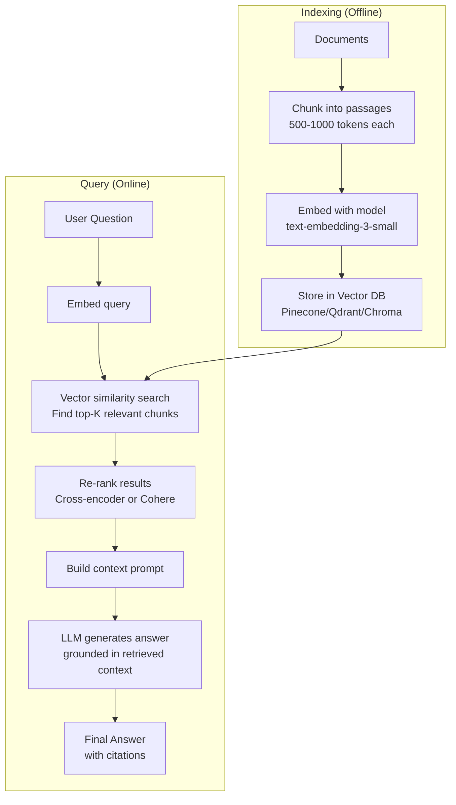

# Advanced Concepts & Techniques — Semi-Supervised, Self-Supervised, AutoML, XAI, Edge AI

```
╔══════════════════════════════════════════════════════════════════════════════════════╗
║                    ADVANCED ML/DL CONCEPTS THAT WERE MISSING                          ║
║     Semi-Supervised • Active Learning • Federated • Edge AI • MLOps • Fairness       ║
╚══════════════════════════════════════════════════════════════════════════════════════╝
```

---

## 1. SEMI-SUPERVISED LEARNING

```
┌─────────────────────────────────────────────────────────────────────────────────────┐
│                    SEMI-SUPERVISED LEARNING                                            │
│          "Use a LITTLE labeled data + a LOT of unlabeled data"                       │
├─────────────────────────────────────────────────────────────────────────────────────┤
│                                                                                      │
│  PROBLEM: Labeling is expensive. You have 100 labeled + 10,000 unlabeled samples.   │
│  SOLUTION: Use unlabeled data to learn better representations.                       │
│                                                                                      │
│  METHODS:                                                                            │
│                                                                                      │
│  ┌─── Self-Training (Pseudo-Labels) ─────────────────────────────────────────────┐  │
│  │ 1. Train model on labeled data                                                 │  │
│  │ 2. Predict on unlabeled data                                                   │  │
│  │ 3. Add high-confidence predictions as pseudo-labels                            │  │
│  │ 4. Retrain on labeled + pseudo-labeled data                                    │  │
│  │ 5. Repeat                                                                      │  │
│  │ Simple but effective! Used in: NoisyStudent (vision), UDA                     │  │
│  └────────────────────────────────────────────────────────────────────────────────┘  │
│                                                                                      │
│  ┌─── Consistency Regularization ────────────────────────────────────────────────┐  │
│  │ Idea: Same input with different augmentations → should give same prediction   │  │
│  │ Models: MeanTeacher, Temporal Ensemble, FixMatch, UDA                          │  │
│  │                                                                                │  │
│  │ FixMatch (state-of-the-art):                                                   │  │
│  │ 1. Weakly augment x → get pseudo-label if confidence > τ                     │  │
│  │ 2. Strongly augment same x → model should predict same label                 │  │
│  │ 3. Loss = supervised_loss + consistency_loss                                  │  │
│  └────────────────────────────────────────────────────────────────────────────────┘  │
│                                                                                      │
│  ┌─── Label Propagation ─────────────────────────────────────────────────────────┐  │
│  │ Build graph where similar points are connected                                 │  │
│  │ Propagate labels through graph to unlabeled points                            │  │
│  │ Graph-based, works when data has cluster structure                            │  │
│  └────────────────────────────────────────────────────────────────────────────────┘  │
│                                                                                      │
│  ┌─── Co-Training ──────────────────────────────────────────────────────────────┐   │
│  │ Two models trained on different "views" of data                                │   │
│  │ Each labels data for the other                                                 │   │
│  │ Works when features are naturally split (text + images)                       │   │
│  └────────────────────────────────────────────────────────────────────────────────┘  │
│                                                                                      │
│  WHEN TO USE:                                                                        │
│  ✓ Small labeled dataset (50-5K labels) + large unlabeled pool                     │
│  ✓ Labeling is expensive (medical images, expert annotation)                        │
│  ✓ Data has natural cluster structure                                                │
│  ✗ Labeled data is completely random (no structure to exploit)                      │
│                                                                                      │
└─────────────────────────────────────────────────────────────────────────────────────┘
```

---

## 2. ACTIVE LEARNING

```
┌─────────────────────────────────────────────────────────────────────────────────────┐
│                    ACTIVE LEARNING                                                     │
│          "Intelligently choose WHICH samples to label next"                           │
├─────────────────────────────────────────────────────────────────────────────────────┤
│                                                                                      │
│  PROBLEM: Budget for 500 labels. Which 500 (out of 100K) to annotate?              │
│  KEY IDEA: Label the most INFORMATIVE samples first.                                 │
│                                                                                      │
│  LOOP:                                                                               │
│  1. Train model on current labeled set                                              │
│  2. Select most informative unlabeled samples (acquisition function)                │
│  3. Human annotates selected samples                                                │
│  4. Add to labeled set → repeat                                                    │
│                                                                                      │
│  ACQUISITION STRATEGIES:                                                             │
│  ┌───────────────────────────────────────────────────────────────────┐              │
│  │ Strategy             │ Select samples where...           │ Best For│              │
│  │──────────────────────│───────────────────────────────────│─────────│              │
│  │ Uncertainty Sampling │ Model is least confident          │ Simple  │              │
│  │ Entropy              │ Prediction entropy is highest    │ Multi-cls│              │
│  │ Query-by-Committee   │ Ensemble members disagree most   │ Robust  │              │
│  │ Expected Model Change│ Would change model weights most  │ Research│              │
│  │ Diversity/CoreSet    │ Covers diverse regions of space  │ CV      │              │
│  │ Bayesian (BALD)      │ Highest mutual information       │ Advanced│              │
│  └───────────────────────────────────────────────────────────────────┘              │
│                                                                                      │
│  RESULT: Often achieve 95% of full-data performance with 10-20% of labels!         │
│                                                                                      │
│  TOOLS: modAL (Python), Prodigy (annotation + AL), Label Studio                    │
│                                                                                      │
│  WHEN TO USE:                                                                        │
│  ✓ Labeling is expensive (human expert needed)                                      │
│  ✓ Large unlabeled pool available                                                    │
│  ✓ Iterative annotation workflow is feasible                                        │
│  ✓ Medical imaging, NER, document classification                                    │
│                                                                                      │
└─────────────────────────────────────────────────────────────────────────────────────┘
```

---

## 3. FEW-SHOT & ZERO-SHOT LEARNING

```
┌─────────────────────────────────────────────────────────────────────────────────────┐
│                    FEW-SHOT & ZERO-SHOT LEARNING                                      │
├─────────────────────────────────────────────────────────────────────────────────────┤
│                                                                                      │
│  ZERO-SHOT: Classify categories NEVER seen during training                          │
│  ══════════                                                                          │
│  • LLM prompting: "Classify this text as positive/negative"                        │
│  • CLIP: Match image to text descriptions of new categories                        │
│  • Mechanism: Use semantic understanding, not pattern matching                       │
│                                                                                      │
│  FEW-SHOT: Learn from 1-5 examples per class                                       │
│  ══════════                                                                          │
│  Methods:                                                                            │
│  • LLM in-context learning: Provide examples in prompt                             │
│  • Siamese Networks: Learn similarity function                                      │
│  • Prototypical Networks: Compute class prototypes in embedding space              │
│  • Matching Networks: Attention over support set                                    │
│  • MAML (Model-Agnostic Meta-Learning): Learn to learn quickly                     │
│                                                                                      │
│  META-LEARNING ("Learning to Learn"):                                                │
│  ══════════════════════════════════                                                   │
│  Train on many TASKS, not many samples:                                             │
│  • Episode: Sample a task (5 classes, 5 examples each)                             │
│  • Inner loop: Adapt to task in few gradient steps                                  │
│  • Outer loop: Update meta-parameters to adapt faster                               │
│  • After training: Can learn new tasks from few examples                            │
│                                                                                      │
│  2024 REALITY:                                                                       │
│  • For NLP: Just use LLM few-shot prompting (GPT-4, Claude) — it works.           │
│  • For Vision: Use CLIP zero-shot or fine-tune ViT with few samples               │
│  • Meta-learning largely superseded by foundation model + fine-tuning              │
│                                                                                      │
└─────────────────────────────────────────────────────────────────────────────────────┘
```

---

## 4. FEDERATED LEARNING

```
┌─────────────────────────────────────────────────────────────────────────────────────┐
│                    FEDERATED LEARNING                                                  │
│          "Train models WITHOUT centralizing data"                                     │
├─────────────────────────────────────────────────────────────────────────────────────┤
│                                                                                      │
│  PROBLEM: Data privacy — can't share medical records, financial data, etc.          │
│  SOLUTION: Keep data local, share only MODEL UPDATES.                                │
│                                                                                      │
│  HOW IT WORKS (FedAvg):                                                              │
│  1. Server sends model to all clients (hospitals, phones, etc.)                     │
│  2. Each client trains on LOCAL data → computes gradients                           │
│  3. Clients send gradients/weights to server (NOT raw data!)                        │
│  4. Server averages all client updates → new global model                           │
│  5. Repeat                                                                           │
│                                                                                      │
│  CHALLENGES:                                                                         │
│  • Non-IID data: Each client has different data distribution                       │
│  • Communication cost: Sending model updates over network                           │
│  • Stragglers: Slow clients hold up training                                        │
│  • Privacy attacks: Gradients can leak information                                  │
│    → Fix: Differential Privacy (add noise to gradients)                             │
│    → Fix: Secure Aggregation (encrypted updates)                                    │
│                                                                                      │
│  USE CASES:                                                                          │
│  • Google Keyboard (Gboard): Next-word prediction without uploading texts           │
│  • Hospital networks: Collaborative medical AI without sharing patient data        │
│  • Financial institutions: Fraud detection across banks                             │
│  • Edge devices: IoT model training on-device                                       │
│                                                                                      │
│  TOOLS: Flower (framework), PySyft, TFF (TensorFlow Federated), NVIDIA FLARE      │
│                                                                                      │
└─────────────────────────────────────────────────────────────────────────────────────┘
```

---

## 5. EDGE AI & MODEL DEPLOYMENT ON DEVICES

```
┌─────────────────────────────────────────────────────────────────────────────────────┐
│                    EDGE AI — ML ON DEVICES                                             │
├─────────────────────────────────────────────────────────────────────────────────────┤
│                                                                                      │
│  WHY EDGE: Latency, Privacy, Bandwidth, Offline capability                          │
│                                                                                      │
│  DEPLOYMENT TARGETS:                                                                 │
│  ┌───────────────────────────────────────────────────────────────────┐              │
│  │ Target             │ Framework         │ Example Model             │              │
│  │────────────────────│───────────────────│───────────────────────────│              │
│  │ iPhone/iPad        │ Core ML           │ MobileNet, DistilBERT    │              │
│  │ Android            │ TFLite, ONNX RT   │ EfficientNet-Lite        │              │
│  │ Raspberry Pi       │ TFLite, ONNX      │ YOLOv8-nano             │              │
│  │ NVIDIA Jetson      │ TensorRT          │ YOLOv8-medium           │              │
│  │ Microcontrollers   │ TFLite Micro      │ Keyword spotting (<50KB) │              │
│  │ Browser            │ TensorFlow.js     │ PoseNet, face-mesh       │              │
│  │ Edge TPU           │ Edge TPU Compiler │ Quantized models         │              │
│  └───────────────────────────────────────────────────────────────────┘              │
│                                                                                      │
│  OPTIMIZATION PIPELINE:                                                              │
│  Train (FP32) → Quantize (INT8/INT4) → Optimize (TensorRT) → Deploy               │
│                                                                                      │
│  MODEL SIZE TARGETS:                                                                 │
│  • Microcontroller: <100KB (TinyML)                                                 │
│  • Mobile: <10MB (MobileNet, EfficientNet-Lite)                                    │
│  • Edge GPU: <100MB (YOLOv8, DistilBERT)                                           │
│  • Cloud: No limit (GPT-4, etc.)                                                    │
│                                                                                      │
│  TECHNIQUES:                                                                         │
│  • Quantization: FP32 → INT8 (4x smaller, 2-3x faster)                            │
│  • Pruning: Remove 80-90% of weights                                               │
│  • Knowledge Distillation: Large → Small model                                     │
│  • Architecture Design: MobileNet, EfficientNet-Lite, TinyBERT                    │
│  • Neural Architecture Search: Find optimal small architectures                     │
│                                                                                      │
│  TOOLS:                                                                              │
│  • Edge Impulse: No-code TinyML platform                                            │
│  • NVIDIA TAO: Transfer learning toolkit for edge                                   │
│  • Apache TVM: Compiler for any hardware target                                    │
│  • ONNX: Universal model exchange format                                            │
│                                                                                      │
└─────────────────────────────────────────────────────────────────────────────────────┘
```

---

## 6. ML MONITORING & DATA DRIFT

```
┌─────────────────────────────────────────────────────────────────────────────────────┐
│                    ML MONITORING IN PRODUCTION                                         │
├─────────────────────────────────────────────────────────────────────────────────────┤
│                                                                                      │
│  TYPES OF DRIFT:                                                                     │
│  ┌───────────────────────────────────────────────────────────────────┐              │
│  │ Type              │ What Changes           │ Example               │              │
│  │───────────────────│────────────────────────│───────────────────────│              │
│  │ Data Drift        │ Input distribution     │ New customer segments │              │
│  │ Concept Drift     │ P(y|x) changes         │ Fraud patterns change │              │
│  │ Feature Drift     │ Individual features    │ New categories appear │              │
│  │ Label Drift       │ Target distribution    │ More positives over time│             │
│  │ Model Degradation │ Performance decreases  │ Accuracy drops 5%     │              │
│  └───────────────────────────────────────────────────────────────────┘              │
│                                                                                      │
│  DETECTION METHODS:                                                                  │
│  • Statistical tests: KS-test, Chi-squared, PSI (Population Stability Index)       │
│  • Performance monitoring: Track accuracy/F1 over time windows                      │
│  • Feature distribution: Compare train vs production distributions                  │
│  • Prediction distribution: Monitor output distribution changes                     │
│                                                                                      │
│  WHAT TO MONITOR:                                                                    │
│  • Model performance metrics (accuracy, latency, throughput)                        │
│  • Input data quality (missing values, out-of-range, schema violations)             │
│  • Prediction distribution (confidence scores, class balance)                       │
│  • Feature distributions (statistical tests on each feature)                        │
│  • Infrastructure (GPU utilization, memory, queue depth)                            │
│                                                                                      │
│  TOOLS: Evidently AI, WhyLabs, Arize, NannyML, Fiddler                             │
│                                                                                      │
│  RETRAINING STRATEGIES:                                                              │
│  • Scheduled: Retrain weekly/monthly regardless                                     │
│  • Triggered: Retrain when drift detected above threshold                          │
│  • Continuous: Online learning, update with each new batch                          │
│                                                                                      │
└─────────────────────────────────────────────────────────────────────────────────────┘
```

---

## 7. FAIRNESS, BIAS & RESPONSIBLE AI

```
┌─────────────────────────────────────────────────────────────────────────────────────┐
│                    ML FAIRNESS & BIAS                                                  │
├─────────────────────────────────────────────────────────────────────────────────────┤
│                                                                                      │
│  TYPES OF BIAS:                                                                      │
│  • Historical bias: Training data reflects past discrimination                      │
│  • Representation bias: Underrepresented groups in training data                    │
│  • Measurement bias: Features measured differently across groups                    │
│  • Aggregation bias: One model for diverse subpopulations                          │
│  • Evaluation bias: Benchmarks don't represent real users                          │
│                                                                                      │
│  FAIRNESS METRICS:                                                                   │
│  • Demographic Parity: P(ŷ=1|A=0) = P(ŷ=1|A=1)                                   │
│  • Equal Opportunity: P(ŷ=1|y=1,A=0) = P(ŷ=1|y=1,A=1)                            │
│  • Equalized Odds: Equal FPR and TPR across groups                                 │
│  • Calibration: P(y=1|ŷ=p) = p for all groups                                     │
│                                                                                      │
│  NOTE: These metrics CONFLICT — can't satisfy all simultaneously!                   │
│                                                                                      │
│  MITIGATION STRATEGIES:                                                              │
│  • Pre-processing: Rebalance data, remove sensitive features                       │
│  • In-processing: Fairness constraints in loss function                            │
│  • Post-processing: Adjust thresholds per group                                    │
│                                                                                      │
│  TOOLS: Fairlearn (Microsoft), AI Fairness 360 (IBM), What-If Tool (Google)        │
│                                                                                      │
│  REAL FAILURES:                                                                      │
│  • Amazon resume screening: Biased against women                                   │
│  • COMPAS recidivism: Higher false positive for Black defendants                    │
│  • Facial recognition: Lower accuracy for darker skin tones                        │
│  • Healthcare algorithms: Systematically under-referred Black patients             │
│                                                                                      │
└─────────────────────────────────────────────────────────────────────────────────────┘
```

---

## 8. ONLINE LEARNING & INCREMENTAL LEARNING

```
┌─────────────────────────────────────────────────────────────────────────────────────┐
│                    ONLINE / INCREMENTAL LEARNING                                      │
├─────────────────────────────────────────────────────────────────────────────────────┤
│                                                                                      │
│  WHAT: Update model continuously as new data arrives (no full retraining)           │
│                                                                                      │
│  BATCH LEARNING:      Train once → Deploy → Eventually stale                       │
│  ONLINE LEARNING:     Update model with each new sample/batch                       │
│                                                                                      │
│  METHODS:                                                                            │
│  • SGD with mini-batches: Natural online algorithm                                  │
│  • Passive-Aggressive: Update only when prediction wrong                           │
│  • Online Random Forest: Add new trees, retire old ones                            │
│  • Vowpal Wabbit: High-speed online learning system                                │
│                                                                                      │
│  CHALLENGES:                                                                         │
│  • Catastrophic forgetting: New data overwrites old knowledge                      │
│  • Concept drift: Need to forget old patterns AND learn new ones                   │
│  • Evaluation: How to evaluate a constantly changing model?                         │
│                                                                                      │
│  USE CASES:                                                                          │
│  • Recommendation systems (user preferences change hourly)                          │
│  • Ad click prediction (trends change constantly)                                   │
│  • Fraud detection (new attack patterns emerge)                                     │
│  • Stock trading (market conditions change)                                         │
│                                                                                      │
│  TOOLS: River (Python online ML), Vowpal Wabbit, Kafka + Flink (streaming)         │
│                                                                                      │
└─────────────────────────────────────────────────────────────────────────────────────┘
```

---

## 9. KEY BENCHMARKS & DATASETS

```
┌─────────────────────────────────────────────────────────────────────────────────────┐
│                    STANDARD BENCHMARKS                                                 │
├─────────────────────────────────────────────────────────────────────────────────────┤
│                                                                                      │
│  COMPUTER VISION:                                                                    │
│  ┌───────────────────────────────────────────────────────────────────┐              │
│  │ Dataset        │ Size        │ Task              │ Metric          │              │
│  │────────────────│─────────────│───────────────────│─────────────────│              │
│  │ ImageNet       │ 14M images  │ Classification    │ Top-1/Top-5 Acc │              │
│  │ COCO           │ 330K images │ Detection/Seg     │ mAP@0.5:0.95   │              │
│  │ ADE20K         │ 25K images  │ Sem. Segmentation│ mIoU            │              │
│  │ CIFAR-10/100   │ 60K images  │ Classification    │ Accuracy        │              │
│  │ Pascal VOC     │ 11K images  │ Detection         │ mAP@0.5        │              │
│  └───────────────────────────────────────────────────────────────────┘              │
│                                                                                      │
│  NLP:                                                                                │
│  ┌───────────────────────────────────────────────────────────────────┐              │
│  │ Benchmark      │ Tasks                  │ What it measures         │              │
│  │────────────────│────────────────────────│─────────────────────────│              │
│  │ GLUE/SuperGLUE │ 8-9 NLU tasks          │ Language understanding  │              │
│  │ SQuAD          │ Reading comprehension   │ QA accuracy            │              │
│  │ MMLU           │ 57 subjects            │ Knowledge + reasoning   │              │
│  │ HumanEval      │ Code generation        │ Functional correctness  │              │
│  │ MT-Bench       │ Multi-turn conversation│ LLM quality (GPT-4 judge)│             │
│  │ HELM           │ Holistic evaluation    │ Many dimensions          │              │
│  └───────────────────────────────────────────────────────────────────┘              │
│                                                                                      │
│  TABULAR:                                                                            │
│  • UCI ML Repository: Classic benchmark datasets                                    │
│  • Kaggle competitions: Real-world tabular challenges                               │
│  • OpenML: Reproducible benchmark suite                                             │
│                                                                                      │
└─────────────────────────────────────────────────────────────────────────────────────┘
```

---

## 10. DECODING STRATEGIES FOR GENERATION

```
┌─────────────────────────────────────────────────────────────────────────────────────┐
│                    TEXT GENERATION — DECODING STRATEGIES                               │
├─────────────────────────────────────────────────────────────────────────────────────┤
│                                                                                      │
│  LLMs produce probability distribution over vocabulary at each step.                │
│  HOW to pick the next token?                                                         │
│                                                                                      │
│  ┌───────────────────────────────────────────────────────────────────┐              │
│  │ Strategy         │ How                      │ Quality/Diversity    │              │
│  │──────────────────│──────────────────────────│──────────────────────│              │
│  │ Greedy           │ Pick highest prob token  │ Repetitive, boring   │              │
│  │ Beam Search      │ Keep top-B candidates    │ Good for translation │              │
│  │ Top-K            │ Sample from top-K tokens │ More diverse         │              │
│  │ Top-P (Nucleus)  │ Sample from smallest set │ Best general choice  │              │
│  │                  │ whose probs sum > p      │                      │              │
│  │ Temperature      │ Divide logits by T       │ T<1: focused         │              │
│  │                  │ before softmax           │ T>1: creative        │              │
│  │ Contrastive      │ Penalize repetition      │ Reduces degeneration │              │
│  └───────────────────────────────────────────────────────────────────┘              │
│                                                                                      │
│  PRACTICAL SETTINGS:                                                                 │
│  • Factual answers: temperature=0 (greedy), or temp=0.1 + top_p=0.9               │
│  • Creative writing: temperature=0.7-1.0 + top_p=0.95                              │
│  • Code generation: temperature=0-0.2 (want correctness)                           │
│  • Brainstorming: temperature=1.0+ top_p=0.95 + top_k=50                          │
│                                                                                      │
│  SPECULATIVE DECODING:                                                               │
│  • Use small model to draft N tokens quickly                                        │
│  • Verify with large model in one forward pass                                     │
│  • Accept valid tokens, reject and regenerate invalid ones                          │
│  • Result: 2-3x speedup with NO quality loss!                                      │
│                                                                                      │
└─────────────────────────────────────────────────────────────────────────────────────┘
```

---

## 11. PROMPT ENGINEERING PATTERNS

```
┌─────────────────────────────────────────────────────────────────────────────────────┐
│                    PROMPT ENGINEERING TAXONOMY                                         │
├─────────────────────────────────────────────────────────────────────────────────────┤
│                                                                                      │
│  BASIC PATTERNS:                                                                     │
│  • Zero-shot: Just describe the task                                                │
│  • Few-shot: Provide examples in prompt                                             │
│  • System prompt: Set behavior/persona                                              │
│                                                                                      │
│  ADVANCED PATTERNS:                                                                  │
│  ┌───────────────────────────────────────────────────────────────────┐              │
│  │ Pattern                │ Technique                    │ Use Case   │              │
│  │────────────────────────│──────────────────────────────│────────────│              │
│  │ Chain-of-Thought (CoT) │ "Let's think step by step"  │ Reasoning  │              │
│  │ Tree-of-Thought (ToT)  │ Explore multiple paths      │ Planning   │              │
│  │ ReAct                  │ Reason + Act (tool use)     │ Agents     │              │
│  │ Self-Consistency       │ Sample N answers, vote      │ Accuracy   │              │
│  │ Reflexion              │ Self-critique and retry     │ Code gen   │              │
│  │ RAG                    │ Retrieve context first      │ Factuality │              │
│  │ Decomposition          │ Break into sub-problems     │ Complex Q  │              │
│  └───────────────────────────────────────────────────────────────────┘              │
│                                                                                      │
│  CHAIN-OF-THOUGHT (Most Important):                                                  │
│  Without: "What is 23 × 47?" → [often wrong]                                       │
│  With CoT: "What is 23 × 47? Think step by step."                                  │
│  → "23 × 47 = 23 × 40 + 23 × 7 = 920 + 161 = 1081" [correct]                     │
│                                                                                      │
│  FUNCTION CALLING / TOOL USE:                                                        │
│  • LLM decides WHICH tool to call and with WHAT arguments                          │
│  • Tools: calculator, search, database, API, code execution                        │
│  • Frameworks: LangChain Tools, OpenAI Function Calling                             │
│                                                                                      │
└─────────────────────────────────────────────────────────────────────────────────────┘
```

---

## 12. RAG (RETRIEVAL-AUGMENTED GENERATION) — ARCHITECTURE



```
┌─────────────────────────────────────────────────────────────────────────────────────┐
│  RAG BEST PRACTICES:                                                                  │
│                                                                                      │
│  CHUNKING: Recursive character split (500-1000 tokens, 100 overlap)                 │
│  EMBEDDING: text-embedding-3-small (OpenAI) or BGE/GTE (open-source)               │
│  RETRIEVAL: Hybrid search (vector + BM25 keyword) often best                       │
│  RE-RANKING: Cross-encoder re-ranks top-20 → top-5 (major quality boost)           │
│  GENERATION: Include retrieved context in system/user prompt                        │
│  EVALUATION: Faithfulness, relevance, context recall (RAGAS framework)              │
│                                                                                      │
│  WHEN TO USE RAG:                                                                    │
│  ✓ Need factual answers from specific documents                                    │
│  ✓ Information changes frequently (can't retrain LLM)                              │
│  ✓ Domain-specific knowledge not in LLM training data                              │
│  ✓ Need citations/sources for answers                                               │
│  ✓ Enterprise use cases (internal docs, policies, KB)                              │
│                                                                                      │
│  WHEN NOT TO USE RAG:                                                                │
│  ✗ General knowledge questions (LLM knows it already)                               │
│  ✗ Creative generation (no source document to retrieve)                            │
│  ✗ Real-time chat with no knowledge base                                           │
│                                                                                      │
└─────────────────────────────────────────────────────────────────────────────────────┘
```

---

## 13. KEY TAKEAWAYS

1. **Semi-supervised learning** solves the "small labeled data" problem — use pseudo-labels and consistency
2. **Active learning** maximizes value of annotation budget — label what's most informative
3. **Federated learning** enables collaboration without sharing data — critical for healthcare/finance
4. **Edge AI** requires compression (quantization, distillation, pruning) — not just smaller models
5. **Monitor production models** — data drift will degrade performance over time
6. **Fairness is a design choice** — bias in, bias out; measure and mitigate actively
7. **RAG is the pattern for grounded LLM applications** — retrieval + generation beats pure LLM
8. **Prompt engineering is a skill** — CoT, few-shot, and tool use significantly boost LLM performance
9. **Decoding strategy matters** — temperature and top-p control creativity vs accuracy tradeoff

---

*End of advanced concepts. Return to [README.md](./README.md) for full index.*
