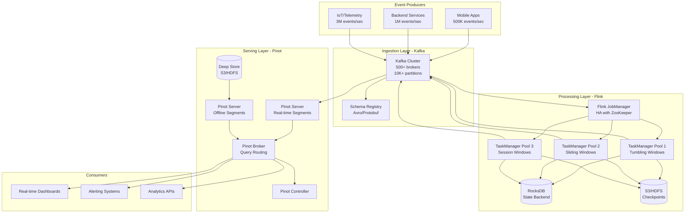

# Real-Time Event Aggregation at Scale (Uber/LinkedIn Style)

## Problem Statement

At billion-scale companies like Uber and LinkedIn, millions of events per second must be aggregated in real-time to power dashboards, alerting, and operational decisions. Uber processes 1+ trillion messages/day across its Kafka clusters; LinkedIn ingests 7+ trillion messages/day. The challenge: aggregate these events with sub-minute latency, handle late-arriving data gracefully, and guarantee exactly-once semantics — all while maintaining cost efficiency.

**Key Requirements:**
- Ingest 2-5 million events/second sustained, 10M+ at peak
- Aggregate with <30s end-to-end latency (event time to query-ready)
- Handle late data arriving up to 7 days after event time
- Exactly-once processing guarantees
- Query aggregated results with p99 < 200ms

---

## Architecture Diagram



---

## Component Breakdown

### 1. Kafka Ingestion Layer

**Cluster Configuration (Production):**
```properties
# Broker config (500+ brokers)
num.partitions=128  # per topic default
default.replication.factor=3
min.insync.replicas=2
log.retention.hours=168  # 7 days
log.segment.bytes=1073741824  # 1GB segments
compression.type=lz4
message.max.bytes=10485760  # 10MB max message

# Performance tuning
num.network.threads=16
num.io.threads=16
socket.send.buffer.bytes=1048576
socket.receive.buffer.bytes=1048576
num.replica.fetchers=4
replica.fetch.max.bytes=10485760
```

**Topic Design:**
- `events.raw.rides` — 512 partitions, keyed by `city_id`
- `events.raw.driver_location` — 1024 partitions, keyed by `driver_id`
- `events.aggregated.1min` — 256 partitions, keyed by `city_id + metric`
- `events.aggregated.5min` — 128 partitions
- `events.aggregated.1hr` — 64 partitions

**Producer Configuration:**
```properties
acks=all
enable.idempotence=true
max.in.flight.requests.per.connection=5
retries=2147483647
delivery.timeout.ms=120000
linger.ms=5
batch.size=65536
compression.type=lz4
```

### 2. Flink Processing Layer

**Cluster Sizing (Production):**
- JobManager: 3 nodes (HA), 16GB heap each
- TaskManagers: 200+ nodes, 32GB heap, 8 task slots each
- Total parallelism: 1600 slots
- State backend: RocksDB with incremental checkpoints
- Checkpoint interval: 60 seconds
- Checkpoint storage: S3 with 3-day retention

**Window Types Implemented:**

#### Tumbling Windows (Fixed, Non-overlapping)
```java
// 1-minute tumbling window for ride count per city
DataStream<RideEvent> rides = env.addSource(kafkaSource);

rides
    .keyBy(event -> event.getCityId())
    .window(TumblingEventTimeWindows.of(Time.minutes(1)))
    .allowedLateness(Time.minutes(5))
    .sideOutputLateData(lateOutputTag)
    .aggregate(new RideCountAggregate(), new RideWindowFunction())
    .addSink(kafkaSink);
```

#### Sliding Windows (Overlapping)
```java
// 5-minute window sliding every 1 minute for moving averages
rides
    .keyBy(event -> event.getCityId())
    .window(SlidingEventTimeWindows.of(Time.minutes(5), Time.minutes(1)))
    .allowedLateness(Time.minutes(10))
    .aggregate(new AvgFareAggregate())
    .addSink(kafkaSink);
```

#### Session Windows (Gap-based)
```java
// Session windows with 30-minute gap for user sessions
userEvents
    .keyBy(event -> event.getUserId())
    .window(EventTimeSessionWindows.withGap(Time.minutes(30)))
    .allowedLateness(Time.hours(1))
    .process(new SessionAnalyticsFunction())
    .addSink(kafkaSink);
```

### 3. Watermark Strategy

```java
WatermarkStrategy<RideEvent> watermarkStrategy = WatermarkStrategy
    .<RideEvent>forBoundedOutOfOrderness(Duration.ofSeconds(30))
    .withTimestampAssigner((event, timestamp) -> event.getEventTime())
    .withIdleness(Duration.ofMinutes(1));

// Custom watermark for multi-source alignment
public class MultiSourceWatermarkGenerator implements WatermarkGenerator<RideEvent> {
    private long maxTimestamp = Long.MIN_VALUE;
    private final long maxOutOfOrderness = 30_000L; // 30 seconds

    @Override
    public void onEvent(RideEvent event, long eventTimestamp, WatermarkOutput output) {
        maxTimestamp = Math.max(maxTimestamp, eventTimestamp);
    }

    @Override
    public void onPeriodicEmit(WatermarkOutput output) {
        output.emitWatermark(new Watermark(maxTimestamp - maxOutOfOrderness - 1));
    }
}
```

### 4. Apache Pinot Serving Layer

**Table Configuration:**
```json
{
  "tableName": "ride_aggregations_REALTIME",
  "tableType": "REALTIME",
  "segmentsConfig": {
    "timeColumnName": "window_end_time",
    "timeType": "MILLISECONDS",
    "retentionTimeUnit": "DAYS",
    "retentionTimeValue": "30",
    "replication": "3"
  },
  "tableIndexConfig": {
    "invertedIndexColumns": ["city_id", "metric_type"],
    "sortedColumn": ["window_end_time"],
    "starTreeIndexConfigs": [{
      "dimensionsSplitOrder": ["city_id", "metric_type"],
      "functionColumnPairs": ["SUM__ride_count", "AVG__fare_amount"],
      "maxLeafRecords": 10000
    }]
  },
  "streamConfigs": {
    "streamType": "kafka",
    "stream.kafka.topic.name": "events.aggregated.1min",
    "stream.kafka.broker.list": "kafka-broker:9092",
    "stream.kafka.consumer.type": "lowlevel",
    "realtime.segment.flush.threshold.rows": "500000",
    "realtime.segment.flush.threshold.time": "3600000"
  }
}
```

---

## Data Flow Explanation

### End-to-End Event Lifecycle

1. **Event Generation (t=0ms):** Mobile app emits ride-completed event with event timestamp
2. **Kafka Ingestion (t=5-15ms):** Event lands in Kafka partition, assigned offset
3. **Flink Consumption (t=15-50ms):** Flink source operator reads event, extracts event-time watermark
4. **Window Assignment (t=50-55ms):** Event assigned to appropriate window(s)
5. **Aggregation (t=55ms - window_end):** Event contributes to in-progress aggregation in RocksDB state
6. **Window Trigger (t=window_end + watermark_delay):** Window fires, emits aggregated result
7. **Kafka Output (t=trigger + 5ms):** Aggregated result written to output Kafka topic
8. **Pinot Ingestion (t=trigger + 50ms):** Real-time server consumes and indexes result
9. **Query Available (t=trigger + 100ms):** Result queryable via Pinot SQL

**Total End-to-End Latency:** ~30 seconds (dominated by window duration + watermark delay)

### Late Data Handling

```
Timeline:
─────────────────────────────────────────────────────>
|-- Window [0:00-1:00] --|
                         |-- Allowed Lateness 5min --|
                                                     |-- Side Output (DLQ) --|

Events arriving during window: Normal aggregation
Events arriving during allowed lateness: Update fired result (retraction)
Events arriving after allowed lateness: Side output → separate correction pipeline
```

---

## Exactly-Once Semantics

### Kafka → Flink (Source)
- Flink commits Kafka offsets only during successful checkpoints
- On failure, Flink restores state and replays from last committed offset
- Deduplication via event-time windows naturally handles replayed events

### Flink Internal
- Checkpointing with exactly-once barrier alignment
- RocksDB incremental snapshots every 60 seconds
- Aligned checkpoints for exactly-once; unaligned for low-latency (trade-off)

### Flink → Kafka (Sink)
- Two-phase commit protocol via `TwoPhaseCommitSinkFunction`
- Kafka transactions with `transaction.timeout.ms=900000` (15 min)
- Pre-commit on checkpoint barrier, commit on checkpoint completion

```java
// Exactly-once sink configuration
KafkaSink<AggregatedResult> sink = KafkaSink.<AggregatedResult>builder()
    .setBootstrapServers("kafka:9092")
    .setDeliverGuarantee(DeliveryGuarantee.EXACTLY_ONCE)
    .setTransactionalIdPrefix("flink-agg-")
    .setRecordSerializer(new AggResultSerializer())
    .build();
```

---

## Scaling Strategies

### Kafka Scaling
| Metric | Threshold | Action |
|--------|-----------|--------|
| Partition lag > 100K | Auto | Add consumer instances |
| Broker disk > 70% | Auto | Add brokers, rebalance partitions |
| Producer latency p99 > 100ms | Manual | Increase partitions, add brokers |
| Inter-broker replication lag > 10K | Alert | Investigate network/disk |

### Flink Scaling
- **Reactive scaling:** Flink 1.13+ reactive mode auto-adjusts parallelism
- **Manual rescaling:** Change parallelism + restart from savepoint
- **Key group redistribution:** Flink automatically redistributes state on rescale

```yaml
# Kubernetes HPA for Flink TaskManagers
apiVersion: autoscaling/v2
kind: HorizontalPodAutoscaler
metadata:
  name: flink-taskmanager-hpa
spec:
  scaleTargetRef:
    apiVersion: apps/v1
    kind: Deployment
    name: flink-taskmanager
  minReplicas: 50
  maxReplicas: 300
  metrics:
  - type: External
    external:
      metric:
        name: kafka_consumer_lag
      target:
        type: AverageValue
        averageValue: "50000"
```

### Pinot Scaling
- Add real-time servers for ingestion throughput
- Add brokers for query throughput
- Segment replication for read scalability
- Star-tree index for pre-aggregation (100x query speedup)

---

## Failure Handling

### Kafka Failures
- **Broker failure:** ISR replicas take over; no data loss with `min.insync.replicas=2`
- **Partition leader failure:** Controller elects new leader from ISR within 10-30s
- **Full cluster failure:** Multi-DC replication via MirrorMaker 2 or Confluent Replicator

### Flink Failures
- **TaskManager failure:** JobManager reschedules tasks on remaining TMs; state restored from checkpoint
- **JobManager failure:** ZooKeeper-based HA; standby JM takes over within 30s
- **Checkpoint failure:** Retry with exponential backoff; fall back to last successful checkpoint
- **State corruption:** Restore from last valid checkpoint; worst case: reprocess from Kafka

```java
// Restart strategy configuration
env.setRestartStrategy(RestartStrategies.exponentialDelayRestart(
    Time.milliseconds(1000),   // initial delay
    Time.milliseconds(60000),  // max delay
    2.0,                       // backoff multiplier
    Time.hours(1),             // reset backoff threshold
    0.1                        // jitter
));
```

### Pinot Failures
- **Server failure:** Replicas serve queries; failed server rebuilt from deep store
- **Real-time ingestion failure:** Kafka offset tracked; resume from last committed
- **Segment corruption:** Re-download from deep store (S3/HDFS)

---

## Cost Optimization

### Infrastructure Costs (Estimated for 5M events/sec)

| Component | Instance Type | Count | Monthly Cost |
|-----------|--------------|-------|--------------|
| Kafka Brokers | i3.4xlarge (AWS) | 60 | $180,000 |
| Flink TaskManagers | r5.4xlarge | 200 | $320,000 |
| Flink JobManagers | m5.2xlarge | 3 | $2,400 |
| Pinot Servers | r5.8xlarge | 40 | $192,000 |
| Pinot Brokers | m5.2xlarge | 10 | $8,000 |
| S3 Storage (checkpoints + deep store) | - | - | $50,000 |
| **Total** | | | **~$750,000/mo** |

### Cost Reduction Strategies

1. **Tiered storage in Kafka:** Move old segments to S3 (60% storage cost reduction)
2. **Spot instances for Flink TMs:** With checkpoint recovery, 70% cost savings on compute
3. **Pre-aggregation:** Aggregate at source where possible, reducing event volume 10x
4. **Compression:** LZ4 on Kafka (3-5x compression), Pinot segment compression
5. **Data retention policies:** 7 days in Kafka, 30 days real-time in Pinot, archive to cold storage
6. **Right-sizing windows:** Larger windows = less state = fewer resources

---

## Real-World Companies Using This Pattern

| Company | Scale | Specifics |
|---------|-------|-----------|
| **Uber** | 1T+ messages/day | Trip aggregations, surge pricing, driver analytics |
| **LinkedIn** | 7T+ messages/day | Member activity aggregation, ad metrics, feed ranking |
| **Netflix** | 1.5T+ events/day | Viewing metrics, A/B test aggregation, QoE monitoring |
| **Pinterest** | 800B+ events/day | Pin engagement metrics, advertiser reporting |
| **Shopify** | 200B+ events/day | Merchant analytics, real-time GMV dashboards |
| **Alibaba** | Peak 3B events/sec | Double 11 real-time GMV, payment processing metrics |

---

## Key Lessons Learned

1. **Event-time vs processing-time:** Always use event-time for correct aggregations; processing-time only for monitoring
2. **Watermark tuning is critical:** Too aggressive = data loss; too conservative = high latency
3. **State size monitoring:** RocksDB state can grow unbounded with session windows; set TTL
4. **Checkpoint size impacts recovery time:** Keep state lean; use incremental checkpoints
5. **Partition count is hard to change:** Over-partition initially (10x expected parallelism)
6. **Exactly-once has throughput cost:** 10-30% throughput reduction vs at-least-once
7. **Late data handling is a business decision:** Define SLAs with stakeholders on data completeness windows

---

## Monitoring & Observability

### Key Metrics to Track

```yaml
# Flink metrics
flink_taskmanager_job_task_operator_numRecordsInPerSecond  # Throughput
flink_taskmanager_job_task_operator_currentInputWatermark   # Watermark progress
flink_taskmanager_job_task_checkpointAlignmentTime         # Checkpoint health
flink_taskmanager_Status_JVM_Memory_Heap_Used             # Memory pressure
flink_jobmanager_job_lastCheckpointDuration               # Checkpoint duration
flink_jobmanager_job_numberOfFailedCheckpoints            # Checkpoint failures

# Kafka metrics
kafka_server_BrokerTopicMetrics_MessagesInPerSec          # Ingestion rate
kafka_consumer_consumer_fetch_manager_records_lag_max     # Consumer lag
kafka_server_ReplicaManager_UnderReplicatedPartitions     # Replication health

# Pinot metrics
pinot_server_realtimeConsumptionRate                      # Ingestion rate
pinot_broker_queryExecutionTimeMs_p99                     # Query latency
pinot_server_segmentCount                                 # Segment count
```

### Alerting Rules
- Consumer lag > 500K messages for > 5 minutes → P1
- Checkpoint failure > 3 consecutive → P1
- Watermark stall > 2 minutes → P2
- Flink TaskManager loss > 10% of fleet → P1
- Pinot query p99 > 500ms → P2
