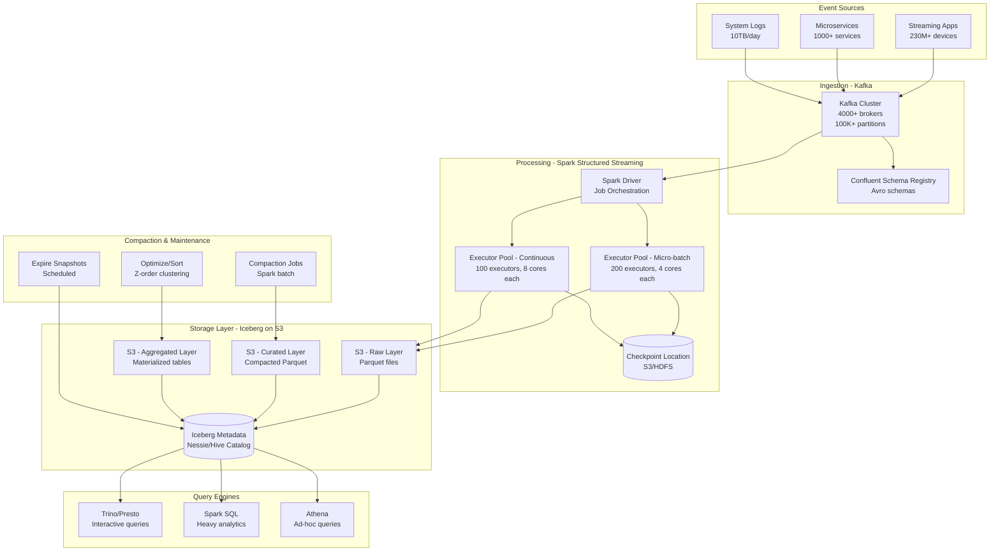

# Streaming Ingestion to Data Lake (Netflix Style)

## Problem Statement

Netflix processes over 1.5 trillion events per day from 230+ million subscribers across 190+ countries. These events — play starts, buffering events, UI interactions, error logs — must land in a queryable Data Lake within minutes for data scientists and engineers to analyze. The challenge: ingest petabytes of streaming data into a transactional lakehouse format that supports schema evolution, time-travel queries, and efficient analytical workloads — all while maintaining exactly-once guarantees and handling schema changes without downtime.

**Key Requirements:**
- Ingest 500GB-2TB/hour of raw event data continuously
- Data available for queries within 5-15 minutes of event generation
- Support schema evolution without rewriting historical data
- Enable time-travel queries for debugging and auditing
- Compact small files automatically to maintain query performance
- Maintain exactly-once semantics end-to-end

---

## Architecture Diagram



---

## Component Breakdown

### 1. Kafka Ingestion Layer

**Cluster Configuration (Netflix-scale):**
```properties
# 4000+ brokers across multiple regions
num.partitions=256
default.replication.factor=3
min.insync.replicas=2
log.retention.hours=72
log.segment.bytes=1073741824
compression.type=zstd
message.max.bytes=5242880

# Tiered storage (Confluent / custom)
confluent.tier.enable=true
confluent.tier.backend=S3
confluent.tier.local.hotset.ms=86400000  # 1 day local
```

**Schema Registry Configuration:**
```json
{
  "compatibilityLevel": "FORWARD_TRANSITIVE",
  "schema": {
    "type": "record",
    "name": "PlaybackEvent",
    "namespace": "com.netflix.events",
    "fields": [
      {"name": "event_id", "type": "string"},
      {"name": "user_id", "type": "long"},
      {"name": "title_id", "type": "long"},
      {"name": "event_type", "type": {"type": "enum", "symbols": ["PLAY_START", "PLAY_STOP", "BUFFER", "ERROR"]}},
      {"name": "timestamp_ms", "type": "long"},
      {"name": "device_type", "type": "string"},
      {"name": "country_code", "type": "string"},
      {"name": "bitrate_kbps", "type": ["null", "int"], "default": null},
      {"name": "metadata", "type": ["null", {"type": "map", "values": "string"}], "default": null}
    ]
  }
}
```

### 2. Spark Structured Streaming

**Micro-batch Processing (Default Mode):**
```python
from pyspark.sql import SparkSession
from pyspark.sql.functions import *
from pyspark.sql.avro.functions import from_avro

spark = SparkSession.builder \
    .appName("netflix-streaming-ingestion") \
    .config("spark.sql.shuffle.partitions", "400") \
    .config("spark.sql.streaming.stateStore.providerClass",
            "org.apache.spark.sql.execution.streaming.state.RocksDBStateStoreProvider") \
    .config("spark.sql.extensions", "org.apache.iceberg.spark.extensions.IcebergSparkSessionExtensions") \
    .config("spark.sql.catalog.lakehouse", "org.apache.iceberg.spark.SparkCatalog") \
    .config("spark.sql.catalog.lakehouse.type", "hadoop") \
    .config("spark.sql.catalog.lakehouse.warehouse", "s3://netflix-data-lake/warehouse") \
    .getOrCreate()

# Read from Kafka
raw_stream = spark.readStream \
    .format("kafka") \
    .option("kafka.bootstrap.servers", "kafka-cluster:9092") \
    .option("subscribe", "playback_events") \
    .option("startingOffsets", "latest") \
    .option("maxOffsetsPerTrigger", 5000000) \
    .option("kafka.consumer.fetch.max.bytes", "104857600") \
    .option("kafka.consumer.max.partition.fetch.bytes", "10485760") \
    .load()

# Deserialize Avro with schema registry
schema_registry_url = "http://schema-registry:8081"
avro_schema = get_schema_from_registry(schema_registry_url, "playback_events-value")

events = raw_stream \
    .select(from_avro(col("value"), avro_schema).alias("event")) \
    .select("event.*") \
    .withColumn("event_date", to_date(from_unixtime(col("timestamp_ms") / 1000))) \
    .withColumn("event_hour", hour(from_unixtime(col("timestamp_ms") / 1000)))

# Write to Iceberg with partitioning
query = events.writeStream \
    .format("iceberg") \
    .outputMode("append") \
    .option("path", "lakehouse.raw.playback_events") \
    .option("checkpointLocation", "s3://checkpoints/playback_events") \
    .option("fanout-enabled", "true") \
    .trigger(processingTime="60 seconds") \
    .start()
```

**Continuous Processing Mode (Low-latency):**
```python
# For latency-critical streams (sub-second delivery)
# Note: Limited operator support in continuous mode
low_latency_query = events \
    .filter(col("event_type") == "ERROR") \
    .writeStream \
    .format("iceberg") \
    .outputMode("append") \
    .option("path", "lakehouse.raw.error_events") \
    .option("checkpointLocation", "s3://checkpoints/error_events") \
    .trigger(continuous="1 second") \
    .start()
```

### 3. Micro-batch vs Continuous Processing

| Aspect | Micro-batch | Continuous |
|--------|------------|------------|
| Latency | 1-60 seconds (trigger interval) | ~1ms processing latency |
| Throughput | Higher (batch optimizations) | Lower (record-at-a-time) |
| Exactly-once | Full support | At-least-once only |
| Operators supported | All | Limited (map, filter, project) |
| Recovery time | Fast (from checkpoint) | Fast (from epoch markers) |
| Use case | Default for data lake | Error alerting, critical paths |

**Netflix's Approach:** Micro-batch with 60-second triggers for data lake ingestion (balances latency vs file size), continuous processing only for alerting pipelines.

### 4. Apache Iceberg Table Configuration

**Table Creation:**
```sql
CREATE TABLE lakehouse.raw.playback_events (
    event_id STRING,
    user_id BIGINT,
    title_id BIGINT,
    event_type STRING,
    timestamp_ms BIGINT,
    device_type STRING,
    country_code STRING,
    bitrate_kbps INT,
    metadata MAP<STRING, STRING>,
    event_date DATE,
    event_hour INT
)
USING iceberg
PARTITIONED BY (event_date, bucket(16, user_id))
TBLPROPERTIES (
    'write.format.default' = 'parquet',
    'write.parquet.compression-codec' = 'zstd',
    'write.target-file-size-bytes' = '536870912',  -- 512MB target
    'write.distribution-mode' = 'hash',
    'write.metadata.delete-after-commit.enabled' = 'true',
    'write.metadata.previous-versions-max' = '100',
    'read.split.target-size' = '134217728',  -- 128MB splits
    'write.object-storage.enabled' = 'true'
);
```

---

## Schema Evolution

### Adding New Columns (Forward Compatible)
```sql
-- Add new column without rewriting existing data
ALTER TABLE lakehouse.raw.playback_events
ADD COLUMN cdn_provider STRING AFTER country_code;

ALTER TABLE lakehouse.raw.playback_events
ADD COLUMN quality_score DOUBLE;

-- Existing Parquet files return NULL for new columns
-- New files contain the new columns
-- Zero downtime, zero rewrite
```

### Column Type Promotion
```sql
-- Widen int to long (safe promotion)
ALTER TABLE lakehouse.raw.playback_events
ALTER COLUMN bitrate_kbps TYPE BIGINT;

-- Supported promotions: int→long, float→double, decimal precision widening
```

### Schema Evolution Strategy
```python
# In streaming job: handle schema evolution gracefully
spark.conf.set("spark.sql.iceberg.handle-timestamp-without-timezone", "true")

# Merge schema on write (new columns from source automatically added)
events.writeStream \
    .format("iceberg") \
    .option("merge-schema", "true") \
    .option("path", "lakehouse.raw.playback_events") \
    .start()
```

---

## Compaction Strategy

### Small File Problem
Streaming writes create many small files (1 trigger = 1 file per partition). With 60-second triggers and 100 partitions, that's 144,000 files/day.

### Compaction Job
```python
# Scheduled every hour via Airflow/Dagster
from pyspark.sql import SparkSession

spark = SparkSession.builder \
    .appName("iceberg-compaction") \
    .config("spark.sql.extensions", "org.apache.iceberg.spark.extensions.IcebergSparkSessionExtensions") \
    .getOrCreate()

# Rewrite small files into optimally-sized files
spark.sql("""
    CALL lakehouse.system.rewrite_data_files(
        table => 'raw.playback_events',
        strategy => 'sort',
        sort_order => 'event_date ASC, user_id ASC',
        options => map(
            'target-file-size-bytes', '536870912',
            'min-file-size-bytes', '67108864',
            'max-file-size-bytes', '1073741824',
            'min-input-files', '5',
            'max-concurrent-file-group-rewrites', '50',
            'partial-progress.enabled', 'true',
            'partial-progress.max-commits', '10'
        ),
        where => 'event_date >= current_date() - interval 2 days'
    )
""")

# Expire old snapshots (keep 7 days for time-travel)
spark.sql("""
    CALL lakehouse.system.expire_snapshots(
        table => 'raw.playback_events',
        older_than => TIMESTAMP '2024-01-01 00:00:00',
        retain_last => 168,  -- keep ~7 days of hourly snapshots
        max_concurrent_deletes => 100
    )
""")

# Remove orphan files
spark.sql("""
    CALL lakehouse.system.remove_orphan_files(
        table => 'raw.playback_events',
        older_than => TIMESTAMP '2024-01-01 00:00:00',
        dry_run => false
    )
""")
```

### Z-Order Clustering (for query optimization)
```sql
-- Cluster data by frequently queried columns
CALL lakehouse.system.rewrite_data_files(
    table => 'raw.playback_events',
    strategy => 'sort',
    sort_order => 'zorder(user_id, title_id)',
    where => 'event_date = current_date() - interval 1 day'
);
```

---

## Time-Travel Queries

```sql
-- Query data as it existed at a specific time
SELECT COUNT(*), AVG(bitrate_kbps)
FROM lakehouse.raw.playback_events
FOR SYSTEM_TIME AS OF TIMESTAMP '2024-01-15 10:00:00'
WHERE event_date = '2024-01-15'
AND event_type = 'PLAY_START';

-- Query a specific snapshot
SELECT * FROM lakehouse.raw.playback_events
VERSION AS OF 5283748293847;

-- Compare two snapshots (audit/debugging)
SELECT * FROM lakehouse.raw.playback_events.changes
BETWEEN 5283748293840 AND 5283748293847;

-- Rollback to previous state (data fix)
CALL lakehouse.system.rollback_to_snapshot(
    'raw.playback_events', 5283748293840
);
```

---

## Scaling Strategies

### Spark Streaming Scaling

```yaml
# Dynamic resource allocation for streaming
spark.dynamicAllocation.enabled: true
spark.dynamicAllocation.minExecutors: 50
spark.dynamicAllocation.maxExecutors: 500
spark.dynamicAllocation.executorIdleTimeout: 120s
spark.dynamicAllocation.schedulerBacklogTimeout: 5s

# Streaming-specific tuning
spark.sql.streaming.stateStore.rocksdb.compactOnCommit: true
spark.sql.streaming.fileSource.cleaner.numThreads: 10
spark.sql.shuffle.partitions: 400
spark.sql.files.maxPartitionBytes: 134217728  # 128MB
```

### Partition Scaling Strategy
```
Year 1:  PARTITIONED BY (event_date)                    -- Simple daily
Year 2:  PARTITIONED BY (event_date, bucket(16, user_id))  -- Hash bucketing
Year 3:  PARTITIONED BY (event_date, bucket(64, user_id))  -- More buckets
         + Hidden partitioning on event_hour               -- Iceberg advantage
```

### Multi-Region Strategy
```
US-East (Primary): Full ingestion + queries
EU-West (Secondary): Replicated via Kafka MirrorMaker + separate Iceberg tables
AP-Southeast: Replicated for local query performance
```

---

## Failure Handling

### Streaming Job Failures
```python
# Checkpoint recovery - automatic on restart
query = events.writeStream \
    .format("iceberg") \
    .option("checkpointLocation", "s3://checkpoints/playback_events") \
    .start()

# On failure:
# 1. Spark restarts from last committed micro-batch
# 2. Reads Kafka offsets from checkpoint
# 3. Replays uncommitted micro-batch
# 4. Iceberg handles duplicate writes via snapshot isolation
```

### Data Quality Failures
```python
# Dead letter queue for malformed events
from pyspark.sql.functions import col, when

parsed = raw_stream.select(
    from_avro(col("value"), avro_schema).alias("event"),
    col("value").alias("raw_value"),
    col("topic"),
    col("partition"),
    col("offset")
)

valid_events = parsed.filter(col("event").isNotNull())
invalid_events = parsed.filter(col("event").isNull())

# Good events → Data Lake
valid_events.select("event.*").writeStream \
    .format("iceberg") \
    .option("path", "lakehouse.raw.playback_events") \
    .start()

# Bad events → Dead Letter Queue
invalid_events.select("raw_value", "topic", "partition", "offset") \
    .writeStream \
    .format("kafka") \
    .option("kafka.bootstrap.servers", "kafka:9092") \
    .option("topic", "dlq.playback_events") \
    .start()
```

### S3 Failures
- Iceberg uses atomic commits via metadata files
- Failed writes don't corrupt table state
- Orphan file cleanup removes incomplete writes
- S3 eventual consistency handled by Iceberg's metadata layer

---

## Cost Optimization

### Storage Costs

| Layer | Volume/Month | Storage Class | Cost/Month |
|-------|-------------|---------------|------------|
| Raw (hot, 7 days) | 500TB | S3 Standard | $11,500 |
| Raw (warm, 30 days) | 2PB | S3 IA | $25,000 |
| Raw (cold, 1 year) | 20PB | S3 Glacier IR | $80,000 |
| Curated (compacted) | 100TB | S3 Standard | $2,300 |
| Metadata | 1TB | S3 Standard | $23 |
| **Total Storage** | | | **~$120,000/mo** |

### Compute Costs

| Component | Instance Type | Count | Cost/Month |
|-----------|--------------|-------|------------|
| Spark Streaming (always-on) | r5.4xlarge | 200 | $320,000 |
| Compaction Jobs (scheduled) | r5.8xlarge | 50 (2hrs/day) | $20,000 |
| Trino Query Cluster | r5.4xlarge | 30 | $48,000 |
| **Total Compute** | | | **~$388,000/mo** |

### Optimization Techniques

1. **Columnar format (Parquet):** 5-10x compression vs JSON, column pruning
2. **Partition pruning:** Queries scan only relevant partitions (90%+ data skipped)
3. **Z-order clustering:** 3-5x fewer files scanned for point queries
4. **Lifecycle policies:** Auto-tier old data to cheaper storage classes
5. **Spot instances for compaction:** 70% savings on batch compaction jobs
6. **File size optimization:** 512MB target files = fewer S3 LIST calls

---

## Real-World Companies Using This Pattern

| Company | Scale | Stack |
|---------|-------|-------|
| **Netflix** | 1.5T events/day, 100PB+ lake | Kafka → Spark → Iceberg on S3 |
| **Uber** | 1T+ events/day | Kafka → Spark → Hudi on HDFS/S3 |
| **Airbnb** | 50TB/day ingestion | Kafka → Spark → Iceberg |
| **Apple** | Multi-PB daily | Kafka → Spark → Custom lakehouse |
| **Stripe** | 500B+ events/day | Kafka → Spark → Delta Lake on S3 |
| **Databricks** | Internal + customers | Kafka → Spark → Delta Lake |
| **Shopify** | 200B+ events/day | Kafka → Spark → Iceberg |

---

## Monitoring & Observability

### Key Metrics

```yaml
# Streaming job health
spark.streaming.lastCompletedBatch.processingDelay   # Should be < trigger interval
spark.streaming.lastCompletedBatch.totalDelay        # End-to-end latency
spark.streaming.numRecordsProcessed                  # Throughput
spark.streaming.inputRowsPerSecond                   # Input rate
spark.streaming.processedRowsPerSecond               # Processing rate

# Data quality
iceberg.table.numDataFiles                           # File count (compaction needed?)
iceberg.table.totalRecords                           # Row count growth
iceberg.table.fileSizeInBytes.avg                    # Average file size
iceberg.table.numSnapshots                           # Snapshot count

# Kafka consumer health
kafka.consumer.records-lag-max                       # Consumer lag
kafka.consumer.fetch-rate                            # Fetch throughput
```

### Alerting Rules
- Streaming query stopped → P1 (page on-call)
- Processing delay > 5 minutes → P2
- Average file size < 64MB (small file problem) → P3
- Consumer lag increasing for > 10 minutes → P2
- Checkpoint failure → P2
- Schema registry unavailable → P1
