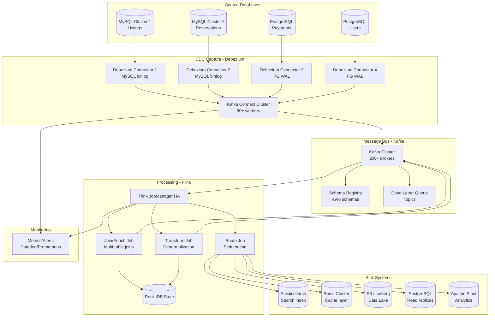

# CDC-Based Real-Time Data Synchronization (Airbnb Style)

## Problem Statement

Airbnb operates thousands of microservices with diverse databases (MySQL, PostgreSQL, DynamoDB). Business-critical use cases — search, pricing, fraud detection, analytics — require near-real-time access to data changes across all these systems. Traditional ETL batch jobs introduce hours of latency and create coupling between services. The challenge: capture every database change as it happens, transform it consistently, and deliver it to multiple downstream systems with exactly-once guarantees — at a scale of millions of changes per second across hundreds of database instances.

**Key Requirements:**
- Capture 2-5 million database changes/second across 500+ database instances
- End-to-end latency < 10 seconds from DB commit to downstream availability
- Exactly-once delivery to all sinks (Elasticsearch, Redis, S3)
- Handle schema changes without pipeline downtime
- Zero impact on source database performance
- Support for initial snapshot + ongoing CDC

---

## Architecture Diagram



---

## Component Breakdown

### 1. Debezium CDC Connectors

**MySQL Connector Configuration:**
```json
{
  "name": "listings-mysql-cdc",
  "config": {
    "connector.class": "io.debezium.connector.mysql.MySqlConnector",
    "tasks.max": "1",
    "database.hostname": "listings-mysql-primary.internal",
    "database.port": "3306",
    "database.user": "debezium_cdc",
    "database.password": "${vault:mysql/cdc-password}",
    "database.server.id": "184054",
    "database.server.name": "listings",
    "database.include.list": "listings_db",
    "table.include.list": "listings_db.listings,listings_db.listing_photos,listings_db.pricing",
    "database.history.kafka.bootstrap.servers": "kafka:9092",
    "database.history.kafka.topic": "schema-changes.listings",

    "snapshot.mode": "initial",
    "snapshot.locking.mode": "minimal",
    "snapshot.fetch.size": "10000",

    "binlog.buffer.size": "0",
    "include.schema.changes": "true",
    "column.exclude.list": "listings_db.listings.internal_notes",

    "transforms": "route,unwrap",
    "transforms.route.type": "io.debezium.transforms.ByLogicalTableRouter",
    "transforms.route.topic.regex": "(.*)\\.(.*)",
    "transforms.route.topic.replacement": "cdc.$1.$2",
    "transforms.unwrap.type": "io.debezium.transforms.ExtractNewRecordState",
    "transforms.unwrap.add.fields": "op,table,source.ts_ms",
    "transforms.unwrap.delete.handling.mode": "rewrite",

    "key.converter": "io.confluent.connect.avro.AvroConverter",
    "key.converter.schema.registry.url": "http://schema-registry:8081",
    "value.converter": "io.confluent.connect.avro.AvroConverter",
    "value.converter.schema.registry.url": "http://schema-registry:8081",

    "heartbeat.interval.ms": "10000",
    "heartbeat.topics.prefix": "__debezium-heartbeat",

    "errors.tolerance": "all",
    "errors.deadletterqueue.topic.name": "dlq.listings-cdc",
    "errors.deadletterqueue.context.headers.enable": "true",
    "errors.deadletterqueue.topic.replication.factor": "3"
  }
}
```

**PostgreSQL Connector Configuration:**
```json
{
  "name": "payments-pg-cdc",
  "config": {
    "connector.class": "io.debezium.connector.postgresql.PostgresConnector",
    "tasks.max": "1",
    "database.hostname": "payments-pg-primary.internal",
    "database.port": "5432",
    "database.user": "debezium_cdc",
    "database.password": "${vault:pg/cdc-password}",
    "database.dbname": "payments",
    "database.server.name": "payments",
    "schema.include.list": "public",
    "table.include.list": "public.transactions,public.refunds,public.payouts",

    "plugin.name": "pgoutput",
    "slot.name": "debezium_payments",
    "publication.name": "dbz_publication",
    "publication.autocreate.mode": "filtered",

    "snapshot.mode": "initial",
    "snapshot.select.statement.overrides": "public.transactions",
    "snapshot.select.statement.overrides.public.transactions": "SELECT * FROM public.transactions WHERE created_at > NOW() - INTERVAL '30 days'",

    "tombstones.on.delete": "true",
    "decimal.handling.mode": "string",
    "time.precision.mode": "connect",

    "heartbeat.interval.ms": "10000",
    "heartbeat.action.query": "INSERT INTO debezium_heartbeat (id, ts) VALUES (1, NOW()) ON CONFLICT (id) DO UPDATE SET ts=NOW()"
  }
}
```

### 2. Schema Registry Integration

```python
# Schema evolution handling in Flink
# Debezium emits schema with each message; Schema Registry tracks versions

# Schema compatibility matrix:
# BACKWARD:  New schema can read old data (add optional fields)
# FORWARD:   Old schema can read new data (remove optional fields)
# FULL:      Both directions (safest for CDC)
# NONE:      No compatibility checks (dangerous)

# Production recommendation: FORWARD_TRANSITIVE for CDC topics
# Allows adding new columns to source DB without breaking consumers
```

### 3. Flink Processing Jobs

**Multi-Table Join (Denormalization):**
```java
public class ListingDenormalizationJob {

    public static void main(String[] args) throws Exception {
        StreamExecutionEnvironment env = StreamExecutionEnvironment.getExecutionEnvironment();
        env.enableCheckpointing(30000, CheckpointingMode.EXACTLY_ONCE);
        env.setStateBackend(new EmbeddedRocksDBStateBackend(true));
        env.getCheckpointConfig().setCheckpointStorage("s3://checkpoints/listing-denorm");

        StreamTableEnvironment tableEnv = StreamTableEnvironment.create(env);

        // CDC source tables
        tableEnv.executeSql("""
            CREATE TABLE listings_cdc (
                listing_id BIGINT,
                host_id BIGINT,
                title STRING,
                description STRING,
                city STRING,
                country STRING,
                price_per_night DECIMAL(10,2),
                status STRING,
                updated_at TIMESTAMP(3),
                op STRING,
                PRIMARY KEY (listing_id) NOT ENFORCED
            ) WITH (
                'connector' = 'kafka',
                'topic' = 'cdc.listings_db.listings',
                'properties.bootstrap.servers' = 'kafka:9092',
                'format' = 'avro-confluent',
                'avro-confluent.url' = 'http://schema-registry:8081',
                'scan.startup.mode' = 'earliest-offset'
            )
        """);

        tableEnv.executeSql("""
            CREATE TABLE listing_photos_cdc (
                photo_id BIGINT,
                listing_id BIGINT,
                url STRING,
                is_primary BOOLEAN,
                updated_at TIMESTAMP(3),
                PRIMARY KEY (photo_id) NOT ENFORCED
            ) WITH (
                'connector' = 'kafka',
                'topic' = 'cdc.listings_db.listing_photos',
                'properties.bootstrap.servers' = 'kafka:9092',
                'format' = 'avro-confluent',
                'avro-confluent.url' = 'http://schema-registry:8081',
                'scan.startup.mode' = 'earliest-offset'
            )
        """);

        // Denormalized join with temporal semantics
        tableEnv.executeSql("""
            INSERT INTO elasticsearch_sink
            SELECT
                l.listing_id,
                l.title,
                l.description,
                l.city,
                l.country,
                l.price_per_night,
                l.status,
                ARRAY_AGG(p.url) as photo_urls,
                MAX(p.url) FILTER (WHERE p.is_primary) as primary_photo
            FROM listings_cdc l
            LEFT JOIN listing_photos_cdc p
                ON l.listing_id = p.listing_id
            GROUP BY l.listing_id, l.title, l.description,
                     l.city, l.country, l.price_per_night, l.status
        """);
    }
}
```

**Sink Routing with Exactly-Once:**
```java
public class MultiSinkRouter {

    public static void main(String[] args) throws Exception {
        StreamExecutionEnvironment env = StreamExecutionEnvironment.getExecutionEnvironment();
        env.enableCheckpointing(30000, CheckpointingMode.EXACTLY_ONCE);

        DataStream<CDCEvent> events = env.addSource(kafkaSource)
            .map(new CDCEventDeserializer());

        // Route to Elasticsearch (search)
        events.filter(e -> e.getTable().equals("listings"))
            .addSink(ElasticsearchSink.builder()
                .setBulkFlushMaxActions(1000)
                .setBulkFlushInterval(1000)
                .setEmitter(new ListingElasticsearchEmitter())
                .build());

        // Route to Redis (cache invalidation)
        events.filter(e -> e.getTable().equals("listings") || e.getTable().equals("pricing"))
            .addSink(new RedisCacheInvalidationSink());

        // Route to S3/Iceberg (data lake)
        events.addSink(IcebergSink.forRowData()
            .table(icebergTable)
            .tableLoader(tableLoader)
            .distributionMode(DistributionMode.HASH)
            .build());

        env.execute("CDC Multi-Sink Router");
    }
}
```

---

## Data Flow Explanation

### Change Capture Lifecycle

```
1. Application writes to MySQL:
   INSERT INTO listings (id, title, price) VALUES (123, 'Beach House', 150.00)

2. MySQL writes to binlog (row-based replication format)

3. Debezium reads binlog event (< 1ms after commit):
   {
     "before": null,
     "after": {"id": 123, "title": "Beach House", "price": 150.00},
     "source": {"server": "listings", "ts_ms": 1705312800000, "file": "mysql-bin.000123", "pos": 456},
     "op": "c",  // c=create, u=update, d=delete, r=read(snapshot)
     "ts_ms": 1705312800005
   }

4. Debezium serializes to Avro, publishes to Kafka topic: cdc.listings_db.listings
   - Key: {"id": 123}  (enables log compaction)
   - Partition: hash(123) % num_partitions

5. Flink consumes, joins with photos table (stored in RocksDB state)

6. Flink emits denormalized document to output topic

7. Sink connectors deliver to:
   - Elasticsearch: Upsert document by listing_id
   - Redis: SET listing:123 with TTL
   - S3: Append to Iceberg table
```

### Handling Different Operation Types

| Operation | Debezium Output | Flink Action | ES Action | Redis Action |
|-----------|----------------|--------------|-----------|--------------|
| INSERT | `op: "c"`, after={...} | Add to state, emit | Index document | SET key |
| UPDATE | `op: "u"`, before={...}, after={...} | Update state, emit | Update document | SET key |
| DELETE | `op: "d"`, before={...} | Remove from state, emit tombstone | Delete document | DEL key |
| SNAPSHOT | `op: "r"`, after={...} | Add to state, emit | Index document | SET key |

---

## Exactly-Once Delivery

### Source (Debezium → Kafka)
- Debezium tracks binlog position/WAL LSN
- On restart, resumes from last committed position
- Kafka producer idempotence eliminates duplicates

### Processing (Kafka → Flink)
- Flink checkpoints include Kafka consumer offsets + operator state
- On recovery, rewinds to last checkpoint offsets
- RocksDB state is restored from incremental checkpoint

### Sinks (Flink → Downstream)

**Elasticsearch (Idempotent Upserts):**
```java
// Use document ID = primary key → natural deduplication
public class ListingElasticsearchEmitter implements ElasticsearchEmitter<ListingDocument> {
    @Override
    public void emit(ListingDocument doc, SinkWriter.Context context, RequestIndexer indexer) {
        indexer.add(new IndexRequest("listings")
            .id(String.valueOf(doc.getListingId()))  // Idempotent!
            .source(doc.toJson(), XContentType.JSON));
    }
}
```

**Redis (Idempotent SET):**
```java
// SET is naturally idempotent; last-write-wins with event ordering
public class RedisCacheInvalidationSink extends RichSinkFunction<CDCEvent> {
    @Override
    public void invoke(CDCEvent event, Context context) {
        String key = "listing:" + event.getId();
        if (event.getOp().equals("d")) {
            redis.del(key);
        } else {
            redis.set(key, event.toJson());
            redis.expire(key, 86400);  // 24hr TTL
        }
    }
}
```

**S3/Iceberg (Two-Phase Commit):**
```java
// Iceberg sink commits files atomically with Flink checkpoints
// Files written during processing, committed on checkpoint completion
// Failed checkpoints → orphan files cleaned up
```

---

## Dead Letter Queue (DLQ) Strategy

```java
// DLQ handling in Flink
public class CDCProcessingWithDLQ {

    private static final OutputTag<FailedRecord> DLQ_TAG =
        new OutputTag<>("dlq", TypeInformation.of(FailedRecord.class));

    public static void main(String[] args) {
        SingleOutputStreamOperator<ProcessedEvent> processed = events
            .process(new ProcessFunction<CDCEvent, ProcessedEvent>() {
                @Override
                public void processElement(CDCEvent event, Context ctx, Collector<ProcessedEvent> out) {
                    try {
                        ProcessedEvent result = transform(event);
                        out.collect(result);
                    } catch (Exception e) {
                        ctx.output(DLQ_TAG, new FailedRecord(
                            event,
                            e.getMessage(),
                            System.currentTimeMillis(),
                            getRetryCount(event)
                        ));
                    }
                }
            });

        // Main output → sinks
        processed.addSink(mainSink);

        // DLQ → separate Kafka topic for retry/investigation
        processed.getSideOutput(DLQ_TAG)
            .addSink(dlqKafkaSink);
    }
}
```

**DLQ Topic Structure:**
```json
{
  "original_event": { "...": "..." },
  "error_message": "Schema mismatch: field 'price' expected DECIMAL got STRING",
  "error_timestamp": 1705312800000,
  "source_topic": "cdc.listings_db.listings",
  "source_partition": 42,
  "source_offset": 1234567,
  "retry_count": 0,
  "pipeline": "listing-denormalization"
}
```

**DLQ Processing Strategy:**
1. **Auto-retry** (transient errors): Exponential backoff, max 3 retries
2. **Alert** (schema errors): PagerDuty alert to data team
3. **Quarantine** (poison pills): Move to long-term storage for manual review
4. **Metrics**: Track DLQ volume per source table for SLA monitoring

---

## Scaling Strategies

### Debezium Scaling
- One connector task per database instance (MySQL binlog is single-threaded)
- Scale by sharding databases or using parallel snapshot tasks
- PostgreSQL: One slot per connector; max ~50 concurrent slots recommended

### Kafka Connect Scaling
```json
{
  "config.providers": "vault",
  "group.id": "cdc-connect-cluster",
  "config.storage.topic": "__connect-configs",
  "offset.storage.topic": "__connect-offsets",
  "status.storage.topic": "__connect-status",
  "config.storage.replication.factor": 3,
  "offset.storage.replication.factor": 3,
  "status.storage.replication.factor": 3,
  "connector.client.config.override.policy": "All",
  "worker.count": 50,
  "tasks.max.per.worker": 20
}
```

### Flink Scaling
- Key by source table primary key for even distribution
- Rescale via savepoints when adding capacity
- Separate jobs per domain (listings, payments, users) for isolation

---

## Failure Handling

### Debezium Failures
| Failure Mode | Impact | Recovery |
|-------------|--------|----------|
| Connector crash | CDC stops for that source | Auto-restart via Connect framework; resumes from last offset |
| Source DB failover | Momentary gap in CDC | Debezium reconnects to new primary; may need GTID for MySQL |
| Binlog purged | Cannot resume from position | Full re-snapshot required (hours of downtime) |
| WAL slot inactive | PostgreSQL stops retaining WAL | Recreate slot + re-snapshot |
| Schema change | Potential deserialization failure | Schema Registry handles compatible changes; incompatible → DLQ |

### Preventing Binlog/WAL Loss
```sql
-- MySQL: Ensure sufficient binlog retention
SET GLOBAL binlog_expire_logs_seconds = 604800;  -- 7 days
SET GLOBAL max_binlog_size = 1073741824;  -- 1GB per file

-- PostgreSQL: Monitor replication slot lag
SELECT slot_name, pg_size_pretty(pg_wal_lsn_diff(pg_current_wal_lsn(), restart_lsn)) as lag
FROM pg_replication_slots;
-- Alert if lag > 10GB
```

---

## Cost Optimization

### Infrastructure Costs (500 DB instances, 2M changes/sec)

| Component | Spec | Count | Monthly Cost |
|-----------|------|-------|--------------|
| Kafka Connect Workers | m5.2xlarge | 50 | $40,000 |
| Kafka Brokers | i3.4xlarge | 60 | $180,000 |
| Flink TaskManagers | r5.4xlarge | 100 | $160,000 |
| Elasticsearch | r5.4xlarge | 30 | $48,000 |
| Redis Cluster | r6g.4xlarge | 20 | $40,000 |
| S3 Storage | - | 200TB | $4,600 |
| **Total** | | | **~$473,000/mo** |

### Optimization Strategies
1. **Filter at source:** Capture only needed tables/columns (reduces volume 60-80%)
2. **Kafka log compaction:** Keep only latest value per key (reduces storage 90%)
3. **Batch sinks:** Buffer writes to ES/Redis (fewer API calls)
4. **Spot instances for Flink:** With checkpoint recovery, 60-70% savings
5. **Debezium signal table:** Pause/resume CDC for non-critical tables during peak

---

## Real-World Companies Using This Pattern

| Company | Scale | Architecture Details |
|---------|-------|---------------------|
| **Airbnb** | 500+ DB instances, millions of changes/sec | Debezium → Kafka → SpinalTap (custom) → multiple sinks |
| **Uber** | 1000+ DB instances | Custom CDC (DBEvents) → Kafka → Flink |
| **Netflix** | 1000+ Cassandra/MySQL instances | DBLog (custom) → Kafka → Flink → Elasticsearch/Iceberg |
| **Shopify** | 500+ MySQL clusters | Debezium → Kafka → custom consumers |
| **Zalando** | 200+ PostgreSQL instances | Debezium → Kafka → Flink → Elasticsearch |
| **WePay (Chase)** | Financial data sync | Debezium → Kafka → BigQuery |
| **Convoy** | Real-time pricing sync | Debezium → Kafka → Flink → Redis/ES |

---

## Monitoring & Observability

### Critical Metrics

```yaml
# Debezium health
debezium_metrics_MilliSecondsBehindSource    # Replication lag (< 5000ms ideal)
debezium_metrics_NumberOfEventsFiltered       # Filter effectiveness
debezium_metrics_TotalNumberOfEventsSeen     # Throughput
debezium_metrics_SnapshotCompleted           # Snapshot progress
debezium_metrics_LastEvent                    # Last event timestamp (staleness)

# Pipeline health
kafka_connect_connector_status               # RUNNING/PAUSED/FAILED
flink_checkpoint_duration_seconds            # Checkpoint health
flink_numRecordsOutPerSecond                # Processing throughput
sink_elasticsearch_bulk_requests_failed      # Sink failures
dlq_records_total                           # DLQ volume

# Data quality
cdc_event_ordering_violations               # Out-of-order events
cdc_schema_change_events                    # Schema changes detected
cdc_duplicate_events                        # Deduplication effectiveness
```

### Alerting Matrix

| Alert | Threshold | Severity | Action |
|-------|-----------|----------|--------|
| Connector FAILED state | Any | P1 | Page on-call, auto-restart |
| Replication lag > 30s | 30s sustained | P2 | Investigate source DB load |
| Replication lag > 5min | 5min | P1 | Source DB issue or connector stuck |
| DLQ volume > 1000/min | 1000 events | P2 | Schema change or data issue |
| Binlog retention < 24hr | < 24hr | P1 | Increase retention immediately |
| Flink checkpoint failure > 3 | 3 consecutive | P1 | State corruption risk |
