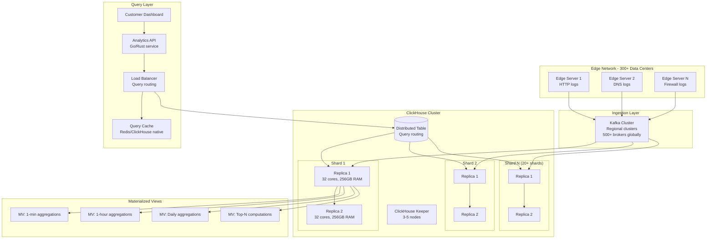

# Real-Time Analytics Dashboard (Cloudflare Style)

## Problem Statement

Cloudflare processes 45+ million HTTP requests per second across its global network, generating billions of analytics events daily. Customers need real-time dashboards showing request counts, bandwidth, error rates, and attack patterns — queryable across arbitrary time ranges with sub-second response times. The challenge: ingest millions of events per second, pre-aggregate them efficiently, and serve analytical queries over billions of rows in milliseconds — all while supporting thousands of concurrent dashboard users with diverse query patterns.

**Key Requirements:**
- Ingest 3-5 million events/second sustained
- Query billions of rows in < 100ms (p99 < 500ms)
- Support 10,000+ concurrent queries
- Real-time data available within 2-5 seconds of event generation
- Flexible aggregations: any combination of dimensions and time granularities
- Multi-tenant isolation with per-customer query limits

---

## Architecture Diagram



---

## Component Breakdown

### 1. ClickHouse Kafka Engine (Ingestion)

```sql
-- Kafka engine table: consumes directly from Kafka
CREATE TABLE kafka_http_logs ON CLUSTER '{cluster}'
(
    timestamp DateTime64(3),
    zone_id UInt64,
    ray_id String,
    client_ip IPv4,
    client_country FixedString(2),
    method Enum8('GET'=1, 'POST'=2, 'PUT'=3, 'DELETE'=4, 'PATCH'=5, 'HEAD'=6, 'OPTIONS'=7),
    host String,
    path String,
    status_code UInt16,
    response_bytes UInt64,
    request_time_ms UInt32,
    cache_status Enum8('HIT'=1, 'MISS'=2, 'EXPIRED'=3, 'BYPASS'=4, 'DYNAMIC'=5),
    edge_colo FixedString(3),
    waf_action Enum8('ALLOW'=0, 'BLOCK'=1, 'CHALLENGE'=2, 'LOG'=3),
    bot_score UInt8,
    tls_version Enum8('TLSv1.0'=1, 'TLSv1.1'=2, 'TLSv1.2'=3, 'TLSv1.3'=4)
)
ENGINE = Kafka()
SETTINGS
    kafka_broker_list = 'kafka-1:9092,kafka-2:9092,kafka-3:9092',
    kafka_topic_list = 'http_logs',
    kafka_group_name = 'clickhouse_http_logs',
    kafka_format = 'Protobuf',
    kafka_schema = 'http_log:HttpLog',
    kafka_num_consumers = 16,
    kafka_max_block_size = 1048576,
    kafka_skip_broken_messages = 100,
    kafka_commit_every_batch = 0,
    kafka_thread_per_consumer = 1;
```

### 2. Main Storage Table (ReplacingMergeTree)

```sql
-- Main raw events table with optimal ordering
CREATE TABLE http_logs ON CLUSTER '{cluster}'
(
    timestamp DateTime64(3),
    zone_id UInt64,
    ray_id String,
    client_ip IPv4,
    client_country FixedString(2),
    method Enum8('GET'=1, 'POST'=2, 'PUT'=3, 'DELETE'=4, 'PATCH'=5, 'HEAD'=6, 'OPTIONS'=7),
    host LowCardinality(String),
    path String,
    status_code UInt16,
    response_bytes UInt64,
    request_time_ms UInt32,
    cache_status Enum8('HIT'=1, 'MISS'=2, 'EXPIRED'=3, 'BYPASS'=4, 'DYNAMIC'=5),
    edge_colo LowCardinality(FixedString(3)),
    waf_action Enum8('ALLOW'=0, 'BLOCK'=1, 'CHALLENGE'=2, 'LOG'=3),
    bot_score UInt8,
    tls_version Enum8('TLSv1.0'=1, 'TLSv1.1'=2, 'TLSv1.2'=3, 'TLSv1.3'=4),

    -- Derived columns
    date Date MATERIALIZED toDate(timestamp),
    hour UInt8 MATERIALIZED toHour(timestamp),
    is_error UInt8 MATERIALIZED if(status_code >= 400, 1, 0),
    is_bot UInt8 MATERIALIZED if(bot_score < 30, 1, 0)
)
ENGINE = ReplicatedMergeTree('/clickhouse/{cluster}/tables/{shard}/http_logs', '{replica}')
PARTITION BY toYYYYMMDD(timestamp)
ORDER BY (zone_id, timestamp, ray_id)
TTL timestamp + INTERVAL 90 DAY DELETE
SETTINGS
    index_granularity = 8192,
    min_bytes_for_wide_part = 10485760,
    merge_with_ttl_timeout = 86400,
    storage_policy = 'tiered';  -- hot SSD → warm HDD → cold S3

-- Materialized view to pipe Kafka → MergeTree
CREATE MATERIALIZED VIEW kafka_to_http_logs TO http_logs AS
SELECT * FROM kafka_http_logs;
```

### 3. AggregatingMergeTree (Pre-aggregation)

```sql
-- 1-minute aggregation materialized view
CREATE TABLE http_logs_1min ON CLUSTER '{cluster}'
(
    timestamp DateTime,  -- truncated to minute
    zone_id UInt64,
    edge_colo LowCardinality(FixedString(3)),
    status_code UInt16,
    cache_status Enum8('HIT'=1, 'MISS'=2, 'EXPIRED'=3, 'BYPASS'=4, 'DYNAMIC'=5),

    request_count AggregateFunction(count, UInt64),
    total_bytes AggregateFunction(sum, UInt64),
    avg_latency AggregateFunction(avg, UInt32),
    p50_latency AggregateFunction(quantile(0.5), UInt32),
    p95_latency AggregateFunction(quantile(0.95), UInt32),
    p99_latency AggregateFunction(quantile(0.99), UInt32),
    unique_ips AggregateFunction(uniq, IPv4),
    error_count AggregateFunction(sumIf, UInt8, UInt8)
)
ENGINE = ReplicatedAggregatingMergeTree('/clickhouse/{cluster}/tables/{shard}/http_logs_1min', '{replica}')
PARTITION BY toYYYYMMDD(timestamp)
ORDER BY (zone_id, timestamp, edge_colo, status_code, cache_status)
TTL timestamp + INTERVAL 30 DAY DELETE;

CREATE MATERIALIZED VIEW http_logs_1min_mv TO http_logs_1min AS
SELECT
    toStartOfMinute(timestamp) AS timestamp,
    zone_id,
    edge_colo,
    status_code,
    cache_status,
    countState() AS request_count,
    sumState(response_bytes) AS total_bytes,
    avgState(request_time_ms) AS avg_latency,
    quantileState(0.5)(request_time_ms) AS p50_latency,
    quantileState(0.95)(request_time_ms) AS p95_latency,
    quantileState(0.99)(request_time_ms) AS p99_latency,
    uniqState(client_ip) AS unique_ips,
    sumIfState(is_error, 1) AS error_count
FROM http_logs
GROUP BY timestamp, zone_id, edge_colo, status_code, cache_status;

-- 1-hour rollup from 1-minute data
CREATE TABLE http_logs_1hr ON CLUSTER '{cluster}'
(
    timestamp DateTime,
    zone_id UInt64,
    request_count AggregateFunction(count, UInt64),
    total_bytes AggregateFunction(sum, UInt64),
    avg_latency AggregateFunction(avg, UInt32),
    p99_latency AggregateFunction(quantile(0.99), UInt32),
    unique_ips AggregateFunction(uniq, IPv4),
    error_count AggregateFunction(sumIf, UInt8, UInt8)
)
ENGINE = ReplicatedAggregatingMergeTree('/clickhouse/{cluster}/tables/{shard}/http_logs_1hr', '{replica}')
PARTITION BY toYYYYMM(timestamp)
ORDER BY (zone_id, timestamp)
TTL timestamp + INTERVAL 365 DAY DELETE;

CREATE MATERIALIZED VIEW http_logs_1hr_mv TO http_logs_1hr AS
SELECT
    toStartOfHour(timestamp) AS timestamp,
    zone_id,
    countMergeState(request_count) AS request_count,
    sumMergeState(total_bytes) AS total_bytes,
    avgMergeState(avg_latency) AS avg_latency,
    quantileMergeState(0.99)(p99_latency) AS p99_latency,
    uniqMergeState(unique_ips) AS unique_ips,
    sumIfMergeState(error_count) AS error_count
FROM http_logs_1min
GROUP BY timestamp, zone_id;
```

### 4. Distributed Table for Cross-Shard Queries

```sql
-- Distributed table spanning all shards
CREATE TABLE http_logs_distributed ON CLUSTER '{cluster}'
AS http_logs
ENGINE = Distributed('{cluster}', default, http_logs, sipHash64(zone_id));

CREATE TABLE http_logs_1min_distributed ON CLUSTER '{cluster}'
AS http_logs_1min
ENGINE = Distributed('{cluster}', default, http_logs_1min, sipHash64(zone_id));

-- Query routing: ClickHouse automatically selects optimal table
-- based on query time range and granularity
```

---

## Query Patterns (Billion-Row Queries in Milliseconds)

### Dashboard Query: Last 24 Hours Overview
```sql
-- Uses 1-minute aggregation table (pre-aggregated)
-- Scans ~1440 minutes * shards instead of billions of raw events
SELECT
    toStartOfFiveMinute(timestamp) AS ts,
    countMerge(request_count) AS requests,
    sumMerge(total_bytes) AS bytes,
    avgMerge(avg_latency) AS latency_ms,
    quantileMerge(0.99)(p99_latency) AS p99_ms,
    uniqMerge(unique_ips) AS unique_visitors
FROM http_logs_1min_distributed
WHERE zone_id = 123456
  AND timestamp >= now() - INTERVAL 24 HOUR
GROUP BY ts
ORDER BY ts;
-- Execution time: 15-50ms over 100B+ underlying events
```

### Top-N Query: Hottest Paths
```sql
SELECT
    path,
    count() AS hits,
    avg(request_time_ms) AS avg_latency,
    quantile(0.99)(request_time_ms) AS p99_latency,
    sum(response_bytes) AS total_bytes
FROM http_logs_distributed
WHERE zone_id = 123456
  AND timestamp >= now() - INTERVAL 1 HOUR
GROUP BY path
ORDER BY hits DESC
LIMIT 100;
-- Execution time: 100-300ms scanning ~180M rows
```

### Real-Time Attack Detection
```sql
SELECT
    client_ip,
    count() AS request_count,
    uniq(path) AS unique_paths,
    countIf(status_code = 403) AS blocked_count
FROM http_logs_distributed
WHERE zone_id = 123456
  AND timestamp >= now() - INTERVAL 5 MINUTE
  AND waf_action IN ('BLOCK', 'CHALLENGE')
GROUP BY client_ip
HAVING request_count > 1000
ORDER BY request_count DESC
LIMIT 50;
-- Execution time: 50-100ms
```

---

## Scaling Strategies

### Sharding Strategy
```xml
<!-- /etc/clickhouse-server/config.d/remote_servers.xml -->
<clickhouse>
  <remote_servers>
    <analytics_cluster>
      <shard>
        <weight>1</weight>
        <internal_replication>true</internal_replication>
        <replica>
          <host>ch-shard01-replica01</host>
          <port>9000</port>
        </replica>
        <replica>
          <host>ch-shard01-replica02</host>
          <port>9000</port>
        </replica>
      </shard>
      <!-- 20+ shards for production -->
    </analytics_cluster>
  </remote_servers>
</clickhouse>
```

### Scaling Dimensions

| Scaling Need | Strategy | Details |
|-------------|----------|---------|
| More ingestion throughput | Add Kafka consumers per shard | `kafka_num_consumers` up to core count |
| More query throughput | Add replicas | Read queries distributed across replicas |
| More storage | Add shards | Data resharded via `sipHash64(zone_id)` |
| Faster queries | More RAM | ClickHouse caches hot data in page cache |
| More concurrent queries | Add replicas + load balancer | Round-robin across replicas |

### Tiered Storage Policy
```xml
<storage_configuration>
  <disks>
    <hot_disk>
      <type>local</type>
      <path>/data/hot/</path>  <!-- NVMe SSD -->
    </hot_disk>
    <warm_disk>
      <type>local</type>
      <path>/data/warm/</path>  <!-- HDD -->
    </warm_disk>
    <cold_disk>
      <type>s3</type>
      <endpoint>https://s3.amazonaws.com/clickhouse-cold/</endpoint>
    </cold_disk>
  </disks>
  <policies>
    <tiered>
      <volumes>
        <hot><disk>hot_disk</disk></hot>
        <warm><disk>warm_disk</disk></warm>
        <cold><disk>cold_disk</disk></cold>
      </volumes>
      <move_factor>0.1</move_factor>
    </tiered>
  </policies>
</storage_configuration>
```

---

## Failure Handling

### Replica Failover
- ClickHouse Keeper detects replica failure within 10 seconds
- Queries automatically routed to healthy replicas
- Failed replica catches up via replication log on recovery

### Kafka Ingestion Failures
```sql
-- Monitor Kafka consumer lag
SELECT
    database, table, name,
    value
FROM system.metrics
WHERE metric LIKE '%Kafka%';

-- If consumer falls behind, increase consumers:
ALTER TABLE kafka_http_logs MODIFY SETTING kafka_num_consumers = 32;
```

### Data Corruption Recovery
```sql
-- Detach corrupt partition
ALTER TABLE http_logs DETACH PARTITION '20240115';

-- Re-fetch from replica
ALTER TABLE http_logs FETCH PARTITION '20240115' FROM '/clickhouse/{cluster}/tables/{shard}/http_logs';

-- Reattach
ALTER TABLE http_logs ATTACH PARTITION '20240115';
```

### Circuit Breaker for Queries
```sql
-- Per-user query limits
CREATE SETTINGS PROFILE 'dashboard_user'
SETTINGS
    max_execution_time = 30,
    max_memory_usage = 10000000000,  -- 10GB
    max_rows_to_read = 1000000000,   -- 1B rows max
    max_bytes_to_read = 100000000000, -- 100GB max
    max_concurrent_queries_for_user = 10;
```

---

## Cost Optimization

### Infrastructure Costs (5M events/sec, 90 days retention)

| Component | Spec | Count | Monthly Cost |
|-----------|------|-------|--------------|
| ClickHouse Shards (hot) | i3.8xlarge (32c, 244GB, 4x1.9TB NVMe) | 20 | $200,000 |
| ClickHouse Replicas | i3.8xlarge | 20 | $200,000 |
| ClickHouse Keeper | m5.2xlarge | 5 | $4,000 |
| Kafka Cluster | i3.4xlarge | 30 | $90,000 |
| S3 Cold Storage | - | 500TB | $11,500 |
| **Total** | | | **~$505,000/mo** |

### Optimization Strategies

1. **Codecs & Compression:**
```sql
-- Column-specific codecs save 40-70% storage
CREATE TABLE http_logs (
    timestamp DateTime64(3) CODEC(DoubleDelta, LZ4),
    zone_id UInt64 CODEC(Delta, ZSTD(3)),
    client_ip IPv4 CODEC(ZSTD(1)),
    status_code UInt16 CODEC(T64, LZ4),
    response_bytes UInt64 CODEC(T64, ZSTD(1)),
    request_time_ms UInt32 CODEC(T64, LZ4),
    host LowCardinality(String) CODEC(ZSTD(3)),
    path String CODEC(ZSTD(3))
) ...
```

2. **Materialized views eliminate repeated computation:** 100x fewer rows scanned for dashboard queries
3. **TTL-based data lifecycle:** Raw data 90 days, 1-min aggs 30 days, 1-hr aggs 1 year
4. **LowCardinality columns:** 10x compression for enum-like strings
5. **Partition pruning:** Queries on `zone_id + timestamp` skip 95%+ of data

---

## Real-World Companies Using This Pattern

| Company | Scale | Details |
|---------|-------|---------|
| **Cloudflare** | 45M req/sec, 20M+ customers | ClickHouse for all customer analytics dashboards |
| **Uber** | Billions of events/day | ClickHouse for operational analytics (AresDB predecessor) |
| **eBay** | 100B+ events/day | ClickHouse for search analytics, A/B testing |
| **Spotify** | Billions of play events | ClickHouse for internal analytics |
| **Cloudflare Radar** | Internet-scale metrics | ClickHouse for public internet analytics |
| **GitLab** | SaaS analytics | ClickHouse for product analytics at scale |
| **PostHog** | Product analytics | ClickHouse as core analytical engine |
| **Contentsquare** | Web/app analytics | ClickHouse for session replay analytics |

---

## Performance Benchmarks

### Query Performance (20 shards, 40 replicas, 1 trillion rows total)

| Query Type | Rows Scanned | Time (p50) | Time (p99) |
|-----------|-------------|------------|------------|
| Single zone, last 5 min (raw) | 15M | 12ms | 45ms |
| Single zone, last 24hr (1min agg) | 1,440 | 3ms | 8ms |
| Single zone, last 30 days (1hr agg) | 720 | 2ms | 5ms |
| Top-100 paths, last hour | 180M | 120ms | 350ms |
| Cross-zone comparison, 7 days | 10B (aggregated) | 200ms | 800ms |
| Full table scan (admin) | 1T | 45s | 120s |

### Ingestion Performance

| Metric | Value |
|--------|-------|
| Raw ingestion rate | 5M events/sec |
| Single shard ingestion | 250K events/sec |
| Batch insert size | 1M rows |
| Insert latency (batch) | 200-500ms |
| Data-to-query latency | 2-5 seconds |
| Compression ratio | 10-15x (raw JSON → ClickHouse columnar) |

---

## Monitoring

```sql
-- Key system queries for monitoring
-- Current ingestion rate
SELECT
    event_time,
    query_kind,
    written_rows,
    written_bytes
FROM system.query_log
WHERE type = 'QueryFinish'
  AND query_kind = 'Insert'
  AND event_time > now() - INTERVAL 5 MINUTE;

-- Merge health (critical for performance)
SELECT
    database, table,
    count() AS active_merges,
    sum(total_size_bytes_compressed) AS merging_bytes
FROM system.merges
GROUP BY database, table;

-- Replication lag
SELECT
    database, table,
    is_leader,
    absolute_delay,
    queue_size
FROM system.replicas
WHERE absolute_delay > 10;
```
