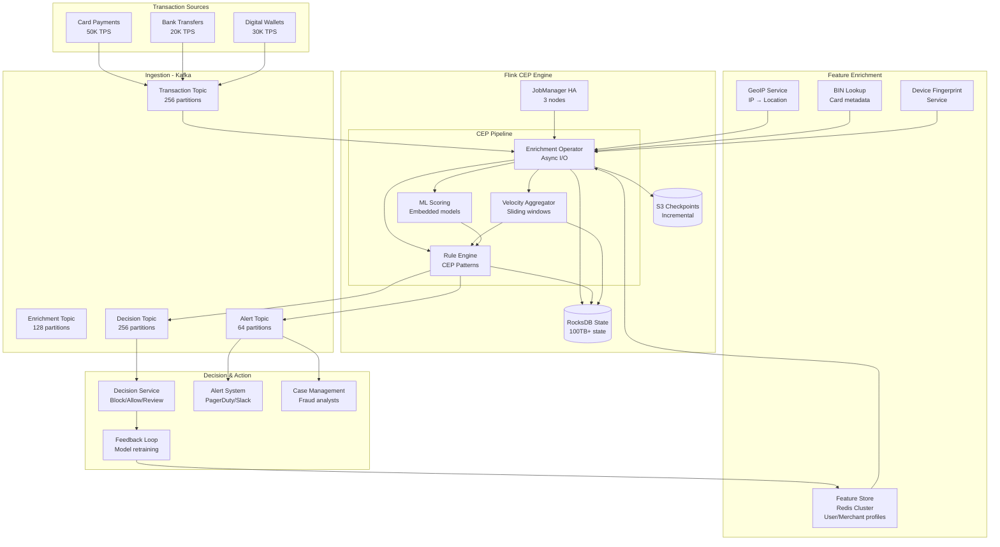

# Real-Time Fraud Detection System (Stripe/PayPal Style)

## Problem Statement

Stripe processes hundreds of millions of payments daily, and must detect fraudulent transactions in real-time — before the payment is authorized. A delay of even 1 second can mean the difference between blocking a $50,000 fraudulent charge and losing it. PayPal blocks $5B+ in fraud annually using real-time systems. The challenge: evaluate complex fraud patterns (velocity checks, behavioral anomalies, graph-based fraud rings) across 100K+ transactions per second with sub-200ms decision latency, while maintaining near-zero false positive rates for legitimate customers.

**Key Requirements:**
- Process 100K+ transactions/second with p99 decision latency < 200ms
- Detect complex multi-event patterns (velocity, sequences, graph patterns)
- Maintain stateful context per user/merchant/card across millions of entities
- < 0.1% false positive rate (blocking legitimate transactions)
- Exactly-once processing (never charge or block twice)
- Real-time model updates without pipeline restart

---

## Architecture Diagram



---

## Component Breakdown

### 1. Transaction Event Schema

```protobuf
message TransactionEvent {
    string transaction_id = 1;
    string user_id = 2;
    string merchant_id = 3;
    string card_id = 4;
    double amount = 5;
    string currency = 6;
    int64 timestamp_ms = 7;
    string ip_address = 8;
    string device_fingerprint = 9;
    string billing_country = 10;
    string shipping_country = 11;
    TransactionType type = 12;
    string mcc_code = 13;  // Merchant Category Code
    bool is_3ds = 14;
    string session_id = 15;
    map<string, string> metadata = 16;
}

enum TransactionType {
    CARD_PRESENT = 0;
    CARD_NOT_PRESENT = 1;
    RECURRING = 2;
    REFUND = 3;
}
```

### 2. Feature Enrichment (Async I/O)

```java
public class TransactionEnrichmentFunction
    extends RichAsyncFunction<TransactionEvent, EnrichedTransaction> {

    private transient RedisAsyncClient redisClient;
    private transient AsyncHttpClient httpClient;

    @Override
    public void open(Configuration parameters) {
        redisClient = RedisClient.create("redis://feature-store:6379")
            .connect().async();
        httpClient = Dsl.asyncHttpClient();
    }

    @Override
    public void asyncInvoke(TransactionEvent txn, ResultFuture<EnrichedTransaction> resultFuture) {
        // Parallel feature lookups
        CompletableFuture<UserProfile> userFuture =
            redisClient.hgetall("user:" + txn.getUserId())
                .thenApply(UserProfile::fromRedis)
                .toCompletableFuture();

        CompletableFuture<MerchantProfile> merchantFuture =
            redisClient.hgetall("merchant:" + txn.getMerchantId())
                .thenApply(MerchantProfile::fromRedis)
                .toCompletableFuture();

        CompletableFuture<GeoLocation> geoFuture =
            lookupGeoIP(txn.getIpAddress());

        CompletableFuture.allOf(userFuture, merchantFuture, geoFuture)
            .thenAccept(v -> {
                EnrichedTransaction enriched = EnrichedTransaction.builder()
                    .transaction(txn)
                    .userProfile(userFuture.join())
                    .merchantProfile(merchantFuture.join())
                    .geoLocation(geoFuture.join())
                    .build();
                resultFuture.complete(Collections.singleton(enriched));
            })
            .exceptionally(e -> {
                // Timeout/failure: proceed with partial enrichment
                resultFuture.complete(Collections.singleton(
                    EnrichedTransaction.withDefaults(txn)));
                return null;
            });
    }

    @Override
    public void timeout(TransactionEvent txn, ResultFuture<EnrichedTransaction> resultFuture) {
        // 50ms timeout: don't block payment for enrichment
        resultFuture.complete(Collections.singleton(
            EnrichedTransaction.withDefaults(txn)));
    }
}

// Usage with timeout and capacity
AsyncDataStream.unorderedWait(
    transactionStream,
    new TransactionEnrichmentFunction(),
    50, TimeUnit.MILLISECONDS,  // Timeout per request
    1000  // Max concurrent requests
);
```

### 3. Flink CEP (Complex Event Processing)

```java
public class FraudPatternDetection {

    // Pattern 1: Rapid-fire transactions (card testing)
    public static Pattern<EnrichedTransaction, ?> cardTestingPattern() {
        return Pattern.<EnrichedTransaction>begin("first")
            .where(new SimpleCondition<>() {
                @Override
                public boolean filter(EnrichedTransaction txn) {
                    return txn.getAmount() < 5.0;  // Small test amounts
                }
            })
            .timesOrMore(5)
            .within(Time.minutes(2))
            .followedBy("large")
            .where(new SimpleCondition<>() {
                @Override
                public boolean filter(EnrichedTransaction txn) {
                    return txn.getAmount() > 500.0;  // Large fraudulent charge
                }
            })
            .within(Time.minutes(5));
    }

    // Pattern 2: Impossible travel (same card, different countries, short time)
    public static Pattern<EnrichedTransaction, ?> impossibleTravelPattern() {
        return Pattern.<EnrichedTransaction>begin("location_a")
            .where(new IterativeCondition<>() {
                @Override
                public boolean filter(EnrichedTransaction txn, Context<EnrichedTransaction> ctx) {
                    return txn.isCardPresent();
                }
            })
            .followedBy("location_b")
            .where(new IterativeCondition<>() {
                @Override
                public boolean filter(EnrichedTransaction txn, Context<EnrichedTransaction> ctx) {
                    EnrichedTransaction prev = ctx.getEventsForPattern("location_a").iterator().next();
                    double distance = GeoUtils.distanceKm(
                        prev.getGeoLocation(), txn.getGeoLocation());
                    long timeDiffHours = (txn.getTimestamp() - prev.getTimestamp()) / 3600000;
                    // Impossible: > 1000km in < 2 hours
                    return distance > 1000 && timeDiffHours < 2 && txn.isCardPresent();
                }
            })
            .within(Time.hours(4));
    }

    // Pattern 3: Account takeover (password change → new device → high-value txn)
    public static Pattern<EnrichedTransaction, ?> accountTakeoverPattern() {
        return Pattern.<EnrichedTransaction>begin("password_change")
            .where(txn -> txn.getType().equals("PASSWORD_CHANGE"))
            .followedBy("new_device")
            .where(txn -> !txn.getDeviceFingerprint()
                .equals(txn.getUserProfile().getKnownDevices()))
            .followedBy("high_value")
            .where(txn -> txn.getAmount() > txn.getUserProfile().getAvgTransactionAmount() * 5)
            .within(Time.hours(24));
    }
}
```

### 4. Velocity Aggregation (Sliding Windows)

```java
public class VelocityAggregator {

    public static DataStream<VelocityFeatures> computeVelocity(
            DataStream<EnrichedTransaction> transactions) {

        // Per-card velocity: count and sum in sliding windows
        DataStream<VelocityFeatures> cardVelocity = transactions
            .keyBy(EnrichedTransaction::getCardId)
            .window(SlidingEventTimeWindows.of(
                Time.hours(1), Time.minutes(1)))
            .aggregate(new VelocityAggregate());

        return cardVelocity;
    }
}

public class VelocityAggregate
    implements AggregateFunction<EnrichedTransaction, VelocityAccumulator, VelocityFeatures> {

    @Override
    public VelocityAccumulator createAccumulator() {
        return new VelocityAccumulator();
    }

    @Override
    public VelocityAccumulator add(EnrichedTransaction txn, VelocityAccumulator acc) {
        acc.count++;
        acc.totalAmount += txn.getAmount();
        acc.uniqueMerchants.add(txn.getMerchantId());
        acc.uniqueCountries.add(txn.getGeoLocation().getCountry());
        acc.maxAmount = Math.max(acc.maxAmount, txn.getAmount());
        acc.declinedCount += txn.isDeclined() ? 1 : 0;
        return acc;
    }

    @Override
    public VelocityFeatures getResult(VelocityAccumulator acc) {
        return VelocityFeatures.builder()
            .transactionCount1hr(acc.count)
            .totalAmount1hr(acc.totalAmount)
            .uniqueMerchants1hr(acc.uniqueMerchants.size())
            .uniqueCountries1hr(acc.uniqueCountries.size())
            .maxSingleAmount1hr(acc.maxAmount)
            .declineRate1hr((double) acc.declinedCount / acc.count)
            .build();
    }

    @Override
    public VelocityAccumulator merge(VelocityAccumulator a, VelocityAccumulator b) {
        a.count += b.count;
        a.totalAmount += b.totalAmount;
        a.uniqueMerchants.addAll(b.uniqueMerchants);
        a.uniqueCountries.addAll(b.uniqueCountries);
        a.maxAmount = Math.max(a.maxAmount, b.maxAmount);
        a.declinedCount += b.declinedCount;
        return a;
    }
}
```

### 5. ML Model Scoring (Embedded)

```java
public class FraudMLScorer extends RichMapFunction<EnrichedTransaction, ScoredTransaction> {

    private transient OnnxRuntime model;
    private transient ModelVersion currentVersion;

    @Override
    public void open(Configuration parameters) {
        // Load ONNX model into Flink operator
        model = OnnxRuntime.loadModel("/models/fraud_model_v42.onnx");
        currentVersion = ModelVersion.V42;

        // Register broadcast state for model updates
        // Model pushed via Kafka broadcast stream
    }

    @Override
    public ScoredTransaction map(EnrichedTransaction txn) {
        float[] features = extractFeatures(txn);
        float[] scores = model.run(features);

        return ScoredTransaction.builder()
            .transaction(txn)
            .fraudScore(scores[0])
            .fraudReason(interpretScore(scores))
            .modelVersion(currentVersion.toString())
            .scoringLatencyMs(System.currentTimeMillis() - txn.getTimestamp())
            .build();
    }

    private float[] extractFeatures(EnrichedTransaction txn) {
        return new float[] {
            (float) txn.getAmount(),
            (float) txn.getVelocity().getTransactionCount1hr(),
            (float) txn.getVelocity().getTotalAmount1hr(),
            (float) txn.getVelocity().getUniqueCountries1hr(),
            txn.getAmount() / (float) Math.max(txn.getUserProfile().getAvgAmount(), 1.0),
            txn.isNewDevice() ? 1.0f : 0.0f,
            txn.is3DS() ? 1.0f : 0.0f,
            (float) txn.getUserProfile().getAccountAgeDays(),
            (float) txn.getMerchantProfile().getRiskScore(),
            // ... 50+ features
        };
    }
}
```

---

## Stateful Processing with RocksDB

### State Configuration
```java
// RocksDB state backend for large state (100TB+)
EmbeddedRocksDBStateBackend stateBackend = new EmbeddedRocksDBStateBackend(true);
stateBackend.setRocksDBOptions(new DefaultConfigurableOptionsFactory() {
    @Override
    public DBOptions createDBOptions(DBOptions currentOptions, Collection<AutoCloseable> handlesToClose) {
        currentOptions.setMaxBackgroundJobs(8);
        currentOptions.setMaxOpenFiles(-1);
        currentOptions.setDbWriteBufferSize(512 * 1024 * 1024); // 512MB
        return currentOptions;
    }

    @Override
    public ColumnFamilyOptions createColumnOptions(ColumnFamilyOptions currentOptions, Collection<AutoCloseable> handlesToClose) {
        currentOptions.setWriteBufferSize(256 * 1024 * 1024); // 256MB
        currentOptions.setMaxWriteBufferNumber(4);
        currentOptions.setMinWriteBufferNumberToMerge(2);
        currentOptions.setTargetFileSizeBase(256 * 1024 * 1024);
        currentOptions.setCompactionStyle(CompactionStyle.LEVEL);
        currentOptions.setLevelCompactionDynamicLevelBytes(true);
        return currentOptions;
    }
});

env.setStateBackend(stateBackend);
```

### State TTL (Prevent Unbounded Growth)
```java
StateTtlConfig ttlConfig = StateTtlConfig
    .newBuilder(Time.days(90))  // User profiles expire after 90 days of inactivity
    .setUpdateType(StateTtlConfig.UpdateType.OnReadAndWrite)
    .setStateVisibility(StateTtlConfig.StateVisibility.NeverReturnExpired)
    .cleanupInRocksdbCompactFilter(1000)
    .build();

ValueStateDescriptor<UserFraudState> descriptor =
    new ValueStateDescriptor<>("user-fraud-state", UserFraudState.class);
descriptor.enableTimeToLive(ttlConfig);
```

### Checkpointing Configuration
```java
CheckpointConfig checkpointConfig = env.getCheckpointConfig();
checkpointConfig.setCheckpointingMode(CheckpointingMode.EXACTLY_ONCE);
checkpointConfig.setCheckpointInterval(60_000);  // 60 seconds
checkpointConfig.setMinPauseBetweenCheckpoints(30_000);
checkpointConfig.setCheckpointTimeout(600_000);  // 10 min timeout
checkpointConfig.setMaxConcurrentCheckpoints(1);
checkpointConfig.setTolerableCheckpointFailureNumber(3);
checkpointConfig.enableUnalignedCheckpoints();  // Reduce backpressure impact

// Incremental checkpoints (critical for large state)
env.getCheckpointConfig().setCheckpointStorage(
    new FileSystemCheckpointStorage("s3://checkpoints/fraud-detection"));
```

---

## Decision Engine

```java
public class FraudDecisionFunction extends KeyedProcessFunction<String, ScoredTransaction, FraudDecision> {

    // Thresholds (configurable via broadcast state)
    private static final double BLOCK_THRESHOLD = 0.95;
    private static final double REVIEW_THRESHOLD = 0.70;
    private static final double ALLOW_THRESHOLD = 0.30;

    @Override
    public void processElement(ScoredTransaction scored, Context ctx, Collector<FraudDecision> out) {
        FraudDecision decision;

        if (scored.getFraudScore() >= BLOCK_THRESHOLD) {
            decision = FraudDecision.block(scored, "ML score above block threshold");
        } else if (scored.hasCEPMatch()) {
            decision = FraudDecision.block(scored, "Pattern match: " + scored.getCEPPattern());
        } else if (scored.getFraudScore() >= REVIEW_THRESHOLD) {
            decision = FraudDecision.review(scored, "Elevated risk - manual review");
        } else if (scored.getVelocity().getDeclineRate1hr() > 0.5) {
            decision = FraudDecision.review(scored, "High decline rate");
        } else {
            decision = FraudDecision.allow(scored);
        }

        // Emit decision (< 200ms total from event ingestion)
        out.collect(decision);

        // Update user risk state
        updateUserState(scored);
    }
}
```

---

## Scaling Strategies

### Processing at 100K TPS

| Component | Configuration | Why |
|-----------|---------------|-----|
| Kafka partitions | 256 (transaction topic) | 1 partition ≈ 400 TPS per consumer |
| Flink parallelism | 512 slots | Each slot handles ~200 TPS |
| RocksDB instances | 512 (one per slot) | Local state per operator |
| Redis feature store | 30-node cluster | 500K ops/sec for enrichment |
| Checkpoint interval | 60s | Balance recovery time vs overhead |

### Horizontal Scaling
```yaml
# Kubernetes deployment for Flink
apiVersion: flink.apache.org/v1beta1
kind: FlinkDeployment
metadata:
  name: fraud-detection
spec:
  image: fraud-detection:v42
  flinkVersion: v1_17
  jobManager:
    replicas: 3
    resource:
      memory: "8g"
      cpu: 4
  taskManager:
    replicas: 64
    resource:
      memory: "32g"
      cpu: 8
    taskSlots: 8
  job:
    parallelism: 512
    upgradeMode: savepoint
    savepointTriggerNonce: 0
```

---

## Failure Handling

### Payment Authorization Timeout
```
If fraud decision not available within 200ms:
  → Default to ALLOW for low-risk merchants (score history < 0.3)
  → Default to REVIEW for high-risk merchants
  → Default to 3DS challenge for unknown patterns
  → NEVER default to BLOCK (revenue impact too high)
```

### Cascading Failure Prevention
- Circuit breaker on feature store: If Redis is down, use cached features (stale but available)
- ML model fallback: If ONNX scoring fails, use rules-only decision
- Graceful degradation: Shed load by sampling low-risk transactions during overload

### Recovery Priorities
1. **P0:** Payment decisions must continue (degrade quality, not availability)
2. **P1:** Flink checkpointing restored within 5 minutes
3. **P2:** Feature freshness restored within 15 minutes
4. **P3:** Full enrichment pipeline restored within 1 hour

---

## Cost Optimization

### Infrastructure (100K TPS)

| Component | Spec | Count | Monthly Cost |
|-----------|------|-------|--------------|
| Kafka Brokers | i3.4xlarge | 20 | $60,000 |
| Flink TaskManagers | r5.8xlarge | 64 | $307,000 |
| Redis Feature Store | r6g.4xlarge | 30 | $60,000 |
| ML Model Serving (embedded) | Included in Flink | - | $0 |
| S3 Checkpoints | - | 50TB | $1,150 |
| **Total** | | | **~$428,000/mo** |

**ROI:** Blocking $500M+/year in fraud vs $5M/year infrastructure = 100x ROI

### Optimization
1. **Tiered rules:** Simple rules (velocity) before expensive ML scoring — 60% of fraud caught by rules alone
2. **Feature caching:** Cache enrichment results with 5-min TTL (reduces Redis calls 80%)
3. **Selective enrichment:** Only enrich transactions > $50 with full feature set
4. **Spot instances for non-critical paths:** Alert processing, model retraining

---

## Real-World Companies

| Company | Scale | Details |
|---------|-------|---------|
| **Stripe** (Radar) | 100K+ TPS | ML + rules, embedded in payment flow |
| **PayPal** | 200K+ TPS | Blocks $5B+/year in fraud |
| **Visa** | 65K TPS peak | Real-time scoring for every authorization |
| **Square** | 50K+ TPS | ML fraud detection, < 100ms latency |
| **Adyen** | 80K+ TPS | RevenueProtect, multi-layered detection |
| **Featurespace** | Enterprise fraud | Adaptive behavioral analytics |
| **Feedzai** | Banking fraud | Flink-based real-time ML scoring |

---

## Monitoring & KPIs

### Business Metrics
- **Fraud detection rate:** % of fraudulent transactions blocked (target: > 95%)
- **False positive rate:** % of legitimate transactions blocked (target: < 0.1%)
- **Detection latency:** Time from transaction to decision (target: p99 < 200ms)
- **Dollar amount blocked:** Total fraud prevented per day

### Technical Metrics
```yaml
# Critical alerts
fraud.decision.latency.p99 > 200ms       → P1
fraud.checkpoint.failure.count > 3         → P1
fraud.feature_store.timeout.rate > 5%      → P2
fraud.model.scoring.error.rate > 1%        → P2
fraud.kafka.consumer.lag > 10000           → P1
fraud.state.size.bytes > threshold         → P3 (capacity planning)
```
