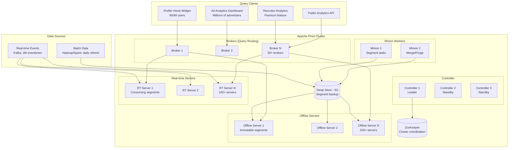

# User-Facing Real-Time Analytics (LinkedIn Style)

## Problem Statement

LinkedIn serves real-time analytics to 900+ million members and millions of advertisers. "Who viewed your profile" updates in seconds, ad campaign metrics refresh in real-time, and recruiter dashboards show live candidate engagement. These are user-facing queries — not internal dashboards — meaning strict SLAs: p99 < 100ms at 100K+ queries per second, with freshness measured in seconds. The challenge: serve complex analytical queries (aggregations, filters, group-bys) over billions of records with guaranteed low latency to millions of concurrent users.

**Key Requirements:**
- 100K+ QPS with p99 latency < 100ms
- Data freshness: events queryable within 5-10 seconds
- Support 1000+ tenants with query isolation
- Handle both real-time (streaming) and historical (batch) data
- Scale to trillions of records with efficient indexing
- Zero downtime during deployments and rebalancing

---

## Architecture Diagram



---

## Component Breakdown

### 1. Table Schema Design

```json
{
  "tableName": "profile_views",
  "tableType": "REALTIME",
  "segmentsConfig": {
    "timeColumnName": "viewTimestamp",
    "timeType": "MILLISECONDS",
    "retentionTimeUnit": "DAYS",
    "retentionTimeValue": "365",
    "replication": "3",
    "completionConfig": {
      "completionMode": "DOWNLOAD"
    }
  },
  "tenants": {
    "broker": "DefaultTenant",
    "server": "realtime_DefaultTenant"
  },
  "tableIndexConfig": {
    "loadMode": "MMAP",
    "streamConfigs": {
      "streamType": "kafka",
      "stream.kafka.topic.name": "profile_views",
      "stream.kafka.broker.list": "kafka:9092",
      "stream.kafka.consumer.type": "lowlevel",
      "stream.kafka.consumer.prop.auto.offset.reset": "smallest",
      "stream.kafka.decoder.class.name": "org.apache.pinot.plugin.stream.kafka.KafkaProtobufMessageDecoder",
      "realtime.segment.flush.threshold.rows": "1000000",
      "realtime.segment.flush.threshold.time": "1h",
      "realtime.segment.flush.threshold.segment.size": "500M"
    },
    "invertedIndexColumns": ["viewerIndustry", "viewerCountry", "viewerCompany"],
    "rangeIndexColumns": ["viewTimestamp", "viewerSeniority"],
    "sortedColumn": ["profileOwnerId"],
    "bloomFilterColumns": ["viewerId", "profileOwnerId"],
    "noDictionaryColumns": ["viewTimestamp", "sessionDuration"],
    "varLengthDictionaryColumns": ["viewerTitle", "viewerCompany"],
    "nullHandlingEnabled": true
  },
  "fieldConfigList": [
    {
      "name": "viewerTitle",
      "encodingType": "RAW",
      "indexTypes": ["TEXT"],
      "properties": {
        "fstType": "NATIVE"
      }
    }
  ],
  "routing": {
    "instanceSelectorType": "strictReplicaGroup"
  }
}
```

### 2. Star-Tree Index Configuration

```json
{
  "tableIndexConfig": {
    "starTreeIndexConfigs": [
      {
        "dimensionsSplitOrder": [
          "profileOwnerId",
          "viewerCountry",
          "viewerIndustry",
          "viewerSeniority"
        ],
        "skipStarNodeCreationForDimensions": ["profileOwnerId"],
        "functionColumnPairs": [
          "COUNT__*",
          "SUM__sessionDuration",
          "AVG__sessionDuration",
          "DISTINCTCOUNTHLL__viewerId"
        ],
        "maxLeafRecords": 10000,
        "enableDefaultStarNode": true
      },
      {
        "dimensionsSplitOrder": [
          "campaignId",
          "adFormat",
          "targetCountry",
          "deviceType"
        ],
        "functionColumnPairs": [
          "COUNT__*",
          "SUM__impressions",
          "SUM__clicks",
          "SUM__spend"
        ],
        "maxLeafRecords": 5000
      }
    ]
  }
}
```

**Star-Tree Performance Impact:**
- Without star-tree: Scan 500M rows → 800ms
- With star-tree: Lookup pre-aggregated node → 3ms
- Speedup: **200-300x** for matching query patterns

### 3. Schema Definition

```json
{
  "schemaName": "profile_views",
  "dimensionFieldSpecs": [
    {"name": "profileOwnerId", "dataType": "LONG"},
    {"name": "viewerId", "dataType": "LONG"},
    {"name": "viewerCountry", "dataType": "STRING"},
    {"name": "viewerIndustry", "dataType": "STRING"},
    {"name": "viewerCompany", "dataType": "STRING"},
    {"name": "viewerTitle", "dataType": "STRING"},
    {"name": "viewerSeniority", "dataType": "STRING"},
    {"name": "viewSource", "dataType": "STRING"},
    {"name": "deviceType", "dataType": "STRING"}
  ],
  "metricFieldSpecs": [
    {"name": "sessionDuration", "dataType": "INT"},
    {"name": "pageDepth", "dataType": "INT"}
  ],
  "dateTimeFieldSpecs": [
    {
      "name": "viewTimestamp",
      "dataType": "TIMESTAMP",
      "format": "1:MILLISECONDS:EPOCH",
      "granularity": "1:MILLISECONDS"
    }
  ],
  "primaryKeyColumns": ["profileOwnerId", "viewerId", "viewTimestamp"]
}
```

### 4. Hybrid Table (Real-time + Offline)

```json
{
  "tableName": "profile_views_OFFLINE",
  "tableType": "OFFLINE",
  "segmentsConfig": {
    "timeColumnName": "viewTimestamp",
    "timeType": "MILLISECONDS",
    "retentionTimeUnit": "DAYS",
    "retentionTimeValue": "365",
    "replication": "3",
    "segmentPushType": "APPEND"
  },
  "tableIndexConfig": {
    "loadMode": "MMAP",
    "sortedColumn": ["profileOwnerId"],
    "invertedIndexColumns": ["viewerIndustry", "viewerCountry"],
    "starTreeIndexConfigs": [...]
  },
  "task": {
    "taskTypeConfigsMap": {
      "RealtimeToOfflineSegmentsTask": {
        "bucketTimePeriod": "1d",
        "bufferTimePeriod": "2h",
        "roundBucketTimePeriod": "true",
        "mergeType": "rollup",
        "maxNumRecordsPerSegment": "5000000"
      }
    }
  }
}
```

**Hybrid Query Flow:**
1. Broker receives query with time range filter
2. For recent data (< 2 hours): route to real-time servers
3. For historical data (> 2 hours): route to offline servers
4. Merge results from both and return to client

---

## Query Patterns (p99 < 100ms)

### "Who Viewed Your Profile" (Most common)
```sql
-- Single user lookup with aggregation
SELECT
    viewerIndustry,
    viewerSeniority,
    COUNT(*) AS viewCount,
    DISTINCTCOUNTHLL(viewerId) AS uniqueViewers
FROM profile_views
WHERE profileOwnerId = 12345678
  AND viewTimestamp > ago('P7D')
GROUP BY viewerIndustry, viewerSeniority
ORDER BY viewCount DESC
LIMIT 10
-- Execution: 2-5ms (star-tree hit + sorted column scan)
```

### Ad Campaign Performance
```sql
SELECT
    DATE_TRUNC('hour', viewTimestamp) AS hour,
    SUM(impressions) AS total_impressions,
    SUM(clicks) AS total_clicks,
    SUM(spend) AS total_spend,
    CAST(SUM(clicks) AS DOUBLE) / SUM(impressions) AS ctr
FROM ad_metrics
WHERE campaignId = 'camp_abc123'
  AND viewTimestamp BETWEEN ago('P30D') AND now()
GROUP BY hour
ORDER BY hour
-- Execution: 5-15ms (star-tree pre-aggregation)
```

### Multi-tenant with Query Isolation
```sql
-- Pinot supports query quotas per table/tenant
-- Max QPS per tenant, max server threads, timeout limits
SET maxExecutionThreads = 4;
SET timeoutMs = 100;

SELECT viewerCountry, COUNT(*) as cnt
FROM profile_views
WHERE profileOwnerId IN (SELECT id FROM premium_users WHERE tenant = 'enterprise_a')
  AND viewTimestamp > ago('P1D')
GROUP BY viewerCountry
ORDER BY cnt DESC
LIMIT 20
```

---

## Index Deep Dive

### Index Types and When to Use

| Index Type | Use Case | Storage Overhead | Query Speedup |
|-----------|----------|-----------------|---------------|
| **Sorted** | Primary lookup column (1 per table) | 0% (free, just ordering) | 100-1000x |
| **Inverted** | Low-cardinality filter columns | 10-30% | 10-100x |
| **Range** | Numeric/timestamp range queries | 5-10% | 5-50x |
| **Bloom Filter** | High-cardinality exact match | 1-5% | 10-100x (negative filter) |
| **Star-Tree** | Pre-aggregation for common queries | 30-100% | 100-300x |
| **Text/FST** | Full-text search on strings | 20-50% | N/A (enables text search) |
| **JSON** | Nested JSON field queries | 10-30% | Enables JSON queries |

### Memory Management
```properties
# Server configuration for 256GB RAM machines
pinot.server.instance.dataDir=/data/pinot
pinot.server.instance.segmentDir=/data/pinot/segments

# Memory mapping (let OS manage page cache)
pinot.server.instance.loadMode=MMAP
pinot.server.instance.realtime.alloc.offheap=true
pinot.server.instance.realtime.alloc.offheap.direct=true

# Query execution
pinot.server.query.executor.pruner.columnvalue.enabled=true
pinot.server.query.executor.timeout.ms=30000
pinot.server.grpc.port=8090
```

---

## Scaling Strategies

### Query Throughput Scaling
- **Add brokers:** Each broker handles ~10K QPS; 50 brokers = 500K QPS capacity
- **Replica groups:** Queries stay within one replica group (no cross-rack network)
- **Query routing:** Route by table/tenant to dedicated broker pools

### Data Volume Scaling
- **Add servers:** Each server holds a subset of segments
- **Segment replication:** 3 replicas per segment for availability + read throughput
- **Tiered servers:** Hot (SSD, real-time), warm (SSD, recent offline), cold (HDD/S3, old offline)

### Ingestion Scaling
```
Per real-time server: ~50K events/sec ingestion capacity
100 RT servers × 50K = 5M events/sec total ingestion

If ingestion lags:
1. Increase realtime.segment.flush.threshold.rows (larger segments, less overhead)
2. Add more real-time server instances
3. Increase Kafka partition count for parallelism
```

### Segment Management
```
Real-time segment lifecycle:
  CONSUMING → COMPLETED (flush) → UPLOADED (deep store) → REPLACED (by offline segment)

Segment size targets:
  - Real-time: 500MB - 1GB per segment
  - Offline: 1-5GB per segment (after compaction)
  - Goal: 50-200 segments per server per table
```

---

## Failure Handling

### Server Failure
- **Detection:** ZooKeeper heartbeat timeout (30s)
- **Recovery:** Broker stops routing to failed server; replicas serve queries
- **Rebuild:** New server downloads segments from deep store (S3)
- **Impact:** Zero query impact if replication ≥ 2

### Real-time Ingestion Failure
- **Kafka offset tracking:** Each consuming segment tracks its Kafka offset
- **On restart:** Resume from last committed offset in segment metadata
- **Duplicate handling:** Upsert tables deduplicate by primary key
- **Worst case:** Re-consume from segment start offset (minutes of data)

### Broker Failure
- **Load balancer health checks:** Failed broker removed from pool in < 10s
- **No state in brokers:** Any broker can serve any query
- **Client retry:** SDK retries on different broker automatically

### Split-Brain Prevention
```properties
# ZooKeeper session timeout
pinot.controller.zk.session.timeout.ms=30000
# Minimum replicas before accepting queries for a segment
pinot.broker.routing.table.minReplicasForQuery=1
# Enable segment pruning to skip offline segments
pinot.broker.query.response.limit=100000
```

---

## Cost Optimization

### Infrastructure (100K QPS, 10B records, 365 days)

| Component | Spec | Count | Monthly Cost |
|-----------|------|-------|--------------|
| Pinot Brokers | m5.4xlarge (16c, 64GB) | 50 | $60,000 |
| RT Servers | r5.8xlarge (32c, 256GB) | 100 | $480,000 |
| Offline Servers | i3.4xlarge (16c, 122GB, 3.8TB NVMe) | 200 | $600,000 |
| Controllers | m5.2xlarge | 3 | $2,400 |
| ZooKeeper | m5.xlarge | 5 | $2,000 |
| S3 Deep Store | - | 500TB | $11,500 |
| **Total** | | | **~$1.16M/mo** |

### Optimization Strategies

1. **Star-tree indexes:** Eliminate 90%+ of compute for common queries
2. **Segment compaction:** Merge small RT segments into large offline segments (fewer file handles)
3. **Column pruning:** Only load queried columns into memory
4. **Time-based partitioning:** Prune entire partitions for time-range queries
5. **Tiered storage:** Move cold segments to S3-backed storage (70% cost reduction)
6. **Query quotas:** Prevent expensive queries from impacting cluster

### Right-Sizing Guidance
```
Rule of thumb for Pinot sizing:
- 1 broker per 10K QPS
- 1 RT server per 50K events/sec ingestion
- 1 offline server per 50GB of indexed data (in memory)
- Replication factor: 3 for user-facing, 2 for internal
- Star-tree: Use for any query pattern with > 1000 QPS
```

---

## Real-World Companies

| Company | Use Case | Scale |
|---------|----------|-------|
| **LinkedIn** | Who viewed your profile, ad analytics, recruiter | 100K+ QPS, trillions of events |
| **Uber** | Real-time restaurant analytics, driver metrics | 10K+ QPS, billions of events |
| **Stripe** | Payment analytics dashboard | User-facing financial metrics |
| **Walmart** | Real-time inventory analytics | Store-level metrics at scale |
| **WePay** | Transaction analytics for merchants | Multi-tenant analytics |
| **Factual** | Location analytics | Geospatial queries at scale |
| **Microsoft Teams** | Usage analytics | Meeting/chat engagement metrics |
| **StarTree (Cloud)** | Managed Pinot | Multiple enterprise customers |

---

## Multi-Tenant Query Isolation

```json
{
  "queryQuotaConfig": {
    "maxQueriesPerSecond": 1000,
    "maxQueriesPerSecondPerTable": {
      "profile_views": 500,
      "ad_metrics": 300
    }
  },
  "resourceQuotaConfig": {
    "maxServerThreadsPerQuery": 4,
    "maxExecutionTimeMs": 30000,
    "maxRowsToReturn": 100000,
    "maxSegmentsPerQuery": 5000
  }
}
```

### Tenant Isolation Levels
1. **Shared brokers, shared servers:** Cost-effective, soft isolation via quotas
2. **Dedicated brokers, shared servers:** Query routing isolation
3. **Dedicated brokers, dedicated servers:** Full compute isolation (enterprise tier)
4. **Separate clusters:** Complete isolation (compliance/security requirements)

---

## Monitoring

### Key Metrics
```yaml
pinot_broker_queries_per_second                 # QPS
pinot_broker_query_latency_ms_p99              # Must be < 100ms
pinot_broker_query_latency_ms_p50              # Should be < 20ms
pinot_server_segment_count                      # Capacity indicator
pinot_server_consuming_segment_lag             # Real-time freshness
pinot_server_query_execution_time_ms           # Server-side latency
pinot_server_num_docs_queried                  # Data scanned
pinot_server_segment_load_time_seconds         # Segment loading health
pinot_controller_segment_download_rate_bytes   # Deep store health
```

### SLA Dashboard
- Data freshness SLA: 95% of events queryable within 10 seconds
- Query latency SLA: p99 < 100ms for standard queries
- Availability SLA: 99.99% uptime
- Throughput SLA: Handle 100K QPS without degradation
