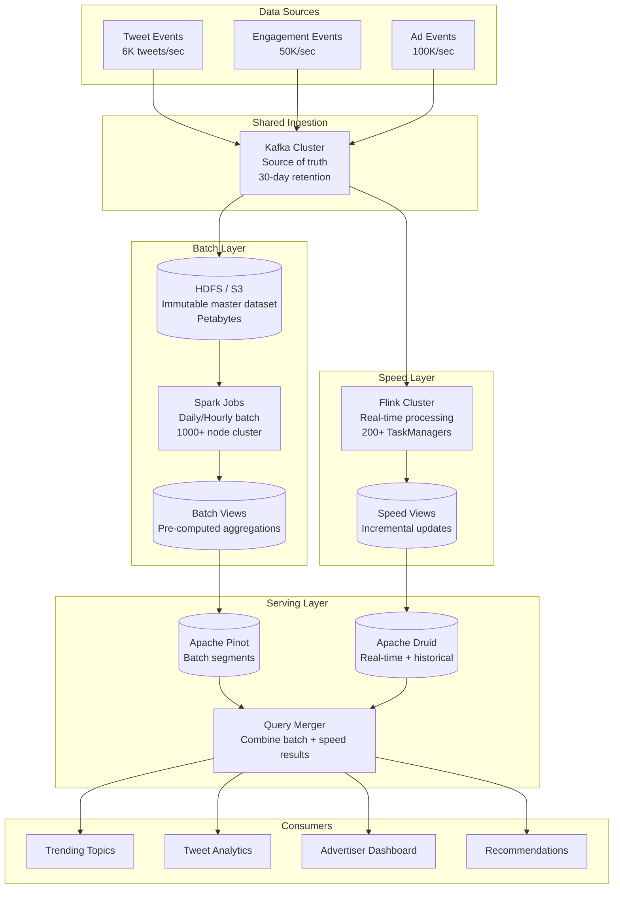

# Lambda Architecture at Scale (Twitter Style)

## Problem Statement

Twitter processes 500+ million tweets per day, generates billions of engagement events, and serves real-time trending topics, analytics, and ad metrics to hundreds of millions of users. Historical accuracy matters (batch layer ensures correctness), but freshness is equally critical (speed layer provides real-time updates). The challenge: build a system that provides both complete, accurate historical analytics AND real-time streaming results — reconciling the two views into a single consistent query interface that handles billions of events with bounded latency.

**Key Requirements:**
- Batch layer: Process complete historical dataset daily (petabytes of data)
- Speed layer: Sub-minute latency for new events
- Serving layer: Merge batch + real-time results with p99 < 200ms
- Handle reprocessing when logic changes (backfill)
- Exactly-once semantics across both layers
- Query results consistent regardless of which layer served them

---

## Architecture Diagram



---

## Component Breakdown

### 1. Batch Layer (Spark + S3/HDFS)

**Master Dataset Storage:**
```
s3://twitter-data-lake/
├── raw/
│   ├── tweets/dt=2024-01-15/hr=00/  (Avro files)
│   ├── engagements/dt=2024-01-15/   (Parquet)
│   └── ad_events/dt=2024-01-15/     (Parquet)
├── batch_views/
│   ├── tweet_engagement_daily/       (Aggregated)
│   ├── user_activity_daily/          (Aggregated)
│   └── ad_metrics_hourly/            (Aggregated)
└── metadata/
    └── iceberg/                       (Table metadata)
```

**Batch Processing Job (Daily):**
```python
from pyspark.sql import SparkSession
from pyspark.sql.functions import *

spark = SparkSession.builder \
    .appName("twitter-batch-engagement-metrics") \
    .config("spark.sql.shuffle.partitions", 2000) \
    .config("spark.executor.instances", 500) \
    .config("spark.executor.memory", "32g") \
    .config("spark.executor.cores", 8) \
    .getOrCreate()

# Read complete history (or incremental partition)
engagements = spark.read.parquet("s3://twitter-data-lake/raw/engagements/") \
    .filter(col("dt") >= "2024-01-01")

tweets = spark.read.parquet("s3://twitter-data-lake/raw/tweets/")

# Compute batch view: complete, correct aggregations
batch_view = engagements \
    .join(tweets, "tweet_id") \
    .groupBy(
        col("tweet_id"),
        col("author_id"),
        date_trunc("hour", col("event_timestamp")).alias("hour")
    ) \
    .agg(
        count(when(col("event_type") == "like", True)).alias("likes"),
        count(when(col("event_type") == "retweet", True)).alias("retweets"),
        count(when(col("event_type") == "reply", True)).alias("replies"),
        count(when(col("event_type") == "impression", True)).alias("impressions"),
        countDistinct("user_id").alias("unique_viewers"),
        sum(when(col("event_type") == "video_view", col("watch_time_ms"))).alias("total_watch_time_ms")
    )

# Write batch view to serving layer
batch_view.write \
    .format("parquet") \
    .mode("overwrite") \
    .partitionBy("hour") \
    .save("s3://twitter-data-lake/batch_views/tweet_engagement_hourly/")

# Push to Pinot as offline segments
push_to_pinot_offline(batch_view, "tweet_engagement_metrics")
```

**Batch Job Schedule:**
```yaml
# Airflow DAG
schedule_interval: "0 2 * * *"  # 2 AM daily (full recompute)
# Plus hourly incremental for faster batch view refresh
hourly_schedule: "15 * * * *"   # 15 minutes past each hour
```

### 2. Speed Layer (Kafka + Flink)

```java
public class SpeedLayerEngagementJob {

    public static void main(String[] args) throws Exception {
        StreamExecutionEnvironment env = StreamExecutionEnvironment.getExecutionEnvironment();
        env.enableCheckpointing(30000, CheckpointingMode.EXACTLY_ONCE);
        env.setParallelism(256);

        // Consume from same Kafka topics as batch layer
        DataStream<EngagementEvent> events = env.addSource(
            new FlinkKafkaConsumer<>("engagements", new EngagementSchema(), kafkaProps));

        // Real-time aggregation (mirrors batch logic but incremental)
        DataStream<EngagementMetrics> speedView = events
            .keyBy(e -> e.getTweetId())
            .window(TumblingEventTimeWindows.of(Time.minutes(1)))
            .allowedLateness(Time.minutes(5))
            .aggregate(new EngagementAggregator())
            .map(new AddProcessingTimestamp());

        // Write speed view to real-time serving (Druid/Pinot RT)
        speedView.addSink(new DruidSink("tweet_engagement_realtime"));

        // Also write to Kafka for other consumers
        speedView.addSink(new FlinkKafkaProducer<>(
            "engagement_metrics_realtime",
            new MetricsSerializer(),
            kafkaProps,
            FlinkKafkaProducer.Semantic.EXACTLY_ONCE));

        env.execute("Speed Layer - Engagement Metrics");
    }
}
```

**Speed Layer Characteristics:**
- Processes only recent data (last batch boundary to now)
- Approximate (may miss late events handled by next batch run)
- Fast: sub-minute latency
- Lower accuracy acceptable (batch will correct it)

### 3. Serving Layer (Query Merging)

```java
public class LambdaQueryMerger {

    // Merge batch view (complete, historical) with speed view (recent, approximate)
    public EngagementResponse query(EngagementQuery request) {
        // Determine time boundary
        Instant batchCutoff = getLastBatchCompletionTime(); // e.g., 2024-01-15 02:00:00

        // Query batch layer for historical data (before cutoff)
        EngagementMetrics batchResult = pinotClient.query(
            "SELECT SUM(likes), SUM(retweets), SUM(replies), SUM(impressions) " +
            "FROM tweet_engagement_batch " +
            "WHERE tweet_id = ? AND hour < ?",
            request.getTweetId(), batchCutoff);

        // Query speed layer for recent data (after cutoff)
        EngagementMetrics speedResult = druidClient.query(
            "SELECT SUM(likes), SUM(retweets), SUM(replies), SUM(impressions) " +
            "FROM tweet_engagement_realtime " +
            "WHERE tweet_id = ? AND timestamp >= ?",
            request.getTweetId(), batchCutoff);

        // Merge: simple addition for additive metrics
        return EngagementResponse.builder()
            .tweetId(request.getTweetId())
            .totalLikes(batchResult.getLikes() + speedResult.getLikes())
            .totalRetweets(batchResult.getRetweets() + speedResult.getRetweets())
            .totalReplies(batchResult.getReplies() + speedResult.getReplies())
            .totalImpressions(batchResult.getImpressions() + speedResult.getImpressions())
            .dataFreshness(speedResult.getLatestTimestamp())
            .build();
    }
}
```

### Non-Additive Metric Merging
```java
// For unique counts (not simply additive), use HyperLogLog
public long mergeUniqueViewers(HLL batchHLL, HLL speedHLL) {
    batchHLL.union(speedHLL);
    return batchHLL.cardinality();
}

// For percentiles, merge t-digests
public double mergeP99Latency(TDigest batchDigest, TDigest speedDigest) {
    batchDigest.add(speedDigest);
    return batchDigest.quantile(0.99);
}
```

---

## Reconciliation Strategy

### Batch Overwrites Speed Layer

```
Timeline:
──────────────────────────────────────────────────────────>
|←── Batch View (complete, correct) ──→|←── Speed View (recent, approximate) ──→|
                                        ↑
                                   Batch cutoff time
                                   (moves forward each batch run)

After each batch run:
1. New batch view replaces previous batch view
2. Speed view is truncated to start from new batch cutoff
3. Any corrections from batch automatically override speed approximations
```

### Handling Discrepancies
```python
# Reconciliation job (runs after each batch completion)
class ReconciliationJob:
    def reconcile(self, batch_cutoff: datetime):
        # 1. Compare speed layer results with new batch results for overlap period
        overlap_start = batch_cutoff - timedelta(hours=2)  # 2-hour overlap
        overlap_end = batch_cutoff

        batch_results = query_batch_layer(overlap_start, overlap_end)
        speed_results = query_speed_layer(overlap_start, overlap_end)

        # 2. Calculate drift
        for metric in batch_results:
            drift = abs(batch_results[metric] - speed_results[metric]) / batch_results[metric]
            if drift > 0.01:  # > 1% drift
                alert(f"Speed layer drift detected: {metric} has {drift:.2%} drift")

        # 3. Purge speed layer data that batch now covers
        purge_speed_layer(before=batch_cutoff)

        # 4. Update batch cutoff marker
        update_cutoff_marker(batch_cutoff)
```

---

## Exactly-Once Across Layers

### Batch Layer (Idempotent by Design)
- Batch jobs overwrite entire partitions (atomic swap)
- Rerunning batch job produces identical results (deterministic)
- No concern about duplicates — full recomputation

### Speed Layer (Checkpoint-based)
- Flink exactly-once checkpointing
- Kafka consumer offsets committed with checkpoint
- On failure: replay from last checkpoint (may produce duplicates in output)
- Sink idempotency handles duplicates (upsert by tweet_id + window)

### Cross-Layer Consistency
```
Guarantee: Eventually consistent
- Speed layer may temporarily show different numbers than batch
- After batch run + reconciliation, all data converges
- Maximum inconsistency window: batch_interval + processing_time (typically < 2 hours)
```

---

## Scaling Strategies

### Batch Layer Scaling
| Metric | Target | Scaling Action |
|--------|--------|----------------|
| Batch runtime > 4 hours | < 4 hours | Add Spark executors, optimize shuffles |
| Data volume growth > 20%/month | Constant runtime | Scale executors proportionally |
| Backfill needed | N/A | Spin up temporary 2x cluster |

### Speed Layer Scaling
| Metric | Target | Scaling Action |
|--------|--------|----------------|
| Kafka consumer lag > 60s | < 30s | Increase Flink parallelism |
| Checkpoint duration > 30s | < 30s | More TaskManagers, smaller state |
| Events/sec growing | Handle 2x peak | Pre-scale based on historical patterns |

### Serving Layer Scaling
- Pinot offline: Add servers for more storage, replicas for more QPS
- Druid real-time: Add middle managers for ingestion throughput
- Query merger: Stateless; scale horizontally behind load balancer

---

## Failure Handling

### Batch Job Failure
```python
# Retry strategy
retry_policy = {
    "max_retries": 3,
    "retry_delay_minutes": 15,
    "escalation": "If all retries fail, alert on-call + extend speed layer window"
}

# Impact: Speed layer continues serving (slightly stale batch data)
# Resolution: Fix and rerun batch; serving layer picks up new batch view
```

### Speed Layer Failure
- **Short outage (< 5 min):** Flink restarts from checkpoint; brief gap in freshness
- **Long outage (> 30 min):** Speed layer catches up from Kafka; temporary staleness
- **Impact:** Users see data up to batch cutoff; real-time portion unavailable
- **Mitigation:** Multiple Flink job replicas in different AZs

### Serving Layer Failure
- **Pinot (batch) down:** Return speed layer results only (less accurate for old data)
- **Druid (speed) down:** Return batch results only (stale by up to batch interval)
- **Both down:** Return cached results with staleness indicator

---

## Cost Optimization

### Infrastructure (Billion events/day scale)

| Component | Spec | Count | Monthly Cost |
|-----------|------|-------|--------------|
| **Batch Layer** | | | |
| Spark Cluster (daily) | r5.8xlarge | 500 (4hrs/day) | $130,000 |
| S3 Master Dataset | - | 2PB | $46,000 |
| S3 Batch Views | - | 100TB | $2,300 |
| **Speed Layer** | | | |
| Flink TaskManagers | r5.4xlarge | 200 | $320,000 |
| Kafka Cluster | i3.4xlarge | 40 | $120,000 |
| **Serving Layer** | | | |
| Pinot Offline | i3.4xlarge | 50 | $150,000 |
| Druid Real-time | r5.4xlarge | 30 | $48,000 |
| Query Merger | m5.2xlarge | 10 | $8,000 |
| **Total** | | | **~$824,000/mo** |

### Why Lambda is Expensive (and When It's Worth It)
- **Duplicate processing:** Same data processed twice (batch + speed)
- **Duplicate storage:** Batch views + speed views
- **Complexity tax:** Two codepaths to maintain
- **Worth it when:** Correctness for historical data is non-negotiable AND real-time freshness required

### Cost Reduction
1. **Batch on spot instances:** 70% savings (jobs are retryable)
2. **Reduce batch frequency:** Hourly instead of real-time reprocessing
3. **Share Kafka cluster:** Both layers read from same topics
4. **Compact speed layer aggressively:** Only keep data since last batch

---

## Real-World Companies

| Company | Scale | Lambda Implementation |
|---------|-------|----------------------|
| **Twitter** | 500M tweets/day | Batch (Scalding/Spark) + Speed (Heron) + Serving (Manhattan) |
| **LinkedIn** | 7T events/day | Batch (Spark) + Speed (Samza) + Serving (Pinot) |
| **Yahoo** | Billions of events | Batch (MapReduce) + Speed (Storm) + Serving (Druid) |
| **Netflix** | 1.5T events/day | Batch (Spark) + Speed (Flink) + Serving (custom) |
| **Alibaba** | Peak 3B events/sec | Batch (MaxCompute) + Speed (Flink) + Serving (Hologres) |

---

## Lambda vs Kappa: When to Choose Lambda

| Criterion | Choose Lambda | Choose Kappa |
|-----------|--------------|--------------|
| Historical accuracy | Must be 100% correct | Approximate OK |
| Logic changes | Need backfill capability | Can reprocess from log |
| Data volume | Petabytes of history | Log retention covers history |
| Team size | Larger team (two codepaths) | Smaller team |
| Latency requirement | Batch: hours + RT: seconds | Everything < minutes |
| Reprocessing time | Hours acceptable | Must be fast |
| Cost sensitivity | Higher budget | Cost-conscious |

---

## Monitoring

### Key Metrics
```yaml
# Batch layer
batch.job.duration_seconds            # SLA: < 4 hours
batch.job.records_processed           # Completeness check
batch.view.freshness_hours            # Time since last batch completion

# Speed layer
speed.layer.lag_seconds               # Kafka consumer lag
speed.layer.throughput_events_per_sec # Processing rate
speed.layer.state_size_bytes          # Memory/disk usage

# Reconciliation
reconciliation.drift_percentage       # Batch vs speed discrepancy
reconciliation.purge_lag_seconds      # Time to purge old speed data
merge.query.latency_p99_ms           # End-user query latency
```
