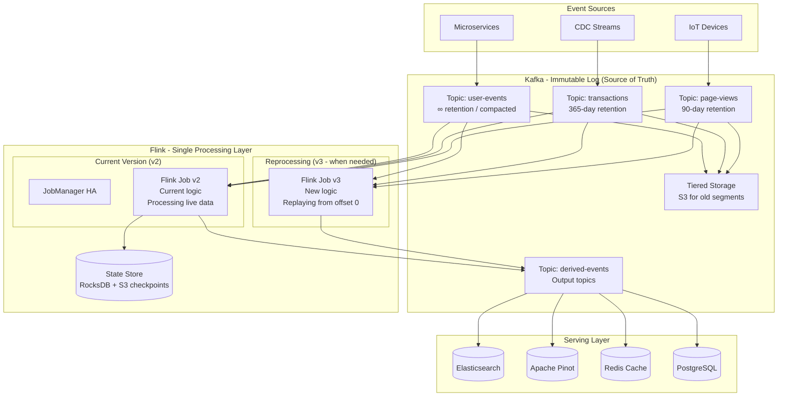

# Kappa Architecture (Confluent/LinkedIn Style)

## Problem Statement

The Lambda Architecture's dual codepath (batch + speed) creates significant operational overhead: two processing pipelines to maintain, test, and debug, with reconciliation logic between them. The Kappa Architecture proposes a radical simplification: use a single processing pipeline (stream processing) for both real-time and historical reprocessing. Kafka serves as the immutable log (source of truth) with sufficient retention, and Flink handles all computation. When business logic changes, you simply reprocess from the Kafka log. LinkedIn pioneered this approach, and Confluent evangelizes it as the default architecture for event-driven systems.

**Key Requirements:**
- Single processing pipeline for both real-time and reprocessing
- Kafka as immutable, append-only log with configurable retention (days to forever)
- Reprocess entire history when logic changes (hours, not days)
- Maintain exactly-once semantics during normal processing AND reprocessing
- State migration between job versions without data loss
- Cost-effective long-term log retention

---

## Architecture Diagram



---

## Component Breakdown

### 1. Kafka as Source of Truth

**Retention Strategies:**

| Strategy | Use Case | Configuration |
|----------|----------|---------------|
| Time-based retention | Raw events (bounded history) | `retention.ms=7776000000` (90 days) |
| Infinite retention | Critical business events | `retention.ms=-1` |
| Log compaction | Entity state (latest per key) | `cleanup.policy=compact` |
| Compact + delete | Entity state with TTL | `cleanup.policy=compact,delete` |
| Tiered storage | Cost-effective long retention | `remote.storage.enable=true` |

**Topic Configuration for Kappa:**
```properties
# User events - compacted (keep latest state per user)
kafka-topics --create --topic user-profiles \
  --partitions 256 \
  --replication-factor 3 \
  --config cleanup.policy=compact \
  --config min.compaction.lag.ms=86400000 \
  --config max.compaction.lag.ms=604800000 \
  --config segment.ms=3600000 \
  --config min.cleanable.dirty.ratio=0.5

# Transactions - time-based retention (1 year)
kafka-topics --create --topic transactions \
  --partitions 512 \
  --replication-factor 3 \
  --config retention.ms=31536000000 \
  --config retention.bytes=-1 \
  --config segment.bytes=1073741824 \
  --config compression.type=zstd

# Page views - tiered storage (hot: 7 days local, cold: S3)
kafka-topics --create --topic page-views \
  --partitions 1024 \
  --replication-factor 3 \
  --config retention.ms=7776000000 \
  --config remote.storage.enable=true \
  --config local.retention.ms=604800000 \
  --config remote.log.copy.disable=false
```

### 2. Log Compaction Deep Dive

```
Before compaction (topic: user-profiles, key=user_123):
Offset 0: {user_123: {name: "Alice", city: "NYC"}}
Offset 5: {user_123: {name: "Alice", city: "SF"}}      ← update
Offset 12: {user_123: {name: "Alice", city: "SF", premium: true}}  ← update
Offset 20: {user_456: {name: "Bob", city: "LA"}}

After compaction:
Offset 12: {user_123: {name: "Alice", city: "SF", premium: true}}  ← latest
Offset 20: {user_456: {name: "Bob", city: "LA"}}                   ← latest

Tombstone (delete user):
Offset 25: {user_123: null}  ← retained for delete.retention.ms, then removed
```

**Compaction guarantees:**
- Consumers reading from offset 0 will see at least the latest value for every key
- Ordering within a partition is always maintained
- Active (head) segment is never compacted

### 3. Flink Processing (Single Pipeline)

```java
public class KappaProcessingJob {

    public static void main(String[] args) throws Exception {
        StreamExecutionEnvironment env = StreamExecutionEnvironment.getExecutionEnvironment();

        // Configuration for both real-time and reprocessing
        ParameterTool params = ParameterTool.fromArgs(args);
        String startingOffsets = params.get("starting.offsets", "latest"); // or "earliest" for reprocessing
        String jobVersion = params.get("job.version", "v2");

        env.enableCheckpointing(60000, CheckpointingMode.EXACTLY_ONCE);
        env.setStateBackend(new EmbeddedRocksDBStateBackend(true));
        env.getCheckpointConfig().setCheckpointStorage(
            "s3://checkpoints/kappa-job/" + jobVersion);

        // Source: Kafka with configurable start position
        KafkaSource<UserEvent> source = KafkaSource.<UserEvent>builder()
            .setBootstrapServers("kafka:9092")
            .setTopics("user-events", "transactions", "page-views")
            .setGroupId("kappa-processor-" + jobVersion)
            .setStartingOffsets(resolveOffsets(startingOffsets))
            .setDeserializer(new UserEventDeserializer())
            .build();

        DataStream<UserEvent> events = env.fromSource(
            source, WatermarkStrategy.forBoundedOutOfOrderness(Duration.ofSeconds(30)), "kafka-source");

        // Processing logic (single implementation, used for both RT and replay)
        DataStream<DerivedMetric> metrics = events
            .keyBy(UserEvent::getUserId)
            .process(new UserMetricsProcessor())  // Stateful processing
            .name("user-metrics-" + jobVersion);

        // Sink to output topic
        KafkaSink<DerivedMetric> sink = KafkaSink.<DerivedMetric>builder()
            .setBootstrapServers("kafka:9092")
            .setDeliverGuarantee(DeliveryGuarantee.EXACTLY_ONCE)
            .setTransactionalIdPrefix("kappa-" + jobVersion)
            .setRecordSerializer(new DerivedMetricSerializer("derived-metrics-" + jobVersion))
            .build();

        metrics.sinkTo(sink);
        env.execute("Kappa Processing - " + jobVersion);
    }
}
```

### 4. Stateful Processing with Version Management

```java
public class UserMetricsProcessor extends KeyedProcessFunction<String, UserEvent, DerivedMetric> {

    // State that persists across events for each user
    private ValueState<UserProfile> profileState;
    private ValueState<SessionInfo> sessionState;
    private MapState<String, Long> featureCounters;
    private ListState<UserEvent> recentEvents;

    @Override
    public void open(Configuration parameters) {
        // State descriptors with TTL
        StateTtlConfig ttl = StateTtlConfig.newBuilder(Time.days(365))
            .setUpdateType(StateTtlConfig.UpdateType.OnReadAndWrite)
            .setStateVisibility(StateTtlConfig.StateVisibility.NeverReturnExpired)
            .cleanupInRocksdbCompactFilter(1000)
            .build();

        ValueStateDescriptor<UserProfile> profileDesc =
            new ValueStateDescriptor<>("profile", UserProfile.class);
        profileDesc.enableTimeToLive(ttl);
        profileState = getRuntimeContext().getState(profileDesc);

        ValueStateDescriptor<SessionInfo> sessionDesc =
            new ValueStateDescriptor<>("session", SessionInfo.class);
        sessionState = getRuntimeContext().getState(sessionDesc);

        MapStateDescriptor<String, Long> counterDesc =
            new MapStateDescriptor<>("counters", String.class, Long.class);
        counterDesc.enableTimeToLive(ttl);
        featureCounters = getRuntimeContext().getMapState(counterDesc);
    }

    @Override
    public void processElement(UserEvent event, Context ctx, Collector<DerivedMetric> out) throws Exception {
        // Update user profile state
        UserProfile profile = profileState.value();
        if (profile == null) {
            profile = new UserProfile(event.getUserId());
        }
        profile.updateFrom(event);
        profileState.update(profile);

        // Session detection
        SessionInfo session = sessionState.value();
        if (session == null || event.getTimestamp() - session.getLastActivity() > 1800000) {
            // New session (30-min gap)
            if (session != null) {
                out.collect(DerivedMetric.sessionEnd(session));
            }
            session = new SessionInfo(event);
        }
        session.addEvent(event);
        sessionState.update(session);

        // Feature counters (for ML features)
        String hourKey = "events_" + toHourBucket(event.getTimestamp());
        Long count = featureCounters.get(hourKey);
        featureCounters.put(hourKey, (count == null ? 0 : count) + 1);

        // Emit derived metric
        out.collect(DerivedMetric.builder()
            .userId(event.getUserId())
            .metricType("engagement_score")
            .value(computeEngagementScore(profile, session))
            .timestamp(event.getTimestamp())
            .build());
    }
}
```

---

## Reprocessing Strategies

### Strategy 1: Parallel Reprocessing (Blue-Green)

```
Current state:
  Job v2 (live) → reading from latest offsets → writing to "derived-metrics-v2"

Reprocessing:
  1. Deploy Job v3 alongside v2, reading from offset 0
  2. v3 writes to "derived-metrics-v3" (separate output topic)
  3. v3 catches up to current time (may take hours)
  4. Once caught up (lag < 1 minute):
     a. Switch serving layer to read from v3 output
     b. Stop v2
     c. Delete v2 state and output topic
```

```bash
# Deploy reprocessing job
flink run -d \
  --jobName "kappa-processor-v3" \
  --fromSavepoint "none" \
  -p 512 \
  kappa-processor.jar \
  --starting.offsets earliest \
  --job.version v3 \
  --output.topic derived-metrics-v3

# Monitor catch-up progress
watch -n 5 'flink-metrics get kappa-processor-v3 kafka-consumer-lag'

# When caught up, switch traffic
kubectl patch service serving-layer -p '{"spec":{"selector":{"version":"v3"}}}'

# Stop old job
flink cancel <v2-job-id>
```

### Strategy 2: Savepoint-Based Migration

```
When logic change is backward-compatible with state:
  1. Take savepoint of v2: flink savepoint <job-id> s3://savepoints/v2-final
  2. Stop v2
  3. Start v3 from v2's savepoint (state preserved)
  4. v3 continues from where v2 left off (no reprocessing needed)
```

```bash
# Take savepoint
SAVEPOINT=$(flink savepoint $JOB_ID s3://savepoints/)
echo "Savepoint: $SAVEPOINT"

# Stop with savepoint (atomic)
flink stop --savepointPath s3://savepoints/ $JOB_ID

# Start new version from savepoint
flink run -d \
  --fromSavepoint $SAVEPOINT \
  --allowNonRestoredState \
  kappa-processor-v3.jar \
  --starting.offsets from-savepoint \
  --job.version v3
```

### Strategy 3: State Migration (Schema Evolution)

```java
// When state schema changes between versions
// Use Flink's state schema evolution (Avro/Protobuf based)

// v2 state:
@TypeInfo(UserProfileTypeInfoFactory.class)
public class UserProfile {
    String userId;
    long lastActivity;
    int eventCount;
}

// v3 state (added field):
@TypeInfo(UserProfileTypeInfoFactory.class)
public class UserProfile {
    String userId;
    long lastActivity;
    int eventCount;
    double engagementScore;  // NEW FIELD - defaults to 0.0
}

// Flink handles compatible schema evolution automatically when using:
// - Avro state serializer
// - POJO serializer with added nullable fields
// Incompatible changes require reprocessing from scratch
```

---

## Topic Retention & Storage Economics

### Tiered Storage Architecture (Confluent/KIP-405)

```
Kafka Broker Local Storage (NVMe SSD):
├── Hot data: Last 7 days
├── Fast reads for active consumers
└── Cost: $0.20/GB/month (NVMe)

Remote Storage (S3):
├── Cold data: 8 days to retention limit
├── Transparent to consumers (Kafka handles fetching)
└── Cost: $0.023/GB/month (S3 Standard)

Cost comparison for 100TB total retention:
  All local: 100TB × $0.20 = $20,000/month
  Tiered (10TB hot + 90TB cold): 10TB × $0.20 + 90TB × $0.023 = $4,070/month
  Savings: 80%
```

### Retention Configuration Matrix

| Topic Type | Local Retention | Remote Retention | Compaction | Total Cost/TB/mo |
|-----------|----------------|-----------------|------------|------------------|
| Raw events (high volume) | 7 days | 90 days | None | $50 |
| Entity state | 7 days | Forever | Compacted | $30 |
| Derived/output | 30 days | None | None | $200 |
| Audit/compliance | 7 days | 7 years | None | $25 |

---

## Scaling Strategies

### Kafka Scaling for Long Retention
```properties
# Partition count: Set high initially (can't easily reduce)
num.partitions=512  # For high-throughput topics

# Segment tuning for tiered storage
log.segment.bytes=1073741824       # 1GB segments
log.roll.ms=3600000                # Roll every hour
remote.log.copy.max.bytes.per.second=104857600  # 100MB/s to S3

# Consumer group scaling for reprocessing
# Reprocessing job can use more partitions than real-time
# Example: RT job parallelism=256, Replay job parallelism=512
```

### Flink Scaling for Reprocessing
```yaml
# Real-time job (always running)
realtime:
  parallelism: 256
  taskmanager.memory: 16g
  taskmanager.cpu: 4
  instances: 64

# Reprocessing job (temporary, high throughput)
reprocessing:
  parallelism: 1024
  taskmanager.memory: 32g
  taskmanager.cpu: 8
  instances: 128
  # 4x resources for faster catch-up
  # Tear down after caught up
```

### Reprocessing Time Estimation
```
Data volume: 10TB in Kafka (90 days)
Flink throughput: 500MB/sec per TaskManager
With 128 TaskManagers: 64GB/sec aggregate

Estimated reprocessing time: 10TB / 64GB/sec ≈ 2.5 minutes
(In practice: 30-60 minutes due to state operations, serialization, skew)
```

---

## Failure Handling

### Normal Operation Failures
- **Flink TaskManager crash:** Restart from last checkpoint (< 2 min recovery)
- **Kafka broker failure:** Replicas take over; Flink reconnects automatically
- **State corruption:** Restore from last valid checkpoint on S3

### Reprocessing Failures
- **Reprocessing job crash:** Restart from its own checkpoint (independent of live job)
- **Kafka segment missing from S3:** Alert; may need to reduce retention or restore from backup
- **State too large for checkpoint:** Increase checkpoint timeout; use incremental checkpoints

### Data Ordering During Reprocessing
```
Critical consideration: Reprocessing reads historical data faster than real-time.
This means watermarks advance rapidly, which can affect:
  - Session window timeouts (fire prematurely if not careful)
  - Timer-based processing (timers fire in burst)
  - Rate limiting (all events appear "now" to the operator)

Solution: Use event-time semantics consistently.
Flink's event-time processing handles this correctly by default.
```

---

## Cost Optimization

### Infrastructure (Kappa vs Lambda comparison)

| Component | Kappa Cost | Lambda Equivalent | Savings |
|-----------|-----------|-------------------|---------|
| Kafka (with tiered storage) | $150,000/mo | $120,000/mo (Kafka) | -$30K (more retention) |
| Flink (single pipeline) | $320,000/mo | $640,000/mo (Flink + Spark) | +$320K |
| Serving layer | $200,000/mo | $200,000/mo | $0 |
| Temporary reprocessing | $50,000/mo (amortized) | N/A (batch is always-on) | +$80K |
| **Total** | **$720,000/mo** | **$960,000/mo** | **+$240K (25% savings)** |

### Additional Kappa Advantages
1. **One codebase:** 50% reduction in engineering time
2. **One testing pipeline:** Faster release cycles
3. **No reconciliation:** No drift between batch and speed
4. **Simpler debugging:** Single place to investigate issues

### When Kappa Fails (Limitations)
- History exceeds affordable Kafka retention (petabytes)
- Processing logic requires full dataset joins (can't do incrementally)
- Reprocessing time exceeds SLA (>24 hours unacceptable)
- Team more experienced with batch tools (Spark/SQL)

---

## Real-World Companies

| Company | Scale | Kappa Implementation |
|---------|-------|---------------------|
| **LinkedIn** | 7T messages/day | Kafka + Samza/Flink, log as source of truth |
| **Confluent** | Core philosophy | Kafka + ksqlDB/Flink, all streaming |
| **Uber** | 1T+ messages/day | Moving from Lambda to Kappa for many use cases |
| **ING Bank** | Financial events | Kafka + Flink, event-driven architecture |
| **New York Times** | Publishing events | Kafka as content platform backbone |
| **Wix** | Billions of events | Kafka + Flink, full Kappa for analytics |
| **Walmart** | Retail events | Kafka + Flink for inventory/pricing |

---

## Kappa vs Lambda Decision Framework

```
Choose KAPPA when:
  ✓ Kafka retention can cover your reprocessing needs (≤ 1 year typical)
  ✓ Processing is incremental (aggregations, joins, enrichment)
  ✓ Team prefers streaming-first development
  ✓ Reprocessing time < 24 hours is acceptable
  ✓ Operational simplicity is a priority
  ✓ Logic changes infrequently (< monthly)

Choose LAMBDA when:
  ✓ History spans years/petabytes (exceeds log retention)
  ✓ Full dataset operations needed (ML training, graph computation)
  ✓ Absolute historical correctness required (financial auditing)
  ✓ Reprocessing would take days and that's unacceptable
  ✓ Existing batch infrastructure already paid for
  ✓ Team has strong batch/SQL skills
```

---

## Monitoring

### Key Metrics
```yaml
# Kafka health
kafka.topic.retention.remaining_days           # Approaching retention limit?
kafka.tiered_storage.upload_lag_bytes          # S3 upload keeping up?
kafka.topic.size_bytes                         # Storage growth rate
kafka.consumer.group.lag                       # Processing lag

# Flink processing
flink.job.uptime_seconds                      # Job stability
flink.checkpoint.duration_ms                  # State size indicator
flink.checkpoint.size_bytes                   # Growing too fast?
flink.records.lag_records                     # End-to-end latency

# Reprocessing specific
reprocessing.progress_percentage              # How far along?
reprocessing.estimated_completion_time        # ETA
reprocessing.throughput_records_per_sec       # Speed
reprocessing.output_record_count_diff         # Drift from current version
```

### Alerting
```yaml
- alert: KafkaRetentionBreach
  expr: kafka_topic_oldest_offset_age_seconds > (retention_seconds * 0.9)
  severity: P1
  action: "Topic approaching retention limit; increase retention or archive"

- alert: ReprocessingNotCatchingUp
  expr: reprocessing_lag_increasing_for > 30m
  severity: P2
  action: "Reprocessing job falling behind; add resources or investigate bottleneck"

- alert: StateSizeGrowing
  expr: flink_checkpoint_size_bytes > threshold
  severity: P3
  action: "State growing; check TTL configuration, potential memory issue"
```
