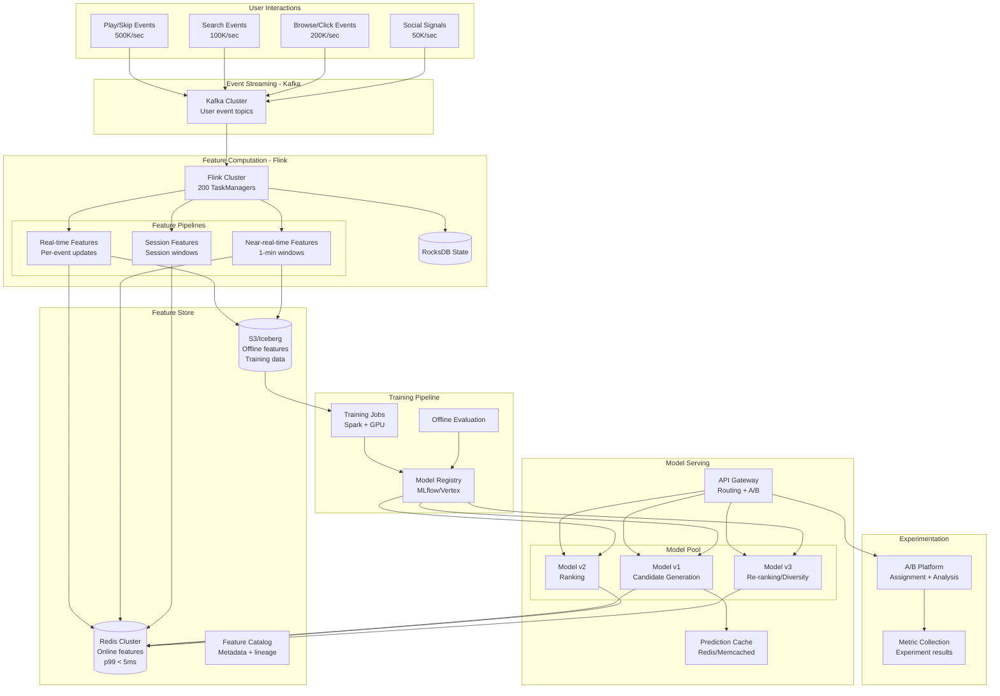

# Real-Time Recommendation Serving (Spotify/Netflix Style)

## Problem Statement

Spotify serves 600+ million users with personalized recommendations that must reflect user behavior within seconds — skip a song, and the next recommendation adapts immediately. Netflix personalizes every row on the homepage for 230+ million subscribers. The challenge: compute ML features from streaming user events in real-time, maintain a low-latency feature store, serve model predictions in < 50ms, and support continuous A/B testing across multiple model versions — all at millions of predictions per second.

**Key Requirements:**
- Feature computation latency: < 5 seconds from event to feature store
- Model serving latency: p99 < 50ms
- Support 1M+ prediction requests/second
- Feature freshness: real-time features updated per-event
- A/B testing: 100+ concurrent experiments
- Model deployment: zero-downtime updates, instant rollback

---

## Architecture Diagram



---

## Component Breakdown

### 1. Real-Time Feature Computation (Flink)

```java
public class RealTimeFeaturePipeline {

    public static void main(String[] args) throws Exception {
        StreamExecutionEnvironment env = StreamExecutionEnvironment.getExecutionEnvironment();
        env.enableCheckpointing(30000, CheckpointingMode.EXACTLY_ONCE);
        env.setParallelism(512);

        DataStream<UserEvent> events = env.fromSource(kafkaSource,
            WatermarkStrategy.forBoundedOutOfOrderness(Duration.ofSeconds(10)),
            "user-events");

        // === Real-time features (per-event, < 1 second) ===
        DataStream<FeatureUpdate> realtimeFeatures = events
            .keyBy(UserEvent::getUserId)
            .process(new RealTimeFeatureProcessor());

        // === Near-real-time features (1-minute tumbling windows) ===
        DataStream<FeatureUpdate> nearRealtimeFeatures = events
            .keyBy(UserEvent::getUserId)
            .window(TumblingEventTimeWindows.of(Time.minutes(1)))
            .process(new WindowedFeatureProcessor());

        // === Session features (session windows, 30-min gap) ===
        DataStream<FeatureUpdate> sessionFeatures = events
            .keyBy(UserEvent::getUserId)
            .window(EventTimeSessionWindows.withGap(Time.minutes(30)))
            .process(new SessionFeatureProcessor());

        // Write all features to Redis (online) and Kafka (offline/audit)
        realtimeFeatures.addSink(new RedisFeatureSink());
        nearRealtimeFeatures.addSink(new RedisFeatureSink());
        sessionFeatures.addSink(new RedisFeatureSink());

        // Also write to Kafka for offline store population
        DataStream<FeatureUpdate> allFeatures = realtimeFeatures
            .union(nearRealtimeFeatures, sessionFeatures);
        allFeatures.sinkTo(kafkaFeatureSink);

        env.execute("Real-Time Feature Pipeline");
    }
}

public class RealTimeFeatureProcessor
    extends KeyedProcessFunction<String, UserEvent, FeatureUpdate> {

    private ValueState<UserFeatureState> state;

    @Override
    public void open(Configuration params) {
        StateTtlConfig ttl = StateTtlConfig.newBuilder(Time.days(30))
            .setUpdateType(StateTtlConfig.UpdateType.OnReadAndWrite)
            .build();
        ValueStateDescriptor<UserFeatureState> desc =
            new ValueStateDescriptor<>("user-features", UserFeatureState.class);
        desc.enableTimeToLive(ttl);
        state = getRuntimeContext().getState(desc);
    }

    @Override
    public void processElement(UserEvent event, Context ctx, Collector<FeatureUpdate> out) throws Exception {
        UserFeatureState s = state.value();
        if (s == null) s = new UserFeatureState();

        // Update real-time features
        s.totalPlays++;
        s.lastEventTimestamp = event.getTimestamp();

        if (event.getType() == EventType.PLAY) {
            s.recentGenres.add(event.getGenre(), event.getTimestamp());  // Decay-weighted
            s.recentArtists.add(event.getArtistId(), event.getTimestamp());
            s.avgListenDuration = updateEMA(s.avgListenDuration, event.getDurationMs(), 0.1);
            s.skipRate = updateEMA(s.skipRate, event.isSkipped() ? 1.0 : 0.0, 0.05);
        } else if (event.getType() == EventType.SEARCH) {
            s.recentSearchTerms.add(event.getQuery());
            s.searchCount24h++;
        }

        state.update(s);

        // Emit feature vector update
        out.collect(FeatureUpdate.builder()
            .userId(event.getUserId())
            .features(Map.of(
                "total_plays", (double) s.totalPlays,
                "skip_rate_ema", s.skipRate,
                "avg_listen_duration_ms", s.avgListenDuration,
                "top_genre_24h", s.recentGenres.getTop(1).get(0),
                "search_count_24h", (double) s.searchCount24h,
                "last_activity_seconds_ago", (double)(System.currentTimeMillis() - s.lastEventTimestamp) / 1000
            ))
            .timestamp(event.getTimestamp())
            .build());
    }
}
```

### 2. Feature Store (Redis)

**Online Feature Store Schema:**
```
Key format: features:{entity_type}:{entity_id}:{feature_group}
Example:    features:user:user_123:realtime

Storage: Redis Hash
  - total_plays: 4521
  - skip_rate_ema: 0.23
  - avg_listen_duration_ms: 187000
  - top_genre_24h: "indie_rock"
  - search_count_24h: 7
  - last_activity_seconds_ago: 45
  - session_play_count: 12
  - session_skip_count: 3

TTL: 30 days (refreshed on every update)
```

**Redis Cluster Configuration:**
```
# 30-node Redis Cluster (90 shards with 3 replicas)
cluster-enabled yes
cluster-node-timeout 5000
maxmemory 128gb
maxmemory-policy allkeys-lru

# Performance targets:
# - Read latency: p99 < 2ms
# - Write latency: p99 < 5ms
# - Throughput: 500K ops/sec per node
# - Total cluster: 15M ops/sec
```

**Feature Retrieval (Batch for Model Serving):**
```python
# Efficient batch feature retrieval using Redis pipeline
async def get_features_batch(user_ids: List[str], item_ids: List[str]) -> Dict:
    pipe = redis_client.pipeline()

    for user_id in user_ids:
        pipe.hgetall(f"features:user:{user_id}:realtime")
        pipe.hgetall(f"features:user:{user_id}:session")

    for item_id in item_ids:
        pipe.hgetall(f"features:item:{item_id}:stats")

    results = await pipe.execute()

    # Parse and combine into feature vectors
    return build_feature_matrix(results, user_ids, item_ids)
```

### 3. Model Serving Architecture

```python
# Multi-stage recommendation serving
class RecommendationService:

    def __init__(self):
        self.candidate_model = load_model("candidate_gen_v5")   # 1000 → 100 candidates
        self.ranking_model = load_model("ranker_v12")           # 100 → ranked list
        self.reranking_model = load_model("reranker_v3")        # Diversity/freshness

    async def get_recommendations(self, user_id: str, context: dict) -> List[Item]:
        # Stage 1: Get user features (2ms)
        user_features = await feature_store.get_user_features(user_id)

        # Stage 2: Candidate generation (10ms)
        # Approximate nearest neighbor on embedding space
        candidates = await self.candidate_model.predict(
            user_features, top_k=200)

        # Stage 3: Get item features for candidates (3ms)
        item_features = await feature_store.get_item_features_batch(
            [c.item_id for c in candidates])

        # Stage 4: Ranking (15ms)
        scored_items = await self.ranking_model.predict(
            user_features, item_features, candidates)

        # Stage 5: Re-ranking for diversity (5ms)
        final_list = await self.reranking_model.rerank(
            scored_items, diversity_weight=0.3)

        # Total: ~35ms end-to-end
        return final_list[:50]
```

**Model Serving Infrastructure:**
```yaml
# Kubernetes deployment for model serving
apiVersion: apps/v1
kind: Deployment
metadata:
  name: recommendation-serving
spec:
  replicas: 100
  template:
    spec:
      containers:
      - name: model-server
        image: reco-serving:v12
        resources:
          requests:
            cpu: "4"
            memory: "16Gi"
            nvidia.com/gpu: "1"  # For ranking model
          limits:
            cpu: "8"
            memory: "32Gi"
            nvidia.com/gpu: "1"
        env:
        - name: MODEL_CACHE_SIZE_GB
          value: "8"
        - name: FEATURE_STORE_URL
          value: "redis-cluster:6379"
        - name: MAX_BATCH_SIZE
          value: "32"  # Dynamic batching
        - name: BATCH_TIMEOUT_MS
          value: "5"
```

### 4. A/B Testing Framework

```python
class ABTestingRouter:
    """Routes users to model versions based on experiment assignment."""

    def __init__(self):
        self.experiments = ExperimentConfig.load()  # From experiment platform

    def get_model_version(self, user_id: str, endpoint: str) -> ModelConfig:
        # Deterministic assignment based on user_id hash
        bucket = mmh3.hash(f"{user_id}:{endpoint}") % 10000

        for experiment in self.experiments.get_active(endpoint):
            if experiment.is_in_treatment(bucket):
                return experiment.treatment_model
            elif experiment.is_in_control(bucket):
                return experiment.control_model

        return self.experiments.get_default(endpoint)

    def log_assignment(self, user_id: str, experiment_id: str, variant: str):
        # Log to Kafka for offline analysis
        kafka_producer.send("experiment_assignments", {
            "user_id": user_id,
            "experiment_id": experiment_id,
            "variant": variant,
            "timestamp": time.time()
        })
```

**Experiment Configuration:**
```json
{
  "experiment_id": "reco_ranking_v12_vs_v13",
  "status": "RUNNING",
  "start_date": "2024-01-15",
  "end_date": "2024-02-15",
  "endpoint": "home_feed_ranking",
  "traffic_allocation": 0.10,
  "variants": [
    {"name": "control", "model": "ranker_v12", "weight": 0.5},
    {"name": "treatment", "model": "ranker_v13", "weight": 0.5}
  ],
  "primary_metric": "stream_30_seconds_rate",
  "guardrail_metrics": ["crash_rate", "latency_p99"],
  "minimum_detectable_effect": 0.005,
  "required_sample_size": 5000000
}
```

### 5. Model Versioning & Deployment

```python
# Shadow deployment: new model runs alongside production, results compared but not served
class ShadowDeployment:
    def __init__(self, production_model, shadow_model):
        self.production = production_model
        self.shadow = shadow_model

    async def predict(self, features):
        # Production result (served to user)
        prod_result = await self.production.predict(features)

        # Shadow result (logged, not served)
        asyncio.create_task(self._shadow_predict_and_log(features, prod_result))

        return prod_result

    async def _shadow_predict_and_log(self, features, prod_result):
        try:
            shadow_result = await asyncio.wait_for(
                self.shadow.predict(features), timeout=0.1)
            log_comparison(prod_result, shadow_result)
        except asyncio.TimeoutError:
            log_shadow_timeout()
```

---

## Feature Freshness Tiers

| Tier | Latency | Examples | Update Mechanism |
|------|---------|----------|-----------------|
| **Real-time** | < 1 second | Last item interacted, current session | Per-event Flink processing |
| **Near-real-time** | 1-5 minutes | Play counts last hour, trending genres | 1-min windowed aggregation |
| **Batch** | 1-24 hours | User embeddings, collaborative filtering | Daily Spark job |
| **Static** | Days-weeks | User demographics, item metadata | CDC or manual update |

**Feature Freshness vs Model Performance:**
```
Experiment results (Spotify internal):
- Real-time features: +3.2% engagement over batch-only
- Near-real-time features: +2.1% engagement over batch-only
- Combined (RT + NRT + Batch): +4.8% engagement (diminishing returns)

Key insight: Skip rate and session context provide most value when fresh.
User embeddings don't need real-time updates (weekly retraining sufficient).
```

---

## Scaling Strategies

### Feature Pipeline Scaling
```
Events/sec × Features/event = Feature writes/sec
850K × 10 = 8.5M feature writes/sec to Redis

Redis cluster sizing:
- 8.5M writes/sec ÷ 500K per node = 17 write nodes minimum
- Plus read replicas for model serving: 3x = 51 total nodes
- With overhead: 60-node cluster
```

### Model Serving Scaling
```
Prediction requests: 1M/sec
Per-request compute: 35ms (all stages)
Requests per pod: 1000/sec (32 concurrent × 35ms)
Pods needed: 1000 + 20% overhead = 1200 pods

With GPU batching:
- Batch size 32, 10ms per batch = 3200/sec per GPU
- GPUs needed: 1M / 3200 = 312 GPUs
```

### Handling Traffic Spikes
```python
# Graceful degradation during overload
class DegradedRecommendationService:
    async def get_recommendations(self, user_id, context, deadline_ms=50):
        remaining = deadline_ms

        # Always: get cached popular items as fallback
        fallback = self.popularity_cache.get(context.get("genre"))

        # Stage 1: Features (budget: 5ms)
        user_features = await self._timed_call(
            feature_store.get, user_id, timeout=min(5, remaining))
        remaining -= 5

        if remaining < 10:
            return self._personalize_popular(fallback, user_features)

        # Stage 2: Candidate gen (budget: 10ms)
        candidates = await self._timed_call(
            self.candidate_model.predict, user_features, timeout=min(10, remaining))
        remaining -= 10

        if remaining < 15:
            return candidates[:50]  # Skip ranking, return candidate scores

        # Stage 3+4: Full ranking
        return await self._full_ranking(user_features, candidates, timeout=remaining)
```

---

## Failure Handling

### Feature Store Failure (Redis Down)
- **L1 cache:** In-process LRU cache (last 10K users), 5-min TTL
- **Stale features:** Serve from Redis replica (may be seconds stale)
- **Complete outage:** Fall back to batch features from S3 (hours stale)
- **Impact:** Recommendations slightly less personalized, not broken

### Model Serving Failure
- **Single model failure:** Route to backup model version
- **GPU failure:** CPU fallback (higher latency, reduced throughput)
- **Complete failure:** Serve cached recommendations + popular items

### Feature Pipeline (Flink) Failure
- **Checkpoint recovery:** < 2 min, features frozen during recovery
- **Extended outage:** Features become stale; model still serves using last-known features
- **Impact:** Gradual degradation in recommendation quality, not availability

---

## Cost Optimization

### Infrastructure (1M predictions/sec)

| Component | Spec | Count | Monthly Cost |
|-----------|------|-------|--------------|
| Flink Feature Pipeline | r5.4xlarge | 200 | $320,000 |
| Redis Online Store | r6g.4xlarge | 60 | $120,000 |
| Model Serving (GPU) | g4dn.xlarge | 320 | $256,000 |
| Model Serving (CPU fallback) | c5.4xlarge | 100 | $80,000 |
| Kafka Cluster | i3.4xlarge | 30 | $90,000 |
| Training (GPU, batch) | p3.8xlarge | 20 (8hr/day) | $60,000 |
| S3 Offline Store | - | 200TB | $4,600 |
| **Total** | | | **~$930,000/mo** |

### Optimization Strategies
1. **Feature caching in model server:** Avoid redundant Redis lookups for same user in batch
2. **Dynamic batching:** Batch GPU predictions (32 items at once vs 1-by-1)
3. **Model distillation:** Smaller models for ranking (2x throughput, 95% accuracy)
4. **Precomputation:** Pre-generate recommendations for top 1% users (covers 20% traffic)
5. **Spot instances for training:** 70% savings on GPU training jobs
6. **Feature TTL:** Don't store features for inactive users (saves 40% Redis memory)

---

## Real-World Companies

| Company | Scale | Architecture |
|---------|-------|--------------|
| **Spotify** | 600M users, 100M tracks | Flink features → Bigtable → TensorFlow Serving |
| **Netflix** | 230M users | Flink features → Cassandra → custom serving |
| **YouTube** | 2B users | Real-time features → deep retrieval → ranking |
| **TikTok** | 1B users | Real-time engagement → deep learning ranking |
| **Pinterest** | 450M users | Kafka → Flink → Redis → PinSage model |
| **DoorDash** | Real-time store/order features | Flink → Redis → model serving |
| **Uber Eats** | Restaurant recommendations | Kafka → Flink → Feature Store → TF Serving |

---

## Monitoring & KPIs

### Business Metrics
```yaml
recommendation.click_through_rate        # CTR on recommendations
recommendation.engagement_rate           # Play/purchase rate
recommendation.diversity_score           # Content diversity
recommendation.freshness_score           # How recent are recommendations
recommendation.coverage                  # % of catalog recommended
experiment.primary_metric.lift           # A/B test impact
```

### Technical Metrics
```yaml
feature.freshness.p99_seconds            # Feature staleness (< 5s target)
feature.store.read_latency_p99_ms        # Redis read latency (< 5ms)
model.serving.latency_p99_ms             # End-to-end (< 50ms)
model.serving.throughput_rps             # Requests/second
model.serving.error_rate                 # Failed predictions (< 0.01%)
feature.pipeline.kafka_lag              # Flink consumer lag
model.cache.hit_rate                     # Prediction cache effectiveness
```
