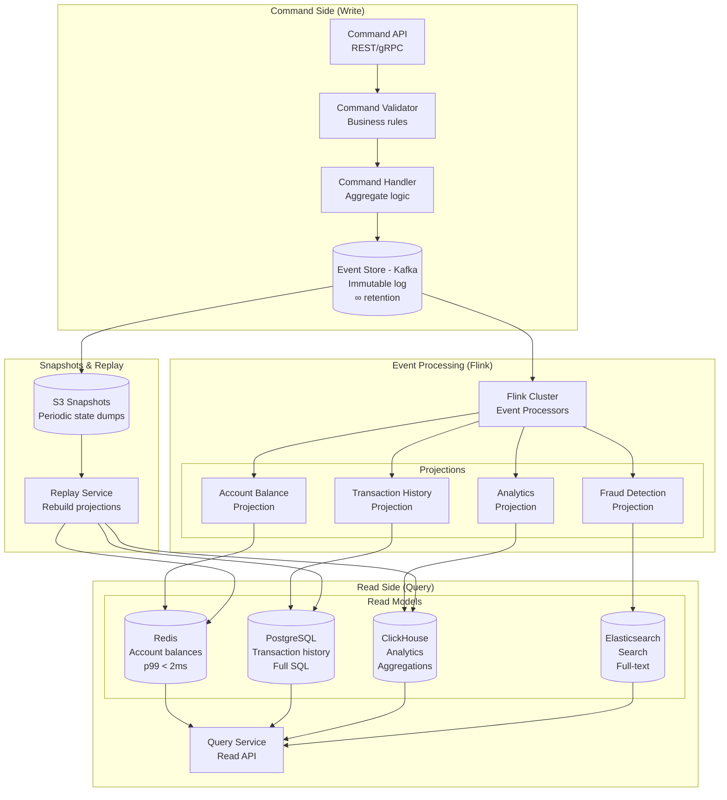

# Event Sourcing + CQRS at Billion Scale (Banking/Trading Style)

## Problem Statement

In financial systems — banking ledgers, stock trading, payment processing — every state change must be captured as an immutable event for auditability, regulatory compliance, and correctness. Goldman Sachs processes billions of financial events daily; Nubank operates a fully event-sourced banking platform for 80M+ customers. The challenge: implement event sourcing (storing every state change as an event) with CQRS (separating writes from reads) at billion-event scale, maintaining strong consistency for commands while providing low-latency reads from eventually-consistent projections.

**Key Requirements:**
- Process 500K+ commands/second with exactly-once guarantees
- Event store: append-only, immutable, ordered (Kafka)
- Multiple read models optimized for different query patterns
- Event replay capability for auditing and rebuilding projections
- Idempotent command processing (at-least-once delivery + deduplication)
- Strong ordering guarantees per aggregate (e.g., per account)
- Snapshot support for fast aggregate reconstruction

---

## Architecture Diagram



---

## Component Breakdown

### 1. Event Schema Design

```protobuf
// Base event envelope
message DomainEvent {
    string event_id = 1;           // UUID, globally unique
    string aggregate_id = 2;       // e.g., account_id
    string aggregate_type = 3;     // e.g., "BankAccount"
    int64 sequence_number = 4;     // Per-aggregate ordering
    int64 timestamp = 5;           // Event time (milliseconds)
    string event_type = 6;         // Fully qualified type name
    bytes payload = 7;             // Serialized event data
    map<string, string> metadata = 8;  // Correlation ID, user ID, etc.
    string causation_id = 9;       // ID of command that caused this event
    string correlation_id = 10;    // End-to-end trace ID
    int32 schema_version = 11;     // For event upcasting
}

// Specific event types
message AccountOpened {
    string account_id = 1;
    string owner_id = 2;
    string account_type = 3;       // CHECKING, SAVINGS, etc.
    string currency = 4;
    int64 initial_balance_cents = 5;
    int64 opened_at = 6;
}

message MoneyDeposited {
    string account_id = 1;
    int64 amount_cents = 2;
    string currency = 3;
    string transaction_id = 4;
    string source = 5;             // WIRE, ACH, CASH, etc.
    int64 balance_after_cents = 6; // Denormalized for read convenience
}

message MoneyWithdrawn {
    string account_id = 1;
    int64 amount_cents = 2;
    string currency = 3;
    string transaction_id = 4;
    string destination = 5;
    int64 balance_after_cents = 6;
}

message TransferInitiated {
    string transfer_id = 1;
    string from_account_id = 2;
    string to_account_id = 3;
    int64 amount_cents = 4;
    string currency = 5;
}
```

### 2. Command Handler (Aggregate Logic)

```java
public class BankAccountAggregate {

    private String accountId;
    private long balanceCents;
    private AccountStatus status;
    private long sequenceNumber;
    private String currency;
    private List<DomainEvent> uncommittedEvents = new ArrayList<>();

    // Reconstruct state from events
    public static BankAccountAggregate reconstitute(List<DomainEvent> events) {
        BankAccountAggregate account = new BankAccountAggregate();
        for (DomainEvent event : events) {
            account.apply(event);
            account.sequenceNumber = event.getSequenceNumber();
        }
        return account;
    }

    // Command: Withdraw money
    public void withdraw(WithdrawCommand cmd) {
        // Validate invariants
        if (status != AccountStatus.ACTIVE) {
            throw new AccountNotActiveException(accountId);
        }
        if (balanceCents < cmd.getAmountCents()) {
            throw new InsufficientFundsException(accountId, balanceCents, cmd.getAmountCents());
        }
        if (cmd.getAmountCents() <= 0) {
            throw new InvalidAmountException(cmd.getAmountCents());
        }

        // Emit event (state change happens in apply)
        emit(MoneyWithdrawn.newBuilder()
            .setAccountId(accountId)
            .setAmountCents(cmd.getAmountCents())
            .setCurrency(currency)
            .setTransactionId(cmd.getTransactionId())
            .setDestination(cmd.getDestination())
            .setBalanceAfterCents(balanceCents - cmd.getAmountCents())
            .build());
    }

    // Apply event to state (used during reconstitution AND after command)
    private void apply(DomainEvent event) {
        switch (event.getEventType()) {
            case "AccountOpened":
                AccountOpened opened = deserialize(event.getPayload(), AccountOpened.class);
                this.accountId = opened.getAccountId();
                this.balanceCents = opened.getInitialBalanceCents();
                this.status = AccountStatus.ACTIVE;
                this.currency = opened.getCurrency();
                break;
            case "MoneyDeposited":
                MoneyDeposited deposited = deserialize(event.getPayload(), MoneyDeposited.class);
                this.balanceCents += deposited.getAmountCents();
                break;
            case "MoneyWithdrawn":
                MoneyWithdrawn withdrawn = deserialize(event.getPayload(), MoneyWithdrawn.class);
                this.balanceCents -= withdrawn.getAmountCents();
                break;
            case "AccountClosed":
                this.status = AccountStatus.CLOSED;
                break;
        }
    }

    private void emit(GeneratedMessageV3 payload) {
        DomainEvent event = DomainEvent.newBuilder()
            .setEventId(UUID.randomUUID().toString())
            .setAggregateId(accountId)
            .setAggregateType("BankAccount")
            .setSequenceNumber(++sequenceNumber)
            .setTimestamp(System.currentTimeMillis())
            .setEventType(payload.getClass().getSimpleName())
            .setPayload(payload.toByteString())
            .build();
        uncommittedEvents.add(event);
        apply(event);  // Update local state immediately
    }
}
```

### 3. Command Processing Service

```java
@Service
public class CommandProcessor {

    private final KafkaProducer<String, DomainEvent> eventStore;
    private final SnapshotStore snapshotStore;
    private final IdempotencyStore idempotencyStore;

    public CommandResult process(Command cmd) {
        // 1. Idempotency check
        if (idempotencyStore.exists(cmd.getCommandId())) {
            return idempotencyStore.getResult(cmd.getCommandId());
        }

        // 2. Load aggregate (from snapshot + subsequent events)
        BankAccountAggregate account = loadAggregate(cmd.getAggregateId());

        // 3. Execute command (validates + produces events)
        try {
            account.handle(cmd);
        } catch (DomainException e) {
            return CommandResult.rejected(e.getMessage());
        }

        // 4. Persist events to Kafka (optimistic concurrency via expected sequence)
        List<DomainEvent> newEvents = account.getUncommittedEvents();
        persistEvents(cmd.getAggregateId(), newEvents, account.getExpectedSequence());

        // 5. Store idempotency key
        CommandResult result = CommandResult.accepted(newEvents);
        idempotencyStore.store(cmd.getCommandId(), result, Duration.ofDays(7));

        // 6. Take snapshot if needed
        if (account.getSequenceNumber() % SNAPSHOT_INTERVAL == 0) {
            snapshotStore.save(account);
        }

        return result;
    }

    private BankAccountAggregate loadAggregate(String aggregateId) {
        // Try snapshot first
        Optional<Snapshot> snapshot = snapshotStore.getLatest(aggregateId);

        long fromSequence = 0;
        BankAccountAggregate account;

        if (snapshot.isPresent()) {
            account = snapshot.get().getState();
            fromSequence = snapshot.get().getSequenceNumber();
        } else {
            account = new BankAccountAggregate();
        }

        // Load events after snapshot
        List<DomainEvent> events = eventStore.readEvents(
            aggregateId, fromSequence + 1, Long.MAX_VALUE);
        for (DomainEvent event : events) {
            account.apply(event);
        }

        return account;
    }
}
```

### 4. Event Store (Kafka Configuration)

```properties
# Topic per aggregate type
# Topic: bank-account-events (partitioned by account_id)
num.partitions=1024
replication.factor=3
min.insync.replicas=2
retention.ms=-1  # Infinite retention (event store)
cleanup.policy=delete  # Never compact (need full history)
compression.type=zstd
max.message.bytes=1048576

# Producer (command handler)
acks=all
enable.idempotence=true
max.in.flight.requests.per.connection=1  # Strict ordering per partition
retries=2147483647
delivery.timeout.ms=120000

# Partitioning: hash(account_id) ensures all events for an account
# are in the same partition → total order per aggregate
```

### 5. Event Processors (Flink Projections)

```java
// Account Balance Projection → Redis
public class BalanceProjection extends KeyedProcessFunction<String, DomainEvent, Void> {

    private transient RedisClient redis;

    @Override
    public void open(Configuration parameters) {
        redis = RedisClient.create("redis://balance-store:6379");
    }

    @Override
    public void processElement(DomainEvent event, Context ctx, Collector<Void> out) {
        switch (event.getEventType()) {
            case "AccountOpened":
                AccountOpened opened = deserialize(event);
                redis.hset("account:" + opened.getAccountId(), Map.of(
                    "balance_cents", String.valueOf(opened.getInitialBalanceCents()),
                    "currency", opened.getCurrency(),
                    "status", "ACTIVE",
                    "last_updated", String.valueOf(event.getTimestamp()),
                    "sequence", String.valueOf(event.getSequenceNumber())
                ));
                break;

            case "MoneyDeposited":
                MoneyDeposited deposited = deserialize(event);
                redis.hset("account:" + deposited.getAccountId(), Map.of(
                    "balance_cents", String.valueOf(deposited.getBalanceAfterCents()),
                    "last_updated", String.valueOf(event.getTimestamp()),
                    "sequence", String.valueOf(event.getSequenceNumber())
                ));
                break;

            case "MoneyWithdrawn":
                MoneyWithdrawn withdrawn = deserialize(event);
                redis.hset("account:" + withdrawn.getAccountId(), Map.of(
                    "balance_cents", String.valueOf(withdrawn.getBalanceAfterCents()),
                    "last_updated", String.valueOf(event.getTimestamp()),
                    "sequence", String.valueOf(event.getSequenceNumber())
                ));
                break;
        }
    }
}

// Transaction History Projection → PostgreSQL
public class TransactionHistoryProjection extends KeyedProcessFunction<String, DomainEvent, Void> {

    @Override
    public void processElement(DomainEvent event, Context ctx, Collector<Void> out) {
        if (event.getEventType().equals("MoneyDeposited") ||
            event.getEventType().equals("MoneyWithdrawn") ||
            event.getEventType().equals("TransferCompleted")) {

            jdbcTemplate.update("""
                INSERT INTO transactions (
                    transaction_id, account_id, event_type, amount_cents,
                    balance_after_cents, timestamp, event_id, sequence_number
                ) VALUES (?, ?, ?, ?, ?, ?, ?, ?)
                ON CONFLICT (event_id) DO NOTHING
                """,
                extractTransactionId(event),
                event.getAggregateId(),
                event.getEventType(),
                extractAmount(event),
                extractBalanceAfter(event),
                Instant.ofEpochMilli(event.getTimestamp()),
                event.getEventId(),
                event.getSequenceNumber()
            );
        }
    }
}

// Analytics Projection → ClickHouse
public class AnalyticsProjection extends KeyedProcessFunction<String, DomainEvent, Void> {

    @Override
    public void processElement(DomainEvent event, Context ctx, Collector<Void> out) {
        // Write to ClickHouse for real-time analytics
        clickHouseClient.insert("events_analytics", Map.of(
            "event_id", event.getEventId(),
            "aggregate_id", event.getAggregateId(),
            "event_type", event.getEventType(),
            "timestamp", event.getTimestamp(),
            "amount_cents", extractAmount(event),
            "metadata", event.getMetadataMap()
        ));
    }
}
```

---

## Idempotency Guarantees

### Command Idempotency
```java
// Every command has a unique command_id (client-generated)
// Idempotency store: Redis with TTL
public class RedisIdempotencyStore {

    private final RedisClient redis;
    private static final Duration DEFAULT_TTL = Duration.ofDays(7);

    public boolean exists(String commandId) {
        return redis.exists("idempotency:" + commandId);
    }

    public void store(String commandId, CommandResult result, Duration ttl) {
        redis.setex("idempotency:" + commandId, ttl.getSeconds(), serialize(result));
    }

    public CommandResult getResult(String commandId) {
        return deserialize(redis.get("idempotency:" + commandId));
    }
}
```

### Event Processing Idempotency
```sql
-- PostgreSQL: ON CONFLICT DO NOTHING with event_id
INSERT INTO transactions (..., event_id) VALUES (...)
ON CONFLICT (event_id) DO NOTHING;

-- ClickHouse: ReplacingMergeTree deduplicates by event_id
CREATE TABLE events_analytics (...)
ENGINE = ReplacingMergeTree(timestamp)
ORDER BY (event_id);

-- Redis: Check sequence number before update
-- Only apply if sequence > current stored sequence
EVALSHA check_and_set_script 1 "account:123" sequence balance_cents ...
```

### Flink Exactly-Once Processing
```java
env.enableCheckpointing(30000, CheckpointingMode.EXACTLY_ONCE);

// Kafka source: offsets committed with checkpoint
// Sinks: idempotent writes (upsert by event_id)
// On failure: replay from last checkpoint offset, sinks deduplicate
```

---

## Event Replay & Projection Rebuilding

### Full Replay (Rebuild a Projection from Scratch)

```python
class ProjectionRebuilder:
    """Rebuilds a read model by replaying all events from the event store."""

    def rebuild_projection(self, projection_name: str):
        # 1. Mark projection as rebuilding
        set_projection_status(projection_name, "REBUILDING")

        # 2. Clear existing read model
        clear_read_model(projection_name)

        # 3. Deploy Flink job reading from earliest offset
        flink_job = deploy_replay_job(
            projection=projection_name,
            starting_offsets="earliest",
            parallelism=1024,  # High parallelism for fast replay
            processing_rate_limit=None  # Unbounded
        )

        # 4. Wait for job to catch up to live traffic
        while get_consumer_lag(flink_job) > 1000:
            time.sleep(10)

        # 5. Switch live traffic to rebuilt projection
        switch_projection_traffic(projection_name, flink_job)
        set_projection_status(projection_name, "ACTIVE")

        # 6. Stop old projection job
        stop_old_projection(projection_name)
```

### Optimized Replay with Snapshots

```
Full replay of 1 billion events: ~2 hours
With daily snapshots: Replay from last snapshot (~24 hours of events): ~5 minutes

Snapshot strategy:
- Take projection snapshot daily (dump Redis/PG state to S3)
- On rebuild: restore snapshot, then replay only events after snapshot timestamp
- Massive speedup for large event histories
```

### Event Upcasting (Schema Evolution)

```java
// When event schema changes, old events need transformation
public class EventUpcaster {

    public DomainEvent upcast(DomainEvent event) {
        if (event.getEventType().equals("MoneyDeposited") && event.getSchemaVersion() == 1) {
            // V1 → V2: Added 'source' field
            MoneyDepositedV1 v1 = deserialize(event.getPayload(), MoneyDepositedV1.class);
            MoneyDeposited v2 = MoneyDeposited.newBuilder()
                .setAccountId(v1.getAccountId())
                .setAmountCents(v1.getAmountCents())
                .setCurrency(v1.getCurrency())
                .setTransactionId(v1.getTransactionId())
                .setSource("UNKNOWN")  // Default for old events
                .setBalanceAfterCents(v1.getBalanceAfterCents())
                .build();

            return event.toBuilder()
                .setPayload(v2.toByteString())
                .setSchemaVersion(2)
                .build();
        }
        return event;
    }
}
```

---

## Eventual Consistency Handling

### Read-Your-Own-Writes Pattern
```java
@RestController
public class AccountController {

    @PostMapping("/accounts/{id}/withdraw")
    public ResponseEntity<WithdrawResponse> withdraw(
            @PathVariable String id,
            @RequestBody WithdrawRequest request) {

        // Process command (returns immediately after event persisted)
        CommandResult result = commandProcessor.process(
            new WithdrawCommand(id, request.getAmount(), request.getCommandId()));

        // Return the new balance from the command result (not from read model)
        // This ensures read-your-own-writes consistency
        return ResponseEntity.ok(WithdrawResponse.builder()
            .transactionId(result.getTransactionId())
            .newBalance(result.getBalanceAfter())  // From event, not read model
            .eventSequence(result.getSequenceNumber())
            .build());
    }

    @GetMapping("/accounts/{id}/balance")
    public ResponseEntity<BalanceResponse> getBalance(
            @PathVariable String id,
            @RequestHeader(value = "X-Min-Sequence", required = false) Long minSequence) {

        // Client can pass minimum expected sequence for consistency
        BalanceResponse balance = queryService.getBalance(id);

        if (minSequence != null && balance.getSequence() < minSequence) {
            // Read model hasn't caught up yet
            // Option 1: Wait (with timeout)
            balance = queryService.waitForSequence(id, minSequence, Duration.ofSeconds(5));
            // Option 2: Return 409 Conflict with Retry-After header
            // Option 3: Read directly from event store (slower but consistent)
        }

        return ResponseEntity.ok(balance);
    }
}
```

### Consistency Indicators
```json
// Every read response includes staleness information
{
  "account_id": "acc_123",
  "balance_cents": 150000,
  "currency": "USD",
  "_metadata": {
    "projection_sequence": 4521,
    "projection_timestamp": "2024-01-15T10:30:45.123Z",
    "staleness_ms": 2300,
    "consistency": "EVENTUAL"
  }
}
```

---

## Scaling Strategies

### Command Side Scaling
```
Commands are routed by aggregate_id:
- hash(account_id) → specific partition → single command handler
- Strong consistency WITHIN an aggregate (serialized per partition)
- High throughput ACROSS aggregates (parallel partitions)

1024 Kafka partitions × 500 commands/sec/partition = 512K commands/sec
```

### Read Side Scaling
- Each projection scales independently
- Redis: Add replicas for read throughput
- PostgreSQL: Read replicas for transaction history
- ClickHouse: Add shards for analytics volume
- Each can be rebuilt independently without affecting others

### Event Store Scaling
```
Kafka sizing for event store:
- 500K events/sec × 1KB avg event = 500MB/sec write throughput
- 365 days retention × 500MB/sec × 86400 = ~15PB storage
- With zstd compression (5x): ~3PB actual storage
- Tiered storage: 200TB local (7 days) + 2.8PB S3
```

---

## Failure Handling

### Command Handler Failure
- Kafka producer `acks=all` ensures event is durably stored
- Idempotency key prevents duplicate processing on retry
- Client retries with same command_id → same result

### Projection Failure
- Flink checkpoint ensures exactly-once projection updates
- On failure: restart from checkpoint, replay missed events
- Other projections unaffected (independent processors)
- If projection is corrupt: full rebuild from event store

### Event Store (Kafka) Failure
- 3x replication across AZs
- `min.insync.replicas=2` prevents data loss
- RPO = 0 (no acknowledged event is ever lost)
- Cross-region replication for DR

### Split-Brain Prevention
```
Optimistic concurrency control:
- Command handler reads current sequence number
- On write, includes expected sequence as Kafka header
- If another write happened (sequence mismatch), retry with fresh state
- Similar to database optimistic locking but on event stream
```

---

## Cost Optimization

### Infrastructure (500K commands/sec, 80M accounts)

| Component | Spec | Count | Monthly Cost |
|-----------|------|-------|--------------|
| Kafka Event Store | i3.4xlarge | 40 | $120,000 |
| Kafka S3 Tiered Storage | - | 3PB | $69,000 |
| Command Handlers | c5.4xlarge | 50 | $40,000 |
| Flink Projections | r5.4xlarge | 100 | $160,000 |
| Redis (balances) | r6g.4xlarge | 20 | $40,000 |
| PostgreSQL (history) | r5.8xlarge | 10 | $48,000 |
| ClickHouse (analytics) | i3.4xlarge | 20 | $60,000 |
| Elasticsearch (search) | r5.4xlarge | 15 | $24,000 |
| Snapshot Storage (S3) | - | 50TB | $1,150 |
| **Total** | | | **~$562,000/mo** |

### Optimization
1. **Snapshots reduce replay cost:** Minutes instead of hours for projection rebuilds
2. **Projection-specific retention:** Analytics projection may only need 90 days
3. **Event compression (zstd):** 5x storage reduction on Kafka
4. **Spot instances for replay jobs:** 70% savings on temporary high-parallelism replay
5. **Read model right-sizing:** Not every query needs its own projection

---

## Real-World Companies

| Company | Scale | Architecture |
|---------|-------|--------------|
| **Nubank** | 80M customers, event-sourced core banking | Kafka + Datomic + custom projections |
| **Goldman Sachs** | Billions of financial events/day | Event-sourced trading platform |
| **Monzo** | 7M customers, UK neobank | Event-sourced on Cassandra + Kafka |
| **Revolut** | 30M customers | Event-driven with Kafka backbone |
| **Wise (TransferWise)** | Cross-border payments | Event sourcing for payment lifecycle |
| **Axon Framework users** | Enterprise CQRS | Axon Server as event store |
| **EventStoreDB users** | Various financial services | Purpose-built event store |

---

## Key Lessons Learned

1. **Event granularity matters:** Too fine (field-level) = noise; too coarse (aggregate-level) = lost information
2. **Snapshots are not optional at scale:** Without them, aggregate reconstruction becomes seconds, not milliseconds
3. **Eventual consistency is a feature, not a bug:** Design UIs to show staleness indicators
4. **Event upcasting is your migration strategy:** Never modify historical events; transform on read
5. **Projection rebuilds must be routine:** If you can't rebuild a projection in < 1 hour, you'll fear deploying changes
6. **Idempotency is non-negotiable:** Networks fail; every component must handle duplicates
7. **Don't event-source everything:** Only aggregates with complex business rules benefit; simple CRUD → just use a database

---

## Monitoring

### Key Metrics
```yaml
# Command side
command.processing.latency_p99_ms           # < 50ms target
command.rejection.rate                      # Business rule violations
command.idempotency.hit_rate               # Duplicate detection
event_store.write.latency_p99_ms           # Kafka produce latency

# Projection side
projection.lag.seconds                      # Eventual consistency gap
projection.rebuild.duration_seconds         # Rebuild health
projection.error.rate                       # Failed event processing

# Read side
read_model.query.latency_p99_ms            # < 10ms for Redis, < 100ms for SQL
read_model.staleness.max_seconds           # Max observed staleness
read_model.consistency_wait.rate           # Clients waiting for consistency
```
