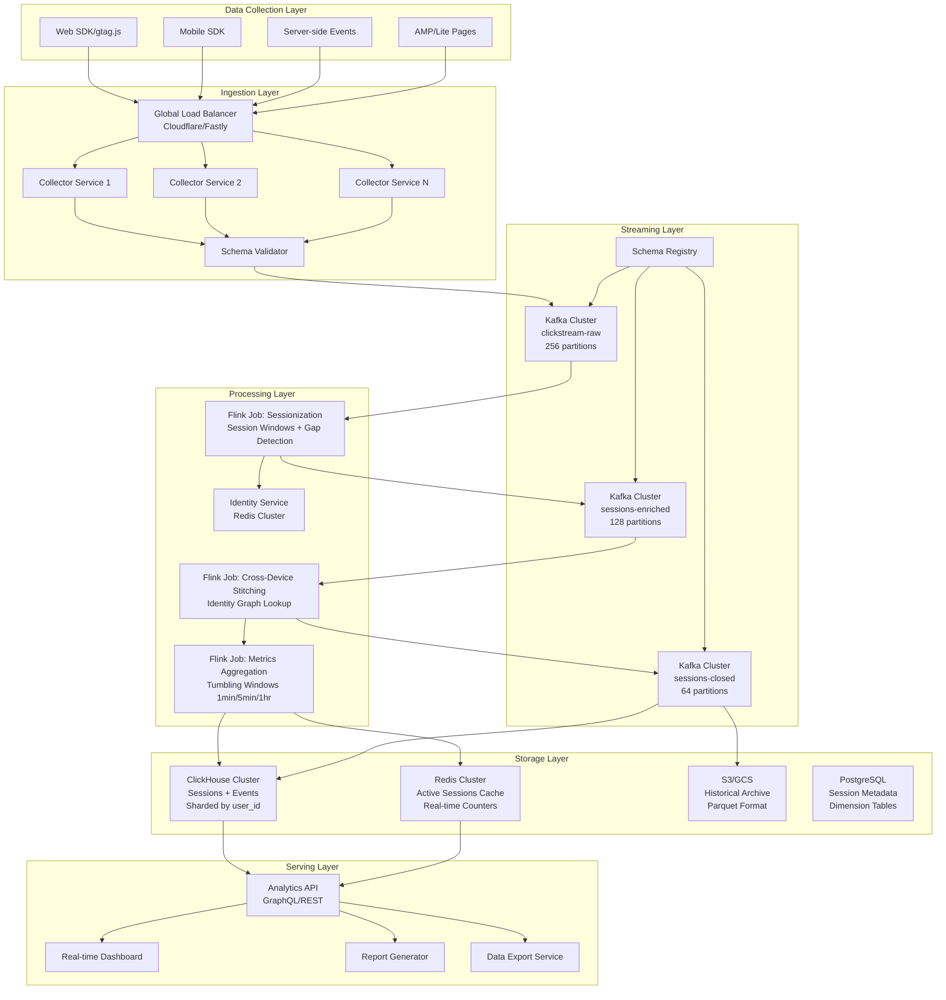
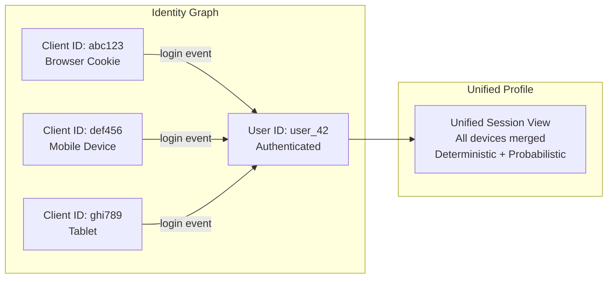
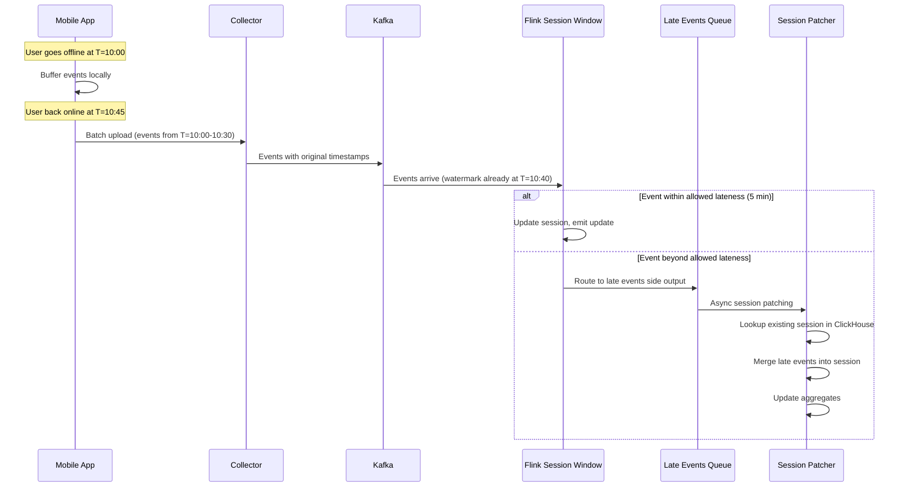
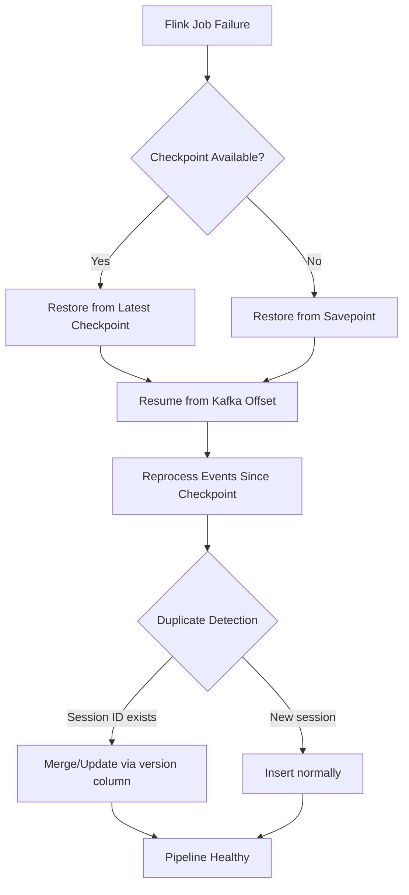

# Real-Time Session Analytics at Billion Scale

## Problem Statement

Modern digital products generate billions of clickstream events daily from hundreds of millions of users across web, mobile, and connected devices. Building real-time session analytics at Google Analytics scale requires:

- **10M+ concurrent sessions** across global infrastructure
- **Sub-second event ingestion** with 50B+ events/day
- **Session gap detection** with configurable inactivity timeouts (30min default)
- **Cross-device session stitching** linking anonymous and authenticated identities
- **Late event handling** for mobile users with intermittent connectivity
- **Real-time dashboards** with <5 second query latency on petabyte-scale data

The challenge is not just processing events—it's maintaining stateful session context across billions of sessions while handling clock skew, network delays, and identity resolution in real-time.

## Architecture Diagram



## Component Breakdown

### 1. Data Collection Layer

| Component | Technology | Purpose | Scale |
|-----------|-----------|---------|-------|
| Web SDK | Custom JS (gtag.js style) | Browser event capture | 2KB gzipped |
| Mobile SDK | Native iOS/Android | App event capture | Batched uploads |
| Server Events | HTTP API | Backend event submission | 100K RPS |
| Collector | Go/Rust microservice | Event validation + routing | 500K events/sec/node |

**Collector Service Configuration:**
```yaml
collector:
  server:
    port: 8080
    max_connections: 65535
    read_timeout: 5s
    write_timeout: 10s
  batching:
    max_batch_size: 1000
    max_wait_time: 100ms
    buffer_size: 100000
  validation:
    schema_cache_ttl: 60s
    max_event_size: 64KB
    required_fields: [client_id, timestamp, event_name]
  enrichment:
    geo_ip: true
    user_agent_parsing: true
    bot_detection: true
```

### 2. Kafka Configuration

```properties
# clickstream-raw topic
num.partitions=256
replication.factor=3
min.insync.replicas=2
retention.ms=172800000  # 48 hours
segment.bytes=1073741824  # 1GB
compression.type=zstd
max.message.bytes=1048576  # 1MB

# Partition strategy: murmur2(client_id) % num_partitions
# Ensures all events from same client go to same partition
# Critical for session window correctness
```

### 3. Flink Sessionization Job

```java
public class SessionizationJob {
    
    private static final Duration SESSION_GAP = Duration.ofMinutes(30);
    private static final Duration ALLOWED_LATENESS = Duration.ofMinutes(5);
    
    public static void main(String[] args) throws Exception {
        StreamExecutionEnvironment env = StreamExecutionEnvironment.getExecutionEnvironment();
        
        // Checkpointing for exactly-once
        env.enableCheckpointing(60000, CheckpointingMode.EXACTLY_ONCE);
        env.getCheckpointConfig().setMinPauseBetweenCheckpoints(30000);
        env.getCheckpointConfig().setCheckpointTimeout(120000);
        env.setStateBackend(new EmbeddedRocksDBStateBackend(true));
        
        // Configure RocksDB for large state
        env.getCheckpointConfig().setExternalizedCheckpointRetention(
            ExternalizedCheckpointRetention.RETAIN_ON_CANCELLATION);
        
        DataStream<ClickEvent> events = env
            .addSource(createKafkaSource())
            .assignTimestampsAndWatermarks(
                WatermarkStrategy.<ClickEvent>forBoundedOutOfOrderness(Duration.ofSeconds(30))
                    .withTimestampAssigner((event, ts) -> event.getEventTimestamp())
                    .withIdleness(Duration.ofMinutes(1))
            );
        
        // Session window with gap detection
        DataStream<SessionAggregate> sessions = events
            .keyBy(ClickEvent::getClientId)
            .window(EventTimeSessionWindows.withGap(SESSION_GAP))
            .allowedLateness(ALLOWED_LATENESS)
            .sideOutputLateData(lateOutputTag)
            .aggregate(new SessionAggregateFunction(), new SessionWindowFunction());
        
        // Handle late events
        DataStream<ClickEvent> lateEvents = sessions.getSideOutput(lateOutputTag);
        lateEvents.addSink(createLateEventsSink());
        
        sessions.addSink(createSessionsSink());
        env.execute("Session Analytics Pipeline");
    }
}
```

### 4. Session Aggregate Function

```java
public class SessionAggregateFunction 
    implements AggregateFunction<ClickEvent, SessionAccumulator, SessionAggregate> {
    
    @Override
    public SessionAccumulator createAccumulator() {
        return new SessionAccumulator();
    }
    
    @Override
    public SessionAccumulator add(ClickEvent event, SessionAccumulator acc) {
        acc.eventCount++;
        acc.events.add(event);
        
        if (acc.sessionStart == 0 || event.getEventTimestamp() < acc.sessionStart) {
            acc.sessionStart = event.getEventTimestamp();
            acc.landingPage = event.getPageUrl();
            acc.entrySource = event.getTrafficSource();
        }
        if (event.getEventTimestamp() > acc.sessionEnd) {
            acc.sessionEnd = event.getEventTimestamp();
            acc.exitPage = event.getPageUrl();
        }
        
        // Track engagement metrics
        if ("page_view".equals(event.getEventName())) {
            acc.pageViews++;
            acc.uniquePages.add(event.getPageUrl());
        }
        if (event.isConversion()) {
            acc.conversions++;
            acc.revenue += event.getRevenue();
        }
        
        // Bounce detection: single page view, duration < 10s
        acc.isBounce = (acc.pageViews == 1 && 
            (acc.sessionEnd - acc.sessionStart) < 10000);
        
        return acc;
    }
    
    @Override
    public SessionAggregate getResult(SessionAccumulator acc) {
        return SessionAggregate.builder()
            .sessionId(generateSessionId(acc))
            .clientId(acc.clientId)
            .sessionStart(acc.sessionStart)
            .sessionEnd(acc.sessionEnd)
            .duration(acc.sessionEnd - acc.sessionStart)
            .eventCount(acc.eventCount)
            .pageViews(acc.pageViews)
            .uniquePages(acc.uniquePages.size())
            .landingPage(acc.landingPage)
            .exitPage(acc.exitPage)
            .isBounce(acc.isBounce)
            .conversions(acc.conversions)
            .revenue(acc.revenue)
            .trafficSource(acc.entrySource)
            .build();
    }
}
```

## Cross-Device Session Stitching

### Identity Resolution Strategy



```java
public class CrossDeviceStitcher extends KeyedProcessFunction<String, SessionAggregate, EnrichedSession> {
    
    // State: identity mappings per client_id
    private ValueState<IdentityMapping> identityState;
    // State: pending sessions awaiting identity resolution
    private ListState<SessionAggregate> pendingSessionsState;
    
    @Override
    public void open(Configuration parameters) {
        ValueStateDescriptor<IdentityMapping> identityDesc = 
            new ValueStateDescriptor<>("identity", IdentityMapping.class);
        identityDesc.enableTimeToLive(StateTtlConfig.newBuilder(Time.days(30))
            .setUpdateType(StateTtlConfig.UpdateType.OnReadAndWrite)
            .build());
        identityState = getRuntimeContext().getState(identityDesc);
    }
    
    @Override
    public void processElement(SessionAggregate session, Context ctx, Collector<EnrichedSession> out) {
        IdentityMapping identity = identityState.value();
        
        if (session.hasAuthenticatedUserId()) {
            // Deterministic match: user logged in during session
            identity = updateIdentityGraph(identity, session);
            identityState.update(identity);
            
            // Resolve any pending sessions
            resolvePendingSessions(out, identity);
        }
        
        if (identity != null && identity.hasUnifiedId()) {
            // Known identity - emit enriched session immediately
            out.collect(enrichSession(session, identity));
        } else {
            // Unknown identity - buffer and set timer for probabilistic matching
            pendingSessionsState.add(session);
            ctx.timerService().registerEventTimeTimer(
                session.getSessionEnd() + Duration.ofMinutes(10).toMillis());
        }
    }
    
    private IdentityMapping updateIdentityGraph(IdentityMapping current, SessionAggregate session) {
        // Link client_id -> user_id
        // Also check for probabilistic signals:
        // - Same IP + similar user agent
        // - Same fingerprint hash
        // - Login within 5 minutes of anonymous session end
        return current.merge(session.getClientId(), session.getUserId(), 
            session.getFingerprint(), session.getIpAddress());
    }
}
```

## Late Event Handling Strategy



### Late Event Patcher Service

```python
class SessionPatcher:
    """Handles events that arrive after session window closes."""
    
    def __init__(self, clickhouse_client, redis_client):
        self.ch = clickhouse_client
        self.redis = redis_client
        self.patch_buffer = defaultdict(list)
        self.flush_interval = 30  # seconds
    
    async def process_late_event(self, event: ClickEvent):
        # Find the session this event belongs to
        session = await self.find_session(event.client_id, event.timestamp)
        
        if session:
            # Merge event into existing session
            updated = self.merge_event_into_session(session, event)
            self.patch_buffer[session.session_id].append(updated)
        else:
            # Create new micro-session for orphaned events
            micro_session = self.create_micro_session(event)
            self.patch_buffer[micro_session.session_id].append(micro_session)
        
        if len(self.patch_buffer) >= 1000:
            await self.flush_patches()
    
    async def find_session(self, client_id: str, event_time: int) -> Optional[Session]:
        """Find session where event_time falls within [start - gap, end + gap]."""
        query = """
            SELECT * FROM sessions
            WHERE client_id = %(client_id)s
            AND session_start <= %(time)s + 1800000
            AND session_end >= %(time)s - 1800000
            ORDER BY abs(session_end - %(time)s)
            LIMIT 1
        """
        return await self.ch.fetchone(query, {
            'client_id': client_id, 'time': event_time
        })
    
    async def flush_patches(self):
        """Batch update sessions in ClickHouse using CollapsingMergeTree."""
        mutations = []
        for session_id, patches in self.patch_buffer.items():
            final_patch = self.merge_patches(patches)
            mutations.append(final_patch)
        
        # Use ReplacingMergeTree version column for atomic updates
        await self.ch.execute(
            "INSERT INTO sessions VALUES", mutations
        )
        self.patch_buffer.clear()
```

## ClickHouse Schema Design

```sql
-- Sessions table with ReplacingMergeTree for late event patches
CREATE TABLE sessions ON CLUSTER '{cluster}'
(
    session_id        String,
    client_id         String,
    user_id           Nullable(String),
    unified_user_id   Nullable(String),
    
    -- Temporal
    session_start     DateTime64(3),
    session_end       DateTime64(3),
    session_date      Date MATERIALIZED toDate(session_start),
    duration_ms       UInt64,
    
    -- Engagement
    event_count       UInt32,
    page_views        UInt32,
    unique_pages      UInt16,
    landing_page      String,
    exit_page         String,
    is_bounce         UInt8,
    
    -- Conversion
    conversions       UInt16,
    revenue_cents     UInt64,
    
    -- Attribution
    traffic_source    LowCardinality(String),
    campaign          Nullable(String),
    medium            LowCardinality(String),
    
    -- Technical
    device_type       LowCardinality(String),
    browser           LowCardinality(String),
    os                LowCardinality(String),
    country           LowCardinality(String),
    region            LowCardinality(String),
    
    -- Versioning for updates
    version           UInt32,
    updated_at        DateTime64(3) DEFAULT now64(3)
)
ENGINE = ReplicatedReplacingMergeTree('/clickhouse/tables/{shard}/sessions', '{replica}', version)
PARTITION BY toYYYYMM(session_date)
ORDER BY (client_id, session_start, session_id)
SETTINGS index_granularity = 8192;

-- Real-time aggregation materialized view
CREATE MATERIALIZED VIEW sessions_hourly_mv TO sessions_hourly AS
SELECT
    toStartOfHour(session_start) as hour,
    traffic_source,
    device_type,
    country,
    count() as session_count,
    countIf(is_bounce = 1) as bounce_count,
    avg(duration_ms) as avg_duration,
    sum(page_views) as total_page_views,
    sum(revenue_cents) as total_revenue,
    uniqExact(coalesce(unified_user_id, client_id)) as unique_users
FROM sessions
GROUP BY hour, traffic_source, device_type, country;
```

## Scaling Strategies

### Horizontal Scaling by Session Volume

| Scale Tier | Concurrent Sessions | Kafka Partitions | Flink Parallelism | ClickHouse Shards |
|-----------|-------------------|-----------------|-------------------|-------------------|
| Small | 100K | 32 | 16 | 2 |
| Medium | 1M | 64 | 64 | 4 |
| Large | 10M | 256 | 256 | 16 |
| XL | 100M | 512 | 512 | 64 |

### State Management at Scale

```yaml
# Flink state backend configuration for 10M concurrent sessions
# Each session state ~2KB -> 20GB total state
state.backend: rocksdb
state.backend.rocksdb.memory.managed: true
state.backend.rocksdb.memory.fixed-per-slot: 512mb
state.backend.rocksdb.block.cache-size: 256mb
state.backend.rocksdb.writebuffer.size: 128mb
state.backend.rocksdb.writebuffer.count: 4
state.checkpoints.dir: s3://checkpoints/session-analytics/
state.backend.incremental: true

# Parallelism and resources
taskmanager.numberOfTaskSlots: 4
taskmanager.memory.process.size: 16384m
taskmanager.memory.managed.fraction: 0.4
```

### Partition Strategy

```
Key Design: client_id as partition key
- Guarantees session event ordering per user
- Enables local session state (no cross-partition joins)
- Risk: hot partitions for power users
- Mitigation: sub-partitioning for client_ids with >10K events/hour
```

## Failure Handling

### Checkpoint Recovery



### Failure Scenarios

| Scenario | Detection | Recovery | Data Impact |
|----------|-----------|----------|-------------|
| Flink TaskManager crash | Heartbeat timeout (30s) | Restart from checkpoint | ~1 min reprocessing |
| Kafka broker failure | ISR shrink | Automatic leader election | No data loss (RF=3) |
| ClickHouse node down | Health check | Query routing to replica | Read degradation only |
| Network partition | Split brain detection | Fencing via ZooKeeper | Pause until resolved |
| State corruption | Checksum mismatch | Rollback to previous checkpoint | Up to 1 checkpoint interval |

### Exactly-Once Guarantees

```java
// Kafka -> Flink -> Kafka exactly-once chain
KafkaSink<SessionAggregate> sink = KafkaSink.<SessionAggregate>builder()
    .setBootstrapServers(kafkaBootstrap)
    .setDeliverGuarantee(DeliveryGuarantee.EXACTLY_ONCE)
    .setTransactionalIdPrefix("session-analytics")
    .setProperty("transaction.timeout.ms", "900000")  // 15 min
    .setRecordSerializer(new SessionSerializer())
    .build();
```

## Cost Optimization

### Storage Tiering

```
Hot (0-7 days):     ClickHouse NVMe SSD - $0.10/GB/month
Warm (7-30 days):   ClickHouse HDD tier - $0.03/GB/month  
Cold (30-365 days): S3 Standard Parquet - $0.023/GB/month
Archive (1y+):      S3 Glacier - $0.004/GB/month

At 50B events/day (~5TB/day compressed):
- Hot storage:  35TB × $0.10 = $3,500/month
- Warm storage: 115TB × $0.03 = $3,450/month  
- Cold: 1.6PB × $0.023 = $36,800/month
- Total storage: ~$44K/month
```

### Compute Cost Breakdown

```
Kafka cluster (256 partitions, 3x replication):
- 24x i3.2xlarge = $14,400/month

Flink cluster (256 parallelism):
- 64x m5.4xlarge = $39,400/month

ClickHouse (16 shards, 2 replicas):
- 32x r5.4xlarge = $29,000/month

Redis cluster (active sessions):
- 8x r6g.2xlarge = $5,600/month

Total compute: ~$88,400/month
```

### Optimization Techniques

1. **Compression**: zstd on Kafka (3:1 ratio), LZ4 on ClickHouse
2. **Pre-aggregation**: Materialized views reduce query-time computation by 90%
3. **TTL-based eviction**: Auto-drop detailed events after 90 days
4. **Spot instances**: Use for Flink TaskManagers (with checkpoint recovery)
5. **Column pruning**: ClickHouse columnar format means queries only read needed columns

## Real-World Companies

| Company | Scale | Key Innovation |
|---------|-------|---------------|
| Google Analytics | 100B+ events/day | Proprietary sessionization, BigQuery integration |
| Amplitude | 1T+ events/month | Behavioral cohorting in real-time |
| Mixpanel | 500B events/year | JQL query language for session analysis |
| Snowplow | Open-source | Schema-first approach, enrichment pipeline |
| Heap | Auto-capture everything | Retroactive session definition |
| PostHog | Open-source | ClickHouse-native session recordings |
| Plausible | Privacy-focused | Cookie-less sessionization via hashing |

## Key Design Decisions

1. **Session gap = 30 minutes**: Industry standard, configurable per-client
2. **Client-side timestamps**: Preferred over server timestamps for accurate duration
3. **Watermark = 30 seconds**: Balance between latency and completeness
4. **Allowed lateness = 5 minutes**: Covers most mobile reconnection scenarios
5. **ReplacingMergeTree**: Enables idempotent late-event patching without complex dedup
6. **Identity resolution async**: Don't block session emission for cross-device matching
7. **Partition by client_id**: Guarantees correctness of session windows per user
