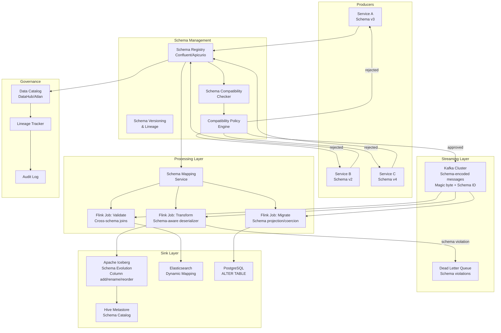
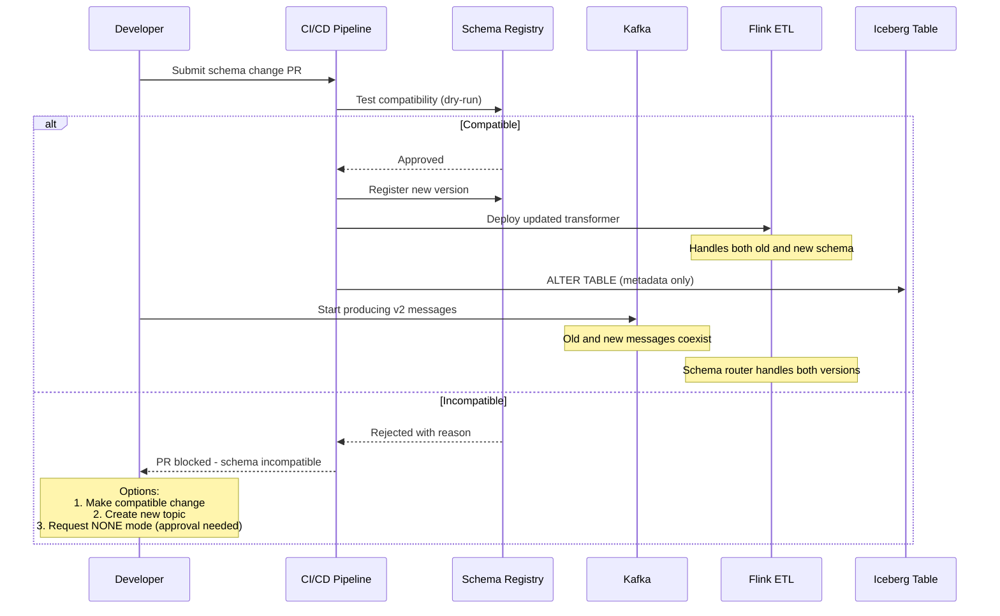
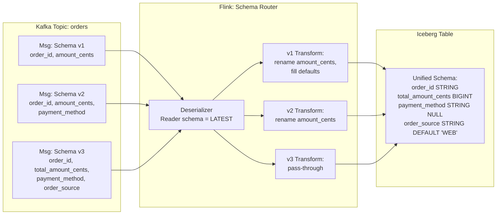
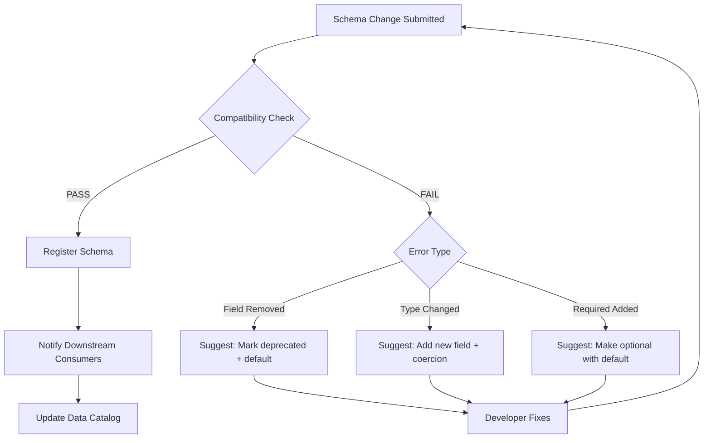

# Streaming ETL with Schema Evolution

## Problem Statement

In large-scale streaming systems processing billions of events daily, schemas inevitably change. Producers add fields, rename columns, change types, or deprecate attributes. Without proper schema evolution:

- **Breaking changes** crash downstream consumers instantly
- **Silent data corruption** occurs when types change without notice
- **Deployment coupling** forces all services to upgrade simultaneously
- **Historical data** becomes unreadable with new schemas
- **Data lake tables** become inconsistent with mixed schema versions

At Confluent-scale (10T+ messages/day across thousands of topics), schema evolution must be:
- Automated and policy-enforced
- Backward and forward compatible by default
- Zero-downtime for producers and consumers
- Auditable with full lineage tracking

## Architecture Diagram



## Schema Registry Deep Dive

### Compatibility Modes

| Mode | Rule | Use Case | Example |
|------|------|----------|---------|
| BACKWARD | New schema can read old data | Consumer-first upgrades | Add optional field |
| FORWARD | Old schema can read new data | Producer-first upgrades | Remove optional field |
| FULL | Both backward and forward | Independent deployments | Add optional field with default |
| TRANSITIVE | Compatibility across ALL versions | Strict governance | Enterprise systems |
| NONE | No checks | Development only | Prototyping |

### Schema Registry Configuration

```properties
# Confluent Schema Registry
kafkastore.topic=_schemas
kafkastore.topic.replication.factor=3
schema.compatibility.level=FULL_TRANSITIVE
schema.registry.group.id=schema-registry

# Performance tuning
kafkastore.init.timeout.ms=120000
schema.cache.size=1000
schema.cache.expiry.secs=300

# Security
schema.registry.resource.extension.class=io.confluent.kafka.schemaregistry.security.SchemaRegistrySecurityResourceExtension
confluent.schema.registry.authorizer.class=io.confluent.kafka.schemaregistry.security.authorizer.rbac.RbacAuthorizer
```

### Avro Schema Evolution Example

```json
// Version 1: Original schema
{
  "type": "record",
  "name": "OrderEvent",
  "namespace": "com.company.events",
  "fields": [
    {"name": "order_id", "type": "string"},
    {"name": "user_id", "type": "string"},
    {"name": "amount_cents", "type": "long"},
    {"name": "currency", "type": "string"},
    {"name": "timestamp", "type": "long", "logicalType": "timestamp-millis"}
  ]
}

// Version 2: BACKWARD compatible (add optional field with default)
{
  "type": "record",
  "name": "OrderEvent",
  "namespace": "com.company.events",
  "fields": [
    {"name": "order_id", "type": "string"},
    {"name": "user_id", "type": "string"},
    {"name": "amount_cents", "type": "long"},
    {"name": "currency", "type": "string"},
    {"name": "timestamp", "type": "long", "logicalType": "timestamp-millis"},
    {"name": "payment_method", "type": ["null", "string"], "default": null},
    {"name": "shipping_address", "type": ["null", "Address"], "default": null}
  ]
}

// Version 3: FULL compatible (add field with default, deprecate via alias)
{
  "type": "record",
  "name": "OrderEvent",
  "namespace": "com.company.events",
  "fields": [
    {"name": "order_id", "type": "string"},
    {"name": "user_id", "type": "string"},
    {"name": "total_amount_cents", "type": "long", "aliases": ["amount_cents"]},
    {"name": "currency", "type": "string", "default": "USD"},
    {"name": "timestamp", "type": "long", "logicalType": "timestamp-millis"},
    {"name": "payment_method", "type": ["null", "string"], "default": null},
    {"name": "shipping_address", "type": ["null", "Address"], "default": null},
    {"name": "order_source", "type": {"type": "enum", "name": "OrderSource", 
      "symbols": ["WEB", "MOBILE", "API"]}, "default": "WEB"}
  ]
}
```

## Avro vs Protobuf vs JSON Schema

### Comparison Matrix

| Feature | Avro | Protobuf | JSON Schema |
|---------|------|----------|-------------|
| Schema evolution | Excellent | Good | Limited |
| Encoding size | Small (no field names) | Smallest (varint) | Largest (text) |
| Schema in payload | Optional (registry) | No | No |
| Dynamic typing | Union types | oneof | anyOf |
| Default values | Full support | Proto3: zero values only | Full support |
| Rename fields | Aliases | No (field numbers) | No |
| Code generation | Optional | Required (usually) | Optional |
| Human readable | Schema yes, data no | Schema yes, data no | Both |
| Confluent support | First-class | First-class | First-class |
| Performance (ser) | ~800ns/msg | ~400ns/msg | ~2000ns/msg |
| Performance (deser) | ~600ns/msg | ~300ns/msg | ~3000ns/msg |

### When to Choose What

```
Choose AVRO when:
- Schema evolution is primary concern
- Need field renaming support
- Dynamic/polyglot consumers
- Data lake storage (self-describing)
- Hadoop ecosystem integration

Choose PROTOBUF when:
- Performance is critical (lowest latency)
- Strong typing with code generation preferred
- gRPC service communication
- Mobile/bandwidth-constrained environments
- Google ecosystem alignment

Choose JSON SCHEMA when:
- HTTP APIs with human debugging needs
- Gradual migration from schemaless
- JavaScript-heavy ecosystem
- Need readable data in Kafka tools
- Prototyping before committing to binary format
```

## Flink Schema-Aware Processing

```java
public class SchemaEvolutionAwareJob {
    
    public static void main(String[] args) throws Exception {
        StreamExecutionEnvironment env = StreamExecutionEnvironment.getExecutionEnvironment();
        
        // Schema Registry-aware Kafka source
        KafkaSource<GenericRecord> source = KafkaSource.<GenericRecord>builder()
            .setBootstrapServers("kafka:9092")
            .setTopics("orders")
            .setGroupId("streaming-etl")
            .setStartingOffsets(OffsetsInitializer.committedOffsets())
            .setDeserializer(new ConfluentRegistryAvroDeserializationSchema<>(
                GenericRecord.class,
                new CachedSchemaCoderProvider(
                    "http://schema-registry:8081",
                    1000  // cache size
                )
            ))
            .build();
        
        DataStream<GenericRecord> orders = env.fromSource(source, 
            WatermarkStrategy.forBoundedOutOfOrderness(Duration.ofSeconds(10)),
            "Kafka Orders Source");
        
        // Schema-version-aware transformation
        DataStream<NormalizedOrder> normalized = orders
            .process(new SchemaVersionRouter())
            .name("Schema Version Router");
        
        // Sink to Iceberg with schema evolution
        normalized.sinkTo(createIcebergSink());
        
        env.execute("Streaming ETL with Schema Evolution");
    }
}

public class SchemaVersionRouter extends ProcessFunction<GenericRecord, NormalizedOrder> {
    
    private transient SchemaRegistryClient schemaRegistry;
    private transient Map<Integer, SchemaTransformer> transformers;
    
    @Override
    public void open(Configuration parameters) {
        schemaRegistry = new CachedSchemaRegistryClient("http://schema-registry:8081", 100);
        transformers = new ConcurrentHashMap<>();
    }
    
    @Override
    public void processElement(GenericRecord record, Context ctx, Collector<NormalizedOrder> out) {
        Schema writerSchema = record.getSchema();
        int schemaVersion = getSchemaVersion(writerSchema);
        
        SchemaTransformer transformer = transformers.computeIfAbsent(
            schemaVersion, v -> buildTransformer(writerSchema));
        
        try {
            NormalizedOrder normalized = transformer.transform(record);
            out.collect(normalized);
        } catch (SchemaTransformException e) {
            // Route to DLQ with schema metadata
            ctx.output(dlqTag, new DLQRecord(record, e, schemaVersion));
        }
    }
    
    private SchemaTransformer buildTransformer(Schema writerSchema) {
        // Build transformation pipeline based on schema version
        // Handles: field renames, type coercion, default filling, nested evolution
        return SchemaTransformer.builder()
            .withFieldMapping("amount_cents", "total_amount_cents")  // v1->v3 rename
            .withDefaultValue("order_source", "WEB")  // Missing in v1, v2
            .withTypeCoercion("timestamp", LogicalTypes.timestampMillis())
            .withNullHandling(NullStrategy.USE_DEFAULT)
            .build();
    }
}
```

## Apache Iceberg Schema Evolution

### Iceberg Schema Operations

```sql
-- Iceberg supports schema evolution without rewriting data
-- All operations are metadata-only

-- Add columns (any position)
ALTER TABLE catalog.db.orders ADD COLUMNS (
    payment_method string AFTER currency,
    shipping_address struct<street:string, city:string, zip:string>
);

-- Rename columns (metadata only, no data rewrite)
ALTER TABLE catalog.db.orders RENAME COLUMN amount_cents TO total_amount_cents;

-- Widen types (int -> long, float -> double)
ALTER TABLE catalog.db.orders ALTER COLUMN order_count TYPE bigint;

-- Reorder columns
ALTER TABLE catalog.db.orders ALTER COLUMN currency AFTER total_amount_cents;

-- Make column optional
ALTER TABLE catalog.db.orders ALTER COLUMN shipping_address DROP NOT NULL;
```

### Iceberg + Flink Sink with Evolution

```java
public class IcebergEvolutionSink {
    
    public static IcebergSink<NormalizedOrder> createSink(TableLoader tableLoader) {
        // Iceberg Flink sink handles schema evolution automatically
        return IcebergSink.forRowData(tableLoader)
            .tableLoader(tableLoader)
            .overwrite(false)
            .flinkConf(flinkConf())
            .build();
    }
    
    private static FlinkWriteConf flinkConf() {
        Map<String, String> props = new HashMap<>();
        props.put("write.format.default", "parquet");
        props.put("write.parquet.compression-codec", "zstd");
        props.put("write.target-file-size-bytes", "536870912");  // 512MB
        props.put("write.distribution-mode", "hash");
        
        // Schema evolution settings
        props.put("write.spark.accept-any-schema", "true");
        props.put("compatibility.snapshot-id-inheritance.enabled", "true");
        
        return new FlinkWriteConf(props);
    }
}
```

### Schema Migration Strategy



## Data Flow: Multi-Version Processing



## Scaling Strategies

### Schema Registry High Availability

```yaml
# Multi-datacenter Schema Registry deployment
schema-registry:
  replicas: 3
  leader_eligibility: true
  kafkastore:
    topic: _schemas
    topic_replication_factor: 3
    security_protocol: SSL
  cache:
    capacity: 10000
    expiry_seconds: 300
  
  # Cross-datacenter replication
  schema_linking:
    enabled: true
    source_cluster: us-east-1
    destination_clusters: [eu-west-1, ap-southeast-1]
    sync_interval_ms: 1000
```

### Handling Breaking Changes at Scale

| Strategy | Approach | Downtime | Complexity |
|----------|----------|----------|------------|
| Dual-write | Write to both old and new topic | Zero | High |
| Topic versioning | orders-v1 -> orders-v2 migration | Zero | Medium |
| Shadow migration | New pipeline reads alongside old | Zero | Medium |
| Big-bang | Coordinate all services to upgrade | Minutes | Low |
| Strangler fig | Gradually redirect traffic to new | Zero | High |

### Topic Versioning Strategy

```python
class TopicMigrationOrchestrator:
    """Manages zero-downtime topic migrations for breaking schema changes."""
    
    async def execute_migration(self, source_topic: str, target_topic: str,
                                 transformer: SchemaTransformer):
        # Phase 1: Start dual-writing (new producers write to both)
        await self.enable_dual_write(source_topic, target_topic, transformer)
        
        # Phase 2: Backfill historical data
        await self.backfill(source_topic, target_topic, transformer,
                           start_offset='earliest', end_offset='latest')
        
        # Phase 3: Verify data consistency
        counts = await self.verify_consistency(source_topic, target_topic)
        assert counts.source == counts.target, f"Mismatch: {counts}"
        
        # Phase 4: Switch consumers to new topic
        await self.switch_consumers(source_topic, target_topic)
        
        # Phase 5: Deprecate old topic (retain for rollback window)
        await self.deprecate_topic(source_topic, retention_days=7)
```

## Failure Handling

### Dead Letter Queue with Schema Context

```java
public class SchemaAwareDLQ {
    
    @Data
    public static class DLQRecord {
        private byte[] originalPayload;
        private int writerSchemaId;
        private int readerSchemaId;
        private String errorMessage;
        private String errorType;  // DESERIALIZATION, TRANSFORMATION, VALIDATION
        private long originalTimestamp;
        private String sourceTopic;
        private int sourcePartition;
        private long sourceOffset;
        private Map<String, String> headers;
    }
    
    // DLQ consumer for manual/automated remediation
    public void processDLQ(DLQRecord record) {
        switch (record.getErrorType()) {
            case "DESERIALIZATION":
                // Schema truly incompatible - needs manual intervention
                alertOncall(record);
                break;
            case "TRANSFORMATION":
                // Transformer logic bug - auto-retry after fix
                retryQueue.add(record);
                break;
            case "VALIDATION":
                // Data quality issue - route to data quality team
                dataQualityQueue.add(record);
                break;
        }
    }
}
```

### Compatibility Violation Handling



## Cost Optimization

### Schema Registry Costs

```
Schema Registry cluster (3 nodes):
- 3x t3.large = $180/month
- Minimal compute - stores schemas in Kafka topic
- Cache hit ratio >99% reduces network

Kafka overhead for schema IDs:
- 5 bytes per message (magic byte + 4-byte schema ID)
- At 10B messages/day = 50GB/day overhead
- vs. embedding full schema: saves ~500B/message = 5TB/day savings

Net savings: $15,000/month in storage + bandwidth
```

### Avro vs Protobuf Storage Impact

```
Average message with 20 fields:
- JSON: ~500 bytes
- Avro (with registry): ~120 bytes  (76% reduction)
- Protobuf: ~95 bytes (81% reduction)
- JSON + gzip: ~180 bytes (64% reduction)

At 10B messages/day:
- JSON: 5TB/day
- Avro: 1.2TB/day -> saves $2,800/day in storage
- Protobuf: 950GB/day -> saves $3,050/day in storage
```

## Real-World Companies

| Company | Approach | Scale |
|---------|----------|-------|
| Confluent | Schema Registry + Avro/Protobuf/JSON | Millions of schemas |
| LinkedIn | Avro + internal schema evolution framework | 7T messages/day |
| Uber | Protobuf + schema management service | 1000+ schemas |
| Netflix | Avro + custom schema registry + Iceberg | Petabyte-scale lakes |
| Wix | Schema Registry + event catalog | 1500+ event types |
| Zalando | Nakadi (event bus with schema) | Thousands of event types |
| Shopify | Protobuf + Rails schema management | Billions of events |

## Best Practices Summary

1. **Default to FULL_TRANSITIVE** compatibility - most restrictive but safest
2. **Always add defaults** to new fields - enables backward compatibility
3. **Never remove required fields** - deprecate with docs, remove after 6 months
4. **Use schema ID in headers** - enables routing without deserialization
5. **Version your topics** for truly breaking changes - `orders.v2`
6. **Automate compatibility checks in CI/CD** - block incompatible PRs
7. **Maintain a schema changelog** - document why each version exists
8. **Test with production schemas** - integration tests against real registry
9. **Monitor schema versions per consumer group** - detect stragglers
10. **Set retention on schema versions** - don't accumulate thousands of versions
