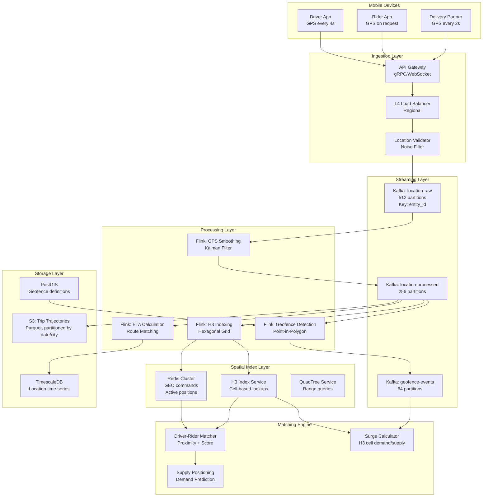
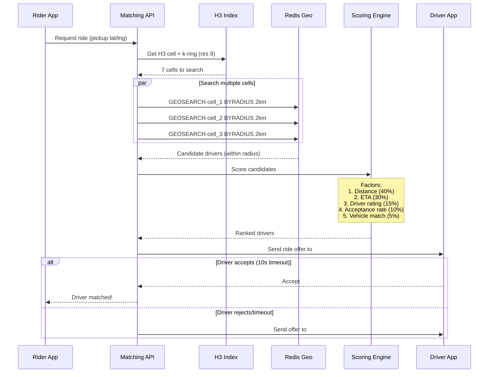

# Real-Time Geospatial Tracking at Scale

## Problem Statement

Ride-hailing platforms like Uber and Lyft process 50M+ location updates per minute from millions of drivers and riders simultaneously. The system must:

- **Ingest 50M GPS updates/minute** (~833K/sec) with <100ms end-to-end latency
- **Match drivers to riders** within 500ms using proximity search
- **Track live positions** of millions of moving entities on a map
- **Handle GPS noise** (accuracy: 3-50m depending on environment)
- **Support geofencing** for surge pricing zones, airport queues, restricted areas
- **Maintain historical trajectories** for ETA prediction, route optimization, billing

The core challenge: performing spatial queries (nearest-neighbor, point-in-polygon, range queries) at sub-millisecond latency while the underlying data changes 833K times per second.

## Architecture Diagram



## H3 Hexagonal Indexing

### Why H3 Over Geohash

| Property | H3 (Uber) | Geohash | S2 (Google) |
|----------|-----------|---------|-------------|
| Cell shape | Hexagon | Rectangle | Quad |
| Neighbor uniformity | Equal distance | Variable | Variable |
| Edge distortion | Minimal | High at poles | Low |
| Resolution levels | 16 (0-15) | 12 (1-12) | 31 (0-30) |
| Proximity queries | Natural (6 neighbors) | Complex (8 neighbors, size varies) | Good |
| Use case fit | Ride-hailing, delivery | Simple geo-bucketing | Mapping, indexing |

### H3 Resolution Selection

```
Resolution 7:  ~5.16 km² area - City-level supply/demand
Resolution 8:  ~0.74 km² area - Neighborhood-level surge pricing
Resolution 9:  ~0.105 km² area - Block-level driver matching
Resolution 10: ~0.015 km² area - Street-level precision
Resolution 11: ~0.002 km² area - Exact pickup point

For driver-rider matching: Resolution 9 (covers ~350m radius)
For surge pricing zones: Resolution 7 (covers ~2.5km radius)
For supply heatmaps: Resolution 8
```

### H3 Indexing in Flink

```java
public class H3IndexingFunction extends KeyedProcessFunction<String, LocationEvent, IndexedLocation> {
    
    private static final int MATCHING_RESOLUTION = 9;
    private static final int SURGE_RESOLUTION = 7;
    
    private transient H3Core h3;
    private ValueState<LocationEvent> previousLocationState;
    
    @Override
    public void open(Configuration parameters) throws Exception {
        h3 = H3Core.newInstance();
        previousLocationState = getRuntimeContext().getState(
            new ValueStateDescriptor<>("prev_location", LocationEvent.class));
    }
    
    @Override
    public void processElement(LocationEvent event, Context ctx, Collector<IndexedLocation> out) {
        LocationEvent previous = previousLocationState.value();
        
        // GPS noise filtering via Kalman filter
        LocationEvent smoothed = applyKalmanFilter(previous, event);
        
        // Calculate speed and heading
        double speed = 0;
        double heading = 0;
        if (previous != null) {
            speed = calculateSpeed(previous, smoothed);
            heading = calculateHeading(previous, smoothed);
            
            // Reject physically impossible movements (>300 km/h for cars)
            if (speed > 83.33) { // m/s
                return; // Drop this update
            }
        }
        
        // Generate H3 indices at multiple resolutions
        long h3IndexRes9 = h3.latLngToCell(smoothed.getLat(), smoothed.getLng(), MATCHING_RESOLUTION);
        long h3IndexRes7 = h3.latLngToCell(smoothed.getLat(), smoothed.getLng(), SURGE_RESOLUTION);
        
        // Get k-ring for proximity matching (radius-1 ring = 7 cells)
        List<Long> kRing = h3.gridDisk(h3IndexRes9, 1);  // Center + 6 neighbors
        
        IndexedLocation indexed = IndexedLocation.builder()
            .entityId(event.getEntityId())
            .entityType(event.getEntityType())
            .lat(smoothed.getLat())
            .lng(smoothed.getLng())
            .h3Res9(h3IndexRes9)
            .h3Res7(h3IndexRes7)
            .kRingRes9(kRing)
            .speed(speed)
            .heading(heading)
            .timestamp(smoothed.getTimestamp())
            .accuracy(smoothed.getAccuracy())
            .build();
        
        out.collect(indexed);
        previousLocationState.update(smoothed);
    }
    
    private LocationEvent applyKalmanFilter(LocationEvent previous, LocationEvent current) {
        if (previous == null) return current;
        
        // Simple Kalman filter for GPS smoothing
        double processNoise = 3.0;  // meters - expected movement noise
        double measurementNoise = current.getAccuracy();  // GPS reported accuracy
        
        double kalmanGain = processNoise / (processNoise + measurementNoise);
        
        double smoothedLat = previous.getLat() + kalmanGain * (current.getLat() - previous.getLat());
        double smoothedLng = previous.getLng() + kalmanGain * (current.getLng() - previous.getLng());
        
        return current.toBuilder()
            .lat(smoothedLat)
            .lng(smoothedLng)
            .build();
    }
}
```

## Redis Geospatial Index

### Active Position Storage

```redis
# Store driver position using Redis GEO commands
# Key structure: geo:drivers:{h3_res7_cell}
# This shards the geo index by H3 cell for scalability

GEOADD geo:drivers:872830828ffffff 
    -73.985428 40.748817 "driver_12345"
    -73.986100 40.749200 "driver_67890"

# Find nearest drivers within 2km radius
GEOSEARCH geo:drivers:872830828ffffff 
    FROMLONLAT -73.985000 40.748500 
    BYRADIUS 2 km 
    ASC 
    COUNT 10 
    WITHCOORD WITHDIST

# Response: drivers sorted by distance with coordinates
```

### Redis Cluster Configuration for Geo

```yaml
redis_cluster:
  nodes: 30  # 15 masters + 15 replicas
  memory_per_node: 64GB
  total_capacity: 960GB
  
  # Key distribution
  slot_assignment:
    # Geo keys sharded by H3 resolution-7 cell
    # ~50K active H3 cells globally
    # Each cell: ~100 drivers average = 5M drivers total
    
  performance:
    geo_add_latency_p99: 0.3ms
    geo_search_latency_p99: 1.2ms
    throughput: 500K ops/sec per node
    
  # Position TTL (driver goes offline after no update for 60s)
  ttl_seconds: 60
  
  # Eviction policy for memory pressure
  maxmemory_policy: volatile-ttl
```

## Driver-Rider Matching Algorithm



### Matching Scoring Function

```python
class DriverScoringEngine:
    """Multi-factor driver scoring for optimal matching."""
    
    WEIGHTS = {
        'distance': 0.40,
        'eta': 0.30,
        'rating': 0.15,
        'acceptance_rate': 0.10,
        'vehicle_match': 0.05,
    }
    
    def score_candidates(self, rider_request: RideRequest, 
                         candidates: List[DriverCandidate]) -> List[ScoredDriver]:
        scored = []
        for driver in candidates:
            score = self._calculate_score(rider_request, driver)
            scored.append(ScoredDriver(driver=driver, score=score))
        
        return sorted(scored, key=lambda x: x.score, reverse=True)
    
    def _calculate_score(self, request: RideRequest, driver: DriverCandidate) -> float:
        # Distance score (inverse, normalized to 0-1)
        max_distance = 5000  # meters
        distance_score = max(0, 1 - (driver.distance_m / max_distance))
        
        # ETA score (accounts for traffic, road network)
        max_eta = 600  # seconds (10 min)
        eta_score = max(0, 1 - (driver.eta_seconds / max_eta))
        
        # Rating score (4.0-5.0 range normalized)
        rating_score = (driver.rating - 4.0) / 1.0
        
        # Acceptance rate (penalize frequent decliners)
        acceptance_score = driver.acceptance_rate_30d
        
        # Vehicle match (exact match = 1.0, compatible = 0.7, mismatch = 0)
        vehicle_score = self._vehicle_match_score(request.vehicle_type, driver.vehicle_type)
        
        return (
            self.WEIGHTS['distance'] * distance_score +
            self.WEIGHTS['eta'] * eta_score +
            self.WEIGHTS['rating'] * rating_score +
            self.WEIGHTS['acceptance_rate'] * acceptance_score +
            self.WEIGHTS['vehicle_match'] * vehicle_score
        )
```

## Geofence Detection

```java
public class GeofenceDetectionFunction 
    extends KeyedBroadcastProcessFunction<String, IndexedLocation, Geofence, GeofenceEvent> {
    
    // Broadcast state: all active geofences
    private static final MapStateDescriptor<String, Geofence> GEOFENCE_STATE = 
        new MapStateDescriptor<>("geofences", String.class, Geofence.class);
    
    // Keyed state: entity's current geofence membership
    private MapState<String, Boolean> entityGeofenceState;
    
    @Override
    public void processElement(IndexedLocation location, ReadOnlyContext ctx, 
                               Collector<GeofenceEvent> out) {
        ReadOnlyBroadcastState<String, Geofence> geofences = 
            ctx.getBroadcastState(GEOFENCE_STATE);
        
        // Check H3-cell-relevant geofences only (pre-filtered by spatial index)
        for (Map.Entry<String, Geofence> entry : geofences.immutableEntries()) {
            Geofence fence = entry.getValue();
            
            // Quick H3 cell overlap check before expensive point-in-polygon
            if (!fence.getH3Cells().contains(location.getH3Res7())) {
                continue;
            }
            
            boolean isInside = fence.contains(location.getLat(), location.getLng());
            Boolean wasInside = entityGeofenceState.get(fence.getId());
            
            if (isInside && (wasInside == null || !wasInside)) {
                // ENTER event
                out.collect(new GeofenceEvent(location.getEntityId(), fence.getId(), 
                    GeofenceEventType.ENTER, location.getTimestamp()));
                entityGeofenceState.put(fence.getId(), true);
            } else if (!isInside && wasInside != null && wasInside) {
                // EXIT event
                out.collect(new GeofenceEvent(location.getEntityId(), fence.getId(),
                    GeofenceEventType.EXIT, location.getTimestamp()));
                entityGeofenceState.put(fence.getId(), false);
            }
        }
    }
}
```

## Scaling Strategies

### Geographic Sharding

```
Global deployment with regional isolation:

Region 1 (US): 
  - Kafka: 512 partitions, 24 brokers
  - Flink: 256 parallelism
  - Redis: 30 nodes (15 masters)
  - Capacity: 20M updates/min

Region 2 (EU):
  - Kafka: 256 partitions, 12 brokers
  - Flink: 128 parallelism
  - Redis: 16 nodes (8 masters)
  - Capacity: 10M updates/min

Region 3 (APAC):
  - Kafka: 384 partitions, 18 brokers
  - Flink: 192 parallelism
  - Redis: 24 nodes (12 masters)
  - Capacity: 15M updates/min

Cross-region: Only aggregated supply/demand metrics replicated
```

### Hot-Spot Handling

```python
class HotSpotMitigator:
    """Handle geographic hot spots (airports, stadiums, events)."""
    
    def __init__(self):
        self.hot_cells = {}  # H3 cell -> overflow partition
        self.threshold = 10000  # drivers per cell triggers hot-spot mode
    
    def route_update(self, location: IndexedLocation) -> int:
        cell = location.h3_res7
        count = self.get_cell_count(cell)
        
        if count > self.threshold:
            # Hot spot: sub-partition by H3 res-9 cell
            return hash(location.h3_res9) % self.overflow_partitions
        else:
            # Normal: partition by H3 res-7 cell
            return hash(cell) % self.normal_partitions
    
    def adaptive_resolution(self, cell: str, load: int) -> int:
        """Dynamically increase resolution for overloaded cells."""
        if load > 50000:
            return 10  # Street level
        elif load > 10000:
            return 9   # Block level
        elif load > 1000:
            return 8   # Neighborhood
        else:
            return 7   # City area
```

## Failure Handling

| Failure | Impact | Mitigation |
|---------|--------|-----------|
| GPS signal loss | No updates for entity | Last-known position + predicted trajectory |
| Redis node failure | Geo queries fail for shard | Automatic failover (sentinel), stale reads OK |
| Flink checkpoint failure | Processing pause | Incremental checkpoints, fast recovery |
| Kafka partition leader loss | Ingestion delay (1-3s) | ISR election, client retry |
| Network partition (regional) | Region isolated | Local matching continues, cross-region disabled |
| H3 index service down | No cell-based lookups | Fall back to Redis GEOSEARCH (slower) |

### Graceful Degradation

```yaml
degradation_levels:
  level_0_healthy:
    matching_radius: 2km
    update_frequency: 4s
    features: [matching, surge, eta, geofence]
    
  level_1_redis_degraded:
    matching_radius: 5km  # Larger radius, fewer precision
    update_frequency: 4s
    features: [matching, surge]  # Disable geofence checks
    
  level_2_flink_degraded:
    matching_radius: 5km
    update_frequency: 10s  # Reduce processing load
    features: [matching]  # Basic matching only
    
  level_3_emergency:
    matching_radius: 10km
    update_frequency: 30s
    features: [matching]  # Fallback to simple distance sort
    strategy: direct_redis_geo_only  # Bypass Flink entirely
```

## Cost Optimization

### Compute Costs (US Region)

```
Kafka (24 brokers, i3.4xlarge):    $35,000/month
Flink (64 TaskManagers, m5.4xl):   $39,000/month
Redis (30 nodes, r6g.2xlarge):     $16,800/month
API Gateway (50 instances):         $8,000/month
S3 storage (trajectories):         $12,000/month
Total:                             ~$111,000/month

Cost per location update: $0.0000037 ($3.7 per million)
Cost per match: $0.003
```

### Optimization Techniques

1. **Adaptive GPS frequency**: 4s in city, 10s on highway, 30s when parked
2. **Delta encoding**: Only send updates when position changes >10m
3. **Batch ingestion**: Mobile SDKs batch 5-10 updates per HTTP request
4. **Tiered storage**: Active positions in Redis, last-hour in TimescaleDB, historical in S3
5. **H3 cell caching**: Pre-compute cell membership, avoid repeated geo calculations
6. **Spot instances for Flink**: 60% cost reduction with checkpoint-based recovery

## Real-World Companies

| Company | Scale | Key Innovation |
|---------|-------|---------------|
| Uber | 50M+ updates/min | H3 hexagonal indexing, Ringpop |
| Lyft | 20M+ updates/min | Envoy-based geo-routing |
| Grab | 30M+ updates/min | Custom spatial indexing for SE Asia density |
| DiDi | 100M+ updates/min | ML-based ETA with traffic prediction |
| DoorDash | 15M+ updates/min | Delivery time estimation |
| Bolt | 10M+ updates/min | Edge computing for EU markets |
| Swiggy/Zomato | 25M+ updates/min | India-specific GPS correction |

## Key Design Decisions

1. **H3 resolution 9 for matching**: ~350m effective radius, 7 cells cover pickup area
2. **Redis GEO over PostGIS**: Sub-ms latency for live queries; PostGIS for geofence definitions only
3. **Kalman filter on server**: Don't trust client-side smoothing, centralize logic
4. **4-second GPS interval**: Balance between accuracy and battery/bandwidth cost
5. **Regional isolation**: Matching is local; no cross-region dependency for core flow
6. **Kafka key = entity_id**: Guarantees ordered processing per driver/rider
7. **Broadcast state for geofences**: 10K geofences fit in memory, replicated to all workers
