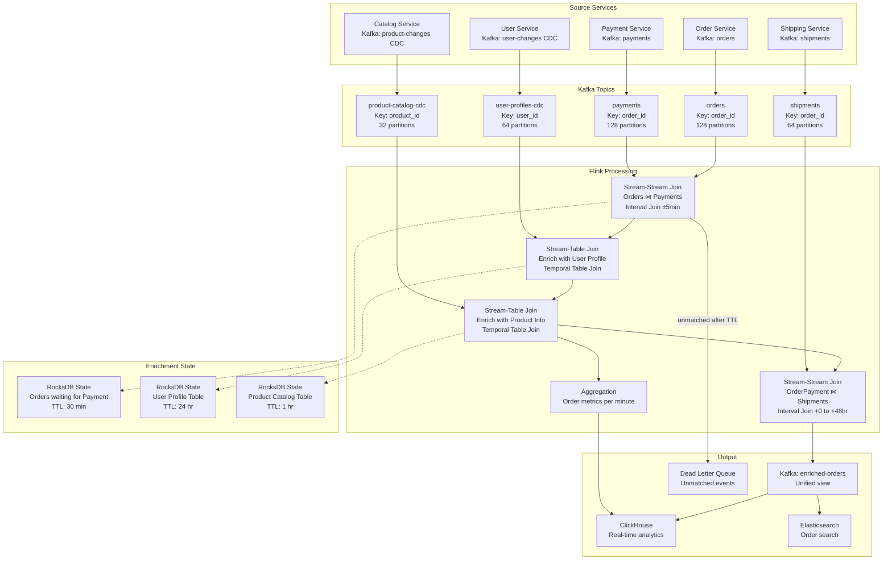
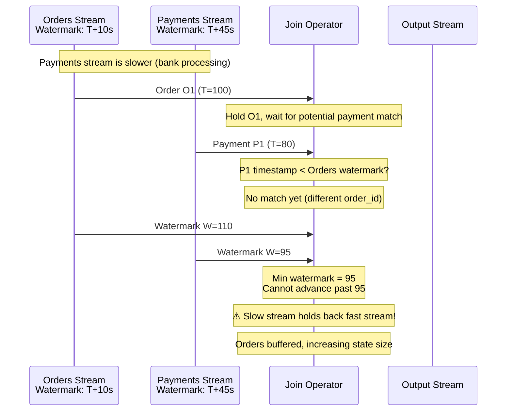
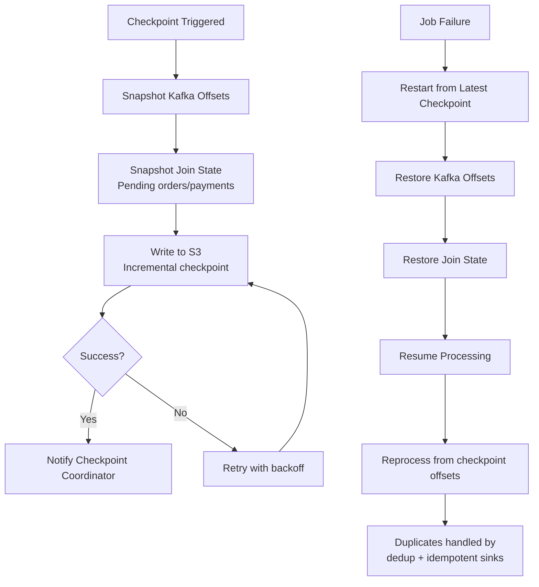

# Stream-Stream and Stream-Table Joins at Scale

## Problem Statement

E-commerce platforms process millions of orders, payments, shipments, and user interactions that must be correlated in real-time. A single purchase triggers events across 5-10 microservices, and the business needs a unified, enriched view within seconds:

- **Order placed** (order service) must join with **payment confirmed** (payment service)
- **Both** must be enriched with **user profile** (user service) and **product catalog** (catalog service)
- Events arrive **out-of-order** with different latencies (orders: instant, payments: 2-30s, shipment: minutes)
- **Asymmetric join windows**: payment may arrive before or after order event
- **State TTL management**: can't keep all orders in memory forever
- **Scale**: 500K orders/hour, 2M payment events/hour, 100M user profiles for enrichment

The challenge: performing temporal joins with correctness guarantees while managing terabytes of state across streams with different velocities and ordering characteristics.

## Architecture Diagram



## Join Types Deep Dive

### 1. Interval Join (Order ⋈ Payment)

```java
/**
 * Interval Join: Orders join with Payments within a time window.
 * Order timestamp - 1min <= Payment timestamp <= Order timestamp + 30min
 * 
 * Handles:
 * - Payment arrives before order (race condition in microservices): -1min
 * - Payment arrives after order (normal flow): up to +30min
 * - Retried payments (dedup by payment_id)
 */
public class OrderPaymentJoinJob {
    
    public static void main(String[] args) throws Exception {
        StreamExecutionEnvironment env = StreamExecutionEnvironment.getExecutionEnvironment();
        env.enableCheckpointing(60_000, CheckpointingMode.EXACTLY_ONCE);
        env.setStateBackend(new EmbeddedRocksDBStateBackend(true));
        
        // Configure watermarks
        DataStream<OrderEvent> orders = env
            .addSource(createOrderSource())
            .assignTimestampsAndWatermarks(
                WatermarkStrategy.<OrderEvent>forBoundedOutOfOrderness(Duration.ofSeconds(10))
                    .withTimestampAssigner((e, t) -> e.getCreatedAt())
                    .withIdleness(Duration.ofMinutes(1))
            );
        
        DataStream<PaymentEvent> payments = env
            .addSource(createPaymentSource())
            .assignTimestampsAndWatermarks(
                WatermarkStrategy.<PaymentEvent>forBoundedOutOfOrderness(Duration.ofSeconds(30))
                    .withTimestampAssigner((e, t) -> e.getProcessedAt())
                    .withIdleness(Duration.ofMinutes(1))
            );
        
        // Interval join: payment can arrive 1min before to 30min after order
        DataStream<OrderWithPayment> joined = orders
            .keyBy(OrderEvent::getOrderId)
            .intervalJoin(payments.keyBy(PaymentEvent::getOrderId))
            .between(Time.minutes(-1), Time.minutes(30))
            .upperBoundExclusive()
            .process(new OrderPaymentJoinFunction());
        
        joined.addSink(createEnrichedOrderSink());
        env.execute("Order-Payment Interval Join");
    }
}

public class OrderPaymentJoinFunction 
    extends ProcessJoinFunction<OrderEvent, PaymentEvent, OrderWithPayment> {
    
    private transient Counter matchedCounter;
    private transient Counter duplicatePaymentCounter;
    
    @Override
    public void processElement(OrderEvent order, PaymentEvent payment, Context ctx, 
                               Collector<OrderWithPayment> out) {
        // Dedup: multiple payment attempts for same order
        // The interval join may fire multiple times if retries exist
        OrderWithPayment result = OrderWithPayment.builder()
            .orderId(order.getOrderId())
            .userId(order.getUserId())
            .orderItems(order.getItems())
            .orderTotal(order.getTotalCents())
            .orderTimestamp(order.getCreatedAt())
            .paymentId(payment.getPaymentId())
            .paymentMethod(payment.getMethod())
            .paymentStatus(payment.getStatus())
            .paymentTimestamp(payment.getProcessedAt())
            .paymentLatencyMs(payment.getProcessedAt() - order.getCreatedAt())
            .build();
        
        out.collect(result);
        matchedCounter.inc();
    }
}
```

### 2. Temporal Table Join (User Profile Enrichment)

```java
/**
 * Temporal Table Join: Enrich stream with latest user profile version.
 * Uses the profile version that was valid AT THE TIME of the order.
 * 
 * Key insight: User may change address AFTER placing order.
 * We need the profile as it was when the order was placed.
 */
public class UserProfileEnrichment {
    
    public static DataStream<EnrichedOrder> enrichWithUserProfile(
            DataStream<OrderWithPayment> orders,
            DataStream<UserProfileChange> userChanges) {
        
        // Create a temporal table from user profile changes
        // This maintains the full version history per user_id
        StreamTableEnvironment tableEnv = StreamTableEnvironment.create(env);
        
        // Register user profiles as a versioned table
        Table userProfileTable = tableEnv.fromChangelogStream(
            userChanges,
            Schema.newBuilder()
                .column("user_id", DataTypes.STRING())
                .column("name", DataTypes.STRING())
                .column("email", DataTypes.STRING())
                .column("tier", DataTypes.STRING())  // gold, silver, bronze
                .column("address", DataTypes.ROW(...))
                .column("updated_at", DataTypes.TIMESTAMP_LTZ(3))
                .watermark("updated_at", "updated_at - INTERVAL '5' SECOND")
                .primaryKey("user_id")
                .build()
        );
        tableEnv.createTemporaryView("user_profiles", userProfileTable);
        
        // Temporal join: get user profile AS OF order time
        String query = """
            SELECT 
                o.*,
                u.name as user_name,
                u.email as user_email,
                u.tier as user_tier,
                u.address as shipping_address
            FROM orders_stream o
            JOIN user_profiles FOR SYSTEM_TIME AS OF o.order_timestamp AS u
                ON o.user_id = u.user_id
        """;
        
        Table enrichedTable = tableEnv.sqlQuery(query);
        return tableEnv.toDataStream(enrichedTable, EnrichedOrder.class);
    }
}
```

### 3. Handling Unmatched Events

```java
/**
 * Custom process function for handling orders that never get a matching payment.
 * Uses timers to detect unmatched orders after the join window expires.
 */
public class UnmatchedOrderDetector 
    extends KeyedCoProcessFunction<String, OrderEvent, PaymentEvent, UnmatchedAlert> {
    
    private ValueState<OrderEvent> pendingOrderState;
    private ValueState<Boolean> matchedState;
    
    // TTL config: auto-clean state after 1 hour
    private static final StateTtlConfig TTL_CONFIG = StateTtlConfig
        .newBuilder(org.apache.flink.api.common.time.Time.hours(1))
        .setUpdateType(StateTtlConfig.UpdateType.OnCreateAndWrite)
        .setStateVisibility(StateTtlConfig.StateVisibility.NeverReturnExpired)
        .cleanupFullSnapshot()
        .build();
    
    @Override
    public void open(Configuration params) {
        ValueStateDescriptor<OrderEvent> orderDesc = 
            new ValueStateDescriptor<>("pending-order", OrderEvent.class);
        orderDesc.enableTimeToLive(TTL_CONFIG);
        pendingOrderState = getRuntimeContext().getState(orderDesc);
        
        ValueStateDescriptor<Boolean> matchedDesc = 
            new ValueStateDescriptor<>("matched", Boolean.class);
        matchedDesc.enableTimeToLive(TTL_CONFIG);
        matchedState = getRuntimeContext().getState(matchedDesc);
    }
    
    @Override
    public void processElement1(OrderEvent order, Context ctx, Collector<UnmatchedAlert> out) {
        pendingOrderState.update(order);
        // Set timer: if no payment in 30 minutes, alert
        ctx.timerService().registerEventTimeTimer(
            order.getCreatedAt() + Duration.ofMinutes(30).toMillis());
    }
    
    @Override
    public void processElement2(PaymentEvent payment, Context ctx, Collector<UnmatchedAlert> out) {
        matchedState.update(true);
        // Cancel the unmatched timer (implicitly by checking state in onTimer)
    }
    
    @Override
    public void onTimer(long timestamp, OnTimerContext ctx, Collector<UnmatchedAlert> out) {
        Boolean matched = matchedState.value();
        if (matched == null || !matched) {
            OrderEvent order = pendingOrderState.value();
            if (order != null) {
                out.collect(new UnmatchedAlert(
                    order.getOrderId(), "PAYMENT_TIMEOUT", 
                    "No payment received within 30 minutes"));
            }
        }
        // Clean up state
        pendingOrderState.clear();
        matchedState.clear();
    }
}
```

## Watermark Alignment

### The Problem



### Watermark Alignment Strategy

```java
// Solution: Configure watermark alignment groups
WatermarkStrategy<OrderEvent> orderWatermark = WatermarkStrategy
    .<OrderEvent>forBoundedOutOfOrderness(Duration.ofSeconds(10))
    .withTimestampAssigner((e, t) -> e.getCreatedAt())
    .withWatermarkAlignment("order-payment-group", Duration.ofSeconds(30), Duration.ofSeconds(5));

WatermarkStrategy<PaymentEvent> paymentWatermark = WatermarkStrategy
    .<PaymentEvent>forBoundedOutOfOrderness(Duration.ofSeconds(30))
    .withTimestampAssigner((e, t) -> e.getProcessedAt())
    .withWatermarkAlignment("order-payment-group", Duration.ofSeconds(30), Duration.ofSeconds(5));

// Alignment ensures:
// - Fast stream pauses if it gets too far ahead (30s max drift)
// - Prevents unbounded state growth from misaligned watermarks
// - Check interval: every 5 seconds
```

## State TTL Management

### Configuration for Production

```yaml
# State TTL per join type
state_management:
  order_payment_join:
    ttl: 30m       # Payment must arrive within 30 min
    cleanup: incremental  # Clean during checkpoint
    precision: event_time  # TTL based on event time, not processing time
    
  order_shipment_join:
    ttl: 48h       # Shipment can take up to 48 hours
    cleanup: rocksdb_compaction  # Large state, clean during compaction
    
  user_profile_table:
    ttl: 24h       # Re-fetch if older than 24h
    cleanup: full_snapshot
    update_on_read: true  # Reset TTL on access
    
  product_catalog_table:
    ttl: 1h        # Products change frequently (pricing)
    cleanup: incremental
    update_on_read: false  # Strict 1-hour freshness

# State size estimates
state_sizing:
  order_payment_join:
    avg_record_size: 2KB
    concurrent_pending: 500K   # orders waiting for payment
    total_state: ~1GB
    
  user_profile_table:
    avg_record_size: 5KB
    total_records: 100M
    total_state: ~500GB       # Requires large RocksDB config
    
  product_catalog_table:
    avg_record_size: 3KB
    total_records: 50M
    total_state: ~150GB
```

### RocksDB Tuning for Join State

```properties
# Flink RocksDB configuration for large join state
state.backend.rocksdb.memory.managed: true
state.backend.rocksdb.memory.fixed-per-slot: 1024mb
state.backend.rocksdb.block.cache-size: 512mb
state.backend.rocksdb.writebuffer.size: 256mb
state.backend.rocksdb.writebuffer.count: 4
state.backend.rocksdb.compaction.level.use-dynamic-size: true
state.backend.rocksdb.compaction.style: LEVEL
state.backend.rocksdb.thread.num: 4

# Incremental checkpoints (critical for 500GB+ state)
state.backend.incremental: true
state.checkpoints.dir: s3://checkpoints/streaming-joins/
execution.checkpointing.interval: 120000
execution.checkpointing.min-pause: 60000
execution.checkpointing.timeout: 600000
execution.checkpointing.max-concurrent: 1
```

## Handling Out-of-Order Events

### Event Time vs Processing Time Impact

```
Scenario: Order created at T=100, Payment processed at T=105
Normal case: Both arrive in order -> join matches immediately

Out-of-order case 1: Payment arrives first
- T=103 (proc time): Payment P arrives, no matching order yet
- T=108 (proc time): Order O arrives
- Interval join handles this: lower bound = -1min allows payment before order

Out-of-order case 2: Order arrives very late
- T=105 (proc time): Payment P arrives
- T=200 (proc time): Order O arrives (delayed by network issue)
- Event time watermark has advanced past O's timestamp
- Result: O is "late" -> side output to late events handler

Out-of-order case 3: Duplicate payment (retry)
- T=100: Order O created
- T=105: Payment P1 sent (times out at gateway)
- T=110: Payment P2 sent (retry, same order_id)
- T=107: Payment P1 actually arrives (delayed)
- T=111: Payment P2 arrives
- Interval join fires TWICE -> need dedup downstream
```

### Deduplication Strategy

```java
public class OrderDeduplicator extends KeyedProcessFunction<String, EnrichedOrder, EnrichedOrder> {
    
    // State: track seen order IDs with their latest version
    private ValueState<Long> lastSeenVersionState;
    
    @Override
    public void open(Configuration params) {
        ValueStateDescriptor<Long> desc = new ValueStateDescriptor<>("last-version", Long.class);
        desc.enableTimeToLive(StateTtlConfig.newBuilder(Time.hours(2))
            .setUpdateType(StateTtlConfig.UpdateType.OnCreateAndWrite)
            .build());
        lastSeenVersionState = getRuntimeContext().getState(desc);
    }
    
    @Override
    public void processElement(EnrichedOrder order, Context ctx, Collector<EnrichedOrder> out) {
        Long lastVersion = lastSeenVersionState.value();
        long currentVersion = order.getPaymentTimestamp();  // Use payment time as version
        
        if (lastVersion == null || currentVersion > lastVersion) {
            // First time seeing this order or newer version
            lastSeenVersionState.update(currentVersion);
            out.collect(order);
        }
        // else: duplicate, silently drop
    }
}
```

## Scaling Strategies

### Partition Alignment for Joins

```
Critical requirement: Both sides of a join must be co-partitioned by join key.

Orders topic:   128 partitions, key = order_id
Payments topic: 128 partitions, key = order_id

If partition counts differ or keys don't match:
- Flink must shuffle (network transfer)
- Adds latency and resource usage

Solution: Enforce same partitioning at producer level
- All topics involved in joins: same partition count
- Same partitioning function (murmur2 hash)
- Same key field
```

### Scaling the Join State

| Parallelism | State per Slot | Total State | Checkpoint Size | Checkpoint Duration |
|-------------|---------------|-------------|-----------------|-------------------|
| 32 | 16GB | 512GB | ~50GB (incremental) | 2 min |
| 64 | 8GB | 512GB | ~50GB (incremental) | 1.5 min |
| 128 | 4GB | 512GB | ~50GB (incremental) | 1 min |
| 256 | 2GB | 512GB | ~50GB (incremental) | 45 sec |

### Backpressure Handling

```yaml
# Flink configuration for handling backpressure in join operators
taskmanager.network.memory.fraction: 0.15
taskmanager.network.memory.min: 256mb
taskmanager.network.memory.max: 1024mb

# Buffer debloating (Flink 1.14+)
taskmanager.network.memory.buffer-debloat.enabled: true
taskmanager.network.memory.buffer-debloat.target: 1000ms

# Network buffer pools
taskmanager.network.numberOfBuffers: 4096
```

## Failure Handling

### Exactly-Once Join Guarantees



### Unmatched Event Recovery

```python
# DLQ processor: attempt to match events that fell outside join window
class UnmatchedEventReconciler:
    """
    Runs every hour to attempt matching DLQ events with their counterparts.
    Some events miss the join window due to:
    - Extended network outages
    - Service downtime causing delayed event production
    - Clock skew between services
    """
    
    async def reconcile(self):
        # Read unmatched orders from DLQ
        unmatched_orders = await self.read_dlq('orders-unmatched')
        
        for order in unmatched_orders:
            # Search for payment in ClickHouse (post-join sink)
            payment = await self.clickhouse.query("""
                SELECT * FROM payments 
                WHERE order_id = %(order_id)s 
                AND processed_at BETWEEN %(start)s AND %(end)s
            """, {
                'order_id': order.order_id,
                'start': order.created_at - timedelta(hours=2),
                'end': order.created_at + timedelta(hours=2),
            })
            
            if payment:
                # Late match found - emit enriched order
                enriched = self.build_enriched_order(order, payment)
                await self.emit_to_kafka('enriched-orders', enriched)
                await self.ack_dlq(order)
            elif order.age > timedelta(hours=24):
                # Genuinely unmatched after 24h - alert operations
                await self.alert('Unmatched order after 24h', order)
```

## Cost Optimization

### State Size Reduction

```
Technique 1: Projection before join
- Don't store full events in join state
- Project only join key + required fields
- Reduction: 2KB -> 200 bytes per record (10x)

Technique 2: State TTL tuning
- Order-Payment: 30min (not 1 hour)
- Measured: 99.9% payments arrive within 15 min
- Saves: 50% state by halving TTL

Technique 3: Compaction-friendly key design
- RocksDB sorts by key
- Key = order_id (UUID) -> random distribution
- Better: Key = timestamp_prefix + order_id -> temporal locality
- Enables efficient range deletions during TTL cleanup

Technique 4: Incremental checkpoints
- Full checkpoint of 500GB state: 15 min
- Incremental: only changed SST files: 45 sec
- 95% reduction in checkpoint I/O
```

### Infrastructure Costs

```
Flink cluster (128 parallelism, m5.4xlarge):
- 32 TaskManagers × $0.768/hr = $17,700/month

EBS storage for RocksDB (500GB per TM):
- 32 × 500GB gp3 = $2,560/month

S3 for checkpoints:
- ~50GB incremental every 2 min = 720 checkpoints/day
- Storage: ~5TB (with lifecycle) = $115/month
- PUT requests: ~$50/month

Kafka (128 partitions, 3x replication):
- 12 brokers × i3.2xlarge = $8,640/month

Total: ~$29,000/month for join pipeline
```

## Real-World Companies

| Company | Join Pattern | Scale |
|---------|-------------|-------|
| Shopify | Order + Payment + Fulfillment join | 500K orders/hour peaks |
| Stripe | Authorization + Capture + Settlement | 1M+ payment events/hour |
| Amazon | Order + Inventory + Shipping + Delivery | Billions of events/day |
| Uber | Trip + Payment + Rating enrichment | 20M trips/day |
| Netflix | View start + heartbeats + view end | 200M viewing sessions/day |
| Airbnb | Booking + Payment + Review + Host response | Complex multi-stream joins |
| Walmart | POS + Inventory + Supply chain | 200M transactions/week |

## Key Design Decisions

1. **Interval join over window join**: Handles asymmetric timing (payment before/after order)
2. **Co-partition by join key**: Eliminates shuffle, enables local join
3. **Temporal table join for enrichment**: Gets version-correct profile at order time
4. **State TTL = 2x expected latency**: 99.9% coverage with reasonable state size
5. **Incremental checkpoints**: Mandatory for >100GB state
6. **DLQ + reconciliation**: Handle the 0.1% that miss the join window
7. **Dedup after join**: Cheaper than preventing duplicates in the join itself
8. **Event time over processing time**: Correctness over latency for financial data
