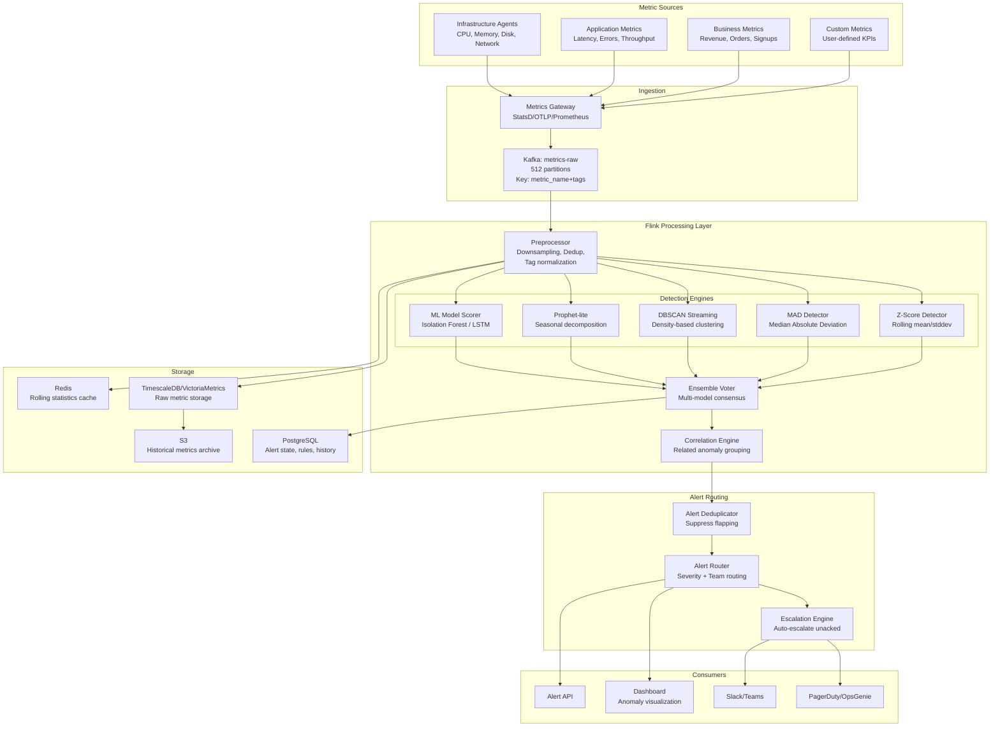

# Real-Time Anomaly Detection Pipeline

## Problem Statement

Modern observability platforms like DataDog, AWS CloudWatch, and New Relic ingest millions of metrics per second from infrastructure, applications, and business KPIs. Detecting anomalies in real-time is critical for:

- **Infrastructure failures**: CPU spikes, memory leaks, disk saturation
- **Application issues**: Latency increases, error rate spikes, throughput drops
- **Business anomalies**: Revenue drops, conversion rate changes, traffic shifts
- **Security threats**: Unusual access patterns, data exfiltration, DDoS

Requirements at scale:
- **1M+ unique metric time series** monitored simultaneously
- **Processing latency <10 seconds** from metric emission to alert
- **Adaptive thresholds** that learn from seasonality (daily/weekly patterns)
- **Low false-positive rate** (<1%) to prevent alert fatigue
- **Multi-signal correlation** to reduce noise and identify root cause

## Architecture Diagram



## Detection Algorithms

### 1. Z-Score (Statistical Distance)

```java
/**
 * Rolling Z-Score detector with exponential weighted moving average.
 * Adapts to gradual drift while detecting sudden spikes.
 */
public class ZScoreDetector extends KeyedProcessFunction<String, MetricPoint, AnomalySignal> {
    
    private ValueState<RollingStats> statsState;
    private static final double Z_THRESHOLD = 3.5;  // 99.98% confidence
    private static final double EWMA_ALPHA = 0.01;  // Slow adaptation
    
    @Override
    public void processElement(MetricPoint point, Context ctx, Collector<AnomalySignal> out) {
        RollingStats stats = statsState.value();
        if (stats == null) {
            stats = new RollingStats();
        }
        
        double value = point.getValue();
        
        // Need minimum samples before detecting
        if (stats.count < 100) {
            stats.update(value);
            statsState.update(stats);
            return;
        }
        
        // Calculate Z-score
        double zScore = (value - stats.ewmaMean) / Math.max(stats.ewmaStddev, 1e-10);
        
        if (Math.abs(zScore) > Z_THRESHOLD) {
            AnomalySignal signal = AnomalySignal.builder()
                .metricName(point.getMetricName())
                .tags(point.getTags())
                .timestamp(point.getTimestamp())
                .value(value)
                .expectedValue(stats.ewmaMean)
                .zScore(zScore)
                .severity(calculateSeverity(zScore))
                .detector("z_score")
                .confidence(1.0 - normalCDF(-Math.abs(zScore)))
                .build();
            out.collect(signal);
        }
        
        // Update rolling statistics (EWMA)
        stats.update(value);
        statsState.update(stats);
    }
    
    static class RollingStats {
        long count = 0;
        double ewmaMean = 0;
        double ewmaVariance = 0;
        double ewmaStddev = 0;
        
        void update(double value) {
            count++;
            if (count == 1) {
                ewmaMean = value;
                ewmaVariance = 0;
            } else {
                double diff = value - ewmaMean;
                ewmaMean += EWMA_ALPHA * diff;
                ewmaVariance = (1 - EWMA_ALPHA) * (ewmaVariance + EWMA_ALPHA * diff * diff);
                ewmaStddev = Math.sqrt(ewmaVariance);
            }
        }
    }
    
    private Severity calculateSeverity(double zScore) {
        double abs = Math.abs(zScore);
        if (abs > 6.0) return Severity.CRITICAL;
        if (abs > 5.0) return Severity.HIGH;
        if (abs > 4.0) return Severity.MEDIUM;
        return Severity.LOW;
    }
}
```

### 2. Streaming DBSCAN (Density-Based)

```java
/**
 * Streaming DBSCAN variant for detecting anomalies in multi-dimensional metric space.
 * Uses micro-clustering approach for online processing.
 * 
 * Detects: anomalies that are normal individually but abnormal in combination
 * Example: CPU at 70% is normal, Memory at 80% is normal, 
 *          but BOTH at those levels simultaneously is anomalous.
 */
public class StreamingDBSCAN extends KeyedProcessFunction<String, MetricVector, AnomalySignal> {
    
    private ListState<MicroCluster> clusterState;
    private static final double EPSILON = 2.0;  // Neighborhood radius
    private static final int MIN_POINTS = 5;     // Minimum cluster density
    private static final int MAX_CLUSTERS = 100; // Memory bound
    private static final Duration DECAY_WINDOW = Duration.ofHours(1);
    
    @Override
    public void processElement(MetricVector vector, Context ctx, Collector<AnomalySignal> out) {
        List<MicroCluster> clusters = Lists.newArrayList(clusterState.get());
        
        // Find nearest cluster
        MicroCluster nearest = findNearest(clusters, vector);
        double distance = nearest != null ? nearest.distanceTo(vector) : Double.MAX_VALUE;
        
        if (distance <= EPSILON) {
            // Point belongs to existing cluster - normal
            nearest.absorb(vector);
        } else {
            // Point doesn't fit any cluster - potential anomaly
            // Check if it could form a new cluster with recent outliers
            List<MetricVector> recentOutliers = getRecentOutliers(ctx);
            int neighborCount = countNeighbors(recentOutliers, vector, EPSILON);
            
            if (neighborCount >= MIN_POINTS) {
                // Enough nearby outliers to form new cluster - regime change, not anomaly
                MicroCluster newCluster = MicroCluster.create(vector, recentOutliers);
                clusters.add(newCluster);
            } else {
                // True anomaly - isolated point in metric space
                out.collect(AnomalySignal.builder()
                    .metricName(vector.getPrimaryMetric())
                    .timestamp(vector.getTimestamp())
                    .detector("dbscan")
                    .confidence(1.0 - (double) neighborCount / MIN_POINTS)
                    .dimensions(vector.getDimensions())
                    .nearestClusterDistance(distance)
                    .build());
            }
        }
        
        // Decay old clusters (time-weighted)
        clusters = decayClusters(clusters, ctx.timestamp());
        
        // Prune if too many clusters
        if (clusters.size() > MAX_CLUSTERS) {
            clusters = mergeSimilarClusters(clusters);
        }
        
        clusterState.update(clusters);
    }
}
```

### 3. Adaptive Thresholds with Seasonality

```python
class SeasonalAdaptiveDetector:
    """
    Decomposes metric into trend + seasonal + residual components.
    Detects anomalies in the residual after removing expected patterns.
    
    Handles:
    - Daily patterns (traffic peak at 2pm, low at 3am)
    - Weekly patterns (Monday spike, weekend drop)
    - Holiday effects
    - Gradual growth trends
    """
    
    def __init__(self, metric_id: str):
        self.metric_id = metric_id
        # Store seasonal baselines: hour_of_week -> (mean, std)
        # 168 buckets (7 days × 24 hours)
        self.seasonal_baseline = np.zeros((168, 2))  
        self.trend = 0.0
        self.learning_rate = 0.001
        self.min_samples_per_bucket = 4  # 4 weeks of data
        self.samples_per_bucket = np.zeros(168)
    
    def detect(self, timestamp: float, value: float) -> Optional[AnomalySignal]:
        bucket = self._get_seasonal_bucket(timestamp)
        
        if self.samples_per_bucket[bucket] < self.min_samples_per_bucket:
            # Still learning - only update, don't detect
            self._update_baseline(bucket, value)
            return None
        
        # Remove seasonal component
        seasonal_expected = self.seasonal_baseline[bucket, 0]
        residual = value - seasonal_expected - self.trend
        seasonal_std = max(self.seasonal_baseline[bucket, 1], 1e-6)
        
        # Z-score on residual
        z_residual = residual / seasonal_std
        
        # Dynamic threshold: tighter during stable periods, looser during transitions
        threshold = self._dynamic_threshold(bucket)
        
        # Update baseline (always learn)
        self._update_baseline(bucket, value)
        
        if abs(z_residual) > threshold:
            return AnomalySignal(
                metric_id=self.metric_id,
                timestamp=timestamp,
                value=value,
                expected=seasonal_expected + self.trend,
                z_score=z_residual,
                detector="seasonal_adaptive",
                context={
                    'hour_of_week': bucket,
                    'seasonal_component': seasonal_expected,
                    'trend_component': self.trend,
                    'residual': residual,
                }
            )
        return None
    
    def _dynamic_threshold(self, bucket: int) -> float:
        """Looser threshold during high-variance periods."""
        cv = self.seasonal_baseline[bucket, 1] / max(abs(self.seasonal_baseline[bucket, 0]), 1)
        if cv > 0.3:  # High coefficient of variation
            return 4.0  # Looser threshold
        return 3.0  # Standard threshold
    
    def _get_seasonal_bucket(self, timestamp: float) -> int:
        dt = datetime.fromtimestamp(timestamp)
        return dt.weekday() * 24 + dt.hour
```

## Ensemble Voting

```java
/**
 * Combines signals from multiple detectors using weighted voting.
 * Reduces false positives by requiring consensus.
 */
public class EnsembleVoter extends KeyedProcessFunction<String, AnomalySignal, AnomalyAlert> {
    
    // Buffer signals within a time window for same metric
    private MapState<String, List<AnomalySignal>> signalBuffer;
    private static final Duration VOTING_WINDOW = Duration.ofSeconds(30);
    
    // Detector weights (based on historical precision)
    private static final Map<String, Double> DETECTOR_WEIGHTS = Map.of(
        "z_score", 0.25,
        "mad", 0.20,
        "dbscan", 0.20,
        "seasonal_adaptive", 0.25,
        "isolation_forest", 0.10
    );
    
    private static final double CONSENSUS_THRESHOLD = 0.5;  // Weighted majority
    
    @Override
    public void processElement(AnomalySignal signal, Context ctx, Collector<AnomalyAlert> out) {
        String key = signal.getMetricName() + "|" + signal.getTagsHash();
        
        List<AnomalySignal> signals = signalBuffer.get(key);
        if (signals == null) {
            signals = new ArrayList<>();
            // Set timer for voting window
            ctx.timerService().registerProcessingTimeTimer(
                ctx.timerService().currentProcessingTime() + VOTING_WINDOW.toMillis());
        }
        signals.add(signal);
        signalBuffer.put(key, signals);
    }
    
    @Override
    public void onTimer(long timestamp, OnTimerContext ctx, Collector<AnomalyAlert> out) {
        // Voting window closed - evaluate consensus
        for (Map.Entry<String, List<AnomalySignal>> entry : signalBuffer.entries()) {
            List<AnomalySignal> signals = entry.getValue();
            
            double weightedVote = signals.stream()
                .mapToDouble(s -> DETECTOR_WEIGHTS.getOrDefault(s.getDetector(), 0.1) 
                    * s.getConfidence())
                .sum();
            
            if (weightedVote >= CONSENSUS_THRESHOLD) {
                // Consensus reached - emit alert
                AnomalyAlert alert = buildAlert(signals, weightedVote);
                out.collect(alert);
            }
        }
        signalBuffer.clear();
    }
}
```

## Alert Routing and Deduplication

### Flapping Suppression

```java
public class FlappingSuppressor extends KeyedProcessFunction<String, AnomalyAlert, AnomalyAlert> {
    
    private ValueState<AlertState> alertState;
    
    // Suppress alerts that fire and resolve more than 3 times in 10 minutes
    private static final int FLAP_THRESHOLD = 3;
    private static final Duration FLAP_WINDOW = Duration.ofMinutes(10);
    // Once suppressed, require stable anomaly for 5 minutes before re-alerting
    private static final Duration STABILITY_REQUIREMENT = Duration.ofMinutes(5);
    
    @Override
    public void processElement(AnomalyAlert alert, Context ctx, Collector<AnomalyAlert> out) {
        AlertState state = alertState.value();
        if (state == null) state = new AlertState();
        
        state.transitionCount++;
        state.lastTransitionTime = ctx.timestamp();
        
        // Check for flapping
        long windowStart = ctx.timestamp() - FLAP_WINDOW.toMillis();
        if (state.transitionCount > FLAP_THRESHOLD && 
            state.firstTransitionTime > windowStart) {
            // Flapping detected - suppress
            state.suppressed = true;
            state.suppressedUntil = ctx.timestamp() + STABILITY_REQUIREMENT.toMillis();
            alertState.update(state);
            
            // Emit suppression notice (once)
            if (state.transitionCount == FLAP_THRESHOLD + 1) {
                out.collect(alert.withStatus("SUPPRESSED_FLAPPING"));
            }
            return;
        }
        
        if (state.suppressed && ctx.timestamp() < state.suppressedUntil) {
            return;  // Still in suppression window
        }
        
        // Not flapping - emit alert
        state.suppressed = false;
        alertState.update(state);
        out.collect(alert);
    }
}
```

## Scaling Strategies

### Metric Cardinality Management

```
Challenge: 1M unique time series × 1 point/10s = 100K metrics/sec steady state
Burst: Deploy/scale events can 10x cardinality temporarily

Strategy:
1. Pre-aggregate at source (StatsD flush interval = 10s)
2. Partition by metric_name hash (distribute load)
3. Rate limit per metric (max 1 point/sec per series)
4. Cardinality explosion detection (new tag values > threshold)
5. Downsampling cascade: 10s -> 1m -> 5m -> 1h -> 1d
```

### Processing Topology

```yaml
flink_cluster:
  job_manager:
    memory: 4GB
    ha: zookeeper
    
  task_managers: 64
  slots_per_tm: 4
  total_parallelism: 256
  
  operator_parallelism:
    source: 64          # Match Kafka partitions
    preprocessor: 128   # CPU-intensive normalization
    z_score: 256        # One slot per metric group
    dbscan: 64          # Memory-intensive clustering
    seasonal: 128       # Medium state
    ensemble_voter: 64  # Light aggregation
    alert_router: 32    # Low volume output
    
  resources:
    preprocessor:
      cpu: 2.0
      memory: 4GB
    z_score:
      cpu: 1.0
      memory: 2GB
      managed_memory: 1GB  # RocksDB state
    dbscan:
      cpu: 2.0
      memory: 8GB
      managed_memory: 4GB
```

## Failure Handling

### Detector Degradation

| Failure | Detection | Fallback | Alert Impact |
|---------|-----------|----------|--------------|
| Z-score state corruption | Checksum validation | Reset to learning mode (100 samples) | 5 min detection gap |
| DBSCAN OOM | Cluster count explosion | Force merge clusters, increase epsilon | Reduced sensitivity |
| Seasonal model stale | Prediction error > 3σ | Fall back to simple Z-score | Higher false positives |
| ML model timeout | Inference latency > 100ms | Skip ML detector, use others | Slightly less accuracy |
| Kafka consumer lag > 30s | Lag metric alert | Scale up consumers | Delayed detection |
| Redis cache miss | Cache hit rate drops | Recompute stats from raw stream | Higher latency |

### Alert Reliability

```yaml
alert_delivery:
  # At-least-once delivery guarantee
  kafka_sink:
    acks: all
    retries: 3
    enable.idempotence: true
  
  # Alert state persistence
  alert_store:
    type: postgresql
    connection_pool: 20
    write_timeout: 5s
    retry_on_conflict: true
  
  # Multi-channel delivery
  channels:
    - type: pagerduty
      timeout: 10s
      retry: 3
      circuit_breaker: 5_failures_in_1min
    - type: slack
      timeout: 5s
      retry: 2
      fallback: email
    - type: webhook
      timeout: 15s
      retry: 5
      exponential_backoff: true
```

## Cost Optimization

### Tiered Detection

```
Tier 1 - All metrics (simple, cheap):
  - Z-score only
  - Cost: $0.000001/metric point
  - Coverage: catches 70% of anomalies
  
Tier 2 - Important metrics (multi-model):
  - Z-score + Seasonal + MAD
  - Cost: $0.000005/metric point
  - Coverage: catches 90% of anomalies
  
Tier 3 - Critical metrics (full ensemble):
  - All detectors including ML
  - Cost: $0.00002/metric point  
  - Coverage: catches 99% of anomalies

At 1M metrics:
  - 900K Tier 1: $78/month
  - 90K Tier 2: $39/month
  - 10K Tier 3: $17/month
  Total detection: ~$134/month
```

### Infrastructure Costs

```
Kafka (512 partitions): $18,000/month
Flink (64 TMs, m5.2xl): $28,000/month
TimescaleDB (metrics store): $15,000/month
Redis (stats cache): $5,000/month
PostgreSQL (alert state): $2,000/month
Alert delivery (PD/Slack): $3,000/month

Total: ~$71,000/month for 1M metric series
Cost per metric series: $0.071/month
```

## Real-World Companies

| Company | Scale | Approach |
|---------|-------|----------|
| DataDog | Trillions of data points/day | Custom anomaly detection engine |
| AWS CloudWatch | Billions of metrics | Statistical + ML models |
| New Relic | 1B+ metrics/min | Applied Intelligence (AI/ML) |
| Grafana/Mimir | Open-source | Prometheus-compatible alerting |
| PagerDuty | Alert aggregation | Event Intelligence correlation |
| Anodot | Business metrics | Autonomous analytics |
| Monte Carlo | Data observability | ML-based drift detection |

## Key Design Decisions

1. **Ensemble over single model**: No single detector works for all metric types
2. **EWMA over simple rolling average**: Adapts to trends without large window state
3. **30-second voting window**: Balance between latency and consensus quality
4. **Seasonal buckets at hourly granularity**: Fine enough for most patterns, coarse enough to learn quickly
5. **Flapping suppression before routing**: Prevent alert fatigue at the source
6. **Tiered detection**: Don't waste compute on unimportant metrics
7. **Z-score threshold 3.5**: Slightly above textbook 3.0 to reduce false positives in practice
8. **State TTL on detector state**: Prevent unbounded memory from dead metric series
