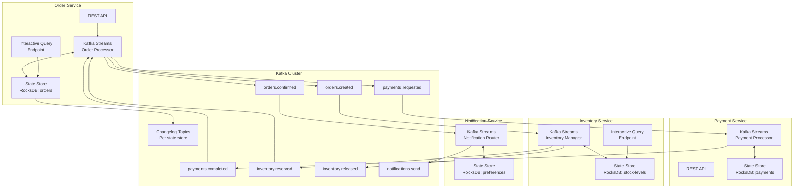
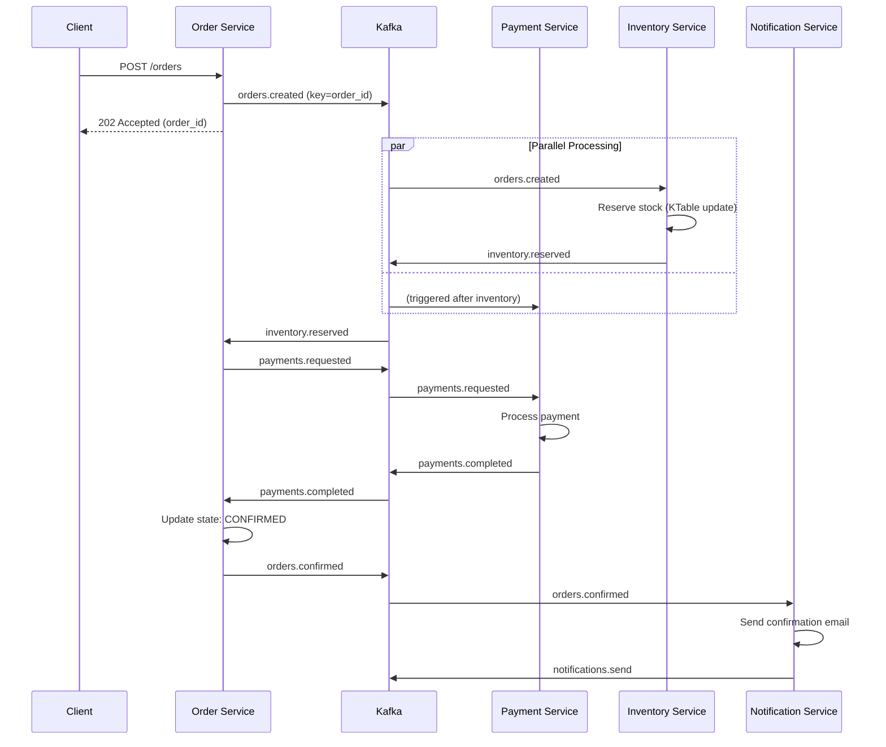
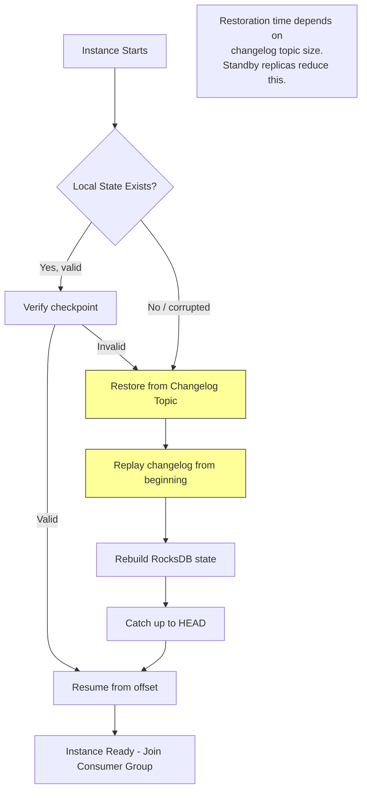

# Event-Driven Microservices with Kafka Streams

## Problem Statement

Large-scale platforms like Wix (700+ microservices) and Zalando (400+ services) face fundamental challenges with synchronous inter-service communication:

- **Cascading failures**: One service down takes the entire call chain
- **Tight coupling**: Services must know about each other's APIs
- **Temporal coupling**: Both services must be available simultaneously
- **Data consistency**: Distributed transactions across services are fragile
- **Scale mismatch**: Producer at 100K msg/s, consumer only handles 10K msg/s

Kafka Streams provides an embedded stream processing library that enables:
- **Event-driven communication** with guaranteed delivery
- **Local state stores** (KTables) eliminating external database calls
- **Exactly-once processing** within the Kafka ecosystem
- **Interactive queries** for serving state directly from microservices
- **No external cluster** required (unlike Flink/Spark)

Scale: 500+ microservices, 2000+ Kafka topics, 10M events/sec aggregate throughput.

## Architecture Diagram



## Event-Driven Order Saga



## Kafka Streams Topology

### Order Service Topology

```java
public class OrderServiceTopology {

    public Topology buildTopology() {
        StreamsBuilder builder = new StreamsBuilder();

        // Input streams
        KStream<String, OrderCreatedEvent> orderCreated = builder.stream(
            "orders.created", Consumed.with(Serdes.String(), orderCreatedSerde));

        KStream<String, InventoryReservedEvent> inventoryReserved = builder.stream(
            "inventory.reserved", Consumed.with(Serdes.String(), inventoryReservedSerde));

        KStream<String, PaymentCompletedEvent> paymentCompleted = builder.stream(
            "payments.completed", Consumed.with(Serdes.String(), paymentCompletedSerde));

        // State store for order saga state
        StoreBuilder<KeyValueStore<String, OrderSagaState>> sagaStore =
            Stores.keyValueStoreBuilder(
                Stores.persistentKeyValueStore("order-saga-store"),
                Serdes.String(),
                orderSagaStateSerde
            ).withCachingEnabled()
             .withLoggingEnabled(Map.of(
                 "retention.ms", "604800000",  // 7 days changelog retention
                 "cleanup.policy", "compact"
             ));
        builder.addStateStore(sagaStore);

        // Process order creation - initialize saga
        orderCreated
            .transformValues(() -> new OrderSagaInitializer(), "order-saga-store")
            .to("payments.requested");

        // Process inventory reservation
        inventoryReserved
            .transformValues(() -> new InventoryReservationHandler(), "order-saga-store")
            .filter((key, value) -> value != null)
            .to("payments.requested");

        // Process payment completion - finalize order
        paymentCompleted
            .transformValues(() -> new PaymentCompletionHandler(), "order-saga-store")
            .filter((key, value) -> value.getStatus() == OrderStatus.CONFIRMED)
            .to("orders.confirmed");

        return builder.build();
    }
}

public class OrderSagaInitializer implements ValueTransformerWithKey<String, OrderCreatedEvent, OrderSagaState> {

    private KeyValueStore<String, OrderSagaState> store;

    @Override
    public void init(ProcessorContext context) {
        this.store = context.getStateStore("order-saga-store");
    }

    @Override
    public OrderSagaState transform(String orderId, OrderCreatedEvent event) {
        OrderSagaState saga = OrderSagaState.builder()
            .orderId(orderId)
            .userId(event.getUserId())
            .items(event.getItems())
            .totalAmount(event.getTotalAmount())
            .status(OrderStatus.PENDING_INVENTORY)
            .createdAt(Instant.now())
            .build();

        store.put(orderId, saga);
        return saga;
    }
}
```

### KTable for Local State

```java
/**
 * Inventory service uses a KTable to maintain real-time stock levels.
 * No external database needed - RocksDB state store serves reads directly.
 */
public class InventoryServiceTopology {

    public Topology buildTopology() {
        StreamsBuilder builder = new StreamsBuilder();

        // KTable of current stock levels (compacted topic)
        KTable<String, StockLevel> stockLevels = builder.table(
            "inventory.stock-levels",
            Consumed.with(Serdes.String(), stockLevelSerde),
            Materialized.<String, StockLevel, KeyValueStore<Bytes, byte[]>>as("stock-levels-store")
                .withKeySerde(Serdes.String())
                .withValueSerde(stockLevelSerde)
                .withCachingEnabled()
                .withRetention(Duration.ofDays(365))
        );

        // Process reservation requests
        KStream<String, OrderCreatedEvent> orders = builder.stream("orders.created");

        orders.join(stockLevels,
            (order, stock) -> processReservation(order, stock),
            Joined.with(Serdes.String(), orderSerde, stockLevelSerde)
        )
        .split()
        .branch((key, result) -> result.isSuccess(),
            Branched.withConsumer(s -> s.to("inventory.reserved")))
        .branch((key, result) -> !result.isSuccess(),
            Branched.withConsumer(s -> s.to("inventory.reservation-failed")));

        return builder.build();
    }

    private ReservationResult processReservation(OrderCreatedEvent order, StockLevel stock) {
        int totalRequired = order.getItems().stream()
            .mapToInt(Item::getQuantity).sum();

        if (stock.getAvailable() >= totalRequired) {
            return ReservationResult.success(order.getOrderId(),
                stock.getAvailable() - totalRequired);
        }
        return ReservationResult.failure(order.getOrderId(),
            "Insufficient stock: need " + totalRequired + ", have " + stock.getAvailable());
    }
}
```

## Interactive Queries

```java
/**
 * Serve state store data via REST API without external database.
 * Kafka Streams provides RPC layer for cross-instance queries.
 */
@RestController
public class InventoryQueryController {

    private final KafkaStreams streams;
    private final HostInfo thisHost;

    @GetMapping("/inventory/{productId}")
    public ResponseEntity<StockLevel> getStockLevel(@PathVariable String productId) {
        // Find which instance owns this key's partition
        StreamsMetadata metadata = streams.queryMetadataForKey(
            "stock-levels-store", productId, Serdes.String().serializer());

        if (metadata.equals(StreamsMetadata.NOT_AVAILABLE)) {
            return ResponseEntity.status(503).build();
        }

        if (metadata.hostInfo().equals(thisHost)) {
            // Local query - fast path
            ReadOnlyKeyValueStore<String, StockLevel> store =
                streams.store(StoreQueryParameters.fromNameAndType(
                    "stock-levels-store", QueryableStoreTypes.keyValueStore()));
            StockLevel level = store.get(productId);
            return level != null ? ResponseEntity.ok(level) : ResponseEntity.notFound().build();
        } else {
            // Remote query - forward to owning instance
            String url = String.format("http://%s:%d/inventory/%s",
                metadata.hostInfo().host(), metadata.hostInfo().port(), productId);
            return restTemplate.getForEntity(url, StockLevel.class);
        }
    }

    @GetMapping("/inventory/range")
    public List<StockLevel> getStockRange(
            @RequestParam String from, @RequestParam String to) {
        // Range scan across local state store
        ReadOnlyKeyValueStore<String, StockLevel> store =
            streams.store(StoreQueryParameters.fromNameAndType(
                "stock-levels-store", QueryableStoreTypes.keyValueStore()));

        List<StockLevel> results = new ArrayList<>();
        try (KeyValueIterator<String, StockLevel> iter = store.range(from, to)) {
            while (iter.hasNext()) {
                results.add(iter.next().value);
            }
        }
        return results;
    }
}
```

## Exactly-Once Processing

### Configuration

```java
Properties props = new Properties();
props.put(StreamsConfig.PROCESSING_GUARANTEE_CONFIG, StreamsConfig.EXACTLY_ONCE_V2);
props.put(StreamsConfig.COMMIT_INTERVAL_MS_CONFIG, 100);  // Flush every 100ms
props.put(StreamsConfig.producerPrefix(ProducerConfig.ACKS_CONFIG), "all");
props.put(StreamsConfig.producerPrefix(ProducerConfig.ENABLE_IDEMPOTENCE_CONFIG), true);
props.put(StreamsConfig.producerPrefix(ProducerConfig.MAX_IN_FLIGHT_REQUESTS_PER_CONNECTION), 5);

// Transaction timeout must be less than Kafka's transaction.max.timeout.ms
props.put(StreamsConfig.producerPrefix(ProducerConfig.TRANSACTION_TIMEOUT_CONFIG), 60000);
```

### How EOS Works in Kafka Streams

```
1. Read from input topic (consumer offsets tracked)
2. Process record, update state store
3. Write to output topic + commit consumer offset + flush state changelog
   ALL IN ONE ATOMIC TRANSACTION

If crash between steps:
- Transaction uncommitted -> rolled back on recovery
- State restored from changelog (last committed)
- Consumer resumes from last committed offset
- No duplicates, no data loss
```

## State Store Restoration



### Standby Replicas

```java
// Configure standby replicas to reduce restoration time
props.put(StreamsConfig.NUM_STANDBY_REPLICAS_CONFIG, 1);

// With standby replicas:
// - Each partition's state is replicated to 1 additional instance
// - On failure, standby is already warm -> near-instant failover
// - Trade-off: 2x state storage, 2x changelog consumption
// - Critical for services with large state (>10GB)
```

## Rebalancing Optimization

### Problem: Stop-the-World Rebalances

```
Default behavior when instance joins/leaves:
1. ALL partitions revoked from ALL instances
2. Partitions reassigned
3. ALL state stores restored
4. Processing resumes

Impact: Full processing pause for seconds to minutes
```

### Solutions

```java
// 1. Sticky assignment (reduce unnecessary partition movement)
props.put(StreamsConfig.PARTITION_ASSIGNMENT_STRATEGY_CONFIG,
    StickyTaskAssignor.class.getName());

// 2. Incremental cooperative rebalancing (Kafka 2.4+)
props.put(StreamsConfig.UPGRADE_FROM_CONFIG, "2.4");
// Only revokes partitions that need to move, others keep processing

// 3. Static group membership (eliminate rebalance on restart)
props.put(StreamsConfig.consumerPrefix(ConsumerConfig.GROUP_INSTANCE_ID_CONFIG),
    "order-service-" + hostname);
props.put(StreamsConfig.consumerPrefix(ConsumerConfig.SESSION_TIMEOUT_MS_CONFIG), 300000);
// Instance can restart within 5 min without triggering rebalance

// 4. Rack-aware assignment (minimize cross-AZ traffic)
props.put(StreamsConfig.RACK_AWARE_ASSIGNMENT_TAGS_CONFIG, "az");
props.put(StreamsConfig.CLIENT_TAG_PREFIX + "az", availabilityZone);
```

## Topology Optimization

### Sub-Topology Splitting

```java
/**
 * Split topology into independent sub-topologies for better parallelism.
 * Each sub-topology can scale independently.
 */

// BAD: Single monolithic topology
// All operators share same thread pool and scaling factor
StreamsBuilder builder = new StreamsBuilder();
builder.stream("orders").to("processed-orders");
builder.stream("payments").to("processed-payments");
// Both tied to same num.stream.threads

// GOOD: Named topologies (Kafka Streams 2.8+)
// Each topology has independent scaling
TopologyBuilder topologyBuilder = new TopologyBuilder();

// Topology 1: Order processing
NamedTopology orderTopology = topologyBuilder.newNamedTopology("orders");
orderTopology.stream("orders.created").transform(...).to("orders.confirmed");

// Topology 2: Payment processing  
NamedTopology paymentTopology = topologyBuilder.newNamedTopology("payments");
paymentTopology.stream("payments.requested").transform(...).to("payments.completed");

KafkaStreams streams = new KafkaStreams(topologyBuilder.build(), config);
```

### Performance Tuning

```properties
# Threading
num.stream.threads=4  # Per instance, matches CPU cores

# Caching (reduces writes to state store and changelog)
statestore.cache.max.bytes=52428800  # 50MB cache per store
cache.max.bytes.buffering=10485760    # 10MB total

# Commit interval (trade latency vs throughput)
commit.interval.ms=100  # 100ms for low latency
# commit.interval.ms=30000  # 30s for high throughput batch

# Internal topic configs
replication.factor=3
topic.min.insync.replicas=2

# Producer batching
producer.linger.ms=5
producer.batch.size=65536
producer.compression.type=zstd
```

## Scaling Strategies

### Scaling Rules

```yaml
# Kubernetes HPA for Kafka Streams services
apiVersion: autoscaling/v2
kind: HorizontalPodAutoscaler
metadata:
  name: order-service-hpa
spec:
  scaleTargetRef:
    apiVersion: apps/v1
    kind: Deployment
    name: order-service
  minReplicas: 3
  maxReplicas: 16  # Max = number of input partitions
  metrics:
    - type: External
      external:
        metric:
          name: kafka_consumer_lag
          selector:
            matchLabels:
              consumer_group: order-service
        target:
          type: AverageValue
          averageValue: "1000"  # Scale up if lag > 1000 per pod
    - type: Resource
      resource:
        name: cpu
        target:
          type: Utilization
          averageUtilization: 70
```

### Capacity Planning

| Service | Instances | Partitions | State Size | Throughput |
|---------|-----------|-----------|------------|------------|
| Order Service | 8 | 32 | 5GB | 10K events/s |
| Payment Service | 4 | 16 | 2GB | 5K events/s |
| Inventory Service | 6 | 24 | 50GB | 8K events/s |
| Notification Service | 4 | 16 | 1GB | 15K events/s |
| Analytics Service | 16 | 64 | 200GB | 50K events/s |

## Failure Handling

### Saga Compensation (Rollback)

```java
public class SagaCompensationHandler 
    implements ValueTransformerWithKey<String, FailureEvent, CompensationCommand> {
    
    private KeyValueStore<String, OrderSagaState> sagaStore;
    
    @Override
    public CompensationCommand transform(String orderId, FailureEvent failure) {
        OrderSagaState saga = sagaStore.get(orderId);
        if (saga == null) return null;
        
        // Compensate based on how far the saga progressed
        switch (saga.getStatus()) {
            case PAYMENT_COMPLETED:
                // Refund payment, release inventory
                return CompensationCommand.builder()
                    .orderId(orderId)
                    .actions(List.of(
                        new RefundPayment(saga.getPaymentId(), saga.getTotalAmount()),
                        new ReleaseInventory(saga.getItems())
                    ))
                    .build();
                    
            case INVENTORY_RESERVED:
                // Just release inventory
                return CompensationCommand.builder()
                    .orderId(orderId)
                    .actions(List.of(new ReleaseInventory(saga.getItems())))
                    .build();
                    
            case PENDING_INVENTORY:
                // Nothing to compensate
                saga.setStatus(OrderStatus.CANCELLED);
                sagaStore.put(orderId, saga);
                return null;
                
            default:
                return null;
        }
    }
}
```

## Cost Optimization

```
Kafka Streams advantage: No separate processing cluster needed.
Services already run on Kubernetes - Streams is just a library.

Comparison for 500 microservices with event processing:

Option A: External Flink cluster
- Flink cluster: $30,000/month
- Additional Kafka topics for Flink I/O: $5,000/month
- Operational overhead: 2 FTEs
- Total: $35,000/month + personnel

Option B: Kafka Streams embedded
- Additional memory per service pod: +512MB × 500 = 250GB
- 250GB across 100 nodes = $8,000/month additional
- Changelog topic storage: $3,000/month
- No additional cluster to manage
- Total: $11,000/month

Savings: ~$24,000/month + reduced operational complexity
```

## Real-World Companies

| Company | Scale | Key Pattern |
|---------|-------|-------------|
| Wix | 700+ microservices | Event sourcing + KStreams |
| Zalando | 400+ services | Nakadi event bus + Streams |
| Line (messaging) | 200M+ users | Kafka Streams for message routing |
| The New York Times | Publishing pipeline | Content enrichment via KStreams |
| Trivago | Hotel search | Real-time price aggregation |
| Pinterest | Feed generation | Kafka Streams for ranking |
| Walmart | Inventory management | KTable for stock levels |

## Key Design Decisions

1. **Kafka Streams over Flink for microservices**: No external cluster, embedded in service
2. **KTable for reference data**: Eliminates database round-trips for lookups
3. **Interactive queries over REST**: Serve state directly without separate read DB
4. **Static group membership**: Prevent rebalance storms during rolling deployments
5. **Standby replicas = 1**: Fast failover for stateful services
6. **EOS v2**: Exactly-once without per-partition transactions (more efficient)
7. **Saga pattern over 2PC**: Eventual consistency preferred over distributed locks
8. **Changelog compaction**: Unbounded state retention without unbounded storage
