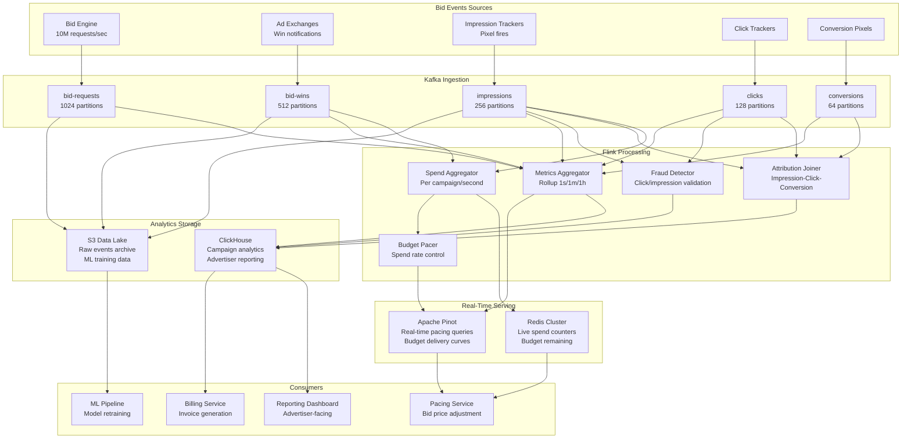

# Real-Time Ad Bidding Data Pipeline

## Problem Statement

Digital advertising platforms like Google Ads and Meta Ads process billions of bid requests per day in real-time auctions (RTB - Real-Time Bidding). The data pipeline behind these systems must:

- **Process 10M+ bid requests/second** globally across multiple ad exchanges
- **Track spend in real-time** to enforce advertiser budgets (cannot overspend)
- **Pace budget delivery** evenly throughout the day (avoid spending all budget in first hour)
- **Attribution tracking** linking impressions -> clicks -> conversions across devices
- **Sub-second reporting** for advertisers to see campaign performance live
- **Fraud detection** in real-time to avoid paying for invalid clicks

The pipeline sits between the bidding engine (which decides bid prices in <100ms) and the reporting/billing systems, processing the massive event stream into actionable analytics.

## Architecture Diagram



## Real-Time Spend Tracking

### The Budget Problem

```
Scenario: Campaign budget = $10,000/day
- 10M bid requests/sec globally
- Average win rate: 5% = 500K wins/sec
- Average CPM: $2.00 = $0.002 per impression
- Spend rate: 500K × $0.002 = $1,000/sec

If spend tracking is even 5 seconds behind:
- Potential overspend: $5,000 (50% of daily budget!)
- Must track to the CENT in real-time across all regions
```

### Spend Aggregation in Flink

```java
public class SpendAggregatorJob {

    public static void main(String[] args) throws Exception {
        StreamExecutionEnvironment env = StreamExecutionEnvironment.getExecutionEnvironment();
        env.enableCheckpointing(5000, CheckpointingMode.EXACTLY_ONCE);

        DataStream<WinEvent> wins = env.addSource(createWinSource())
            .assignTimestampsAndWatermarks(
                WatermarkStrategy.<WinEvent>forBoundedOutOfOrderness(Duration.ofSeconds(5))
                    .withTimestampAssigner((e, t) -> e.getTimestamp()));

        // Aggregate spend per campaign per second
        DataStream<CampaignSpend> spendPerSecond = wins
            .keyBy(WinEvent::getCampaignId)
            .window(TumblingEventTimeWindows.of(Time.seconds(1)))
            .aggregate(new SpendAggregateFunction());

        // Push to Redis for real-time budget checks
        spendPerSecond.addSink(new RedisBudgetSink());

        // Also push to Pinot for pacing analysis
        spendPerSecond.addSink(new PinotSink());

        env.execute("Real-Time Spend Aggregator");
    }
}

public class SpendAggregateFunction
    implements AggregateFunction<WinEvent, SpendAccumulator, CampaignSpend> {

    @Override
    public SpendAccumulator add(WinEvent event, SpendAccumulator acc) {
        acc.totalSpendMicros += event.getWinPriceMicros();  // Microdollars for precision
        acc.impressions++;
        acc.wins++;

        // Track by breakdown dimensions
        acc.spendByAdGroup.merge(event.getAdGroupId(), event.getWinPriceMicros(), Long::sum);
        acc.spendByGeo.merge(event.getGeoCode(), event.getWinPriceMicros(), Long::sum);
        acc.spendByDevice.merge(event.getDeviceType(), event.getWinPriceMicros(), Long::sum);

        return acc;
    }

    @Override
    public CampaignSpend getResult(SpendAccumulator acc) {
        return CampaignSpend.builder()
            .campaignId(acc.campaignId)
            .windowStart(acc.windowStart)
            .totalSpendMicros(acc.totalSpendMicros)
            .impressions(acc.impressions)
            .wins(acc.wins)
            .avgCpmMicros(acc.totalSpendMicros * 1000 / Math.max(acc.impressions, 1))
            .breakdowns(Map.of(
                "ad_group", acc.spendByAdGroup,
                "geo", acc.spendByGeo,
                "device", acc.spendByDevice
            ))
            .build();
    }
}
```

### Redis Budget Enforcement

```python
class RedisBudgetTracker:
    """
    Atomic budget tracking using Redis.
    Called by bidding engine BEFORE placing bid to check budget.
    """

    def __init__(self, redis_cluster):
        self.redis = redis_cluster
        # Lua script for atomic check-and-deduct
        self.deduct_script = self.redis.register_script("""
            local budget_key = KEYS[1]
            local spend_key = KEYS[2]
            local amount = tonumber(ARGV[1])

            local budget = tonumber(redis.call('GET', budget_key) or '0')
            local spent = tonumber(redis.call('GET', spend_key) or '0')
            local remaining = budget - spent

            if remaining >= amount then
                redis.call('INCRBY', spend_key, amount)
                return 1  -- OK to bid
            else
                return 0  -- Budget exhausted
            end
        """)

    def can_bid(self, campaign_id: str, bid_price_micros: int) -> bool:
        """Check if campaign has budget remaining. Called per bid request."""
        budget_key = f"budget:daily:{campaign_id}"
        spend_key = f"spend:daily:{campaign_id}:{today()}"
        return self.deduct_script(
            keys=[budget_key, spend_key],
            args=[bid_price_micros]
        ) == 1

    def record_spend(self, campaign_id: str, amount_micros: int):
        """Called by Flink spend aggregator to update actual spend."""
        spend_key = f"spend:daily:{campaign_id}:{today()}"
        self.redis.incrby(spend_key, amount_micros)
        # Also update hourly bucket for pacing
        hour_key = f"spend:hourly:{campaign_id}:{current_hour()}"
        self.redis.incrby(hour_key, amount_micros)
        self.redis.expire(hour_key, 86400)
```

## Budget Pacing Algorithm

```python
class BudgetPacer:
    """
    Controls bid price multiplier to pace budget delivery evenly.
    
    Problem: Without pacing, high-traffic morning hours exhaust budget.
    Solution: Adjust bid prices throughout the day based on delivery curve.
    """

    def calculate_pace_multiplier(self, campaign_id: str) -> float:
        budget = self.get_daily_budget(campaign_id)
        spent = self.get_current_spend(campaign_id)
        
        # How much of the day has elapsed
        hour = datetime.now().hour
        elapsed_fraction = hour / 24.0
        
        # How much of budget should be spent by now (target)
        # Use historical delivery curve, not linear
        target_fraction = self.get_delivery_curve(campaign_id, elapsed_fraction)
        target_spend = budget * target_fraction
        
        # Actual delivery ratio
        actual_fraction = spent / budget if budget > 0 else 0
        
        # PID controller for smooth adjustment
        error = target_fraction - actual_fraction
        
        # Proportional
        p = error * 2.0
        # Integral (accumulated error)
        self.integral_error[campaign_id] += error * 0.01
        i = self.integral_error[campaign_id]
        # Derivative (rate of change)
        d = (error - self.prev_error.get(campaign_id, 0)) * 0.5
        
        self.prev_error[campaign_id] = error
        
        # Multiplier: 1.0 = on pace, >1.0 = bid more aggressively, <1.0 = slow down
        multiplier = 1.0 + p + i + d
        
        # Clamp to reasonable range
        return max(0.1, min(3.0, multiplier))
    
    def get_delivery_curve(self, campaign_id: str, time_fraction: float) -> float:
        """
        Expected delivery curve based on traffic patterns.
        Not linear - more traffic during business hours.
        """
        # Example: S-curve based on historical traffic
        # Slow start (midnight-6am), ramp up (6am-9am), steady (9am-6pm), tail (6pm-midnight)
        curves = {
            'uniform': lambda t: t,
            'frontloaded': lambda t: min(1.0, t * 1.3),
            'traffic_weighted': lambda t: self._historical_curve(campaign_id, t),
        }
        strategy = self.get_pacing_strategy(campaign_id)
        return curves[strategy](time_fraction)
```

## Attribution Pipeline

```java
/**
 * Multi-touch attribution: Link impression -> click -> conversion.
 * Uses interval joins with different windows per event pair.
 * 
 * Attribution windows:
 * - View-through: Impression -> Conversion within 24 hours
 * - Click-through: Click -> Conversion within 30 days
 * - Last-click: Most recent click before conversion gets credit
 */
public class AttributionJoinJob {

    public static DataStream<AttributedConversion> buildPipeline(
            StreamExecutionEnvironment env) {

        DataStream<ImpressionEvent> impressions = createImpressionStream(env);
        DataStream<ClickEvent> clicks = createClickStream(env);
        DataStream<ConversionEvent> conversions = createConversionStream(env);

        // Step 1: Join clicks with conversions (click-through attribution)
        // Conversion must happen 0 to 30 days after click
        DataStream<ClickConversion> clickConversions = clicks
            .keyBy(ClickEvent::getUserId)
            .intervalJoin(conversions.keyBy(ConversionEvent::getUserId))
            .between(Time.seconds(0), Time.days(30))
            .process(new ClickConversionJoinFunction());

        // Step 2: Join impressions with conversions (view-through attribution)
        // For conversions NOT attributed to clicks
        DataStream<ViewConversion> viewConversions = impressions
            .keyBy(ImpressionEvent::getUserId)
            .intervalJoin(conversions.keyBy(ConversionEvent::getUserId))
            .between(Time.seconds(0), Time.hours(24))
            .process(new ViewConversionJoinFunction());

        // Step 3: Merge and deduplicate (click-through takes priority)
        return clickConversions.union(viewConversions)
            .keyBy(c -> c.getConversionId())
            .process(new AttributionDeduplicator());
    }
}

public class ClickConversionJoinFunction
    extends ProcessJoinFunction<ClickEvent, ConversionEvent, ClickConversion> {

    @Override
    public void processElement(ClickEvent click, ConversionEvent conversion,
                               Context ctx, Collector<ClickConversion> out) {
        // Only attribute if same campaign or advertiser
        if (click.getAdvertiserId().equals(conversion.getAdvertiserId())) {
            out.collect(ClickConversion.builder()
                .conversionId(conversion.getConversionId())
                .clickId(click.getClickId())
                .impressionId(click.getImpressionId())
                .campaignId(click.getCampaignId())
                .userId(click.getUserId())
                .conversionValue(conversion.getValue())
                .attributionType("CLICK_THROUGH")
                .clickToConversionMs(conversion.getTimestamp() - click.getTimestamp())
                .build());
        }
    }
}
```

## ClickHouse Schema for Reporting

```sql
-- Campaign performance table (real-time insertable)
CREATE TABLE campaign_metrics ON CLUSTER '{cluster}'
(
    campaign_id       UInt64,
    ad_group_id       UInt64,
    creative_id       UInt64,
    advertiser_id     UInt32,
    
    -- Time dimensions
    event_time        DateTime,
    event_date        Date MATERIALIZED toDate(event_time),
    event_hour        DateTime MATERIALIZED toStartOfHour(event_time),
    
    -- Geo dimensions
    country           LowCardinality(String),
    region            LowCardinality(String),
    city              LowCardinality(String),
    
    -- Device dimensions
    device_type       Enum8('desktop'=1, 'mobile'=2, 'tablet'=3),
    os                LowCardinality(String),
    browser           LowCardinality(String),
    
    -- Metrics
    impressions       UInt64,
    clicks            UInt64,
    conversions       UInt64,
    spend_micros      UInt64,
    revenue_micros    UInt64,
    
    -- Derived (populated by MV)
    ctr               Float32 MATERIALIZED clicks / greatest(impressions, 1),
    cpc_micros        Float32 MATERIALIZED spend_micros / greatest(clicks, 1),
    cpm_micros        Float32 MATERIALIZED spend_micros * 1000 / greatest(impressions, 1),
    roas              Float32 MATERIALIZED revenue_micros / greatest(spend_micros, 1)
)
ENGINE = ReplicatedSummingMergeTree('/clickhouse/tables/{shard}/campaign_metrics', '{replica}')
PARTITION BY toYYYYMM(event_date)
ORDER BY (advertiser_id, campaign_id, ad_group_id, event_hour, country, device_type)
TTL event_date + INTERVAL 90 DAY;

-- Real-time dashboard query (sub-second on billions of rows)
SELECT
    toStartOfHour(event_time) as hour,
    sum(impressions) as imps,
    sum(clicks) as clicks,
    sum(conversions) as convs,
    sum(spend_micros) / 1000000.0 as spend_usd,
    sum(revenue_micros) / 1000000.0 as revenue_usd,
    sum(clicks) / greatest(sum(impressions), 1) as ctr,
    sum(revenue_micros) / greatest(sum(spend_micros), 1) as roas
FROM campaign_metrics
WHERE advertiser_id = 12345
    AND campaign_id IN (100, 200, 300)
    AND event_date >= today() - 7
GROUP BY hour
ORDER BY hour;
```

## Scaling Strategies

### Kafka Partition Design

```yaml
topics:
  bid-requests:
    partitions: 1024        # 10M/sec ÷ ~10K/sec per partition
    replication: 3
    retention: 6h           # Short retention, high volume
    key: campaign_id        # Hot campaigns spread across partitions
    compression: lz4        # Fast compression for latency
    
  bid-wins:
    partitions: 512
    replication: 3
    retention: 48h
    key: campaign_id
    compression: zstd
    
  impressions:
    partitions: 256
    replication: 3
    retention: 7d           # Longer for attribution joins
    key: user_id            # Key by user for attribution join efficiency
    
  clicks:
    partitions: 128
    replication: 3
    retention: 30d          # 30-day attribution window
    key: user_id
    
  conversions:
    partitions: 64
    replication: 3
    retention: 30d
    key: user_id
```

### Multi-Region Deployment

```
US-East: Primary bidding + processing
  - 10M req/sec capacity
  - Full Flink pipeline
  
US-West: Secondary bidding
  - 5M req/sec capacity
  - Local spend tracking, synced to US-East

EU-West: GDPR-compliant processing
  - 3M req/sec capacity
  - EU user data stays in region
  - Aggregated metrics replicated to US-East

APAC: Regional bidding
  - 4M req/sec capacity
  - Local pacing, global budget sync every 1s
```

## Failure Handling

### Budget Safety on Failure

```python
class BudgetSafetyNet:
    """
    Prevents overspend during system failures.
    Multiple layers of protection.
    """
    
    def __init__(self):
        self.circuit_breaker = CircuitBreaker(
            failure_threshold=5,
            recovery_timeout=30
        )
    
    def should_bid(self, campaign_id: str, bid_price: int) -> bool:
        # Layer 1: Redis real-time check
        try:
            if not self.redis_budget_check(campaign_id, bid_price):
                return False
        except RedisError:
            # Layer 2: Local cache with conservative estimate
            if not self.local_cache_check(campaign_id, bid_price):
                return False
            # Layer 3: If Redis is down AND local cache is stale, stop bidding
            if self.cache_staleness(campaign_id) > timedelta(seconds=30):
                return False  # SAFE: stop bidding rather than overspend
        
        # Layer 4: Hard daily cap (never exceed regardless of tracking)
        if self.get_exchange_reported_spend(campaign_id) > self.hard_cap(campaign_id):
            return False
        
        return True
    
    def on_flink_pipeline_failure(self, campaign_ids: List[str]):
        """Emergency: Flink spend tracking is down."""
        for campaign_id in campaign_ids:
            # Reduce bid prices by 50% as safety margin
            self.set_safety_multiplier(campaign_id, 0.5)
            # Alert operations
            self.alert(f"Spend tracking offline for {campaign_id}, "
                      f"reducing bids by 50%")
```

## Cost Optimization

### Infrastructure Costs at 10M bid requests/sec

```
Kafka (1024 partitions, 48 brokers):
  - i3.4xlarge × 48 = $70,000/month
  - Storage: 200TB retained = included in instance storage

Flink (spend + attribution + fraud):
  - 128 TaskManagers, m5.4xlarge = $78,000/month
  - State storage (EBS): $10,000/month

ClickHouse (analytics, 32 shards):
  - r5.8xlarge × 64 = $118,000/month
  - Storage: 500TB = $40,000/month (gp3)

Redis (budget tracking):
  - r6g.4xlarge × 20 = $28,000/month

Pinot (pacing queries):
  - m5.4xlarge × 16 = $19,000/month

Total: ~$363,000/month

Revenue context: Platform processing $500M+/month in ad spend
Infrastructure cost: 0.07% of revenue processed
```

### Cost Reduction Strategies

1. **Sampling bid requests**: Store 10% sample for analytics, full stream for billing
2. **Tiered retention**: Raw events 7 days, aggregated 90 days, summary forever
3. **Reserved instances**: 3-year RI for predictable base load = 60% savings
4. **Spot for Flink workers**: Attribution jobs are replayable from Kafka
5. **ClickHouse compression**: zstd achieves 10:1 on ad event data

## Real-World Companies

| Company | Scale | Key Innovation |
|---------|-------|---------------|
| Google (DV360) | 100B+ bid evaluations/day | Custom infrastructure, Dremel |
| Meta (Ads) | 10M+ auctions/sec | Scuba for real-time analytics |
| The Trade Desk | 15M+ QPS | Custom bidding + ClickHouse |
| Criteo | 4B+ bids/day | Real-time ML + streaming |
| AppLovin | 50B+ ad requests/day | Custom pacing algorithms |
| Unity Ads | 30B+ events/day | Kafka + Flink + Druid |
| AdRoll | 2M+ bid requests/sec | Kafka Streams + Pinot |

## Key Design Decisions

1. **Microdollars for currency**: Avoid floating point; 1 USD = 1,000,000 micros
2. **Campaign ID as Kafka key**: Ensures all spend for a campaign goes to same partition
3. **1-second spend windows**: Budget decisions need per-second precision
4. **Redis for budget checks**: <1ms latency required in bid path
5. **Click-through over view-through priority**: Industry standard attribution preference
6. **PID controller for pacing**: Smooth adjustment vs. binary on/off
7. **SummingMergeTree in ClickHouse**: Perfect for pre-aggregated metric counters
8. **30-day attribution window**: Industry standard, impacts Kafka retention requirement
