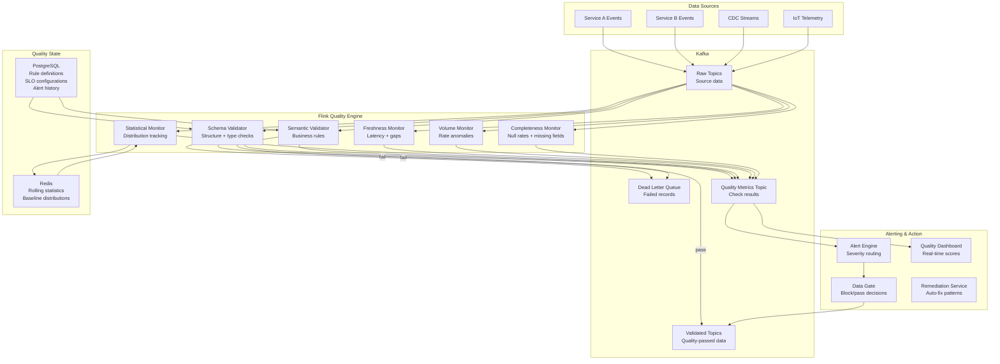
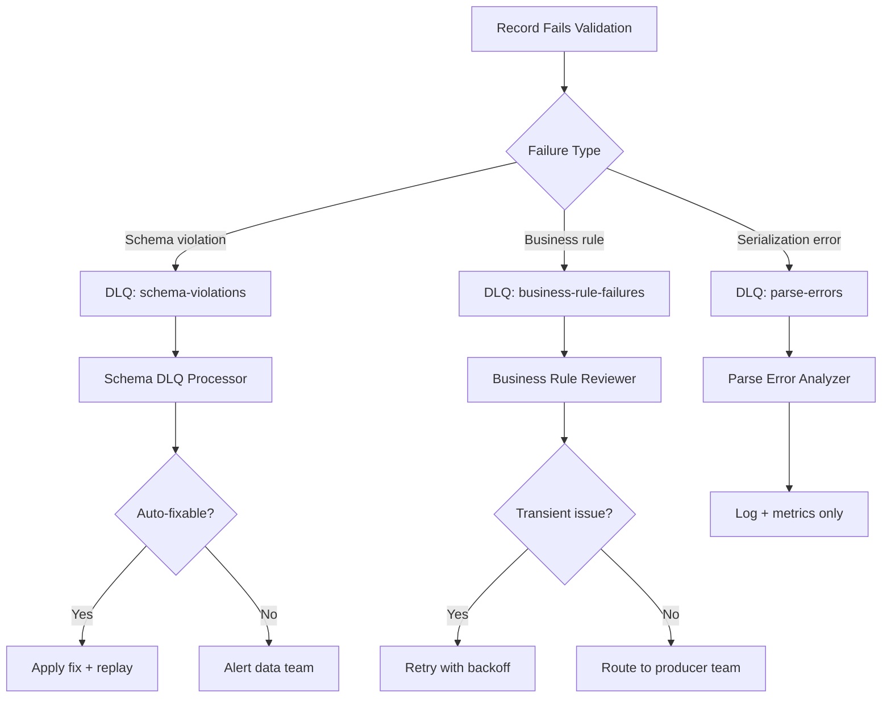

# Real-Time Data Quality Monitoring

## Problem Statement

As organizations build real-time data pipelines processing millions of events per second, data quality issues that previously took hours or days to discover in batch systems now compound in seconds. A single schema drift, null injection, or upstream bug can corrupt downstream ML models, dashboards, and business decisions within minutes.

Requirements for production data quality monitoring:

- **Inline validation**: Check every record in real-time (not sampling)
- **Statistical drift detection**: Identify distribution shifts as they happen
- **Schema validation**: Catch unexpected fields, types, and structures
- **Freshness SLOs**: Alert when data stops flowing or arrives late
- **Completeness checks**: Detect missing required fields and null rates
- **Volume anomalies**: Traffic spikes or drops indicating upstream issues
- **Zero pipeline impact**: Quality checks must not add latency to the data path
- **Scale**: 5M+ events/sec across 1000+ data streams

## Architecture Diagram



## Schema Validation

```java
/**
 * Real-time schema validation against Schema Registry.
 * Catches: unexpected fields, type changes, required field removal, enum violations.
 */
public class SchemaValidationFunction
    extends ProcessFunction<GenericRecord, ValidatedRecord> {

    private transient SchemaRegistryClient schemaRegistry;
    private transient Map<String, SchemaValidationRule> rules;

    private static final OutputTag<QualityViolation> VIOLATION_TAG =
        new OutputTag<>("violations"){};
    private static final OutputTag<GenericRecord> DLQ_TAG =
        new OutputTag<>("dlq"){};

    @Override
    public void processElement(GenericRecord record, Context ctx,
                               Collector<ValidatedRecord> out) {
        String topic = record.getMetadata().getTopic();
        Schema actualSchema = record.getSchema();

        List<SchemaViolation> violations = new ArrayList<>();

        // 1. Check against expected schema
        Schema expectedSchema = schemaRegistry.getLatestSchema(topic);
        violations.addAll(validateSchemaCompatibility(actualSchema, expectedSchema));

        // 2. Check field-level constraints
        SchemaValidationRule rule = rules.get(topic);
        if (rule != null) {
            violations.addAll(validateFieldConstraints(record, rule));
        }

        // 3. Check for undeclared fields (schema pollution)
        violations.addAll(detectUndeclaredFields(record, expectedSchema));

        if (violations.isEmpty()) {
            out.collect(new ValidatedRecord(record, QualityScore.PASS));
        } else if (hasBlockingViolation(violations)) {
            // Critical violation -> DLQ
            ctx.output(DLQ_TAG, record);
            ctx.output(VIOLATION_TAG, new QualityViolation(
                topic, violations, Severity.CRITICAL, record.getMetadata()));
        } else {
            // Warning-level -> pass with annotation
            out.collect(new ValidatedRecord(record, QualityScore.DEGRADED, violations));
            ctx.output(VIOLATION_TAG, new QualityViolation(
                topic, violations, Severity.WARNING, record.getMetadata()));
        }
    }

    private List<SchemaViolation> validateFieldConstraints(
            GenericRecord record, SchemaValidationRule rule) {
        List<SchemaViolation> violations = new ArrayList<>();

        for (FieldConstraint constraint : rule.getFieldConstraints()) {
            Object value = record.get(constraint.getFieldName());

            // Null check for required fields
            if (constraint.isRequired() && value == null) {
                violations.add(new SchemaViolation(
                    constraint.getFieldName(), "REQUIRED_NULL",
                    "Required field is null", Severity.CRITICAL));
                continue;
            }

            if (value == null) continue;

            // Range check for numeric fields
            if (constraint.hasRange()) {
                double numValue = ((Number) value).doubleValue();
                if (numValue < constraint.getMin() || numValue > constraint.getMax()) {
                    violations.add(new SchemaViolation(
                        constraint.getFieldName(), "OUT_OF_RANGE",
                        String.format("Value %f outside [%f, %f]",
                            numValue, constraint.getMin(), constraint.getMax()),
                        Severity.WARNING));
                }
            }

            // Pattern check for string fields
            if (constraint.hasPattern()) {
                if (!constraint.getPattern().matcher(value.toString()).matches()) {
                    violations.add(new SchemaViolation(
                        constraint.getFieldName(), "PATTERN_MISMATCH",
                        "Value doesn't match expected pattern", Severity.WARNING));
                }
            }

            // Enum check
            if (constraint.hasAllowedValues()) {
                if (!constraint.getAllowedValues().contains(value.toString())) {
                    violations.add(new SchemaViolation(
                        constraint.getFieldName(), "INVALID_ENUM",
                        "Value not in allowed set", Severity.WARNING));
                }
            }
        }
        return violations;
    }
}
```

## Statistical Drift Detection

```python
class StreamingDriftDetector:
    """
    Detects distribution shifts in streaming data using multiple methods:
    1. Population Stability Index (PSI)
    2. Kolmogorov-Smirnov test (streaming approximation)
    3. Wasserstein distance
    4. Chi-squared for categorical features
    """

    def __init__(self, field_name: str, field_type: str, baseline_window: int = 3600):
        self.field_name = field_name
        self.field_type = field_type
        self.baseline_window = baseline_window  # seconds

        # Baseline distribution (learned from first N hours)
        self.baseline_histogram = None
        self.baseline_stats = None

        # Current window distribution
        self.current_histogram = DDSketch(relative_accuracy=0.01)
        self.current_window_start = None
        self.comparison_window = 300  # 5-minute comparison windows

    def process(self, value: float, timestamp: int) -> Optional[DriftSignal]:
        # Update current distribution
        self.current_histogram.add(value)

        # Check if comparison window is complete
        if self._window_complete(timestamp):
            drift_score = self._calculate_drift()

            if drift_score > self.threshold:
                signal = DriftSignal(
                    field_name=self.field_name,
                    drift_score=drift_score,
                    drift_type=self._classify_drift(drift_score),
                    baseline_mean=self.baseline_stats.mean,
                    current_mean=self.current_histogram.get_mean(),
                    baseline_p50=self.baseline_stats.p50,
                    current_p50=self.current_histogram.get_quantile(0.5),
                    timestamp=timestamp,
                )
                self._rotate_window()
                return signal

            self._rotate_window()
        return None

    def _calculate_drift(self) -> float:
        """Calculate Population Stability Index (PSI)."""
        if self.baseline_histogram is None:
            return 0.0

        # Discretize into buckets for PSI calculation
        n_buckets = 20
        baseline_quantiles = [self.baseline_histogram.get_quantile(i/n_buckets)
                            for i in range(n_buckets + 1)]

        psi = 0.0
        for i in range(n_buckets):
            # Proportion in each bucket
            baseline_prop = 1.0 / n_buckets  # Uniform by construction
            current_prop = self._proportion_in_range(
                self.current_histogram,
                baseline_quantiles[i],
                baseline_quantiles[i + 1]
            )
            current_prop = max(current_prop, 0.0001)  # Avoid log(0)

            psi += (current_prop - baseline_prop) * math.log(current_prop / baseline_prop)

        return psi

    def _classify_drift(self, psi: float) -> str:
        if psi < 0.1:
            return "NO_DRIFT"
        elif psi < 0.2:
            return "MINOR_DRIFT"
        elif psi < 0.5:
            return "MODERATE_DRIFT"
        else:
            return "SEVERE_DRIFT"

    @property
    def threshold(self) -> float:
        """PSI threshold - 0.2 is industry standard for significant drift."""
        return 0.2
```

## Freshness SLO Monitoring

```java
/**
 * Monitors data freshness per topic/partition.
 * Detects: gaps in data flow, increasing latency, partition stalls.
 */
public class FreshnessMonitor extends KeyedProcessFunction<String, RecordMetadata, FreshnessAlert> {

    private ValueState<Long> lastEventTimeState;
    private ValueState<Long> lastProcessingTimeState;
    private ValueState<Integer> consecutiveLateState;

    // SLO configuration per topic
    private MapState<String, FreshnessSLO> sloState;

    @Override
    public void processElement(RecordMetadata metadata, Context ctx,
                               Collector<FreshnessAlert> out) {
        String topicPartition = metadata.getTopic() + "-" + metadata.getPartition();
        Long lastEventTime = lastEventTimeState.value();

        // Calculate ingestion latency (event time to processing time)
        long ingestionLatency = ctx.timerService().currentProcessingTime() - metadata.getEventTime();

        // Calculate gap since last event
        long gap = 0;
        if (lastEventTime != null) {
            gap = metadata.getEventTime() - lastEventTime;
        }

        FreshnessSLO slo = getSLO(metadata.getTopic());

        // Check 1: Ingestion latency exceeds SLO
        if (ingestionLatency > slo.getMaxLatencyMs()) {
            Integer consecutive = consecutiveLateState.value();
            consecutive = (consecutive == null ? 0 : consecutive) + 1;
            consecutiveLateState.update(consecutive);

            if (consecutive >= slo.getConsecutiveThreshold()) {
                out.collect(FreshnessAlert.builder()
                    .topic(metadata.getTopic())
                    .partition(metadata.getPartition())
                    .alertType("LATENCY_SLO_BREACH")
                    .currentLatencyMs(ingestionLatency)
                    .sloLatencyMs(slo.getMaxLatencyMs())
                    .consecutiveBreaches(consecutive)
                    .severity(consecutive > 10 ? Severity.CRITICAL : Severity.WARNING)
                    .build());
            }
        } else {
            consecutiveLateState.update(0);
        }

        // Check 2: Gap between events exceeds threshold
        if (gap > slo.getMaxGapMs() && lastEventTime != null) {
            out.collect(FreshnessAlert.builder()
                .topic(metadata.getTopic())
                .partition(metadata.getPartition())
                .alertType("DATA_GAP_DETECTED")
                .gapMs(gap)
                .maxAllowedGapMs(slo.getMaxGapMs())
                .severity(Severity.HIGH)
                .build());
        }

        // Update state
        lastEventTimeState.update(metadata.getEventTime());
        lastProcessingTimeState.update(ctx.timerService().currentProcessingTime());

        // Register timer for "no data" detection
        ctx.timerService().registerProcessingTimeTimer(
            ctx.timerService().currentProcessingTime() + slo.getMaxGapMs());
    }

    @Override
    public void onTimer(long timestamp, OnTimerContext ctx, Collector<FreshnessAlert> out) {
        // Timer fired = no data received within expected interval
        Long lastProcessing = lastProcessingTimeState.value();
        if (lastProcessing != null && (timestamp - lastProcessing) >= getSLO(ctx).getMaxGapMs()) {
            out.collect(FreshnessAlert.builder()
                .alertType("NO_DATA_RECEIVED")
                .silenceDurationMs(timestamp - lastProcessing)
                .severity(Severity.CRITICAL)
                .build());
        }
    }
}
```

## Completeness Checks

```java
/**
 * Monitors null rates and field completeness per time window.
 * Alerts when completeness drops below threshold.
 */
public class CompletenessMonitor extends KeyedProcessFunction<String, GenericRecord, CompletenessAlert> {

    // Per-field null counters (rolling 5-minute windows)
    private MapState<String, FieldCompleteness> fieldStatsState;
    private ValueState<Long> windowStartState;
    private static final long WINDOW_SIZE_MS = 300_000; // 5 minutes

    @Override
    public void processElement(GenericRecord record, Context ctx,
                               Collector<CompletenessAlert> out) {
        long currentTime = ctx.timerService().currentProcessingTime();
        Long windowStart = windowStartState.value();

        // Rotate window if needed
        if (windowStart == null || currentTime - windowStart >= WINDOW_SIZE_MS) {
            evaluateWindow(out);
            resetWindow(currentTime);
        }

        // Check each field
        Schema schema = record.getSchema();
        for (Schema.Field field : schema.getFields()) {
            Object value = record.get(field.name());
            FieldCompleteness stats = fieldStatsState.get(field.name());
            if (stats == null) stats = new FieldCompleteness(field.name());

            stats.totalCount++;
            if (value == null) {
                stats.nullCount++;
            } else if (isEmptyValue(value)) {
                stats.emptyCount++;
            }

            fieldStatsState.put(field.name(), stats);
        }
    }

    private void evaluateWindow(Collector<CompletenessAlert> out) {
        for (Map.Entry<String, FieldCompleteness> entry : fieldStatsState.entries()) {
            FieldCompleteness stats = entry.getValue();
            double nullRate = (double) stats.nullCount / Math.max(stats.totalCount, 1);
            double emptyRate = (double) stats.emptyCount / Math.max(stats.totalCount, 1);
            double completeness = 1.0 - nullRate - emptyRate;

            // Compare against expected completeness
            double expectedCompleteness = getExpectedCompleteness(stats.fieldName);
            double deviation = expectedCompleteness - completeness;

            if (deviation > 0.05) { // 5% drop in completeness
                out.collect(CompletenessAlert.builder()
                    .fieldName(stats.fieldName)
                    .currentCompleteness(completeness)
                    .expectedCompleteness(expectedCompleteness)
                    .nullRate(nullRate)
                    .emptyRate(emptyRate)
                    .sampleSize(stats.totalCount)
                    .severity(deviation > 0.2 ? Severity.CRITICAL : Severity.WARNING)
                    .build());
            }
        }
    }
}
```

## Volume Anomaly Detection

```java
/**
 * Detects abnormal event volumes per topic.
 * Alerts on: traffic spikes, drops, and complete stops.
 * Uses count-min sketch for memory-efficient rate tracking.
 */
public class VolumeAnomalyDetector extends ProcessFunction<RecordMetadata, VolumeAlert> {

    // Per-topic event counts per second (sliding window)
    private MapState<String, CircularBuffer<Long>> volumeHistoryState;
    private static final int HISTORY_MINUTES = 60;

    @Override
    public void processElement(RecordMetadata metadata, Context ctx,
                               Collector<VolumeAlert> out) {
        String topic = metadata.getTopic();
        long minuteBucket = metadata.getEventTime() / 60000;

        CircularBuffer<Long> history = volumeHistoryState.get(topic);
        if (history == null) history = new CircularBuffer<>(HISTORY_MINUTES);

        history.increment(minuteBucket);
        volumeHistoryState.put(topic, history);

        // Every minute, check for anomalies
        if (history.getCurrentBucketAge() >= 60000) {
            long currentRate = history.getCurrentCount();
            double avgRate = history.getAverage();
            double stddev = history.getStdDev();

            // Z-score based detection
            if (stddev > 0) {
                double zScore = (currentRate - avgRate) / stddev;

                if (zScore > 4.0) {
                    out.collect(VolumeAlert.builder()
                        .topic(topic)
                        .alertType("VOLUME_SPIKE")
                        .currentRate(currentRate)
                        .expectedRate((long) avgRate)
                        .zScore(zScore)
                        .percentChange((currentRate - avgRate) / avgRate * 100)
                        .build());
                } else if (zScore < -3.0 && currentRate > 0) {
                    out.collect(VolumeAlert.builder()
                        .topic(topic)
                        .alertType("VOLUME_DROP")
                        .currentRate(currentRate)
                        .expectedRate((long) avgRate)
                        .zScore(zScore)
                        .percentChange((currentRate - avgRate) / avgRate * 100)
                        .build());
                }
            }

            // Absolute zero check
            if (currentRate == 0 && avgRate > 100) {
                out.collect(VolumeAlert.builder()
                    .topic(topic)
                    .alertType("VOLUME_ZERO")
                    .severity(Severity.CRITICAL)
                    .build());
            }
        }
    }
}
```

## Dead Letter Queue Strategy



### DLQ Configuration

```yaml
dlq:
  topics:
    schema_violations:
      retention: 7d
      partitions: 16
      headers:
        - original_topic
        - original_partition
        - original_offset
        - error_type
        - error_message
        - validation_rule_id
        - timestamp
    
    business_rule_failures:
      retention: 30d
      partitions: 8
      
  processing:
    auto_retry:
      enabled: true
      max_attempts: 3
      backoff: exponential
      initial_delay: 60s
      max_delay: 3600s
    
    alerting:
      dlq_rate_threshold: 0.01  # Alert if >1% of records go to DLQ
      absolute_threshold: 1000  # Alert if >1000 records in DLQ per minute
```

## Scaling Strategies

### Parallel Quality Checks

```
Strategy: Quality checks run as SIDE pipeline, not inline.
Main pipeline is never blocked by quality monitoring.

Main path (latency-sensitive):
  Source -> Kafka -> Consumer (no quality gate)
  Latency: 50ms

Quality path (parallel):
  Source -> Kafka -> Flink Quality Engine -> Alerts
  If critical issues detected -> Circuit breaker stops consumption
  Latency budget: 5 seconds (acceptable for monitoring)

This means:
- Main pipeline never slows down
- Quality issues detected within 5 seconds
- Circuit breaker can halt pipeline if quality is severely degraded
```

### Resource Allocation

| Component | Parallelism | Memory | CPU | Purpose |
|-----------|------------|--------|-----|---------|
| Schema Validator | 64 | 2GB | 1.0 | Schema registry lookups |
| Statistical Monitor | 128 | 8GB | 2.0 | Histogram maintenance |
| Freshness Monitor | 32 | 1GB | 0.5 | Timer management |
| Volume Monitor | 16 | 2GB | 0.5 | Count-min sketches |
| Completeness Monitor | 64 | 4GB | 1.0 | Field-level counters |
| Alert Engine | 8 | 1GB | 0.5 | Dedup + routing |

## Failure Handling

| Scenario | Impact | Recovery |
|----------|--------|----------|
| Quality engine down | No monitoring (data still flows) | Auto-restart, alerts on monitoring gap |
| Redis baseline lost | Drift detection disabled temporarily | Rebuild from Kafka replay (1 hour) |
| False positive storm | Alert fatigue | Auto-suppress after 10 alerts/min same type |
| Schema Registry down | No schema validation | Cache last-known schema, degrade to structural checks |
| DLQ full | Cannot route failed records | Alert + auto-expand DLQ retention |

## Cost Optimization

```
Optimization 1: Sampling for expensive checks
  - Schema validation: 100% (cheap, critical)
  - Statistical drift: 10% sample (expensive, statistical)
  - Completeness: 100% (cheap counter increment)
  - Volume: Aggregate counts only (no per-record cost)
  
  Savings: 60% reduction in Flink compute for statistical checks

Optimization 2: Tiered alerting
  - P1 (Critical): Real-time (Flink) - schema breaks, zero volume
  - P2 (Warning): Near-real-time (1min aggregation) - drift, completeness
  - P3 (Info): Batch (hourly) - trends, reports
  
Optimization 3: Shared quality infrastructure
  - One Flink cluster monitors all 1000+ topics
  - Amortized cost: $0.05/month per monitored topic

Total cost for monitoring 1000 topics at 5M events/sec:
  Flink: 32 TMs × m5.2xlarge = $14,000/month
  Redis: 4 nodes = $2,800/month
  PostgreSQL: 1 instance = $500/month
  Total: ~$17,300/month = $17.30/topic/month
```

## Real-World Companies

| Company | Approach | Scale |
|---------|----------|-------|
| Great Expectations | Open-source validation framework | Batch + streaming |
| Monte Carlo | Data observability platform | ML-based anomaly detection |
| Soda | Data quality checks as code | SQL-based assertions |
| Bigeye | Automated data monitoring | Auto-threshold learning |
| Datadog | Pipeline monitoring | Integrated with infrastructure |
| Uber (UDQ) | Custom quality framework | Millions of checks/day |
| Netflix | Custom validators | Petabyte-scale pipelines |
| Airbnb (Minerva) | Metric consistency platform | Cross-system validation |

## Key Design Decisions

1. **Side pipeline over inline**: Never block data flow for quality checks
2. **PSI > 0.2 for drift**: Industry-standard threshold, configurable per field
3. **5-minute windows for completeness**: Balance between sensitivity and noise
4. **DLQ with full context**: Always include original topic/offset for replay
5. **Graduated response**: Warning -> Alert -> Circuit breaker (not immediate block)
6. **Baseline from first 24 hours**: Need full daily cycle to establish normal patterns
7. **Per-partition freshness**: Catch partition-level stalls that topic-level misses
8. **100% schema validation, sampled drift**: Right tool for right check type
