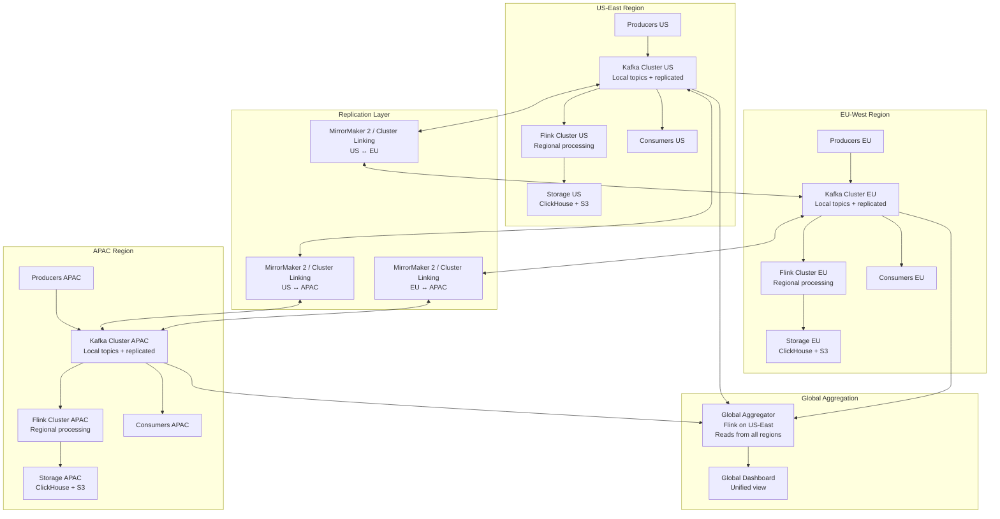
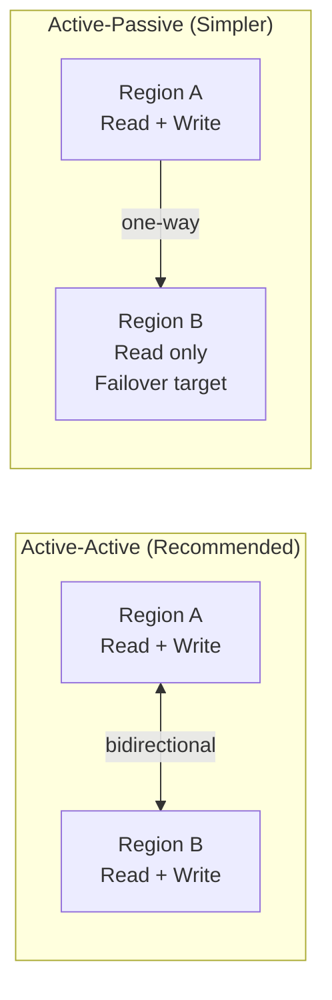
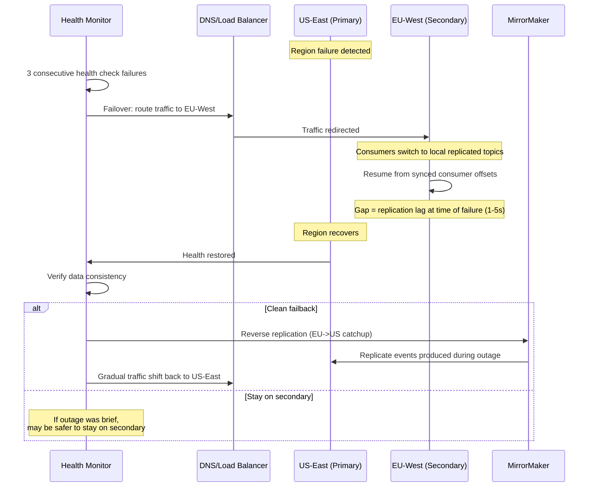

# Multi-Region Streaming Architecture

## Problem Statement

Global financial institutions, multinational platforms, and regulatory-compliant organizations need streaming data architectures that span multiple geographic regions. Challenges include:

- **Regulatory compliance**: GDPR requires EU data to stay in EU; similar for China, India, Brazil
- **Disaster recovery**: Entire region failure must not cause data loss or prolonged outage
- **Latency**: Users in Tokyo cannot wait 200ms round-trip to a US-East Kafka cluster
- **Active-active**: Both regions must serve reads AND writes simultaneously
- **Conflict resolution**: What happens when same entity is updated in two regions at once?
- **Cross-region aggregation**: Global dashboards need data from all regions combined
- **Cost**: Cross-region bandwidth at petabyte scale is expensive

Scale: 3+ regions, 5M events/sec per region, <100ms intra-region latency, <5s cross-region replication lag, 99.99% availability.

## Architecture Diagram



## Replication Topologies

### Active-Active vs Active-Passive



| Aspect | Active-Active | Active-Passive |
|--------|--------------|----------------|
| Write availability | Both regions | Primary only |
| Failover time | Near-instant | 30s-5min (promote passive) |
| Conflict potential | Yes (needs resolution) | None |
| Bandwidth cost | Higher (bidirectional) | Lower (one-way) |
| Complexity | High | Medium |
| Use case | Trading, global apps | DR-only, batch analytics |

### MirrorMaker 2 Configuration

```properties
# mm2.properties - Multi-region replication
clusters = us-east, eu-west, apac

# Cluster connection configs
us-east.bootstrap.servers = kafka-us-east-1:9092,kafka-us-east-2:9092
eu-west.bootstrap.servers = kafka-eu-west-1:9092,kafka-eu-west-2:9092
apac.bootstrap.servers = kafka-apac-1:9092,kafka-apac-2:9092

# Replication flows (bidirectional for active-active)
us-east->eu-west.enabled = true
eu-west->us-east.enabled = true
us-east->apac.enabled = true
apac->us-east.enabled = true
eu-west->apac.enabled = true
apac->eu-west.enabled = true

# Topic selection
us-east->eu-west.topics = orders\..*, payments\..*, users\..*
eu-west->us-east.topics = orders\..*, payments\..*, users\..*

# Exclude internal and already-replicated topics (prevent loops)
us-east->eu-west.topics.exclude = .*\.internal, eu-west\..*., apac\..*
eu-west->us-east.topics.exclude = .*\.internal, us-east\..*., apac\..*

# Replication settings
replication.factor = 3
sync.topic.configs.enabled = true
sync.topic.acls.enabled = true
refresh.topics.interval.seconds = 30
refresh.groups.interval.seconds = 30

# Consumer group offset sync (for failover)
emit.checkpoints.enabled = true
emit.checkpoints.interval.seconds = 10
sync.group.offsets.enabled = true
sync.group.offsets.interval.seconds = 10

# Performance tuning
tasks.max = 32
producer.buffer.memory = 134217728
producer.batch.size = 524288
producer.linger.ms = 100
consumer.fetch.max.bytes = 52428800
consumer.max.poll.records = 2000
```

### Confluent Cluster Linking (Alternative)

```properties
# More efficient than MM2 - broker-level replication
# No consumer/producer overhead, lower latency

confluent.cluster.link.name = us-to-eu-link
bootstrap.servers = kafka-eu-west-1:9092
link.mode = BIDIRECTIONAL
acl.sync.enable = true

# Automatic topic mirroring
auto.create.mirror.topics.enable = true
auto.create.mirror.topics.filters = {"topicFilters": [
    {"name": "orders.*", "patternType": "PREFIXED", "filterType": "INCLUDE"},
    {"name": "payments.*", "patternType": "PREFIXED", "filterType": "INCLUDE"}
]}

# Consumer offset mirroring
consumer.group.prefix.enable = false
consumer.offset.sync.enable = true
consumer.offset.sync.ms = 5000
```

## Conflict Resolution

### Last-Writer-Wins (LWW) with Vector Clocks

```java
/**
 * Conflict resolution for active-active writes.
 * When same entity is modified in two regions simultaneously.
 */
public class ConflictResolver extends KeyedProcessFunction<String, RegionalEvent, ResolvedEvent> {

    private ValueState<VectorClock> vectorClockState;
    private ValueState<ResolvedEvent> lastResolvedState;

    // Buffer concurrent updates within conflict window
    private ListState<RegionalEvent> conflictBufferState;
    private static final Duration CONFLICT_WINDOW = Duration.ofSeconds(5);

    @Override
    public void processElement(RegionalEvent event, Context ctx, Collector<ResolvedEvent> out) {
        VectorClock currentClock = vectorClockState.value();
        if (currentClock == null) currentClock = new VectorClock();

        VectorClock eventClock = event.getVectorClock();

        VectorClock.Comparison comparison = currentClock.compareTo(eventClock);

        switch (comparison) {
            case BEFORE:
                // Event is strictly newer - apply it
                currentClock.merge(eventClock);
                vectorClockState.update(currentClock);
                out.collect(resolveEvent(event, "ACCEPTED"));
                break;

            case AFTER:
                // Event is strictly older - discard
                // (already have a newer version)
                break;

            case CONCURRENT:
                // TRUE CONFLICT - same entity modified in two regions
                conflictBufferState.add(event);
                // Set timer to resolve after conflict window
                ctx.timerService().registerProcessingTimeTimer(
                    ctx.timerService().currentProcessingTime() + CONFLICT_WINDOW.toMillis());
                break;

            case EQUAL:
                // Duplicate - idempotent, ignore
                break;
        }
    }

    @Override
    public void onTimer(long timestamp, OnTimerContext ctx, Collector<ResolvedEvent> out) {
        List<RegionalEvent> conflicts = Lists.newArrayList(conflictBufferState.get());
        if (conflicts.isEmpty()) return;

        // Resolution strategy depends on data type
        ResolvedEvent resolved = resolveConflicts(conflicts);
        out.collect(resolved);

        // Update vector clock with merged result
        VectorClock merged = VectorClock.merge(
            conflicts.stream().map(RegionalEvent::getVectorClock).collect(toList()));
        vectorClockState.update(merged);
        conflictBufferState.clear();
    }

    private ResolvedEvent resolveConflicts(List<RegionalEvent> conflicts) {
        // Strategy 1: Last-Writer-Wins (wall clock)
        // Simple but can lose data
        RegionalEvent lww = conflicts.stream()
            .max(Comparator.comparingLong(RegionalEvent::getWallClockTimestamp))
            .orElseThrow();

        // Strategy 2: Merge (for CRDTs)
        // Complex but preserves all changes
        // e.g., for counters: sum all increments
        // e.g., for sets: union all additions, intersect removals

        // Strategy 3: Business rule based
        // e.g., for financial: highest priority region wins
        // e.g., for user profile: most recent per-field merge

        return resolveEvent(lww, "CONFLICT_RESOLVED_LWW");
    }
}

/**
 * Vector clock implementation for causal ordering across regions.
 */
public class VectorClock {
    private Map<String, Long> clock; // region -> logical timestamp

    public void increment(String region) {
        clock.merge(region, 1L, Long::sum);
    }

    public void merge(VectorClock other) {
        for (Map.Entry<String, Long> entry : other.clock.entrySet()) {
            clock.merge(entry.getKey(), entry.getValue(), Math::max);
        }
    }

    public Comparison compareTo(VectorClock other) {
        boolean allLessOrEqual = true;
        boolean allGreaterOrEqual = true;

        Set<String> allRegions = new HashSet<>(clock.keySet());
        allRegions.addAll(other.clock.keySet());

        for (String region : allRegions) {
            long mine = clock.getOrDefault(region, 0L);
            long theirs = other.clock.getOrDefault(region, 0L);
            if (mine > theirs) allLessOrEqual = false;
            if (mine < theirs) allGreaterOrEqual = false;
        }

        if (allLessOrEqual && !allGreaterOrEqual) return Comparison.BEFORE;
        if (allGreaterOrEqual && !allLessOrEqual) return Comparison.AFTER;
        if (allLessOrEqual && allGreaterOrEqual) return Comparison.EQUAL;
        return Comparison.CONCURRENT;
    }
}
```

## Geo-Routing

### Request Routing Strategy

```python
class GeoRouter:
    """
    Routes events to the correct regional Kafka cluster based on:
    1. User's physical location (latency optimization)
    2. Data residency requirements (compliance)
    3. Cluster health (failover)
    """

    REGION_MAP = {
        # Country -> Primary Region, Fallback Region
        'US': ('us-east', 'us-west'),
        'CA': ('us-east', 'eu-west'),
        'UK': ('eu-west', 'us-east'),
        'DE': ('eu-west', 'us-east'),
        'FR': ('eu-west', 'us-east'),
        'JP': ('apac', 'us-west'),
        'AU': ('apac', 'us-west'),
        'IN': ('apac', 'eu-west'),
        'CN': ('apac-cn', None),  # China: no fallback outside China
        'BR': ('latam', 'us-east'),
    }

    # GDPR: these countries' PII data MUST stay in EU
    EU_DATA_RESIDENCY = {'DE', 'FR', 'IT', 'ES', 'NL', 'PL', 'SE', 'AT', 'BE', 
                         'IE', 'PT', 'FI', 'DK', 'CZ', 'RO', 'HU', 'BG', 'HR'}

    def route(self, event: Event) -> str:
        country = event.user_country

        # Rule 1: Data residency (overrides everything)
        if country in self.EU_DATA_RESIDENCY and event.contains_pii:
            return 'eu-west'  # Must stay in EU, no exceptions

        # Rule 2: Primary region based on geography
        primary, fallback = self.REGION_MAP.get(country, ('us-east', None))

        # Rule 3: Health check (failover if primary is degraded)
        if not self.is_healthy(primary):
            if fallback and self.is_healthy(fallback):
                return fallback
            # All regions degraded - queue locally
            raise RegionUnavailableError(f"No healthy region for {country}")

        return primary

    def is_healthy(self, region: str) -> bool:
        """Check region health: latency, error rate, capacity."""
        health = self.health_cache.get(region)
        return (health.latency_p99_ms < 100 and
                health.error_rate < 0.01 and
                health.capacity_remaining > 0.1)
```

## Cross-Region Latency Optimization

### Techniques

| Technique | Latency Savings | Trade-off |
|-----------|----------------|-----------|
| Regional processing first | -200ms (no cross-region hop) | Eventual consistency |
| Async replication | Pipeline not blocked | Replication lag (1-5s) |
| Compression (zstd) | 30% bandwidth reduction | +5ms CPU overhead |
| Batch replication | Amortize network overhead | +100ms latency |
| Dedicated inter-region links | -50ms (vs public internet) | Higher cost |
| Data locality (route to nearest) | -100-200ms | Complex routing |

### Network Configuration

```yaml
# Cross-region network optimization
inter_region_links:
  us_east_to_eu_west:
    type: aws_transit_gateway_peering  # or dedicated interconnect
    bandwidth: 10Gbps
    latency_target: 80ms
    encryption: TLS 1.3
    compression: zstd_level_3

  us_east_to_apac:
    type: aws_transit_gateway_peering
    bandwidth: 5Gbps
    latency_target: 150ms
    encryption: TLS 1.3
    compression: zstd_level_5  # Higher compression for higher latency

# MirrorMaker tuning for each link
mm2_tuning:
  low_latency_links:  # US-EU (80ms RTT)
    producer.linger.ms: 50
    producer.batch.size: 262144  # 256KB
    tasks.max: 16
    
  high_latency_links:  # US-APAC (150ms RTT)
    producer.linger.ms: 200
    producer.batch.size: 1048576  # 1MB (larger batch, amortize RTT)
    tasks.max: 32
    producer.buffer.memory: 268435456  # 256MB
```

## Regional Flink Processing

```java
/**
 * Each region runs its own Flink cluster for local processing.
 * Global aggregation runs in a designated "aggregation region" (US-East).
 */
public class RegionalProcessingJob {

    public static void main(String[] args) throws Exception {
        String region = System.getenv("REGION");  // us-east, eu-west, apac

        StreamExecutionEnvironment env = StreamExecutionEnvironment.getExecutionEnvironment();

        // Process local events
        DataStream<Event> localEvents = env.addSource(
            createKafkaSource(region, "orders.*"));

        // Regional aggregation (per-region metrics)
        DataStream<RegionalMetric> regionalMetrics = localEvents
            .keyBy(Event::getEntityId)
            .window(TumblingEventTimeWindows.of(Time.minutes(1)))
            .aggregate(new MetricsAggregator());

        // Write regional results locally
        regionalMetrics.addSink(createLocalClickHouseSink(region));

        // Also publish to global aggregation topic
        regionalMetrics
            .map(m -> m.withRegion(region))
            .addSink(createKafkaSink(region, "global-metrics-" + region));

        env.execute("Regional Processing - " + region);
    }
}

/**
 * Global aggregation job (runs in US-East, consumes from all regions).
 */
public class GlobalAggregationJob {

    public static void main(String[] args) throws Exception {
        StreamExecutionEnvironment env = StreamExecutionEnvironment.getExecutionEnvironment();

        // Consume regional metrics from all regions
        DataStream<RegionalMetric> usMetrics = env.addSource(
            createKafkaSource("us-east", "global-metrics-us-east"));
        DataStream<RegionalMetric> euMetrics = env.addSource(
            createKafkaSource("us-east", "eu-west.global-metrics-eu-west"));  // Replicated topic
        DataStream<RegionalMetric> apMetrics = env.addSource(
            createKafkaSource("us-east", "apac.global-metrics-apac"));

        // Union all regional streams
        DataStream<RegionalMetric> allMetrics = usMetrics.union(euMetrics, apMetrics);

        // Global aggregation with watermark alignment
        DataStream<GlobalMetric> globalMetrics = allMetrics
            .assignTimestampsAndWatermarks(
                WatermarkStrategy.<RegionalMetric>forBoundedOutOfOrderness(Duration.ofSeconds(30))
                    // Account for cross-region replication lag
                    .withIdleness(Duration.ofMinutes(2)))
            .keyBy(RegionalMetric::getEntityId)
            .window(TumblingEventTimeWindows.of(Time.minutes(5)))
            .aggregate(new GlobalMetricsAggregator());

        globalMetrics.addSink(createGlobalDashboardSink());
        env.execute("Global Aggregation");
    }
}
```

## Failover Strategy



### Failover Automation

```python
class RegionFailoverOrchestrator:
    """Automated region failover with safety checks."""

    def __init__(self):
        self.min_failover_confidence = 0.95
        self.consecutive_failures_threshold = 3
        self.cooldown_period = timedelta(minutes=10)
        self.last_failover = None

    async def evaluate_failover(self, region: str, health: RegionHealth):
        if self.last_failover and (datetime.now() - self.last_failover) < self.cooldown_period:
            return  # Cooldown prevents flapping

        if health.consecutive_failures >= self.consecutive_failures_threshold:
            # Verify it's a real outage (not monitoring issue)
            cross_check = await self.cross_region_health_check(region)
            if cross_check.confirms_outage:
                await self.execute_failover(region)

    async def execute_failover(self, failed_region: str):
        target_region = self.get_failover_target(failed_region)

        # Step 1: Verify target region is healthy
        target_health = await self.check_health(target_region)
        assert target_health.is_healthy, f"Target {target_region} also unhealthy!"

        # Step 2: Check replication lag
        lag = await self.get_replication_lag(failed_region, target_region)
        logger.info(f"Replication lag at failover: {lag.max_lag_ms}ms")

        # Step 3: Update DNS/routing
        await self.update_routing(failed_region, target_region)

        # Step 4: Activate consumers on target (if not already active-active)
        await self.activate_consumers(target_region, failed_region)

        # Step 5: Alert operations
        await self.alert_operations(
            f"FAILOVER: {failed_region} -> {target_region}, "
            f"replication lag: {lag.max_lag_ms}ms, "
            f"potential data gap: {lag.max_lag_ms}ms")

        self.last_failover = datetime.now()
```

## Scaling Strategies

### Per-Region Sizing

| Region | Events/sec | Kafka Brokers | Kafka Partitions | Flink Parallelism | Storage |
|--------|-----------|---------------|-----------------|-------------------|---------|
| US-East | 5M | 24 | 256 | 128 | 500TB |
| EU-West | 3M | 16 | 192 | 96 | 300TB |
| APAC | 4M | 20 | 224 | 112 | 400TB |
| Global Agg | Aggregated only | - | - | 32 | 100TB |

### Cross-Region Bandwidth

```
US-East -> EU-West:
  Raw event rate: 5M events/sec × avg 500 bytes = 2.5 GB/s
  After compression (zstd 3:1): ~830 MB/s
  After filtering (only replicated topics, 30%): ~250 MB/s
  Monthly bandwidth cost: 250 MB/s × 86400s × 30 × $0.02/GB = $12,960/month

Total cross-region bandwidth (all links): ~$50,000/month
```

## Cost Optimization

```
Total multi-region infrastructure:

US-East:  $180,000/month (primary, largest)
EU-West:  $120,000/month
APAC:     $150,000/month
Cross-region networking: $50,000/month
Global aggregation: $20,000/month

Total: ~$520,000/month

Optimization strategies:
1. Selective replication (only replicate 30% of topics): saves $15K/month
2. Compression at source (zstd): saves $10K/month bandwidth
3. Regional processing first (reduce cross-region queries): saves $20K/month
4. Reserved instances (3yr): saves $150K/month (30% discount)
5. Spot for Flink workers (with checkpointing): saves $40K/month

Optimized total: ~$285,000/month
```

## Real-World Companies

| Company | Regions | Pattern | Key Innovation |
|---------|---------|---------|---------------|
| Confluent | Multi-cloud | Cluster Linking | Broker-level replication |
| Goldman Sachs | US + EU + APAC | Active-active | Custom conflict resolution |
| Uber | 20+ cities | Regional Kafka | Per-city clusters |
| Netflix | US + EU | Active-active | Custom replication framework |
| Stripe | US + EU | Active-passive per data type | GDPR-compliant routing |
| Cloudflare | 200+ PoPs | Edge streaming | Durable Objects for state |
| Wise (TransferWise) | Multi-region | Event sourcing + replication | Financial consistency |

## Key Design Decisions

1. **Active-active over active-passive**: Eliminates failover delay for global users
2. **Vector clocks over wall clocks**: Handles clock skew between regions correctly
3. **Regional processing first**: Don't add 200ms latency for cross-region hop on every query
4. **Topic prefixing for replicated topics**: `eu-west.orders` prevents loops
5. **Consumer offset sync every 10s**: Limits data loss on failover to 10s maximum
6. **Bounded watermark (30s) for global aggregation**: Accounts for replication lag
7. **Selective replication**: Not all topics need multi-region - only customer-facing data
8. **Conflict window of 5s**: If same key modified in two regions within 5s, treat as conflict
