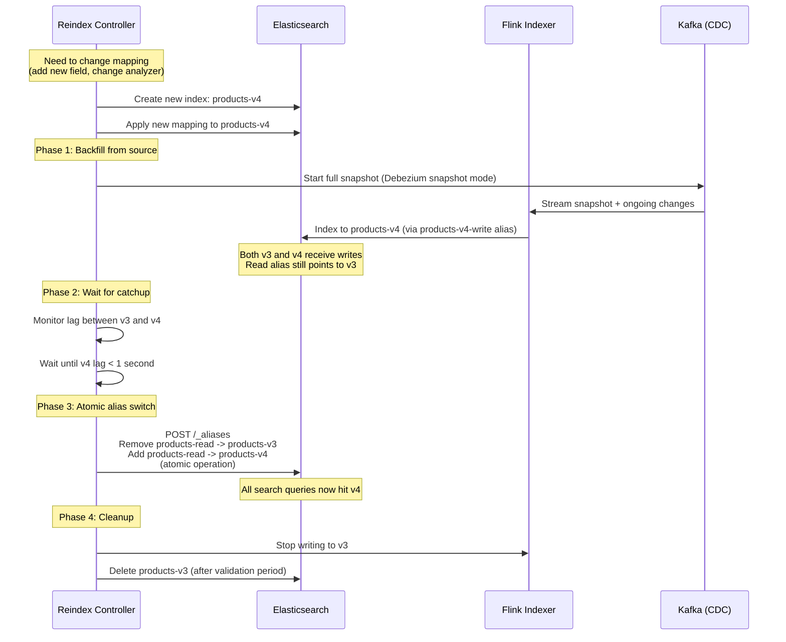

# Real-Time Search Index Updates

## Problem Statement

E-commerce platforms, content sites, and SaaS products require search results to reflect database changes within seconds. When a product price changes, an article is published, or a user updates their profile, the search index must update immediately. At scale:

- **100K+ document updates/second** across hundreds of database tables
- **Zero-downtime reindexing** when search mappings change
- **Consistency**: Search results must never show stale data for >5 seconds
- **Relevance scoring updates**: Real-time signals (clicks, purchases) must affect ranking
- **Multi-tenant isolation**: Index updates for one tenant cannot impact others
- **Schema changes**: Adding new searchable fields without rebuilding entire index

The pipeline: Database changes (via CDC) flow through Kafka, get transformed by Flink, and land in Elasticsearch with proper bulk indexing, alias management, and zero-downtime operations.

## Architecture Diagram

```mermaid
graph TB
    subgraph "Source Databases"
        PG[PostgreSQL<br/>Products, Users, Orders]
        MY[MySQL<br/>Content, Articles]
        MG[MongoDB<br/>Reviews, Comments]
    end

    subgraph "CDC Layer"
        D1[Debezium PostgreSQL<br/>WAL-based CDC]
        D2[Debezium MySQL<br/>Binlog-based CDC]
        D3[Debezium MongoDB<br/>Oplog-based CDC]
    end

    subgraph "Kafka"
        KC[CDC Topics<br/>dbserver.schema.table<br/>256 partitions]
        KT[Transformed Topics<br/>search-documents<br/>128 partitions]
        KR[Relevance Signals<br/>clicks, purchases<br/>64 partitions]
        SR[Schema Registry<br/>Avro schemas]
    end

    subgraph "Flink Processing"
        F1[Document Builder<br/>Multi-table join/denormalization]
        F2[Relevance Updater<br/>Real-time scoring signals]
        F3[Bulk Batcher<br/>Elasticsearch bulk API optimizer]
        F4[Reindex Controller<br/>Full reindex orchestration]
    end

    subgraph "Elasticsearch Cluster"
        ES_H[Hot Nodes (NVMe)<br/>Current index]
        ES_W[Warm Nodes (SSD)<br/>Previous index version]
        ES_A[Alias Manager<br/>Zero-downtime switching]
        ES_I[ILM Policy<br/>Index lifecycle]
    end

    subgraph "Serving"
        API[Search API<br/>Query + filter]
        SUG[Suggestions API<br/>Autocomplete]
        REC[Recommendations<br/>Similar items]
    end

    PG --> D1
    MY --> D2
    MG --> D3
    D1 & D2 & D3 --> KC
    KC --> F1
    KR --> F2
    F1 --> KT
    F2 --> KT
    KT --> F3
    F3 --> ES_H
    F4 --> ES_W
    ES_H & ES_W --> ES_A
    ES_A --> API & SUG & REC
    SR --> D1 & D2 & D3
```

## Debezium CDC Configuration

### PostgreSQL Source Connector

```json
{
  "name": "pg-products-source",
  "config": {
    "connector.class": "io.debezium.connector.postgresql.PostgresConnector",
    "database.hostname": "products-primary.internal",
    "database.port": "5432",
    "database.user": "debezium",
    "database.password": "${secrets:pg-cdc-password}",
    "database.dbname": "products",
    "database.server.name": "products-db",

    "plugin.name": "pgoutput",
    "publication.name": "cdc_publication",
    "slot.name": "debezium_products",

    "table.include.list": "public.products,public.categories,public.brands,public.inventory,public.prices",

    "transforms": "route,unwrap",
    "transforms.route.type": "io.debezium.transforms.ByLogicalTableRouter",
    "transforms.route.topic.regex": "(.*)\\.(.*)\\.(.*)$",
    "transforms.route.topic.replacement": "cdc.$3",
    "transforms.unwrap.type": "io.debezium.transforms.ExtractNewRecordState",
    "transforms.unwrap.add.fields": "op,ts_ms,source.ts_ms",
    "transforms.unwrap.delete.handling.mode": "rewrite",

    "key.converter": "io.confluent.connect.avro.AvroConverter",
    "key.converter.schema.registry.url": "http://schema-registry:8081",
    "value.converter": "io.confluent.connect.avro.AvroConverter",
    "value.converter.schema.registry.url": "http://schema-registry:8081",

    "heartbeat.interval.ms": "10000",
    "snapshot.mode": "initial",
    "tombstones.on.delete": "true",
    "producer.override.max.request.size": "10485760",
    "producer.override.compression.type": "zstd"
  }
}
```

## Flink Document Builder

```java
/**
 * Joins multiple CDC streams into denormalized search documents.
 * Product search document = product + category + brand + price + inventory.
 */
public class SearchDocumentBuilder {

    public static void main(String[] args) throws Exception {
        StreamExecutionEnvironment env = StreamExecutionEnvironment.getExecutionEnvironment();
        env.enableCheckpointing(30_000, CheckpointingMode.EXACTLY_ONCE);
        env.setStateBackend(new EmbeddedRocksDBStateBackend(true));

        // CDC streams
        DataStream<ProductChange> products = createCDCStream(env, "cdc.products");
        DataStream<CategoryChange> categories = createCDCStream(env, "cdc.categories");
        DataStream<BrandChange> brands = createCDCStream(env, "cdc.brands");
        DataStream<PriceChange> prices = createCDCStream(env, "cdc.prices");
        DataStream<InventoryChange> inventory = createCDCStream(env, "cdc.inventory");

        // Build KTables for dimension data
        StreamTableEnvironment tableEnv = StreamTableEnvironment.create(env);

        // Categories as temporal table (keyed by category_id)
        Table categoryTable = tableEnv.fromChangelogStream(categories);
        tableEnv.createTemporaryView("categories", categoryTable);

        // Brands as temporal table
        Table brandTable = tableEnv.fromChangelogStream(brands);
        tableEnv.createTemporaryView("brands", brandTable);

        // Products join with dimensions to create search documents
        DataStream<SearchDocument> searchDocs = products
            .keyBy(ProductChange::getProductId)
            .connect(prices.keyBy(PriceChange::getProductId))
            .process(new ProductPriceJoiner())
            .keyBy(ProductWithPrice::getProductId)
            .connect(inventory.keyBy(InventoryChange::getProductId))
            .process(new DocumentEnricher());

        // Enrich with category and brand (lookup join)
        DataStream<SearchDocument> enrichedDocs = searchDocs
            .process(new DimensionLookupFunction(categoryTable, brandTable));

        // Output to Kafka for bulk indexing
        enrichedDocs.sinkTo(createKafkaSink("search-documents"));

        env.execute("Search Document Builder");
    }
}

public class ProductPriceJoiner
    extends KeyedCoProcessFunction<String, ProductChange, PriceChange, ProductWithPrice> {

    private ValueState<ProductChange> productState;
    private ValueState<PriceChange> priceState;

    @Override
    public void open(Configuration params) {
        // TTL: clean up if product deleted
        StateTtlConfig ttl = StateTtlConfig.newBuilder(Time.days(1))
            .setUpdateType(StateTtlConfig.UpdateType.OnCreateAndWrite)
            .build();

        ValueStateDescriptor<ProductChange> productDesc =
            new ValueStateDescriptor<>("product", ProductChange.class);
        productDesc.enableTimeToLive(ttl);
        productState = getRuntimeContext().getState(productDesc);

        ValueStateDescriptor<PriceChange> priceDesc =
            new ValueStateDescriptor<>("price", PriceChange.class);
        priceDesc.enableTimeToLive(ttl);
        priceState = getRuntimeContext().getState(priceDesc);
    }

    @Override
    public void processElement1(ProductChange product, Context ctx,
                                Collector<ProductWithPrice> out) {
        if (product.isDelete()) {
            // Product deleted - emit tombstone
            out.collect(ProductWithPrice.tombstone(product.getProductId()));
            productState.clear();
            return;
        }
        productState.update(product);
        emitIfComplete(out);
    }

    @Override
    public void processElement2(PriceChange price, Context ctx,
                                Collector<ProductWithPrice> out) {
        priceState.update(price);
        emitIfComplete(out);
    }

    private void emitIfComplete(Collector<ProductWithPrice> out) {
        ProductChange product = productState.value();
        PriceChange price = priceState.value();
        if (product != null && price != null) {
            out.collect(new ProductWithPrice(product, price));
        } else if (product != null) {
            // Emit with null price (product exists but no price yet)
            out.collect(new ProductWithPrice(product, null));
        }
    }
}
```

## Elasticsearch Bulk Indexing

```java
/**
 * Optimized bulk indexer for Elasticsearch.
 * Batches documents and uses bulk API for throughput.
 * Handles backpressure, retries, and partial failures.
 */
public class ElasticsearchBulkIndexer extends RichSinkFunction<SearchDocument>
    implements CheckpointedFunction {

    private transient RestHighLevelClient esClient;
    private transient BulkProcessor bulkProcessor;
    private List<SearchDocument> pendingDocs;

    private static final int BULK_SIZE = 5000;         // Documents per bulk
    private static final int BULK_SIZE_MB = 15;        // MB per bulk
    private static final int FLUSH_INTERVAL_MS = 1000; // Max wait before flush
    private static final int CONCURRENT_REQUESTS = 4;  // Parallel bulk requests
    private static final int RETRY_COUNT = 3;

    @Override
    public void open(Configuration parameters) {
        esClient = createClient();
        bulkProcessor = BulkProcessor.builder(
            (request, listener) -> esClient.bulkAsync(request, RequestOptions.DEFAULT, listener),
            new BulkProcessorListener())
            .setBulkActions(BULK_SIZE)
            .setBulkSize(new ByteSizeValue(BULK_SIZE_MB, ByteSizeUnit.MB))
            .setFlushInterval(TimeValue.timeValueMillis(FLUSH_INTERVAL_MS))
            .setConcurrentRequests(CONCURRENT_REQUESTS)
            .setBackoffPolicy(BackoffPolicy.exponentialBackoff(
                TimeValue.timeValueMillis(100), RETRY_COUNT))
            .build();
    }

    @Override
    public void invoke(SearchDocument doc, SinkFunction.Context context) {
        String indexName = getIndexName(doc);
        String docId = doc.getDocumentId();

        if (doc.isTombstone()) {
            // Delete document
            bulkProcessor.add(new DeleteRequest(indexName, docId));
        } else {
            // Upsert document
            IndexRequest request = new IndexRequest(indexName)
                .id(docId)
                .source(doc.toJson(), XContentType.JSON)
                .setIfSeqNo(doc.getSeqNo())        // Optimistic concurrency
                .setIfPrimaryTerm(doc.getPrimaryTerm());

            bulkProcessor.add(request);
        }
        pendingDocs.add(doc);
    }

    private String getIndexName(SearchDocument doc) {
        // Use alias for zero-downtime operations
        // Actual index: products-v3-2024-01
        // Write alias: products-write (points to current version)
        return doc.getCollection() + "-write";
    }

    class BulkProcessorListener implements BulkProcessor.Listener {
        @Override
        public void afterBulk(long executionId, BulkRequest request, BulkResponse response) {
            if (response.hasFailures()) {
                // Handle partial failures
                for (BulkItemResponse item : response.getItems()) {
                    if (item.isFailed()) {
                        BulkItemResponse.Failure failure = item.getFailure();
                        if (failure.getStatus() == RestStatus.CONFLICT) {
                            // Version conflict - stale update, safe to ignore
                            conflictCounter.inc();
                        } else {
                            // Real failure - route to DLQ
                            dlqSink.send(pendingDocs.get(item.getItemId()), failure.getMessage());
                            failureCounter.inc();
                        }
                    }
                }
            }
            successCounter.inc(request.numberOfActions());
        }
    }
}
```

## Zero-Downtime Reindexing



### Reindex Controller Implementation

```python
class ReindexController:
    """Orchestrates zero-downtime reindexing."""

    def __init__(self, es_client, kafka_admin, flink_client):
        self.es = es_client
        self.kafka = kafka_admin
        self.flink = flink_client

    async def execute_reindex(self, collection: str, new_mapping: dict):
        current_version = await self.get_current_version(collection)
        new_version = current_version + 1
        new_index = f"{collection}-v{new_version}"

        # Phase 1: Create new index with new mapping
        await self.es.indices.create(
            index=new_index,
            body={
                "settings": self.get_index_settings(collection),
                "mappings": new_mapping,
                "aliases": {
                    f"{collection}-write-v{new_version}": {}  # Temp write alias
                }
            }
        )

        # Phase 2: Start dual-writing (Flink writes to both old and new)
        await self.flink.update_job_config(
            job_id=f"{collection}-indexer",
            config={"target_indices": [
                f"{collection}-v{current_version}",
                new_index
            ]}
        )

        # Phase 3: Trigger full backfill
        await self.trigger_snapshot(collection)

        # Phase 4: Wait for new index to catch up
        while True:
            lag = await self.measure_index_lag(collection, new_index)
            if lag.max_lag_seconds < 1:
                break
            await asyncio.sleep(5)

        # Phase 5: Atomic alias switch
        await self.es.indices.update_aliases(body={
            "actions": [
                {"remove": {"index": f"{collection}-v{current_version}",
                            "alias": f"{collection}-read"}},
                {"add": {"index": new_index, "alias": f"{collection}-read"}},
                {"remove": {"index": f"{collection}-v{current_version}",
                            "alias": f"{collection}-write"}},
                {"add": {"index": new_index, "alias": f"{collection}-write"}},
            ]
        })

        # Phase 6: Verify and cleanup
        await asyncio.sleep(300)  # 5 min validation period
        search_health = await self.verify_search_health(collection)
        if search_health.is_healthy:
            await self.flink.update_job_config(
                job_id=f"{collection}-indexer",
                config={"target_indices": [new_index]}
            )
            # Keep old index for 24h for rollback capability
            await self.schedule_deletion(f"{collection}-v{current_version}",
                                        delay=timedelta(hours=24))
```

## Relevance Scoring Updates

```java
/**
 * Real-time relevance signal incorporation.
 * Signals: clicks, purchases, add-to-cart, time-on-page.
 * Updates function_score parameters in Elasticsearch.
 */
public class RelevanceSignalProcessor
    extends KeyedProcessFunction<String, UserSignal, RelevanceUpdate> {

    // Windowed signal counts per product
    private ValueState<SignalAccumulator> signalState;

    @Override
    public void processElement(UserSignal signal, Context ctx, Collector<RelevanceUpdate> out) {
        SignalAccumulator acc = signalState.value();
        if (acc == null) acc = new SignalAccumulator(signal.getProductId());

        switch (signal.getType()) {
            case CLICK:
                acc.clicks1h++;
                acc.clicks24h++;
                break;
            case PURCHASE:
                acc.purchases1h++;
                acc.purchases24h++;
                break;
            case ADD_TO_CART:
                acc.addToCart1h++;
                break;
        }

        // Calculate real-time popularity score
        double popularityScore = calculatePopularity(acc);
        acc.popularityScore = popularityScore;
        signalState.update(acc);

        // Emit partial update (only popularity field)
        out.collect(RelevanceUpdate.builder()
            .productId(signal.getProductId())
            .updateType("PARTIAL")
            .field("popularity_score")
            .value(popularityScore)
            .field("clicks_1h")
            .value(acc.clicks1h)
            .build());
    }

    private double calculatePopularity(SignalAccumulator acc) {
        // Weighted combination of signals with time decay
        return (acc.clicks1h * 1.0 +
                acc.purchases1h * 10.0 +
                acc.addToCart1h * 3.0 +
                acc.clicks24h * 0.2 +
                acc.purchases24h * 2.0);
    }
}
```

### Elasticsearch Query with Real-Time Scoring

```json
{
  "query": {
    "function_score": {
      "query": {
        "multi_match": {
          "query": "wireless headphones",
          "fields": ["title^3", "description", "brand^2", "category"]
        }
      },
      "functions": [
        {
          "field_value_factor": {
            "field": "popularity_score",
            "modifier": "log1p",
            "factor": 0.5
          }
        },
        {
          "gauss": {
            "price": {
              "origin": 50,
              "scale": 30
            }
          },
          "weight": 0.3
        },
        {
          "filter": {"term": {"in_stock": true}},
          "weight": 5
        }
      ],
      "score_mode": "sum",
      "boost_mode": "multiply"
    }
  }
}
```

## Elasticsearch Cluster Configuration

```yaml
# Hot-warm architecture for search indices
cluster:
  name: search-production
  
  hot_nodes: 12
  hot_node_spec:
    instance_type: i3.2xlarge  # NVMe SSD
    storage: 1.9TB per node
    heap: 30GB
    roles: [data_hot, ingest]
    
  warm_nodes: 6
  warm_node_spec:
    instance_type: d3.2xlarge  # HDD
    storage: 12TB per node
    heap: 30GB
    roles: [data_warm]
    
  master_nodes: 3
  master_spec:
    instance_type: m5.xlarge
    heap: 8GB
    roles: [master]
    
  coordinating_nodes: 4
  coord_spec:
    instance_type: m5.2xlarge
    heap: 16GB
    roles: [coordinating]

# Index settings for high-throughput indexing
index_template:
  settings:
    number_of_shards: 12
    number_of_replicas: 1
    refresh_interval: "1s"  # Near-real-time search
    translog:
      durability: async
      sync_interval: "5s"
      flush_threshold_size: "1gb"
    merge:
      scheduler:
        max_thread_count: 2
    indexing:
      memory:
        index_buffer_size: "20%"
```

## Scaling Strategies

### Throughput Optimization

| Optimization | Impact | Setting |
|-------------|--------|---------|
| Bulk size = 5000 docs | +300% throughput | `bulk_actions: 5000` |
| Concurrent bulk = 4 | +200% throughput | `concurrent_requests: 4` |
| Refresh interval = 1s | +50% indexing speed | `refresh_interval: 1s` |
| Async translog | +100% indexing speed | `translog.durability: async` |
| Disable replicas during reindex | +100% for backfill | `number_of_replicas: 0` |
| Merge throttling off during reindex | +50% for backfill | `indices.store.throttle.type: none` |

### Index Sharding Strategy

```
Products index (50M documents):
  Shards: 12 (each shard ~4M docs, ~10GB)
  Replicas: 1 (total 24 shards across 12 hot nodes)
  Routing: by tenant_id (multi-tenant isolation)

Rules of thumb:
  - Max 50GB per shard (for recovery speed)
  - Max 20M documents per shard (for query performance)
  - Shards per node: 20-25 max (heap pressure)
  - Total shards in cluster: <1000 per GB of heap
```

## Failure Handling

### CDC Failure Scenarios

| Scenario | Detection | Recovery |
|----------|-----------|----------|
| Debezium connector crash | Connect health check | Auto-restart, resume from WAL/binlog position |
| WAL retention exceeded | Slot inactive error | Full snapshot + incremental |
| Elasticsearch bulk rejection | 429 response | Exponential backoff, reduce batch size |
| ES node failure | Cluster health yellow | Replica promotion, rebalance |
| Kafka lag spike | Consumer lag metric | Auto-scale Flink parallelism |
| Network partition (DB-Kafka) | Connector error metric | Retry with backoff, alert |

### Consistency Guarantees

```
End-to-end guarantee: AT LEAST ONCE

Why not exactly-once?
- Elasticsearch doesn't support transactions
- Bulk API can partially fail
- Network timeouts cause uncertainty

How we handle duplicates:
1. Document ID = deterministic (product_id)
2. Upsert (index) is idempotent
3. Version conflicts resolved by "latest wins" (seq_no)
4. Result: effectively exactly-once for search consumers
```

## Cost Optimization

```
Elasticsearch cluster (production):
  Hot nodes: 12 × i3.2xlarge = $8,640/month
  Warm nodes: 6 × d3.2xlarge = $3,600/month
  Master nodes: 3 × m5.xlarge = $540/month
  Coordinating: 4 × m5.2xlarge = $1,100/month
  Subtotal: $13,880/month

Kafka + Debezium:
  Kafka (16 brokers): $11,500/month
  Debezium Connect (8 workers): $2,400/month
  Subtotal: $13,900/month

Flink (document builder):
  32 TaskManagers × m5.2xlarge = $14,400/month

Total: ~$42,000/month for 100K doc updates/sec

Cost per document update: $0.000014
Cost per search query: $0.000003 (at 100K QPS)
```

### Optimization Techniques

1. **Skip unchanged fields**: Only reindex if searchable fields changed
2. **Partial updates**: Use `_update` API for score changes (no full reindex)
3. **Index lifecycle management**: Move old indices to warm nodes automatically
4. **Force merge old indices**: Reduce segment count = faster queries
5. **Source field filtering**: Don't store non-searchable fields in `_source`

## Real-World Companies

| Company | Scale | Key Pattern |
|---------|-------|-------------|
| Elasticsearch (Elastic) | Reference architecture | Official CDC connector |
| Shopify | 300M+ products | Custom indexing pipeline |
| Uber | 100K+ updates/sec | Custom ES + CDC framework |
| Airbnb | 7M+ listings | Near-real-time search with Kafka |
| LinkedIn | 800M+ profiles | Custom Galene search engine + CDC |
| Zalando | 500K products | Debezium + Kafka Connect |
| DoorDash | Restaurants + menus | CDC-based index sync |
| Etsy | 100M+ items | Custom search indexing pipeline |

## Key Design Decisions

1. **Debezium over application-level events**: Captures ALL changes including direct DB edits
2. **Denormalize at index time**: Join in Flink, not at query time in ES
3. **Alias-based routing**: Zero-downtime index switches without client changes
4. **Bulk API over single-doc**: 10-100x better throughput
5. **1-second refresh interval**: Balance between freshness and indexing throughput
6. **Document ID = entity ID**: Enables idempotent upserts
7. **Partial updates for scoring**: Don't rebuild entire document for popularity changes
8. **WAL-based CDC over trigger-based**: No database performance impact
